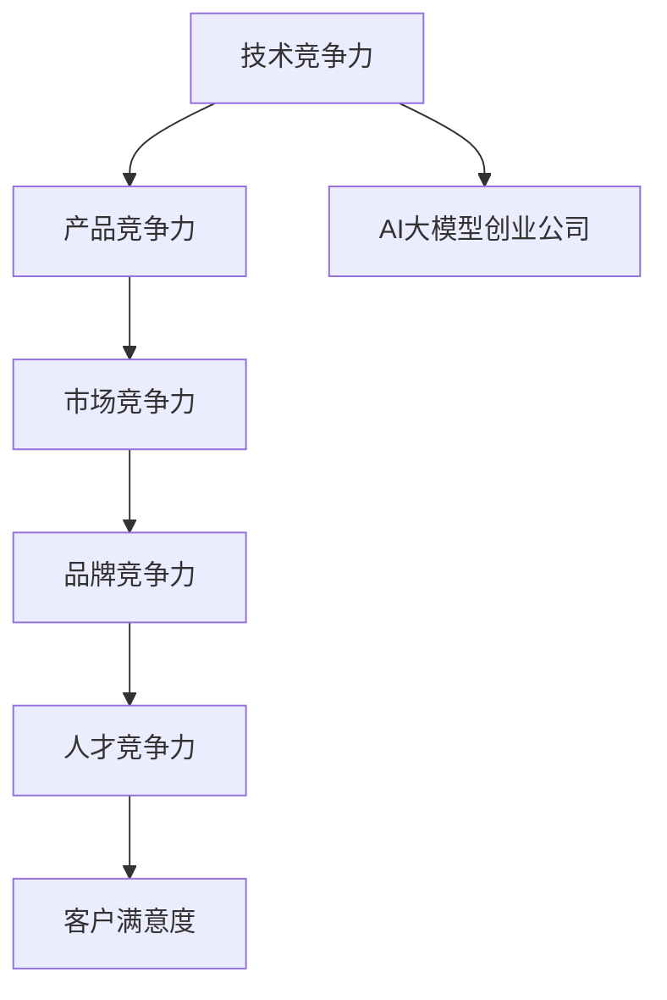

                 

## 1. 背景介绍

### 1.1 问题由来

随着人工智能(AI)技术的飞速发展，大模型创业公司如雨后春笋般涌现，竞争变得异常激烈。如何在这个竞争激烈的环境中脱颖而出，成为众多创业者和投资者的重要课题。本文将深入探讨AI大模型创业公司的核心竞争力构建，如何应对未来竞争对手，推动企业在技术、市场、品牌等多个维度全面领先。

### 1.2 问题核心关键点

面对AI大模型创业的激烈竞争，核心竞争力构建和未来竞争应对的关键点包括：

- **技术创新：**持续在算法、模型、框架上进行突破，提供领先的技术能力。
- **产品差异化：**在产品功能、用户体验、场景适配等方面打造独特卖点。
- **市场布局：**准确把握市场需求，制定合适的市场策略，开拓新领域。
- **品牌建设：**通过高质量的产品和服务，提升品牌知名度和用户信任度。
- **人才储备：**吸引和培养优秀人才，形成强大的技术团队。

本文将围绕这些关键点，全面分析AI大模型创业公司的核心竞争力构建与未来竞争应对策略。

## 2. 核心概念与联系

### 2.1 核心概念概述

- **AI大模型创业公司：**利用预训练大模型进行产品开发和技术创新的创业公司，例如OpenAI、Google、Amazon等。
- **技术竞争力：**指公司掌握的核心技术实力，包括算法创新、模型优化、框架优化等。
- **产品竞争力：**指公司产品能否满足市场需求，以及用户体验是否优秀。
- **市场竞争力：**指公司如何布局市场，开拓新市场，提升市场份额。
- **品牌竞争力：**指公司品牌在市场上的认知度和用户信任度。
- **人才竞争力：**指公司吸引和培养人才的能力，以及人才团队的整体实力。

这些核心概念通过以下Mermaid流程图连接：



此图展示了AI大模型创业公司的竞争力构建路径：技术领先推动产品创新，市场策略提升品牌认知，而高绩效人才保证用户满意度。

## 3. 核心算法原理 & 具体操作步骤

### 3.1 算法原理概述

AI大模型创业的核心在于利用预训练大模型进行产品开发和创新。预训练大模型通过在大规模无标签数据上自监督学习，获取丰富的语言表示能力，可以用于多种下游任务。公司需要通过微调等技术，使大模型适应特定任务，提升性能。

### 3.2 算法步骤详解

1. **数据准备：**收集和标注与公司产品相关的数据集，准备训练和验证数据。
2. **模型选择：**选择合适的预训练大模型，如BERT、GPT-3等，作为初始化参数。
3. **任务适配：**设计适合特定任务的任务适配层和损失函数，实现微调。
4. **超参数调优：**调整学习率、批大小、优化算法等超参数，优化模型性能。
5. **模型评估：**在验证集上评估模型性能，调整微调策略。
6. **产品部署：**将微调后的模型部署到产品中，实现功能上线。

### 3.3 算法优缺点

**优点：**
- 预训练大模型已经具有较高的通用能力，微调可以快速提升特定任务的性能。
- 通过微调，模型可以适应不同场景和需求，实现快速迭代和创新。
- 数据需求相对较少，能够在小规模数据上取得良好效果。

**缺点：**
- 微调过程依赖于标注数据，数据收集和标注成本较高。
- 模型泛化能力可能受数据分布的影响，存在一定风险。
- 微调过程需要较大的计算资源，可能存在技术门槛。

### 3.4 算法应用领域

AI大模型微调技术在NLP、计算机视觉、语音识别等多个领域有广泛应用，例如文本分类、情感分析、机器翻译、图像识别等。通过在特定领域进行微调，可以显著提升模型在该领域的性能，满足实际应用需求。

## 4. 数学模型和公式 & 详细讲解 & 举例说明

### 4.1 数学模型构建

基于监督学习的大模型微调，可以形式化为如下过程：

$$
\theta^* = \mathop{\arg\min}_{\theta} \mathcal{L}(D, M_{\theta})
$$

其中 $\theta$ 为模型参数，$D$ 为训练数据，$M_{\theta}$ 为微调后的模型。

### 4.2 公式推导过程

假设训练集 $D$ 包含 $n$ 个样本，每个样本 $(x_i, y_i)$，其中 $x_i$ 为输入，$y_i$ 为标签。微调目标为最小化损失函数 $\mathcal{L}(D, M_{\theta})$，该损失函数可以表示为：

$$
\mathcal{L}(D, M_{\theta}) = \frac{1}{n} \sum_{i=1}^n \ell(y_i, M_{\theta}(x_i))
$$

其中 $\ell$ 为损失函数，通常使用交叉熵损失。

### 4.3 案例分析与讲解

以机器翻译为例，假设有一个英文到中文的机器翻译任务，可以选用预训练的BERT模型，并对其进行微调。首先，将大量英文和中文的平行语料作为预训练数据，训练出通用语言表示模型 $M_{\theta}$。然后，选取一个小的训练集 $D$，包含一些英文到中文的翻译对，进行微调：

1. 任务适配：添加翻译层的输出层，定义交叉熵损失。
2. 超参数设置：选择适当的学习率、批大小和优化算法。
3. 模型训练：使用训练集 $D$ 进行微调，最小化损失函数。
4. 模型评估：在验证集上评估模型性能，调整微调策略。
5. 部署应用：将微调后的模型部署到翻译应用中，实现实时翻译功能。

## 5. 项目实践：代码实例和详细解释说明

### 5.1 开发环境搭建

以下是基于Python和PyTorch的开发环境搭建步骤：

1. 安装Anaconda：从官网下载并安装Anaconda。
2. 创建虚拟环境：
```bash
conda create -n my_env python=3.8
conda activate my_env
```

3. 安装PyTorch：
```bash
pip install torch torchtext
```

4. 安装其他工具包：
```bash
pip install numpy pandas sklearn nltk transformers
```

### 5.2 源代码详细实现

以下是一个基于BERT模型的机器翻译示例代码：

```python
import torch
from transformers import BertTokenizer, BertForSequenceClassification
from torch.utils.data import DataLoader, Dataset

class MyDataset(Dataset):
    def __init__(self, texts, labels, tokenizer):
        self.texts = texts
        self.labels = labels
        self.tokenizer = tokenizer
    
    def __len__(self):
        return len(self.texts)
    
    def __getitem__(self, idx):
        text = self.texts[idx]
        label = self.labels[idx]
        encoding = self.tokenizer(text, return_tensors='pt', padding='max_length', truncation=True)
        return {
            'text': text,
            'input_ids': encoding['input_ids'],
            'attention_mask': encoding['attention_mask'],
            'label': label
        }

tokenizer = BertTokenizer.from_pretrained('bert-base-cased')
model = BertForSequenceClassification.from_pretrained('bert-base-cased', num_labels=2)

# 数据准备
train_texts = ...
train_labels = ...
dev_texts = ...
dev_labels = ...

# 数据加载
train_dataset = MyDataset(train_texts, train_labels, tokenizer)
dev_dataset = MyDataset(dev_texts, dev_labels, tokenizer)

# 模型训练
device = 'cuda' if torch.cuda.is_available() else 'cpu'
model.to(device)

optimizer = torch.optim.Adam(model.parameters(), lr=2e-5)
criterion = torch.nn.CrossEntropyLoss()

for epoch in range(epochs):
    model.train()
    for batch in DataLoader(train_dataset, batch_size):
        input_ids = batch['input_ids'].to(device)
        attention_mask = batch['attention_mask'].to(device)
        labels = batch['label'].to(device)
        outputs = model(input_ids, attention_mask=attention_mask)
        loss = criterion(outputs.logits, labels)
        optimizer.zero_grad()
        loss.backward()
        optimizer.step()

    model.eval()
    with torch.no_grad():
        eval_loss = 0
        for batch in DataLoader(dev_dataset, batch_size):
            input_ids = batch['input_ids'].to(device)
            attention_mask = batch['attention_mask'].to(device)
            labels = batch['label'].to(device)
            outputs = model(input_ids, attention_mask=attention_mask)
            loss = criterion(outputs.logits, labels)
            eval_loss += loss.item()

        print(f'Epoch {epoch+1}, training loss: {loss:.3f}, validation loss: {eval_loss/len(dev_dataset):.3f}')
```

### 5.3 代码解读与分析

此代码展示了基于BERT模型的机器翻译微调过程。

1. 定义数据集 `MyDataset`：包含文本、标签和分词器。
2. 加载预训练模型 `BertForSequenceClassification` 和分词器 `BertTokenizer`。
3. 准备训练数据和验证数据。
4. 定义优化器和损失函数。
5. 循环迭代训练过程，计算损失并反向传播更新模型参数。
6. 在验证集上评估模型性能。

## 6. 实际应用场景

### 6.1 智能客服系统

AI大模型创业公司可以通过智能客服系统提升客户服务体验。使用微调后的模型，可以实现自动理解用户意图和生成自然语言回复。

### 6.2 金融舆情监测

金融公司可以利用微调模型进行舆情监测，及时发现和应对市场风险。通过分析社交媒体和新闻文本，预测市场情绪变化，指导投资决策。

### 6.3 个性化推荐系统

电商公司可以利用微调模型进行商品推荐，通过分析用户行为和偏好，实现个性化推荐，提升用户满意度和购物体验。

### 6.4 未来应用展望

未来AI大模型创业公司将进一步扩展应用场景，如智慧医疗、智能交通、智能家居等，推动各行各业的智能化进程。

## 7. 工具和资源推荐

### 7.1 学习资源推荐

1. 《Transformer from Pre-training to Fintuning》系列博客：深入介绍Transformer模型和微调技术。
2. Coursera《Deep Learning Specialization》课程：学习深度学习和自然语言处理。
3. arXiv论文：最新AI大模型和微调技术的研究成果。
4. GitHub开源项目：可参考的微调代码和模型。

### 7.2 开发工具推荐

1. PyTorch：灵活的深度学习框架，支持动态图和静态图。
2. TensorFlow：强大的分布式计算框架，支持GPU加速。
3. Transformers库：提供多种预训练模型的封装和微调支持。
4. TensorBoard：可视化工具，用于监控模型训练状态。

### 7.3 相关论文推荐

1. Attention is All You Need：Transformer模型的原始论文。
2. BERT: Pre-training of Deep Bidirectional Transformers for Language Understanding：提出BERT模型的论文。
3. Parameter-Efficient Transfer Learning for NLP：提出 Adapter 等参数高效微调方法的论文。

## 8. 总结：未来发展趋势与挑战

### 8.1 总结

本文深入探讨了AI大模型创业公司的核心竞争力构建，重点分析了技术、产品、市场、品牌和人才等关键因素。AI大模型微调技术在大模型创业公司中占据核心地位，能够快速提升特定任务性能。未来，通过不断优化技术、产品、市场和品牌，AI大模型创业公司将保持竞争优势。

### 8.2 未来发展趋势

未来AI大模型创业公司将面临以下发展趋势：

1. **技术突破：**持续在算法、模型、框架上进行技术创新，保持领先地位。
2. **产品迭代：**通过微调和优化，持续提升产品性能和用户体验。
3. **市场扩展：**开拓新市场，拓展业务范围。
4. **品牌建设：**提升品牌知名度和用户信任度。
5. **人才吸引：**吸引和培养更多优秀人才，形成强大的技术团队。

### 8.3 面临的挑战

AI大模型创业公司将面临以下挑战：

1. **技术竞争：**其他公司快速跟进技术创新，缩短差距。
2. **产品竞争：**竞争对手推出更先进的产品，抢占市场份额。
3. **市场竞争：**市场扩张和业务扩展需要大量资源投入。
4. **品牌竞争：**提升品牌知名度和用户信任度需要持续投入。
5. **人才竞争：**吸引和培养优秀人才需要提供具有竞争力的薪酬和职业发展机会。

### 8.4 研究展望

未来研究应集中在以下几个方向：

1. **多模态微调：**将视觉、语音等多模态数据与文本数据结合，提升模型的泛化能力。
2. **因果推断：**引入因果推断方法，增强模型的决策解释能力。
3. **对抗训练：**增强模型的鲁棒性，抵御对抗攻击。
4. **知识图谱：**引入知识图谱等外部知识，提升模型的理解和推理能力。

## 9. 附录：常见问题与解答

**Q1: AI大模型创业公司如何确定技术方向？**

A: AI大模型创业公司应通过市场调研和竞争分析，确定技术方向。关注最新研究动态和技术进展，紧跟行业趋势。

**Q2: 如何提高模型的泛化能力？**

A: 增加数据多样性和数量，引入对抗样本，进行多模态融合，使用知识图谱等方法提高模型的泛化能力。

**Q3: 如何提升模型的鲁棒性？**

A: 采用对抗训练、正则化、Dropout等技术，提升模型对噪声和攻击的鲁棒性。

**Q4: 如何优化模型的推理效率？**

A: 使用模型压缩、稀疏化存储、模型并行等技术，优化模型的推理速度和资源占用。

**Q5: 如何构建用户信任的品牌？**

A: 提供高质量的产品和服务，积极参与行业交流，建立良好的品牌形象和用户口碑。

---

作者：禅与计算机程序设计艺术 / Zen and the Art of Computer Programming

