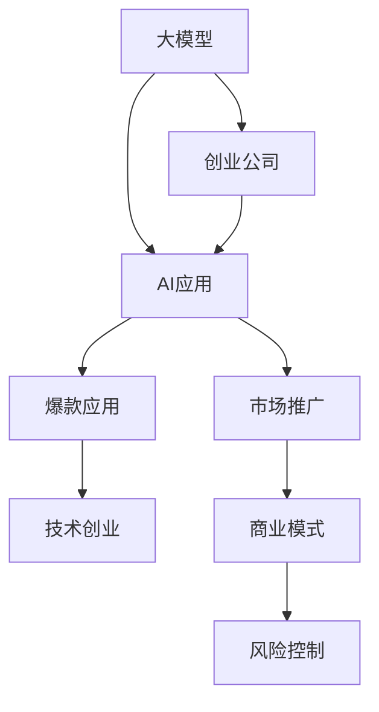

                 

# AI大模型创业：如何打造未来爆款应用？

> 关键词：大模型,创业,AI应用,爆款应用,技术创业,市场推广

## 1. 背景介绍

### 1.1 问题由来
随着人工智能技术的飞速发展，大模型已成为当今AI领域的核心竞争力。在自然语言处理、图像识别、语音识别等诸多领域，大模型通过预训练和微调，已经展现出了强大的应用潜力。然而，如何将大模型技术与市场紧密结合，打造出真正满足用户需求、具备商业价值的爆款应用，成为了创业公司面临的重大挑战。

大模型技术，特别是深度学习模型，在学术界和工业界均取得了显著成果。但是，模型本身并不等于产品，如何将这些技术转化为市场上有竞争力的产品，需要跨学科的团队合作、严格的系统设计、市场验证等多个环节的协同运作。本文章将深入探讨AI大模型创业的关键要素，帮助读者构建成功的产品框架。

### 1.2 问题核心关键点
AI大模型创业的核心关键点包括：

1. **技术选型与融合**：选择合适的技术栈，合理利用大模型技术与现有技术进行有机融合，以满足具体需求。
2. **产品设计与优化**：根据市场需求和用户行为，设计直观易用的产品界面和功能，不断优化用户体验。
3. **市场推广与销售**：通过市场调查、用户反馈等手段，精准定位目标用户群体，制定有效的市场推广策略。
4. **商业模式与盈利**：确定合理的商业模式，如SaaS、B2B、B2C等，实现商业价值的最大化。
5. **风险控制与合规**：在保证产品质量的同时，遵守法律法规，规避潜在风险，确保企业健康可持续发展。

本文将围绕以上关键点，从产品设计、技术选型、市场推广、商业模式和风险控制等多个方面展开，深入剖析AI大模型创业的实际应用场景与策略。

## 2. 核心概念与联系

### 2.1 核心概念概述

为了更好地理解AI大模型创业的核心概念，本节将介绍几个密切相关的核心概念：

- **大模型(Large Model)**：指具有亿级甚至更大参数量的深度学习模型，如BERT、GPT-3等。通过在海量数据上进行预训练，大模型具备强大的泛化能力和学习潜力。
- **创业公司(Startup)**：指致力于技术创新、快速发展的初创型企业，通常以颠覆性技术或产品为驱动力。
- **AI应用(AI Application)**：指利用AI技术，特别是大模型技术，解决实际问题，提供具体应用场景的产品和服务。
- **爆款应用(Breakout App)**：指在市场上取得巨大成功，广受用户欢迎的产品。具备高用户粘性、高收入增长和高市场份额等特征。
- **技术创业(Tech Startup)**：以技术为核心竞争力，以实现商业化应用为终极目标的企业模式。

这些核心概念之间的逻辑关系可以通过以下Mermaid流程图来展示：



这个流程图展示了大模型、创业公司、AI应用、爆款应用、技术创业等概念之间的关系：

1. 大模型是AI应用的基础。
2. 创业公司基于大模型技术，开发AI应用。
3. AI应用通过市场推广，成为爆款应用。
4. 爆款应用驱动技术创业，获得商业成功。
5. 技术创业需考虑商业模式和风险控制，以持续发展。

这些概念共同构成了AI大模型创业的完整框架，为企业发展提供了明确方向。

## 3. 核心算法原理 & 具体操作步骤
### 3.1 算法原理概述

AI大模型创业涉及多个技术领域的深度融合，其中核心算法原理包括：

1. **数据准备与标注**：收集和预处理数据，标记数据集，为模型训练和微调做准备。
2. **模型选择与架构设计**：根据具体需求选择合适的预训练模型，设计模型架构。
3. **微调与优化**：对预训练模型进行微调，以适应特定任务。同时使用各种优化技术，提升模型性能。
4. **产品设计与服务部署**：将模型封装成易于使用的服务或产品，部署到目标平台上。
5. **用户反馈与迭代优化**：收集用户反馈，不断迭代优化产品功能与性能。

这些算法原理贯穿AI大模型创业的整个流程，每个环节都至关重要。

### 3.2 算法步骤详解

AI大模型创业的步骤如下：

1. **需求分析与市场调研**：识别目标用户的需求与痛点，了解市场需求和竞争格局，确定产品定位。
2. **技术选型与模型适配**：选择合适的预训练模型和相关技术，设计任务适配层，进行微调优化。
3. **产品设计与功能开发**：根据用户需求，设计产品界面和功能，开发实现。
4. **测试与优化**：通过用户测试，收集反馈，不断优化产品。
5. **市场推广与销售**：制定市场推广策略，通过各类渠道进行推广，提升产品知名度和用户覆盖。
6. **商业化与盈利模式**：确定合理的商业模式，实现收入和利润。

### 3.3 算法优缺点

AI大模型创业具有以下优点：

1. **技术领先**：依托大模型技术，产品具备高性能和强大泛化能力，具有竞争力。
2. **快速迭代**：得益于敏捷开发和迭代优化，可以迅速响应市场需求和用户反馈，持续提升产品性能。
3. **灵活多样**：可以根据不同应用场景，灵活选择模型和技术，开发多种多样的AI应用。
4. **市场潜力大**：AI应用市场广阔，涉及医疗、金融、教育、制造等多个行业，前景无限。

同时，也存在以下缺点：

1. **数据需求大**：AI应用需要大量的数据进行训练和微调，数据获取和处理成本较高。
2. **资源投入高**：高质量的AI应用开发需要高水平的技术团队和资金支持，风险较高。
3. **算法复杂**：深度学习模型和微调技术复杂，需大量专业知识和经验。
4. **用户接受度**：AI应用需要培养用户习惯，产品推广初期可能面临用户接受度低的问题。

### 3.4 算法应用领域

AI大模型创业的应用领域非常广泛，涵盖了几乎所有需要智能化决策的行业。以下是几个典型的应用场景：

1. **智能客服**：利用大模型进行客户对话分析，提升客户体验和问题解决效率。
2. **医疗诊断**：通过医疗影像和大模型进行疾病检测，辅助医生诊疗。
3. **金融风控**：使用大模型进行风险评估和欺诈检测，提升金融安全。
4. **教育辅导**：构建智能教育平台，提供个性化学习推荐和智能辅导。
5. **物流管理**：利用AI进行仓储管理和物流调度，提高运营效率。

## 4. 数学模型和公式 & 详细讲解 & 举例说明（备注：数学公式请使用latex格式，latex嵌入文中独立段落使用 $$，段落内使用 $)
### 4.1 数学模型构建

AI大模型创业的数学模型构建主要涉及以下两个方面：

1. **预训练模型选择**：根据具体任务和数据分布选择合适的预训练模型。
2. **微调模型构建**：在预训练模型的基础上，构建任务适配层，添加损失函数，进行微调。

预训练模型的选择需考虑模型的规模、泛化能力、计算资源需求等因素。常用的预训练模型如BERT、GPT、T5等，具备不同的优势和应用场景。

微调模型的构建需考虑模型的输入和输出，损失函数的设计等。一般而言，微调模型需要添加任务适配层，设计损失函数，使用反向传播算法进行优化。例如，对于分类任务，可以添加线性分类器和交叉熵损失函数。

### 4.2 公式推导过程

以下以分类任务为例，推导微调模型的训练过程：

设预训练模型为 $M_{\theta}$，数据集为 $D=\{(x_i, y_i)\}_{i=1}^N$，其中 $x_i$ 为输入，$y_i$ 为标签。假设任务适配层为 $L$，微调后的模型为 $M_{\hat{\theta}}=M_{\theta}L$。损失函数为交叉熵损失 $L_{ce}(y,\hat{y})=-\sum_i y_i \log \hat{y}_i$，其中 $y$ 为真实标签，$\hat{y}$ 为模型预测。

微调目标为最小化损失函数：

$$
\hat{\theta} = \mathop{\arg\min}_{\theta} \mathcal{L}(\theta) = \mathop{\arg\min}_{\theta} \mathbb{E}_{(x,y) \sim D} L_{ce}(y, M_{\theta}L(x))
$$

使用梯度下降法进行优化，更新参数 $\theta$ 的公式为：

$$
\theta \leftarrow \theta - \eta \nabla_{\theta}\mathcal{L}(\theta)
$$

其中 $\eta$ 为学习率，$\nabla_{\theta}\mathcal{L}(\theta)$ 为损失函数对参数 $\theta$ 的梯度。

### 4.3 案例分析与讲解

以智能客服系统为例，分析AI大模型创业的实际应用：

1. **需求分析**：识别客户咨询常见问题和诉求，了解客户痛点。
2. **技术选型**：选择预训练模型（如BERT、GPT等），设计任务适配层（如分类器、解码器等）。
3. **数据准备**：收集历史客户咨询记录，进行预处理和标注。
4. **模型训练**：在标注数据集上进行微调，训练模型。
5. **产品设计**：开发用户界面，提供自然语言交互功能。
6. **测试与优化**：通过用户测试收集反馈，不断优化系统。
7. **市场推广**：通过社交媒体、SEO等渠道推广产品。
8. **商业化**：提供付费订阅服务，通过广告和增值服务获取收入。

## 5. 项目实践：代码实例和详细解释说明
### 5.1 开发环境搭建

进行AI大模型创业时，需要搭建相应的开发环境，包括：

1. **编程语言**：Python是AI领域的主流语言，开发环境支持Python 3.x。
2. **深度学习框架**：选择TensorFlow或PyTorch等主流框架进行模型开发和训练。
3. **预训练模型**：下载预训练模型，如BERT、GPT等，并进行适配。
4. **开发工具**：使用Jupyter Notebook、Google Colab等工具进行开发和测试。
5. **数据处理工具**：如Pandas、NumPy等，用于数据清洗和处理。
6. **部署工具**：如Docker、Kubernetes等，支持模型服务化部署。

### 5.2 源代码详细实现

以下以智能客服系统为例，展示AI大模型创业的代码实现：

```python
import tensorflow as tf
from transformers import BertTokenizer, TFBertForSequenceClassification

# 初始化模型和分词器
model = TFBertForSequenceClassification.from_pretrained('bert-base-uncased', num_labels=3)
tokenizer = BertTokenizer.from_pretrained('bert-base-uncased')

# 定义输入和标签
input_ids = tf.constant([[0, 1, 2, 3, 4]])
attention_mask = tf.constant([[0, 0, 0, 0, 0]])
labels = tf.constant([[0]])

# 前向传播
with tf.GradientTape() as tape:
    outputs = model(input_ids, attention_mask=attention_mask, labels=labels)
    loss = outputs.loss
    predictions = outputs.logits

# 反向传播和优化
gradients = tape.gradient(loss, model.trainable_variables)
optimizer.apply_gradients(zip(gradients, model.trainable_variables))

# 测试和优化
test_input_ids = tf.constant([[5, 6, 7, 8, 9]])
test_attention_mask = tf.constant([[0, 0, 0, 0, 0]])
test_labels = tf.constant([[1]])

test_outputs = model(test_input_ids, attention_mask=test_attention_mask, labels=test_labels)
print(test_outputs.logits.numpy())
```

### 5.3 代码解读与分析

以下是代码的详细解读与分析：

- **模型初始化**：使用Hugging Face的Transformers库，初始化BERT模型和分词器。
- **输入和标签定义**：定义输入和标签，使用TensorFlow的张量形式进行计算。
- **前向传播**：通过模型的前向传播函数，计算损失和预测结果。
- **反向传播和优化**：使用TensorFlow的梯度计算和优化器，更新模型参数。
- **测试和优化**：通过测试集验证模型性能，打印输出预测结果。

## 6. 实际应用场景
### 6.1 智能客服系统

智能客服系统是AI大模型创业的经典应用场景之一。通过使用预训练语言模型和微调技术，可以构建具备高智能水平的客服机器人，提升客户满意度和服务效率。

以智能客服系统为例，其具体应用如下：

1. **数据收集**：收集历史客户咨询记录，进行标注。
2. **模型微调**：使用BERT等预训练模型进行微调，优化分类器，实现智能问答。
3. **产品设计**：开发用户界面，提供自然语言交互功能。
4. **测试与优化**：通过用户测试收集反馈，不断优化系统。
5. **市场推广**：通过社交媒体、SEO等渠道推广产品。
6. **商业化**：提供付费订阅服务，通过广告和增值服务获取收入。

### 6.2 医疗诊断系统

医疗诊断系统是另一个重要的AI大模型创业应用。通过使用大模型进行疾病检测和诊断，可以大幅提升医疗服务的智能化水平，辅助医生进行诊疗决策。

具体而言，医疗诊断系统的构建如下：

1. **数据收集**：收集医疗影像和病例记录，进行标注。
2. **模型微调**：使用预训练模型进行微调，优化分类器，实现疾病检测。
3. **产品设计**：开发医生端和患者端应用，提供疾病诊断和健康管理功能。
4. **测试与优化**：通过医生和患者反馈，不断优化系统。
5. **市场推广**：通过医院、诊所等渠道推广产品。
6. **商业化**：提供付费订阅服务，通过增值服务和数据洞察获取收入。

### 6.3 金融风控系统

金融风控系统是AI大模型创业的重要应用场景之一。通过使用大模型进行风险评估和欺诈检测，可以大幅提升金融安全，保护用户资金。

具体而言，金融风控系统的构建如下：

1. **数据收集**：收集金融交易记录，进行标注。
2. **模型微调**：使用预训练模型进行微调，优化分类器，实现风险评估和欺诈检测。
3. **产品设计**：开发银行端和用户端应用，提供风险评估和金融服务功能。
4. **测试与优化**：通过银行和用户反馈，不断优化系统。
5. **市场推广**：通过金融行业渠道推广产品。
6. **商业化**：提供付费订阅服务，通过增值服务和数据洞察获取收入。

## 7. 工具和资源推荐
### 7.1 学习资源推荐

为了帮助开发者系统掌握AI大模型创业的理论基础和实践技巧，这里推荐一些优质的学习资源：

1. **《深度学习》课程**：由斯坦福大学开设的深度学习入门课程，涵盖深度学习基础和经典模型，是学习AI大模型创业的必备资源。
2. **《TensorFlow实战》书籍**：详细介绍了TensorFlow的使用方法和实战案例，是AI大模型创业的重要工具书。
3. **Kaggle竞赛平台**：参与Kaggle数据科学竞赛，实践和验证AI大模型创业的思路和算法。
4. **GitHub开源项目**：浏览和参与开源项目，学习优秀的代码实现和应用场景。
5. **AI创业社区**：加入AI创业社区，获取行业动态和前沿资讯。

### 7.2 开发工具推荐

高效的开发离不开优秀的工具支持。以下是几款用于AI大模型创业开发的常用工具：

1. **TensorFlow**：由Google主导开发的深度学习框架，支持分布式计算和资源管理，适合大规模工程应用。
2. **PyTorch**：基于Python的开源深度学习框架，灵活性高，开发效率高，适合研究性项目。
3. **Jupyter Notebook**：开源的交互式开发工具，支持Python、R等语言，适合快速原型开发和数据处理。
4. **Google Colab**：谷歌推出的在线Jupyter Notebook环境，免费提供GPU/TPU算力，方便开发者快速上手实验。
5. **Docker**：容器化技术，支持模型服务化部署，提高系统的可移植性和稳定性。

### 7.3 相关论文推荐

AI大模型创业领域的发展离不开学界的持续研究。以下是几篇奠基性的相关论文，推荐阅读：

1. **Attention is All You Need**：提出了Transformer结构，开启了NLP领域的预训练大模型时代。
2. **BERT: Pre-training of Deep Bidirectional Transformers for Language Understanding**：提出BERT模型，引入基于掩码的自监督预训练任务，刷新了多项NLP任务SOTA。
3. **Towards Exactness in Machine Learning**：探讨了机器学习的准确性和可靠性问题，为AI大模型创业提供了理论指导。
4. **AlphaGo Zero**：展示了基于深度学习的自适应学习策略，为AI大模型创业提供了新思路。
5. **Super AI**：探讨了AI技术的未来发展方向，为AI大模型创业提供了长远视角。

这些论文代表了大模型创业技术的发展脉络，通过学习这些前沿成果，可以帮助研究者把握学科前进方向，激发更多的创新灵感。

## 8. 总结：未来发展趋势与挑战
### 8.1 总结

本文对AI大模型创业的关键要素进行了全面系统的介绍。首先阐述了AI大模型创业的核心概念和逻辑关系，明确了技术选型、产品设计、市场推广等关键环节。其次，从数学模型构建、算法原理概述、具体操作步骤等多个方面，详细讲解了AI大模型创业的实践过程。最后，通过案例分析和资源推荐，展示了AI大模型创业的具体应用场景和支持工具。

通过本文的系统梳理，可以看到，AI大模型创业需要跨学科的知识和技能，从数据处理、模型训练、产品设计到市场推广，每个环节都至关重要。未来，随着技术的发展和市场的变化，AI大模型创业将面临更多机遇和挑战，需要不断创新和优化，才能实现商业成功。

### 8.2 未来发展趋势

展望未来，AI大模型创业将呈现以下几个发展趋势：

1. **技术多样化**：AI大模型创业将更加注重技术多样化，引入更多前沿技术，如自监督学习、联邦学习等，提升产品性能和市场竞争力。
2. **市场细分**：AI大模型创业将更加注重市场细分，针对不同行业和需求，提供定制化解决方案。
3. **用户体验优化**：AI大模型创业将更加注重用户体验，通过人机交互设计、数据可视化等手段，提升用户粘性和满意度。
4. **数据驱动决策**：AI大模型创业将更加注重数据驱动，通过数据洞察和模型分析，辅助决策和优化。
5. **生态系统构建**：AI大模型创业将更加注重生态系统构建，通过开放平台和合作伙伴，形成完整的产业链。

### 8.3 面临的挑战

尽管AI大模型创业具有广阔的市场前景，但也面临诸多挑战：

1. **数据获取和处理**：AI大模型创业需要大量数据，数据获取和处理成本较高。
2. **算法复杂度高**：AI大模型创业涉及复杂算法，需要高水平的技术团队和知识储备。
3. **市场竞争激烈**：AI大模型创业领域竞争激烈，需要具备较强的市场洞察力和创新能力。
4. **用户教育成本**：AI大模型创业产品需要用户教育，初期推广成本较高。
5. **法律法规风险**：AI大模型创业需要遵守法律法规，避免潜在的法律风险。

### 8.4 研究展望

面对AI大模型创业的挑战，未来的研究需要在以下几个方面寻求新的突破：

1. **数据自动化采集**：通过自动化数据采集和预处理技术，降低数据获取成本。
2. **算法优化与简化**：通过算法优化和简化，提高AI大模型创业的可扩展性和可维护性。
3. **市场细分与定制化**：针对不同市场和需求，提供定制化解决方案，提升产品竞争力。
4. **用户体验与交互设计**：通过用户体验和交互设计，提高用户粘性和满意度。
5. **生态系统与合作伙伴**：构建开放生态系统，与合作伙伴紧密合作，形成完整的产业链。

这些研究方向的探索，必将引领AI大模型创业技术迈向更高的台阶，为构建安全、可靠、可解释、可控的智能系统铺平道路。面向未来，AI大模型创业需要不断创新、优化，才能在市场中取得持续竞争优势。

## 9. 附录：常见问题与解答

**Q1：AI大模型创业需要哪些核心要素？**

A: AI大模型创业需要以下核心要素：

1. **技术选型与融合**：选择合适的预训练模型和相关技术，进行有机融合，以适应具体需求。
2. **产品设计与优化**：根据用户需求，设计直观易用的产品界面和功能，不断优化用户体验。
3. **市场推广与销售**：通过市场调查、用户反馈等手段，精准定位目标用户群体，制定有效的市场推广策略。
4. **商业模式与盈利**：确定合理的商业模式，实现收入和利润。
5. **风险控制与合规**：在保证产品质量的同时，遵守法律法规，规避潜在风险，确保企业健康可持续发展。

**Q2：AI大模型创业面临哪些挑战？**

A: AI大模型创业面临以下挑战：

1. **数据需求大**：AI应用需要大量的数据进行训练和微调，数据获取和处理成本较高。
2. **资源投入高**：高质量的AI应用开发需要高水平的技术团队和资金支持，风险较高。
3. **算法复杂**：深度学习模型和微调技术复杂，需大量专业知识和经验。
4. **用户接受度**：AI应用需要培养用户习惯，产品推广初期可能面临用户接受度低的问题。

**Q3：AI大模型创业有哪些实际应用场景？**

A: AI大模型创业的实际应用场景包括：

1. **智能客服**：利用大模型进行客户对话分析，提升客户体验和问题解决效率。
2. **医疗诊断**：通过大模型进行疾病检测，辅助医生诊疗。
3. **金融风控**：使用大模型进行风险评估和欺诈检测，提升金融安全。
4. **教育辅导**：构建智能教育平台，提供个性化学习推荐和智能辅导。
5. **物流管理**：利用AI进行仓储管理和物流调度，提高运营效率。

**Q4：AI大模型创业如何实现商业化？**

A: AI大模型创业的商业化主要通过以下几种方式：

1. **订阅服务**：提供付费订阅服务，如月度、季度、年度等，实现收入和利润。
2. **增值服务**：通过增值服务获取收入，如数据分析、定制化开发等。
3. **广告投放**：通过广告投放获取收入，如品牌推广、流量变现等。
4. **数据洞察**：通过数据洞察获取收入，如市场调研、客户分析等。

**Q5：AI大模型创业需要哪些技术支持？**

A: AI大模型创业需要以下技术支持：

1. **深度学习框架**：如TensorFlow、PyTorch等，用于模型开发和训练。
2. **数据处理工具**：如Pandas、NumPy等，用于数据清洗和处理。
3. **部署工具**：如Docker、Kubernetes等，用于模型服务化部署。
4. **开发工具**：如Jupyter Notebook、Google Colab等，用于快速原型开发和测试。

**Q6：AI大模型创业的常见数据获取方式有哪些？**

A: AI大模型创业的常见数据获取方式包括：

1. **公开数据集**：利用公开数据集进行数据预处理和模型训练。
2. **数据采集工具**：通过API接口、爬虫等方式自动采集数据。
3. **用户反馈数据**：通过用户行为数据、评论反馈等方式获取数据。
4. **第三方数据服务**：使用第三方数据服务获取数据，如Google Cloud、Amazon Web Services等。

**Q7：AI大模型创业如何进行市场推广？**

A: AI大模型创业的市场推广主要通过以下几种方式：

1. **社交媒体推广**：通过社交媒体平台推广产品，提升知名度和用户粘性。
2. **SEO优化**：通过SEO优化提升产品搜索引擎排名，吸引更多用户。
3. **合作伙伴推广**：通过合作伙伴推广，扩大市场覆盖。
4. **线上线下活动**：通过线上线下活动，如Webinar、展会等，提升品牌知名度。

以上是AI大模型创业的常见问题和解答，希望能为你提供有价值的参考和帮助。

---

作者：禅与计算机程序设计艺术 / Zen and the Art of Computer Programming

