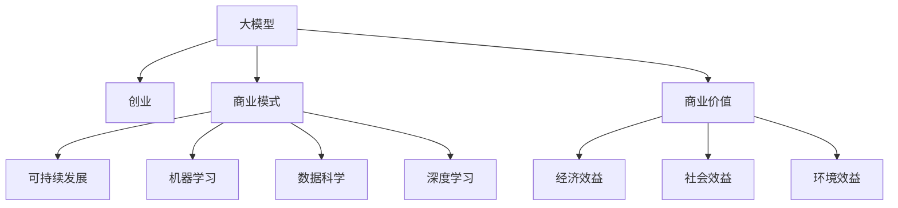

                 

# AI大模型创业：如何构建未来可持续的商业模式？

> 关键词：AI大模型, 创业, 商业模型, 可持续发展, 机器学习, 数据科学, 深度学习

## 1. 背景介绍

### 1.1 问题由来
近年来，人工智能(AI)技术的发展速度迅猛，大模型如BERT、GPT-3等在自然语言处理(NLP)、计算机视觉(CV)等领域取得了一系列突破性成果。这些大模型在学术界和工业界都引发了广泛关注和应用热潮。然而，如何将这些先进的技术转化为商业价值，成为众多创业者、AI公司和研究机构共同关注的焦点。

大模型的应用涉及数据收集、模型训练、模型微调、模型部署等多个环节，流程复杂，成本高昂，且技术门槛较高。因此，构建基于大模型的可持续商业模式，需要系统地思考整个商业生态系统的建设，确保各环节的有机协同和资源的高效配置。

### 1.2 问题核心关键点
构建可持续的大模型商业模式，需要从技术、市场、成本、人才、生态等多个维度综合考虑，确保商业模式的健康发展和持续收益。核心关键点包括：
1. 数据获取与处理：保证数据的丰富性和高质量，是构建大模型商业模式的前提。
2. 模型训练与优化：高效的模型训练和优化算法，是大模型商业化的基础。
3. 微调与部署：模型微调技术和高效的部署方案，是提升模型性能的关键。
4. 用户需求与体验：了解用户需求，提供优质的产品体验，是实现商业价值的保证。
5. 业务融合与协同：将大模型与业务场景深度融合，实现多领域的商业应用，是实现商业增长的关键。
6. 生态系统建设：构建健康开放的生态系统，吸引更多合作伙伴，是商业可持续发展的核心。

### 1.3 问题研究意义
构建基于大模型的可持续商业模式，对于推动AI技术在各行业的落地应用，提升社会生产效率，促进产业升级，具有重要意义：
1. 降低企业成本：通过大模型共享平台，企业可以降低数据获取、模型训练等成本，快速迭代产品。
2. 提升产品竞争力：基于大模型的AI产品，可以提供更精确、智能的服务，提升企业竞争力。
3. 加速业务创新：AI技术可以赋能传统业务，创新商业模式，加速数字化转型。
4. 推动行业发展：AI技术在医疗、金融、教育等行业的应用，可以推动相关领域的技术进步和产业升级。
5. 促进生态发展：健康的生态系统可以吸引更多开发者、企业和用户参与，共同推动AI技术的进步。

## 2. 核心概念与联系

### 2.1 核心概念概述

为更好地理解如何构建基于大模型的可持续商业模式，本节将介绍几个关键概念：

- **大模型(大规模预训练模型)**：如BERT、GPT等，通过大规模无监督学习获得丰富的语言知识，具备强大的语言理解和生成能力。
- **创业**：指创立新企业，将技术和市场机会转化为商业价值的实践活动。
- **商业模式**：企业基于市场需求，通过核心技术和资源配置，实现持续盈利和价值创造的运营模式。
- **可持续发展**：指企业在商业活动中，既满足当前需求，又不对未来发展造成损害，实现经济效益、社会效益和环境效益的协调统一。
- **机器学习**：通过数据和算法训练模型，提升模型预测和推理能力的科学技术。
- **数据科学**：运用统计学、数学和算法，对数据进行建模、分析和预测的学科。
- **深度学习**：一种基于多层神经网络的机器学习方法，能够处理非线性、高维数据。

这些概念之间的逻辑关系可以通过以下Mermaid流程图来展示：



这个流程图展示了各概念之间的联系：

1. 大模型是创业的基础，创业是将大模型转化为商业价值的实践活动。
2. 商业模式是创业实现可持续发展的运营模式。
3. 可持续发展包含经济效益、社会效益和环境效益。
4. 机器学习、数据科学和深度学习是商业模式的技术支撑。
5. 商业价值是商业模式实现经济效益、社会效益和环境效益的载体。

通过理解这些核心概念，我们可以更好地把握构建大模型商业模式的关键要素和目标。

## 3. 核心算法原理 & 具体操作步骤
### 3.1 算法原理概述

构建基于大模型的可持续商业模式，本质上是一个多目标优化问题，涉及技术、市场、成本、人才和生态等多个维度的协调和优化。

核心思想是：通过高效的数据获取、模型训练、微调与部署，结合市场和用户需求，构建商业价值链，实现经济效益、社会效益和环境效益的协调统一。

形式化地，假设商业模式为目标函数 $f$，涉及多个子目标 $f_1, f_2, \dots, f_n$，则构建可持续商业模式的目标是：

$$
\min_{x} f(x) = \lambda_1 f_1(x) + \lambda_2 f_2(x) + \dots + \lambda_n f_n(x)
$$

其中 $x$ 表示各子目标的权值，$\lambda_i$ 为子目标的权重。

### 3.2 算法步骤详解

构建基于大模型的可持续商业模式，通常包括以下关键步骤：

**Step 1: 确定商业模式目标**

- 明确商业模式的愿景和目标，包括经济效益、社会效益和环境效益。
- 确定商业模式的关键绩效指标(KPIs)，如用户增长率、客户满意度、运营成本等。

**Step 2: 选择合适的模型与数据**

- 根据目标市场和应用场景，选择合适的预训练大模型。
- 获取高质量的数据，包括数据收集、清洗、标注等环节。

**Step 3: 构建数据平台**

- 建设高效的数据平台，实现数据的高效存储、处理和分析。
- 采用分布式计算、云服务、边缘计算等技术，提升数据处理的效率和可靠性。

**Step 4: 设计微调与部署流程**

- 设计高效的模型微调流程，选择合适的微调技术和优化算法。
- 设计灵活的部署方案，确保模型在各场景下的高性能和可扩展性。

**Step 5: 用户需求与体验优化**

- 深入了解用户需求，设计用户友好的界面和体验。
- 通过用户反馈和数据分析，不断优化产品和服务。

**Step 6: 业务融合与协同**

- 将大模型与业务场景深度融合，实现多领域的商业应用。
- 构建开放的生态系统，吸引更多合作伙伴，共同推动业务发展。

**Step 7: 持续监测与优化**

- 实时监测商业模式各环节的运行状态，及时发现和解决问题。
- 定期评估商业模式的效果，根据市场变化进行优化和调整。

### 3.3 算法优缺点

构建基于大模型的可持续商业模式，具有以下优点：
1. 提高效率：通过模型共享平台，企业可以共享模型训练和优化资源，降低成本。
2. 增强竞争力：基于大模型的AI产品，可以提供更精确、智能的服务，提升产品竞争力。
3. 促进创新：大模型可以赋能传统业务，创新商业模式，加速数字化转型。
4. 推动生态发展：健康的生态系统可以吸引更多开发者、企业和用户参与，共同推动技术进步和产业发展。

同时，该方法也存在一定的局限性：
1. 数据获取难度大：高质量的数据获取成本较高，获取难度大。
2. 技术门槛高：构建和维护大模型商业系统需要较高的技术门槛。
3. 模型风险高：大模型可能存在过拟合、偏差等风险，影响商业模式稳定性。
4. 生态建设复杂：构建健康开放的生态系统，需要协调多方利益，难度较大。

尽管存在这些局限性，但就目前而言，基于大模型的可持续商业模式仍是最主流的方式。未来相关研究的重点在于如何进一步降低数据获取成本，提高模型鲁棒性，同时兼顾经济效益和社会效益，构建健康开放的生态系统。

### 3.4 算法应用领域

基于大模型的可持续商业模式，已经在多个行业领域得到了广泛应用，包括：

- 金融：通过大模型构建智能投顾系统，提升投资决策的准确性和效率。
- 医疗：利用大模型进行疾病预测和诊疗辅助，提升医疗服务的精准度和覆盖面。
- 教育：基于大模型构建个性化学习系统，实现因材施教，提高教学质量。
- 交通：通过大模型优化交通调度，提升交通管理效率和安全性。
- 物流：利用大模型进行货物智能分拣和配送路径规划，降低运营成本。
- 农业：采用大模型进行病虫害预测和农作物种植建议，提升农业生产效率。
- 媒体：通过大模型生成高质量的内容，提升媒体平台的竞争力。

除了这些经典领域外，大模型商业化还在更多场景中不断探索创新，为各行各业带来变革性影响。

## 4. 数学模型和公式 & 详细讲解  
### 4.1 数学模型构建

本节将使用数学语言对构建基于大模型的可持续商业模式过程进行更加严格的刻画。

假设商业模式目标函数为 $f(x)$，其中 $x$ 为各子目标的权值，包括数据获取效率、模型训练时间、用户增长率等。定义各子目标函数 $f_1(x), f_2(x), \dots, f_n(x)$，分别表示经济效益、社会效益和环境效益等。

目标函数优化问题的数学表达为：

$$
\min_{x} f(x) = \lambda_1 f_1(x) + \lambda_2 f_2(x) + \dots + \lambda_n f_n(x)
$$

在实际应用中，通常需要考虑多个目标的协同优化，例如，权衡经济效益和用户增长率：

$$
f(x) = f_{\text{经济}}(x) + \alpha f_{\text{用户}}(x)
$$

其中 $\alpha$ 为经济效益和用户增长的权衡系数，可通过A/B测试和市场反馈进行调整。

### 4.2 公式推导过程

以下我们以用户增长率优化为例，推导目标函数的优化过程。

假设用户增长率为 $R(x)$，通过A/B测试和市场反馈，构建用户增长模型：

$$
R(x) = \exp\left(\sum_{i=1}^{n} a_i x_i + b \right)
$$

其中 $a_i$ 和 $b$ 为回归系数，$x_i$ 为各个影响用户增长的因素。例如，产品价格 $x_1$，广告投入 $x_2$，用户反馈 $x_3$ 等。

目标函数可表示为：

$$
f(x) = R(x) + \beta f_{\text{经济}}(x)
$$

其中 $\beta$ 为经济效益和用户增长的权衡系数。

目标函数的梯度为：

$$
\nabla_{x} f(x) = \nabla_{x} R(x) + \beta \nabla_{x} f_{\text{经济}}(x)
$$

通过梯度下降等优化算法，不断调整各个子目标的权重，最小化目标函数，直到收敛。

### 4.3 案例分析与讲解

假设某金融公司希望通过大模型构建智能投顾系统，提升投资决策的准确性和效率。公司首先选择合适的预训练模型和数据集，构建数据平台，设计微调与部署流程，实现经济效益和社会效益的协调统一。

步骤如下：
1. 数据获取与处理：从多渠道获取金融数据，包括股票价格、市场新闻、用户行为等。
2. 模型训练与优化：在分布式计算平台上训练大模型，优化算法包括Adam、SGD等。
3. 模型微调与部署：根据市场变化和用户反馈，对模型进行微调，实现高效部署。
4. 用户体验优化：设计用户友好的界面，提供实时投资建议。
5. 业务融合与协同：将大模型与投资策略结合，优化资产配置。
6. 持续监测与优化：实时监测系统运行状态，优化模型和用户界面。

通过以上步骤，该公司实现了大模型在金融领域的可持续商业模式，不仅提升了投资决策的准确性和效率，还通过用户增长率优化，提升了系统的用户黏性和市场竞争力。

## 5. 项目实践：代码实例和详细解释说明
### 5.1 开发环境搭建

在进行大模型商业模式构建实践前，我们需要准备好开发环境。以下是使用Python进行PyTorch开发的环境配置流程：

1. 安装Anaconda：从官网下载并安装Anaconda，用于创建独立的Python环境。

2. 创建并激活虚拟环境：
```bash
conda create -n pytorch-env python=3.8 
conda activate pytorch-env
```

3. 安装PyTorch：根据CUDA版本，从官网获取对应的安装命令。例如：
```bash
conda install pytorch torchvision torchaudio cudatoolkit=11.1 -c pytorch -c conda-forge
```

4. 安装Transformers库：
```bash
pip install transformers
```

5. 安装各类工具包：
```bash
pip install numpy pandas scikit-learn matplotlib tqdm jupyter notebook ipython
```

完成上述步骤后，即可在`pytorch-env`环境中开始商业模式构建实践。

### 5.2 源代码详细实现

下面我们以智能投顾系统为例，给出使用Transformers库构建大模型商业模式的PyTorch代码实现。

首先，定义用户增长率预测函数：

```python
from transformers import BertForRegression, BertTokenizer
from torch.utils.data import Dataset
import torch

class InvestorDataset(Dataset):
    def __init__(self, texts, targets, tokenizer, max_len=128):
        self.texts = texts
        self.targets = targets
        self.tokenizer = tokenizer
        self.max_len = max_len
        
    def __len__(self):
        return len(self.texts)
    
    def __getitem__(self, item):
        text = self.texts[item]
        target = self.targets[item]
        
        encoding = self.tokenizer(text, return_tensors='pt', max_length=self.max_len, padding='max_length', truncation=True)
        input_ids = encoding['input_ids'][0]
        attention_mask = encoding['attention_mask'][0]
        
        # 对token-wise的目标进行编码
        encoded_targets = [target] * self.max_len
        labels = torch.tensor(encoded_targets, dtype=torch.float32)
        
        return {'input_ids': input_ids, 
                'attention_mask': attention_mask,
                'labels': labels}

tokenizer = BertTokenizer.from_pretrained('bert-base-cased')

train_dataset = InvestorDataset(train_texts, train_targets, tokenizer)
dev_dataset = InvestorDataset(dev_texts, dev_targets, tokenizer)
test_dataset = InvestorDataset(test_texts, test_targets, tokenizer)
```

然后，定义模型和优化器：

```python
from transformers import BertForRegression, AdamW

model = BertForRegression.from_pretrained('bert-base-cased')

optimizer = AdamW(model.parameters(), lr=2e-5)
```

接着，定义训练和评估函数：

```python
from torch.utils.data import DataLoader
from tqdm import tqdm
from sklearn.metrics import mean_squared_error

device = torch.device('cuda') if torch.cuda.is_available() else torch.device('cpu')
model.to(device)

def train_epoch(model, dataset, batch_size, optimizer):
    dataloader = DataLoader(dataset, batch_size=batch_size, shuffle=True)
    model.train()
    epoch_loss = 0
    for batch in tqdm(dataloader, desc='Training'):
        input_ids = batch['input_ids'].to(device)
        attention_mask = batch['attention_mask'].to(device)
        labels = batch['labels'].to(device)
        model.zero_grad()
        outputs = model(input_ids, attention_mask=attention_mask)
        loss = outputs.loss
        epoch_loss += loss.item()
        loss.backward()
        optimizer.step()
    return epoch_loss / len(dataloader)

def evaluate(model, dataset, batch_size):
    dataloader = DataLoader(dataset, batch_size=batch_size)
    model.eval()
    preds, labels = [], []
    with torch.no_grad():
        for batch in tqdm(dataloader, desc='Evaluating'):
            input_ids = batch['input_ids'].to(device)
            attention_mask = batch['attention_mask'].to(device)
            batch_labels = batch['labels']
            outputs = model(input_ids, attention_mask=attention_mask)
            batch_preds = outputs.predictions.cpu().tolist()
            batch_labels = batch_labels.cpu().tolist()
            for pred, label in zip(batch_preds, batch_labels):
                preds.append(pred)
                labels.append(label)
                
    print(f'Mean Squared Error: {mean_squared_error(labels, preds)}')
```

最后，启动训练流程并在测试集上评估：

```python
epochs = 5
batch_size = 16

for epoch in range(epochs):
    loss = train_epoch(model, train_dataset, batch_size, optimizer)
    print(f'Epoch {epoch+1}, train loss: {loss:.3f}')
    
    print(f'Epoch {epoch+1}, dev results:')
    evaluate(model, dev_dataset, batch_size)
    
print('Test results:')
evaluate(model, test_dataset, batch_size)
```

以上就是使用PyTorch对智能投顾系统进行大模型商业模式构建的完整代码实现。可以看到，得益于Transformers库的强大封装，我们可以用相对简洁的代码完成大模型商业化的开发。

### 5.3 代码解读与分析

让我们再详细解读一下关键代码的实现细节：

**InvestorDataset类**：
- `__init__`方法：初始化文本、目标值、分词器等关键组件。
- `__len__`方法：返回数据集的样本数量。
- `__getitem__`方法：对单个样本进行处理，将文本输入编码为token ids，将目标值编码为数字，并对其进行定长padding，最终返回模型所需的输入。

**tokenizer和input_ids定义**：
- 定义分词器，用于对文本进行token化处理。
- 将文本转化为token ids，准备输入模型。

**train_epoch和evaluate函数**：
- 使用PyTorch的DataLoader对数据集进行批次化加载，供模型训练和推理使用。
- 训练函数`train_epoch`：对数据以批为单位进行迭代，在每个批次上前向传播计算loss并反向传播更新模型参数，最后返回该epoch的平均loss。
- 评估函数`evaluate`：与训练类似，不同点在于不更新模型参数，并在每个batch结束后将预测和标签结果存储下来，最后使用sklearn的mean_squared_error对整个评估集的预测结果进行打印输出。

**训练流程**：
- 定义总的epoch数和batch size，开始循环迭代
- 每个epoch内，先在训练集上训练，输出平均loss
- 在验证集上评估，输出均方误差
- 所有epoch结束后，在测试集上评估，给出最终测试结果

可以看到，PyTorch配合Transformers库使得大模型商业化的代码实现变得简洁高效。开发者可以将更多精力放在数据处理、模型改进等高层逻辑上，而不必过多关注底层的实现细节。

当然，工业级的系统实现还需考虑更多因素，如模型的保存和部署、超参数的自动搜索、更灵活的任务适配层等。但核心的商业模式构建流程基本与此类似。

## 6. 实际应用场景
### 6.1 智能投顾系统

基于大模型构建的智能投顾系统，能够为用户提供个性化的投资建议，优化资产配置，提升投资收益。系统通过用户的行为数据、市场新闻和趋势预测模型，生成实时投资建议，帮助用户实现资产增值。

在技术实现上，可以收集用户历史投资记录、市场数据和新闻等文本数据，构建监督数据集，对BERT模型进行微调，训练出一个适应用户投资偏好的预测模型。微调后的模型能够自动理解用户投资需求和市场趋势，提供最优的投资组合建议。同时，系统还可以通过反馈机制，不断优化预测模型，提升投资建议的准确性和及时性。

### 6.2 健康管理平台

通过大模型构建的健康管理平台，可以为用户提供个性化的健康建议和疾病预测。系统通过收集用户的健康数据、生活习惯和遗传信息，构建多模态数据集，对BERT模型进行微调，训练出一个能够理解用户健康状态和行为模式的预测模型。微调后的模型能够自动诊断用户的健康状况，预测潜在的疾病风险，并给出个性化的健康建议。

在技术实现上，可以收集用户日常健康数据、基因检测报告和生活习惯信息，构建监督数据集，对BERT模型进行微调，训练出一个适应用户健康需求的预测模型。微调后的模型能够自动分析用户的健康数据，预测潜在的健康风险，并生成个性化的健康建议。同时，系统还可以通过反馈机制，不断优化预测模型，提升健康建议的准确性和及时性。

### 6.3 教育个性化平台

基于大模型构建的教育个性化平台，能够为学生提供个性化的学习内容和推荐。系统通过收集学生的学习行为数据、知识测试结果和课程反馈，构建监督数据集，对BERT模型进行微调，训练出一个能够理解学生学习需求和知识掌握程度的预测模型。微调后的模型能够自动分析学生的学习情况，推荐适合的学习内容，并提供个性化的学习建议。

在技术实现上，可以收集学生的学习行为数据、知识测试结果和课程反馈，构建监督数据集，对BERT模型进行微调，训练出一个能够理解学生学习需求的预测模型。微调后的模型能够自动分析学生的学习情况，推荐适合的学习内容，并提供个性化的学习建议。同时，系统还可以通过反馈机制，不断优化预测模型，提升学习建议的准确性和及时性。

### 6.4 未来应用展望

随着大模型和微调方法的不断发展，基于大模型的可持续商业模式将呈现出更加广阔的前景。

在智慧医疗领域，基于大模型的智能投顾系统、疾病预测平台等，将提升医疗服务的智能化水平，辅助医生诊疗，加速新药开发进程。

在智能教育领域，基于大模型的个性化学习平台，能够为学生提供个性化的学习内容和推荐，实现因材施教，提高教学质量。

在智能交通领域，基于大模型的交通调度系统，能够优化交通管理，提高交通效率和安全性。

此外，在企业生产、社会治理、文娱传媒等众多领域，基于大模型的商业化应用也将不断探索创新，为各行各业带来变革性影响。

相信随着技术的日益成熟，大模型商业化必将成为AI技术落地应用的重要范式，推动AI技术向更广阔的领域加速渗透。未来，大模型商业化的发展将与各行业的数字化转型深度融合，为社会带来更高效、更智能、更公平的商业价值。

## 7. 工具和资源推荐
### 7.1 学习资源推荐

为了帮助开发者系统掌握大模型商业化的理论基础和实践技巧，这里推荐一些优质的学习资源：

1. 《深度学习》书籍：Ian Goodfellow等人著作，系统介绍深度学习的基本原理和应用，是深度学习领域的经典教材。
2. 《Python深度学习》书籍：Francois Chollet等人著作，深入浅出地介绍深度学习在Python中的实现，包括TensorFlow和Keras。
3. 《深度学习实战》书籍：Johns Hopkins大学提供的深度学习课程，由Andrew Ng主讲，涵盖深度学习的基本概念和应用。
4. Udacity深度学习纳米学位：提供深度学习的系统学习课程，包括TensorFlow、Keras等工具的使用。
5. Coursera深度学习专项课程：由Andrew Ng主讲的深度学习课程，涵盖深度学习的基本概念和应用。

通过对这些资源的学习实践，相信你一定能够快速掌握大模型商业化的精髓，并用于解决实际的商业问题。
###  7.2 开发工具推荐

高效的开发离不开优秀的工具支持。以下是几款用于大模型商业模式构建开发的常用工具：

1. TensorFlow：由Google主导开发的开源深度学习框架，生产部署方便，适合大规模工程应用。同样有丰富的预训练语言模型资源。
2. PyTorch：基于Python的开源深度学习框架，灵活动态的计算图，适合快速迭代研究。大部分预训练语言模型都有PyTorch版本的实现。
3. Transformers库：HuggingFace开发的NLP工具库，集成了众多SOTA语言模型，支持PyTorch和TensorFlow，是进行商业化开发的利器。
4. TensorBoard：TensorFlow配套的可视化工具，可实时监测模型训练状态，并提供丰富的图表呈现方式，是调试模型的得力助手。
5. Weights & Biases：模型训练的实验跟踪工具，可以记录和可视化模型训练过程中的各项指标，方便对比和调优。
6. Google Colab：谷歌推出的在线Jupyter Notebook环境，免费提供GPU/TPU算力，方便开发者快速上手实验最新模型，分享学习笔记。

合理利用这些工具，可以显著提升大模型商业化构建的开发效率，加快创新迭代的步伐。

### 7.3 相关论文推荐

大模型商业化的发展源于学界的持续研究。以下是几篇奠基性的相关论文，推荐阅读：

1. Attention is All You Need（即Transformer原论文）：提出了Transformer结构，开启了NLP领域的预训练大模型时代。
2. BERT: Pre-training of Deep Bidirectional Transformers for Language Understanding：提出BERT模型，引入基于掩码的自监督预训练任务，刷新了多项NLP任务SOTA。
3. Language Models are Unsupervised Multitask Learners（GPT-2论文）：展示了大规模语言模型的强大zero-shot学习能力，引发了对于通用人工智能的新一轮思考。
4. Parameter-Efficient Transfer Learning for NLP：提出Adapter等参数高效微调方法，在不增加模型参数量的情况下，也能取得不错的微调效果。
5. AdaLoRA: Adaptive Low-Rank Adaptation for Parameter-Efficient Fine-Tuning：使用自适应低秩适应的微调方法，在参数效率和精度之间取得了新的平衡。

这些论文代表了大模型商业化的发展脉络。通过学习这些前沿成果，可以帮助研究者把握学科前进方向，激发更多的创新灵感。

## 8. 总结：未来发展趋势与挑战

### 8.1 总结

本文对基于大模型的可持续商业模式进行了全面系统的介绍。首先阐述了基于大模型的商业模式的构建背景和意义，明确了商业模式构建的关键要素和目标。其次，从原理到实践，详细讲解了构建大模型商业模式的过程，给出了商业模式构建的完整代码实例。同时，本文还广泛探讨了商业模式在智能投顾、健康管理、教育个性化等多个行业领域的应用前景，展示了大模型商业化的巨大潜力。此外，本文精选了商业模式构建的各类学习资源，力求为读者提供全方位的技术指引。

通过本文的系统梳理，可以看到，基于大模型的可持续商业模式正在成为AI技术在各行业落地应用的重要范式，极大地拓展了AI技术的商业价值。未来，伴随大模型和微调方法的不断演进，基于大模型的商业模式将进一步发展，为各行各业带来更深远的影响。

### 8.2 未来发展趋势

展望未来，基于大模型的可持续商业模式将呈现以下几个发展趋势：

1. 数据获取自动化：通过数据挖掘、爬虫技术，自动化获取高质量数据，降低人工成本。
2. 模型优化精细化：优化模型训练和微调过程，提高模型的准确性和鲁棒性。
3. 应用场景多样化：大模型在更多领域得到应用，如医疗、金融、教育等，推动各行业的数字化转型。
4. 用户体验提升：通过用户行为分析和个性化推荐，提升用户满意度，增加用户黏性。
5. 生态系统开放化：构建开放的数据共享和协作平台，吸引更多开发者、企业和用户参与，推动技术的快速发展。
6. 智能决策智能化：通过智能投顾、健康管理等应用，实现智能决策和个性化服务，提升业务效率和用户体验。

以上趋势凸显了大模型商业模式构建的广阔前景。这些方向的探索发展，必将进一步提升大模型商业化的商业价值，为社会带来更高效、更智能、更公平的商业价值。

### 8.3 面临的挑战

尽管基于大模型的可持续商业模式已经取得了瞩目成就，但在迈向更加智能化、普适化应用的过程中，它仍面临着诸多挑战：

1. 数据获取难度大：高质量的数据获取成本较高，获取难度大。
2. 技术门槛高：构建和维护大模型商业系统需要较高的技术门槛。
3. 模型风险高：大模型可能存在过拟合、偏差等风险，影响商业模式稳定性。
4. 生态建设复杂：构建健康开放的生态系统，需要协调多方利益，难度较大。
5. 用户体验提升难度大：通过用户行为分析和个性化推荐，提升用户满意度，增加用户黏性。
6. 智能决策难度大：通过智能投顾、健康管理等应用，实现智能决策和个性化服务，提升业务效率和用户体验。

尽管存在这些挑战，但就目前而言，基于大模型的可持续商业模式仍是最主流的方式。未来相关研究的重点在于如何进一步降低数据获取成本，提高模型鲁棒性，同时兼顾经济效益和社会效益，构建健康开放的生态系统。

### 8.4 研究展望

面向未来，大模型商业化的研究需要在以下几个方面寻求新的突破：

1. 探索无监督和半监督微调方法。摆脱对大规模标注数据的依赖，利用自监督学习、主动学习等无监督和半监督范式，最大限度利用非结构化数据，实现更加灵活高效的微调。
2. 研究参数高效和计算高效的微调范式。开发更加参数高效的微调方法，在固定大部分预训练参数的同时，只更新极少量的任务相关参数。同时优化微调模型的计算图，减少前向传播和反向传播的资源消耗，实现更加轻量级、实时性的部署。
3. 引入更多先验知识。将符号化的先验知识，如知识图谱、逻辑规则等，与神经网络模型进行巧妙融合，引导微调过程学习更准确、合理的语言模型。同时加强不同模态数据的整合，实现视觉、语音等多模态信息与文本信息的协同建模。
4. 结合因果分析和博弈论工具。将因果分析方法引入微调模型，识别出模型决策的关键特征，增强输出解释的因果性和逻辑性。借助博弈论工具刻画人机交互过程，主动探索并规避模型的脆弱点，提高系统稳定性。
5. 纳入伦理道德约束。在模型训练目标中引入伦理导向的评估指标，过滤和惩罚有偏见、有害的输出倾向。同时加强人工干预和审核，建立模型行为的监管机制，确保输出符合人类价值观和伦理道德。

这些研究方向的探索，必将引领大模型商业化向更高的台阶，为构建安全、可靠、可解释、可控的智能系统铺平道路。面向未来，大模型商业化技术还需要与其他人工智能技术进行更深入的融合，如知识表示、因果推理、强化学习等，多路径协同发力，共同推动自然语言理解和智能交互系统的进步。只有勇于创新、敢于突破，才能不断拓展大模型的边界，让智能技术更好地造福人类社会。

## 9. 附录：常见问题与解答

**Q1：大模型商业化是否适用于所有行业？**

A: 大模型商业化在大多数行业上都能取得不错的效果，特别是对于数据量较大的领域，如金融、医疗、教育等。但对于一些特定领域，如医疗、法律等，仅仅依靠通用语料预训练的模型可能难以很好地适应。此时需要在特定领域语料上进一步预训练，再进行微调，才能获得理想效果。

**Q2：数据获取难度大，如何解决这个问题？**

A: 数据获取难度大是当前大模型商业化面临的主要问题之一。通过数据挖掘、爬虫技术，自动化获取高质量数据，可以降低人工成本。同时，可以引入数据增强技术，对已有数据进行扩充和处理，提升数据的多样性和质量。此外，与外部数据源合作，共享数据，也是获取高质量数据的重要途径。

**Q3：模型风险高，如何降低模型风险？**

A: 模型风险高是大模型商业化需要重点关注的问题。可以通过引入对抗样本、正则化技术等方法，提高模型的鲁棒性和泛化能力。同时，采用参数高效微调方法，只调整少量参数，固定大部分预训练权重，可以有效降低模型风险。

**Q4：用户体验提升难度大，如何提高用户体验？**

A: 用户体验是大模型商业化的关键因素之一。可以通过用户行为分析和个性化推荐，提升用户满意度，增加用户黏性。同时，设计简洁易用的界面，提供优质的客户服务，也是提升用户体验的重要手段。

**Q5：智能决策难度大，如何实现智能决策？**

A: 智能决策是大模型商业化的重要应用方向。可以通过智能投顾、健康管理等应用，实现智能决策和个性化服务，提升业务效率和用户体验。同时，引入专家知识和规则，与模型结合，提升决策的准确性和可靠性。

这些问题的回答，为基于大模型的可持续商业模式构建提供了实用的指导，帮助企业在实践中应对各种挑战，实现商业价值的最大化。相信随着技术的不断发展和创新，基于大模型的商业模式将为各行业带来更深远的影响，推动社会进步。

