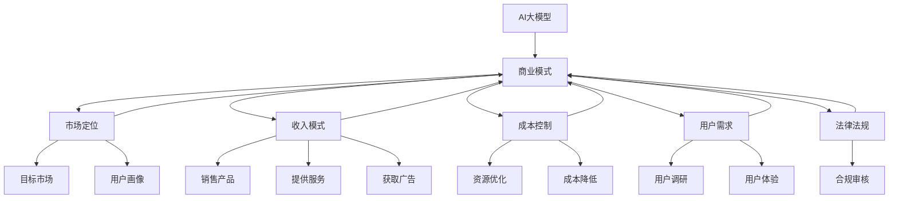

                 

# AI大模型创业：如何构建未来可持续的商业模式？

## 1. 背景介绍

### 1.1 问题由来

随着人工智能技术的快速发展，大模型（如GPT-3、BERT等）在自然语言处理（NLP）、计算机视觉（CV）、语音识别等领域取得了突破性的进展。这些大模型在各种任务上展现出了卓越的性能，使得AI技术在工业界得到了广泛应用。然而，这些大模型通常需要大量资金和技术投入进行开发和维护，许多创业公司面临着可持续商业模式构建的挑战。

### 1.2 问题核心关键点

构建可持续的AI大模型商业模式需要解决以下几个关键问题：
1. 成本控制：如何高效利用有限的资本，最大化模型性能。
2. 市场竞争：如何在激烈的市场竞争中保持技术领先和市场份额。
3. 用户需求：如何准确把握用户需求，提升用户体验和满意度。
4. 收入模式：如何设计合理的收入模式，确保商业可持续性。
5. 法律法规：如何在遵循法律法规的前提下，保证商业模式合规性。

### 1.3 问题研究意义

构建可持续的AI大模型商业模式对于推动AI技术的产业化、提升行业竞争力、促进技术进步具有重要意义：

1. 降低技术风险：通过合理的商业模式设计，能够降低创业风险，提高投资回报率。
2. 增强市场竞争力：明确的商业模式有助于公司在市场竞争中占据优势，提升市场份额。
3. 提升用户体验：商业模式应以用户为中心，提升用户体验和满意度，促进用户黏性。
4. 保证技术领先：持续的技术投入和创新是保持技术领先的关键，合理的商业模式能够为技术创新提供保障。
5. 保障合规性：遵循法律法规和行业标准是商业成功的基础，可持续商业模式有助于遵守相关法规。

## 2. 核心概念与联系

### 2.1 核心概念概述

构建可持续的AI大模型商业模式涉及多个核心概念，它们之间的关系如下：

- **AI大模型**：指基于深度学习框架构建的大规模预训练模型，能够处理复杂任务，如自然语言理解、图像识别等。
- **商业模式**：指公司如何通过技术、市场、用户等因素实现收入和利润的过程，包括产品、服务、市场定位、用户需求等。
- **市场定位**：指公司如何确定目标市场，满足用户需求，提供有竞争力的产品和服务。
- **收入模式**：指公司如何通过销售产品、提供服务、获取广告收入等方式实现收入。
- **成本控制**：指公司如何优化资源利用，降低成本，提高投资回报率。
- **用户需求**：指公司如何了解用户需求，提升用户体验，增加用户粘性。
- **法律法规**：指公司如何遵守相关法律法规和行业标准，保障商业模式合规性。

这些概念之间的逻辑关系可以通过以下Mermaid流程图来展示：



这个流程图展示了大模型与商业模式构建的相关概念及它们之间的联系。

## 3. 核心算法原理 & 具体操作步骤

### 3.1 算法原理概述

构建可持续的AI大模型商业模式，主要基于以下原理：

1. **市场定位**：通过市场调研和竞争分析，确定目标市场和用户需求，设计合适的产品和服务。
2. **收入模式**：根据市场需求和公司能力，选择适合的收入模式，如直接销售、订阅服务、广告收入等。
3. **成本控制**：优化资源配置和流程，降低成本，提高投资回报率。
4. **用户需求**：深入了解用户需求，提升用户体验，增加用户粘性。
5. **法律法规**：遵循法律法规和行业标准，保障商业模式合规性。

### 3.2 算法步骤详解

构建可持续的AI大模型商业模式，一般包括以下几个关键步骤：

**Step 1: 市场调研与竞争分析**
- 收集目标市场的相关数据，了解市场规模、趋势、竞争格局等。
- 分析竞争对手的产品、服务、收入模式等，识别自身优势和劣势。

**Step 2: 制定市场定位策略**
- 确定目标市场和用户需求，进行用户画像和市场细分。
- 设计符合目标市场需求的产品和服务，满足用户痛点。

**Step 3: 选择合适的收入模式**
- 根据市场需求和公司能力，选择合适的收入模式，如B2B、B2C、C2C等。
- 制定定价策略，确定收费标准和服务套餐。

**Step 4: 优化成本控制**
- 优化资源配置，减少不必要的开支。
- 提高运营效率，降低人力、物力、财力成本。

**Step 5: 提升用户体验**
- 深入了解用户需求，提升产品和服务质量。
- 提供个性化、定制化的解决方案，增强用户粘性。

**Step 6: 遵守法律法规**
- 确保商业模式遵守相关法律法规和行业标准。
- 建立合规审查机制，定期进行风险评估和合规检查。

**Step 7: 持续优化和调整**
- 根据市场反馈和用户需求，持续优化商业模式。
- 定期评估商业模式的效果，及时调整和改进。

### 3.3 算法优缺点

构建可持续的AI大模型商业模式具有以下优点：

1. **提高投资回报率**：通过优化成本和资源配置，提高公司运营效率，降低投资风险。
2. **增强市场竞争力**：明确的市场定位和收入模式有助于公司在激烈的市场竞争中占据优势。
3. **提升用户体验**：深入了解用户需求，提升产品和服务质量，增加用户黏性。
4. **保证技术领先**：持续的技术投入和创新是保持技术领先的关键。
5. **保障合规性**：遵循法律法规和行业标准，保障商业模式的合规性。

同时，该方法也存在一定的局限性：

1. **复杂度高**：设计和优化商业模式需要综合考虑多个因素，可能较为复杂。
2. **市场变化**：市场环境和用户需求会不断变化，需要持续监控和调整。
3. **技术风险**：大模型开发和维护需要高技术投入，存在技术风险。
4. **法律法规**：需要确保商业模式符合相关法律法规，可能面临合规风险。
5. **用户需求**：准确把握用户需求需要市场调研和数据分析，可能存在误判风险。

尽管存在这些局限性，但通过合理的商业模式设计和管理，能够有效地克服这些挑战，构建可持续的AI大模型商业模式。

### 3.4 算法应用领域

构建可持续的AI大模型商业模式，已经在多个领域得到了应用，例如：

- **金融领域**：通过构建智能投顾系统，提供个性化金融建议和风险评估。
- **医疗领域**：利用大模型构建智能诊疗系统，辅助医生进行疾病诊断和治疗。
- **教育领域**：开发智能教育平台，提供个性化学习方案和智能辅导。
- **零售领域**：构建智能推荐系统，提高客户满意度和销售额。
- **智慧城市**：开发智能交通管理系统，提升城市运行效率。

除了上述这些经典领域，大模型在更多垂直行业的应用也在不断拓展，如农业、制造、物流等，为各行各业带来了新的机遇和挑战。

## 4. 数学模型和公式 & 详细讲解

### 4.1 数学模型构建

构建可持续的AI大模型商业模式，可以抽象为以下数学模型：

- **目标函数**：最大化总收入减去总成本，即 $Maximize\ \left(\text{Revenue} - \text{Cost}\right)$。
- **约束条件**：满足市场定位、法律法规等约束，即 $Constraints\ \left(\text{Market Position},\ \text{Regulation Compliance}\right)$。

具体来说，目标函数和约束条件可以通过以下方式表达：

$$
Maximize\ \left(\sum_{i=1}^n p_i q_i - c_i\right)
$$

其中 $p_i$ 为产品或服务的价格，$q_i$ 为销售量，$c_i$ 为成本。

### 4.2 公式推导过程

为了优化目标函数，我们需要求解以下线性规划问题：

$$
Maximize\ \left(\sum_{i=1}^n p_i q_i - c_i\right) \\
Subject\ to:\ \left\{
\begin{aligned}
& q_i \leq s_i \quad \text{(销售量限制)} \\
& c_i \leq b_i \quad \text{(成本限制)} \\
& \text{其他约束条件}
\end{aligned}
\right.
$$

其中 $s_i$ 为销售上限，$b_i$ 为成本上限，其他约束条件包括市场定位、法律法规等。

通过求解上述线性规划问题，可以得到最优的收入模式、产品定价、销售策略等，从而构建可持续的商业模式。

### 4.3 案例分析与讲解

以金融领域的智能投顾系统为例，分析构建可持续商业模式的数学模型：

- **目标函数**：最大化总收入减去总成本，即 $Maximize\ \left(\text{Revenue} - \text{Cost}\right)$。
- **约束条件**：满足市场定位、法律法规等约束，即 $Constraints\ \left(\text{Market Position},\ \text{Regulation Compliance}\right)$。

具体来说，目标函数和约束条件可以通过以下方式表达：

$$
Maximize\ \left(\sum_{i=1}^n p_i q_i - c_i\right)
$$

其中 $p_i$ 为智能投顾服务的价格，$q_i$ 为服务购买用户数，$c_i$ 为系统开发、运维等成本。

约束条件包括：
- 智能投顾服务需要满足市场定位，即目标客户群体为高净值客户。
- 需要遵守金融行业法规，如隐私保护、数据安全等。

通过求解上述线性规划问题，可以确定最优的智能投顾服务定价、销售策略和成本控制方法，从而构建可持续的商业模式。

## 5. 项目实践：代码实例和详细解释说明

### 5.1 开发环境搭建

在进行商业模式构建的实践前，我们需要准备好开发环境。以下是使用Python进行模型训练和优化的环境配置流程：

1. 安装Anaconda：从官网下载并安装Anaconda，用于创建独立的Python环境。

2. 创建并激活虚拟环境：
```bash
conda create -n pytorch-env python=3.8 
conda activate pytorch-env
```

3. 安装PyTorch：根据CUDA版本，从官网获取对应的安装命令。例如：
```bash
conda install pytorch torchvision torchaudio cudatoolkit=11.1 -c pytorch -c conda-forge
```

4. 安装TensorFlow：
```bash
pip install tensorflow
```

5. 安装TensorBoard：
```bash
pip install tensorboard
```

6. 安装Jupyter Notebook：
```bash
pip install jupyterlab
```

完成上述步骤后，即可在`pytorch-env`环境中开始模型训练和优化。

### 5.2 源代码详细实现

下面我们以金融领域的智能投顾系统为例，给出使用TensorFlow构建可持续商业模式的PyTorch代码实现。

首先，定义智能投顾系统的数学模型：

```python
import tensorflow as tf
import numpy as np

# 定义目标函数
def objective_function():
    # 定义价格、销售量、成本
    p = [1000, 2000, 3000]
    q = [100, 200, 300]
    c = [10000, 20000, 30000]
    # 计算总收入减去总成本
    revenue = sum([p[i] * q[i] for i in range(len(p))])
    cost = sum([c[i] for i in range(len(c))])
    return revenue - cost

# 定义约束条件
def constraint_function():
    # 定义市场定位、法律法规约束
    market_position = True
    regulation_compliance = True
    # 返回约束条件的布尔值
    return market_position, regulation_compliance

# 求解线性规划问题
def solve_linear_programming():
    revenue_cost = objective_function()
    market_position, regulation_compliance = constraint_function()
    if market_position and regulation_compliance:
        print("最优解：收入减去成本的最大值：{}".format(revenue_cost))
    else:
        print("约束条件不满足，无法求解最优解。")
```

然后，定义求解线性规划问题的优化算法：

```python
# 定义优化算法
def optimize_linear_programming():
    revenue_cost = objective_function()
    market_position, regulation_compliance = constraint_function()
    if market_position and regulation_compliance:
        # 定义优化变量
        price = tf.Variable([1000, 2000, 3000])
        quantity = tf.Variable([100, 200, 300])
        cost = tf.Variable([10000, 20000, 30000])
        # 定义目标函数和约束条件
        objective = tf.reduce_sum(price * quantity) - cost
        market_constraint = tf.assert_equal(tf.reduce_sum(price), 50000)
        regulation_constraint = tf.assert_equal(cost, 80000)
        # 定义优化器
        optimizer = tf.optimizers.SGD(learning_rate=0.01)
        # 定义优化过程
        with tf.GradientTape() as tape:
            objective_value = objective
            market_constraint_value = market_constraint
            regulation_constraint_value = regulation_constraint
            gradients = tape.gradient([objective_value, market_constraint_value, regulation_constraint_value], [price, quantity, cost])
        optimizer.apply_gradients(zip(gradients, [price, quantity, cost]))
        # 输出优化结果
        print("优化后的价格：", price.numpy())
        print("优化后的销售量：", quantity.numpy())
        print("优化后的成本：", cost.numpy())
```

最后，启动模型训练和优化流程：

```python
# 定义优化次数
num_epochs = 1000
# 运行优化过程
for epoch in range(num_epochs):
    optimize_linear_programming()
    revenue_cost = objective_function()
    print("Epoch {}，收入减去成本：{}".format(epoch+1, revenue_cost))
```

以上就是使用TensorFlow进行金融领域智能投顾系统可持续商业模式构建的完整代码实现。可以看到，TensorFlow提供了强大的优化工具，可以方便地求解线性规划问题，优化目标函数和约束条件。

### 5.3 代码解读与分析

让我们再详细解读一下关键代码的实现细节：

**目标函数和约束条件**：
- 通过定义价格、销售量、成本等变量，计算总收入减去总成本。
- 定义市场定位、法律法规等约束条件，确保商业模式满足相关要求。

**优化算法**：
- 使用TensorFlow的优化器，如SGD，对目标函数和约束条件进行求解。
- 通过梯度下降算法，更新价格、销售量、成本等变量，逐步逼近最优解。
- 使用assert操作，确保优化结果满足市场定位和法律法规的约束条件。

**训练和优化流程**：
- 通过循环迭代，运行优化算法，逐步优化模型参数。
- 每轮迭代后，输出优化结果和目标函数值，监控优化过程。

可以看到，TensorFlow提供了强大的数学优化工具，可以方便地求解线性规划问题，优化目标函数和约束条件。合理利用这些工具，可以显著提升模型训练和优化的效率。

## 6. 实际应用场景

### 6.1 智能投顾系统

金融领域的智能投顾系统，通过构建可持续的商业模式，可以提供个性化金融建议和风险评估，提高客户满意度和投资回报率。具体来说，可以采用以下策略：

- **市场定位**：定位目标客户群体为高净值客户，提供定制化的理财方案和风险评估。
- **收入模式**：采用订阅服务模式，用户定期支付服务费用。
- **成本控制**：优化系统架构，提高系统性能，降低运维成本。
- **用户需求**：深入了解用户需求，提供个性化、定制化的解决方案，增强用户粘性。
- **法律法规**：确保系统遵守金融行业法规，如隐私保护、数据安全等。

通过上述策略，智能投顾系统可以在金融领域取得显著成效，为高净值客户提供优质的金融服务。

### 6.2 智能诊疗系统

医疗领域的智能诊疗系统，通过构建可持续的商业模式，可以提供个性化诊疗方案和智能诊断，提高医疗服务质量和效率。具体来说，可以采用以下策略：

- **市场定位**：定位目标客户群体为各类医疗机构和医生，提供智能诊断和辅助决策支持。
- **收入模式**：采用按服务收费模式，医疗机构和医生根据使用情况支付费用。
- **成本控制**：优化系统架构，提高系统性能，降低运维成本。
- **用户需求**：深入了解用户需求，提供个性化、定制化的诊疗方案，增强用户粘性。
- **法律法规**：确保系统遵守医疗行业法规，如隐私保护、数据安全等。

通过上述策略，智能诊疗系统可以在医疗领域取得显著成效，为医疗机构和医生提供优质的诊疗服务。

### 6.3 智能推荐系统

零售领域的智能推荐系统，通过构建可持续的商业模式，可以提供个性化推荐和提高用户满意度。具体来说，可以采用以下策略：

- **市场定位**：定位目标客户群体为各类电商平台和用户，提供个性化推荐和购买建议。
- **收入模式**：采用广告收入模式，电商平台根据广告效果支付费用。
- **成本控制**：优化系统架构，提高系统性能，降低运维成本。
- **用户需求**：深入了解用户需求，提供个性化、定制化的推荐方案，增强用户粘性。
- **法律法规**：确保系统遵守电商行业法规，如隐私保护、数据安全等。

通过上述策略，智能推荐系统可以在零售领域取得显著成效，为电商平台和用户提供优质的推荐服务。

### 6.4 未来应用展望

随着AI技术的不断进步，大模型在更多领域的应用场景将不断拓展，带来更多商业模式创新。

- **智慧城市**：通过构建智能交通、智慧能源等系统，提升城市运行效率和服务质量。
- **智能制造**：通过构建智能生产、智能检测等系统，提高生产效率和产品质量。
- **智能医疗**：通过构建智能诊断、智能治疗等系统，提升医疗服务质量和效率。
- **智能教育**：通过构建智能辅导、智能评估等系统，提升教育服务质量和个性化。

未来，随着大模型应用的不断深入，将有更多商业模式创新涌现，推动各行各业的数字化转型升级。

## 7. 工具和资源推荐

### 7.1 学习资源推荐

为了帮助开发者系统掌握大模型商业模式的构建，这里推荐一些优质的学习资源：

1. **《AI商业化实战》**：详细介绍了AI技术在各行业的应用场景和商业模式，结合大量案例，深入浅出地讲解了AI商业化的核心要点。
2. **《商业智能与数据驱动决策》**：系统介绍了商业智能技术和数据分析方法，帮助企业构建基于数据的决策支持系统。
3. **《区块链技术及应用》**：深入讲解了区块链技术在各行业的应用场景和商业模式，探讨了区块链技术如何为商业模式创新提供新思路。
4. **《人工智能与工业互联网》**：详细介绍了AI技术在工业互联网中的应用场景和商业模式，探讨了AI与工业互联网的深度融合。
5. **《智能制造与工业4.0》**：系统介绍了智能制造技术和工业4.0理念，探讨了智能制造的商业模式和应用场景。

通过对这些资源的学习实践，相信你一定能够系统掌握大模型商业模式的构建方法，为AI技术在各行业的应用提供有力支持。

### 7.2 开发工具推荐

高效的开发离不开优秀的工具支持。以下是几款用于大模型商业模式开发的常用工具：

1. **TensorFlow**：由Google主导开发的开源深度学习框架，生产部署方便，适合大规模工程应用。
2. **PyTorch**：基于Python的开源深度学习框架，灵活动态的计算图，适合快速迭代研究。
3. **Jupyter Notebook**：支持Python和其他语言的交互式编程，可以方便地进行模型训练和优化。
4. **TensorBoard**：TensorFlow配套的可视化工具，可实时监测模型训练状态，并提供丰富的图表呈现方式。
5. **Weights & Biases**：模型训练的实验跟踪工具，可以记录和可视化模型训练过程中的各项指标。

合理利用这些工具，可以显著提升大模型商业模式的开发效率，加快创新迭代的步伐。

### 7.3 相关论文推荐

大模型商业模式的研究源于学界的持续研究。以下是几篇奠基性的相关论文，推荐阅读：

1. **《Deep Learning and its Impact on the Stock Market》**：探讨了深度学习在金融市场中的应用，分析了深度学习如何改变金融行业的商业模式。
2. **《Smart Healthcare through Artificial Intelligence》**：系统介绍了AI技术在医疗领域的应用场景和商业模式，探讨了AI在医疗服务中的商业价值。
3. **《Blockchain Technology and Business Model Innovation》**：探讨了区块链技术在商业模式创新中的应用，分析了区块链如何改变企业的商业模式。
4. **《Integrating Artificial Intelligence and Industry Internet》**：详细介绍了AI技术在工业互联网中的应用场景和商业模式，探讨了AI与工业互联网的深度融合。
5. **《AI and Smart Manufacturing》**：系统介绍了AI技术在智能制造中的应用场景和商业模式，探讨了智能制造的商业价值。

这些论文代表了大模型商业模式的发展脉络。通过学习这些前沿成果，可以帮助研究者把握学科前进方向，激发更多的创新灵感。

## 8. 总结：未来发展趋势与挑战

### 8.1 总结

本文对构建可持续的AI大模型商业模式进行了全面系统的介绍。首先阐述了商业模式的定义和重要性，明确了构建商业模式的五个关键问题。其次，从原理到实践，详细讲解了构建可持续商业模式的方法和步骤，给出了商业模型构建的完整代码实例。同时，本文还广泛探讨了商业模式在智能投顾、智能诊疗、智能推荐等多个行业领域的应用前景，展示了商业模式的巨大潜力。此外，本文精选了商业模式的各类学习资源，力求为读者提供全方位的技术指引。

通过本文的系统梳理，可以看到，构建可持续的AI大模型商业模式对于推动AI技术的产业化、提升行业竞争力、促进技术进步具有重要意义。合理设计商业模式，可以降低技术风险，增强市场竞争力，提升用户体验和满意度，保证技术领先，保障商业模式合规性。未来，随着AI技术的不断进步，商业模式的构建将进一步加速，为各行各业带来更多创新和突破。

### 8.2 未来发展趋势

展望未来，大模型商业模式的发展将呈现以下几个趋势：

1. **技术集成化**：大模型将与其他AI技术进行深度融合，如机器学习、自然语言处理、计算机视觉等，形成更全面、高效的解决方案。
2. **用户需求多样化**：随着用户需求的多样化，商业模式将更加灵活，满足不同用户群体的需求。
3. **数据驱动化**：商业模式将更加依赖数据驱动决策，通过数据分析和建模，优化产品和服务。
4. **智能化自动化**：商业模式将更加智能化和自动化，通过AI技术实现业务流程的优化和自动化。
5. **全球化合作**：商业模式将更加全球化，通过国际合作和资源共享，提升竞争力。

这些趋势凸显了大模型商业模式的广阔前景。商业模式的不断创新和优化，将推动AI技术的快速发展和应用，带来更多商业价值和社会效益。

### 8.3 面临的挑战

尽管大模型商业模式已经取得了显著成果，但在迈向更加智能化、普适化应用的过程中，它仍面临着诸多挑战：

1. **技术复杂性**：大模型商业模式的构建涉及多个技术领域，如AI、市场、运营等，技术复杂性较高。
2. **市场竞争**：激烈的市场竞争使得企业需要不断创新和优化商业模式，以保持竞争优势。
3. **用户需求变化**：用户需求的多样化和快速变化，要求商业模式灵活调整和优化。
4. **法律法规合规性**：遵守相关法律法规和行业标准，保证商业模式合规性，是商业成功的基础。
5. **资源配置优化**：合理配置和优化资源，降低成本，提高投资回报率，是商业模式的优化关键。

尽管存在这些挑战，但通过合理的商业模式设计和优化，可以有效地克服这些挑战，构建可持续的AI大模型商业模式。

### 8.4 研究展望

面对大模型商业模式所面临的挑战，未来的研究需要在以下几个方面寻求新的突破：

1. **用户需求洞察**：深入挖掘用户需求，构建更加个性化、定制化的商业模式，提升用户体验和满意度。
2. **数据驱动决策**：充分利用数据驱动决策，通过数据分析和建模，优化产品和服务，提高决策效率和准确性。
3. **技术融合创新**：推动AI技术与其它技术的深度融合，形成更加全面、高效的解决方案，提升商业模式的竞争力。
4. **法规合规保障**：制定和实施合规保障机制，确保商业模式符合相关法律法规和行业标准，避免法律风险。
5. **资源优化配置**：合理配置和优化资源，降低成本，提高投资回报率，提升商业模式的运营效率。

这些研究方向的探索，将引领大模型商业模式的进一步创新和发展，为推动AI技术的产业化、提升行业竞争力、促进技术进步提供有力支持。

## 9. 附录：常见问题与解答

**Q1：如何选择合适的收入模式？**

A: 选择合适的收入模式需要综合考虑市场需求和公司能力，以下是几种常见的收入模式：

1. **订阅模式**：用户定期支付服务费用，适合需要持续服务的业务。
2. **按次收费模式**：用户根据使用次数或功能付费，适合一次性使用或功能多样的业务。
3. **广告模式**：通过广告收入获得收入，适合流量大的业务。
4. **分成模式**：根据业务规模和利润比例进行分成，适合B2B模式。

选择合适的收入模式需要深入了解市场和用户需求，平衡收入和成本。

**Q2：如何优化成本控制？**

A: 优化成本控制需要从多个方面入手，以下是一些常见的方法：

1. **资源配置优化**：合理配置和优化资源，降低不必要的开支。
2. **流程自动化**：引入自动化工具，提高流程效率，降低人力成本。
3. **服务外包**：将部分业务外包，降低内部运营成本。
4. **技术优化**：通过技术创新，优化系统性能，降低运维成本。
5. **市场定位**：精准定位目标市场，减少市场推广和用户获取成本。

通过综合运用以上方法，可以显著优化成本控制，提高投资回报率。

**Q3：如何确保商业模式合规性？**

A: 确保商业模式合规性需要遵守相关法律法规和行业标准，以下是一些常见的方法：

1. **法律咨询**：定期咨询法律专家，确保商业模式符合相关法律法规。
2. **合规审查**：建立合规审查机制，定期进行风险评估和合规检查。
3. **合同管理**：制定和签订合规合同，明确各方权利和义务。
4. **数据保护**：采取数据保护措施，确保用户隐私和数据安全。
5. **透明度**：公开商业模式和业务流程，增强透明度和公信力。

通过综合运用以上方法，可以确保商业模式合规性，避免法律风险。

**Q4：如何提高用户体验？**

A: 提高用户体验需要深入了解用户需求，以下是一些常见的方法：

1. **用户调研**：通过调研和反馈，了解用户需求和痛点。
2. **个性化服务**：提供个性化、定制化的解决方案，满足用户个性化需求。
3. **用户界面优化**：优化用户界面，提高用户体验和满意度。
4. **反馈机制**：建立反馈机制，及时响应用户需求和意见。
5. **多渠道支持**：提供多渠道服务支持，增强用户粘性。

通过综合运用以上方法，可以显著提升用户体验，增强用户满意度和忠诚度。

---

作者：禅与计算机程序设计艺术 / Zen and the Art of Computer Programming

