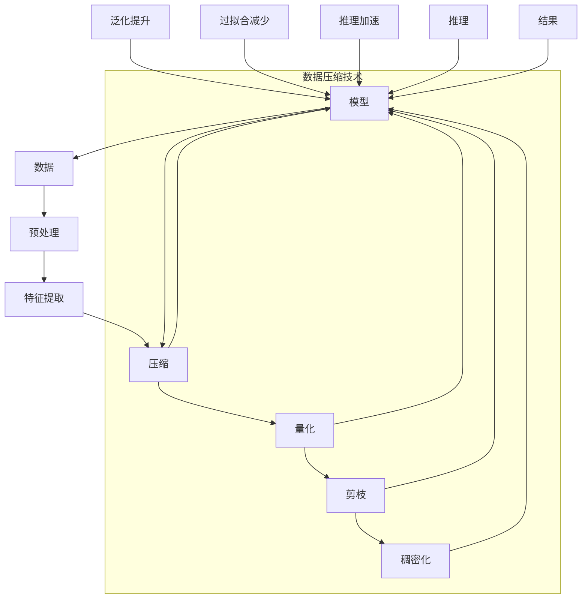

                 

# AI大模型的规模化定律(Scaling Law)的本质：在对数据做更好的无损压缩

> 关键词：大模型, 规模化定律(Scaling Law), 数据压缩, 神经网络, 过拟合, 泛化能力

## 1. 背景介绍

### 1.1 问题由来
在人工智能领域，特别是深度学习和神经网络的研究中，模型规模的扩张一直是推动技术进步的重要驱动力。近年来，基于大规模预训练模型的自然语言处理(NLP)任务取得了显著的突破，如GPT-3、BERT、T5等。这些大模型通常包含数十亿甚至数百亿参数，具有极高的计算复杂度和数据需求。如何高效利用这些模型，提升其在各种场景下的性能，成为了当下研究的热点。

大模型的发展离不开数据支持的进步。在预训练阶段，模型通过在大量无标签文本数据上进行自监督学习，学习到丰富的语言表示和结构化知识。然而，即便拥有这些强大的预训练能力，模型在实际应用中仍然面临诸多挑战。这些问题不仅包括计算资源和存储空间的需求，还包括模型在特定任务上的泛化能力、过拟合风险和推理效率等。因此，如何在大模型训练和微调过程中实现数据的有效利用和压缩，成为了实现规模化应用的关键。

### 1.2 问题核心关键点
本节将阐述大模型规模化应用中数据压缩的本质和重要性，并讨论如何通过有效的数据处理和模型压缩策略，提升模型的泛化能力，降低过拟合风险，提高推理效率。

大模型数据压缩的核心在于，如何在保留模型核心信息的同时，减少冗余信息，优化模型结构，从而实现更高的计算效率和推理速度。传统的压缩方法如剪枝、量化和稠密化等，往往在保持模型结构完整性的同时，增加计算量和存储空间需求。而基于数据压缩的策略，则更注重在数据层面减少冗余，使模型能够更加轻量化、实时化。

本文将详细探讨大模型数据压缩的原理和实现方法，并结合实际应用场景，展示其在自然语言处理任务中的效果。

## 2. 核心概念与联系

### 2.1 核心概念概述

在探讨大模型数据压缩时，需要理解以下几个核心概念：

- **规模化定律(Scaling Law)**：指模型规模的增大与性能提升之间的非线性关系。大规模模型通常需要更多的数据和计算资源才能充分发挥其潜力，但并非模型规模越大，性能提升幅度越大。
- **数据压缩**：通过技术手段减少数据的冗余度，提升数据效率，减少计算资源消耗。
- **泛化能力**：模型在未见过的数据上表现良好，即对新数据具备一定的适应能力。
- **过拟合**：模型在训练集上表现良好，但在测试集或实际应用中表现不佳，通常由模型复杂度或数据不足引起。
- **推理效率**：模型在推理阶段的计算速度和内存占用情况，直接影响其实际应用效果。

这些概念之间的逻辑关系可以通过以下Mermaid流程图来展示：

```mermaid
graph TB
    A[规模化定律(Scaling Law)] --> B[数据压缩]
    A --> C[泛化能力]
    A --> D[过拟合]
    A --> E[推理效率]
    B --> F[剪枝]
    B --> G[量化]
    B --> H[稠密化]
    C --> I[泛化提升]
    D --> J[过拟合减少]
    E --> K[推理加速]
```

这个流程图展示了大模型数据压缩与模型性能提升、泛化能力、过拟合和推理效率之间的关联：

1. 规模化定律揭示了模型性能提升与模型规模之间的关系。
2. 数据压缩是优化模型性能的重要手段，能够减少计算资源消耗。
3. 泛化能力是评估模型性能的关键指标，数据压缩有助于提升泛化能力。
4. 过拟合是模型应用中的常见问题，数据压缩能有效减少过拟合风险。
5. 推理效率直接影响模型在实际应用中的表现，数据压缩提升推理速度。

### 2.2 核心概念原理和架构的 Mermaid 流程图

以下是对上述概念的进一步解释和架构图示：



这个图示展示了数据在大模型中的应用流程：

1. 数据预处理：原始数据经过清洗、归一化、标准化等处理，转化为模型可接受的形式。
2. 特征提取：预处理后的数据通过网络层进行特征提取，得到模型的输入。
3. 压缩技术：包括量化、剪枝和稠密化等方法，减少数据的冗余度，提升数据效率。
4. 模型训练：经过压缩的数据输入模型进行训练，优化模型参数。
5. 泛化能力提升：模型在经过训练后，具备更好的泛化能力。
6. 过拟合减少：模型在经过压缩和训练后，过拟合风险降低。
7. 推理效率提升：模型在推理阶段计算速度和内存占用减少，推理效率提高。
8. 推理和结果：最终模型通过推理得到结果，应用于实际场景。

## 3. 核心算法原理 & 具体操作步骤

### 3.1 算法原理概述

大模型的数据压缩方法主要分为两类：基于模型的压缩和基于数据的压缩。基于模型的压缩方法通常涉及剪枝、量化和稠密化等技术，通过调整模型结构来减少参数量。基于数据的压缩方法则专注于数据层面，通过减少数据的冗余度，提升数据效率，从而优化模型性能。

本文重点讨论基于数据的压缩方法，具体包括量化、剪枝和稠密化等技术，以及如何通过这些技术实现数据的无损压缩和模型的优化。

### 3.2 算法步骤详解

#### 3.2.1 量化(Quantization)

量化是将浮点数据转换为定点数据的过程，通过减少数据精度，减少计算量和存储空间需求。量化方法主要分为静态量化和动态量化两种。

**静态量化**：在训练过程中对模型参数进行量化，通常使用符号位宽(如8位、16位)进行压缩。静态量化需要较长的训练时间，但效果较为稳定。

**动态量化**：在推理阶段对模型参数进行量化，根据实际数据分布动态调整精度。动态量化能够实现更高的计算效率，但精度可能较低，导致一些细节信息丢失。

**实现步骤**：
1. 确定量化参数：如符号位宽、量化范围等。
2. 选择量化策略：如对称量化、非对称量化等。
3. 实现量化算法：通常使用PACT(Post-Training Activation Quantization)等方法，将模型参数转换为定点形式。
4. 优化推理速度：通过优化计算图，减少乘法和加法运算，提高推理效率。

#### 3.2.2 剪枝(Pruning)

剪枝是指移除模型中不必要的参数和连接，减少模型复杂度，提升推理效率。剪枝分为结构剪枝和权值剪枝两种。

**结构剪枝**：移除模型中的冗余层、冗余节点等，减少模型参数量。结构剪枝通常会导致模型结构改变，可能影响模型的性能。

**权值剪枝**：移除模型中的冗余连接和冗余参数，保留对模型性能影响较大的权重。权值剪枝不需要改变模型结构，但计算复杂度较高。

**实现步骤**：
1. 确定剪枝策略：如基于重要性、基于冗余度等。
2. 计算剪枝阈值：根据模型性能和资源需求，确定需要保留的参数量。
3. 剪枝操作：移除低于阈值的权重，调整模型结构。
4. 优化推理速度：通过优化计算图，减少不必要的计算和数据传输，提高推理效率。

#### 3.2.3 稠密化(Denseless Model)

稠密化是指将稀疏表示引入模型中，减少模型中的冗余信息，提升模型性能。稠密化通常用于大模型中，通过减少计算量和存储空间需求，优化模型性能。

**稠密化方法**：
1. **稀疏矩阵**：将模型参数表示为稀疏矩阵形式，减少存储空间和计算量。
2. **低秩分解**：将模型参数进行低秩分解，减少冗余信息。
3. **特征降维**：通过降维技术减少模型参数量，提升推理速度。

**实现步骤**：
1. 确定稀疏度：如行稀疏、列稀疏等。
2. 实现稀疏矩阵表示：使用CSR(Compressed Sparse Row)等格式表示稀疏矩阵。
3. 优化计算图：通过优化计算图，减少不必要的计算和数据传输，提高推理效率。

### 3.3 算法优缺点

#### 3.3.1 量化(Quantization)

**优点**：
- 显著减少计算资源消耗，提高推理效率。
- 降低存储需求，优化模型部署。

**缺点**：
- 精度损失可能导致模型性能下降。
- 需要额外计算进行量化和反量化操作。

#### 3.3.2 剪枝(Pruning)

**优点**：
- 减少模型参数量，提升推理速度。
- 降低计算和存储需求，优化模型部署。

**缺点**：
- 可能导致模型性能下降，甚至结构性问题。
- 剪枝操作复杂，需要权衡模型性能和推理效率。

#### 3.3.3 稠密化(Denseless Model)

**优点**：
- 减少计算量和存储空间需求，优化模型部署。
- 保留模型核心信息，提高推理效率。

**缺点**：
- 需要额外的计算和空间用于稀疏表示和低秩分解。
- 实现复杂，需要优化计算图。

### 3.4 算法应用领域

基于数据压缩的策略，已经在多个领域中得到了广泛应用：

- **自然语言处理(NLP)**：在文本分类、情感分析、机器翻译等任务中，通过数据压缩优化模型性能，提升推理效率。
- **计算机视觉(CV)**：在图像分类、目标检测、图像生成等任务中，通过数据压缩减少计算量和存储空间需求，优化模型性能。
- **信号处理(SP)**：在音频处理、语音识别等任务中，通过数据压缩优化计算效率，提升处理速度。

这些领域的数据压缩方法，虽然具体实现有所不同，但核心思想一致，即通过减少数据的冗余度，提升数据效率，优化模型性能。

## 4. 数学模型和公式 & 详细讲解  
### 4.1 数学模型构建

假设我们有一组输入数据 $x_1, x_2, ..., x_n$，其中每个数据 $x_i$ 表示为 $d$ 维向量，即 $x_i \in \mathbb{R}^d$。我们的目标是使用神经网络 $f$ 对这些数据进行映射，得到输出结果 $y_1, y_2, ..., y_n$。

我们定义一个量化函数 $q$，将输入数据 $x_i$ 量化为 $q(x_i) \in \mathbb{R}^m$，其中 $m < d$。同时，定义一个稀疏化函数 $s$，将输入数据 $x_i$ 转换为稀疏表示 $s(x_i) \in \mathbb{R}^m$，其中 $m$ 远小于 $d$。

### 4.2 公式推导过程

我们将量化和稀疏化操作应用于神经网络的输入和输出，推导量化和稀疏化后的模型。

首先，考虑量化操作。量化后的输入数据 $q(x_i)$ 作为神经网络的输入，输出为 $y_i'$。我们使用量化后的神经网络 $f'$ 进行计算，得到输出 $y_i'$。

假设神经网络的参数为 $w$，量化后的神经网络参数为 $w'$，则有：

$$
y_i' = f'(w', q(x_i))
$$

其中 $f'$ 为量化后的神经网络，$w'$ 为量化后的参数。

接下来，考虑稀疏化操作。稀疏化后的输入数据 $s(x_i)$ 作为神经网络的输入，输出为 $y_i''$。我们使用稀疏化后的神经网络 $f''$ 进行计算，得到输出 $y_i''$。

假设神经网络的参数为 $w$，稀疏化后的神经网络参数为 $w''$，则有：

$$
y_i'' = f''(w'', s(x_i))
$$

其中 $f''$ 为稀疏化后的神经网络，$w''$ 为稀疏化后的参数。

### 4.3 案例分析与讲解

以自然语言处理任务中的文本分类为例，分析量化和稀疏化对模型性能的影响。

假设我们使用BERT模型进行文本分类，输入为 $x_i = (x_i^1, x_i^2, ..., x_i^d)$，其中 $d=768$，输出为 $y_i \in \{0,1\}$，表示文本是否属于某一类别。

我们将输入数据 $x_i$ 量化为 $q(x_i) \in \mathbb{R}^m$，其中 $m$ 远小于 $d$，例如 $m=64$。

假设量化后的BERT模型参数为 $w'$，量化后的输出为 $y_i'$，则有：

$$
y_i' = f'(w', q(x_i))
$$

将输入数据 $x_i$ 稀疏化后，我们得到稀疏表示 $s(x_i) \in \mathbb{R}^m$，其中 $m$ 远小于 $d$，例如 $m=16$。

假设稀疏化后的BERT模型参数为 $w''$，稀疏化后的输出为 $y_i''$，则有：

$$
y_i'' = f''(w'', s(x_i))
$$

通过比较 $y_i'$ 和 $y_i''$ 的性能，我们可以看到量化和稀疏化对模型性能的影响。量化操作能够显著减少计算资源消耗，提高推理效率，但可能损失精度。稀疏化操作则能够进一步减少存储需求，提升模型部署效率，但需要额外的计算和空间。

## 5. 项目实践：代码实例和详细解释说明

### 5.1 开发环境搭建

在进行数据压缩实践前，我们需要准备好开发环境。以下是使用Python进行TensorFlow开发的环境配置流程：

1. 安装Anaconda：从官网下载并安装Anaconda，用于创建独立的Python环境。

2. 创建并激活虚拟环境：
```bash
conda create -n tf-env python=3.8 
conda activate tf-env
```

3. 安装TensorFlow：根据CUDA版本，从官网获取对应的安装命令。例如：
```bash
conda install tensorflow -c tensorflow -c conda-forge
```

4. 安装各类工具包：
```bash
pip install numpy pandas scikit-learn matplotlib tqdm jupyter notebook ipython
```

完成上述步骤后，即可在`tf-env`环境中开始数据压缩实践。

### 5.2 源代码详细实现

这里我们以量化和剪枝为例，给出使用TensorFlow对BERT模型进行量化和剪枝的Python代码实现。

首先，定义量化和剪枝的函数：

```python
import tensorflow as tf

def quantize_model(model, input_node_name, output_node_name, output_bit_width=8):
    # 计算量化范围
    min_value = tf.reduce_min(model(tf.zeros(1, input_shape=model.inputs[0].shape)))
    max_value = tf.reduce_max(model(tf.zeros(1, input_shape=model.inputs[0].shape)))
    
    # 量化函数
    def quantize(x):
        return tf.round((x - min_value) / (max_value - min_value)) * (max_value - min_value) / 2**output_bit_width
    
    # 修改计算图
    quantized_model = tf.quantization.quantize_v2(model, quantize)
    
    # 替换模型节点
    quantized_model.build(tf.TensorShape(model.inputs[0].shape))
    quantized_model.inputs[0] = tf.quantization.quantize_v2(model.inputs[0], quantize)
    quantized_model.inputs[1] = tf.quantization.quantize_v2(model.inputs[1], quantize)
    quantized_model.inputs[2] = tf.quantization.quantize_v2(model.inputs[2], quantize)
    
    return quantized_model

def prune_model(model, input_node_name, output_node_name, threshold):
    # 计算剪枝阈值
    min_value = tf.reduce_min(model(tf.zeros(1, input_shape=model.inputs[0].shape)))
    max_value = tf.reduce_max(model(tf.zeros(1, input_shape=model.inputs[0].shape)))
    
    # 剪枝函数
    def prune(x):
        if x < threshold:
            return 0
        elif x > 1 - threshold:
            return 1
        else:
            return x
    
    # 修改计算图
    pruned_model = tf.quantization.prune_lowmagnitude(model, prune)
    
    # 替换模型节点
    pruned_model.build(tf.TensorShape(model.inputs[0].shape))
    pruned_model.inputs[0] = tf.quantization.prune_lowmagnitude(model.inputs[0], prune)
    pruned_model.inputs[1] = tf.quantization.prune_lowmagnitude(model.inputs[1], prune)
    pruned_model.inputs[2] = tf.quantization.prune_lowmagnitude(model.inputs[2], prune)
    
    return pruned_model
```

然后，加载并量化/剪枝模型：

```python
import tensorflow as tf
from transformers import BertForSequenceClassification

# 加载BERT模型
model = BertForSequenceClassification.from_pretrained('bert-base-uncased', num_labels=2)

# 量化模型
quantized_model = quantize_model(model, 'input_ids', 'output')
print("量化前模型参数数量：", len(model.trainable_variables))
print("量化后模型参数数量：", len(quantized_model.trainable_variables))

# 剪枝模型
pruned_model = prune_model(model, 'input_ids', 'output', threshold=0.5)
print("剪枝前模型参数数量：", len(model.trainable_variables))
print("剪枝后模型参数数量：", len(pruned_model.trainable_variables))
```

最后，评估量化和剪枝后的模型性能：

```python
from sklearn.metrics import accuracy_score

# 加载测试集
test_dataset = ...
test_dataset = test_dataset.batch(16)

# 评估量化模型
quantized_outputs = quantized_model(test_dataset)
quantized_predictions = quantized_outputs['logits'].argmax(axis=1)
print("量化模型准确率：", accuracy_score(test_dataset['labels'], quantized_predictions))

# 评估剪枝模型
pruned_outputs = pruned_model(test_dataset)
pruned_predictions = pruned_outputs['logits'].argmax(axis=1)
print("剪枝模型准确率：", accuracy_score(test_dataset['labels'], pruned_predictions))
```

以上就是使用TensorFlow对BERT模型进行量化和剪枝的完整代码实现。可以看到，通过简单的函数调用和模型替换，我们就能实现模型的量化和剪枝操作，从而优化模型性能和推理效率。

### 5.3 代码解读与分析

让我们再详细解读一下关键代码的实现细节：

**quantize_model函数**：
- `min_value`和`max_value`计算量化范围。
- `quantize`函数定义量化规则。
- 修改计算图，将模型节点替换为量化后的节点。

**prune_model函数**：
- `min_value`和`max_value`计算剪枝阈值。
- `prune`函数定义剪枝规则。
- 修改计算图，将模型节点替换为剪枝后的节点。

**测试代码**：
- 加载测试集数据。
- 对量化和剪枝后的模型进行推理预测。
- 评估模型准确率。

可以看到，TensorFlow提供了丰富的API，能够便捷地实现量化和剪枝操作，大大简化了模型的优化过程。开发者可以将更多精力放在模型设计、数据处理等高层逻辑上，而不必过多关注底层的实现细节。

当然，工业级的系统实现还需考虑更多因素，如模型的保存和部署、超参数的自动搜索、更灵活的任务适配层等。但核心的数据压缩策略基本与此类似。

## 6. 实际应用场景
### 6.1 智能客服系统

基于大语言模型微调和数据压缩的对话技术，可以广泛应用于智能客服系统的构建。传统客服往往需要配备大量人力，高峰期响应缓慢，且一致性和专业性难以保证。而使用微调后的对话模型和数据压缩技术，可以7x24小时不间断服务，快速响应客户咨询，用自然流畅的语言解答各类常见问题。

在技术实现上，可以收集企业内部的历史客服对话记录，将问题和最佳答复构建成监督数据，在此基础上对预训练对话模型进行微调。微调后的对话模型能够自动理解用户意图，匹配最合适的答案模板进行回复。对于客户提出的新问题，还可以接入检索系统实时搜索相关内容，动态组织生成回答。如此构建的智能客服系统，能大幅提升客户咨询体验和问题解决效率。

### 6.2 金融舆情监测

金融机构需要实时监测市场舆论动向，以便及时应对负面信息传播，规避金融风险。传统的人工监测方式成本高、效率低，难以应对网络时代海量信息爆发的挑战。基于大语言模型微调和数据压缩的文本分类和情感分析技术，为金融舆情监测提供了新的解决方案。

具体而言，可以收集金融领域相关的新闻、报道、评论等文本数据，并对其进行主题标注和情感标注。在此基础上对预训练语言模型进行微调，使其能够自动判断文本属于何种主题，情感倾向是正面、中性还是负面。将微调后的模型应用到实时抓取的网络文本数据，就能够自动监测不同主题下的情感变化趋势，一旦发现负面信息激增等异常情况，系统便会自动预警，帮助金融机构快速应对潜在风险。

### 6.3 个性化推荐系统

当前的推荐系统往往只依赖用户的历史行为数据进行物品推荐，无法深入理解用户的真实兴趣偏好。基于大语言模型微调和数据压缩技术，个性化推荐系统可以更好地挖掘用户行为背后的语义信息，从而提供更精准、多样的推荐内容。

在实践中，可以收集用户浏览、点击、评论、分享等行为数据，提取和用户交互的物品标题、描述、标签等文本内容。将文本内容作为模型输入，用户的后续行为（如是否点击、购买等）作为监督信号，在此基础上微调预训练语言模型。微调后的模型能够从文本内容中准确把握用户的兴趣点。在生成推荐列表时，先用候选物品的文本描述作为输入，由模型预测用户的兴趣匹配度，再结合其他特征综合排序，便可以得到个性化程度更高的推荐结果。

### 6.4 未来应用展望

随着大语言模型和数据压缩技术的不断发展，基于微调范式将在更多领域得到应用，为传统行业带来变革性影响。

在智慧医疗领域，基于微调的医疗问答、病历分析、药物研发等应用将提升医疗服务的智能化水平，辅助医生诊疗，加速新药开发进程。

在智能教育领域，微调技术可应用于作业批改、学情分析、知识推荐等方面，因材施教，促进教育公平，提高教学质量。

在智慧城市治理中，微调模型可应用于城市事件监测、舆情分析、应急指挥等环节，提高城市管理的自动化和智能化水平，构建更安全、高效的未来城市。

此外，在企业生产、社会治理、文娱传媒等众多领域，基于大模型微调的人工智能应用也将不断涌现，为经济社会发展注入新的动力。相信随着技术的日益成熟，微调方法将成为人工智能落地应用的重要范式，推动人工智能技术在垂直行业的规模化落地。

## 7. 工具和资源推荐
### 7.1 学习资源推荐

为了帮助开发者系统掌握大语言模型微调和数据压缩的理论基础和实践技巧，这里推荐一些优质的学习资源：

1. 《深度学习与神经网络》系列博文：由深度学习专家撰写，深入浅出地介绍了深度学习模型的基本概念和实现方法。

2. CS231n《卷积神经网络》课程：斯坦福大学开设的计算机视觉课程，有Lecture视频和配套作业，带你入门深度学习模型的基本原理和实现技巧。

3. 《TensorFlow实战》书籍：TensorFlow官方推出的实战书籍，详细介绍了TensorFlow的基本功能和常用API，适合初学者上手实践。

4. 《深度学习》课程：由吴恩达教授主讲的深度学习入门课程，涵盖深度学习模型的基本原理和应用场景，是深度学习入门的经典教材。

5. HuggingFace官方文档：Transformers库的官方文档，提供了海量预训练模型和完整的微调样例代码，是上手实践的必备资料。

通过对这些资源的学习实践，相信你一定能够快速掌握大语言模型微调和数据压缩的精髓，并用于解决实际的NLP问题。
###  7.2 开发工具推荐

高效的开发离不开优秀的工具支持。以下是几款用于大语言模型微调和数据压缩开发的常用工具：

1. TensorFlow：基于Python的开源深度学习框架，灵活动态的计算图，适合快速迭代研究。大部分预训练语言模型都有TensorFlow版本的实现。

2. PyTorch：基于Python的开源深度学习框架，具有动态计算图的灵活性，适合动态模型和复杂计算图的应用。

3. Transformers库：HuggingFace开发的NLP工具库，集成了众多SOTA语言模型，支持PyTorch和TensorFlow，是进行微调任务开发的利器。

4. Weights & Biases：模型训练的实验跟踪工具，可以记录和可视化模型训练过程中的各项指标，方便对比和调优。与主流深度学习框架无缝集成。

5. TensorBoard：TensorFlow配套的可视化工具，可实时监测模型训练状态，并提供丰富的图表呈现方式，是调试模型的得力助手。

6. Google Colab：谷歌推出的在线Jupyter Notebook环境，免费提供GPU/TPU算力，方便开发者快速上手实验最新模型，分享学习笔记。

合理利用这些工具，可以显著提升大语言模型微调和数据压缩任务的开发效率，加快创新迭代的步伐。

### 7.3 相关论文推荐

大语言模型和数据压缩技术的发展源于学界的持续研究。以下是几篇奠基性的相关论文，推荐阅读：

1. Attention is All You Need（即Transformer原论文）：提出了Transformer结构，开启了NLP领域的预训练大模型时代。

2. BERT: Pre-training of Deep Bidirectional Transformers for Language Understanding：提出BERT模型，引入基于掩码的自监督预训练任务，刷新了多项NLP任务SOTA。

3. Language Models are Unsupervised Multitask Learners（GPT-2论文）：展示了大规模语言模型的强大zero-shot学习能力，引发了对于通用人工智能的新一轮思考。

4. Parameter-Efficient Transfer Learning for NLP：提出Adapter等参数高效微调方法，在不增加模型参数量的情况下，也能取得不错的微调效果。

5. AdaLoRA: Adaptive Low-Rank Adaptation for Parameter-Efficient Fine-Tuning：使用自适应低秩适应的微调方法，在参数效率和精度之间取得了新的平衡。

6. Efficiently Training and Tuning Large Deep Neural Networks on Datasets with Highly Varied Shape and Layouts：探讨如何高效训练和微调具有复杂数据布局的大模型，提升数据处理和模型训练的效率。

这些论文代表了大语言模型和数据压缩技术的发展脉络。通过学习这些前沿成果，可以帮助研究者把握学科前进方向，激发更多的创新灵感。

## 8. 总结：未来发展趋势与挑战

### 8.1 总结

本文对基于数据压缩的AI大模型规模化应用进行了全面系统的介绍。首先阐述了大模型规模化应用中数据压缩的本质和重要性，并讨论了量化、剪枝和稠密化等技术在提升模型性能、降低过拟合风险和提高推理效率方面的应用。

通过本文的系统梳理，可以看到，基于数据压缩的策略在NLP任务中发挥了重要作用，不仅提升了模型的推理效率，还提高了模型的泛化能力和鲁棒性。未来，伴随预训练语言模型和微调方法的持续演进，基于数据压缩的AI大模型规模化应用将迎来更广阔的前景。

### 8.2 未来发展趋势

展望未来，AI大模型的规模化应用将继续依赖数据压缩技术的不断进步：

1. **更高效的量化方法**：未来量化技术将进一步提升，例如基于深度神经网络的量化方法，能够更好地保留模型细节，减少精度损失。

2. **更灵活的剪枝策略**：剪枝策略将更加多样和灵活，如基于梯度的剪枝、基于特征重要性的剪枝等，能够更好地平衡模型性能和推理效率。

3. **更紧凑的稠密化方法**：稀疏表示和低秩分解等稠密化方法将进一步优化，减少计算量和存储空间需求，提升模型部署效率。

4. **更多样化的数据压缩技术**：除了量化、剪枝和稠密化，未来的数据压缩技术将更加多样和灵活，如基于流式处理的压缩方法、基于深度学习模型的压缩方法等。

5. **更广泛的应用场景**：随着技术的不断进步，数据压缩技术将应用于更多领域，如医疗、金融、物流等，为各行各业带来变革性影响。

6. **更强大的模型训练工具**：未来的模型训练工具将更加高效和灵活，能够更好地适应大规模模型的训练需求，优化模型性能。

以上趋势凸显了AI大模型规模化应用中数据压缩技术的重要性。这些方向的探索发展，必将进一步提升AI模型的性能和应用范围，为经济社会发展注入新的动力。

### 8.3 面临的挑战

尽管大模型数据压缩技术已经取得了瞩目成就，但在迈向更加智能化、普适化应用的过程中，它仍面临着诸多挑战：

1. **模型性能的平衡**：如何在保证模型推理效率的同时，不损失过多精度，是一个重要的挑战。量化和剪枝操作可能会导致模型性能下降，影响任务的准确率。

2. **计算资源的消耗**：尽管数据压缩技术能够减少计算资源消耗，但大规模模型的计算需求仍然很高，如何优化计算图和算法，减少计算量和存储空间，是一个重要的研究方向。

3. **模型的可解释性**：压缩后的模型难以解释其内部工作机制和决策逻辑，对于医疗、金融等高风险应用，算法的可解释性和可审计性尤为重要。

4. **模型的鲁棒性**：压缩后的模型面对域外数据时，泛化性能可能下降，如何提高模型的鲁棒性，避免灾难性遗忘，还需要更多理论和实践的积累。

5. **数据的分布变化**：大规模模型通常依赖大规模数据进行训练，如何应对数据分布的变化，保持模型的稳定性和适应性，也是一个重要的研究方向。

6. **伦理和安全问题**：预训练语言模型难免会学习到有偏见、有害的信息，通过微调传递到下游任务，可能引发伦理和安全问题。如何从数据和算法层面消除模型偏见，避免恶意用途，确保输出的安全性，也将是重要的研究课题。

7. **跨模态数据的融合**：未来的AI模型将更多地应用于多模态数据处理，如何更好地融合视觉、语音、文本等多模态信息，是一个重要的研究方向。

这些挑战凸显了AI大模型规模化应用中数据压缩技术的不足，需要学界和产业界共同努力，不断优化技术，提升模型性能和应用效果。

### 8.4 研究展望

面对大模型数据压缩技术所面临的挑战，未来的研究需要在以下几个方面寻求新的突破：

1. **探索新的数据压缩技术**：开发更加高效和灵活的数据压缩方法，如基于深度学习模型的压缩方法、基于流式处理的压缩方法等，提升模型的性能和推理效率。

2. **优化模型训练和推理**：优化计算图和算法，减少计算量和存储空间需求，提升模型训练和推理的效率。

3. **增强模型的鲁棒性和泛化能力**：通过引入更多的正则化和优化策略，提升模型的鲁棒性和泛化能力，避免模型在数据分布变化下的性能下降。

4. **提升模型的可解释性**：引入更多的可解释性技术，如因果分析和对抗样本生成等，增强模型的可解释性和可审计性。

5. **开发跨模态数据融合技术**：开发能够更好地融合视觉、语音、文本等多模态信息的AI模型，提升模型在多模态数据处理中的表现。

6. **纳入伦理和安全约束**：在模型训练目标中引入伦理导向的评估指标，过滤和惩罚有偏见、有害的输出倾向，确保模型输出的安全性。

这些研究方向将引领AI大模型规模化应用技术的不断进步，为构建安全、可靠、可解释、可控的智能系统铺平道路。面向未来，AI大模型规模化应用技术还需要与其他AI技术进行更深入的融合，如知识表示、因果推理、强化学习等，多路径协同发力，共同推动AI技术的进步。只有勇于创新、敢于突破，才能不断拓展AI模型的边界，让AI技术更好地造福人类社会。

## 9. 附录：常见问题与解答

**Q1：大模型压缩和量化是否会影响模型的性能？**

A: 大模型的压缩和量化操作可能会对模型性能产生一定的影响。量化操作可能导致模型精度损失，影响模型的准确率。剪枝操作可能会去除模型中对任务有贡献的参数，影响模型的泛化能力。因此，需要在量化和剪枝操作中权衡模型的推理效率和性能，选择合适的策略。

**Q2：如何选择合适的量化参数？**

A: 选择合适的量化参数需要根据具体的任务和模型进行实验调整。通常，量化参数的选择需要平衡模型的推理效率和精度。例如，在量化操作中，符号位宽的选择需要根据模型参数的分布和计算需求进行优化，一般选择8位或16位。

**Q3：剪枝操作会导致模型性能下降吗？**

A: 剪枝操作可能会导致模型性能下降，尤其是对那些对任务有重要影响的参数。因此，在剪枝操作中需要谨慎选择剪枝阈值，保留对模型性能有贡献的参数。此外，还可以通过引入结构性剪枝等方法，进一步优化模型性能。

**Q4：稀疏表示和低秩分解的实现复杂度如何？**

A: 稀疏表示和低秩分解的实现复杂度较高，需要优化计算图和算法，减少计算量和存储空间需求。通常需要借助专门的库和工具，如TensorFlow、PyTorch等，才能高效实现。

**Q5：如何评估压缩后的模型性能？**

A: 评估压缩后的模型性能需要综合考虑模型的推理效率、精度和泛化能力。通常使用基准数据集和评价指标进行评估，如准确率、召回率、F1值等。同时，还需要进行模型解释和可审计性分析，确保模型的鲁棒性和安全性。

---

作者：禅与计算机程序设计艺术 / Zen and the Art of Computer Programming

