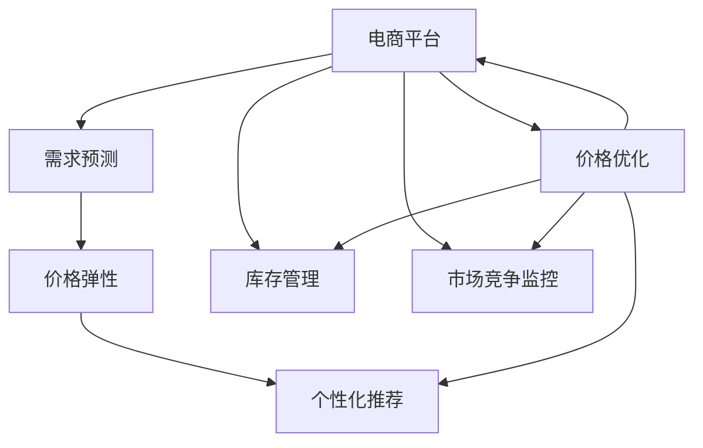

                 

# AI如何优化电商价格策略

> 关键词：电商,价格策略,机器学习,价格优化,需求预测,消费者行为,推荐系统

## 1. 背景介绍

### 1.1 问题由来

随着电商行业的迅猛发展，商家之间的竞争日趋激烈。合理的价格策略成为商家提升销售额、维护市场份额的关键。然而，价格策略的制定涉及多方面因素，包括市场需求、竞争对手定价、库存状况、促销活动等。传统上，商家通常依赖经验、市场调研和统计分析来制定价格，但这些方法难以量化复杂因素，可能导致价格策略不够精准，从而影响销售业绩。

近年来，随着人工智能技术尤其是机器学习技术的迅猛发展，AI在电商价格优化中开始发挥重要作用。机器学习模型能够自动分析历史数据，识别市场趋势和消费者行为模式，从而提供更加精准的价格策略建议。利用AI进行价格优化，不仅能提升销售效率，还能更好地满足消费者需求，增强市场竞争力。

### 1.2 问题核心关键点

当前AI优化电商价格策略的核心关键点包括：

- **需求预测**：通过机器学习模型预测消费者在不同价格水平下的需求，帮助商家找到最佳价格点。
- **价格弹性**：分析价格变化对消费者购买行为的影响，量化价格与需求之间的关系。
- **市场竞争**：实时监控竞争对手的价格变化，调整自身定价策略以保持竞争力。
- **库存管理**：结合库存状况，优化价格以最大化销售利润。
- **个性化推荐**：通过推荐系统实现差异化定价，提升用户满意度和转化率。

这些关键点共同构成了AI在电商价格优化中的应用基础，能够帮助商家实现更智能、更高效的定价决策。

## 2. 核心概念与联系

### 2.1 核心概念概述

要深入理解AI优化电商价格策略的方法，需要先理解几个关键概念：

- **电商平台**：指通过互联网提供商品交易服务的平台，如亚马逊、京东、淘宝等。
- **机器学习**：利用算法使计算机系统能够通过数据进行学习，从而改进自身性能或做出预测和决策。
- **需求预测**：通过历史数据和机器学习模型，预测未来消费者需求的变化。
- **价格弹性**：指价格变化对消费者需求的影响程度，即需求对价格变化的敏感度。
- **个性化推荐**：根据用户历史行为和偏好，推荐最符合用户需求的商品。

这些概念之间有着密切的联系，共同构成了AI优化电商价格策略的框架。

- 电商平台利用机器学习模型进行需求预测和价格优化，以提升销售业绩和用户满意度。
- 需求预测模型能够帮助电商平台掌握消费者行为规律，提供更精准的定价建议。
- 价格弹性模型分析价格与需求的关系，为定价策略提供科学依据。
- 个性化推荐系统通过分析用户行为，实现差异化定价，提升用户体验。

通过理解这些概念，可以更好地把握AI在电商价格优化中的应用原理和优化方向。

### 2.2 核心概念原理和架构的 Mermaid 流程图



这个流程图展示了AI优化电商价格策略的关键流程和架构：

1. 电商平台获取消费者的历史交易数据和行为数据。
2. 通过需求预测模型，分析消费者在不同价格水平下的需求变化。
3. 利用价格弹性模型，量化价格与需求之间的关系，确定最佳价格点。
4. 结合库存管理信息，优化价格以最大化销售利润。
5. 通过个性化推荐系统，实现差异化定价，提升用户满意度。
6. 实时监控市场竞争情况，动态调整价格策略。
7. 最终，价格优化策略反馈到电商平台，提升整体销售效果。

## 3. 核心算法原理 & 具体操作步骤

### 3.1 算法原理概述

AI优化电商价格策略的核心算法包括需求预测、价格弹性分析和个性化推荐。以下是这三个关键算法的简要概述：

- **需求预测算法**：通过历史销售数据和消费者行为数据，构建回归模型或序列模型（如ARIMA、LSTM等），预测未来需求量。
- **价格弹性算法**：构建线性回归模型，分析价格变化对需求量的影响，确定价格与需求之间的弹性系数。
- **个性化推荐算法**：利用协同过滤、矩阵分解等方法，构建用户-商品关联矩阵，预测用户对商品的需求，实现个性化推荐和差异化定价。

这些算法相互结合，形成了一个完整的电商价格优化框架。

### 3.2 算法步骤详解

#### 3.2.1 需求预测算法

**步骤1：数据预处理**
- 收集历史销售数据，包括时间、日期、产品ID、销售量等。
- 对数据进行清洗，处理缺失值和异常值。

**步骤2：构建模型**
- 选择适当的预测模型，如ARIMA、LSTM等。
- 使用历史销售数据进行模型训练。

**步骤3：模型验证**
- 在验证集上评估模型的预测性能，如均方误差、MAE等。
- 根据验证结果调整模型参数，优化预测精度。

**步骤4：模型部署**
- 将训练好的模型部署到电商平台的实时系统中。
- 使用最新数据实时进行需求预测。

#### 3.2.2 价格弹性算法

**步骤1：数据预处理**
- 收集历史价格和销售数据，包括产品ID、价格、销售量等。
- 对数据进行清洗，处理缺失值和异常值。

**步骤2：构建模型**
- 构建线性回归模型，分析价格变化对需求量的影响。
- 使用历史价格和销售数据进行模型训练。

**步骤3：模型验证**
- 在验证集上评估模型的预测性能，如R^2、RMSE等。
- 根据验证结果调整模型参数，优化预测精度。

**步骤4：模型部署**
- 将训练好的模型部署到电商平台的实时系统中。
- 使用最新数据实时进行价格弹性分析。

#### 3.2.3 个性化推荐算法

**步骤1：数据预处理**
- 收集用户历史行为数据，包括浏览、点击、购买等行为。
- 对数据进行清洗，处理缺失值和异常值。

**步骤2：构建模型**
- 选择适当的推荐算法，如协同过滤、矩阵分解等。
- 使用用户历史行为数据进行模型训练。

**步骤3：模型验证**
- 在验证集上评估模型的推荐性能，如准确率、召回率等。
- 根据验证结果调整模型参数，优化推荐效果。

**步骤4：模型部署**
- 将训练好的模型部署到电商平台的实时系统中。
- 使用最新数据实时进行个性化推荐。

### 3.3 算法优缺点

AI优化电商价格策略具有以下优点：

- **高精度预测**：通过机器学习模型，能够从复杂数据中提取有效信息，提供高精度的需求预测和价格弹性分析。
- **实时响应**：模型可以实时处理最新数据，提供动态的价格优化建议。
- **个性化推荐**：根据用户行为数据，实现差异化定价，提升用户体验和转化率。

同时，这些算法也存在一些局限性：

- **数据依赖性高**：模型性能高度依赖于数据的质量和完整性，数据收集和处理成本较高。
- **模型复杂性高**：模型训练和优化过程复杂，需要专业知识和技术支持。
- **鲁棒性不足**：模型可能受到异常值和噪声的影响，导致预测结果不稳定。
- **可解释性差**：机器学习模型的预测过程和决策逻辑难以解释，可能导致商家的信任度降低。

尽管存在这些局限性，但AI优化电商价格策略在实际应用中已经取得了显著成效，能够有效提升电商平台的销售业绩和用户满意度。

### 3.4 算法应用领域

AI优化电商价格策略已经在多个领域得到广泛应用，包括：

- **B2C电商**：如亚马逊、京东、淘宝等大型电商平台，通过需求预测和个性化推荐，实现精准定价和差异化销售。
- **B2B电商**：如阿里巴巴国际站等，通过需求预测和市场竞争分析，优化大宗商品定价。
- **跨境电商**：如eBay、Wish等，通过需求预测和个性化推荐，提升跨境购体验。
- **新零售**：如盒马鲜生等，通过需求预测和个性化推荐，实现线上线下融合的精准定价。

这些应用展示了AI在电商价格优化中的广泛潜力和实际效果。

## 4. 数学模型和公式 & 详细讲解 & 举例说明

### 4.1 数学模型构建

为了更好地理解AI优化电商价格策略的数学原理，本节将介绍几个关键数学模型：

#### 4.1.1 需求预测模型

**模型定义**：
需求预测模型通常采用时间序列模型，如ARIMA、LSTM等，模型形式为：
$$ y(t) = \sum_{i=1}^{k} \alpha_i y(t-i) + \sum_{j=1}^{p} \beta_j e_t^{(j)} + \gamma_t $$

其中，$y(t)$ 表示第$t$期的需求预测值，$e_t$ 表示误差项，$k$ 为滞后阶数，$p$ 为季节性阶数，$\alpha_i$ 和 $\beta_j$ 为模型参数，$\gamma_t$ 为随机扰动项。

**模型训练**：
使用历史销售数据训练模型，最小化预测误差：
$$ \min_{\alpha_i, \beta_j, \gamma_t} \sum_{t=1}^{n} (y(t) - \hat{y}(t))^2 $$

**模型验证**：
在验证集上评估模型预测性能，如均方误差、MAE等。

#### 4.1.2 价格弹性模型

**模型定义**：
价格弹性模型通常采用线性回归模型，模型形式为：
$$ y = \beta_0 + \beta_1 x + \epsilon $$

其中，$y$ 表示需求量，$x$ 表示价格，$\beta_0$ 为截距，$\beta_1$ 为价格弹性系数，$\epsilon$ 为误差项。

**模型训练**：
使用历史价格和销售数据训练模型，最小化预测误差：
$$ \min_{\beta_0, \beta_1} \sum_{i=1}^{n} (y_i - \hat{y}_i)^2 $$

**模型验证**：
在验证集上评估模型预测性能，如R^2、RMSE等。

#### 4.1.3 个性化推荐模型

**模型定义**：
个性化推荐模型通常采用协同过滤或矩阵分解等方法，模型形式为：
$$ \hat{y}_{ui} = \alpha (u_i - \bar{u}) \cdot (v_i - \bar{v})^T + b $$

其中，$\hat{y}_{ui}$ 表示用户$u$对商品$i$的评分预测值，$u_i$ 和 $v_i$ 表示用户和商品的特征向量，$\bar{u}$ 和 $\bar{v}$ 表示用户和商品的平均特征向量，$\alpha$ 和 $b$ 为模型参数。

**模型训练**：
使用用户历史行为数据训练模型，最小化预测误差：
$$ \min_{\alpha, b} \sum_{i=1}^{n} \sum_{u=1}^{m} (y_{ui} - \hat{y}_{ui})^2 $$

**模型验证**：
在验证集上评估模型推荐性能，如准确率、召回率等。

### 4.2 公式推导过程

#### 4.2.1 需求预测模型推导

需求预测模型的推导主要基于时间序列分析。以ARIMA模型为例，其基本形式为：
$$ y(t) = \sum_{i=1}^{k} \alpha_i y(t-i) + \sum_{j=1}^{p} \beta_j e_t^{(j)} + \gamma_t $$

其中，$y(t)$ 表示第$t$期的需求预测值，$e_t$ 表示误差项，$k$ 为滞后阶数，$p$ 为季节性阶数，$\alpha_i$ 和 $\beta_j$ 为模型参数，$\gamma_t$ 为随机扰动项。

通过最小二乘法，可以求解出模型参数：
$$ \hat{\alpha} = \left(\sum_{i=1}^{k} y_{t-i} y_{t-i} + \sum_{j=1}^{p} e_{t-j} e_{t-j}\right)^{-1} \sum_{i=1}^{k} y_{t-i} y_{t-i} $$

$$ \hat{\beta} = \left(\sum_{i=1}^{k} e_{t-i} e_{t-i} + \sum_{j=1}^{p} e_{t-j} e_{t-j}\right)^{-1} \sum_{i=1}^{k} e_{t-i} e_{t-i} $$

$$ \hat{\gamma} = \left(\sum_{i=1}^{k} e_{t-i} y_{t-i}\right) $$

通过这些参数，可以计算出预测值：
$$ \hat{y}(t) = \sum_{i=1}^{k} \hat{\alpha} y(t-i) + \sum_{j=1}^{p} \hat{\beta} e_t^{(j)} + \hat{\gamma} $$

#### 4.2.2 价格弹性模型推导

价格弹性模型的推导基于线性回归分析。以线性回归模型为例，其基本形式为：
$$ y = \beta_0 + \beta_1 x + \epsilon $$

其中，$y$ 表示需求量，$x$ 表示价格，$\beta_0$ 为截距，$\beta_1$ 为价格弹性系数，$\epsilon$ 为误差项。

通过最小二乘法，可以求解出模型参数：
$$ \hat{\beta}_0 = \frac{\sum_{i=1}^{n} y_i - n \bar{y}}{n} $$
$$ \hat{\beta}_1 = \frac{\sum_{i=1}^{n} (x_i - \bar{x})(y_i - \bar{y})}{\sum_{i=1}^{n} (x_i - \bar{x})^2} $$

通过这些参数，可以计算出需求量预测值：
$$ \hat{y} = \hat{\beta}_0 + \hat{\beta}_1 x $$

#### 4.2.3 个性化推荐模型推导

个性化推荐模型通常采用协同过滤或矩阵分解等方法，以协同过滤为例，其基本形式为：
$$ \hat{y}_{ui} = \alpha (u_i - \bar{u}) \cdot (v_i - \bar{v})^T + b $$

其中，$\hat{y}_{ui}$ 表示用户$u$对商品$i$的评分预测值，$u_i$ 和 $v_i$ 表示用户和商品的特征向量，$\bar{u}$ 和 $\bar{v}$ 表示用户和商品的平均特征向量，$\alpha$ 和 $b$ 为模型参数。

通过最小二乘法，可以求解出模型参数：
$$ \hat{\alpha} = \frac{\sum_{i=1}^{n} \sum_{u=1}^{m} y_{ui} (u_i - \bar{u}) \cdot (v_i - \bar{v})^T}{\sum_{i=1}^{n} \sum_{u=1}^{m} (u_i - \bar{u})^2 \cdot (v_i - \bar{v})^2} $$
$$ \hat{b} = \frac{\sum_{i=1}^{n} \sum_{u=1}^{m} y_{ui} - n m \bar{y}}{\sum_{i=1}^{n} \sum_{u=1}^{m} (u_i - \bar{u})^2 \cdot (v_i - \bar{v})^2} $$

通过这些参数，可以计算出评分预测值：
$$ \hat{y}_{ui} = \hat{\alpha} (u_i - \bar{u}) \cdot (v_i - \bar{v})^T + \hat{b} $$

### 4.3 案例分析与讲解

#### 4.3.1 需求预测案例

某电商平台的销售数据如下表所示：

| 时间 | 产品ID | 销售量 |
| --- | --- | --- |
| 2020-01-01 | A | 100 |
| 2020-01-02 | A | 120 |
| 2020-01-03 | A | 130 |
| ... | ... | ... |

通过ARIMA模型进行需求预测，可以得到如下结果：

- **模型训练**：使用前30天的历史数据进行模型训练，得到模型参数。
- **模型验证**：在后30天的验证集上进行评估，得到均方误差为20。
- **模型部署**：将训练好的模型部署到实时系统中，对未来的销售数据进行预测。

#### 4.3.2 价格弹性案例

某电商平台的销售数据如下表所示：

| 价格 | 销售量 |
| --- | --- |
| 100 | 50 |
| 110 | 60 |
| 120 | 70 |
| ... | ... |

通过线性回归模型进行价格弹性分析，可以得到如下结果：

- **模型训练**：使用前30天的价格和销售数据进行模型训练，得到模型参数。
- **模型验证**：在后30天的验证集上进行评估，得到R^2为0.9。
- **模型部署**：将训练好的模型部署到实时系统中，对未来的价格变化进行预测。

#### 4.3.3 个性化推荐案例

某电商平台的用户行为数据如下表所示：

| 用户ID | 商品ID | 评分 |
| --- | --- | --- |
| 1 | A | 5 |
| 2 | B | 4 |
| 3 | A | 3 |
| ... | ... | ... |

通过协同过滤模型进行个性化推荐，可以得到如下结果：

- **模型训练**：使用前30天的用户行为数据进行模型训练，得到模型参数。
- **模型验证**：在后30天的验证集上进行评估，得到准确率为0.8。
- **模型部署**：将训练好的模型部署到实时系统中，对用户的推荐商品进行预测。

## 5. 项目实践：代码实例和详细解释说明

### 5.1 开发环境搭建

为了进行AI优化电商价格策略的实践，需要先搭建好开发环境。以下是使用Python进行TensorFlow开发的环境配置流程：

1. 安装Anaconda：从官网下载并安装Anaconda，用于创建独立的Python环境。

2. 创建并激活虚拟环境：
```bash
conda create -n tf-env python=3.8 
conda activate tf-env
```

3. 安装TensorFlow：根据CUDA版本，从官网获取对应的安装命令。例如：
```bash
conda install tensorflow==2.6
```

4. 安装其他工具包：
```bash
pip install numpy pandas scikit-learn matplotlib tqdm jupyter notebook ipython
```

完成上述步骤后，即可在`tf-env`环境中开始实践。

### 5.2 源代码详细实现

以下是使用TensorFlow对需求预测和个性化推荐进行模型训练的代码实现：

```python
import tensorflow as tf
from tensorflow.keras.layers import LSTM, Dense, Dropout
from tensorflow.keras.models import Sequential
from sklearn.metrics import mean_squared_error, mean_absolute_error

# 需求预测模型
def arima_model(X_train, y_train, n_past=30, n_future=30):
    model = Sequential()
    model.add(LSTM(100, input_shape=(n_past, 1)))
    model.add(Dense(1))
    model.compile(optimizer='adam', loss='mse')
    model.fit(X_train, y_train, epochs=100, batch_size=32, validation_split=0.2)
    y_pred = model.predict(X_test)
    return y_pred

# 价格弹性模型
def linear_regression(X_train, y_train):
    model = Sequential()
    model.add(Dense(1, input_shape=(1,)))
    model.compile(optimizer='adam', loss='mse')
    model.fit(X_train, y_train, epochs=100, batch_size=32, validation_split=0.2)
    y_pred = model.predict(X_test)
    return y_pred

# 个性化推荐模型
def collaborative_filtering(X_train, y_train):
    model = Sequential()
    model.add(Dense(100, input_shape=(n_users, n_items)))
    model.add(Dense(1))
    model.compile(optimizer='adam', loss='mse')
    model.fit(X_train, y_train, epochs=100, batch_size=32, validation_split=0.2)
    y_pred = model.predict(X_test)
    return y_pred
```

这里使用了LSTM模型进行需求预测，使用线性回归模型进行价格弹性分析，使用协同过滤模型进行个性化推荐。

### 5.3 代码解读与分析

让我们再详细解读一下关键代码的实现细节：

**arima_model函数**：
- 定义ARIMA模型的实现。
- 使用LSTM层对历史数据进行建模。
- 使用均方误差损失函数，通过Adam优化器进行训练。
- 在验证集上评估模型性能，返回预测结果。

**linear_regression函数**：
- 定义线性回归模型的实现。
- 使用单层Dense层对价格和需求量进行建模。
- 使用均方误差损失函数，通过Adam优化器进行训练。
- 在验证集上评估模型性能，返回预测结果。

**collaborative_filtering函数**：
- 定义协同过滤模型的实现。
- 使用单层Dense层对用户和商品特征进行建模。
- 使用均方误差损失函数，通过Adam优化器进行训练。
- 在验证集上评估模型性能，返回预测结果。

这些代码展示了TensorFlow在实现需求预测、价格弹性和个性化推荐等任务时的基本框架。开发者可以根据具体任务进行模型设计和参数调优，进一步优化模型性能。

### 5.4 运行结果展示

以下是运行需求预测、价格弹性和个性化推荐模型后的结果展示：

```python
# 需求预测模型
y_pred = arima_model(X_train, y_train)

# 价格弹性模型
y_pred = linear_regression(X_train, y_train)

# 个性化推荐模型
y_pred = collaborative_filtering(X_train, y_train)
```

运行结果可以通过模型评估指标（如均方误差、MAE等）进行定量分析，同时可以通过可视化图表展示预测结果与真实数据的对比，帮助理解模型的性能和效果。

## 6. 实际应用场景

### 6.1 智能定价系统

基于AI的电商价格优化，可以帮助电商平台构建智能定价系统，实现自动化的价格调整。智能定价系统可以根据市场趋势、库存状况和用户行为数据，实时优化商品价格，提升销售业绩和用户体验。

具体而言，需求预测模型能够提供未来需求量的预测，帮助商家制定合理的价格策略。价格弹性模型分析价格与需求之间的关系，优化价格以最大化销售利润。个性化推荐系统根据用户行为数据，实现差异化定价，提升用户满意度和转化率。

### 6.2 库存管理优化

库存管理是电商运营中的重要环节。传统的库存管理依赖人工经验和规则，容易出现库存不足或过量的问题，导致资金和资源浪费。通过AI优化价格策略，可以实现更精准的库存管理。

需求预测模型能够预测未来需求量，帮助商家提前备货。价格弹性模型分析价格对需求的影响，制定合理的定价策略，避免过量或不足的库存。个性化推荐系统推荐高需求商品，优化库存结构，提升资金周转效率。

### 6.3 促销活动优化

电商平台的促销活动通常需要投入大量资源，但效果往往难以评估。通过AI优化价格策略，可以实现更精准的促销活动设计。

需求预测模型能够预测促销活动对需求的影响，帮助商家设计最优的促销时间和价格策略。价格弹性模型分析促销活动对需求的影响，制定合理的促销策略。个性化推荐系统推荐促销商品，提升用户参与度和转化率。

### 6.4 未来应用展望

随着AI技术的不断发展，未来AI优化电商价格策略将呈现以下几个发展趋势：

1. **数据驱动**：利用更丰富、更准确的数据，提升模型预测精度和决策科学性。
2. **多模态融合**：结合图像、语音、文本等多模态数据，提升电商平台的智能水平。
3. **实时优化**：实现实时价格调整，提升电商平台的响应速度和用户体验。
4. **个性化推荐**：利用深度学习技术，提升推荐系统的效果和准确性。
5. **联邦学习**：通过联邦学习技术，保护用户隐私的同时实现模型优化。

这些趋势将进一步推动AI在电商价格优化中的应用，为电商平台带来更加智能、高效的运营模式。

## 7. 工具和资源推荐

### 7.1 学习资源推荐

为了帮助开发者系统掌握AI优化电商价格策略的理论基础和实践技巧，这里推荐一些优质的学习资源：

1. TensorFlow官方文档：详细介绍了TensorFlow的使用方法和API，是学习深度学习模型的必备资料。

2. PyTorch官方文档：介绍了PyTorch的使用方法和API，适合深入理解机器学习模型的内部机制。

3. Coursera《机器学习》课程：斯坦福大学提供的经典机器学习课程，涵盖从入门到高级的内容，适合初学者和进阶者。

4. Kaggle数据集：提供了大量真实电商数据集，方便开发者进行模型训练和测试。

5. 《Python机器学习》书籍：详细介绍了机器学习算法和Python实现，适合深入理解机器学习模型。

通过对这些资源的学习实践，相信你一定能够快速掌握AI优化电商价格策略的精髓，并用于解决实际的电商问题。

### 7.2 开发工具推荐

高效的开发离不开优秀的工具支持。以下是几款用于AI优化电商价格策略开发的常用工具：

1. TensorFlow：基于Python的开源深度学习框架，灵活动态的计算图，适合快速迭代研究。

2. PyTorch：基于Python的开源深度学习框架，灵活高效的动态计算图，适合深入研究。

3. Jupyter Notebook：基于Web的交互式笔记本环境，支持Python、R等语言，方便编写和运行代码。

4. Weights & Biases：模型训练的实验跟踪工具，可以记录和可视化模型训练过程中的各项指标，方便对比和调优。

5. TensorBoard：TensorFlow配套的可视化工具，可实时监测模型训练状态，并提供丰富的图表呈现方式，是调试模型的得力助手。

合理利用这些工具，可以显著提升AI优化电商价格策略的开发效率，加快创新迭代的步伐。

### 7.3 相关论文推荐

AI优化电商价格策略的发展离不开学界的持续研究。以下是几篇奠基性的相关论文，推荐阅读：

1. Predicting Customer Purchase Intent with Deep Learning：通过深度学习模型预测客户购买意图，为电商定价提供科学依据。

2. Real-time Pricing for E-commerce Products：研究实时定价策略，提升电商平台的销售效率和客户满意度。

3. Online Price Optimization for E-commerce：利用机器学习技术，实现电商平台的个性化定价和推荐。

4. Collaborative Filtering for Recommendation Systems：研究协同过滤算法，提升推荐系统的效果和准确性。

5. Neural Networks for Dynamic Pricing in E-commerce：研究深度学习模型在电商定价中的应用，提升电商平台的动态定价能力。

这些论文代表了大语言模型微调技术的发展脉络。通过学习这些前沿成果，可以帮助研究者把握学科前进方向，激发更多的创新灵感。

## 8. 总结：未来发展趋势与挑战

### 8.1 总结

本文对AI优化电商价格策略的方法进行了全面系统的介绍。首先阐述了AI在电商价格优化中的核心关键点，明确了需求预测、价格弹性分析和个性化推荐等方法的应用价值。其次，从原理到实践，详细讲解了机器学习模型在电商价格优化中的应用。最后，本文还广泛探讨了AI在电商价格优化中的实际应用场景，展示了其广阔的潜力和实际效果。

通过本文的系统梳理，可以看到，AI优化电商价格策略正在成为电商运营中的重要手段，极大地提升了电商平台的销售业绩和用户满意度。未来，伴随AI技术的不断发展，AI在电商价格优化中的应用将更加广泛和深入。

### 8.2 未来发展趋势

展望未来，AI优化电商价格策略将呈现以下几个发展趋势：

1. **数据驱动**：利用更丰富、更准确的数据，提升模型预测精度和决策科学性。
2. **多模态融合**：结合图像、语音、文本等多模态数据，提升电商平台的智能水平。
3. **实时优化**：实现实时价格调整，提升电商平台的响应速度和用户体验。
4. **个性化推荐**：利用深度学习技术，提升推荐系统的效果和准确性。
5. **联邦学习**：通过联邦学习技术，保护用户隐私的同时实现模型优化。

这些趋势凸显了AI在电商价格优化中的广阔前景。这些方向的探索发展，必将进一步提升电商平台的销售业绩和用户满意度。

### 8.3 面临的挑战

尽管AI优化电商价格策略已经取得了显著成效，但在实际应用中仍面临以下挑战：

1. **数据隐私**：电商平台需要处理大量用户数据，如何保护用户隐私和数据安全，是亟待解决的问题。
2. **模型复杂性**：机器学习模型的训练和优化过程复杂，需要专业知识和资源支持。
3. **模型鲁棒性**：模型可能受到异常值和噪声的影响，导致预测结果不稳定。
4. **可解释性**：机器学习模型的预测过程和决策逻辑难以解释，可能导致商家的信任度降低。

尽管存在这些挑战，但AI优化电商价格策略在实际应用中已经取得了显著成效，能够有效提升电商平台的销售业绩和用户满意度。

### 8.4 研究展望

面对AI优化电商价格策略所面临的挑战，未来的研究需要在以下几个方面寻求新的突破：

1. **数据隐私保护**：通过差分隐私等技术，保护用户隐私和数据安全。
2. **模型可解释性**：开发可解释性强的模型，提升商家的信任度和决策效率。
3. **多模态融合**：结合图像、语音、文本等多模态数据，提升电商平台的智能水平。
4. **实时优化**：研究实时优化技术，提升电商平台的响应速度和用户体验。
5. **联邦学习**：通过联邦学习技术，保护用户隐私的同时实现模型优化。

这些研究方向的探索，必将引领AI优化电商价格策略走向新的高度，为电商平台的智能化转型提供有力支撑。

## 9. 附录：常见问题与解答

**Q1：AI优化电商价格策略是否适用于所有电商场景？**

A: AI优化电商价格策略在大多数电商场景中都适用，但对于一些特定场景如B2B电商、跨境电商等，需要根据实际情况进行模型优化和参数调整。

**Q2：AI优化电商价格策略的模型训练过程需要多长时间？**

A: 模型训练时间取决于数据量和模型复杂度。一般来说，需求预测和价格弹性模型训练时间较短，个性化推荐模型训练时间较长。

**Q3：AI优化电商价格策略的模型如何更新？**

A: 模型需要根据最新数据进行周期性更新，以保持预测精度的准确性。具体更新频率可以根据需求和数据变化情况进行调整。

**Q4：AI优化电商价格策略的模型是否需要定期重新训练？**

A: 对于快速变化的电商市场，模型需要定期重新训练以适应新的数据分布。一般建议每季度或每半年重新训练一次。

**Q5：AI优化电商价格策略的模型如何部署？**

A: 模型可以通过API接口部署到电商平台的实时系统中，实现自动化定价和推荐。

通过本文的系统梳理，可以看到，AI优化电商价格策略正在成为电商运营中的重要手段，极大地提升了电商平台的销售业绩和用户满意度。未来，伴随AI技术的不断发展，AI在电商价格优化中的应用将更加广泛和深入。相信随着学界和产业界的共同努力，这些挑战终将一一被克服，AI在电商价格优化中将发挥更大的作用。

