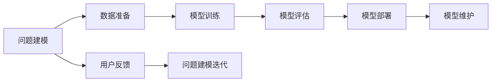

                 

## 1. 背景介绍

### 1.1 问题由来
随着人工智能技术的不断成熟和普及，越来越多的企业和组织开始探索和应用人工智能技术。然而，构建一个成功的人工智能应用系统并非易事。从算法的选型到模型的训练，再到应用的部署和维护，每一步都需要深入的理解和专业的技能。因此，如何系统地掌握人工智能技术，并将其应用到实际问题中，成为了人工智能领域的重要课题。

### 1.2 问题核心关键点
本文旨在介绍AI工程学的基本概念、核心算法、实践流程以及应用场景，帮助读者系统地理解人工智能技术的开发和应用。我们将通过一个完整的AI应用案例，详细讲解如何从问题建模、数据准备、模型训练、模型评估、模型部署到模型维护的全流程。

### 1.3 问题研究意义
掌握AI工程学对于提升人工智能应用的开发效率和成功率至关重要。系统地学习和应用AI工程学，可以：

1. **提高效率**：通过标准化的流程和工具，减少开发时间和成本。
2. **提升质量**：通过模型评估和优化，保证模型的性能和稳定性。
3. **促进创新**：通过不断迭代和优化，提升模型的效果和应用范围。
4. **降低风险**：通过风险评估和防范，减少应用中的风险和错误。
5. **加速落地**：通过优化部署和维护，加快模型应用的产业化进程。

## 2. 核心概念与联系

### 2.1 核心概念概述

AI工程学是一门集成了计算机科学、数据科学和应用领域的学科，旨在将人工智能技术应用于实际问题中。以下是AI工程学的几个核心概念：

- **问题建模**：将实际问题抽象为算法可以解决的形式，如分类、回归、聚类等。
- **数据准备**：收集、清洗、预处理和分析数据，为模型训练提供高质量的数据集。
- **模型训练**：使用优化算法训练模型，最小化模型在训练数据上的损失函数。
- **模型评估**：通过验证数据集评估模型的性能，选择合适的模型进行进一步优化。
- **模型部署**：将训练好的模型集成到实际应用系统中，实现模型的自动化推理。
- **模型维护**：监控模型性能，进行模型更新和优化，保证模型的长期稳定性。

这些概念之间的联系和互动，构成了AI工程学的核心框架。通过理解这些概念及其联系，可以更好地设计和实现一个高效、可靠的人工智能应用系统。

### 2.2 核心概念原理和架构的 Mermaid 流程图



这个流程图展示了AI工程学中的关键步骤，每个步骤相互依赖，共同构成了一个完整的AI应用开发流程。

## 3. 核心算法原理 & 具体操作步骤

### 3.1 算法原理概述

AI工程学中的核心算法包括监督学习、无监督学习、强化学习等，不同的算法适用于不同的问题类型。本文将重点介绍监督学习和无监督学习的基本原理和操作步骤。

### 3.2 算法步骤详解

#### 3.2.1 监督学习

监督学习是一种通过已标注数据进行模型训练的机器学习方法。其基本步骤如下：

1. **数据准备**：收集和清洗数据，构建训练集和验证集。
2. **模型选择**：选择合适的算法和模型，如线性回归、决策树、神经网络等。
3. **模型训练**：使用训练集对模型进行训练，最小化损失函数。
4. **模型评估**：使用验证集评估模型的性能，选择最优模型。
5. **模型部署**：将模型集成到实际应用中，进行推理和预测。

#### 3.2.2 无监督学习

无监督学习是一种通过未标注数据进行模型训练的机器学习方法。其基本步骤如下：

1. **数据准备**：收集和清洗数据，构建训练集。
2. **模型选择**：选择合适的算法和模型，如K-means、PCA、神经网络等。
3. **模型训练**：使用训练集对模型进行训练，发现数据的内在结构和规律。
4. **模型评估**：使用评估指标（如聚类质量、降维效果等）评估模型的性能。
5. **模型部署**：将模型集成到实际应用中，进行数据处理和分析。

### 3.3 算法优缺点

#### 3.3.1 监督学习的优缺点

- **优点**：
  - 准确性高：利用标注数据进行训练，可以更好地理解和预测问题。
  - 泛化能力强：模型经过大量数据训练，具有较好的泛化能力。

- **缺点**：
  - 数据需求大：需要大量的标注数据，成本高，且存在标注偏差。
  - 模型过拟合：模型容易过拟合，需要复杂的正则化技术。

#### 3.3.2 无监督学习的优缺点

- **优点**：
  - 数据需求低：不需要标注数据，数据收集和准备成本低。
  - 数据探索性强：可以发现数据的内在结构和规律。

- **缺点**：
  - 准确性低：无法利用标注信息，模型效果有限。
  - 泛化能力弱：模型容易受数据分布的影响，泛化性能差。

### 3.4 算法应用领域

监督学习和无监督学习广泛应用于多个领域，包括：

- **自然语言处理**：如文本分类、情感分析、机器翻译等。
- **图像处理**：如图像分类、目标检测、图像生成等。
- **推荐系统**：如商品推荐、用户行为分析等。
- **医疗健康**：如疾病诊断、基因分析等。
- **金融风控**：如信用评估、欺诈检测等。

## 4. 数学模型和公式 & 详细讲解

### 4.1 数学模型构建

在AI工程学中，数学模型是实现算法的基础。以下是几种常见的数学模型及其构建方法：

- **线性回归模型**：$y = \theta_0 + \theta_1 x_1 + \theta_2 x_2 + \cdots + \theta_n x_n$。其中 $y$ 为输出，$x_i$ 为输入特征，$\theta_i$ 为模型参数。
- **决策树模型**：构建一系列的分支，每个分支代表一个特征，每个叶子节点代表一个输出。
- **神经网络模型**：通过多个线性变换和非线性激活函数，构建多层网络，学习输入与输出之间的关系。

### 4.2 公式推导过程

以线性回归模型为例，其公式推导过程如下：

假设数据集为 $(x_1, y_1), (x_2, y_2), \cdots, (x_n, y_n)$，其中 $x_i$ 为输入，$y_i$ 为输出。设 $\theta_0$ 和 $\theta_1$ 为模型参数，则目标是最小化损失函数：

$$
\mathcal{L} = \frac{1}{2} \sum_{i=1}^n (y_i - (\theta_0 + \theta_1 x_i))^2
$$

使用梯度下降算法，目标是最小化损失函数的一阶导数：

$$
\frac{\partial \mathcal{L}}{\partial \theta_0} = -\sum_{i=1}^n (y_i - (\theta_0 + \theta_1 x_i))
$$

$$
\frac{\partial \mathcal{L}}{\partial \theta_1} = -\sum_{i=1}^n x_i (y_i - (\theta_0 + \theta_1 x_i))
$$

通过不断迭代更新 $\theta_0$ 和 $\theta_1$，使得损失函数最小化。

### 4.3 案例分析与讲解

以房价预测为例，分析线性回归模型的构建和应用过程：

- **问题建模**：将房价预测问题建模为线性回归问题，即 $y = \theta_0 + \theta_1 x_1 + \theta_2 x_2 + \cdots + \theta_n x_n$，其中 $y$ 为房价，$x_i$ 为影响房价的特征，如房屋面积、地理位置等。
- **数据准备**：收集房屋面积、地理位置、楼层、朝向等特征数据，构建训练集和验证集。
- **模型训练**：使用训练集对模型进行训练，最小化损失函数。
- **模型评估**：使用验证集评估模型的性能，选择最优模型。
- **模型部署**：将模型集成到实际应用中，进行房价预测。

## 5. 项目实践：代码实例和详细解释说明

### 5.1 开发环境搭建

在进行AI工程学实践前，我们需要准备好开发环境。以下是使用Python进行PyTorch开发的流程：

1. 安装Anaconda：从官网下载并安装Anaconda，用于创建独立的Python环境。
2. 创建并激活虚拟环境：
```bash
conda create -n pytorch-env python=3.8 
conda activate pytorch-env
```

3. 安装PyTorch：根据CUDA版本，从官网获取对应的安装命令。例如：
```bash
conda install pytorch torchvision torchaudio cudatoolkit=11.1 -c pytorch -c conda-forge
```

4. 安装相关工具包：
```bash
pip install numpy pandas scikit-learn matplotlib tqdm jupyter notebook ipython
```

完成上述步骤后，即可在`pytorch-env`环境中进行AI工程学实践。

### 5.2 源代码详细实现

以下是使用PyTorch进行线性回归模型训练的代码实现：

```python
import torch
import torch.nn as nn
import torch.optim as optim
import numpy as np

# 定义模型
class LinearRegression(nn.Module):
    def __init__(self, input_dim):
        super(LinearRegression, self).__init__()
        self.linear = nn.Linear(input_dim, 1)

    def forward(self, x):
        return self.linear(x)

# 加载数据
def load_data():
    # 假设有100个样本，每个样本有3个特征
    X = np.random.rand(100, 3)
    y = np.dot(X, np.array([2.5, 3.5, 0.5])) + 1
    return X, y

# 定义损失函数和优化器
def train_model(X, y, input_dim, num_epochs, batch_size, learning_rate):
    model = LinearRegression(input_dim)
    criterion = nn.MSELoss()
    optimizer = optim.SGD(model.parameters(), lr=learning_rate)
    
    for epoch in range(num_epochs):
        for i in range(0, X.shape[0], batch_size):
            start = i
            end = min(i + batch_size, X.shape[0])
            batch_X = torch.from_numpy(X[start:end])
            batch_y = torch.from_numpy(y[start:end])
            model.train()
            optimizer.zero_grad()
            output = model(batch_X)
            loss = criterion(output, batch_y)
            loss.backward()
            optimizer.step()
        print(f'Epoch {epoch+1}, loss: {loss.item()}')

# 训练模型
X, y = load_data()
train_model(X.shape[1], y, X.shape[1], num_epochs=100, batch_size=10, learning_rate=0.01)
```

### 5.3 代码解读与分析

让我们再详细解读一下关键代码的实现细节：

**LinearRegression类**：
- `__init__`方法：初始化线性回归模型，包括定义线性层。
- `forward`方法：定义前向传播过程，即将输入数据传递到模型中进行预测。

**load_data函数**：
- 定义一个随机生成的数据集，包含100个样本，每个样本有3个特征。

**train_model函数**：
- 定义训练过程，包括模型初始化、损失函数、优化器、迭代过程等。

**训练过程**：
- 每个epoch内，对数据集进行批次化加载，对每个批次进行前向传播和反向传播，更新模型参数。

可以看到，PyTorch提供了丰富的API和工具，使得模型构建和训练过程变得简洁高效。开发者可以将更多精力放在问题建模和模型优化上，而不必过多关注底层的实现细节。

## 6. 实际应用场景

### 6.1 智能推荐系统

智能推荐系统是AI工程学的重要应用之一。通过分析用户行为数据，预测用户感兴趣的内容，并推荐给用户，提升用户体验和系统互动性。

在实践中，可以收集用户浏览、点击、评分等行为数据，提取和用户交互的物品特征。使用这些数据进行监督学习或无监督学习，训练推荐模型。模型输出的预测结果与用户行为数据进行对比，更新推荐策略，最终为用户生成个性化的推荐列表。

### 6.2 医疗健康分析

医疗健康领域需要从大量医疗数据中提取有用的信息，支持医生诊断和治疗决策。AI工程学可以帮助构建高效的医疗分析系统。

具体而言，可以收集电子病历、医学影像、基因数据等医疗数据，构建训练集和验证集。使用监督学习或无监督学习，训练医疗分析模型。模型输出的诊断结果或基因分析结果与实际数据进行对比，不断优化模型，提升准确性和鲁棒性。

### 6.3 智能交通管理

智能交通管理系统可以实时监测交通流量，预测交通拥堵，优化交通信号控制，提升交通效率。

在实践中，可以收集交通流量数据、车辆位置信息等数据，构建训练集和验证集。使用监督学习或无监督学习，训练交通预测模型。模型输出的交通流量预测结果与实际数据进行对比，优化交通信号控制策略，实现智能交通管理。

## 7. 工具和资源推荐

### 7.1 学习资源推荐

为了帮助开发者系统掌握AI工程学的基本概念和实践技巧，这里推荐一些优质的学习资源：

1. 《深度学习》课程：斯坦福大学开设的深度学习课程，内容全面、深入浅出，适合初学者和进阶者学习。
2. 《TensorFlow实战》书籍：TensorFlow官方文档，提供了丰富的API和样例，适合学习TensorFlow框架。
3. 《动手学深度学习》书籍：由深度学习社区ASL开发，内容丰富、实用，适合实践学习和项目开发。
4. 《机器学习实战》书籍：由Peter Harrington撰写，提供了丰富的实践项目和案例，适合实战学习。
5. 《Python机器学习》书籍：由Sebastian Raschka撰写，涵盖了机器学习基础和常用算法，适合Python开发者学习。

通过对这些资源的学习实践，相信你一定能够系统地掌握AI工程学的精髓，并用于解决实际问题。

### 7.2 开发工具推荐

高效的开发离不开优秀的工具支持。以下是几款用于AI工程学开发的常用工具：

1. PyTorch：基于Python的开源深度学习框架，灵活动态的计算图，适合快速迭代研究。
2. TensorFlow：由Google主导开发的开源深度学习框架，生产部署方便，适合大规模工程应用。
3. Weights & Biases：模型训练的实验跟踪工具，可以记录和可视化模型训练过程中的各项指标，方便对比和调优。
4. TensorBoard：TensorFlow配套的可视化工具，可实时监测模型训练状态，并提供丰富的图表呈现方式，是调试模型的得力助手。
5. Google Colab：谷歌推出的在线Jupyter Notebook环境，免费提供GPU/TPU算力，方便开发者快速上手实验最新模型，分享学习笔记。

合理利用这些工具，可以显著提升AI工程学的开发效率，加快创新迭代的步伐。

### 7.3 相关论文推荐

AI工程学的发展源于学界的持续研究。以下是几篇奠基性的相关论文，推荐阅读：

1. AlexNet：ImageNet大规模视觉识别竞赛中的胜利者，标志着深度学习时代的到来。
2. Yann LeCun等人的《深度学习》一书，系统介绍了深度学习的理论和实践，为深度学习研究提供了坚实的基础。
3. Ian Goodfellow等人的《生成对抗网络》一书，介绍了生成对抗网络的基本原理和应用，推动了生成式模型的发展。
4. Geoffrey Hinton等人的《神经网络与深度学习》一书，介绍了神经网络的基础理论和最新进展，为神经网络研究提供了理论指导。

这些论文代表了大规模深度学习的技术进展，通过学习这些前沿成果，可以帮助研究者把握学科前进方向，激发更多的创新灵感。

## 8. 总结：未来发展趋势与挑战

### 8.1 总结

本文对AI工程学的基本概念、核心算法、实践流程以及应用场景进行了全面系统的介绍。通过一个完整的AI应用案例，详细讲解了从问题建模、数据准备、模型训练、模型评估、模型部署到模型维护的全流程。掌握AI工程学对于提升AI应用的开发效率和成功率至关重要。

### 8.2 未来发展趋势

展望未来，AI工程学将呈现以下几个发展趋势：

1. **自动化和智能化**：自动化AI工程流程，通过智能优化和调参，提升开发效率和模型效果。
2. **多模态融合**：将图像、文本、语音等多模态数据融合，构建更加全面、准确的模型。
3. **可解释性**：赋予AI模型更强的可解释性，提升模型的透明度和可靠性。
4. **联邦学习**：通过分布式训练和隐私保护技术，构建安全、可信的AI系统。
5. **边缘计算**：将AI模型部署到边缘设备，提升模型的实时性和响应速度。

以上趋势凸显了AI工程学的广阔前景，这些方向的探索发展，将进一步推动AI技术在更多领域的落地应用。

### 8.3 面临的挑战

尽管AI工程学已经取得了显著的进展，但在迈向更加智能化、普适化应用的过程中，仍面临诸多挑战：

1. **数据质量**：数据质量和标注质量直接影响模型的效果，获取高质量数据成本较高。
2. **模型复杂性**：大规模深度学习模型的复杂性高，训练和推理资源消耗大。
3. **泛化能力**：模型在特定场景下表现良好，但在新场景下泛化能力不足。
4. **隐私保护**：大规模数据集和模型的隐私保护问题，如数据泄露、模型攻击等。
5. **法规和伦理**：AI模型的应用需要考虑法律法规和伦理道德问题，如公平性、透明性、安全性等。

解决这些挑战需要学界和产业界的共同努力，不断探索和创新。

### 8.4 研究展望

面对AI工程学所面临的挑战，未来的研究需要在以下几个方面寻求新的突破：

1. **数据增强和数据生成**：利用数据增强和数据生成技术，提升数据质量和数据多样性。
2. **模型压缩和剪枝**：通过模型压缩和剪枝技术，减少模型资源消耗，提升模型实时性。
3. **分布式训练和联邦学习**：通过分布式训练和联邦学习技术，提升模型训练效率和数据隐私保护。
4. **多任务学习和迁移学习**：通过多任务学习和迁移学习技术，提升模型泛化能力和适应性。
5. **可解释性和透明性**：通过可解释性和透明性技术，提升模型的透明性和可靠性。

这些研究方向的发展，将推动AI工程学迈向更加智能化、普适化的应用场景，为人类社会带来深远的变革。

## 9. 附录：常见问题与解答

**Q1: 什么是AI工程学？**

A: AI工程学是一门系统地将人工智能技术应用于实际问题的学科，包括问题建模、数据准备、模型训练、模型评估、模型部署和模型维护等步骤。

**Q2: AI工程学和机器学习有什么区别？**

A: AI工程学是机器学习的一个子领域，主要关注如何将机器学习技术应用于实际问题中。机器学习更侧重于模型的构建和训练，而AI工程学更侧重于模型的应用和部署。

**Q3: 如何评估AI模型的性能？**

A: AI模型的性能评估通常通过以下指标进行：
1. 准确率（Accuracy）：预测正确的样本占总样本数的比例。
2. 精确率（Precision）：预测为正样本中实际为正样本的比例。
3. 召回率（Recall）：实际为正样本中被预测为正样本的比例。
4. F1值（F1 Score）：精确率和召回率的调和平均数。
5. ROC曲线和AUC值：评估分类模型的性能，绘制ROC曲线，计算AUC值。

**Q4: 如何优化AI模型的性能？**

A: AI模型性能的优化通常包括以下步骤：
1. 数据增强：通过数据扩充和数据增强技术，提升数据多样性。
2. 模型选择：选择合适的模型和算法，如线性回归、决策树、神经网络等。
3. 模型训练：使用优化算法训练模型，最小化损失函数。
4. 模型调参：调整模型超参数，如学习率、批量大小、迭代轮数等。
5. 正则化技术：使用L2正则、Dropout、Early Stopping等技术，防止模型过拟合。

**Q5: 如何部署AI模型？**

A: AI模型的部署通常包括以下步骤：
1. 模型保存：将训练好的模型保存为文件，方便后续使用。
2. 模型加载：在实际应用系统中加载模型文件。
3. 推理引擎：使用推理引擎，如TensorFlow、PyTorch等，实现模型的推理和预测。
4. 模型封装：将模型封装为标准化服务接口，方便集成调用。
5. 监控和更新：实时监控模型性能，定期更新模型，确保模型长期稳定性。

通过对这些问题的解答，相信你一定能够更好地理解和应用AI工程学的理论和技术，在实际问题中构建高效、可靠的人工智能应用系统。

---

作者：禅与计算机程序设计艺术 / Zen and the Art of Computer Programming

