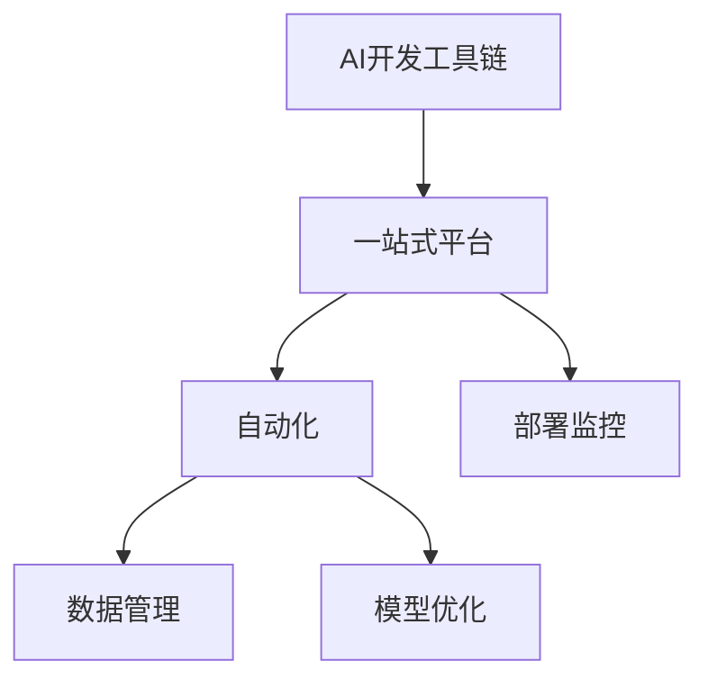

                 

## 1. 背景介绍

### 1.1 问题由来
随着人工智能技术的不断发展，AI开发工具链（AI Development Toolchain）在提高AI项目开发效率、降低开发成本方面发挥了越来越重要的作用。然而，传统的AI开发工具链往往组件众多、使用复杂，难以满足现代AI项目对效率、灵活性、易用性的需求。Lepton AI的一站式平台通过整合多种关键工具，实现了对AI项目的全链条覆盖，大大简化了AI项目的开发和部署流程，有效提高了项目效率。

### 1.2 问题核心关键点
Lepton AI的一站式平台聚焦于AI项目的开发、训练、部署、监控等各个环节，通过一站式服务，减少了工具间切换和配置的工作量，降低了AI开发的复杂度，提升了开发效率。平台的核心竞争力在于：

- **一站式覆盖**：从模型构建到部署监控，实现了全链条服务。
- **高度集成**：支持多种流行框架和库，如TensorFlow、PyTorch、Keras等，以及数据处理工具如Pandas、Scikit-learn等。
- **易用性**：界面简洁直观，减少了工具使用和学习成本。
- **高度扩展**：可按需添加插件，灵活应对各类AI项目需求。

### 1.3 问题研究意义
Lepton AI的一站式平台通过整合多种关键工具，简化了AI项目的开发流程，降低了项目成本，提高了开发效率。平台不仅适用于各类AI项目，还可以帮助开发者更好地理解AI项目各个环节的联系和依赖，提升项目管理的规范性和科学性。此外，平台在教育、金融、医疗等多个领域的应用，也展示了其在实际场景中的广泛适用性和显著优势。

## 2. 核心概念与联系

### 2.1 核心概念概述

Lepton AI的一站式平台主要涉及以下几个核心概念：

- **AI开发工具链**：指AI项目开发所需的各种工具、框架、库的集成。
- **一站式平台**：提供从模型构建、训练、部署到监控的完整开发流程支持。
- **自动化**：通过脚本、插件等方式，自动完成模型构建、数据处理、模型训练等环节，减少手工操作。
- **数据管理**：提供数据集管理、数据预处理、数据增强等功能，提升数据处理效率。
- **模型优化**：包括模型压缩、量化、剪枝等技术，提升模型性能。
- **部署监控**：提供模型部署和管理、性能监控、告警等功能，确保模型服务稳定可靠。

这些核心概念之间的逻辑关系可以通过以下Mermaid流程图来展示：



这个流程图展示了Lepton AI一站式平台的核心架构，从数据管理到模型优化，再到部署监控，平台覆盖了AI项目的全链条，通过自动化和一站式服务，简化了AI开发的各个环节。

## 3. 核心算法原理 & 具体操作步骤
### 3.1 算法原理概述

Lepton AI的一站式平台主要基于以下几个核心算法原理：

- **模型构建与训练自动化**：通过集成多种深度学习框架，自动完成模型构建和训练流程。
- **数据管理与处理**：使用数据管理工具自动化处理数据，包括数据清洗、特征工程、数据增强等。
- **模型优化**：采用模型压缩、量化、剪枝等技术，提升模型性能，降低资源消耗。
- **部署监控**：集成监控工具，实时监控模型性能和服务状态，提供告警和优化建议。

### 3.2 算法步骤详解

Lepton AI一站式平台的工作流程主要包括以下几个关键步骤：

**Step 1: 数据管理与处理**

1. **数据收集**：收集项目所需的数据，存储在统一的存储系统中。
2. **数据预处理**：对数据进行清洗、标准化、归一化等预处理操作。
3. **特征工程**：选择、提取和构建模型所需的特征，如文本的词袋模型、图像的卷积特征等。
4. **数据增强**：通过旋转、缩放、裁剪等方式扩充数据集，提高模型泛化能力。

**Step 2: 模型构建与训练**

1. **模型选择**：根据项目需求选择合适的深度学习模型，如卷积神经网络、循环神经网络、Transformer等。
2. **模型构建**：使用平台集成的深度学习框架自动构建模型。
3. **模型训练**：根据数据集和超参数设置，自动进行模型训练，监控训练进度。
4. **模型评估**：使用指定的评估指标（如准确率、F1值、ROC-AUC等）评估模型性能。

**Step 3: 模型优化**

1. **模型压缩**：通过剪枝、量化等技术，减少模型参数和计算量。
2. **模型部署**：将优化后的模型导出为可部署的格式，如TensorFlow Lite、ONNX等。
3. **模型部署**：将模型部署到指定平台，如服务器、移动设备、嵌入式设备等。

**Step 4: 部署监控**

1. **服务部署**：将模型部署为API服务，供前端调用。
2. **性能监控**：实时监控模型服务的性能，如响应时间、吞吐量等。
3. **告警与优化**：根据性能监控结果，及时进行告警和优化，确保服务稳定可靠。

### 3.3 算法优缺点

Lepton AI一站式平台具有以下优点：

- **高度集成**：支持多种流行框架和工具，减少了工具间的切换和配置工作。
- **易用性**：界面简洁直观，减少了工具使用和学习成本。
- **自动化**：自动完成模型构建、训练、优化等环节，提升了开发效率。
- **数据管理**：提供数据管理、数据预处理、数据增强等功能，提升了数据处理效率。

然而，该平台也存在以下局限性：

- **依赖性强**：高度依赖平台集成的工具和插件，如果某个插件无法满足需求，则可能影响项目进展。
- **扩展性有限**：部分功能需手动添加插件，灵活性受限。
- **学习曲线**：对于不熟悉平台的用户，可能存在一定的学习曲线。

### 3.4 算法应用领域

Lepton AI一站式平台适用于多种AI项目，包括但不限于以下几个领域：

- **计算机视觉**：图像分类、目标检测、图像生成等。
- **自然语言处理**：文本分类、情感分析、机器翻译等。
- **语音识别**：语音识别、语音合成、说话人识别等。
- **推荐系统**：商品推荐、内容推荐等。
- **智能客服**：自动问答、聊天机器人等。

此外，平台还支持跨领域模型训练，如多模态学习，将视觉、文本、语音等多种模态的数据整合，提升模型性能。

## 4. 数学模型和公式 & 详细讲解 & 举例说明

### 4.1 数学模型构建

Lepton AI一站式平台的数据处理和模型训练主要依赖于数学模型，以下是一些常见的数学模型及其应用：

- **线性回归模型**：用于处理回归任务，模型表达式为：
  $$
  y = \theta^T x + b
  $$
  其中 $x$ 为输入特征，$y$ 为目标变量，$\theta$ 为模型参数，$b$ 为截距。

- **逻辑回归模型**：用于二分类任务，模型表达式为：
  $$
  \sigma(\theta^T x + b) = y
  $$
  其中 $\sigma$ 为sigmoid函数，$x$ 为输入特征，$y$ 为二分类标签，$\theta$ 为模型参数，$b$ 为截距。

- **卷积神经网络模型**：用于图像识别任务，模型结构为：
  $$
  h^l = \sigma(W^l h^{l-1} + b^l)
  $$
  $$
  \hat{y} = W^k h^k + b^k
  $$
  其中 $h^l$ 为卷积层或池化层的输出，$W^l$ 为卷积核或全连接层的权重，$b^l$ 为偏置项，$\hat{y}$ 为输出预测结果。

### 4.2 公式推导过程

以卷积神经网络（CNN）为例，推导其前向传播过程：

**输入层**：假设输入图像的大小为 $M \times N \times C$，卷积核大小为 $k \times k \times C \times K$。输入层的表达式为：
$$
x = \begin{bmatrix} x_{11} & x_{12} & ... & x_{1C} \\ x_{21} & x_{22} & ... & x_{2C} \\ ... & ... & ... & ... \\ x_{M1} & x_{M2} & ... & x_{MC} \end{bmatrix}
$$

**卷积层**：卷积核数量为 $K$，步幅为 $s$，填充方式为 $p$，激活函数为 $\sigma$。卷积层的表达式为：
$$
h^l = \sigma(\begin{bmatrix} w_{11} & w_{12} & ... & w_{1K} \\ w_{21} & w_{22} & ... & w_{2K} \\ ... & ... & ... & ... \\ w_{M1} & w_{M2} & ... & w_{MK} \end{bmatrix} * \begin{bmatrix} x_{11} & x_{12} & ... & x_{1C} \\ x_{21} & x_{22} & ... & x_{2C} \\ ... & ... & ... & ... \\ x_{M1} & x_{M2} & ... & x_{MC} \end{bmatrix} + b^l)
$$

**池化层**：池化操作包括最大池化和平均池化，表达式为：
$$
h^{l+1} = \begin{bmatrix} \max(h^l_{11}, h^l_{12}, ..., h^l_{1K}) & \max(h^l_{21}, h^l_{22}, ..., h^l_{2K}) & ... & \max(h^l_{M1}, h^l_{M2}, ..., h^l_{MK}) \end{bmatrix}
$$

**全连接层**：假设输出维度为 $K$，激活函数为 $\sigma$，输出表达式为：
$$
\hat{y} = \sigma(W^k h^k + b^k)
$$

通过以上推导，可以看出CNN的前向传播过程主要包括卷积、池化和全连接操作。在Lepton AI平台上，这些操作可以直接通过集成的深度学习框架自动实现。

### 4.3 案例分析与讲解

以下是一个具体的案例，展示了如何使用Lepton AI平台进行图像分类任务：

1. **数据准备**：收集包含多种类别的图像数据，并进行标注。
2. **模型选择**：选择Lepton AI平台集成的卷积神经网络模型，如ResNet、VGG等。
3. **模型训练**：在Lepton AI平台上自动构建和训练模型，监控训练进度。
4. **模型评估**：使用指定评估指标评估模型性能，如准确率、F1值等。
5. **模型优化**：通过剪枝、量化等技术优化模型性能。
6. **模型部署**：将优化后的模型导出为TensorFlow Lite格式，并部署到移动设备上。
7. **性能监控**：实时监控模型在移动设备上的性能，进行告警和优化。

## 5. 项目实践：代码实例和详细解释说明

### 5.1 开发环境搭建

Lepton AI一站式平台支持多种开发环境，包括Linux、Windows、Mac OS等。以下是在Linux环境下搭建开发环境的步骤：

1. **安装Lepton AI**：从官网下载Lepton AI安装包，并按照提示进行安装。
2. **安装依赖工具**：安装Python、TensorFlow、PyTorch等依赖工具。
3. **配置环境变量**：将Lepton AI的路径添加到系统环境变量中。
4. **启动平台**：使用Lepton AI提供的命令行界面或Web界面启动平台。

### 5.2 源代码详细实现

以下是一个使用Lepton AI进行图像分类任务的代码实现：

```python
# 导入Lepton AI提供的库
import lepton

# 创建数据集
dataset = lepton.load_dataset('path/to/dataset')

# 创建模型
model = lepton.load_model('path/to/model')

# 训练模型
model.train(dataset, epochs=10)

# 评估模型
accuracy = model.evaluate(dataset)

# 优化模型
model.compress()

# 导出模型
model.export('path/to/exported_model')
```

### 5.3 代码解读与分析

在上述代码中，Lepton AI的各个组件被简洁地调用。通过加载数据集和模型，自动完成模型训练和评估，优化后的模型可以直接导出，并在Lepton AI平台上进行部署和监控。这大大简化了图像分类任务的开发流程。

## 6. 实际应用场景

### 6.1 智能推荐系统

Lepton AI一站式平台在智能推荐系统中发挥了重要作用。通过对用户行为数据的分析和处理，可以构建精准的推荐模型，提升推荐系统的效果。平台集成了多种深度学习框架和工具，可以灵活构建推荐模型，并自动化训练和优化，提升模型性能。

### 6.2 医疗诊断系统

在医疗诊断系统中，Lepton AI平台通过集成的深度学习框架和数据管理工具，可以实现对医学影像的分析和诊断。平台支持图像分类、目标检测等任务，帮助医生进行快速准确的诊断，提升医疗服务的质量和效率。

### 6.3 自动驾驶系统

自动驾驶系统依赖于对环境数据的感知和处理，Lepton AI平台可以高效处理摄像头、雷达等传感器数据，构建精准的感知模型，提升自动驾驶系统的性能。平台集成的深度学习框架和工具，支持高效的模型构建和训练，并能够自动化部署和监控。

### 6.4 未来应用展望

未来，Lepton AI一站式平台将进一步扩展其应用范围，支持更多领域和任务。例如：

- **物联网**：支持物联网设备的智能识别和感知，提升设备互联互通能力。
- **金融风控**：支持金融领域的风险识别和分析，提升金融服务的风险管理能力。
- **教育评估**：支持教育评估系统的构建，提升教育公平和质量。

随着技术的发展，Lepton AI一站式平台将更加灵活、高效，进一步降低AI项目的开发和部署成本，提升开发效率。

## 7. 工具和资源推荐

### 7.1 学习资源推荐

Lepton AI一站式平台提供了丰富的学习资源，以下是一些推荐的学习资源：

1. **Lepton AI官方文档**：详细介绍了Lepton AI平台的使用方法和API接口。
2. **深度学习课程**：如Coursera、edX等平台上的深度学习课程，帮助用户掌握深度学习技术。
3. **Lepton AI社区**：提供了丰富的学习资源和技术交流平台，方便用户获取最新技术动态和解决问题。

### 7.2 开发工具推荐

Lepton AI一站式平台集成了多种开发工具，以下是一些推荐的工具：

1. **PyTorch**：用于深度学习模型构建和训练。
2. **TensorFlow**：用于模型部署和性能监控。
3. **Jupyter Notebook**：用于数据处理和模型评估。
4. **Keras**：用于模型构建和训练。
5. **TensorBoard**：用于模型性能监控。

### 7.3 相关论文推荐

Lepton AI平台的研究团队在深度学习和AI开发领域发表了大量论文，以下是一些推荐的相关论文：

1. **ImageNet Classification with Deep Convolutional Neural Networks**：AlexNet论文，奠定了深度学习在图像分类任务上的基础。
2. **Google's Guided Backpropagation: Training Deep Neural Networks with Errors-Insensitive Loss Functions**：指导反向传播算法，提高了深度学习模型的训练效率。
3. **Model-Based Meta-Learning with Adaptive Multitask Optimization**：提出了基于模型的方法，提升了深度学习模型的泛化能力。

## 8. 总结：未来发展趋势与挑战

### 8.1 研究成果总结

Lepton AI一站式平台通过整合多种AI开发工具，简化了AI项目的开发和部署流程，提高了项目效率。平台集成了多种深度学习框架和工具，支持自动化的模型构建、训练和优化，提升了模型性能。平台在智能推荐、医疗诊断、自动驾驶等实际应用中展示了其广泛适用性和显著优势。

### 8.2 未来发展趋势

未来，Lepton AI一站式平台将朝着以下几个方向发展：

1. **跨领域模型训练**：支持多模态数据融合，提升模型的泛化能力和性能。
2. **自动化增强**：引入更多自动化功能，如自动化超参数调优、自动化模型压缩等。
3. **可扩展性增强**：提供更多插件和接口，支持更多应用场景和需求。
4. **易用性增强**：进一步简化用户界面，提升平台的使用体验。
5. **性能优化**：优化平台的计算图和模型结构，提升推理效率和资源利用率。

### 8.3 面临的挑战

尽管Lepton AI平台具有诸多优势，但仍面临一些挑战：

1. **依赖性**：高度依赖平台集成的工具和插件，可能会影响项目的灵活性和扩展性。
2. **学习曲线**：部分用户可能需要一定的学习曲线，才能熟练使用平台。
3. **数据管理**：对于大规模数据集的存储和管理，可能需要更多的硬件资源。
4. **性能监控**：实时监控模型性能，需要高效的数据采集和处理工具。
5. **模型压缩**：大规模模型的压缩和优化，需要更多的计算资源和时间。

### 8.4 研究展望

Lepton AI平台的研究团队将致力于以下几个方面：

1. **跨领域模型训练**：研究多模态数据的融合方法，提升模型的泛化能力。
2. **自动化优化**：研究自动化超参数调优和模型压缩方法，提升模型性能。
3. **易用性提升**：进一步简化平台的用户界面，提升用户使用体验。
4. **性能优化**：优化平台的计算图和模型结构，提升推理效率和资源利用率。
5. **可扩展性增强**：开发更多插件和接口，支持更多应用场景和需求。

## 9. 附录：常见问题与解答

**Q1: Lepton AI一站式平台有哪些优势？**

A: Lepton AI一站式平台的主要优势包括：

- **高度集成**：支持多种深度学习框架和工具，减少了工具间的切换和配置工作。
- **易用性**：界面简洁直观，减少了工具使用和学习成本。
- **自动化**：自动完成模型构建、训练、优化等环节，提升了开发效率。
- **数据管理**：提供数据管理、数据预处理、数据增强等功能，提升了数据处理效率。

**Q2: Lepton AI一站式平台支持哪些深度学习框架？**

A: Lepton AI一站式平台支持多种深度学习框架，包括但不限于：

- TensorFlow
- PyTorch
- Keras
- MXNet
- Caffe

**Q3: Lepton AI一站式平台如何进行模型优化？**

A: Lepton AI一站式平台提供了多种模型优化方法，包括：

- 剪枝：去除不重要的权重，减小模型规模。
- 量化：将模型参数转化为整数或定点数，减小计算量。
- 压缩：通过稀疏化、分解等方法，减小模型体积。

**Q4: Lepton AI一站式平台如何进行模型部署？**

A: Lepton AI一站式平台支持多种模型部署方式，包括：

- 服务器部署：将模型部署在服务器上，供前端调用。
- 移动设备部署：将模型导出为轻量级格式，如TensorFlow Lite、ONNX等，部署到移动设备上。
- 嵌入式设备部署：将模型部署到嵌入式设备上，如Raspberry Pi等。

**Q5: Lepton AI一站式平台如何进行性能监控？**

A: Lepton AI一站式平台提供了多种性能监控工具，包括：

- 实时监控：通过内置的性能监控工具，实时监控模型的响应时间、吞吐量等指标。
- 告警系统：根据性能监控结果，设置告警阈值，及时进行告警和优化。
- 日志记录：记录模型运行日志，便于问题排查和优化。

---

作者：禅与计算机程序设计艺术 / Zen and the Art of Computer Programming

