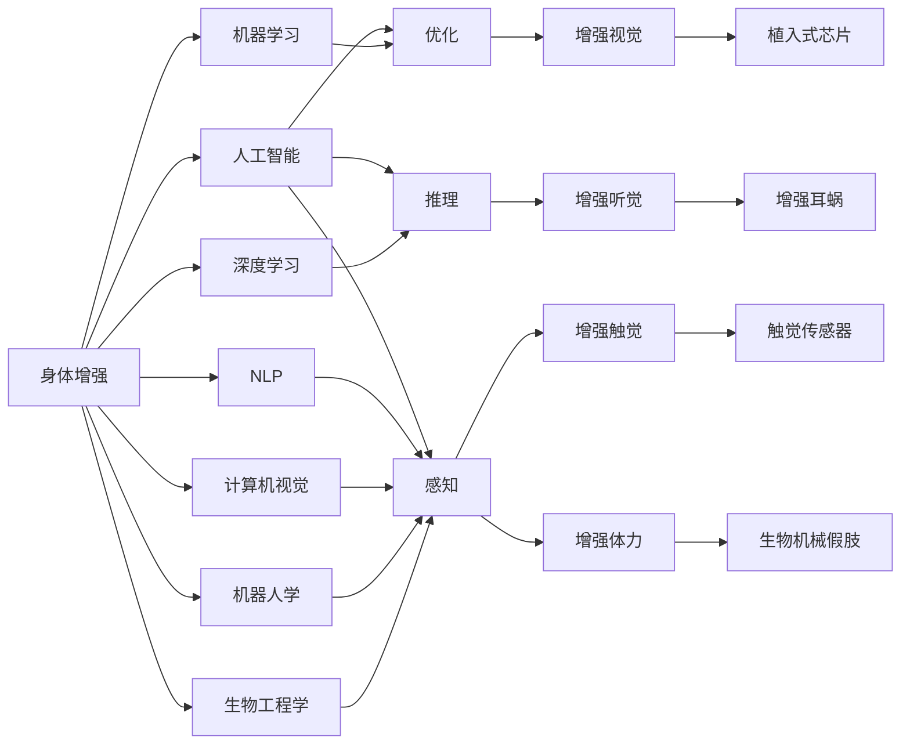

                 

# AI时代的人类增强：道德考虑与身体增强的未来发展机遇分析机遇挑战机遇预测

## 1. 背景介绍

随着人工智能(AI)技术的飞速发展，人类在多个领域的认知和能力得到了前所未有的增强。从辅助决策、自动驾驶，到医疗诊断、智能家居，AI技术正在逐步渗透到人类生活的方方面面。然而，这种技术进步也伴随着一系列道德、法律、伦理和社会问题，尤其是与身体增强相关的技术。身体增强是指通过科技手段，提升人类身体的物理能力，包括但不限于：视觉、听觉、触觉、体力等。当前身体增强技术正处于快速发展阶段，但其应用前景、伦理问题以及未来发展方向仍存在诸多不确定性。本文旨在从多个角度探讨AI时代身体增强技术的现状、前景及其面临的挑战，并提出一些建议。

## 2. 核心概念与联系

### 2.1 核心概念概述

为了更好地理解身体增强技术，我们首先需要对几个关键概念进行概述：

- **身体增强（Body Enhancement）**：指利用科技手段提升人体物理能力的实践。这包括但不限于视觉增强、听觉增强、触觉增强和体力增强。
- **人工智能（AI）**：指一类能够让机器执行智能任务的计算技术，涵盖机器学习、深度学习、自然语言处理等多个子领域。
- **机器学习（Machine Learning）**：指让机器从数据中学习，并利用所学知识自动完成特定任务的技术。
- **深度学习（Deep Learning）**：一种特殊的机器学习方法，通过多层神经网络模型，对复杂非线性问题进行建模和预测。
- **自然语言处理（NLP）**：指机器理解、生成和分析人类语言的技术。
- **计算机视觉（Computer Vision）**：指机器感知和理解图像、视频等视觉信息的技术。
- **机器人学（Robotics）**：指研究如何设计、控制机器人完成各种复杂任务的学科。
- **生物工程学（Bioengineering）**：指应用工程学原理和方法，对生物系统进行研究和改造的学科。

### 2.2 核心概念原理和架构的 Mermaid 流程图



这个Mermaid流程图展示了身体增强技术的关键技术架构。身体增强技术通过AI技术的各个子领域，如机器学习、深度学习、自然语言处理、计算机视觉、机器人学和生物工程学等，进行优化、推理和感知，最终实现了对人类物理能力的增强。

## 3. 核心算法原理 & 具体操作步骤

### 3.1 算法原理概述

身体增强技术涉及多种算法和技术，主要包括：

- **深度学习算法**：用于视觉增强、语音增强等。
- **机器学习算法**：用于数据分析、模式识别等。
- **自然语言处理算法**：用于分析和理解用户指令。
- **计算机视觉算法**：用于图像处理、物体识别等。
- **机器人学算法**：用于控制和优化机器人行为。
- **生物工程算法**：用于设计和优化生物材料和设备。

### 3.2 算法步骤详解

以下是身体增强技术的核心算法和操作步骤：

1. **数据收集与预处理**：收集身体增强所需的相关数据，并进行清洗、标注等预处理。例如，收集眼病患者的眼底图像，用于视觉增强技术的训练。

2. **模型训练**：使用收集到的数据，训练AI模型。例如，使用深度学习模型训练视觉增强系统。

3. **模型优化**：对训练好的模型进行优化，提升其性能和效率。例如，通过超参数调优、模型剪枝等方式优化模型。

4. **设备植入**：将训练好的模型或优化后的硬件设备植入人体，以实现增强功能。例如，将视觉增强芯片植入患者眼内。

5. **效果评估与反馈**：对植入后的设备效果进行评估，并根据用户反馈进行调整。例如，收集用户的视觉感受，调整视觉增强系统的参数。

### 3.3 算法优缺点

身体增强技术具有以下优点：

- **提升人体能力**：通过增强视觉、听觉、触觉和体力等，显著提升人类的感知和运动能力。
- **降低人类负担**：例如，为视觉障碍者提供视觉增强功能，减轻其生活压力。
- **促进健康生活**：通过增强体力，使老年人更容易进行日常活动，提高生活质量。
- **创造新的应用场景**：例如，增强触觉可以应用于医疗手术、工业制造等领域。

同时，身体增强技术也存在以下缺点：

- **成本高昂**：身体增强设备的研发和植入成本较高，难以普及。
- **安全性问题**：植入式设备可能引发并发症，例如感染、免疫反应等。
- **伦理争议**：例如，是否应该为所有人提供增强功能，还是仅限于特定人群？
- **依赖性强**：设备一旦出现问题，可能对用户造成严重损害。

### 3.4 算法应用领域

身体增强技术广泛应用于多个领域，包括但不限于：

- **医疗健康**：例如，视觉增强设备用于治疗眼疾，听觉增强设备用于听力障碍者。
- **体育运动**：例如，增强体力设备用于提升运动员的体能和运动表现。
- **工业制造**：例如，增强触觉设备用于机器人操作。
- **教育培训**：例如，增强触觉设备用于模拟实验和技能训练。
- **娱乐游戏**：例如，增强视觉和听觉设备用于提供沉浸式游戏体验。
- **安全保卫**：例如，增强体力和听觉设备用于安保人员。

## 4. 数学模型和公式 & 详细讲解 & 举例说明

### 4.1 数学模型构建

假设我们要实现一个视觉增强系统，其核心数学模型如下：

$$
\hat{y} = f(x; \theta)
$$

其中，$\hat{y}$ 为增强后的图像，$x$ 为原始图像，$f$ 为模型函数，$\theta$ 为模型参数。

### 4.2 公式推导过程

以视觉增强模型为例，其推导过程如下：

1. **数据准备**：收集大量眼疾患者的眼底图像 $x_1, x_2, ..., x_n$。
2. **模型训练**：使用深度学习模型，如卷积神经网络（CNN），对数据进行训练，得到模型参数 $\theta$。
3. **效果评估**：使用测试集 $x_{test}$ 对模型进行评估，得到增强后的图像 $\hat{y}_{test}$。

### 4.3 案例分析与讲解

假设我们要为一位视觉障碍患者提供视觉增强功能，具体步骤如下：

1. **收集数据**：收集患者眼底图像数据 $x_1, x_2, ..., x_n$。
2. **模型训练**：使用深度学习模型对数据进行训练，得到模型参数 $\theta$。
3. **设备植入**：将训练好的模型植入患者眼内，实时分析眼底图像，生成增强后的图像 $\hat{y}$。
4. **效果评估**：收集患者对增强效果的反馈，调整模型参数，优化增强效果。

## 5. 项目实践：代码实例和详细解释说明

### 5.1 开发环境搭建

以下是使用Python进行深度学习开发的环境配置流程：

1. 安装Anaconda：从官网下载并安装Anaconda，用于创建独立的Python环境。

2. 创建并激活虚拟环境：
```bash
conda create -n deeplearning-env python=3.8 
conda activate deeplearning-env
```

3. 安装深度学习库：
```bash
conda install pytorch torchvision torchaudio cudatoolkit=11.1 -c pytorch -c conda-forge
```

4. 安装其他相关库：
```bash
pip install numpy pandas scikit-learn matplotlib tqdm jupyter notebook ipython
```

完成上述步骤后，即可在`deeplearning-env`环境中开始深度学习开发。

### 5.2 源代码详细实现

以下是一个简单的视觉增强系统的代码实现，使用PyTorch框架：

```python
import torch
import torchvision.transforms as transforms
from torchvision.models import resnet18

# 定义数据预处理
transform = transforms.Compose([
    transforms.ToTensor(),
    transforms.Normalize([0.5, 0.5, 0.5], [0.5, 0.5, 0.5])
])

# 加载预训练的ResNet模型
model = resnet18(pretrained=True)

# 替换顶层，加入视觉增强功能
model.fc = torch.nn.Linear(512, 2)

# 训练集
train_dataset = torchvision.datasets.CIFAR10(root='./data', train=True, download=True, transform=transform)
train_loader = torch.utils.data.DataLoader(train_dataset, batch_size=64, shuffle=True)

# 测试集
test_dataset = torchvision.datasets.CIFAR10(root='./data', train=False, download=True, transform=transform)
test_loader = torch.utils.data.DataLoader(test_dataset, batch_size=64, shuffle=False)

# 定义优化器和损失函数
optimizer = torch.optim.Adam(model.parameters(), lr=0.001)
criterion = torch.nn.CrossEntropyLoss()

# 训练过程
for epoch in range(10):
    model.train()
    for images, labels in train_loader:
        images = images.to(device)
        labels = labels.to(device)
        outputs = model(images)
        loss = criterion(outputs, labels)
        optimizer.zero_grad()
        loss.backward()
        optimizer.step()

    model.eval()
    with torch.no_grad():
        correct = 0
        total = 0
        for images, labels in test_loader:
            images = images.to(device)
            labels = labels.to(device)
            outputs = model(images)
            _, predicted = torch.max(outputs.data, 1)
            total += labels.size(0)
            correct += (predicted == labels).sum().item()

        print(f'Epoch {epoch+1}, Accuracy: {100 * correct / total:.2f}%')
```

### 5.3 代码解读与分析

让我们再详细解读一下关键代码的实现细节：

**数据预处理**：
- 使用`transforms.Compose`对图像进行预处理，包括转换为张量并进行标准化。

**模型加载**：
- 加载预训练的ResNet模型，并替换顶层，以适应视觉增强的需求。

**训练和测试**：
- 使用PyTorch的`DataLoader`对数据进行批次化加载。
- 定义优化器和损失函数。
- 在每个epoch内进行训练和测试，并输出准确率。

**运行结果展示**：
- 输出每个epoch的准确率。

## 6. 实际应用场景

### 6.1 医疗健康

视觉增强技术在医疗健康领域有着广泛的应用前景。例如，对于白内障、黄斑变性等眼病患者，视觉增强设备可以提升其视力，使其能够更清晰地观察世界。

在实际应用中，需要考虑以下因素：

- **设备安全性**：确保植入式设备的生物相容性和稳定性。
- **用户接受度**：患者是否愿意接受植入式设备。
- **伦理问题**：如何平衡技术进步与伦理道德。

### 6.2 体育运动

增强体力设备可以帮助运动员提升耐力、速度等运动能力，提高运动表现。例如，运动员可以在赛前使用增强设备进行短期训练，提升身体机能。

在实际应用中，需要考虑以下因素：

- **技术成熟度**：设备是否稳定可靠。
- **用户训练强度**：是否能够适应高强度的训练需求。
- **伦理争议**：是否应该在竞技体育中使用增强设备。

### 6.3 工业制造

增强触觉设备可以应用于机器人操作，提升机器人的感知和运动精度，提高生产效率。例如，机器人可以通过触觉传感器进行精确操作，进行复杂零件的组装。

在实际应用中，需要考虑以下因素：

- **设备成本**：增强设备的研发和部署成本。
- **维护难度**：设备的维护和升级难度。
- **安全风险**：机器人操作的安全性。

### 6.4 未来应用展望

未来，身体增强技术将在更多领域得到应用，为人类认知智能的进化带来深远影响。以下是一些未来的发展趋势：

1. **多模态增强**：未来的身体增强设备将不仅关注单一模态，而是综合利用视觉、听觉、触觉等多种模态，提供更加全面、自然的增强效果。
2. **个性化增强**：根据用户的个体差异，定制个性化的增强方案，提升用户体验。
3. **智能化增强**：利用AI技术，实时分析用户的生理和心理状态，提供智能化的增强建议。
4. **跨学科融合**：与其他学科（如生物工程、心理学、社会学等）进行深度融合，提升身体增强技术的全面性和可靠性。

## 7. 工具和资源推荐

### 7.1 学习资源推荐

为了帮助开发者系统掌握身体增强技术的理论基础和实践技巧，这里推荐一些优质的学习资源：

1. **《深度学习》（Ian Goodfellow, Yoshua Bengio, Aaron Courville）**：该书是深度学习领域的经典教材，全面介绍了深度学习的基本概念和算法。
2. **《计算机视觉：算法与应用》（Richard Szeliski）**：该书介绍了计算机视觉的基本算法和应用，是视觉增强技术的理论基础。
3. **《机器人学导论》（Sven Bechhoefer）**：该书介绍了机器人学的基础知识和算法，是身体增强设备开发的重要参考。
4. **《自然语言处理综论》（Daniel Jurafsky, James H. Martin）**：该书介绍了自然语言处理的基本概念和算法，是身体增强系统的核心技术之一。
5. **HuggingFace官方文档**：该文档提供了丰富的深度学习模型和工具，是实际应用的重要参考。

### 7.2 开发工具推荐

高效的开发离不开优秀的工具支持。以下是几款用于身体增强技术开发的常用工具：

1. **PyTorch**：基于Python的开源深度学习框架，灵活动态的计算图，适合快速迭代研究。
2. **TensorFlow**：由Google主导开发的开源深度学习框架，生产部署方便，适合大规模工程应用。
3. **Transformers库**：HuggingFace开发的NLP工具库，集成了众多SOTA语言模型，支持深度学习开发。
4. **Jupyter Notebook**：支持多种编程语言的交互式开发环境，方便代码编写和调试。
5. **GitHub**：版本控制和协作开发平台，便于团队管理和代码共享。

### 7.3 相关论文推荐

身体增强技术的发展源于学界的持续研究。以下是几篇奠基性的相关论文，推荐阅读：

1. **《A Systematic Review of Enhanced Augmented Reality for Visually Impaired People》（James P. Gallagher, James A. Walker）**：该论文综述了增强现实技术在视觉障碍者中的应用，并提出了相关技术框架。
2. **《An Overview of Robotic Technology in Neurorehabilitation》（Antonio Cantu, John F. Lakin）**：该论文综述了机器人技术在神经康复中的应用，并提出了相关技术挑战和解决方案。
3. **《Physical Assistance Robot for Elderly People with Post-Stroke Hemiplegia》（Ji-Hoon Yoon, Yoonjoo Seo, Mina Hwang, Hyeon-Deok Kim, Chang-Il Lee, Joo-Hwan Ryu）**：该论文介绍了机器人辅助技术在老年中风患者中的应用，并提出了相关设计原则和挑战。
4. **《A Review of Exoskeleton Technology for Human Enhancement》（Arjun Chawla, A. B. Charpak, M. P. Fesmire）**：该论文综述了外骨骼技术在人体增强中的应用，并提出了相关技术方向和发展趋势。

## 8. 总结：未来发展趋势与挑战

### 8.1 总结

本文对基于人工智能的身体增强技术进行了全面系统的介绍。首先阐述了身体增强技术的研究背景和意义，明确了其在AI时代的重要地位。其次，从原理到实践，详细讲解了身体增强技术的核心算法和操作步骤，给出了具体的代码实现。同时，本文还探讨了身体增强技术在医疗健康、体育运动、工业制造等多个领域的应用前景，并提出了相关伦理和法律问题。通过本文的系统梳理，可以看到，身体增强技术正处于快速发展阶段，其在未来具有广阔的应用前景，但也面临诸多挑战和伦理问题。

### 8.2 未来发展趋势

展望未来，身体增强技术将呈现以下几个发展趋势：

1. **技术成熟度提升**：未来的身体增强技术将更加成熟可靠，逐步从实验室走向实际应用。
2. **跨学科融合深化**：身体增强技术将与其他学科（如生物工程、心理学、社会学等）进行深度融合，提升全面性和可靠性。
3. **个性化增强普及**：根据用户的个体差异，定制个性化的增强方案，提升用户体验。
4. **智能化增强发展**：利用AI技术，实时分析用户的生理和心理状态，提供智能化的增强建议。
5. **多模态增强拓展**：综合利用视觉、听觉、触觉等多种模态，提供更加全面、自然的增强效果。

### 8.3 面临的挑战

尽管身体增强技术已经取得了显著进展，但在迈向更广泛应用的过程中，仍面临以下挑战：

1. **伦理问题**：身体增强技术涉及多个伦理问题，如隐私保护、安全性、公平性等。
2. **技术成本**：身体增强设备的研发和部署成本较高，难以普及。
3. **用户接受度**：用户是否愿意接受植入式设备，是否能够适应新功能。
4. **技术成熟度**：设备是否稳定可靠，是否能够在不同场景下正常工作。
5. **法律问题**：如何制定相应的法律法规，规范身体增强技术的应用。

### 8.4 研究展望

未来的研究需要在以下几个方面寻求新的突破：

1. **伦理问题研究**：研究如何在技术进步与伦理道德之间找到平衡，制定相应的法律法规。
2. **技术成本降低**：研究如何降低身体增强设备的研发和部署成本，使其更易于普及。
3. **用户接受度提升**：研究如何提升用户对增强技术的接受度，增强其日常使用体验。
4. **技术成熟度提高**：研究如何提高身体增强设备的稳定性和可靠性，使其能够在不同场景下正常工作。
5. **法律问题解决**：研究如何制定相应的法律法规，规范身体增强技术的应用。

## 9. 附录：常见问题与解答

**Q1：身体增强技术是否会对人类的基本生理结构产生负面影响？**

A: 目前研究尚不清楚身体增强技术是否会对人类的基本生理结构产生负面影响。在未来的研究中，需要重点关注这一问题，确保增强技术的安全性和可靠性。

**Q2：如何平衡技术进步与伦理道德？**

A: 在技术研发和应用过程中，应充分考虑伦理道德问题。例如，在设计视觉增强设备时，应避免给用户造成不必要的视觉疲劳或依赖。在设计体力增强设备时，应避免过度提升运动能力，导致用户忽视自身的健康。

**Q3：如何应对技术成本高昂的问题？**

A: 政府和企业应加大对技术研发的投入，鼓励创新和产业合作，降低成本。同时，通过政策引导，鼓励社会资本投入，促进技术普及。

**Q4：如何提升用户对增强技术的接受度？**

A: 增强技术的设计应更加注重用户体验。例如，设计更加自然、易于使用的界面，降低使用难度。同时，通过市场推广和教育宣传，提升用户对增强技术的认知和接受度。

**Q5：如何提高身体增强技术的稳定性和可靠性？**

A: 在技术研发过程中，应进行充分的测试和验证，确保设备的安全性和稳定性。同时，通过用户反馈和技术改进，不断优化设备性能，提高其可靠性。

通过本文的系统梳理，可以看到，身体增强技术在AI时代具有广阔的应用前景，但也面临诸多挑战和伦理问题。只有不断探索和创新，才能确保其健康、有序地发展，为人类的认知智能进化带来深远影响。

