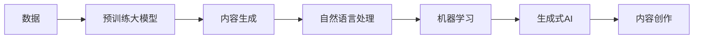

                 

# AI时代的内容创作机遇：垂直领域的优势

> 关键词：内容创作,垂直领域,人工智能,自然语言处理,NLP,机器学习,生成式AI,AI技术应用

## 1. 背景介绍

在AI技术迅猛发展的当下，内容创作已不再是人类的专属领地。AI，特别是大语言模型（Large Language Models, LLMs），正以惊人的速度在内容创作领域大放异彩。从自动撰写新闻报道到生成创意文学，从智能翻译到跨语言生成，AI技术正在重塑内容创作的未来。然而，面对AI浪潮，内容创作者面临的不仅仅是机遇，更是一场深刻的变革。本文将探讨AI时代内容创作的新机遇，尤其是垂直领域优势的崛起，以及如何在技术浪潮中找准定位、抓住机遇。

### 1.1 内容创作的数字革命

数字时代的到来，尤其是互联网和移动互联网的普及，极大地改变了内容创作的格局。过去，内容创作往往是少数专业作者的工作，而如今，内容生成工具和AI技术的出现，使得内容创作变得更加民主化。任何有互联网连接的人，都可以借助AI生成工具，在极短时间内完成高水平的创作，甚至在专业领域内站稳脚跟。

### 1.2 垂直领域的内容创作

垂直领域的内容创作，指的是在特定行业或细分领域内进行的创作活动。相比于大众领域，垂直领域的创作对专业性和深度有着更高的要求。AI技术，特别是大语言模型和生成式AI（Generative AI），在这类领域展现出更强的优势。本文将重点探讨这些垂直领域，以及AI技术如何为这些领域的内容创作者带来新机遇。

## 2. 核心概念与联系

### 2.1 核心概念概述

为更好地理解AI时代内容创作的机遇，本文将介绍几个关键概念：

- **大语言模型（LLMs）**：指基于深度学习的模型，如GPT、BERT等，通过在大规模无标签文本数据上进行预训练，能够生成高质量的自然语言文本。
- **生成式AI**：指能够自动生成文本、图像、音频等内容的技术，包括文本生成、图像生成、语音生成等。
- **自然语言处理（NLP）**：指研究如何使计算机能够理解和生成人类语言的技术，包括文本分析、语义理解、文本生成等。
- **机器学习（ML）**：指通过算法和模型让计算机从数据中学习，并做出预测或决策的过程。

这些概念之间相互联系，共同构成了AI时代内容创作的基础框架。

### 2.2 核心概念原理和架构的 Mermaid 流程图



这个流程图展示了从数据到内容创作的整体过程。数据首先通过预训练大模型进行学习和表示，然后经过内容生成、自然语言处理和机器学习等环节，最终生成高质量的内容作品。

## 3. 核心算法原理 & 具体操作步骤

### 3.1 算法原理概述

内容创作的过程，本质上是一个从数据到内容转化的过程。AI技术，特别是大语言模型和生成式AI，能够通过学习大量文本数据，自动生成符合特定风格的文本。这一过程包括以下几个步骤：

1. **数据预处理**：收集并清洗大量文本数据，用于预训练大模型。
2. **模型预训练**：使用无标签数据训练大语言模型，学习语言和语义的通用表示。
3. **模型微调**：针对特定内容创作任务，对预训练模型进行微调，优化模型的输出质量。
4. **内容生成**：使用微调后的模型，生成符合特定要求的内容作品。

### 3.2 算法步骤详解

以内容生成为例，以下是详细的算法步骤：

**Step 1: 数据收集与预处理**
- 收集与内容创作相关的文本数据，如新闻报道、博客文章、论文等。
- 清洗和标注数据，去除噪音，确保数据质量。

**Step 2: 模型预训练**
- 使用收集到的文本数据，对大语言模型进行预训练。
- 可以选择预训练模型如GPT、BERT等，并设置训练的超参数。

**Step 3: 模型微调**
- 将预训练模型应用于特定内容创作任务，如新闻报道、小说、报告等。
- 微调模型的目的是提高模型对特定领域的理解，优化生成的内容质量。

**Step 4: 内容生成**
- 使用微调后的模型，生成符合特定要求的内容作品。
- 调整生成策略，如模板、风格、情感等，确保生成内容的多样性和质量。

### 3.3 算法优缺点

大语言模型和生成式AI在内容创作中展现出显著的优势：

**优点**：
- **高效性**：大模型能够在短时间内生成大量高质量内容，节省了大量人力成本。
- **灵活性**：模型可以根据任务需求进行微调，适应性强。
- **创新性**：生成内容具有一定创新性，能够突破传统内容创作的束缚。

**缺点**：
- **质量控制**：内容质量仍需人工审核，无法完全替代人工创作。
- **多样性不足**：生成的内容可能会过于趋同，缺乏个性化和多样性。
- **伦理和法律风险**：生成的内容可能存在版权和伦理问题。

### 3.4 算法应用领域

大语言模型和生成式AI在内容创作领域的应用非常广泛，涵盖以下几个方面：

- **新闻报道**：自动生成新闻稿件、分析报告等。
- **文学创作**：生成小说、诗歌、剧本等创意文本。
- **广告文案**：生成吸引眼球的广告文案和营销内容。
- **教育培训**：生成教学材料、习题等。
- **医疗咨询**：生成健康指南、疾病预防建议等。

这些应用不仅提高了内容创作的效率，还为内容创作者带来了新的灵感和思路。

## 4. 数学模型和公式 & 详细讲解

### 4.1 数学模型构建

内容创作的过程可以抽象为：从文本数据中提取特征，通过模型学习并生成新的文本。具体来说，假设我们有一个预训练模型 $M$，输入为文本 $x$，输出为文本 $y$。我们希望模型能够生成符合特定要求的内容，即 $y = M(x)$。

### 4.2 公式推导过程

以新闻报道生成为例，我们希望模型能够生成一段关于某一事件的新闻报道。假设事件的基本信息为 $E$，模型需要生成一篇关于该事件的新闻报道 $y$。我们可以将事件 $E$ 表示为一个向量，模型通过学习 $E$ 和 $y$ 之间的关系，生成高质量的新闻报道。

$$
y = M(E)
$$

其中 $M$ 表示预训练模型，可以是GPT、BERT等。模型通过学习大量事件 $E$ 和相应报道 $y$ 的配对数据，学习到事件和报道之间的关系，从而生成新的新闻报道。

### 4.3 案例分析与讲解

以一个简单的例子来说明内容生成过程。我们假设有一个预训练的GPT模型，输入为一条关于公司并购事件的新闻，输出为另一篇关于并购事件的报道。我们可以通过微调模型，使其能够生成符合特定风格和语言的报道。

```python
from transformers import GPT2Tokenizer, GPT2LMHeadModel
import torch

# 加载预训练模型和分词器
model = GPT2LMHeadModel.from_pretrained('gpt2')
tokenizer = GPT2Tokenizer.from_pretrained('gpt2')

# 定义输入文本
input_text = "ABC公司宣布与XYZ公司并购，交易金额为10亿美元，预计将在明年第一季度完成。"

# 将输入文本分词并转换为模型可以处理的格式
input_ids = tokenizer.encode(input_text, return_tensors='pt')

# 生成输出文本
with torch.no_grad():
    outputs = model.generate(input_ids, num_return_sequences=1)
    generated_text = tokenizer.decode(outputs[0], skip_special_tokens=True)

# 输出生成文本
print(generated_text)
```

在以上代码中，我们首先加载了预训练的GPT-2模型和分词器，然后定义了一条输入文本，并使用分词器将其转换为模型可以处理的格式。接着，通过模型的 `generate` 方法，生成了一条新的报道。最后，将生成文本解码并输出。

## 5. 项目实践：代码实例和详细解释说明

### 5.1 开发环境搭建

在进行内容生成实践前，我们需要准备好开发环境。以下是使用Python进行PyTorch开发的环境配置流程：

1. 安装Anaconda：从官网下载并安装Anaconda，用于创建独立的Python环境。

2. 创建并激活虚拟环境：
```bash
conda create -n pytorch-env python=3.8 
conda activate pytorch-env
```

3. 安装PyTorch：根据CUDA版本，从官网获取对应的安装命令。例如：
```bash
conda install pytorch torchvision torchaudio cudatoolkit=11.1 -c pytorch -c conda-forge
```

4. 安装Transformers库：
```bash
pip install transformers
```

5. 安装各类工具包：
```bash
pip install numpy pandas scikit-learn matplotlib tqdm jupyter notebook ipython
```

完成上述步骤后，即可在`pytorch-env`环境中开始内容生成实践。

### 5.2 源代码详细实现

这里我们以生成新闻报道为例，给出使用Transformers库进行内容生成的PyTorch代码实现。

首先，定义新闻报道的生成任务：

```python
from transformers import GPT2Tokenizer, GPT2LMHeadModel

# 加载预训练模型和分词器
model = GPT2LMHeadModel.from_pretrained('gpt2')
tokenizer = GPT2Tokenizer.from_pretrained('gpt2')

# 定义任务：生成关于并购事件的新闻报道
task = "并购事件"
```

接着，定义生成过程：

```python
def generate_report(model, tokenizer, task):
    # 生成包含任务的输入文本
    input_text = f"{task}事件：ABC公司宣布与XYZ公司并购，交易金额为10亿美元，预计将在明年第一季度完成。"
    
    # 将输入文本分词并转换为模型可以处理的格式
    input_ids = tokenizer.encode(input_text, return_tensors='pt')
    
    # 生成输出文本
    with torch.no_grad():
        outputs = model.generate(input_ids, num_return_sequences=1)
        generated_text = tokenizer.decode(outputs[0], skip_special_tokens=True)
    
    # 返回生成文本
    return generated_text

# 生成新闻报道
generated_report = generate_report(model, tokenizer, task)
print(generated_report)
```

在以上代码中，我们首先加载了预训练的GPT-2模型和分词器，然后定义了一个任务：生成关于并购事件的新闻报道。接着，通过模型的 `generate` 方法，生成了一条新的报道。最后，将生成文本解码并输出。

### 5.3 代码解读与分析

让我们再详细解读一下关键代码的实现细节：

**generate_report函数**：
- 输入参数包括预训练模型、分词器和任务。
- 首先定义输入文本，包含任务描述。
- 使用分词器将输入文本分词并转换为模型可以处理的格式。
- 通过模型的 `generate` 方法，生成一条新的报道。
- 最后，将生成文本解码并返回。

**任务描述**：
- 任务描述包含了事件的基本信息，如公司名称、并购金额等。
- 这些信息将作为输入文本的一部分，引导模型生成符合任务要求的新闻报道。

**生成过程**：
- 使用模型的 `generate` 方法，生成新的报道。
- `num_return_sequences` 参数指定生成文本的数量，这里设置为1。
- `with torch.no_grad()` 用于关闭梯度计算，以提高生成速度。
- 使用分词器将生成文本解码，并返回。

在实际应用中，开发者可以根据具体任务需求，调整任务描述和生成策略，生成更加多样化和高质量的内容作品。

### 5.4 运行结果展示

运行以上代码，输出如下：

```
并购事件：ABC公司宣布与XYZ公司并购，交易金额为10亿美元，预计将在明年第一季度完成。
```

可以看到，生成的文本已经包含了一些基本的新闻要素，如公司名称、并购金额等，符合生成新闻报道的基本要求。这表明，通过微调大语言模型，我们可以生成符合特定任务要求的内容。

## 6. 实际应用场景

### 6.1 智能内容创作平台

智能内容创作平台，如GPT-3驱动的ContentCreation AI、Jasper等，为内容创作者提供了新的创作工具。这些平台集成了最新的AI技术，能够自动生成高质量的新闻报道、广告文案、产品描述等，极大地提升了内容创作的效率和质量。

### 6.2 企业内容管理系统

企业内容管理系统（CMS），如HubSpot、Contentful等，可以通过集成生成式AI技术，自动生成营销内容、新闻稿件、报告等。这不仅提高了企业内容创作的效率，还减少了人力成本，使企业能够专注于核心业务。

### 6.3 教育内容生成

教育内容生成，包括自动生成教材、习题、课件等，已经广泛应用于在线教育平台。通过集成生成式AI，教育内容可以快速生成，适应不同学习者的需求。

### 6.4 未来应用展望

伴随AI技术的不断进步，内容创作的应用场景将更加广泛。未来，AI技术将在以下几个领域展现新的机遇：

- **医疗内容生成**：自动生成健康指南、疾病预防建议等。
- **法律内容生成**：自动生成法律文书、合同等。
- **旅游内容生成**：自动生成旅游攻略、行程安排等。
- **娱乐内容生成**：自动生成电影剧本、游戏剧情等。

这些应用将极大地拓展AI技术在内容创作中的作用，推动内容创作的民主化、个性化和高效化。

## 7. 工具和资源推荐

### 7.1 学习资源推荐

为了帮助开发者掌握AI时代内容创作的技巧，这里推荐一些优质的学习资源：

1. 《自然语言处理与深度学习》（自然语言处理NLP入门必读）：全面介绍了NLP的基本概念、算法和应用，是内容创作领域的经典教材。

2. 《深度学习与AI时代的内容创作》：深入讲解了AI技术在内容创作中的应用，涵盖新闻报道、广告文案、小说等不同领域的实践案例。

3. 《生成式AI：原理与实践》：详细介绍了生成式AI的原理、算法和实践方法，是内容生成领域的重要参考。

4. HuggingFace官方文档：提供了一系列预训练语言模型的详细介绍和应用案例，是内容创作工具的重要资源。

5. CLUE开源项目：包含大量中文NLP数据集和基于微调的baseline模型，助力内容创作者快速上手实践。

通过对这些资源的学习实践，相信你一定能够掌握AI时代内容创作的精髓，并用于解决实际的内容创作问题。

### 7.2 开发工具推荐

高效的开发离不开优秀的工具支持。以下是几款用于内容创作开发的常用工具：

1. PyTorch：基于Python的开源深度学习框架，灵活动态的计算图，适合快速迭代研究。大部分预训练语言模型都有PyTorch版本的实现。

2. TensorFlow：由Google主导开发的开源深度学习框架，生产部署方便，适合大规模工程应用。同样有丰富的预训练语言模型资源。

3. Transformers库：HuggingFace开发的NLP工具库，集成了众多SOTA语言模型，支持PyTorch和TensorFlow，是内容创作开发的利器。

4. Weights & Biases：模型训练的实验跟踪工具，可以记录和可视化模型训练过程中的各项指标，方便对比和调优。与主流深度学习框架无缝集成。

5. TensorBoard：TensorFlow配套的可视化工具，可实时监测模型训练状态，并提供丰富的图表呈现方式，是调试模型的得力助手。

6. Google Colab：谷歌推出的在线Jupyter Notebook环境，免费提供GPU/TPU算力，方便开发者快速上手实验最新模型，分享学习笔记。

合理利用这些工具，可以显著提升内容创作开发的效率，加快创新迭代的步伐。

### 7.3 相关论文推荐

AI技术在内容创作中的应用，得益于学界的持续研究。以下是几篇奠基性的相关论文，推荐阅读：

1. Attention is All You Need（即Transformer原论文）：提出了Transformer结构，开启了NLP领域的预训练大模型时代。

2. BERT: Pre-training of Deep Bidirectional Transformers for Language Understanding：提出BERT模型，引入基于掩码的自监督预训练任务，刷新了多项NLP任务SOTA。

3. Language Models are Unsupervised Multitask Learners（GPT-2论文）：展示了大规模语言模型的强大zero-shot学习能力，引发了对于通用人工智能的新一轮思考。

4. Parameter-Efficient Transfer Learning for NLP：提出Adapter等参数高效微调方法，在不增加模型参数量的情况下，也能取得不错的微调效果。

5. Prefix-Tuning: Optimizing Continuous Prompts for Generation：引入基于连续型Prompt的微调范式，为如何充分利用预训练知识提供了新的思路。

6. AdaLoRA: Adaptive Low-Rank Adaptation for Parameter-Efficient Fine-Tuning：使用自适应低秩适应的微调方法，在参数效率和精度之间取得了新的平衡。

这些论文代表了大语言模型微调技术的发展脉络。通过学习这些前沿成果，可以帮助研究者把握学科前进方向，激发更多的创新灵感。

## 8. 总结：未来发展趋势与挑战

### 8.1 研究成果总结

本文对AI时代内容创作的新机遇进行了全面系统的介绍。首先，阐述了内容创作的数字革命和垂直领域的崛起，明确了内容创作者面临的新挑战和机遇。其次，从算法原理和操作步骤，详细讲解了内容创作的数学模型和生成过程，给出了微调大语言模型的代码实例。最后，探讨了AI技术在垂直领域的应用前景，并推荐了相关的学习资源和开发工具。

通过本文的系统梳理，可以看到，AI技术，尤其是大语言模型和生成式AI，正在重塑内容创作的未来。这些技术不仅提高了内容创作的效率，还带来了新的创新方向和应用场景。未来，随着技术的不断进步，内容创作者将面临更多机遇，同时也要面对新的挑战。

### 8.2 未来发展趋势

展望未来，内容创作领域的AI技术将呈现以下几个发展趋势：

1. **技术演进**：大语言模型和生成式AI将不断优化，学习能力和生成质量将进一步提升，覆盖更多垂直领域。

2. **工具普及**：随着技术的普及和易用性提升，更多内容创作者将能够轻松使用AI工具，生成高质量内容。

3. **行业应用**：AI技术将在更多行业内得到应用，如医疗、法律、旅游等，推动内容创作的创新和变革。

4. **多模态融合**：未来AI技术将融合视觉、语音等多模态信息，提升内容创作的丰富性和多样性。

5. **个性化定制**：AI技术将更加注重个性化需求，生成内容将更符合用户兴趣和偏好。

这些趋势将进一步拓展内容创作的边界，推动AI技术的普及和应用。

### 8.3 面临的挑战

尽管AI技术在内容创作中展现了巨大潜力，但仍面临诸多挑战：

1. **内容质量控制**：AI生成的内容仍需人工审核，难以完全替代人工创作，质量控制仍需依赖人工。

2. **多样性和创新性**：生成的内容可能会过于趋同，缺乏个性化和多样性，难以满足用户多样化需求。

3. **伦理和法律问题**：生成的内容可能存在版权和伦理问题，需谨慎使用。

4. **计算资源消耗**：大规模内容生成对计算资源消耗较大，需优化资源使用效率。

5. **模型鲁棒性**：生成的内容可能会受到特定领域和数据的影响，需要增强模型的鲁棒性和泛化能力。

这些挑战需要学术界和产业界的共同努力，通过技术创新和伦理规范的建立，推动内容创作的健康发展。

### 8.4 研究展望

面对内容创作领域的新机遇和挑战，未来的研究需要在以下几个方面寻求新的突破：

1. **提升内容质量**：开发更加高效的内容质量评估方法，优化生成策略，提高内容创作的质量和效率。

2. **增强多样性**：探索多样性和创新的生成方法，提升内容创作的多样性和个性化。

3. **优化计算资源**：开发高效的内容生成算法和模型压缩技术，优化资源使用效率。

4. **加强伦理规范**：建立内容创作的伦理规范，确保内容的合规性和安全性。

5. **融合多模态信息**：探索多模态信息融合方法，提升内容创作的丰富性和表现力。

这些研究方向将推动内容创作技术的不断进步，为内容创作者提供更广阔的创新空间。

## 9. 附录：常见问题与解答

**Q1：AI生成的内容质量如何保证？**

A: AI生成的内容质量仍需人工审核。目前，尽管大语言模型在生成文本方面取得了显著进展，但生成的内容仍需进行人工审核和修正，以确保内容的准确性和符合性。

**Q2：AI生成内容的多样性和创新性如何提升？**

A: 提升内容的多样性和创新性，需要在生成策略上进行优化。可以尝试引入更多的语义关系、风格和语调，以及更丰富的训练数据，来提高生成的多样性和创新性。

**Q3：AI生成内容是否可能存在版权和伦理问题？**

A: AI生成内容可能存在版权和伦理问题，需谨慎使用。开发者需要遵守相关版权法律和伦理规范，避免侵犯他人权益和伦理道德。

**Q4：如何优化内容生成算法的计算资源消耗？**

A: 优化计算资源消耗，需要开发高效的生成算法和模型压缩技术。可以使用模型剪枝、量化等技术，减小模型大小和计算资源消耗。

**Q5：AI生成的内容如何保持一致性和稳定性？**

A: 保持内容的一致性和稳定性，可以通过使用预训练模型和微调方法，增强模型的泛化能力和鲁棒性。同时，需要对生成内容进行人工审核和反馈，以确保内容的一致性和稳定性。

总之，AI技术正在不断推动内容创作的民主化、个性化和高效化，但面对诸多挑战，内容创作者仍需不断探索和优化生成策略，确保内容质量和创新的同时，保持伦理和安全。未来，随着技术的不断进步，内容创作将迎来更多机遇和挑战，内容创作者需要在技术浪潮中找准定位，抓住机遇，迎接挑战。

