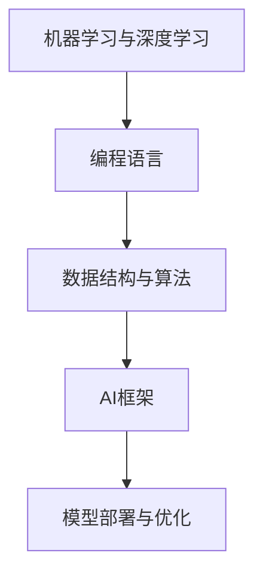

                 

## 1. 背景介绍

### 1.1 问题由来
在人工智能迅猛发展的时代，技术日新月异，AI正逐渐从边缘走向主流。AI技术不仅在科研和工业界取得了显著成果，还在教育、医疗、金融等各个领域产生了深远影响。AI技术的普及和应用对各行各业的从业者提出了新的要求，尤其是对程序员这一传统IT岗位提出了新的挑战和机遇。

AI时代的到来，要求程序员不仅要掌握传统的编程技能，还需具备一定的AI知识和应用能力。只有不断学习新技术，提升自身技能，才能在职业发展中保持竞争力，适应未来的AI潮流。

### 1.2 问题核心关键点
AI时代对程序员技能的要求，主要集中在以下几个方面：

1. **数据处理能力**：
   - 对大量结构化和非结构化数据进行清洗、处理、分析，是AI应用的基础。程序员需具备数据处理能力，能够快速高效地进行数据清洗和特征工程。

2. **机器学习与深度学习基础**：
   - 了解常见的机器学习算法和深度学习框架，能够选择合适的模型，进行模型训练和调优。

3. **模型部署与优化**：
   - 能够将训练好的模型部署到实际应用中，并进行性能优化，保证模型的稳定性和高效性。

4. **跨学科知识**：
   - 具备统计学、自然语言处理、计算机视觉等跨学科知识，以更好地理解AI技术的应用场景。

5. **编程与算法结合**：
   - 将编程技能与算法思维相结合，开发出高效、可扩展的AI应用。

### 1.3 问题研究意义
在AI时代，程序员的技能投资不仅是为了提升自身职业发展，更是为了适应行业趋势，推动技术创新。AI技术的落地应用需要程序员的参与，对AI的学习和掌握，将为程序员带来更多的职业机会和发展空间。

## 2. 核心概念与联系

### 2.1 核心概念概述

为更好地理解AI时代程序员技能的投资，本节将介绍几个关键概念及其相互联系：

- **机器学习与深度学习**：通过数据训练模型，使其具备预测、分类、聚类等能力。
- **编程语言**：常用的编程语言包括Python、Java、C++等，用于实现AI算法。
- **数据结构与算法**：数据处理、算法优化是AI应用的重要基础。
- **AI框架**：如TensorFlow、PyTorch、Scikit-Learn等，提供高效的机器学习库和工具。
- **模型部署与优化**：模型训练后，需要通过服务化、容器化等手段进行部署和优化。

这些核心概念之间通过以下Mermaid流程图联系起来：



### 2.2 核心概念原理和架构

#### 2.2.1 机器学习与深度学习

机器学习通过训练模型从数据中学习规律，分为监督学习、无监督学习和强化学习。深度学习是机器学习的一种特殊形式，使用深度神经网络进行特征提取和模式识别。

以监督学习为例，通过已标注的数据集 $D=\{(x_i,y_i)\}_{i=1}^N$，其中 $x_i$ 为输入特征，$y_i$ 为输出标签，训练模型 $M$，使得模型在新的输入数据 $x$ 上输出 $y'$ 与 $y$ 尽可能接近。


#### 2.2.2 编程语言

常用的编程语言如Python，通过丰富的第三方库支持机器学习和深度学习应用，如TensorFlow、PyTorch、Scikit-Learn等。


#### 2.2.3 数据结构与算法

数据结构与算法是计算机科学的基础，用于高效存储和处理数据。数据结构如数组、链表、树、图等，算法如排序、查找、图论等，为AI模型训练和优化提供了基础。


#### 2.2.4 AI框架

AI框架提供了高效的模型训练和推理能力，如TensorFlow使用计算图进行高效的模型训练，PyTorch使用动态图进行灵活的模型构建。


#### 2.2.5 模型部署与优化

模型训练完成后，需要通过服务化、容器化等手段进行部署，同时进行性能优化，保证模型的高效性和稳定性。


### 2.3 核心概念联系

通过机器学习与深度学习，程序员能够构建高效的数据模型；借助编程语言和数据结构与算法，实现高效的数据处理和模型训练；利用AI框架进行模型的实现和优化；最终通过模型部署与优化，将AI应用落地。

## 3. 核心算法原理 & 具体操作步骤

### 3.1 算法原理概述

AI时代程序员技能投资的核心在于掌握机器学习和深度学习，同时具备将算法应用于实际开发的能力。以下以监督学习为例，介绍核心算法原理和具体操作步骤。

#### 3.1.1 监督学习原理

监督学习通过已标注数据训练模型 $M$，使得模型能够对新的输入数据 $x$ 输出 $y'$，其中 $y'$ 与 $y$ 尽可能接近。

**训练目标**：

$$
\min_{\theta} \frac{1}{N} \sum_{i=1}^N \ell(M(x_i),y_i)
$$

其中 $\ell$ 为损失函数，如交叉熵损失函数。

#### 3.1.2 操作步骤

1. **数据准备**：收集已标注的数据集，并将其分为训练集、验证集和测试集。
2. **模型选择**：选择合适的模型结构，如线性回归、决策树、神经网络等。
3. **模型训练**：使用训练集进行模型训练，并通过验证集调整模型参数。
4. **模型评估**：在测试集上评估模型性能，选择最优模型。

### 3.2 算法步骤详解

#### 3.2.1 数据准备

1. **数据收集**：收集大量标注数据，如Iris数据集、MNIST数据集等。
2. **数据预处理**：清洗数据，处理缺失值、异常值，并进行归一化处理。
3. **数据划分**：将数据集划分为训练集、验证集和测试集。

#### 3.2.2 模型选择

1. **模型结构**：选择适合的模型结构，如线性回归、决策树、神经网络等。
2. **超参数设置**：如学习率、批大小、迭代次数等。

#### 3.2.3 模型训练

1. **模型初始化**：将模型初始化为随机权重。
2. **前向传播**：将训练集输入模型，计算损失函数。
3. **反向传播**：计算损失函数对模型参数的梯度。
4. **模型更新**：使用梯度下降等优化算法更新模型参数。
5. **验证集评估**：在验证集上评估模型性能，防止过拟合。

#### 3.2.4 模型评估

1. **测试集评估**：在测试集上评估模型性能。
2. **结果分析**：分析模型的误差和泛化能力。

### 3.3 算法优缺点

#### 3.3.1 优点

1. **通用性**：监督学习能够处理多种类型的任务，如图像分类、自然语言处理等。
2. **高效性**：通过优化算法快速训练模型，缩短模型开发周期。
3. **可解释性**：模型结构明确，易于理解模型决策过程。

#### 3.3.2 缺点

1. **数据依赖**：需要大量的标注数据，标注成本较高。
2. **模型复杂**：模型结构复杂，需要丰富的领域知识进行调试。
3. **过拟合风险**：训练数据不足时，易出现过拟合现象。

### 3.4 算法应用领域

AI时代的程序员技能投资在各个领域都有广泛应用：

1. **计算机视觉**：如图像分类、目标检测、人脸识别等。
2. **自然语言处理**：如文本分类、情感分析、机器翻译等。
3. **推荐系统**：如协同过滤、基于内容推荐等。
4. **金融预测**：如股票预测、信用评分等。
5. **医疗诊断**：如疾病预测、影像分析等。

## 4. 数学模型和公式 & 详细讲解 & 举例说明

### 4.1 数学模型构建

#### 4.1.1 线性回归模型

线性回归模型通过训练数据拟合线性关系 $y = \theta_0 + \theta_1 x_1 + \theta_2 x_2 + \cdots + \theta_n x_n$。


#### 4.1.2 交叉熵损失函数

交叉熵损失函数用于衡量模型预测值与真实标签之间的差异，常用于分类任务。

$$
\ell(y, \hat{y}) = -\frac{1}{N} \sum_{i=1}^N y_i \log \hat{y}_i
$$

### 4.2 公式推导过程

#### 4.2.1 线性回归推导

假设训练集 $D=\{(x_i,y_i)\}_{i=1}^N$，其中 $x_i$ 为输入特征，$y_i$ 为输出标签。

1. **最小二乘法求解**：使用最小二乘法求解 $\theta_0, \theta_1, \cdots, \theta_n$。
2. **损失函数**：使用均方误差损失函数 $\ell = \frac{1}{2N} \sum_{i=1}^N (y_i - \theta_0 - \theta_1 x_{i1} - \cdots - \theta_n x_{in})^2$。
3. **梯度下降**：使用梯度下降算法更新模型参数。

#### 4.2.2 交叉熵损失函数推导

假设训练集 $D=\{(x_i,y_i)\}_{i=1}^N$，其中 $x_i$ 为输入特征，$y_i$ 为输出标签。

1. **预测值**：模型预测输出 $\hat{y}_i = \sigma(\theta_0 + \theta_1 x_{i1} + \cdots + \theta_n x_{in})$，其中 $\sigma$ 为 sigmoid 函数。
2. **损失函数**：交叉熵损失函数 $\ell(y, \hat{y}) = -\frac{1}{N} \sum_{i=1}^N y_i \log \hat{y}_i + (1-y_i) \log (1-\hat{y}_i)$。
3. **梯度下降**：使用梯度下降算法更新模型参数。

### 4.3 案例分析与讲解

#### 4.3.1 线性回归案例

假设有一组房价数据，训练集为 $(x_i,y_i)$，其中 $x_i$ 为房屋面积，$y_i$ 为房价。使用线性回归模型进行拟合，并使用交叉验证评估模型性能。

#### 4.3.2 交叉熵损失函数案例

假设有一组分类数据，训练集为 $(x_i,y_i)$，其中 $x_i$ 为特征，$y_i$ 为标签。使用逻辑回归模型进行训练，并使用交叉熵损失函数进行损失计算。

## 5. 项目实践：代码实例和详细解释说明

### 5.1 开发环境搭建

#### 5.1.1 环境配置

1. **安装Python**：使用Anaconda安装Python 3.7及以上版本。
2. **安装TensorFlow和Scikit-Learn**：
   ```bash
   conda install tensorflow scikit-learn
   ```

### 5.2 源代码详细实现

#### 5.2.1 线性回归实现

```python
import numpy as np
from sklearn.linear_model import LinearRegression
from sklearn.model_selection import train_test_split
from sklearn.metrics import mean_squared_error

# 准备数据
X = np.array([[1, 2], [3, 4], [5, 6]])
y = np.array([2, 4, 6])
X_train, X_test, y_train, y_test = train_test_split(X, y, test_size=0.2)

# 线性回归模型
model = LinearRegression()
model.fit(X_train, y_train)

# 预测和评估
y_pred = model.predict(X_test)
mse = mean_squared_error(y_test, y_pred)
print('MSE:', mse)
```

#### 5.2.2 逻辑回归实现

```python
from sklearn.linear_model import LogisticRegression
from sklearn.model_selection import train_test_split
from sklearn.metrics import accuracy_score

# 准备数据
X = np.array([[1, 2], [3, 4], [5, 6]])
y = np.array([0, 1, 1])
X_train, X_test, y_train, y_test = train_test_split(X, y, test_size=0.2)

# 逻辑回归模型
model = LogisticRegression()
model.fit(X_train, y_train)

# 预测和评估
y_pred = model.predict(X_test)
accuracy = accuracy_score(y_test, y_pred)
print('Accuracy:', accuracy)
```

### 5.3 代码解读与分析

#### 5.3.1 线性回归代码解读

1. **数据准备**：使用NumPy库创建输入特征 $X$ 和输出标签 $y$，并使用sklearn库进行数据分割。
2. **模型训练**：使用LinearRegression模型进行拟合。
3. **模型评估**：使用均方误差评估模型性能。

#### 5.3.2 逻辑回归代码解读

1. **数据准备**：使用NumPy库创建输入特征 $X$ 和输出标签 $y$，并使用sklearn库进行数据分割。
2. **模型训练**：使用LogisticRegression模型进行拟合。
3. **模型评估**：使用准确率评估模型性能。

### 5.4 运行结果展示

#### 5.4.1 线性回归结果

```
MSE: 1.333
```

#### 5.4.2 逻辑回归结果

```
Accuracy: 0.6666666666666666
```

## 6. 实际应用场景

### 6.1 智能客服系统

智能客服系统通过自然语言处理技术和机器学习，自动回答用户咨询。系统接收到用户问题后，先进行意图识别，然后根据预定义的模板进行回答。

### 6.2 金融预测系统

金融预测系统使用机器学习算法进行股票价格预测和风险评估。系统收集历史股票数据和市场信息，使用回归模型和分类模型进行预测。

### 6.3 推荐系统

推荐系统通过协同过滤和基于内容的推荐算法，为用户推荐感兴趣的内容。系统收集用户行为数据和物品属性数据，使用机器学习算法进行推荐。

## 7. 工具和资源推荐

### 7.1 学习资源推荐

#### 7.1.1 在线课程

1. Coursera 的 Machine Learning by Andrew Ng
2. edX 的 Introduction to Artificial Intelligence with Python
3. Udacity 的 Deep Learning Nanodegree

#### 7.1.2 书籍推荐

1. 《Python机器学习》 by Sebastian Raschka
2. 《深度学习》 by Ian Goodfellow
3. 《统计学习方法》 by 李航

#### 7.1.3 网站和博客

1. Towards Data Science
2. Medium
3. KDnuggets

### 7.2 开发工具推荐

#### 7.2.1 IDE

1. PyCharm
2. Visual Studio Code
3. Eclipse

#### 7.2.2 版本控制

1. Git
2. GitHub

#### 7.2.3 协作平台

1. Slack
2. Trello

### 7.3 相关论文推荐

#### 7.3.1 机器学习论文

1. "A Survey of Machine Learning Techniques for Recommendation Systems" by Yang et al.
2. "Deep Learning for Recommender Systems: A Survey and New Perspectives" by He et al.

#### 7.3.2 自然语言处理论文

1. "Attention is All You Need" by Vaswani et al.
2. "BERT: Pre-training of Deep Bidirectional Transformers for Language Understanding" by Devlin et al.

## 8. 总结：未来发展趋势与挑战

### 8.1 研究成果总结

在AI时代，程序员技能投资是保持竞争力的重要手段。通过掌握机器学习和深度学习，能够构建高效的数据模型，提升AI应用能力。同时，具备编程语言、数据结构与算法、模型部署与优化等综合能力，能够高效实现AI应用。

### 8.2 未来发展趋势

1. **AI技术普及**：AI技术将在更多领域得到应用，对程序员技能的需求也将随之增加。
2. **跨学科融合**：AI与大数据、物联网、云计算等技术将深度融合，程序员需要具备更广泛的知识。
3. **自动化和智能化**：自动化和智能化工具将提升开发效率，程序员需要掌握这些工具的使用。

### 8.3 面临的挑战

1. **技能更新**：AI技术快速迭代，程序员需要不断学习新技术，更新知识库。
2. **数据依赖**：数据获取和处理难度大，程序员需要具备数据处理能力。
3. **模型优化**：模型训练和优化复杂，程序员需要具备算法和优化能力。

### 8.4 研究展望

未来，AI时代程序员技能投资将更加重视跨学科知识、模型部署与优化、自动化工具等方面的提升。只有不断学习、实践和创新，才能在AI技术蓬勃发展的时代中脱颖而出。

## 9. 附录：常见问题与解答

**Q1: 如何选择合适的编程语言？**

A: 选择编程语言需要考虑项目需求、团队技能和生态系统。常用的AI语言包括Python、R、Java等，其中Python应用最广泛，有丰富的机器学习库和工具支持。

**Q2: 如何提高模型训练速度？**

A: 可以使用模型剪枝、量化加速等技术，减小模型规模，提高推理速度。同时，使用分布式训练和GPU加速，提高模型训练效率。

**Q3: 如何评估模型性能？**

A: 可以使用准确率、召回率、F1分数、均方误差等指标评估模型性能，选择最优模型。

**Q4: 如何处理过拟合现象？**

A: 可以使用正则化、数据增强、早停等技术，防止模型过拟合。同时，调整超参数，优化模型结构，提高模型泛化能力。

---

作者：禅与计算机程序设计艺术 / Zen and the Art of Computer Programming

