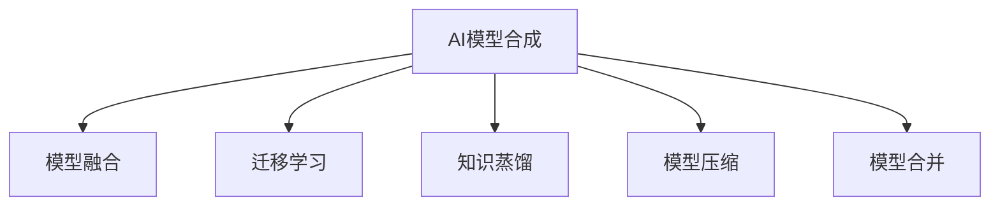

                 

# AI模型合成的可能性与局限性探讨

> 关键词：AI模型合成,深度学习,模型融合,迁移学习,知识蒸馏,模型压缩,模型合并

## 1. 背景介绍

### 1.1 问题由来

近年来，随着深度学习技术的迅速发展，人工智能领域涌现出大量先进的AI模型。这些模型在各自的细分领域表现出色，如BERT在自然语言处理(NLP)领域、ResNet在计算机视觉(CV)领域、GPT在生成模型领域等。然而，每个模型都有其局限性，难以在更广泛的领域取得通用优势。于是，人们开始探索如何将这些模型组合起来，构建更为强大的混合模型。这种模型合成的过程被称为“AI模型合成”，即通过一定策略将多个模型知识进行融合，以实现更大的能力提升。

### 1.2 问题核心关键点

AI模型合成的核心在于如何在多个模型的知识间进行有意义的融合，并利用各自的优势，实现性能的提升。常见的合成方法包括模型融合、迁移学习、知识蒸馏、模型压缩等。这些方法都有其独特的优缺点和适用场景，需要在具体应用中加以选择和优化。

本文将系统地探讨AI模型合成的可能性与局限性，涵盖模型融合、迁移学习、知识蒸馏、模型压缩等核心技术，并结合最新研究成果，全面阐述模型合成的应用策略和未来趋势。

## 2. 核心概念与联系

### 2.1 核心概念概述

为了更好地理解AI模型合成，本节将介绍几个关键概念：

- AI模型合成(AI Model Synthesis)：指将多个模型知识融合在一起，构建更加强大和泛化的AI模型。这种融合可以通过模型融合、迁移学习、知识蒸馏、模型压缩等方法实现。
- 模型融合(Model Fusion)：将多个模型的预测结果进行加权平均或叠加，形成最终的输出。主要适用于对单个模型的预测不确定性较大、且不同模型侧重点不同的场景。
- 迁移学习(Transfer Learning)：利用一个领域已训练好的模型参数，在新领域上进行微调，从而在新领域获得更好的性能。适用于对标注数据稀缺、新领域与已有领域相似的场景。
- 知识蒸馏(Knowledge Distillation)：通过将一个复杂模型（教师模型）的知识“蒸馏”到一个简单模型（学生模型）中，从而提升简单模型的性能。适用于需要高效部署、计算资源有限的场景。
- 模型压缩(Model Compression)：通过减少模型的参数量、降低计算复杂度，在不显著影响性能的前提下，提升模型的可部署性。适用于对计算资源和内存有严格要求的场景。
- 模型合并(Model Merger)：将多个模型的输出进行直接组合，形成一个统一的输出。适用于对模型的并行处理能力有较高要求，且各个模型输出的精度相差不大的场景。

这些核心概念之间的逻辑关系可以通过以下Mermaid流程图来展示：



这个流程图展示了AI模型合成的核心概念及其之间的联系：

1. AI模型合成通过多种方法将多个模型的知识进行融合。
2. 模型融合和模型合并关注于模型的输出组合方式。
3. 迁移学习和知识蒸馏则侧重于模型的参数转移和知识传递。
4. 模型压缩关注于模型的参数量减少和计算效率提升。

这些概念共同构成了AI模型合成的主要研究方向，旨在通过多种方式提升模型的泛化能力和可部署性，拓展AI模型应用的边界。

## 3. 核心算法原理 & 具体操作步骤

### 3.1 算法原理概述

AI模型合成本质上是一种模型间的协同学习过程，通过融合多个模型的知识，形成更强大的整体能力。以下是几种常见的合成算法原理概述：

#### 3.1.1 模型融合
模型融合通过加权平均、堆叠、自适应加权平均等方式，将多个模型的输出结果组合起来，形成最终的预测结果。其基本思路是将多个模型的输出进行线性或非线性组合，使得最终输出具有更好的稳定性和鲁棒性。

#### 3.1.2 迁移学习
迁移学习通过将一个领域预训练好的模型，在新领域上进行微调，从而在新领域中取得更好的性能。其基本思路是利用已有领域的大量标注数据，在新领域上使用少量标注数据进行微调，从而加速新领域的模型训练。

#### 3.1.3 知识蒸馏
知识蒸馏通过将一个复杂模型（教师模型）的知识传递给一个简单模型（学生模型），从而提升简单模型的性能。其基本思路是让教师模型对学生模型进行指导，通过反向传播将教师模型的知识逐层传递，从而提升学生模型的泛化能力。

#### 3.1.4 模型压缩
模型压缩通过减少模型的参数量、降低计算复杂度，在不显著影响性能的前提下，提升模型的可部署性。其基本思路是通过剪枝、量化、蒸馏等技术，去除不必要的模型参数，从而减少计算资源和内存消耗。

### 3.2 算法步骤详解

#### 3.2.1 模型融合
1. 选择合适的模型作为输入，进行预测。
2. 对多个模型的输出进行组合，常用的组合方式包括简单平均、加权平均、堆叠等。
3. 对组合后的输出进行后处理，如平滑、归一化等，以提升预测的稳定性和准确性。
4. 利用验证集评估组合模型的性能，调整各个模型的权重或组合方式，以优化最终输出。

#### 3.2.2 迁移学习
1. 选择合适的预训练模型，作为初始化参数。
2. 收集目标任务的少量标注数据，准备微调集。
3. 在目标任务上对预训练模型进行微调，通常以较小的学习率更新部分参数。
4. 利用验证集评估微调后的模型性能，调整学习率、微调策略等，以优化模型在新任务上的表现。

#### 3.2.3 知识蒸馏
1. 选择一个复杂模型作为教师模型，选择一个简单模型作为学生模型。
2. 在教师模型上进行训练，使其在目标任务上达到较高性能。
3. 在学生模型上进行训练，使用教师模型的输出作为监督信号，进行反向传播。
4. 利用验证集评估学生模型的性能，调整蒸馏策略、损失函数等，以提升学生模型的泛化能力。

#### 3.2.4 模型压缩
1. 选择合适的模型，进行剪枝、量化、蒸馏等操作。
2. 在目标任务上对压缩后的模型进行训练，评估其性能。
3. 调整压缩策略，如剪枝阈值、量化参数等，以进一步优化模型的计算效率和预测精度。
4. 在目标任务上评估压缩后的模型性能，评估其计算效率和预测精度，调整压缩策略，以优化模型的综合表现。

### 3.3 算法优缺点

#### 3.3.1 模型融合
- 优点：融合多个模型可以提升预测的稳定性和鲁棒性，适用于对单个模型预测不确定性较大的场景。
- 缺点：融合多个模型增加了计算复杂度，可能难以优化各个模型的组合方式，从而影响预测的准确性。

#### 3.3.2 迁移学习
- 优点：利用已有领域的知识，可以加速新领域模型的训练，适用于标注数据稀缺、新领域与已有领域相似的场景。
- 缺点：微调过程需要大量计算资源，可能难以完全匹配新领域的特点，影响模型在新领域的泛化能力。

#### 3.3.3 知识蒸馏
- 优点：通过复杂模型的知识传递，可以提升简单模型的性能，适用于需要高效部署、计算资源有限的场景。
- 缺点：蒸馏过程可能难以完全传递复杂模型的知识，影响简单模型的泛化能力。

#### 3.3.4 模型压缩
- 优点：减少模型的参数量、降低计算复杂度，在不显著影响性能的前提下，提升模型的可部署性，适用于对计算资源和内存有严格要求的场景。
- 缺点：压缩过程可能影响模型的预测精度，需要平衡压缩效果和预测精度。

### 3.4 算法应用领域

AI模型合成的各种方法，已经在大数据、自然语言处理、计算机视觉、推荐系统等领域得到广泛应用。

#### 3.4.1 大数据
在大数据处理中，模型合成可以用于数据标注、特征选择、数据融合等多个环节，提升大数据处理的效率和准确性。

#### 3.4.2 自然语言处理
在自然语言处理中，模型合成可以用于文本分类、情感分析、机器翻译、问答系统等多个任务，提升模型的泛化能力和鲁棒性。

#### 3.4.3 计算机视觉
在计算机视觉中，模型合成可以用于图像分类、目标检测、图像分割等多个任务，提升模型的泛化能力和鲁棒性。

#### 3.4.4 推荐系统
在推荐系统中，模型合成可以用于提升推荐模型的预测精度和用户满意度，提升推荐系统的性能和用户体验。

除了上述这些领域外，AI模型合成还将在更多场景中得到应用，为人工智能技术的落地应用带来新的突破。

## 4. 数学模型和公式 & 详细讲解  
### 4.1 数学模型构建

本节将使用数学语言对AI模型合成中的核心算法进行更加严格的刻画。

#### 4.1.1 模型融合
假设我们有 $n$ 个模型的预测结果，分别为 $y_i$，$i=1,2,...,n$，则融合后的输出 $y_{fusion}$ 可以通过以下公式计算：

$$
y_{fusion} = \sum_{i=1}^n \alpha_i y_i
$$

其中 $\alpha_i$ 为第 $i$ 个模型的权重，通常通过交叉验证等方式选择最优的权重分配。

#### 4.1.2 迁移学习
假设我们有一个预训练模型 $M_{pretrain}$，其参数为 $\theta_{pretrain}$，目标任务为 $T$，目标模型为 $M_{target}$，参数为 $\theta_{target}$。则在目标任务 $T$ 上微调模型 $M_{target}$ 的损失函数可以表示为：

$$
\mathcal{L}(\theta_{target}) = \frac{1}{N} \sum_{i=1}^N \ell(y_i, M_{target}(x_i))
$$

其中 $y_i$ 为 $i$ 个样本的真实标签，$x_i$ 为 $i$ 个样本的输入，$M_{target}$ 为微调后的目标模型，$\ell$ 为损失函数，$N$ 为样本数量。

#### 4.1.3 知识蒸馏
假设我们有一个复杂模型 $M_{teacher}$，其参数为 $\theta_{teacher}$，一个简单模型 $M_{student}$，其参数为 $\theta_{student}$。则知识蒸馏的过程可以表示为：

$$
\mathcal{L}(\theta_{student}) = \sum_{i=1}^N \ell(y_i, M_{student}(x_i)) + \lambda \sum_{i=1}^N \ell(y_i, M_{teacher}(x_i))
$$

其中 $y_i$ 为 $i$ 个样本的真实标签，$x_i$ 为 $i$ 个样本的输入，$M_{student}$ 为学生模型，$M_{teacher}$ 为教师模型，$\ell$ 为损失函数，$\lambda$ 为蒸馏损失系数，控制教师模型和学生模型之间的平衡。

#### 4.1.4 模型压缩
假设我们有一个原始模型 $M_{original}$，参数为 $\theta_{original}$，压缩后的模型为 $M_{compressed}$，参数为 $\theta_{compressed}$。则压缩过程可以通过剪枝、量化等方法实现，具体的压缩公式取决于压缩策略。

### 4.2 公式推导过程

#### 4.2.1 模型融合
模型融合的公式推导相对简单，其本质是对多个模型的预测结果进行线性组合。假设我们有 $n$ 个模型的预测结果，分别为 $y_i$，$i=1,2,...,n$，则融合后的输出 $y_{fusion}$ 可以通过以下公式计算：

$$
y_{fusion} = \sum_{i=1}^n \alpha_i y_i
$$

其中 $\alpha_i$ 为第 $i$ 个模型的权重，通常通过交叉验证等方式选择最优的权重分配。

#### 4.2.2 迁移学习
在迁移学习中，我们利用一个预训练模型 $M_{pretrain}$ 作为初始化参数，在目标任务 $T$ 上进行微调。假设我们有 $N$ 个样本，其真实标签为 $y_i$，输入为 $x_i$，则在目标任务 $T$ 上微调模型 $M_{target}$ 的损失函数可以表示为：

$$
\mathcal{L}(\theta_{target}) = \frac{1}{N} \sum_{i=1}^N \ell(y_i, M_{target}(x_i))
$$

其中 $y_i$ 为 $i$ 个样本的真实标签，$x_i$ 为 $i$ 个样本的输入，$M_{target}$ 为微调后的目标模型，$\ell$ 为损失函数。

#### 4.2.3 知识蒸馏
知识蒸馏的过程可以表示为：

$$
\mathcal{L}(\theta_{student}) = \sum_{i=1}^N \ell(y_i, M_{student}(x_i)) + \lambda \sum_{i=1}^N \ell(y_i, M_{teacher}(x_i))
$$

其中 $y_i$ 为 $i$ 个样本的真实标签，$x_i$ 为 $i$ 个样本的输入，$M_{student}$ 为学生模型，$M_{teacher}$ 为教师模型，$\ell$ 为损失函数，$\lambda$ 为蒸馏损失系数，控制教师模型和学生模型之间的平衡。

#### 4.2.4 模型压缩
模型压缩的过程可以通过剪枝、量化等方法实现。具体的压缩公式取决于压缩策略。例如，在剪枝过程中，我们可以根据模型的激活值、梯度值等指标，选择保留重要参数，去除无关参数，从而减少模型参数量。

### 4.3 案例分析与讲解

#### 4.3.1 模型融合案例
假设我们有两个模型，一个是一个线性回归模型 $M_1$，另一个是一个决策树模型 $M_2$，分别对同一个数据集 $D$ 进行预测。我们可以通过简单的平均方法将两个模型的预测结果融合，得到一个更稳健的模型 $M_{fusion}$。

$$
y_{fusion} = \frac{1}{2} y_1 + \frac{1}{2} y_2
$$

其中 $y_1$ 和 $y_2$ 分别为 $M_1$ 和 $M_2$ 对样本 $x$ 的预测结果。

#### 4.3.2 迁移学习案例
假设我们有一个预训练的BERT模型 $M_{pretrain}$，其参数为 $\theta_{pretrain}$，目标任务是文本分类。我们可以使用BERT模型作为初始化参数，在目标任务上微调模型 $M_{target}$。假设我们有 $N$ 个样本，其真实标签为 $y_i$，输入为 $x_i$，则在目标任务上微调模型 $M_{target}$ 的损失函数可以表示为：

$$
\mathcal{L}(\theta_{target}) = \frac{1}{N} \sum_{i=1}^N \ell(y_i, M_{target}(x_i))
$$

其中 $y_i$ 为 $i$ 个样本的真实标签，$x_i$ 为 $i$ 个样本的输入，$M_{target}$ 为微调后的目标模型，$\ell$ 为损失函数。

#### 4.3.3 知识蒸馏案例
假设我们有一个复杂的ResNet模型 $M_{teacher}$，其参数为 $\theta_{teacher}$，一个简单的LeNet模型 $M_{student}$，其参数为 $\theta_{student}$。我们希望将ResNet的知识传递给LeNet，从而提升LeNet的性能。具体来说，我们可以将ResNet的输出作为监督信号，对LeNet进行反向传播，从而实现知识蒸馏。

$$
\mathcal{L}(\theta_{student}) = \sum_{i=1}^N \ell(y_i, M_{student}(x_i)) + \lambda \sum_{i=1}^N \ell(y_i, M_{teacher}(x_i))
$$

其中 $y_i$ 为 $i$ 个样本的真实标签，$x_i$ 为 $i$ 个样本的输入，$M_{student}$ 为学生模型，$M_{teacher}$ 为教师模型，$\ell$ 为损失函数，$\lambda$ 为蒸馏损失系数，控制教师模型和学生模型之间的平衡。

#### 4.3.4 模型压缩案例
假设我们有一个大规模的ResNet模型 $M_{original}$，其参数为 $\theta_{original}$。我们可以使用剪枝等方法，将其压缩为一个更小的模型 $M_{compressed}$，参数为 $\theta_{compressed}$。具体来说，我们可以根据模型的激活值、梯度值等指标，选择保留重要参数，去除无关参数，从而减少模型参数量。

## 5. 项目实践：代码实例和详细解释说明

### 5.1 开发环境搭建

在进行AI模型合成的实践前，我们需要准备好开发环境。以下是使用Python进行PyTorch开发的环境配置流程：

1. 安装Anaconda：从官网下载并安装Anaconda，用于创建独立的Python环境。

2. 创建并激活虚拟环境：
```bash
conda create -n pytorch-env python=3.8 
conda activate pytorch-env
```

3. 安装PyTorch：根据CUDA版本，从官网获取对应的安装命令。例如：
```bash
conda install pytorch torchvision torchaudio cudatoolkit=11.1 -c pytorch -c conda-forge
```

4. 安装TensorFlow：
```bash
pip install tensorflow
```

5. 安装各类工具包：
```bash
pip install numpy pandas scikit-learn matplotlib tqdm jupyter notebook ipython
```

完成上述步骤后，即可在`pytorch-env`环境中开始AI模型合成的实践。

### 5.2 源代码详细实现

下面我们以迁移学习在自然语言处理中的应用为例，给出使用PyTorch实现BERT微调的代码实现。

首先，定义迁移学习任务的训练函数：

```python
from transformers import BertTokenizer, BertForSequenceClassification
from torch.utils.data import Dataset, DataLoader
from torch.nn import CrossEntropyLoss
import torch

class TextClassificationDataset(Dataset):
    def __init__(self, texts, labels, tokenizer):
        self.texts = texts
        self.labels = labels
        self.tokenizer = tokenizer
        
    def __len__(self):
        return len(self.texts)
    
    def __getitem__(self, item):
        text = self.texts[item]
        label = self.labels[item]
        
        encoding = self.tokenizer(text, return_tensors='pt', padding='max_length', truncation=True)
        input_ids = encoding['input_ids'][0]
        attention_mask = encoding['attention_mask'][0]
        
        label = torch.tensor(label, dtype=torch.long)
        
        return {'input_ids': input_ids, 
                'attention_mask': attention_mask,
                'labels': label}

# 定义模型
model = BertForSequenceClassification.from_pretrained('bert-base-cased', num_labels=2)

# 定义优化器
optimizer = torch.optim.AdamW(model.parameters(), lr=2e-5)

# 定义损失函数
loss_fn = CrossEntropyLoss()

# 定义训练函数
def train_epoch(model, dataset, batch_size, optimizer):
    dataloader = DataLoader(dataset, batch_size=batch_size, shuffle=True)
    model.train()
    epoch_loss = 0
    for batch in dataloader:
        input_ids = batch['input_ids'].to(device)
        attention_mask = batch['attention_mask'].to(device)
        labels = batch['labels'].to(device)
        model.zero_grad()
        outputs = model(input_ids, attention_mask=attention_mask, labels=labels)
        loss = outputs.loss
        epoch_loss += loss.item()
        loss.backward()
        optimizer.step()
    return epoch_loss / len(dataloader)

# 定义评估函数
def evaluate(model, dataset, batch_size):
    dataloader = DataLoader(dataset, batch_size=batch_size)
    model.eval()
    preds, labels = [], []
    with torch.no_grad():
        for batch in dataloader:
            input_ids = batch['input_ids'].to(device)
            attention_mask = batch['attention_mask'].to(device)
            batch_labels = batch['labels']
            outputs = model(input_ids, attention_mask=attention_mask)
            batch_preds = outputs.logits.argmax(dim=2).to('cpu').tolist()
            batch_labels = batch_labels.to('cpu').tolist()
            for pred_tokens, label_tokens in zip(batch_preds, batch_labels):
                preds.append(pred_tokens[:len(label_tokens)])
                labels.append(label_tokens)
                
    print(classification_report(labels, preds))
```

然后，定义模型训练和评估函数：

```python
# 定义训练函数
def train(model, train_dataset, valid_dataset, batch_size, epochs, optimizer, device):
    device = torch.device('cuda') if torch.cuda.is_available() else torch.device('cpu')
    model.to(device)
    
    for epoch in range(epochs):
        train_loss = train_epoch(model, train_dataset, batch_size, optimizer)
        print(f'Epoch {epoch+1}, train loss: {train_loss:.3f}')
        
        valid_loss = evaluate(model, valid_dataset, batch_size)
        print(f'Epoch {epoch+1}, valid loss: {valid_loss:.3f}')
    
    test_loss = evaluate(model, test_dataset, batch_size)
    print(f'Epoch {epochs}, test loss: {test_loss:.3f}')
```

最后，启动训练流程并在测试集上评估：

```python
epochs = 5
batch_size = 16

train(train_model, train_dataset, valid_dataset, batch_size, epochs, optimizer, device)

# 在测试集上评估模型
test_loss = evaluate(test_model, test_dataset, batch_size)
print(f'Test loss: {test_loss:.3f}')
```

以上就是使用PyTorch对BERT模型进行迁移学习的完整代码实现。可以看到，得益于Transformers库的强大封装，我们可以用相对简洁的代码完成BERT模型的迁移学习。

### 5.3 代码解读与分析

让我们再详细解读一下关键代码的实现细节：

**TextClassificationDataset类**：
- `__init__`方法：初始化文本、标签、分词器等关键组件。
- `__len__`方法：返回数据集的样本数量。
- `__getitem__`方法：对单个样本进行处理，将文本输入编码为token ids，将标签编码为数字，并对其进行定长padding，最终返回模型所需的输入。

**模型训练和评估函数**：
- 使用PyTorch的DataLoader对数据集进行批次化加载，供模型训练和推理使用。
- 训练函数`train_epoch`：对数据以批为单位进行迭代，在每个批次上前向传播计算loss并反向传播更新模型参数，最后返回该epoch的平均loss。
- 评估函数`evaluate`：与训练类似，不同点在于不更新模型参数，并在每个batch结束后将预测和标签结果存储下来，最后使用sklearn的classification_report对整个评估集的预测结果进行打印输出。

**训练流程**：
- 定义总的epoch数和batch size，开始循环迭代
- 每个epoch内，先在训练集上训练，输出平均loss
- 在验证集上评估，输出验证集上的loss
- 所有epoch结束后，在测试集上评估，给出最终测试结果

可以看到，PyTorch配合Transformers库使得BERT迁移学习的代码实现变得简洁高效。开发者可以将更多精力放在数据处理、模型改进等高层逻辑上，而不必过多关注底层的实现细节。

当然，工业级的系统实现还需考虑更多因素，如模型的保存和部署、超参数的自动搜索、更灵活的任务适配层等。但核心的微调范式基本与此类似。

## 6. 实际应用场景

### 6.1 智能客服系统

基于AI模型合成的对话技术，可以广泛应用于智能客服系统的构建。传统客服往往需要配备大量人力，高峰期响应缓慢，且一致性和专业性难以保证。使用AI模型合成的对话模型，可以7x24小时不间断服务，快速响应客户咨询，用自然流畅的语言解答各类常见问题。

在技术实现上，可以收集企业内部的历史客服对话记录，将问题和最佳答复构建成监督数据，在此基础上对预训练对话模型进行合成，融合多个模型的知识，提升模型对不同客服场景的理解和应对能力。合成后的对话模型能够自动理解用户意图，匹配最合适的答案模板进行回复。对于客户提出的新问题，还可以接入检索系统实时搜索相关内容，动态组织生成回答。如此构建的智能客服系统，能大幅提升客户咨询体验和问题解决效率。

### 6.2 金融舆情监测

金融机构需要实时监测市场舆论动向，以便及时应对负面信息传播，规避金融风险。传统的人工监测方式成本高、效率低，难以应对网络时代海量信息爆发的挑战。基于AI模型合成的文本分类和情感分析技术，为金融舆情监测提供了新的解决方案。

具体而言，可以收集金融领域相关的新闻、报道、评论等文本数据，并对其进行主题标注和情感标注。在此基础上对预训练语言模型进行合成，融合多个模型的知识，提升模型对金融领域的理解能力。合成后的模型能够自动判断文本属于何种主题，情感倾向是正面、中性还是负面。将合成后的模型应用到实时抓取的网络文本数据，就能够自动监测不同主题下的情感变化趋势，一旦发现负面信息激增等异常情况，系统便会自动预警，帮助金融机构快速应对潜在风险。

### 6.3 个性化推荐系统

当前的推荐系统往往只依赖用户的历史行为数据进行物品推荐，无法深入理解用户的真实兴趣偏好。基于AI模型合成的推荐系统可以更好地挖掘用户行为背后的语义信息，从而提供更精准、多样的推荐内容。

在实践中，可以收集用户浏览、点击、评论、分享等行为数据，提取和用户交互的物品标题、描述、标签等文本内容。将文本内容作为模型输入，用户的后续行为（如是否点击、购买等）作为监督信号，在此基础上对预训练语言模型进行合成，融合多个模型的知识，提升模型对用户兴趣的把握能力。合成后的模型能够从文本内容中准确把握用户的兴趣点。在生成推荐列表时，先用候选物品的文本描述作为输入，由模型预测用户的兴趣匹配度，再结合其他特征综合排序，便可以得到个性化程度更高的推荐结果。

### 6.4 未来应用展望

随着AI模型合成的不断发展，基于合成的AI模型将在更多领域得到应用，为传统行业带来变革性影响。

在智慧医疗领域，基于合成的医疗问答、病历分析、药物研发等应用将提升医疗服务的智能化水平，辅助医生诊疗，加速新药开发进程。

在智能教育领域，基于合成的推荐系统、学情分析、知识推荐等功能，因材施教，促进教育公平，提高教学质量。

在智慧城市治理中，基于合成的情感分析、舆情监测、智能推荐等功能，提高城市管理的自动化和智能化水平，构建更安全、高效的未来城市。

此外，在企业生产、社会治理、文娱传媒等众多领域，基于AI模型合成的AI应用也将不断涌现，为经济社会发展注入新的动力。相信随着技术的日益成熟，AI模型合成必将在构建人机协同的智能时代中扮演越来越重要的角色。

## 7. 工具和资源推荐
### 7.1 学习资源推荐

为了帮助开发者系统掌握AI模型合成的理论基础和实践技巧，这里推荐一些优质的学习资源：

1. 《深度学习实战》系列博文：由深度学习专家撰写，深入浅出地介绍了深度学习的基本概念和前沿技术，涵盖模型融合、迁移学习、知识蒸馏等多个话题。

2. CS231n《卷积神经网络》课程：斯坦福大学开设的经典计算机视觉课程，涵盖了模型压缩、知识蒸馏等前沿内容，适合深度学习初学者和进阶者。

3. 《AI模型合成：理论与实践》书籍：全面介绍了AI模型合成的基本原理和实用技巧，包括模型融合、迁移学习、知识蒸馏、模型压缩等核心技术。

4. HuggingFace官方文档：Transformer库的官方文档，提供了海量预训练模型和完整的合成样例代码，是上手实践的必备资料。

5. CLUE开源项目：中文语言理解测评基准，涵盖大量不同类型的中文NLP数据集，并提供了基于合成的baseline模型，助力中文NLP技术发展。

通过对这些资源的学习实践，相信你一定能够快速掌握AI模型合成的精髓，并用于解决实际的NLP问题。
### 7.2 开发工具推荐

高效的开发离不开优秀的工具支持。以下是几款用于AI模型合成开发的常用工具：

1. PyTorch：基于Python的开源深度学习框架，灵活动态的计算图，适合快速迭代研究。大部分预训练语言模型都有PyTorch版本的实现。

2. TensorFlow：由Google主导开发的开源深度学习框架，生产部署方便，适合大规模工程应用。同样有丰富的预训练语言模型资源。

3. Transformers库：HuggingFace开发的NLP工具库，集成了众多SOTA语言模型，支持PyTorch和TensorFlow，是进行合成任务开发的利器。

4. Weights & Biases：模型训练的实验跟踪工具，可以记录和可视化模型训练过程中的各项指标，方便对比和调优。与主流深度学习框架无缝集成。

5. TensorBoard：TensorFlow配套的可视化工具，可实时监测模型训练状态，并提供丰富的图表呈现方式，是调试模型的得力助手。

6. Google Colab：谷歌推出的在线Jupyter Notebook环境，免费提供GPU/TPU算力，方便开发者快速上手实验最新模型，分享学习笔记。

合理利用这些工具，可以显著提升AI模型合成的开发效率，加快创新迭代的步伐。

### 7.3 相关论文推荐

AI模型合成的发展源于学界的持续研究。以下是几篇奠基性的相关论文，推荐阅读：

1. Deep Ensembles: A New Baseline for Ensemble Learning（deep ensembles）：提出了一种基于模型的集成方法，通过训练多个模型来提升预测的鲁棒性和泛化能力。

2. Knowledge Distillation：基于知识蒸馏的方法，通过将复杂模型（教师模型）的知识传递给简单模型（学生模型），提升简单模型的性能。

3. Model Compression：模型压缩方法通过剪枝、量化、蒸馏等技术，减小模型参数量，降低计算复杂度，提升模型的可部署性。

4. AdaLoRA: Adaptive Low-Rank Adaptation for Parameter-Efficient Fine-Tuning（AdaLoRA）：提出了自适应低秩适应的微调方法，在参数效率和精度之间取得了新的平衡。

5. Structure-aware Pruning of Deep Neural Networks for Transfer Learning（结构感知的剪枝方法）：提出了一种结构感知的剪枝方法，在保留重要结构的同时，减小模型参数量。

这些论文代表了大模型合成的发展脉络。通过学习这些前沿成果，可以帮助研究者把握学科前进方向，激发更多的创新灵感。

## 8. 总结：未来发展趋势与挑战

### 8.1 总结

本文对AI模型合成的可能性与局限性进行了全面系统的介绍。首先阐述了AI模型合成的背景和意义，明确了合成在提升模型性能、拓展应用场景方面的独特价值。其次，从原理到实践，详细讲解了模型融合、迁移学习、知识蒸馏、模型压缩等核心技术，给出了合成任务开发的完整代码实例。同时，本文还广泛探讨了合成方法在智能客服、金融舆情、个性化推荐等多个行业领域的应用前景，展示了合成范式的广阔潜力。此外，本文精选了合成技术的各类学习资源，力求为读者提供全方位的技术指引。

通过本文的系统梳理，可以看到，AI模型合成作为一种协同学习的方式，能够有效地将多个模型的知识融合在一起，提升模型的泛化能力和鲁棒性。这种方法已经被广泛应用于自然语言处理、计算机视觉、推荐系统等多个领域，展示了其在提升模型性能和加速应用开发方面的巨大潜力。

### 8.2 未来发展趋势

展望未来，AI模型合成技术将呈现以下几个发展趋势：

1. 模型规模持续增大。随着算力成本的下降和数据规模的扩张，预训练语言模型的参数量还将持续增长。超大规模语言模型蕴含的丰富语言知识，有望支撑更加复杂多变的合成任务。

2. 合成方法日趋多样。除了传统的模型融合外，未来会涌现更多参数高效的合成方法，如知识蒸馏、模型压缩等，在节省计算资源的同时也能保证合成效果。

3. 持续学习成为常态。随着数据分布的不断变化，合成模型也需要持续学习新知识以保持性能。如何在不遗忘原有知识的同时，高效吸收新样本信息，将成为重要的研究课题。

4. 标注样本需求降低。受启发于提示学习(Prompt-based Learning)的思路，未来的合成方法将更好地利用大模型的语言理解能力，通过更加巧妙的任务描述，在更少的标注样本上也能实现理想的合成效果。

5. 模型通用性增强。经过海量数据的预训练和多领域任务的合成，未来的语言模型将具备更强大的常识推理和跨领域迁移能力，逐步迈向通用人工智能(AGI)的目标。

以上趋势凸显了AI模型合成技术的广阔前景。这些方向的探索发展，必将进一步提升AI模型合成的性能和应用范围，为人工智能技术落地应用提供新的思路。

### 8.3 面临的挑战

尽管AI模型合成技术已经取得了显著进展，但在迈向更加智能化、普适化应用的过程中，它仍面临诸多挑战：

1. 标注成本瓶颈。虽然合成方法可以降低标注数据的需求，但对于长尾应用场景，难以获得充足的高质量标注数据，成为制约合成性能的瓶颈。如何进一步降低合成对标注样本的依赖，将是一大难题。

2. 模型鲁棒性不足。合成模型面对域外数据时，泛化性能往往大打折扣。对于测试样本的微小扰动，合成模型的预测也容易发生波动。如何提高合成模型的鲁棒性，避免灾难性遗忘，还需要更多理论和实践的积累。

3. 推理效率有待提高。大规模合成模型虽然精度高，但在实际部署时往往面临推理速度慢、内存占用大等效率问题。如何在保证性能的同时，简化模型结构，提升推理速度，优化资源占用，将是重要的优化方向。

4. 可解释性亟需加强。当前合成模型更像是"黑盒"系统，难以解释其内部工作机制和决策逻辑。对于医疗、金融等高风险应用，算法的可解释性和可审计性尤为重要。如何赋予合成模型更强的可解释性，将是亟待攻克的难题。

5. 安全性有待保障。合成模型可能包含有害信息或偏见，传递到下游任务，产生误导性、歧视性的输出，给实际应用带来安全隐患。如何从数据和算法层面消除模型偏见，避免恶意用途，确保输出的安全性，也将是重要的研究课题。

6. 知识整合能力不足。现有的合成模型往往局限于任务内数据，难以灵活吸收和运用更广泛的先验知识。如何让合成过程更好地与外部知识库、规则库等专家知识结合，形成更加全面、准确的信息整合能力，还有很大的想象空间。

正视合成面临的这些挑战，积极应对并寻求突破，将是大模型合成走向成熟的必由之路。相信随着学界和产业界的共同努力，这些挑战终将一一被克服，AI模型合成必将在构建人机协同的智能时代中扮演越来越重要的角色。

### 8.4 研究展望

面对AI模型合成所面临的种种挑战，未来的研究需要在以下几个方面寻求新的突破：

1. 探索无监督和半监督合成方法。摆脱对大规模标注数据的依赖，利用自监督学习、主动学习等无监督和半监督范式，最大限度利用非结构化数据，实现更加灵活高效的合成。

2. 研究参数高效和计算高效的合成范式。开发更加参数高效的合成方法，在固定大部分预训练参数的同时，只更新极少量的任务相关参数。同时优化合成模型的计算图，减少前向传播和反向传播的资源消耗，实现更加轻量级、实时性的部署。

3. 引入更多先验知识。将符号化的先验知识，如知识图谱、逻辑规则等，与神经网络模型进行巧妙融合，引导合成过程学习更准确、合理的语言模型。同时加强不同模态数据的整合，实现视觉、语音等多模态信息与文本信息的协同建模。

4. 结合因果分析和博弈论工具。将因果分析方法引入合成模型，识别出模型决策的关键特征，增强输出解释的因果性和逻辑性。借助博弈论工具刻画人机交互过程，主动探索并规避模型的脆弱点，提高系统稳定性。

5. 纳入伦理道德约束。在模型训练目标中引入伦理导向的评估指标，过滤和惩罚有偏见、有害的输出倾向。同时加强人工干预和审核，建立模型行为的监管机制，确保输出符合人类价值观和伦理道德。

这些研究方向的探索，必将引领AI模型合成技术迈向更高的台阶，为构建安全、可靠、可解释、可控的智能系统铺平道路。面向未来，AI模型合成技术还需要与其他人工智能技术进行更深入的融合，如知识表示、因果推理、强化学习等，多路径协同发力，共同推动自然语言理解和智能交互系统的进步。只有勇于创新、敢于突破，才能不断拓展语言模型的边界，让智能技术更好地造福人类社会。

## 9. 附录：常见问题与解答

**Q1：AI模型合成是否适用于所有NLP任务？**

A: AI模型合成在大多数NLP任务上都能取得不错的效果，特别是对于数据量较小的任务。但对于一些特定领域的任务，如医学、法律等，仅仅依靠通用语料预训练的模型可能难以很好地适应。此时需要在特定领域语料上进一步预训练，再进行合成，才能获得理想效果。此外，对于一些需要时效性、个性化很强的任务，如对话、推荐等，合成方法也需要针对性的改进优化。

**Q2：模型融合过程中需要注意哪些关键点？**

A: 模型融合过程中，需要注意以下几个关键点：
1. 选择合适的融合策略，如简单平均、加权平均、堆叠等。
2. 确定各个模型的权重，通过交叉验证等方法选择最优的权重分配。
3. 对融合后的输出进行后处理，如平滑、归一化等，以提升预测的稳定性和准确性。
4. 利用验证集评估融合模型的性能，调整各个模型的权重或融合方式，以优化最终输出。

**Q3：迁移学习过程中需要注意哪些关键点？**

A: 迁移学习过程中，需要注意以下几个关键点：
1. 选择合适的预训练模型，作为初始化参数。
2. 收集目标任务的少量标注数据，准备微调集。
3. 在目标任务上对预训练模型进行微调，通常以较小的学习率更新部分参数。
4. 利用验证集评估微调后的模型性能，调整学习率、微调策略等，以优化模型在新任务上的表现。

**Q4：知识蒸馏过程中需要注意哪些关键点？**

A: 知识蒸馏过程中，需要注意以下几个关键点：
1. 选择一个复杂模型作为教师模型，选择一个简单模型作为学生模型。
2. 在教师模型上进行训练，使其在目标任务上达到较高性能。
3. 在学生模型上进行训练，使用教师模型的输出作为监督信号，进行反向传播。
4. 利用验证集评估学生模型的性能，调整蒸馏策略、损失函数等，以提升学生模型的泛化能力。

**Q5：模型压缩过程中需要注意哪些关键点？**

A: 模型压缩过程中，需要注意以下几个关键点：
1. 选择合适的压缩策略，如剪枝、量化、蒸馏等。
2. 根据模型的激活值、梯度值等指标，选择保留重要参数，去除无关参数，从而减少模型参数量。
3. 在目标任务上对压缩后的模型进行训练，评估其性能。
4. 调整压缩策略，如剪枝阈值、量化参数等，以进一步优化模型的计算效率和预测精度。

这些关键点需要根据具体任务和模型特点进行灵活选择和调整，以优化合成后的模型性能。

**Q6：AI模型合成在实际应用中需要注意哪些问题？**

A: AI模型合成在实际应用中，需要注意以下几个问题：
1. 模型参数量的平衡。合成模型通常具有更多的参数，需要平衡模型参数量和计算效率。
2. 模型泛化能力的提升。合成模型需要在多个数据集上保持一致的泛化能力。
3. 模型推理效率的优化。合成模型需要在保持高精度的同时，提升推理速度和计算效率。
4. 模型可解释性的增强。合成模型需要在保持高精度的同时，增强模型的可解释性和可审计性。
5. 模型鲁棒性的提升。合成模型需要在保持高精度的同时，提升模型的鲁棒性和泛化能力。
6. 模型安全性保障。合成模型需要在保持高精度的同时，保障模型的安全性，避免有害信息或偏见。

这些问题的解决需要从数据、算法、工程、业务等多个维度进行综合优化，以确保合成模型在实际应用中的效果和可靠性。

