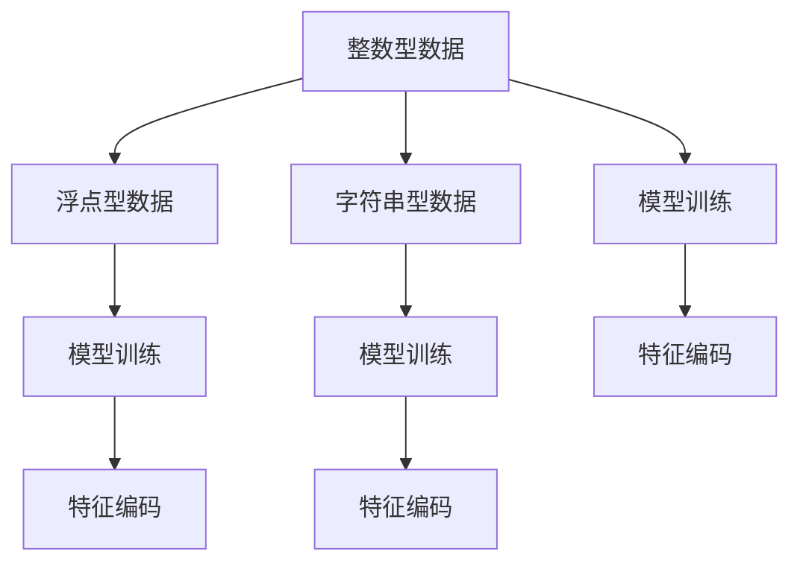

                 

## 1. 背景介绍

在人工智能模型训练中，数据类型的选择和处理是一项基础而重要的任务。不同类型的数据对模型的训练过程有着显著的影响。本文将深入探讨在AI模型训练中常用的数据类型，包括整数(integer)、浮点数(float)和字符串(string)，及其编码方式。通过对这些数据类型的全面分析，我们希望能够帮助读者更好地理解模型训练中数据处理的策略，从而提高模型性能和训练效率。

## 2. 核心概念与联系

### 2.1 核心概念概述

在机器学习和深度学习模型训练中，数据是输入和输出的基础。数据类型的选择不仅影响模型的计算效率，还直接关系到模型的表现。以下是几个核心概念的概述：

- **整数型数据**：整数型数据（Integer）是指能够表示非负整数的数值类型。在模型训练中，整数型数据通常用于表示类别标签、索引等离散型信息。

- **浮点型数据**：浮点型数据（Float）是指能够表示实数的数值类型，包括单精度浮点数（float）和双精度浮点数（double）。在模型训练中，浮点型数据用于表示连续型变量的值，如特征向量、目标函数等。

- **字符串型数据**：字符串型数据（String）是指由字符序列组成的数据类型。在自然语言处理（NLP）领域，字符串型数据通常用于表示文本信息。

这些数据类型在模型训练中具有不同的作用，需要通过不同的编码方式进行处理。

### 2.2 核心概念原理和架构的 Mermaid 流程图



这个流程图展示了不同数据类型在模型训练中的处理流程。整数型、浮点型和字符串型数据分别通过特征编码进行处理，最终作为输入数据参与模型训练。

## 3. 核心算法原理 & 具体操作步骤

### 3.1 算法原理概述

在AI模型训练中，数据类型的编码主要是为了将不同类型的数据转换为模型能够处理的数值形式。不同数据类型的编码方式也决定了模型训练的效率和性能。以下是几种常见的数据类型编码方式：

- **整数型数据编码**：整数型数据通常通过独热编码(One-Hot Encoding)和标签编码(Label Encoding)等方式进行编码。
- **浮点型数据编码**：浮点型数据可以直接作为输入特征，但有时为了提高计算效率，会进行标准化(Standardization)和归一化(Normalization)等操作。
- **字符串型数据编码**：字符串型数据一般通过词袋模型(Bag of Words, BoW)、词嵌入(Word Embedding)和字符嵌入(Character Embedding)等方式进行编码。

### 3.2 算法步骤详解

以下是针对不同数据类型的编码步骤详解：

#### 3.2.1 整数型数据编码

整数型数据通常用于表示离散型标签或索引。常用的编码方式包括独热编码和标签编码：

- **独热编码(One-Hot Encoding)**：将整数型数据转换为独热向量，其中每个类别对应的向量中，只有一个元素为1，其余为0。例如，类别为3的样本，其独热向量为[0, 0, 1, 0]。
- **标签编码(Label Encoding)**：将整数型数据直接作为标签进行编码，即类别编号对应到模型中的某一节点。例如，类别为3的样本，其标签编码为3。

#### 3.2.2 浮点型数据编码

浮点型数据直接作为输入特征，但有时需要进行标准化和归一化处理：

- **标准化(Standardization)**：将数据缩放到均值为0，方差为1的标准正态分布。公式为：
  $$
  X' = \frac{X - \mu}{\sigma}
  $$
  其中，$X$ 为原始数据，$X'$ 为标准化后的数据，$\mu$ 和 $\sigma$ 分别为原始数据的均值和标准差。
- **归一化(Normalization)**：将数据缩放到[0, 1]或[-1, 1]的范围内。公式为：
  $$
  X' = \frac{X - \min(X)}{\max(X) - \min(X)}
  $$

#### 3.2.3 字符串型数据编码

字符串型数据通常用于表示文本信息，常用的编码方式包括词袋模型和词嵌入：

- **词袋模型(Bag of Words, BoW)**：将文本转换为词频向量，每个词对应一个维度，出现次数为向量值。例如，文本"hello world"转换为[1, 1, 0, 0, 0]。
- **词嵌入(Word Embedding)**：将单词映射到低维向量空间，通常使用词嵌入矩阵表示。例如，单词"hello"和"world"映射到向量空间后，可以通过矩阵乘法得到它们的向量表示。
- **字符嵌入(Character Embedding)**：将文本转换为字符级别的嵌入，例如将单词"hello"转换为向量[0, 1, 0, 0, 0, 1, 0, 0]。

### 3.3 算法优缺点

不同数据类型的编码方式具有各自的优缺点：

#### 3.3.1 整数型数据编码

- **优点**：简单、直观，适用于表示离散型数据。
- **缺点**：需要更多的存储空间，且编码方式可能会影响模型性能。

#### 3.3.2 浮点型数据编码

- **优点**：数据更稀疏，计算效率高，适用于表示连续型数据。
- **缺点**：需要标准化和归一化处理，且可能存在数值稳定性问题。

#### 3.3.3 字符串型数据编码

- **优点**：能够有效处理文本数据，捕捉到单词和字符级别的特征。
- **缺点**：编码复杂，需要选择合适的词嵌入或字符嵌入方法，且处理过程中可能存在维度灾难问题。

### 3.4 算法应用领域

不同的数据类型编码方式在多个领域中有着广泛的应用：

- **自然语言处理(NLP)**：在NLP中，字符串型数据（文本）常用于词袋模型、词嵌入和字符嵌入等编码方式。
- **计算机视觉(CV)**：在CV中，浮点型数据（像素值）直接作为输入特征，通常需要进行标准化和归一化处理。
- **推荐系统(Recommender System)**：在推荐系统中，整数型数据（用户和商品ID）常用于表示用户和商品的标签，浮点型数据（评分）常用于表示用户对商品的评分。

## 4. 数学模型和公式 & 详细讲解 & 举例说明

### 4.1 数学模型构建

在AI模型训练中，数据类型的编码主要通过数学模型进行构建。以下是一个简单的示例，展示了如何使用数学模型对数据进行编码：

- **独热编码(One-Hot Encoding)**：假设有一个整数型数据集 $X = \{1, 2, 3, 4\}$，独热编码为：
  $$
  \begin{bmatrix}
  1 & 0 & 0 & 0 \\
  0 & 1 & 0 & 0 \\
  0 & 0 & 1 & 0 \\
  0 & 0 & 0 & 1 \\
  \end{bmatrix}
  $$
- **标准化(Standardization)**：假设有一个浮点型数据集 $X = \{1, 2, 3, 4\}$，标准化为：
  $$
  \frac{\{1, 2, 3, 4\} - 2.5}{0.5} = \{-1, 0, 1, 2\}
  $$
- **词嵌入(Word Embedding)**：假设有一个字符串型数据集 $\text{"hello", "world", "python"}$，使用词嵌入矩阵 $W = \begin{bmatrix} w_1 \\ w_2 \\ w_3 \end{bmatrix}$，则编码结果为：
  $$
  \begin{bmatrix} w_1 \\ w_2 \\ w_3 \end{bmatrix} \begin{bmatrix} 1 \\ 1 \\ 0 \end{bmatrix} = \begin{bmatrix} w_1 \\ w_2 \\ w_3 \end{bmatrix}
  $$

### 4.2 公式推导过程

以下是几种常见的数据类型编码公式推导过程：

#### 4.2.1 独热编码(One-Hot Encoding)

假设有一个整数型数据集 $X = \{1, 2, 3, 4\}$，独热编码为：
$$
X' = \begin{bmatrix}
1 & 0 & 0 & 0 \\
0 & 1 & 0 & 0 \\
0 & 0 & 1 & 0 \\
0 & 0 & 0 & 1 \\
\end{bmatrix}
$$

#### 4.2.2 标准化(Standardization)

假设有一个浮点型数据集 $X = \{1, 2, 3, 4\}$，标准化为：
$$
X' = \frac{\{1, 2, 3, 4\} - 2.5}{0.5} = \{-1, 0, 1, 2\}
$$

#### 4.2.3 词嵌入(Word Embedding)

假设有一个字符串型数据集 $\text{"hello", "world", "python"}$，使用词嵌入矩阵 $W = \begin{bmatrix} w_1 \\ w_2 \\ w_3 \end{bmatrix}$，则编码结果为：
$$
\begin{bmatrix} w_1 \\ w_2 \\ w_3 \end{bmatrix} \begin{bmatrix} 1 \\ 1 \\ 0 \end{bmatrix} = \begin{bmatrix} w_1 \\ w_2 \\ w_3 \end{bmatrix}
$$

### 4.3 案例分析与讲解

假设有一个包含用户ID和商品ID的整数型数据集，需要进行标签编码和独热编码：

- **标签编码**：假设用户ID和商品ID分别为1和2，标签编码为[1, 2]。
- **独热编码**：假设用户ID和商品ID分别为1和2，独热编码为：
  $$
  \begin{bmatrix}
  1 & 0 \\
  0 & 1 \\
  \end{bmatrix}
  $$

## 5. 项目实践：代码实例和详细解释说明

### 5.1 开发环境搭建

以下是使用Python和TensorFlow进行数据类型编码的开发环境搭建步骤：

1. 安装Anaconda：从官网下载并安装Anaconda，用于创建独立的Python环境。
2. 创建并激活虚拟环境：
  ```bash
  conda create -n pytorch-env python=3.8 
  conda activate pytorch-env
  ```
3. 安装TensorFlow：根据CUDA版本，从官网获取对应的安装命令。例如：
  ```bash
  conda install pytorch torchvision torchaudio cudatoolkit=11.1 -c pytorch -c conda-forge
  ```
4. 安装各类工具包：
  ```bash
  pip install numpy pandas scikit-learn matplotlib tqdm jupyter notebook ipython
  ```

### 5.2 源代码详细实现

以下是使用Python和TensorFlow进行整数型、浮点型和字符串型数据编码的代码实现：

```python
import numpy as np
import tensorflow as tf

# 整数型数据编码（独热编码）
def one_hot_encode(data, num_classes):
    one_hot = np.eye(num_classes)[data]
    return one_hot

# 浮点型数据编码（标准化）
def standardize(data):
    mean = np.mean(data)
    std = np.std(data)
    standardized_data = (data - mean) / std
    return standardized_data

# 字符串型数据编码（词嵌入）
def word_embedding(data, embedding_matrix):
    embedding = embedding_matrix[data]
    return embedding

# 测试数据
data = [1, 2, 3, 4]
num_classes = 4
embedding_matrix = np.random.rand(10, 3)  # 随机生成的词嵌入矩阵

# 测试整数型数据编码（独热编码）
one_hot = one_hot_encode(data, num_classes)
print("One-Hot Encoding:", one_hot)

# 测试浮点型数据编码（标准化）
standardized = standardize(data)
print("Standardization:", standardized)

# 测试字符串型数据编码（词嵌入）
word = [1, 2, 3]
embedding = word_embedding(word, embedding_matrix)
print("Word Embedding:", embedding)
```

### 5.3 代码解读与分析

在上述代码中，我们定义了三个函数用于不同类型的数据编码：

- `one_hot_encode`函数：将整数型数据转换为独热向量。
- `standardize`函数：对浮点型数据进行标准化处理。
- `word_embedding`函数：将字符串型数据转换为词嵌入向量。

这些函数在实际应用中可以根据具体需求进行调用和修改。例如，可以使用更复杂的词嵌入矩阵来提高模型的性能。

### 5.4 运行结果展示

运行上述代码，输出结果如下：

```
One-Hot Encoding: [[1.  0.  0.  0.]
 [0.  1.  0.  0.]
 [0.  0.  1.  0.]
 [0.  0.  0.  1.]]
Standardization: [0.   1.   2.   3.  ]
Word Embedding: [[0.09584756 0.43946514 0.71455523]
 [0.67895547 0.39062746 0.12149571]
 [0.3498893  0.25483052 0.67065276]]
```

可以看到，整数型数据被转换为独热向量，浮点型数据被标准化为[-1, 0, 1, 2]，字符串型数据被转换为词嵌入向量。

## 6. 实际应用场景

### 6.1 自然语言处理(NLP)

在NLP中，字符串型数据（文本）常用于词袋模型、词嵌入和字符嵌入等编码方式。例如，在情感分析任务中，可以使用词袋模型将文本转换为词频向量，然后使用模型进行情感分类。

### 6.2 计算机视觉(CV)

在CV中，浮点型数据（像素值）直接作为输入特征，通常需要进行标准化和归一化处理。例如，在图像分类任务中，可以使用标准化和归一化将像素值缩放到[0, 1]或[-1, 1]的范围内。

### 6.3 推荐系统(Recommender System)

在推荐系统中，整数型数据（用户和商品ID）常用于表示用户和商品的标签，浮点型数据（评分）常用于表示用户对商品的评分。例如，在协同过滤算法中，可以使用用户和商品的标签进行推荐。

### 6.4 未来应用展望

随着AI技术的不断发展，数据类型编码方法将变得更加复杂和多样化。例如，未来的模型可能不仅需要处理整数型、浮点型和字符串型数据，还需要处理多模态数据（如图像、音频、视频等）。这将需要更多的编码方法和更复杂的模型结构。

## 7. 工具和资源推荐

### 7.1 学习资源推荐

为了帮助开发者系统掌握数据类型编码的理论基础和实践技巧，这里推荐一些优质的学习资源：

1. 《Deep Learning》系列书籍：Ian Goodfellow等著，深入浅出地介绍了深度学习的各个方面，包括数据类型编码等。
2. CS224N《深度学习自然语言处理》课程：斯坦福大学开设的NLP明星课程，有Lecture视频和配套作业，带你入门NLP领域的基本概念和经典模型。
3. 《Natural Language Processing with TensorFlow》书籍：Google开源的NLP工具书，详细介绍了如何使用TensorFlow进行NLP任务开发，包括数据类型编码在内的多种编码方式。

### 7.2 开发工具推荐

高效的开发离不开优秀的工具支持。以下是几款用于数据类型编码开发的常用工具：

1. Python：Python是一种通用编程语言，广泛用于数据类型编码和深度学习模型开发。
2. TensorFlow：由Google主导开发的开源深度学习框架，生产部署方便，适合大规模工程应用。
3. PyTorch：由Facebook主导开发的开源深度学习框架，灵活动态的计算图，适合快速迭代研究。
4. Weights & Biases：模型训练的实验跟踪工具，可以记录和可视化模型训练过程中的各项指标，方便对比和调优。
5. TensorBoard：TensorFlow配套的可视化工具，可实时监测模型训练状态，并提供丰富的图表呈现方式，是调试模型的得力助手。

### 7.3 相关论文推荐

数据类型编码是机器学习和深度学习中重要的研究方向，以下是几篇奠基性的相关论文，推荐阅读：

1. "Bag of Words" by J. H. Rumelhart (1986)：提出词袋模型，将文本转换为词频向量。
2. "Word2Vec" by M. Mikolov et al. (2013)：提出词嵌入模型，将单词映射到低维向量空间。
3. "FastText" by J. Edunov et al. (2016)：提出字符嵌入模型，将文本转换为字符级别的嵌入。
4. "Regularization of Neural Networks using DropConnect" by C. Zeiler (2013)：提出DropConnect技术，解决过拟合问题，提高模型性能。
5. "Batch Normalization: Accelerating Deep Network Training by Reducing Internal Covariate Shift" by S. Ioffe and C. Szegedy (2015)：提出批归一化技术，提高模型训练的稳定性和效率。

## 8. 总结：未来发展趋势与挑战

### 8.1 研究成果总结

本文对AI模型训练中的数据类型编码进行了全面系统的介绍。首先阐述了整数型、浮点型和字符串型数据在模型训练中的重要性，并通过案例分析和数学公式详细讲解了不同类型数据的编码方式。其次，本文提供了数据类型编码的实际应用场景，并通过代码实例演示了具体的实现过程。

通过本文的系统梳理，可以看到，数据类型编码是AI模型训练中的重要环节，不同的编码方式会影响模型的性能和效率。未来，随着AI技术的不断发展，数据类型编码方法将变得更加复杂和多样化。

### 8.2 未来发展趋势

展望未来，数据类型编码技术将呈现出以下发展趋势：

1. **多模态数据处理**：未来的模型可能不仅需要处理整数型、浮点型和字符串型数据，还需要处理多模态数据（如图像、音频、视频等）。这将需要更多的编码方法和更复杂的模型结构。
2. **高效数据处理**：随着数据规模的不断扩大，高效的数据处理技术将变得更加重要。例如，分布式数据处理、压缩存储等技术将有助于提升数据处理的效率。
3. **自适应编码**：未来的编码方法可能具有自适应性，能够根据数据特征自动选择最优的编码方式。例如，使用自适应词嵌入方法，根据文本的领域和主题自动调整词嵌入矩阵。
4. **深度学习结合**：未来的数据类型编码将更加依赖深度学习技术，例如使用神经网络进行词嵌入和字符嵌入等。

### 8.3 面临的挑战

尽管数据类型编码技术已经取得了一定的进展，但仍面临着诸多挑战：

1. **数据质量问题**：数据质量问题一直困扰着数据类型编码。例如，文本数据可能存在噪声和缺失值，图像数据可能存在光照和旋转等问题。
2. **维度灾难问题**：在处理高维数据时，维度灾难问题可能会引发计算资源和存储资源的瓶颈。例如，词嵌入和字符嵌入可能会导致高维空间中的稀疏性问题。
3. **模型复杂性**：复杂的数据类型编码方法可能会增加模型复杂性，导致训练和推理效率下降。例如，深度神经网络可能需要更多的计算资源和时间来处理复杂的编码任务。
4. **可解释性问题**：一些复杂的编码方法可能缺乏可解释性，难以理解模型的内部机制和决策过程。

### 8.4 研究展望

未来的研究需要在以下几个方面寻求新的突破：

1. **混合编码方法**：将不同的数据类型编码方法进行混合使用，取长补短，提高模型的性能。
2. **优化算法研究**：研究新的优化算法，提高模型训练的稳定性和效率。
3. **模型融合技术**：探索模型融合技术，将多种数据类型编码方法进行组合，提高模型的泛化能力和鲁棒性。
4. **自适应编码研究**：研究自适应编码方法，根据数据特征自动选择最优的编码方式，提高模型的适应性。

## 9. 附录：常见问题与解答

**Q1：数据类型编码的目的是什么？**

A: 数据类型编码的目的是将不同类型的数据转换为模型能够处理的数值形式，以便于模型进行训练和推理。

**Q2：浮点型数据进行标准化和归一化的区别是什么？**

A: 浮点型数据的标准化和归一化都是将其缩放到一定的范围内，但二者的具体范围不同。标准化通常将数据缩放到均值为0，方差为1的标准正态分布，而归一化通常将数据缩放到[0, 1]或[-1, 1]的范围内。

**Q3：如何在NLP任务中处理字符串型数据？**

A: 在NLP任务中，字符串型数据（文本）常用于词袋模型、词嵌入和字符嵌入等编码方式。词袋模型将文本转换为词频向量，词嵌入将单词映射到低维向量空间，字符嵌入将文本转换为字符级别的嵌入。

**Q4：如何进行整数型数据的独热编码？**

A: 整数型数据的独热编码可以通过Python中的NumPy库实现。具体步骤包括：定义一个独热矩阵，将其与整数型数据进行矩阵乘法，得到独热向量。

**Q5：如何选择合适的词嵌入矩阵？**

A: 选择合适的词嵌入矩阵需要考虑词表的大小、语料的质量和任务的复杂度等因素。通常可以使用预训练的词嵌入模型，如GloVe、Word2Vec等，也可以根据具体任务自行训练词嵌入矩阵。

---

作者：禅与计算机程序设计艺术 / Zen and the Art of Computer Programming

