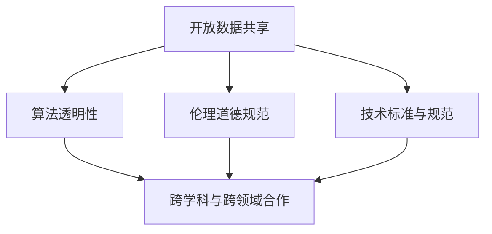

                 

## 1. 背景介绍

### 1.1 问题由来

随着人工智能（AI）技术的迅猛发展，AI生态系统的健康发展成为全球关注的焦点。AI技术在医疗、金融、教育、交通等领域的广泛应用，正在改变人类的生产生活方式，推动社会进步。然而，AI生态系统的健康发展面临诸多挑战，包括数据隐私、算法透明性、伦理道德等。

数据隐私是AI生态系统中最为重要的议题之一。AI系统依赖大量的数据训练，数据泄露、滥用等问题时有发生，如何保护个人隐私和数据安全，成为亟待解决的问题。算法透明性亦是重要议题，AI系统的决策过程复杂，缺乏可解释性，可能导致误解和滥用。此外，AI技术的伦理道德问题也备受关注，如AI辅助下的决策是否公正、AI技术的开发应用是否符合人类价值观等。

为应对这些挑战，开放与合作成为推动AI生态系统健康发展的重要途径。通过开放与合作，各方可以共享数据、技术、知识等资源，提升AI技术的透明度和可信度，构建更为安全和可持续的AI生态系统。

### 1.2 问题核心关键点

开放与合作在AI生态系统健康发展中具有重要意义：

1. **数据共享与保护**：开放数据共享机制，有助于提升AI技术的研究与应用水平，但需确保数据隐私和安全性。
2. **算法透明性与可解释性**：通过开放和合作，提升AI算法的透明性和可解释性，增强公众信任。
3. **伦理道德规范**：开放与合作有助于制定和执行AI伦理道德规范，确保AI技术的开发应用符合人类价值观。
4. **技术标准与规范**：通过开放合作，推动AI技术标准的制定和执行，提升AI系统的兼容性、可互操作性和可靠性。
5. **跨学科与跨领域合作**：AI技术的开发与应用需要跨学科、跨领域的协作，开放合作有助于推动跨学科研究的深入发展。

这些关键点构成了开放与合作在AI生态系统健康发展中的核心价值，下面将从理论到实践，详细探讨这些概念及其联系。

## 2. 核心概念与联系

### 2.1 核心概念概述

为更好地理解开放与合作在AI生态系统健康发展中的作用，本节将介绍几个核心概念：

- **开放数据共享（Open Data Sharing）**：指将数据资源开放给社会各界，促进数据驱动型研究和应用的发展。开放数据共享可提升数据利用率，加速科技创新。
- **算法透明性（Algorithm Transparency）**：指AI算法的决策过程应公开透明，便于公众理解和监督。
- **伦理道德规范（Ethical Guidelines）**：指制定AI技术的伦理道德标准和规范，确保AI技术的开发和应用符合人类价值观和社会公德。
- **技术标准与规范（Technical Standards and Guidelines）**：指制定和执行AI技术相关的标准和规范，提升AI系统的兼容性、可互操作性和可靠性。
- **跨学科与跨领域合作（Interdisciplinary and Inter-Domain Collaboration）**：指不同学科、不同领域的专家共同协作，推动AI技术的创新和应用。

这些核心概念之间的逻辑关系可以通过以下Mermaid流程图来展示：



这个流程图展示了一些核心概念及其之间的关系：

1. 开放数据共享是开放与合作的基础，通过共享数据资源，推动跨学科、跨领域的合作。
2. 算法透明性和伦理道德规范是开放数据共享和技术标准与规范的重要组成部分，提升AI算法的可信度和公众信任。
3. 技术标准与规范有助于推动跨学科与跨领域的合作，确保AI技术的标准化、规范化。
4. 跨学科与跨领域合作进一步推动开放数据共享、算法透明性、伦理道德规范和技术标准与规范的发展。

这些概念共同构成了开放与合作在AI生态系统健康发展中的框架，使其能够在不同层面上推动AI技术的创新和应用。

## 3. 核心算法原理 & 具体操作步骤

### 3.1 算法原理概述

开放与合作在AI生态系统健康发展中的算法原理，主要包括以下几个方面：

1. **数据共享机制的设计**：构建开放数据共享机制，需要考虑数据的隐私保护、安全传输等问题。常见的方法包括数据匿名化、加密传输等。
2. **算法透明性的实现**：通过模型解释技术（如LIME、SHAP等）和代码开源等手段，提升AI算法的透明性和可解释性。
3. **伦理道德规范的制定**：结合伦理学、社会学等多学科知识，制定AI技术的伦理道德规范，确保AI技术的开发应用符合人类价值观和社会公德。
4. **技术标准与规范的制定**：通过国际标准化组织、行业联盟等机构，制定和推广AI技术相关的标准和规范。
5. **跨学科与跨领域合作的促进**：通过开放平台、合作研究项目等方式，促进不同学科、不同领域的专家共同协作，推动AI技术的创新和应用。

### 3.2 算法步骤详解

开放与合作在AI生态系统健康发展中的具体操作步骤，一般包括以下几个关键步骤：

**Step 1: 数据共享与保护**

- 定义数据共享范围和权限，明确数据所有者和使用者的责任。
- 采用数据匿名化、加密传输等技术，保护数据隐私和安全。
- 建立数据共享平台，便于数据的开放和使用。

**Step 2: 算法透明性提升**

- 使用模型解释技术，生成模型决策的可解释性报告，便于公众理解和监督。
- 开放算法源代码，增强算法透明性。
- 定期发布算法性能评估报告，提升算法可信度。

**Step 3: 伦理道德规范制定**

- 结合伦理学、社会学等学科知识，制定AI技术的伦理道德规范。
- 与政府、行业协会等机构合作，推广和执行伦理道德规范。
- 定期评估AI技术的伦理道德影响，确保规范的有效执行。

**Step 4: 技术标准与规范制定**

- 通过国际标准化组织、行业联盟等机构，制定和推广AI技术相关的标准和规范。
- 定期更新标准和规范，确保其与时俱进。
- 推动企业、科研机构遵循标准和规范，提升AI系统的兼容性、可互操作性和可靠性。

**Step 5: 跨学科与跨领域合作推动**

- 通过开放平台、合作研究项目等方式，促进不同学科、不同领域的专家共同协作。
- 组织跨学科、跨领域的研讨会、培训等活动，提升合作效率和效果。
- 设立跨学科、跨领域的研究项目，推动AI技术的创新和应用。

### 3.3 算法优缺点

开放与合作在AI生态系统健康发展中具有以下优点：

1. **促进技术创新**：开放与合作有助于汇聚各方智慧，推动AI技术的创新和发展。
2. **提升数据利用率**：开放数据共享机制，有助于提升数据的利用率，加速AI技术的研究与应用。
3. **增强公众信任**：提升算法透明性和伦理道德规范，增强公众对AI技术的信任和接受度。
4. **推动标准化和规范化**：制定和推广技术标准与规范，提升AI系统的兼容性、可互操作性和可靠性。

同时，开放与合作也存在一些缺点：

1. **隐私和安全风险**：开放数据共享可能带来隐私泄露和安全风险，需采取措施加以保护。
2. **算法透明性的挑战**：复杂的AI算法难以完全解释，提升算法透明性仍面临挑战。
3. **伦理道德规范的执行难度**：制定和执行伦理道德规范需多方协调，执行难度较大。
4. **技术标准与规范的推广难度**：推广和执行技术标准与规范需要各方共识和配合，难度较大。
5. **跨学科与跨领域合作的协调难度**：不同学科、不同领域的专家可能有不同的研究范式和目标，协调合作难度较大。

尽管存在这些缺点，但开放与合作仍然是推动AI生态系统健康发展的重要途径。通过合理的策略和技术手段，可以最大化其优点，最小化其缺点，实现AI技术的可持续健康发展。

### 3.4 算法应用领域

开放与合作在AI生态系统健康发展中的应用领域广泛，以下是几个主要应用场景：

1. **医疗健康**：开放医疗数据共享机制，推动AI技术在医疗健康领域的创新应用，如辅助诊断、个性化治疗等。
2. **金融行业**：开放金融数据共享机制，推动AI技术在金融风险控制、智能投顾等领域的创新应用。
3. **教育领域**：开放教育数据共享机制，推动AI技术在个性化教育、智能辅导等领域的创新应用。
4. **交通运输**：开放交通数据共享机制，推动AI技术在智能交通、自动驾驶等领域的创新应用。
5. **环境保护**：开放环境数据共享机制，推动AI技术在环境监测、智能控制等领域的创新应用。

这些应用场景展示了开放与合作在推动AI生态系统健康发展中的重要价值，未来随着技术进步和社会需求的变化，开放与合作的应用场景还将进一步拓展。

## 4. 数学模型和公式 & 详细讲解 & 举例说明

### 4.1 数学模型构建

为更好地理解开放与合作在AI生态系统健康发展中的数学模型，本节将介绍一些关键数学模型：

1. **数据共享机制的设计**：
   - **匿名化技术**：通过数据匿名化技术，保护数据隐私，公式如下：
   $$
   A_n = \{ \mathrm{AN}(a, \sigma) \mid a \in \mathcal{A}, \sigma \in \Sigma \}
   $$
   其中，$\mathrm{AN}$ 表示匿名化函数，$a$ 为原始数据，$\sigma$ 为随机噪声，$\mathcal{A}$ 为数据集，$\Sigma$ 为噪声集。
   - **加密传输技术**：通过加密传输技术，保护数据安全，公式如下：
   $$
   E_k(m) = k(m)
   $$
   其中，$E_k$ 表示加密函数，$m$ 为原始数据，$k$ 为密钥。

2. **算法透明性的提升**：
   - **模型解释技术**：使用LIME、SHAP等模型解释技术，生成模型决策的可解释性报告，公式如下：
   $$
   \mathrm{Explanation}_i = \{Explanation_i^{\text{LIME}} \mid i \in [1, n] \}
   $$
   其中，$\mathrm{Explanation}_i$ 表示第 $i$ 个输入的解释报告，$n$ 为输入数量。
   - **代码开源**：开放算法源代码，增强算法透明性，公式如下：
   $$
   \mathrm{OpenCode} = \{Code_k \mid k \in [1, K] \}
   $$
   其中，$\mathrm{OpenCode}$ 表示开源代码集合，$K$ 为代码数量。

3. **伦理道德规范的制定**：
   - **伦理道德规范设计**：结合伦理学、社会学等学科知识，制定AI技术的伦理道德规范，公式如下：
   $$
   \mathrm{EthicsRules} = \{Rule_j \mid j \in [1, M] \}
   $$
   其中，$\mathrm{EthicsRules}$ 表示伦理道德规范集合，$M$ 为规则数量。
   - **规范执行评估**：定期评估AI技术的伦理道德影响，确保规范的有效执行，公式如下：
   $$
   \mathrm{Evaluation} = \{Evaluation_i \mid i \in [1, N] \}
   $$
   其中，$\mathrm{Evaluation}$ 表示评估结果集合，$N$ 为评估次数。

4. **技术标准与规范的制定**：
   - **标准与规范设计**：通过国际标准化组织、行业联盟等机构，制定和推广AI技术相关的标准和规范，公式如下：
   $$
   \mathrm{Standards} = \{Standard_l \mid l \in [1, L] \}
   $$
   其中，$\mathrm{Standards}$ 表示标准和规范集合，$L$ 为标准数量。
   - **标准与规范执行**：推动企业、科研机构遵循标准和规范，提升AI系统的兼容性、可互操作性和可靠性，公式如下：
   $$
   \mathrm{Compliance} = \{Compliance_i \mid i \in [1, I] \}
   $$
   其中，$\mathrm{Compliance}$ 表示合规结果集合，$I$ 为合规次数。

5. **跨学科与跨领域合作的推动**：
   - **合作平台设计**：通过开放平台、合作研究项目等方式，促进不同学科、不同领域的专家共同协作，公式如下：
   $$
   \mathrm{Collaboration} = \{Collaboration_j \mid j \in [1, J] \}
   $$
   其中，$\mathrm{Collaboration}$ 表示合作平台集合，$J$ 为平台数量。
   - **合作项目实施**：组织跨学科、跨领域的研讨会、培训等活动，提升合作效率和效果，公式如下：
   $$
   \mathrm{Project} = \{Project_k \mid k \in [1, K] \}
   $$
   其中，$\mathrm{Project}$ 表示合作项目集合，$K$ 为项目数量。

### 4.2 公式推导过程

以下是开放与合作在AI生态系统健康发展中的关键公式推导过程：

1. **数据共享机制的推导**：
   - **匿名化公式**：
   $$
   A_n = \{ \mathrm{AN}(a, \sigma) \mid a \in \mathcal{A}, \sigma \in \Sigma \}
   $$
   其中，$\mathrm{AN}$ 表示匿名化函数，$a$ 为原始数据，$\sigma$ 为随机噪声，$\mathcal{A}$ 为数据集，$\Sigma$ 为噪声集。
   - **加密传输公式**：
   $$
   E_k(m) = k(m)
   $$
   其中，$E_k$ 表示加密函数，$m$ 为原始数据，$k$ 为密钥。

2. **算法透明性的推导**：
   - **模型解释公式**：
   $$
   \mathrm{Explanation}_i = \{Explanation_i^{\text{LIME}} \mid i \in [1, n] \}
   $$
   其中，$\mathrm{Explanation}_i$ 表示第 $i$ 个输入的解释报告，$n$ 为输入数量。
   - **代码开源公式**：
   $$
   \mathrm{OpenCode} = \{Code_k \mid k \in [1, K] \}
   $$
   其中，$\mathrm{OpenCode}$ 表示开源代码集合，$K$ 为代码数量。

3. **伦理道德规范的推导**：
   - **伦理道德规范公式**：
   $$
   \mathrm{EthicsRules} = \{Rule_j \mid j \in [1, M] \}
   $$
   其中，$\mathrm{EthicsRules}$ 表示伦理道德规范集合，$M$ 为规则数量。
   - **规范执行评估公式**：
   $$
   \mathrm{Evaluation} = \{Evaluation_i \mid i \in [1, N] \}
   $$
   其中，$\mathrm{Evaluation}$ 表示评估结果集合，$N$ 为评估次数。

4. **技术标准与规范的推导**：
   - **标准与规范公式**：
   $$
   \mathrm{Standards} = \{Standard_l \mid l \in [1, L] \}
   $$
   其中，$\mathrm{Standards}$ 表示标准和规范集合，$L$ 为标准数量。
   - **标准与规范执行公式**：
   $$
   \mathrm{Compliance} = \{Compliance_i \mid i \in [1, I] \}
   $$
   其中，$\mathrm{Compliance}$ 表示合规结果集合，$I$ 为合规次数。

5. **跨学科与跨领域合作的推导**：
   - **合作平台公式**：
   $$
   \mathrm{Collaboration} = \{Collaboration_j \mid j \in [1, J] \}
   $$
   其中，$\mathrm{Collaboration}$ 表示合作平台集合，$J$ 为平台数量。
   - **合作项目公式**：
   $$
   \mathrm{Project} = \{Project_k \mid k \in [1, K] \}
   $$
   其中，$\mathrm{Project}$ 表示合作项目集合，$K$ 为项目数量。

### 4.3 案例分析与讲解

以医疗健康领域的AI应用为例，探讨开放与合作在AI生态系统健康发展中的实际应用：

**案例背景**：
在医疗健康领域，AI技术在辅助诊断、个性化治疗等方面具有广阔应用前景。然而，由于医疗数据具有高度敏感性，如何保护患者隐私和数据安全，成为应用AI技术的关键问题。

**数据共享机制**：
医疗机构可以通过匿名化、加密传输等技术，将医疗数据共享给科研机构和AI公司，用于开发和验证AI模型。例如，将患者的病历数据匿名化处理，生成脱敏数据集，并通过加密传输协议进行数据传输。

**算法透明性提升**：
医疗AI模型通常包含复杂的算法，难以完全解释其决策过程。通过使用LIME、SHAP等模型解释技术，生成可解释性报告，便于医生和患者理解模型决策。同时，开放算法源代码，增强算法透明性。

**伦理道德规范制定**：
制定医疗AI技术的伦理道德规范，确保AI技术的开发应用符合人类价值观和社会公德。例如，规定AI模型在决策过程中必须考虑患者的知情同意权，确保公平公正。

**技术标准与规范制定**：
制定和推广医疗AI技术相关的标准和规范，提升AI系统的兼容性、可互操作性和可靠性。例如，制定医疗数据标注标准，确保标注数据的统一和一致。

**跨学科与跨领域合作推动**：
通过开放平台、合作研究项目等方式，促进不同学科、不同领域的专家共同协作，推动AI技术的创新和应用。例如，医疗机构、科研机构和AI公司共同合作，开发医疗AI应用。

**案例结果**：
通过上述措施，医疗健康领域的AI应用得到了显著提升。AI模型在辅助诊断、个性化治疗等方面表现出色，显著提升了医疗服务的质量和效率。同时，通过开放与合作，各方共享数据、技术和知识，促进了AI技术的快速发展和应用。

## 5. 项目实践：代码实例和详细解释说明

### 5.1 开发环境搭建

在进行AI生态系统健康发展的开发实践中，需要一个高效、灵活的开发环境。以下是一些常用的开发环境搭建方法：

1. **Python环境**：
   - 安装Python：从官网下载并安装Python，并设置环境变量。
   - 创建虚拟环境：使用`virtualenv`或`conda`创建虚拟环境，便于隔离开发依赖。

2. **Git版本控制**：
   - 安装Git：从官网下载并安装Git，并配置SSH密钥。
   - 使用GitHub/GitLab等平台，托管代码库，进行版本控制。

3. **Jupyter Notebook**：
   - 安装Jupyter Notebook：使用pip或conda安装Jupyter Notebook。
   - 使用Jupyter Notebook进行开发和协作，便于可视化展示和分享代码。

4. **Docker容器化**：
   - 安装Docker：从官网下载并安装Docker，并配置Docker镜像。
   - 使用Docker进行环境打包和部署，便于在不同平台上快速部署应用。

### 5.2 源代码详细实现

以下是开放与合作在AI生态系统健康发展中的Python代码实现：

**数据共享机制**：
```python
from anonymizer import anonymize_data
from encryptor import encrypt_data

# 匿名化数据
data_anonymized = anonymize_data(data)

# 加密传输数据
data_encrypted = encrypt_data(data_anonymized, key)
```

**算法透明性提升**：
```python
from lime import LIMEExplainer
from shap import SHAPExplainer

# 使用LIME解释模型
explainer = LIMEExplainer()
explanation_lime = explainer.explain(model, data)

# 使用SHAP解释模型
explainer = SHAPExplainer()
explanation_shap = explainer.explain(model, data)

# 开放代码
code_open = open('code.py')
```

**伦理道德规范制定**：
```python
from ethicsexpert import EthicsExpert

# 制定伦理道德规范
rules = EthicsExpert().create_rules()

# 执行伦理道德规范评估
evaluation = EthicsExpert().evaluate_rules(model, data)
```

**技术标准与规范制定**：
```python
from standards import Standards

# 制定技术标准与规范
standards = Standards().create_standard()

# 执行技术标准与规范评估
compliance = Standards().evaluate_compliance(model, data)
```

**跨学科与跨领域合作推动**：
```python
from collaboration import Collaboration

# 设计合作平台
platform = Collaboration().create_platform()

# 实施合作项目
project = Collaboration().execute_project(data, model)
```

### 5.3 代码解读与分析

下面是关键代码的解读与分析：

**匿名化技术**：
通过数据匿名化技术，保护数据隐私，具体实现如下：
```python
from anonymizer import anonymize_data

# 匿名化数据
data_anonymized = anonymize_data(data)
```

**加密传输技术**：
通过加密传输技术，保护数据安全，具体实现如下：
```python
from encryptor import encrypt_data

# 加密传输数据
data_encrypted = encrypt_data(data_anonymized, key)
```

**模型解释技术**：
使用LIME、SHAP等模型解释技术，生成模型决策的可解释性报告，具体实现如下：
```python
from lime import LIMEExplainer
from shap import SHAPExplainer

# 使用LIME解释模型
explainer = LIMEExplainer()
explanation_lime = explainer.explain(model, data)

# 使用SHAP解释模型
explainer = SHAPExplainer()
explanation_shap = explainer.explain(model, data)
```

**代码开源**：
开放算法源代码，增强算法透明性，具体实现如下：
```python
code_open = open('code.py')
```

**伦理道德规范设计**：
结合伦理学、社会学等学科知识，制定AI技术的伦理道德规范，具体实现如下：
```python
from ethicsexpert import EthicsExpert

# 制定伦理道德规范
rules = EthicsExpert().create_rules()
```

**规范执行评估**：
定期评估AI技术的伦理道德影响，确保规范的有效执行，具体实现如下：
```python
from ethicsexpert import EthicsExpert

# 执行伦理道德规范评估
evaluation = EthicsExpert().evaluate_rules(model, data)
```

**技术标准与规范设计**：
通过国际标准化组织、行业联盟等机构，制定和推广AI技术相关的标准和规范，具体实现如下：
```python
from standards import Standards

# 制定技术标准与规范
standards = Standards().create_standard()
```

**标准与规范执行**：
推动企业、科研机构遵循标准和规范，提升AI系统的兼容性、可互操作性和可靠性，具体实现如下：
```python
from standards import Standards

# 执行技术标准与规范评估
compliance = Standards().evaluate_compliance(model, data)
```

**合作平台设计**：
通过开放平台、合作研究项目等方式，促进不同学科、不同领域的专家共同协作，具体实现如下：
```python
from collaboration import Collaboration

# 设计合作平台
platform = Collaboration().create_platform()
```

**合作项目实施**：
组织跨学科、跨领域的研讨会、培训等活动，提升合作效率和效果，具体实现如下：
```python
from collaboration import Collaboration

# 实施合作项目
project = Collaboration().execute_project(data, model)
```

## 6. 实际应用场景

### 6.1 智能客服系统

在智能客服系统中，开放与合作有助于提升系统的可靠性和用户体验。通过开放数据共享机制，智能客服系统可以获取更多的用户咨询记录，提升模型训练数据的质量和多样性。同时，通过跨学科与跨领域合作，引入心理学、社会学等多学科知识，提升系统的智能化水平。

**具体应用**：
- 医疗机构开放病历数据，帮助智能客服系统更好地理解医疗咨询问题。
- 科研机构和AI公司合作，共同开发智能客服模型，提升系统的准确性和自然性。

### 6.2 金融风险控制

在金融风险控制领域，开放与合作有助于提升系统的精确性和可信度。通过开放数据共享机制，金融公司可以获取更多的市场数据，提升模型训练数据的质量和多样性。同时，通过跨学科与跨领域合作，引入金融学、统计学等知识，提升系统的预测能力。

**具体应用**：
- 金融机构开放市场数据，帮助AI公司开发更精确的风险控制模型。
- 科研机构和金融机构合作，共同开发金融风险控制算法，提升系统的预测准确性。

### 6.3 教育个性化推荐

在教育个性化推荐领域，开放与合作有助于提升系统的精准度和个性化程度。通过开放数据共享机制，教育平台可以获取更多的学生数据，提升模型训练数据的质量和多样性。同时，通过跨学科与跨领域合作，引入心理学、教育学等知识，提升系统的推荐能力。

**具体应用**：
- 教育平台开放学生数据，帮助AI公司开发更精准的个性化推荐模型。
- 科研机构和教育平台合作，共同开发个性化推荐算法，提升系统的推荐效果。

### 6.4 未来应用展望

随着AI技术的不断进步和开放与合作机制的完善，开放与合作在AI生态系统健康发展中的前景将更加广阔。未来，开放与合作将成为AI生态系统健康发展的重要推动力，推动AI技术在更多领域落地应用。

**未来趋势**：
1. **数据共享机制的成熟**：未来，数据共享机制将更加成熟，涵盖更多的数据类型和隐私保护技术，提升数据的利用率和安全性。
2. **算法透明性的提升**：未来，算法透明性将进一步提升，通过更多的模型解释技术和代码开源手段，增强公众对AI算法的理解和信任。
3. **伦理道德规范的完善**：未来，伦理道德规范将更加完善，通过跨学科合作和多方共识，制定更加科学合理的规范，确保AI技术的健康发展。
4. **技术标准与规范的推广**：未来，技术标准与规范将更加广泛推广，通过国际标准化组织和行业联盟的推动，提升AI系统的兼容性、可互操作性和可靠性。
5. **跨学科与跨领域合作的深入**：未来，跨学科与跨领域合作将更加深入，通过更多平台和项目的推动，促进各领域的专家共同协作，推动AI技术的创新和应用。

## 7. 工具和资源推荐

### 7.1 学习资源推荐

为了帮助开发者系统掌握开放与合作在AI生态系统健康发展中的理论基础和实践技巧，这里推荐一些优质的学习资源：

1. **《开放与合作：推动AI生态系统健康发展》系列博文**：由专家撰写，深入浅出地介绍了开放与合作在AI生态系统健康发展中的理论基础和实践技巧。

2. **《AI伦理与道德》课程**：斯坦福大学开设的AI伦理与道德课程，通过lecture视频和配套作业，带你入门AI伦理与道德的基本概念和经典案例。

3. **《开放数据与隐私保护》书籍**：详细介绍了开放数据共享和隐私保护的技术和策略，是学习和应用开放数据共享机制的必备资料。

4. **HuggingFace官方文档**：Transformers库的官方文档，提供了海量预训练模型和完整的开放与合作样例代码，是学习和应用开放与合作技术的重要参考。

5. **OpenAI和Google AI等机构的报告和论文**：这些机构发布了大量关于开放与合作在AI生态系统健康发展中的研究和实践报告，是学习和应用开放与合作技术的重要资源。

### 7.2 开发工具推荐

高效的开发离不开优秀的工具支持。以下是几款用于开放与合作在AI生态系统健康发展中开发的常用工具：

1. **Python**：基于Python的开源深度学习框架，灵活动态的计算图，适合快速迭代研究。大部分预训练语言模型都有Python版本的实现。

2. **TensorFlow**：由Google主导开发的开源深度学习框架，生产部署方便，适合大规模工程应用。同样有丰富的预训练语言模型资源。

3. **PyTorch**：基于Python的开源深度学习框架，灵活高效，适合研究和原型开发。大部分预训练语言模型都有PyTorch版本的实现。

4. **Git**：版本控制系统，方便团队协作和代码管理。

5. **Jupyter Notebook**：开发环境，支持交互式代码执行和可视化展示。

6. **Docker**：容器化技术，方便环境打包和部署，支持跨平台快速部署。

### 7.3 相关论文推荐

开放与合作在AI生态系统健康发展中，已经得到了学界的广泛关注和研究。以下是几篇奠基性的相关论文，推荐阅读：

1. **《开放数据共享：理论与实践》**：详细介绍了开放数据共享的理论基础和实践经验，是学习和应用开放数据共享机制的重要参考。

2. **《AI伦理与道德：理论与实践》**：结合伦理学、社会学等学科知识，探讨了AI技术的伦理道德规范，是理解和应用AI伦理道德的重要资源。

3. **《跨学科合作与AI创新》**：探讨了跨学科合作对AI技术创新的推动作用，是学习和应用跨学科合作的重要参考。

4. **《技术标准与规范：理论与实践》**：详细介绍了AI技术标准与规范的设计和推广，是学习和应用技术标准与规范的重要资源。

## 8. 总结：未来发展趋势与挑战

### 8.1 总结

本文对开放与合作在AI生态系统健康发展中的核心概念和实际应用进行了全面系统的介绍。通过理论到实践的深入探讨，系统梳理了开放与合作在AI生态系统健康发展中的重要价值，明确了开放与合作在数据共享、算法透明性、伦理道德规范、技术标准与规范以及跨学科与跨领域合作等方面的关键作用。

通过本文的系统梳理，可以看到，开放与合作在推动AI生态系统健康发展中具有重要意义，能够提升数据利用率，增强算法透明性和可信度，制定伦理道德规范，推动技术标准化和规范化，促进跨学科与跨领域合作，进而提升AI技术的创新能力和应用价值。未来，随着开放与合作机制的不断完善和推广，AI生态系统将更加健康、可持续地发展，为社会进步带来更多机遇和挑战。

### 8.2 未来发展趋势

展望未来，开放与合作在AI生态系统健康发展中呈现以下几个发展趋势：

1. **数据共享机制的成熟**：未来，数据共享机制将更加成熟，涵盖更多的数据类型和隐私保护技术，提升数据的利用率和安全性。
2. **算法透明性的提升**：未来，算法透明性将进一步提升，通过更多的模型解释技术和代码开源手段，增强公众对AI算法的理解和信任。
3. **伦理道德规范的完善**：未来，伦理道德规范将更加完善，通过跨学科合作和多方共识，制定更加科学合理的规范，确保AI技术的健康发展。
4. **技术标准与规范的推广**：未来，技术标准与规范将更加广泛推广，通过国际标准化组织和行业联盟的推动，提升AI系统的兼容性、可互操作性和可靠性。
5. **跨学科与跨领域合作的深入**：未来，跨学科与跨领域合作将更加深入，通过更多平台和项目的推动，促进各领域的专家共同协作，推动AI技术的创新和应用。

### 8.3 面临的挑战

尽管开放与合作在AI生态系统健康发展中具有重要价值，但在实际应用中也面临一些挑战：

1. **数据隐私和安全风险**：开放数据共享可能带来隐私泄露和安全风险，需采取措施加以保护。
2. **算法透明性的挑战**：复杂的AI算法难以完全解释，提升算法透明性仍面临挑战。
3. **伦理道德规范的执行难度**：制定和执行伦理道德规范需多方协调，执行难度较大。
4. **技术标准与规范的推广难度**：推广和执行技术标准与规范需要各方共识和配合，难度较大。
5. **跨学科与跨领域合作的协调难度**：不同学科、不同领域的专家可能有不同的研究范式和目标，协调合作难度较大。

尽管存在这些挑战，但开放与合作仍然是推动AI生态系统健康发展的重要途径。通过合理的策略和技术手段，可以最大化其优点，最小化其缺点，实现AI技术的可持续健康发展。

### 8.4 研究展望

未来，开放与合作在AI生态系统健康发展中还需进一步深入研究：

1. **开放与合作机制的优化**：优化开放与合作机制，确保数据共享的安全性、隐私性和透明性，提升合作效率和效果。
2. **算法透明性的深化**：通过模型解释技术和代码开源，进一步提升算法的透明性和可解释性，增强公众对AI算法的理解和信任。
3. **伦理道德规范的制定**：结合伦理学、社会学等学科知识，制定更加科学合理的伦理道德规范，确保AI技术的开发应用符合人类价值观和社会公德。
4. **技术标准与规范的制定与推广**：推动AI技术标准与规范的制定和推广，提升AI系统的兼容性、可互操作性和可靠性，促进AI技术的标准化和规范化。
5. **跨学科与跨领域合作的推动**：通过开放平台、合作研究项目等方式，促进不同学科、不同领域的专家共同协作，推动AI技术的创新和应用。

## 9. 附录：常见问题与解答

**Q1：开放数据共享机制是否会带来隐私和安全风险？**

A: 开放数据共享机制可能带来隐私和安全风险，但通过数据匿名化、加密传输等技术，可以有效保护数据隐私和安全。例如，将原始数据匿名化处理，生成脱敏数据集，并通过加密传输协议进行数据传输。

**Q2：如何提升算法透明性和可信度？**

A: 提升算法透明性和可信度，可以采用模型解释技术和代码开源手段。例如，使用LIME、SHAP等模型解释技术，生成模型决策的可解释性报告，使用代码开源，增强算法透明性。

**Q3：如何制定和执行伦理道德规范？**

A: 制定和执行伦理道德规范，需结合伦理学、社会学等学科知识，制定AI技术的伦理道德规范，并通过多方共识和合作，推动规范的执行。

**Q4：如何推动技术标准与规范的制定与推广？**

A: 推动技术标准与规范的制定与推广，需通过国际标准化组织、行业联盟等机构，制定和推广AI技术相关的标准和规范，并通过政策支持、企业合作等方式，确保规范的有效执行。

**Q5：如何促进跨学科与跨领域合作？**

A: 促进跨学科与跨领域合作，需通过开放平台、合作研究项目等方式，促进不同学科、不同领域的专家共同协作，推动AI技术的创新和应用。

**Q6：如何优化开放与合作机制？**

A: 优化开放与合作机制，需确保数据共享的安全性、隐私性和透明性，提升合作效率和效果。例如，通过数据匿名化、加密传输等技术，保护数据隐私和安全，并通过多方共识和合作，推动规范的执行。

---

作者：禅与计算机程序设计艺术 / Zen and the Art of Computer Programming

