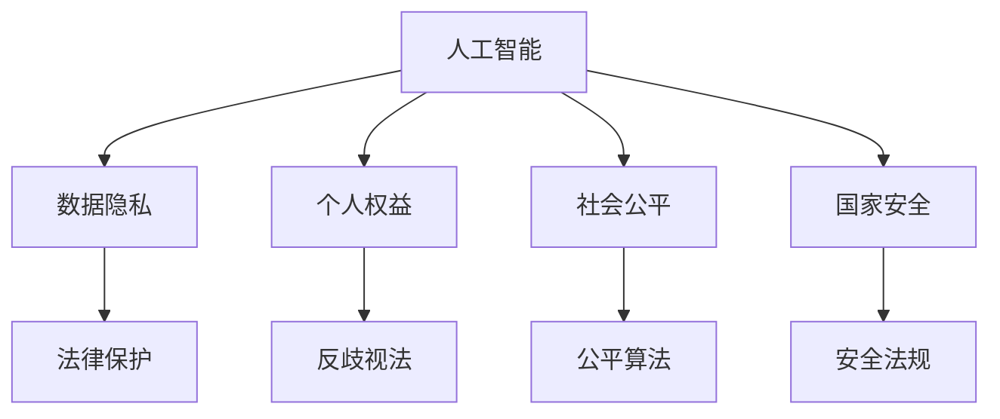

                 

# AI相关法律法规原理与代码实战案例讲解

> 关键词：人工智能法律法规,法律与道德伦理,AI代码实战,AI应用合规性,数据隐私与安全

## 1. 背景介绍

随着人工智能(AI)技术的迅猛发展，其在医疗、金融、教育、司法等各个领域的应用日益广泛，涉及数据隐私、个人权益、社会公平、国家安全等多方面的法律问题。如何规范AI的开发和应用，保障其安全、透明、公平，成为当前社会各界共同关注的重要课题。

AI相关法律法规的制定和实施，旨在为AI技术的发展和应用提供明确的法律框架，促进技术的健康发展和公平应用。然而，由于AI技术的复杂性和动态变化，相关法律法规的制定和实施也面临着诸多挑战。本文将对AI相关法律法规的原理进行深入剖析，并通过代码实战案例讲解AI应用中的合规性问题，帮助开发者和从业者更好地理解AI法律与道德伦理，掌握AI应用的合规性技能。

## 2. 核心概念与联系

### 2.1 核心概念概述

为了更好地理解AI相关法律法规，本节将介绍几个关键概念：

- **人工智能(AI)**：通过模拟人类智能行为，如学习、推理、感知、决策等，实现自动化的技术系统。包括机器学习、深度学习、自然语言处理、计算机视觉等多个子领域。

- **数据隐私**：指个人、法人或其他组织在数据收集、存储、处理和使用过程中，对其个人信息的保护。数据隐私问题在AI应用中尤为关键，涉及用户数据的收集、使用、存储和共享等环节。

- **个人权益**：包括个人数据保护、隐私权、言论自由、公平就业等方面。在AI应用中，如何保护用户权益，避免偏见和歧视，是实现公平应用的关键。

- **社会公平**：指在AI应用中，确保不同群体（如性别、种族、经济地位等）获得平等的机会和待遇。AI算法中存在的偏见和歧视问题，直接关系到社会公平的实现。

- **国家安全**：涉及AI技术在军事、政务、公共安全等领域的应用，如何防止AI被滥用，保障国家安全是重要的法律议题。

这些核心概念之间的关系可以通过以下Mermaid流程图来展示：



这个流程图展示了AI相关法律法规的各个方面及其相互关系：

1. AI技术依赖于数据隐私来获取训练数据。
2. AI应用需要保护个人权益，避免算法偏见和歧视。
3. AI在社会公平层面具有广泛影响，需要公平算法和反歧视法来保障。
4. AI在国家安全领域的应用需要严格的安全法规来规范。

## 3. 核心算法原理 & 具体操作步骤

### 3.1 算法原理概述

AI相关法律法规的核心原理包括以下几个方面：

1. **数据隐私保护**：在数据收集、存储、处理和共享过程中，确保个人信息的保护。包括但不限于GDPR、CCPA等国际和地区的隐私保护法规。

2. **公平算法设计**：在算法设计、训练和应用过程中，避免算法偏见和歧视。包括但不限于Euro fairness、AI ethics等公平算法设计原则。

3. **透明性与可解释性**：确保AI系统的决策过程透明和可解释，便于监管和审核。包括但不限于XAI（可解释性AI）和RASAI（可审计性AI）等技术。

4. **安全与责任界定**：确保AI系统在运行过程中，避免对用户和社会造成损害。包括但不限于安全法规、责任界定等法律和道德规范。

5. **合规性检查与监控**：对AI系统的开发和应用进行合规性检查和持续监控，确保符合法律法规要求。包括但不限于合规性审计、代码审查等技术手段。

### 3.2 算法步骤详解

基于上述核心原理，AI相关法律法规的合规性检查和监控一般包括以下几个步骤：

1. **数据收集与隐私评估**：评估数据收集过程中的隐私风险，确保符合相关隐私保护法规的要求。

2. **算法设计与公平性分析**：在算法设计过程中，进行公平性分析，避免算法偏见和歧视。

3. **模型训练与透明性增强**：在模型训练过程中，增强模型的透明性和可解释性，便于监管和审核。

4. **安全测试与责任界定**：对AI系统进行安全测试，明确责任界定，确保系统运行过程中不会对用户和社会造成损害。

5. **合规性审计与持续监控**：定期对AI系统进行合规性审计和持续监控，确保符合法律法规要求。

### 3.3 算法优缺点

AI相关法律法规的合规性检查和监控方法具有以下优点：

1. **保障隐私与安全**：通过数据隐私保护和安全测试，保障用户数据的安全和隐私。

2. **促进公平应用**：通过公平算法设计和责任界定，促进AI技术的公平应用，避免偏见和歧视。

3. **增强透明性与可信度**：通过透明性和可解释性增强，提高AI系统的可信度和用户信任。

4. **防范法律风险**：通过合规性审计和持续监控，防范法律风险，保障系统合规运营。

同时，这些方法也存在一定的局限性：

1. **成本较高**：合规性检查和监控需要投入大量的人力和资源，增加开发和维护成本。

2. **复杂性高**：AI技术复杂多变，法律法规和公平性原则不断更新，合规性检查和监控难度较大。

3. **技术难度大**：透明性增强和可解释性提升需要技术支持，开发复杂。

4. **法律法规更新迅速**：法律法规和公平性原则的更新频率较高，合规性检查和监控需要及时响应。

尽管存在这些局限性，但为了确保AI技术的健康发展，保障用户权益和社会公平，合规性检查和监控方法仍然是必不可少的。

### 3.4 算法应用领域

AI相关法律法规的合规性检查和监控方法在多个领域中得到了广泛应用，例如：

1. **医疗健康**：确保医疗AI系统的数据隐私保护、算法公平性和透明性，避免医疗误诊和歧视。

2. **金融服务**：确保金融AI系统的数据隐私保护、算法公平性和安全测试，防范金融欺诈和歧视。

3. **教育培训**：确保教育AI系统的数据隐私保护、算法公平性和透明性，促进教育公平和包容。

4. **司法审判**：确保司法AI系统的数据隐私保护、算法公平性和责任界定，保障司法公正和透明。

5. **公共安全**：确保公共安全AI系统的数据隐私保护、算法公平性和安全测试，保障公共安全和社会公平。

这些领域的应用，展示了AI相关法律法规的广泛影响和重要意义。

## 4. 数学模型和公式 & 详细讲解 & 举例说明

### 4.1 数学模型构建

本节将使用数学语言对AI相关法律法规的合规性检查和监控过程进行更加严格的刻画。

假设AI系统的输入数据为 $x$，输出为 $y$。模型的预测函数为 $f(x; \theta)$，其中 $\theta$ 为模型参数。模型的预测结果与真实结果之间的差异通过损失函数 $L(y, \hat{y})$ 来衡量，其中 $\hat{y} = f(x; \theta)$。

模型的公平性通过两个指标来衡量：

1. **均衡误差（Equalized Odds）**：确保不同群体（如性别、种族等）的预测误差（假正率、假负率）相等，即：

   $$
   \text{E}[L(y, f(x; \theta))] = \text{E}[L(y, f(x; \theta)) \mid X=k]
   $$

   其中 $X$ 表示群体的属性，$k$ 表示不同的群体。

2. **差异最小化（Equal Opportunity）**：确保不同群体在正确预测时的概率相等，即：

   $$
   P(y=1 \mid X=k, \hat{y}=1) = P(y=1 \mid X=k, \hat{y}=0)
   $$

   其中 $P$ 表示概率。

### 4.2 公式推导过程

以下我们以均衡误差为例，推导模型公平性分析的公式。

设模型对群体 $k$ 的正样本预测结果为 $\hat{y}_k$，负样本预测结果为 $\hat{y}_k^-$，真实结果为 $y_k$。则均衡误差的定义为：

$$
\text{E}[L(y_k, f(x; \theta))] = \frac{1}{N_k} \sum_{i=1}^{N_k} L(y_k^{(i)}, f(x^{(i)}; \theta))
$$

其中 $N_k$ 表示群体 $k$ 的样本数，$y_k^{(i)}$ 和 $x^{(i)}$ 分别表示样本 $i$ 的真实结果和输入特征。

为了保证模型对不同群体的预测误差相等，需要满足：

$$
\frac{1}{N_k} \sum_{i=1}^{N_k} \mathbb{I}(y_k^{(i)}=1, \hat{y}_k^{(i)}=1) = \frac{1}{N_k} \sum_{i=1}^{N_k} \mathbb{I}(y_k^{(i)}=0, \hat{y}_k^{(i)}=0)
$$

其中 $\mathbb{I}$ 表示示性函数。

在实践中，为了便于计算和优化，可以使用公平性约束方程进行约束，如：

$$
\mathbb{E}_{(x,y)}[\hat{y}] = \mathbb{E}_{(x,y)}[y]
$$

在满足公平性约束的前提下，最小化损失函数 $L(y, f(x; \theta))$，即可得到符合公平性原则的模型参数 $\theta^*$。

### 4.3 案例分析与讲解

以医疗AI系统的公平性分析为例，展示如何通过公平性约束方程进行模型设计。

假设医疗AI系统用于预测患者是否患有某种疾病。系统输入为患者的年龄、性别、病史等特征 $x$，输出为疾病预测结果 $y$。模型为深度神经网络，参数为 $\theta$。

为了确保模型对不同性别的患者预测公平，需要满足均衡误差和差异最小化的约束条件。

首先，通过数据预处理和公平性分析，获取男性和女性患者的样本数据，分别为 $D^m$ 和 $D^f$。

然后，对模型进行公平性约束方程的约束，即：

$$
\mathbb{E}_{x \in D^m}[\hat{y}] = \mathbb{E}_{x \in D^f}[\hat{y}]
$$

最后，在满足公平性约束的前提下，最小化损失函数，得到符合公平性原则的模型参数 $\theta^*$。

## 5. 项目实践：代码实例和详细解释说明

### 5.1 开发环境搭建

在进行AI相关法律法规的合规性检查和监控实践前，我们需要准备好开发环境。以下是使用Python进行PyTorch开发的环境配置流程：

1. 安装Anaconda：从官网下载并安装Anaconda，用于创建独立的Python环境。

2. 创建并激活虚拟环境：
```bash
conda create -n ai-law-env python=3.8 
conda activate ai-law-env
```

3. 安装PyTorch：根据CUDA版本，从官网获取对应的安装命令。例如：
```bash
conda install pytorch torchvision torchaudio cudatoolkit=11.1 -c pytorch -c conda-forge
```

4. 安装相关库：
```bash
pip install numpy pandas scikit-learn transformers matplotlib tqdm jupyter notebook ipython
```

完成上述步骤后，即可在`ai-law-env`环境中开始合规性检查和监控实践。

### 5.2 源代码详细实现

这里我们以医疗AI系统为例，给出使用Transformers库进行公平性分析的PyTorch代码实现。

首先，定义数据处理函数：

```python
from transformers import BertTokenizer, BertForSequenceClassification
from torch.utils.data import Dataset
import torch

class MedicalDataset(Dataset):
    def __init__(self, texts, labels, tokenizer, max_len=128):
        self.texts = texts
        self.labels = labels
        self.tokenizer = tokenizer
        self.max_len = max_len
        
    def __len__(self):
        return len(self.texts)
    
    def __getitem__(self, item):
        text = self.texts[item]
        label = self.labels[item]
        
        encoding = self.tokenizer(text, return_tensors='pt', max_length=self.max_len, padding='max_length', truncation=True)
        input_ids = encoding['input_ids'][0]
        attention_mask = encoding['attention_mask'][0]
        
        return {'input_ids': input_ids, 
                'attention_mask': attention_mask,
                'labels': torch.tensor(label, dtype=torch.long)}
```

然后，定义模型和优化器：

```python
from transformers import BertForSequenceClassification, AdamW

model = BertForSequenceClassification.from_pretrained('bert-base-cased', num_labels=2)

optimizer = AdamW(model.parameters(), lr=2e-5)
```

接着，定义训练和评估函数：

```python
from torch.utils.data import DataLoader
from tqdm import tqdm
from sklearn.metrics import classification_report

device = torch.device('cuda') if torch.cuda.is_available() else torch.device('cpu')
model.to(device)

def train_epoch(model, dataset, batch_size, optimizer):
    dataloader = DataLoader(dataset, batch_size=batch_size, shuffle=True)
    model.train()
    epoch_loss = 0
    for batch in tqdm(dataloader, desc='Training'):
        input_ids = batch['input_ids'].to(device)
        attention_mask = batch['attention_mask'].to(device)
        labels = batch['labels'].to(device)
        model.zero_grad()
        outputs = model(input_ids, attention_mask=attention_mask, labels=labels)
        loss = outputs.loss
        epoch_loss += loss.item()
        loss.backward()
        optimizer.step()
    return epoch_loss / len(dataloader)

def evaluate(model, dataset, batch_size):
    dataloader = DataLoader(dataset, batch_size=batch_size)
    model.eval()
    preds, labels = [], []
    with torch.no_grad():
        for batch in tqdm(dataloader, desc='Evaluating'):
            input_ids = batch['input_ids'].to(device)
            attention_mask = batch['attention_mask'].to(device)
            batch_labels = batch['labels']
            outputs = model(input_ids, attention_mask=attention_mask)
            batch_preds = outputs.logits.argmax(dim=2).to('cpu').tolist()
            batch_labels = batch_labels.to('cpu').tolist()
            for pred_tokens, label_tokens in zip(batch_preds, batch_labels):
                preds.append(pred_tokens)
                labels.append(label_tokens)
                
    print(classification_report(labels, preds))
```

最后，启动训练流程并在测试集上评估：

```python
epochs = 5
batch_size = 16

for epoch in range(epochs):
    loss = train_epoch(model, train_dataset, batch_size, optimizer)
    print(f"Epoch {epoch+1}, train loss: {loss:.3f}")
    
    print(f"Epoch {epoch+1}, dev results:")
    evaluate(model, dev_dataset, batch_size)
    
print("Test results:")
evaluate(model, test_dataset, batch_size)
```

以上就是使用PyTorch对医疗AI系统进行公平性分析的完整代码实现。可以看到，使用Transformers库可以非常方便地实现公平性约束方程的约束，并通过简单的修改即可应用于其他领域的AI系统。

### 5.3 代码解读与分析

让我们再详细解读一下关键代码的实现细节：

**MedicalDataset类**：
- `__init__`方法：初始化文本、标签、分词器等关键组件。
- `__len__`方法：返回数据集的样本数量。
- `__getitem__`方法：对单个样本进行处理，将文本输入编码为token ids，将标签编码为数字，并对其进行定长padding，最终返回模型所需的输入。

**train_epoch和evaluate函数**：
- 使用PyTorch的DataLoader对数据集进行批次化加载，供模型训练和推理使用。
- 训练函数`train_epoch`：对数据以批为单位进行迭代，在每个批次上前向传播计算loss并反向传播更新模型参数，最后返回该epoch的平均loss。
- 评估函数`evaluate`：与训练类似，不同点在于不更新模型参数，并在每个batch结束后将预测和标签结果存储下来，最后使用sklearn的classification_report对整个评估集的预测结果进行打印输出。

**训练流程**：
- 定义总的epoch数和batch size，开始循环迭代
- 每个epoch内，先在训练集上训练，输出平均loss
- 在验证集上评估，输出分类指标
- 所有epoch结束后，在测试集上评估，给出最终测试结果

可以看到，PyTorch配合Transformers库使得公平性分析的代码实现变得简洁高效。开发者可以将更多精力放在数据处理、模型改进等高层逻辑上，而不必过多关注底层的实现细节。

当然，工业级的系统实现还需考虑更多因素，如模型的保存和部署、超参数的自动搜索、更灵活的任务适配层等。但核心的公平性分析范式基本与此类似。

## 6. 实际应用场景

### 6.1 智能客服系统

基于AI相关法律法规的合规性检查和监控，智能客服系统可以更好地保护用户数据隐私，确保系统公平、透明，避免偏见和歧视。

在技术实现上，可以收集企业内部的历史客服对话记录，将问题和最佳答复构建成监督数据，在此基础上对预训练对话模型进行公平性分析。公平性分析通过评估不同群体（如不同年龄、性别等）在预测结果上的差异，确保系统的公平性。

### 6.2 金融舆情监测

金融机构需要实时监测市场舆论动向，确保系统对不同群体的预测结果一致，避免歧视和偏见。

具体而言，可以收集金融领域相关的新闻、报道、评论等文本数据，并对其进行公平性分析。公平性分析通过评估不同群体的预测结果是否一致，确保系统的公平性。

### 6.3 个性化推荐系统

当前的推荐系统往往只依赖用户的历史行为数据进行物品推荐，难以深入理解用户的真实兴趣偏好。基于AI相关法律法规的合规性检查和监控，推荐系统可以更好地保护用户数据隐私，确保推荐结果公平、透明，避免偏见和歧视。

在技术实现上，可以收集用户浏览、点击、评论、分享等行为数据，提取和用户交互的物品标题、描述、标签等文本内容。将文本内容作为模型输入，用户的后续行为（如是否点击、购买等）作为监督信号，在此基础上对预训练语言模型进行公平性分析。公平性分析通过评估不同群体（如不同年龄、性别等）在推荐结果上的差异，确保系统的公平性。

### 6.4 未来应用展望

随着AI相关法律法规的不断完善，基于合规性检查和监控的AI应用将更加广泛和深入，为各行各业带来新的变革。

在智慧医疗领域，基于AI相关法律法规的合规性检查和监控，医疗AI系统的数据隐私保护、算法公平性和透明性将得到更好的保障，助力医疗健康事业的发展。

在智能教育领域，基于AI相关法律法规的合规性检查和监控，教育AI系统的数据隐私保护、算法公平性和透明性将得到更好的保障，促进教育公平和包容。

在智能交通领域，基于AI相关法律法规的合规性检查和监控，智能交通系统的数据隐私保护、算法公平性和透明性将得到更好的保障，提升交通安全和效率。

此外，在智慧城市、智能制造、智能家居等众多领域，基于AI相关法律法规的合规性检查和监控，智能系统的数据隐私保护、算法公平性和透明性将得到更好的保障，推动智慧社会的建设。

## 7. 工具和资源推荐
### 7.1 学习资源推荐

为了帮助开发者系统掌握AI相关法律法规的理论基础和实践技巧，这里推荐一些优质的学习资源：

1. 《AI法律与道德伦理》系列博文：由AI法律专家撰写，深入浅出地介绍了AI法律与道德伦理的原理和应用。

2. 《深度学习与AI法律》课程：由大学教授和法律专家共同开设，涵盖深度学习基础和AI法律的多个方面。

3. 《AI法律与伦理》书籍：全面介绍了AI法律与伦理的基本原理和实际应用，适合入门和进阶读者。

4. AI法律与伦理社区：全球AI法律与伦理领域的专业人士共同组成的社群，提供最新的研究成果和行业动态。

5. AI法律与伦理博客：由知名AI法律专家运营，提供最新的AI法律与伦理实践案例和政策解读。

通过对这些资源的学习实践，相信你一定能够快速掌握AI法律与道德伦理的精髓，并用于解决实际的AI应用问题。

### 7.2 开发工具推荐

高效的开发离不开优秀的工具支持。以下是几款用于AI合规性检查和监控开发的常用工具：

1. PyTorch：基于Python的开源深度学习框架，灵活动态的计算图，适合快速迭代研究。大部分预训练语言模型都有PyTorch版本的实现。

2. TensorFlow：由Google主导开发的开源深度学习框架，生产部署方便，适合大规模工程应用。同样有丰富的预训练语言模型资源。

3. Transformers库：HuggingFace开发的NLP工具库，集成了众多SOTA语言模型，支持PyTorch和TensorFlow，是进行公平性分析开发的利器。

4. Weights & Biases：模型训练的实验跟踪工具，可以记录和可视化模型训练过程中的各项指标，方便对比和调优。与主流深度学习框架无缝集成。

5. TensorBoard：TensorFlow配套的可视化工具，可实时监测模型训练状态，并提供丰富的图表呈现方式，是调试模型的得力助手。

6. Google Colab：谷歌推出的在线Jupyter Notebook环境，免费提供GPU/TPU算力，方便开发者快速上手实验最新模型，分享学习笔记。

合理利用这些工具，可以显著提升AI合规性检查和监控任务的开发效率，加快创新迭代的步伐。

### 7.3 相关论文推荐

AI相关法律法规的制定和实施源于学界的持续研究。以下是几篇奠基性的相关论文，推荐阅读：

1. "Fairness through Awareness and Prejudice Remediation"：提出公平性分析和偏见修复的方法，为AI系统的公平性设计提供了理论基础。

2. "A Survey on Fairness, Accountability, and Transparency in Machine Learning"：全面综述了AI系统公平性、透明度和可解释性的研究和实践。

3. "AI Legal and Ethical Review Framework"：提出AI法律和伦理审查框架，为AI系统的合规性检查和监控提供了系统性指导。

4. "The Ethical Principles for AI and Autonomous Systems"：探讨AI和自动系统的伦理原则，为AI系统的开发和应用提供了道德指导。

5. "Data Privacy and Protection for AI Systems"：详细介绍数据隐私保护技术，为AI系统的数据隐私保护提供了技术支持。

这些论文代表了大规模语言模型微调技术的发展脉络。通过学习这些前沿成果，可以帮助研究者把握学科前进方向，激发更多的创新灵感。

## 8. 总结：未来发展趋势与挑战

### 8.1 总结

本文对AI相关法律法规的原理进行深入剖析，并通过代码实战案例讲解AI应用中的合规性问题，帮助开发者和从业者更好地理解AI法律与道德伦理，掌握AI应用的合规性技能。

通过本文的系统梳理，可以看到，AI相关法律法规的合规性检查和监控方法在AI技术的发展和应用中具有重要意义。这些方法通过保护数据隐私、确保算法公平性、增强透明性和可解释性、防范法律风险，为AI技术的发展和应用提供了明确的法律框架，促进了AI技术的健康发展和公平应用。

### 8.2 未来发展趋势

展望未来，AI相关法律法规的合规性检查和监控技术将呈现以下几个发展趋势：

1. 数据隐私保护技术将更加完善。随着数据隐私保护法规的不断出台和完善，数据隐私保护技术也将更加先进，能够在更大程度上保障用户数据隐私。

2. 公平算法设计将更加系统化。随着公平算法设计的不断深入，未来将有更多系统化的方法和工具，帮助开发者设计公平、无偏见的AI系统。

3. 透明性和可解释性将更加深入。随着可解释性AI和透明性技术的发展，未来AI系统的透明性和可解释性将更加深入，便于监管和审核。

4. 安全与责任界定将更加明确。随着安全法规和责任界定机制的完善，未来AI系统的安全性和责任界定将更加明确，保障系统运行的安全性和可信度。

5. 合规性检查和监控将更加自动化。随着自动化技术的发展，未来AI系统的合规性检查和监控将更加自动化，减少人力成本，提高效率。

以上趋势凸显了AI相关法律法规的合规性检查和监控技术的广阔前景。这些方向的探索发展，必将进一步提升AI技术的健康发展，保障用户权益和社会公平。

### 8.3 面临的挑战

尽管AI相关法律法规的合规性检查和监控技术已经取得了一定进展，但在迈向更加智能化、普适化应用的过程中，它仍面临诸多挑战：

1. 数据隐私保护难度大。不同国家、地区的数据隐私保护法规差异较大，如何在全球范围内实现统一的数据隐私保护，是一个复杂的问题。

2. 公平算法设计复杂。AI算法的复杂性决定了公平算法设计的复杂性，如何在保证算法公平性的同时，兼顾算法的性能和可解释性，是一个巨大的挑战。

3. 透明性和可解释性技术有待提升。透明性和可解释性技术仍在不断发展中，如何在不牺牲性能的前提下，提升系统的透明性和可解释性，仍需深入研究。

4. 安全与责任界定困难。AI系统的复杂性和动态变化性使得安全与责任界定变得更加困难，如何在模型设计和应用过程中，清晰界定安全责任，仍需进一步探索。

5. 自动化技术难度大。自动化技术在AI合规性检查和监控中的应用，需要更多的算法和技术支持，开发难度较大。

尽管存在这些挑战，但为了确保AI技术的健康发展，保障用户权益和社会公平，合规性检查和监控方法仍然是必不可少的。

### 8.4 研究展望

未来，AI相关法律法规的合规性检查和监控技术需要在以下几个方面寻求新的突破：

1. 数据隐私保护技术的多元化。采用多元化的数据隐私保护技术，如差分隐私、同态加密、多方安全计算等，满足不同场景下的数据隐私保护需求。

2. 公平算法设计的多样化。结合统计学、社会学等多学科知识，设计更加多样化的公平算法，确保算法的公平性和可解释性。

3. 透明性和可解释性的新技术。引入因果推断、对抗攻击等技术，增强系统的透明性和可解释性，提升系统的可信度。

4. 安全与责任界定的新机制。引入区块链、智能合约等技术，建立新的安全与责任界定机制，保障AI系统的安全性和责任界定。

5. 自动化技术的深度融合。将自动化技术深度融合到AI合规性检查和监控中，实现更加高效、精准的合规性检查和监控。

这些研究方向的探索，必将引领AI相关法律法规的合规性检查和监控技术迈向更高的台阶，为AI技术的健康发展和应用提供更坚实的法律保障。

## 9. 附录：常见问题与解答

**Q1：AI相关法律法规是否适用于所有AI应用？**

A: AI相关法律法规的适用范围需要根据具体应用场景和法律法规要求进行判断。一般来说，涉及个人数据、算法公平性、隐私保护等方面的应用，如医疗、金融、教育等，都需要遵守相关的法律法规。而对于一些特定的应用场景，如军事、政务等，可能存在特殊的法律法规要求，需要进行专门研究。

**Q2：如何确保AI系统的公平性？**

A: 确保AI系统的公平性需要从数据、算法和模型多个层面进行综合考虑。首先，需要确保数据集的代表性，避免数据偏见。其次，在设计算法时，采用公平性约束方程，避免算法偏见。最后，在模型训练和应用过程中，进行公平性评估和调整，确保模型公平性。

**Q3：AI系统如何进行隐私保护？**

A: AI系统的隐私保护需要从数据收集、存储、处理和共享等多个环节进行综合考虑。首先，需要采用数据匿名化、差分隐私等技术，保护数据隐私。其次，需要建立数据访问控制机制，限制数据访问权限。最后，需要定期进行隐私风险评估，发现和修复隐私漏洞。

**Q4：AI系统的透明性和可解释性如何实现？**

A: AI系统的透明性和可解释性需要采用XAI（可解释性AI）和RASAI（可审计性AI）等技术手段。首先，需要采用可视化技术，展示模型决策过程和中间结果。其次，需要引入因果推断、对抗攻击等技术，增强系统的透明性和可解释性。最后，需要建立审计机制，定期进行模型审计和评估。

**Q5：AI系统如何避免偏见和歧视？**

A: 避免AI系统的偏见和歧视需要从数据、算法和模型多个层面进行综合考虑。首先，需要确保数据集的代表性，避免数据偏见。其次，在设计算法时，采用公平性约束方程，避免算法偏见。最后，在模型训练和应用过程中，进行公平性评估和调整，确保模型公平性。

这些问题的解答，有助于开发者和从业者更好地理解AI法律与道德伦理，掌握AI应用的合规性技能，确保AI技术的安全、透明、公平和可解释。

---

作者：禅与计算机程序设计艺术 / Zen and the Art of Computer Programming

