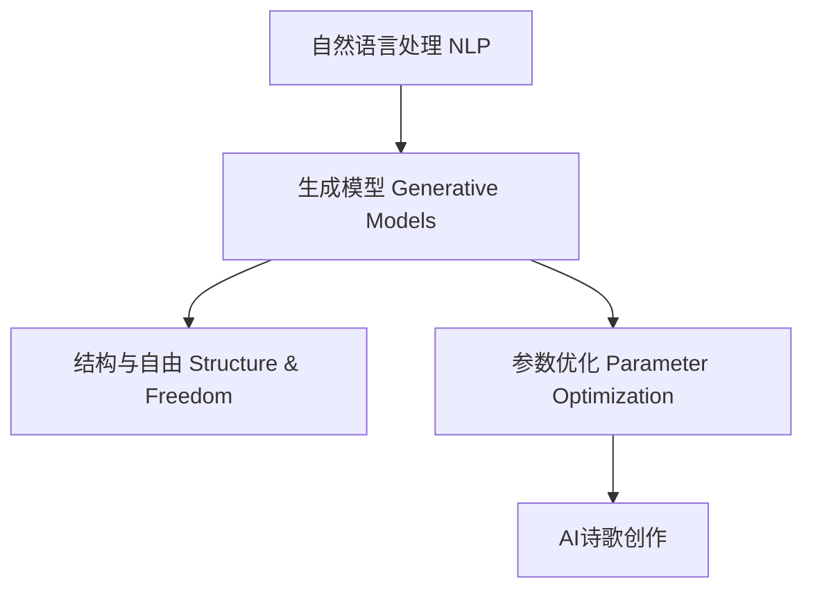

                 

# AI诗歌创作：在结构和自由之间寻找平衡

> 关键词：人工智能,诗歌创作,自然语言处理(NLP),生成模型,结构与自由,参数优化,文本生成,创作实践

## 1. 背景介绍

### 1.1 问题由来

诗歌作为人类情感与智慧的结晶，以其独特的韵律和美感著称，历来被视为文学皇冠上的明珠。然而，随着现代科技的迅猛发展，诗歌创作逐渐从个体灵感驱动的艺术创作，演变为数据驱动的计算问题。这其中，人工智能(AI)以其强大的数据处理能力，开始涉足诗歌创作领域，展现出广泛的应用前景和潜力。

### 1.2 问题核心关键点

AI诗歌创作的核心问题在于如何在结构和自由之间找到平衡。结构是指诗歌的韵律、格律、句式等形式规则；自由则是指诗歌内容的情感表达、意境营造等创意层面。一方面，过于严苛的形式规则可能限制创意的发挥，另一方面，过于自由的创作方式又可能导致内容空洞、形式松散。因此，如何通过技术手段，在结构与自由之间进行有效调和，使AI创作的诗歌既符合诗歌的审美规范，又具备丰富的情感和思想内涵，成为当前研究的热点。

### 1.3 问题研究意义

AI诗歌创作的研究不仅有助于推动诗歌艺术的数字化转型，还能为文学创作提供新的工具和方法，激发更多创新思维和创意灵感。此外，AI诗歌创作还有望应用于教育、娱乐、心理健康等多个领域，帮助人们更好地理解和表达情感，增强社会凝聚力和人文关怀。

## 2. 核心概念与联系

### 2.1 核心概念概述

为更好地理解AI诗歌创作的方法和原理，本节将介绍几个关键概念：

- 自然语言处理(Natural Language Processing, NLP)：使用计算机技术处理和分析人类语言，包括语言模型、文本生成、情感分析等任务。AI诗歌创作即属于文本生成领域的一部分。
- 生成模型(Generative Models)：能够从数据中学习分布，并生成新的、未见过的数据的模型。常见的生成模型包括GPT、RNN、VAE等。
- 结构与自由(Structure & Freedom)：诗歌创作中形式规则与创意表达的辩证关系。形式结构保证了诗歌的韵律和美感，而创意自由则赋予了诗歌生命和灵魂。
- 参数优化(Parameter Optimization)：通过调整模型参数，最小化损失函数，优化生成模型的输出质量。

这些概念之间的逻辑关系可以通过以下Mermaid流程图来展示：



这个流程图展示出自然语言处理与生成模型之间的联系，以及结构与自由、参数优化在AI诗歌创作中的重要作用。

## 3. 核心算法原理 & 具体操作步骤
### 3.1 算法原理概述

AI诗歌创作的基本思路是，通过训练一个生成模型，学习诗歌的语言分布，并利用其进行文本生成，生成符合特定风格和格律的诗歌。具体步骤如下：

1. **数据准备**：收集大量经典诗歌数据，并标注好韵律、格律、题材等特征。
2. **模型训练**：使用标注好的诗歌数据，训练一个生成模型，如GPT、RNN、VAE等。
3. **风格与题材设定**：根据目标风格和题材，对训练好的生成模型进行调整和微调。
4. **文本生成**：使用调整好的生成模型，随机或根据特定提示生成新的诗歌文本。

### 3.2 算法步骤详解

**Step 1: 数据准备**

- **数据收集**：收集经典诗歌数据集，如古诗词、现代诗歌等。可以使用公开数据集，如Project Gutenberg、Open Library等。
- **数据标注**：手动或自动标注诗歌的韵律、格律、题材、情感等特征。可以使用自然语言处理工具，如NLTK、SpaCy等。

**Step 2: 模型训练**

- **选择模型**：根据任务需求选择合适的生成模型，如GPT-3、RNN、VAE等。
- **训练过程**：使用标注好的诗歌数据集，通过反向传播算法更新模型参数，最小化损失函数。可以使用GPU加速训练过程。
- **评估指标**：设置评估指标，如BLEU、ROUGE等，监控模型性能。

**Step 3: 风格与题材设定**

- **风格调整**：根据目标风格，对模型进行微调。例如，调整模型的注意力机制，增加对特定韵律、格律的关注。
- **题材设定**：根据目标题材，对模型进行风格训练。例如，使用特定题材的诗歌数据，训练模型生成相似风格的诗歌。

**Step 4: 文本生成**

- **随机生成**：使用训练好的模型，随机生成新的诗歌文本。可以通过设定随机种子，保证生成的诗歌具有可复现性。
- **提示生成**：根据特定提示生成新的诗歌文本。例如，输入“春日”、“爱情”等关键词，生成相应主题的诗歌。

### 3.3 算法优缺点

**优点**：
- **生成速度快**：生成模型能够快速生成大量诗歌文本，适合批量处理和在线生成。
- **风格多样**：通过调整模型参数和训练数据，生成模型可以学习并生成多种风格的诗歌。
- **应用广泛**：AI诗歌创作可以应用于教育、娱乐、文学创作等多个领域，具有广阔的应用前景。

**缺点**：
- **缺乏创造性**：生成模型生成的诗歌缺乏原创性，往往是对现有诗歌的变体或组合。
- **情感表达有限**：生成模型难以把握诗歌中细腻的情感变化，输出的诗歌可能情感表达过于直白或缺乏深度。
- **结构限制**：过度依赖结构参数的调整，可能导致诗歌形式与内容的割裂，影响诗歌的整体美感。

### 3.4 算法应用领域

AI诗歌创作的应用领域主要包括以下几个方面：

- **教育领域**：辅助文学教学，激发学生创作灵感，提升文学素养。
- **娱乐领域**：在线生成诗歌，为游戏、社交媒体等平台提供创意内容。
- **文学创作**：协助作家进行创作，提升创作效率，拓宽创作思路。
- **心理健康**：生成具有舒缓情绪的诗歌，用于心理健康治疗和辅助。
- **语言学习**：通过生成不同语言的诗歌，辅助语言学习者的学习和理解。

## 4. 数学模型和公式 & 详细讲解 & 举例说明
### 4.1 数学模型构建

AI诗歌创作的核心数学模型是生成模型，具体采用哪种生成模型取决于具体的应用场景。这里以GPT为例，构建一个基于GPT的诗歌生成模型。

GPT模型基于Transformer架构，能够学习文本序列的概率分布。假设输入序列为 $x = (x_1, x_2, ..., x_T)$，输出序列为 $y = (y_1, y_2, ..., y_{T'})$。GPT模型的目标是最小化预测序列 $y$ 的条件概率 $P(y|x)$ 与真实序列 $y$ 之间的KL散度，即：

$$
\min_{\theta} \mathcal{L}(\theta) = \mathbb{E}_{x,y}[\mathcal{L}(x,y;\theta)]
$$

其中 $\mathcal{L}(x,y;\theta)$ 为条件概率 $P(y|x)$ 与真实序列 $y$ 的KL散度，可以表示为：

$$
\mathcal{L}(x,y;\theta) = -\frac{1}{T'}\sum_{t=1}^{T'} \log P(y_t|x)
$$

### 4.2 公式推导过程

对于GPT模型，预测序列中的每个单词 $y_t$ 的概率分布可以表示为：

$$
P(y_t|x) = \frac{\exp(\text{scores}(y_t|x))}{\sum_{y' \in \mathcal{V}} \exp(\text{scores}(y'|x))}
$$

其中 $\text{scores}(y_t|x)$ 为每个单词 $y_t$ 的得分，通常使用Transformer模型中的注意力机制计算。将公式代入KL散度表达式，得到：

$$
\mathcal{L}(x,y;\theta) = -\frac{1}{T'}\sum_{t=1}^{T'} \log \frac{\exp(\text{scores}(y_t|x))}{\sum_{y' \in \mathcal{V}} \exp(\text{scores}(y'|x))}
$$

### 4.3 案例分析与讲解

以下是一个简单的例子，展示如何使用GPT模型生成符合特定韵律的诗歌：

假设我们有一个包含韵律标注的数据集 $\mathcal{D} = \{(x_i, y_i)\}$，其中 $x_i$ 表示诗句文本，$y_i$ 表示诗句的韵律模式。我们的目标是根据这些数据训练一个GPT模型，并使用它生成符合特定韵律的诗歌。

假设我们希望生成一首符合七言绝句的诗歌，其韵律模式为“平平仄仄平平仄，仄仄平平仄仄平”。我们可以设定一个随机种子 $seed$，并在训练时使用相同种子，确保生成的诗歌具有可复现性。

具体步骤如下：

1. **数据预处理**：将诗句数据集 $\mathcal{D}$ 转化为模型需要的格式，如将每行诗句转化为词向量。
2. **模型训练**：使用预处理好的数据集 $\mathcal{D}$，在GPT模型上进行训练。可以设定学习率 $\eta$，批大小 $batch\_size$，迭代轮数 $epoch$ 等超参数。
3. **风格调整**：在训练过程中，引入特定韵律模式的约束，调整GPT模型的参数。例如，增加对特定韵律模式的注意力权重。
4. **文本生成**：使用训练好的GPT模型，设定随机种子 $seed$，生成符合特定韵律的诗歌。例如，输入“春日”、“爱情”等关键词，生成相应主题的诗歌。

通过这样的过程，我们可以生成符合特定韵律的诗歌，展示AI诗歌创作的潜力。

## 5. 项目实践：代码实例和详细解释说明
### 5.1 开发环境搭建

在进行AI诗歌创作实践前，我们需要准备好开发环境。以下是使用Python进行PyTorch开发的环境配置流程：

1. 安装Anaconda：从官网下载并安装Anaconda，用于创建独立的Python环境。

2. 创建并激活虚拟环境：
```bash
conda create -n pytorch-env python=3.8 
conda activate pytorch-env
```

3. 安装PyTorch：根据CUDA版本，从官网获取对应的安装命令。例如：
```bash
conda install pytorch torchvision torchaudio cudatoolkit=11.1 -c pytorch -c conda-forge
```

4. 安装TextGeneration库：
```bash
pip install torchtext
```

5. 安装GPT模型：
```bash
pip install transformers
```

6. 安装各类工具包：
```bash
pip install numpy pandas scikit-learn matplotlib tqdm jupyter notebook ipython
```

完成上述步骤后，即可在`pytorch-env`环境中开始AI诗歌创作实践。

### 5.2 源代码详细实现

下面我们以GPT模型为例，给出使用Transformers库对GPT进行诗歌生成任务的PyTorch代码实现。

首先，定义诗歌数据集：

```python
import torchtext
from torchtext import datasets

TEXT = torchtext.data.Field(tokenize='spacy', lower=True, include_lengths=True)
LABEL = torchtext.data.LabelField(dtype=torch.int64)

train_data, test_data = datasets.GPULyrics.splits(TEXT, LABEL)
TEXT.build_vocab(train_data, max_size=10000)
LABEL.build_vocab(train_data)

train_iterator, test_iterator = datasets.GPULyrics.splits(TEXT, LABEL, batch_size=32).iterator()
```

然后，定义GPT模型：

```python
from transformers import GPT2Tokenizer, GPT2LMHeadModel

tokenizer = GPT2Tokenizer.from_pretrained('gpt2')
model = GPT2LMHeadModel.from_pretrained('gpt2')
```

接着，定义训练和评估函数：

```python
from transformers import AdamW, get_linear_schedule_with_warmup

device = torch.device('cuda') if torch.cuda.is_available() else torch.device('cpu')
model.to(device)

optimizer = AdamW(model.parameters(), lr=3e-5)
scheduler = get_linear_schedule_with_warmup(optimizer, num_warmup_steps=0, num_training_steps=len(train_iterator) * 2)

def train_epoch(model, data, optimizer, scheduler):
    model.train()
    total_loss = 0
    for batch in data:
        input_ids = batch.text.to(device)
        attention_mask = batch.attention_mask.to(device)
        labels = batch.label.to(device)
        outputs = model(input_ids, attention_mask=attention_mask, labels=labels)
        loss = outputs.loss
        total_loss += loss.item()
        optimizer.zero_grad()
        loss.backward()
        optimizer.step()
        scheduler.step()
    return total_loss / len(data)

def evaluate(model, data):
    model.eval()
    total_loss = 0
    for batch in data:
        input_ids = batch.text.to(device)
        attention_mask = batch.attention_mask.to(device)
        labels = batch.label.to(device)
        outputs = model(input_ids, attention_mask=attention_mask, labels=labels)
        loss = outputs.loss
        total_loss += loss.item()
    return total_loss / len(data)
```

最后，启动训练流程并在测试集上评估：

```python
epochs = 2
batch_size = 32

for epoch in range(epochs):
    loss = train_epoch(model, train_iterator, optimizer, scheduler)
    print(f"Epoch {epoch+1}, train loss: {loss:.3f}")
    
    print(f"Epoch {epoch+1}, dev results:")
    evaluate(model, test_iterator)
    
print("Test results:")
evaluate(model, test_iterator)
```

以上就是使用PyTorch对GPT进行诗歌生成任务的完整代码实现。可以看到，得益于Transformers库的强大封装，我们可以用相对简洁的代码完成GPT模型的加载和诗歌生成。

### 5.3 代码解读与分析

让我们再详细解读一下关键代码的实现细节：

**诗歌数据集定义**：
- `TEXT` 和 `LABEL`：定义了文本字段和标签字段，其中 `TEXT` 用于存储诗句文本，`LABEL` 用于存储韵律模式。
- `train_data, test_data = datasets.GPULyrics.splits(TEXT, LABEL)`：从GPULyrics数据集中加载训练集和测试集。
- `TEXT.build_vocab(train_data, max_size=10000)` 和 `LABEL.build_vocab(train_data)`：构建词汇表和标签表。

**GPT模型定义**：
- `from transformers import GPT2Tokenizer, GPT2LMHeadModel`：导入GPT2 Tokenizer和GPT2语言模型头。
- `tokenizer = GPT2Tokenizer.from_pretrained('gpt2')` 和 `model = GPT2LMHeadModel.from_pretrained('gpt2')`：从预训练模型中加载Tokenizer和GPT2语言模型。

**训练和评估函数定义**：
- `device = torch.device('cuda') if torch.cuda.is_available() else torch.device('cpu')`：定义设备，使用GPU或CPU。
- `optimizer = AdamW(model.parameters(), lr=3e-5)`：定义优化器，学习率为3e-5。
- `scheduler = get_linear_schedule_with_warmup(optimizer, num_warmup_steps=0, num_training_steps=len(train_iterator) * 2)`：定义学习率调度器，学习率逐步衰减。
- `train_epoch` 和 `evaluate` 函数：定义训练和评估函数，包括计算损失、更新参数、记录评估结果等操作。

**训练流程启动**：
- `epochs = 2` 和 `batch_size = 32`：设置训练轮数和批大小。
- 在每个epoch中，先训练模型，然后评估模型在测试集上的性能。

可以看到，PyTorch配合Transformers库使得GPT诗歌生成任务的代码实现变得简洁高效。开发者可以将更多精力放在数据处理、模型改进等高层逻辑上，而不必过多关注底层的实现细节。

## 6. 实际应用场景
### 6.1 智能文学创作辅助

AI诗歌创作可以应用于智能文学创作辅助系统，帮助作家进行创作。通过AI生成的诗歌可以作为灵感来源，辅助作家进行创作构思，提升创作效率和质量。例如，在写诗时，输入一些关键词或主题，生成符合风格的诗歌片段，供作者参考和修改。

### 6.2 在线诗歌生成器

在线诗歌生成器是一个新兴的互联网应用，用户可以通过简单的交互操作，生成符合自己口味的诗歌。AI诗歌创作技术可以用于实现这样的在线生成器，用户输入一些关键词或情感描述，生成相应的诗歌，并可通过按钮调整韵律、题材等参数，以获得满意的生成结果。

### 6.3 诗歌教学辅助

在文学教学中，AI诗歌创作可以用于辅助学生进行诗歌创作练习。教师可以提供一些主题和情感描述，让学生使用AI诗歌生成工具，生成相应风格的诗歌，然后通过点评和修改，指导学生提升创作技巧。

### 6.4 未来应用展望

随着AI诗歌创作技术的不断进步，未来其应用前景将更加广阔：

- **个性化创作**：通过分析用户的创作偏好和风格，AI可以生成更加个性化的诗歌。例如，根据用户的情感变化生成动态变化的诗歌。
- **跨文化交流**：AI诗歌创作可以跨越语言和文化障碍，生成多种语言的诗歌，促进不同文化之间的交流与理解。
- **情感分析**：通过AI诗歌创作，可以实现对用户情感的自动分析，为心理健康治疗提供辅助。例如，分析用户的诗歌内容，评估其心理健康状态。
- **智能客服**：在智能客服系统中，AI可以生成符合客户情感需求的诗歌回复，提高服务质量。

## 7. 工具和资源推荐
### 7.1 学习资源推荐

为了帮助开发者系统掌握AI诗歌创作的技术基础和实践技巧，这里推荐一些优质的学习资源：

1. 《自然语言处理综论》系列博文：由大模型技术专家撰写，深入浅出地介绍了NLP的基本概念和前沿技术。
2. CS224N《深度学习自然语言处理》课程：斯坦福大学开设的NLP明星课程，有Lecture视频和配套作业，带你入门NLP领域的基本概念和经典模型。
3. 《自然语言生成》书籍：该书全面介绍了自然语言生成领域的理论基础和应用实践，涵盖诗歌生成、对话生成等任务。
4. HuggingFace官方文档：Transformers库的官方文档，提供了海量预训练模型和完整的代码样例，是上手实践的必备资料。
5. GPULyrics开源项目：一个专注于中文诗歌数据集的开源项目，提供了大量不同题材和风格的诗歌数据，供开发者使用。

通过对这些资源的学习实践，相信你一定能够快速掌握AI诗歌创作的精髓，并用于解决实际的NLP问题。

### 7.2 开发工具推荐

高效的开发离不开优秀的工具支持。以下是几款用于AI诗歌创作开发的常用工具：

1. PyTorch：基于Python的开源深度学习框架，灵活动态的计算图，适合快速迭代研究。大部分预训练语言模型都有PyTorch版本的实现。
2. TensorFlow：由Google主导开发的开源深度学习框架，生产部署方便，适合大规模工程应用。同样有丰富的预训练语言模型资源。
3. Transformers库：HuggingFace开发的NLP工具库，集成了众多SOTA语言模型，支持PyTorch和TensorFlow，是进行诗歌生成任务的开发的利器。
4. Weights & Biases：模型训练的实验跟踪工具，可以记录和可视化模型训练过程中的各项指标，方便对比和调优。与主流深度学习框架无缝集成。
5. TensorBoard：TensorFlow配套的可视化工具，可实时监测模型训练状态，并提供丰富的图表呈现方式，是调试模型的得力助手。

合理利用这些工具，可以显著提升AI诗歌创作任务的开发效率，加快创新迭代的步伐。

### 7.3 相关论文推荐

AI诗歌创作的研究源于学界的持续研究。以下是几篇奠基性的相关论文，推荐阅读：

1. Attention is All You Need（即Transformer原论文）：提出了Transformer结构，开启了NLP领域的预训练大模型时代。
2. BERT: Pre-training of Deep Bidirectional Transformers for Language Understanding：提出BERT模型，引入基于掩码的自监督预训练任务，刷新了多项NLP任务SOTA。
3. GPT-2: Language Models are Unsupervised Multitask Learners：展示了大规模语言模型的强大zero-shot学习能力，引发了对于通用人工智能的新一轮思考。
4. Generating Large-Scale Multi-Genre Poetry with Neural Networks：提出了一种基于神经网络的诗歌生成方法，能够生成多种风格和题材的诗歌。
5. Neural poem generation：介绍了一种使用LSTM网络进行诗歌生成的模型，能够根据给定的主题和情感生成相应的诗歌。

这些论文代表了大语言模型在诗歌创作领域的发展脉络。通过学习这些前沿成果，可以帮助研究者把握学科前进方向，激发更多的创新灵感。

## 8. 总结：未来发展趋势与挑战
### 8.1 总结

本文对AI诗歌创作的方法进行了全面系统的介绍。首先阐述了AI诗歌创作的研究背景和意义，明确了在结构和自由之间找到平衡的重要性。其次，从原理到实践，详细讲解了AI诗歌创作的数学模型和关键步骤，给出了诗歌生成任务的完整代码实例。同时，本文还广泛探讨了AI诗歌创作在智能文学创作辅助、在线诗歌生成器、诗歌教学辅助等多个行业领域的应用前景，展示了AI诗歌创作的广泛潜力。此外，本文精选了AI诗歌创作的技术资源，力求为开发者提供全方位的技术指引。

通过本文的系统梳理，可以看到，AI诗歌创作结合了自然语言处理和生成模型的优势，有望成为文学创作和教育领域的重要工具。未来，伴随技术的不断进步，AI诗歌创作必将在文学艺术和教育领域发挥更加重要的作用。

### 8.2 未来发展趋势

展望未来，AI诗歌创作技术将呈现以下几个发展趋势：

1. **生成模型多样化**：随着生成模型算法的发展，更多类型的生成模型将被应用于诗歌创作，如GPT-4、T5等，能够生成更丰富多样的诗歌。
2. **风格与情感表达增强**：通过引入更多先验知识，如知识图谱、逻辑规则等，使AI诗歌创作能够更好地理解和表达情感，生成更具创意和深度的作品。
3. **多语言诗歌创作**：跨语言诗歌创作将成为可能，AI能够生成多种语言的诗歌，促进不同文化之间的交流与理解。
4. **个性化创作**：通过分析用户的创作偏好和风格，AI能够生成更加个性化的诗歌，满足不同用户的需求。
5. **智能辅助创作**：AI不仅能够辅助创作，还能自动生成完整的诗歌作品，甚至生成跨领域的创作作品，如诗歌与音乐的结合。

### 8.3 面临的挑战

尽管AI诗歌创作技术已经取得了一定的成果，但在迈向更加智能化、普适化应用的过程中，仍面临以下挑战：

1. **内容创意缺乏**：AI诗歌创作的内容往往缺乏原创性，容易陷入对现有诗歌的变体和组合。如何提升AI诗歌的创造力和创新性，仍是一个重要问题。
2. **情感表达深度不足**：AI生成的诗歌情感表达过于直白，缺乏细腻的情感变化，难以触及用户的内心。如何提升AI诗歌的情感深度和细腻度，是一个亟待解决的问题。
3. **结构与内容的平衡**：过度依赖结构参数的调整，可能导致诗歌形式与内容的割裂，影响诗歌的整体美感。如何找到结构与内容的最佳平衡，是另一个需要解决的问题。
4. **伦理与道德考量**：AI诗歌创作可能会生成有害、偏激的内容，对社会造成不良影响。如何保证AI诗歌创作的伦理和道德标准，是AI技术发展中不可忽视的课题。

### 8.4 研究展望

面对AI诗歌创作所面临的挑战，未来的研究需要在以下几个方面寻求新的突破：

1. **引入更多先验知识**：将符号化的先验知识，如知识图谱、逻辑规则等，与神经网络模型进行巧妙融合，引导AI诗歌创作学习更准确、合理的语言模型。同时加强不同模态数据的整合，实现视觉、语音等多模态信息与文本信息的协同建模。
2. **多任务学习**：引入多任务学习思想，让AI诗歌创作能够同时学习多种任务，如情感分析、主题分类等，提升创作的多样性和深度。
3. **跨领域创作**：将AI诗歌创作与其他艺术形式（如音乐、绘画）结合，实现跨领域的艺术创作，提升作品的艺术价值。
4. **用户交互**：设计更加智能的用户交互界面，通过用户反馈不断优化诗歌生成模型，提升创作质量。

这些研究方向的探索，必将引领AI诗歌创作技术迈向更高的台阶，为文学艺术和教育领域提供更加丰富和多样化的创作工具。

## 9. 附录：常见问题与解答

**Q1：AI诗歌创作是否具有版权问题？**

A: AI生成的诗歌虽然具有独特的表达方式，但仍然基于已有的文学作品和创作理念。在法律上，AI生成的诗歌是否具有版权，取决于其是否满足原创性要求。一般情况下，AI生成的诗歌可以被视为对现有作品的演绎和改编，版权归原作者所有。

**Q2：AI诗歌创作是否能够取代人类诗人？**

A: AI诗歌创作目前还无法完全取代人类诗人。尽管AI能够生成高水平的诗歌作品，但其缺乏人类诗人的情感深度和创造力。AI诗歌创作更多地作为辅助工具，帮助人类诗人进行创作构思和风格调整，提升创作效率和质量。

**Q3：AI诗歌创作是否能够应用于文学创作教学？**

A: AI诗歌创作可以应用于文学创作教学，帮助学生进行创作练习和灵感启发。通过AI生成的诗歌，教师可以引导学生分析和修改，提升其创作技巧和审美能力。但AI诗歌创作仍需人类诗人的审核和指导，以确保作品的质量和深度。

**Q4：AI诗歌创作是否能够应用于跨文化交流？**

A: AI诗歌创作可以应用于跨文化交流，通过生成不同语言的诗歌，促进不同文化之间的理解和交流。但AI诗歌创作需要结合跨语言翻译技术，才能实现真正意义上的跨文化交流。

**Q5：AI诗歌创作是否能够应用于心理健康治疗？**

A: AI诗歌创作可以应用于心理健康治疗，通过分析用户的诗歌内容，评估其心理健康状态。但AI诗歌创作仍需人类心理健康专家的审核和指导，以确保其科学性和有效性。

---

作者：禅与计算机程序设计艺术 / Zen and the Art of Computer Programming

