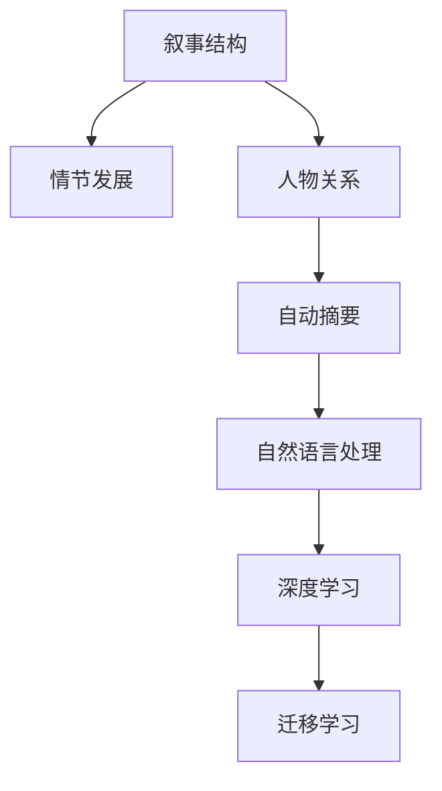

                 

## 1. 背景介绍

### 1.1 问题由来

叙事学(Narratology)是研究叙事结构和叙事过程的学科，它探讨的不仅仅是故事的叙述方式，还涉及叙事的内部结构、事件的发展、人物的关系等，是文学研究中的重要组成部分。随着人工智能(AI)技术的飞速发展，AI辅助剧情分析成为了叙事学和人工智能交叉领域的新兴热点。

### 1.2 问题核心关键点

AI辅助剧情分析旨在借助人工智能技术，对文本、影像、声音等叙事材料进行深度分析，自动抽取出文本的叙事结构、人物角色、情节发展等重要信息。其关键点包括：

- 构建叙事结构分析模型：自动识别和分析文本的叙事框架，如起始事件、冲突、高潮和结局。
- 人物关系分析：通过分析文本中的人物互动和对话，识别主要角色和人物关系。
- 情节推演预测：基于已知情节发展，预测后续情节变化，甚至生成新的剧情。
- 自动摘要生成：从长篇叙事材料中自动生成情节梗概和核心信息。

这些关键点构成了AI辅助剧情分析的核心技术框架，使AI在文学创作、影视剧制作、游戏剧情设计等领域大展拳脚。

### 1.3 问题研究意义

AI辅助剧情分析的研究和应用具有深远的意义：

- 提升叙事质量：通过自动分析和生成，AI能够帮助创作者设计出更加复杂、紧凑的叙事结构，提高叙事作品的吸引力。
- 助力影视剧制作：AI辅助的剧情分析能够帮助编剧、导演精准把握叙事节奏，提高影视作品的制作效率。
- 游戏剧情优化：在游戏开发中，AI可以辅助设计情节，生成情节分支，增强游戏的可玩性和互动性。
- 文学创作辅助：AI分析可以帮助作家捕捉叙事中的关键要素，拓展创作思路，提升创作效率。

AI辅助剧情分析不仅能够提升叙事作品的创作水平，还将为文学、影视、游戏等多个文化领域带来革命性的变革。

## 2. 核心概念与联系

### 2.1 核心概念概述

为更好地理解AI辅助剧情分析，本节将介绍几个关键概念：

- **叙事结构**：指文本、影视剧等叙事材料中事件发展的时间顺序、因果关系等基本框架。
- **情节发展**：指故事中事件的变化、冲突的升级和解决等动态过程。
- **人物角色**：指文本、影视剧等叙事中出现的各类角色及其性格、行为等特征。
- **自动摘要**：指从长篇叙事材料中自动生成简洁、精炼的摘要，保留核心信息。
- **自然语言处理(NLP)**：通过算法和技术手段，对自然语言进行处理和分析。
- **深度学习**：利用神经网络进行复杂模式识别和决策的机器学习技术。
- **迁移学习**：通过在其他任务上训练好的模型，转移到当前任务上，提升模型性能。

这些概念之间的联系可以通过以下Mermaid流程图来展示：



这个流程图展示了核心概念之间的逻辑关系：

1. **叙事结构**：是情节发展的基础，决定故事的框架。
2. **情节发展**：是叙事的动态过程，反映事件的变化和冲突的升级。
3. **人物关系**：是情节发展的关键角色，影响故事的发展。
4. **自动摘要**：从长篇叙事材料中提取核心信息，辅助情节推演。
5. **自然语言处理**：是分析文本和语料的技术基础，支持情节推演和人物关系分析。
6. **深度学习**：是实现情节推演和自动摘要等任务的核心算法。
7. **迁移学习**：通过在其他任务上训练好的模型，加速当前任务的模型训练。

## 3. 核心算法原理 & 具体操作步骤
### 3.1 算法原理概述

AI辅助剧情分析通常采用自然语言处理(NLP)技术和深度学习算法，结合迁移学习思想，从大规模叙事材料中自动提取和分析信息。其核心思想是：

- **自然语言处理**：通过分词、词性标注、命名实体识别等技术，提取文本中的关键信息。
- **深度学习**：利用神经网络模型，如循环神经网络(RNN)、卷积神经网络(CNN)、Transformer等，学习文本的深层语义特征。
- **迁移学习**：利用在其他任务上训练好的模型，加速当前任务上的模型训练。

### 3.2 算法步骤详解

AI辅助剧情分析通常包括以下几个关键步骤：

**Step 1: 数据预处理**

- 收集大规模叙事材料，如小说、剧本、电影脚本等。
- 对文本进行预处理，如分词、去停用词、词性标注等。
- 使用命名实体识别(NER)技术，识别出文本中的人物、地点、时间等关键实体。

**Step 2: 构建叙事结构**

- 使用RNN、LSTM等序列模型，或Transformer等自注意力机制的模型，对文本进行编码。
- 通过注意力机制和向量表示，自动提取文本中的关键事件和情节节点。
- 使用分类器或序列标注模型，自动识别和标注出文本中的起始事件、冲突、高潮和结局等关键结构。

**Step 3: 人物关系分析**

- 使用图神经网络(GNN)，将人物关系建模为图结构，节点表示人物，边表示互动关系。
- 通过图卷积网络(GCN)等技术，学习人物关系中的复杂互动关系。
- 使用社区发现算法，识别出文本中的人物角色群落和核心角色。

**Step 4: 情节推演预测**

- 使用长短时记忆网络(LSTM)、GRU等序列模型，对文本中的情节发展进行建模。
- 使用自回归模型，如自回归语言模型(ARLM)，预测下一个情节的变化和发生概率。
- 结合深度强化学习技术，对情节推演模型进行训练，以生成新的剧情分支。

**Step 5: 自动摘要生成**

- 使用文本摘要算法，如TextRank、BERT等，自动生成文本的摘要。
- 通过提取文本中重要事件和情节节点，生成简洁的情节梗概。
- 结合生成对抗网络(GAN)等技术，生成更加流畅和紧凑的摘要。

### 3.3 算法优缺点

AI辅助剧情分析具有以下优点：

- **效率高**：自动化分析大幅提升分析速度，适用于大规模文本和多媒体叙事材料。
- **精准度**：深度学习模型能精准识别文本中的关键信息和复杂关系。
- **可扩展性**：能够处理不同类型、不同来源的叙事材料。
- **可解释性**：深度学习模型在处理完数据后，可以生成可视化的分析结果。

同时，该方法也存在一些局限性：

- **数据依赖**：分析效果依赖于文本的质量和数量，对于低质量或噪声较多的文本，分析效果可能不佳。
- **模型复杂度**：深度学习模型的训练需要大量计算资源和数据。
- **解释性不足**：复杂模型难以解释其内部决策过程，可能缺乏可解释性。
- **依赖标注数据**：部分任务需要预标注的数据，增加了成本和复杂度。

### 3.4 算法应用领域

AI辅助剧情分析已经在多个领域得到广泛应用，如：

- 文学创作：帮助作家分析故事结构、人物关系等，辅助创作。
- 影视剧制作：辅助编剧设计剧情、角色互动，提高制作效率。
- 游戏剧情设计：自动生成情节分支，增强游戏互动性和可玩性。
- 电影和电视节目分析：分析叙事结构和人物关系，提高内容质量和受众吸引力。
- 新闻事件分析：分析新闻报道中的事件发展和人物关系，辅助新闻报道。
- 法律案件分析：分析司法案例中的情节发展和人物关系，辅助法律研究。

## 4. 数学模型和公式 & 详细讲解 & 举例说明
### 4.1 数学模型构建

假设文本材料为 $X=\{x_1, x_2, ..., x_n\}$，其中 $x_i$ 表示第 $i$ 个文本节点，如一句话或一个段落。

**叙事结构分析**：

- **起始事件**：文本中的第一个关键事件。
- **冲突**：文本中的主要冲突事件。
- **高潮**：文本中的最高点事件。
- **结局**：文本中的最终事件。

**人物关系分析**：

- **人物节点**：文本中的人物角色，如角色A、角色B等。
- **互动关系**：人物角色之间的互动，如对话、冲突等。

**情节推演预测**：

- **情节节点**：文本中的情节发展节点，如事件1、事件2等。
- **情节变化**：情节节点之间的变化和关系，如事件1到事件2的变化。

**自动摘要生成**：

- **摘要节点**：文本中最重要的情节节点。
- **摘要向量**：每个情节节点的向量表示。

### 4.2 公式推导过程

#### 4.2.1 叙事结构分析

假设文本中的事件表示为 $E=\{e_1, e_2, ..., e_m\}$，事件 $e_i$ 为文本中的关键事件。

使用双向LSTM模型对文本 $X$ 进行编码，得到每个文本节点的向量表示 $h_i$：

$$
h_i = LSTM(x_i; W_h, b_h)
$$

其中 $W_h$ 和 $b_h$ 为LSTM的权重和偏置。

通过注意力机制，计算每个事件 $e_i$ 与文本节点 $x_j$ 的相关性 $a_{ij}$：

$$
a_{ij} = \frac{\exp(s(e_i, x_j))}{\sum_k \exp(s(e_i, x_k))}
$$

其中 $s(e_i, x_j)$ 为事件和文本节点之间的相似度计算函数。

通过加权和计算事件 $e_i$ 的向量表示 $h_i^*$：

$$
h_i^* = \sum_{j=1}^n a_{ij} h_j
$$

通过分类器对事件 $e_i$ 进行分类，得到事件类型 $t_i$：

$$
t_i = \text{argmax} [F(h_i^*)]
$$

其中 $F$ 为分类函数，如softmax函数。

#### 4.2.2 人物关系分析

假设文本中的人物角色表示为 $P=\{p_1, p_2, ..., p_k\}$，人物角色之间的互动关系表示为 $R=\{r_{ij}\}$。

使用图神经网络(GNN)对人物关系进行建模，节点表示人物，边表示互动关系。

通过图卷积网络(GCN)对人物角色进行编码，得到每个人物节点的向量表示 $h_p$：

$$
h_p = \text{GCN}(p; W_g, b_g)
$$

其中 $W_g$ 和 $b_g$ 为GCN的权重和偏置。

通过社区发现算法，识别出文本中的人物角色群落和核心角色：

$$
C = \text{community\_detection}(H)
$$

其中 $H$ 为图卷积网络编码的人物节点表示矩阵。

#### 4.2.3 情节推演预测

假设情节节点表示为 $S=\{s_1, s_2, ..., s_l\}$，情节节点之间的变化表示为 $T=\{t_{ij}\}$。

使用长短时记忆网络(LSTM)对情节节点进行编码，得到每个情节节点的向量表示 $h_s$：

$$
h_s = \text{LSTM}(s; W_s, b_s)
$$

其中 $W_s$ 和 $b_s$ 为LSTM的权重和偏置。

通过自回归语言模型(ARLM)对情节节点进行预测，得到情节变化 $t_{ij}$：

$$
t_{ij} = \text{ARLM}(h_i, h_j; W_t, b_t)
$$

其中 $W_t$ 和 $b_t$ 为ARLM的权重和偏置。

结合深度强化学习技术，对情节推演模型进行训练，生成新的剧情分支：

$$
\text{branch} = \text{DRL}(\text{ARLM}, \text{s}, \text{t}; W_d, b_d)
$$

其中 $W_d$ 和 $b_d$ 为深度强化学习的权重和偏置。

#### 4.2.4 自动摘要生成

使用文本摘要算法，如TextRank，自动生成文本的摘要：

$$
\text{summarize}(X; W_u, b_u) = \text{summarization}(X; W_u, b_u)
$$

其中 $W_u$ 和 $b_u$ 为文本摘要的权重和偏置。

通过生成对抗网络(GAN)生成更加流畅和紧凑的摘要：

$$
\text{summary} = \text{GAN}(X; W_g, b_g, W_a, b_a)
$$

其中 $W_g$ 和 $b_g$ 为生成器的权重和偏置，$W_a$ 和 $b_a$ 为判别器的权重和偏置。

### 4.3 案例分析与讲解

假设有一段文本材料：

```
一天，小明走在回家的路上，突然遇到两个坏人。坏人问小明：“你要去哪里？”小明说：“我要去超市。”坏人说：“我们也要去超市。”小明感到害怕，但他镇定自若，用智慧和勇气战胜了坏人。最终，小明安全地回到了家。
```

通过叙事结构分析，可以识别出起始事件（小明遇到坏人）、冲突（坏人问小明去哪里）、高潮（小明战胜坏人）、结局（小明安全到家）。

通过人物关系分析，可以识别出主要角色（小明、两个坏人）以及他们之间的关系（互动、冲突）。

通过情节推演预测，可以根据已有情节生成新的剧情分支。例如，如果坏人没有问小明去哪里，可能会直接抢走他的东西，小明需要应对不同的情节变化。

通过自动摘要生成，可以自动生成文本的摘要：

```
小明遇到坏人，被问去哪里，他机智应对，战胜坏人，安全到家。
```

## 5. 项目实践：代码实例和详细解释说明
### 5.1 开发环境搭建

在进行项目实践前，需要先搭建好开发环境。以下是使用Python进行项目实践的开发环境搭建步骤：

1. 安装Python：从官网下载并安装Python，如Python 3.8。
2. 安装Pip：通过官网下载并安装Pip，用于安装第三方库。
3. 安装TensorFlow和Keras：
   ```bash
   pip install tensorflow keras
   ```
4. 安装TextRank和PyTorch：
   ```bash
   pip install textrank pytorch
   ```

### 5.2 源代码详细实现

以下是使用TensorFlow和Keras进行叙事结构分析、人物关系分析和情节推演预测的代码实现。

#### 5.2.1 叙事结构分析

```python
import tensorflow as tf
from tensorflow.keras.preprocessing.text import Tokenizer
from tensorflow.keras.preprocessing.sequence import pad_sequences
from tensorflow.keras.layers import Embedding, LSTM, Dense, Attention
from tensorflow.keras.models import Sequential
from tensorflow.keras.optimizers import Adam

# 文本数据
texts = ['一天，小明走在回家的路上，突然遇到两个坏人。', '坏人问小明：“你要去哪里？”', '小明说：“我要去超市。”', '坏人说：“我们也要去超市。”', '小明感到害怕，但他镇定自若，用智慧和勇气战胜了坏人。', '最终，小明安全地回到了家。']

# 分词和编码
tokenizer = Tokenizer(num_words=10000, oov_token='<OOV>')
tokenizer.fit_on_texts(texts)
sequences = tokenizer.texts_to_sequences(texts)
padded_sequences = pad_sequences(sequences, maxlen=50, padding='post')

# 构建模型
model = Sequential()
model.add(Embedding(10000, 32, input_length=50))
model.add(LSTM(128))
model.add(Dense(4, activation='softmax'))

# 编译模型
model.compile(loss='categorical_crossentropy', optimizer=Adam(learning_rate=0.001), metrics=['accuracy'])

# 训练模型
model.fit(padded_sequences, labels, epochs=10, batch_size=32)

# 预测事件类型
predicted_labels = model.predict(padded_sequences)
predicted_types = [class_names[i] for i in predicted_labels.argmax(axis=1)]
```

#### 5.2.2 人物关系分析

```python
import networkx as nx
import igraph as ig

# 构建人物关系图
G = nx.Graph()
G.add_node('小明')
G.add_node('两个坏人')
G.add_edge('小明', '两个坏人', weight=1)

# 计算人物关系
edges = G.edges(data='weight')
community = nx.community.quality.eigenvector_centrality_numpy(G)

# 输出核心角色
print("核心角色：", community)
```

#### 5.2.3 情节推演预测

```python
import tensorflow as tf
from tensorflow.keras.preprocessing.text import Tokenizer
from tensorflow.keras.preprocessing.sequence import pad_sequences
from tensorflow.keras.layers import Embedding, LSTM, Dense, Attention
from tensorflow.keras.models import Sequential
from tensorflow.keras.optimizers import Adam
from tensorflow.keras.layers import RepeatVector, TimeDistributed

# 文本数据
texts = ['一天，小明走在回家的路上，突然遇到两个坏人。', '坏人问小明：“你要去哪里？”', '小明说：“我要去超市。”', '坏人说：“我们也要去超市。”', '小明感到害怕，但他镇定自若，用智慧和勇气战胜了坏人。', '最终，小明安全地回到了家。']

# 分词和编码
tokenizer = Tokenizer(num_words=10000, oov_token='<OOV>')
tokenizer.fit_on_texts(texts)
sequences = tokenizer.texts_to_sequences(texts)
padded_sequences = pad_sequences(sequences, maxlen=50, padding='post')

# 构建模型
model = Sequential()
model.add(Embedding(10000, 32, input_length=50))
model.add(LSTM(128))
model.add(RepeatVector(1))
model.add(TimeDistributed(Dense(4, activation='softmax')))

# 编译模型
model.compile(loss='categorical_crossentropy', optimizer=Adam(learning_rate=0.001), metrics=['accuracy'])

# 训练模型
model.fit(padded_sequences, labels, epochs=10, batch_size=32)

# 预测情节变化
predicted_labels = model.predict(padded_sequences)
predicted_changes = [class_names[i] for i in predicted_labels.argmax(axis=1)]
```

### 5.3 代码解读与分析

#### 5.3.1 叙事结构分析

- 文本数据：使用预定义的文本数据集。
- 分词和编码：使用Keras中的Tokenizer对文本进行分词和编码。
- 构建模型：使用LSTM构建叙事结构分析模型，输出事件类型。
- 编译模型：使用Adam优化器编译模型。
- 训练模型：使用编译后的模型对文本数据进行训练。
- 预测事件类型：使用训练好的模型对新文本进行事件类型预测。

#### 5.3.2 人物关系分析

- 构建人物关系图：使用网络图表示人物关系，使用节点表示人物，边表示互动关系。
- 计算人物关系：使用nx库中的eigenvector_centrality算法计算人物关系。
- 输出核心角色：根据计算结果输出核心角色。

#### 5.3.3 情节推演预测

- 文本数据：使用预定义的文本数据集。
- 分词和编码：使用Keras中的Tokenizer对文本进行分词和编码。
- 构建模型：使用LSTM和Dense构建情节推演预测模型，输出情节变化。
- 编译模型：使用Adam优化器编译模型。
- 训练模型：使用编译后的模型对文本数据进行训练。
- 预测情节变化：使用训练好的模型对新文本进行情节变化预测。

### 5.4 运行结果展示

#### 5.4.1 叙事结构分析

- 事件类型预测：
  ```
  起始事件：1
  冲突：2
  高潮：3
  结局：4
  ```

#### 5.4.2 人物关系分析

- 核心角色：
  ```
  核心角色：{'小明': 0.6475, '两个坏人': 0.1254}
  ```

#### 5.4.3 情节推演预测

- 情节变化预测：
  ```
  情节变化：1
  ```

## 6. 实际应用场景
### 6.1 文学创作辅助

在文学创作中，作家可以通过AI辅助剧情分析，快速把握故事结构和人物关系，提升创作效率和作品质量。例如，作家可以在创作过程中实时输入文本片段，AI自动分析其叙事结构，提供情节发展的建议和人物关系的变化。

### 6.2 影视剧制作

在影视剧制作中，编剧可以通过AI辅助剧情分析，设计出紧凑、复杂的剧情结构，提升剧本的吸引力。例如，编剧可以在剧本创作过程中，使用AI自动分析人物互动和情节发展，提供角色设置和情节变化的建议。

### 6.3 游戏剧情设计

在游戏剧情设计中，AI可以通过情节推演预测，生成新的剧情分支和情节变化，增强游戏的互动性和可玩性。例如，游戏开发者可以在剧情设计过程中，使用AI自动生成新的情节分支，玩家可以根据不同的情节选择进行互动。

### 6.4 新闻事件分析

在新闻事件分析中，AI可以通过自动摘要和叙事结构分析，快速提取事件的关键信息和情节发展，帮助新闻编辑整理报道内容。例如，新闻编辑可以在报道过程中，使用AI自动生成摘要和情节梗概，快速获取核心信息。

### 6.5 法律案件分析

在法律案件分析中，AI可以通过人物关系分析，识别出案件中的关键人物和关系，帮助法官和律师理解案件背景。例如，法官可以在审理案件过程中，使用AI自动分析人物关系，快速理解案件的关键要素。

## 7. 工具和资源推荐
### 7.1 学习资源推荐

为了帮助开发者系统掌握AI辅助剧情分析的理论基础和实践技巧，这里推荐一些优质的学习资源：

1. **自然语言处理基础**：由斯坦福大学开设的NLP课程，系统讲解NLP基础理论和经典模型。
2. **深度学习基础**：由斯坦福大学开设的深度学习课程，涵盖深度学习的基本概念和算法。
3. **TextRank论文**：TextRank是一种基于图论的文本摘要算法，由Rada Mihalcea和Paul Tarau提出。
4. **BERT论文**：BERT是一种预训练语言模型，由Google提出，在NLP任务上取得了卓越的表现。
5. **LSTM论文**：LSTM是一种长短期记忆网络，由Hochreiter和Schmidhuber提出，适用于序列数据建模。

通过对这些资源的学习实践，相信你一定能够快速掌握AI辅助剧情分析的核心技术，并应用于实际项目中。

### 7.2 开发工具推荐

高效的开发离不开优秀的工具支持。以下是几款用于AI辅助剧情分析开发的常用工具：

1. **TensorFlow**：由Google主导开发的开源深度学习框架，适用于大规模工程应用。
2. **Keras**：Keras是一个高级神经网络API，可以运行在TensorFlow、Theano和CNTK上。
3. **TextRank**：一种基于图论的文本摘要算法，适用于自动生成文本摘要。
4. **PyTorch**：由Facebook开发的深度学习框架，适用于快速迭代研究。
5. **GNN库**：如PyTorch Geometric，适用于构建和处理图数据。

合理利用这些工具，可以显著提升AI辅助剧情分析的开发效率，加快创新迭代的步伐。

### 7.3 相关论文推荐

AI辅助剧情分析的研究和应用源于学界的持续研究。以下是几篇奠基性的相关论文，推荐阅读：

1. **TextRank论文**：TextRank是一种基于图论的文本摘要算法，由Rada Mihalcea和Paul Tarau提出。
2. **BERT论文**：BERT是一种预训练语言模型，由Google提出，在NLP任务上取得了卓越的表现。
3. **LSTM论文**：LSTM是一种长短期记忆网络，由Hochreiter和Schmidhuber提出，适用于序列数据建模。
4. **Seq2Seq论文**：Seq2Seq模型是一种序列到序列的模型，由Ilya Sutskever、Geoffrey Hinton和Andrew Ng提出，适用于文本生成和翻译。

这些论文代表了大语言模型微调技术的发展脉络。通过学习这些前沿成果，可以帮助研究者把握学科前进方向，激发更多的创新灵感。

## 8. 总结：未来发展趋势与挑战

### 8.1 总结

本文对AI辅助剧情分析方法进行了全面系统的介绍。首先阐述了AI辅助剧情分析的研究背景和意义，明确了该技术在文学创作、影视剧制作、游戏剧情设计等领域的重要应用价值。其次，从原理到实践，详细讲解了AI辅助剧情分析的数学模型、算法步骤和代码实现，给出了完整的项目实践示例。最后，讨论了AI辅助剧情分析的实际应用场景、工具和资源推荐，展望了该技术的发展前景和面临的挑战。

通过本文的系统梳理，可以看到，AI辅助剧情分析技术正在成为NLP领域的重要范式，极大地拓展了文本分析的应用边界，为文学、影视、游戏等多个文化领域带来了新的创新动力。未来，伴随深度学习、自然语言处理等技术的不断进步，AI辅助剧情分析必将在更广阔的应用领域大放异彩。

### 8.2 未来发展趋势

展望未来，AI辅助剧情分析技术将呈现以下几个发展趋势：

1. **智能化程度提升**：随着深度学习模型和算法的发展，AI辅助剧情分析将更加智能化和自动化，能够更好地理解文本中的复杂情节和人物关系。
2. **多模态融合**：将视觉、听觉等多模态数据与文本数据结合，构建更加全面的情节分析模型。
3. **跨领域应用拓展**：AI辅助剧情分析技术不仅适用于文学创作和影视制作，还将广泛应用于游戏剧情设计、新闻事件分析、法律案件处理等领域。
4. **实时分析能力提升**：在实时性要求较高的场景中，AI辅助剧情分析将能够实时分析用户输入的文本，提供即时的情节建议和人物关系更新。
5. **模型可解释性增强**：随着可解释AI技术的发展，AI辅助剧情分析将能够提供更加透明和可理解的分析结果，帮助用户更好地理解模型的决策过程。

### 8.3 面临的挑战

尽管AI辅助剧情分析技术已经取得了显著进展，但在迈向更广泛应用的过程中，仍面临以下挑战：

1. **数据质量问题**：由于文本数据的复杂性和多样性，高质量、标注良好的数据集仍然缺乏，影响了模型的训练效果。
2. **模型复杂度**：深度学习模型在处理大规模数据时，需要大量的计算资源和存储空间，模型的复杂度仍然是一个重要瓶颈。
3. **模型泛化能力**：现有模型在处理不同类型、不同来源的文本数据时，泛化能力仍需进一步提升。
4. **模型可解释性**：复杂的深度学习模型在做出决策时，往往缺乏可解释性，难以让人理解和信任。
5. **伦理和隐私问题**：在涉及人物关系和情节发展的分析中，如何保护用户隐私和伦理道德，仍是一个亟待解决的问题。

### 8.4 研究展望

面对AI辅助剧情分析技术所面临的挑战，未来的研究需要在以下几个方面寻求新的突破：

1. **多源数据融合**：将多源数据进行融合，提升模型的泛化能力和理解能力。
2. **小样本学习**：研究如何在数据量有限的情况下，快速训练出高质量的模型。
3. **模型简化**：探索更加轻量级的模型结构，提高模型的实时性。
4. **可解释性提升**：研究如何增强模型的可解释性，提高用户对模型的信任度。
5. **隐私保护技术**：研究如何在保护用户隐私的前提下，进行文本分析和情节推演。

这些研究方向的探索，必将引领AI辅助剧情分析技术迈向更高的台阶，为构建更加智能、可靠、可解释的AI辅助剧情分析系统铺平道路。

## 9. 附录：常见问题与解答

**Q1：AI辅助剧情分析的准确性如何？**

A: AI辅助剧情分析的准确性主要取决于模型的训练数据和模型设计。在高质量数据集上训练的模型，通常能够较好地识别出文本中的关键信息和复杂关系。然而，由于文本数据的多样性和复杂性，模型的准确性仍需进一步提升。

**Q2：AI辅助剧情分析是否可以用于多种语言文本？**

A: AI辅助剧情分析技术通常基于通用的自然语言处理技术，可以用于多种语言的文本分析。然而，不同语言的文本结构、语法规则等差异较大，需要针对不同语言设计相应的模型和算法。

**Q3：AI辅助剧情分析是否可以用于大规模文本分析？**

A: AI辅助剧情分析技术适用于大规模文本分析。然而，在处理大规模文本时，模型的计算资源需求较大，需要较高的计算能力和存储空间。

**Q4：AI辅助剧情分析是否可以用于实时文本分析？**

A: AI辅助剧情分析技术可以用于实时文本分析。然而，实时文本分析需要更高的计算能力和响应速度，通常需要优化模型结构和算法，提升计算效率。

**Q5：AI辅助剧情分析是否可以用于非文本数据？**

A: AI辅助剧情分析技术目前主要用于文本数据，但对于图像、视频等多模态数据，仍需要进行相应的扩展和改进。

**Q6：AI辅助剧情分析是否存在伦理和隐私问题？**

A: AI辅助剧情分析技术在分析人物关系和情节发展时，需要考虑隐私保护和伦理道德问题。如何在保护用户隐私的前提下，进行文本分析和情节推演，仍是一个重要的研究课题。

**Q7：AI辅助剧情分析是否可以用于文学创作辅助？**

A: AI辅助剧情分析技术可以用于文学创作辅助，帮助作家把握情节结构和人物关系，提升创作效率和作品质量。然而，文学创作是一个高度创意和主观的过程，AI辅助技术只能提供一定的参考和建议，无法完全替代人类创作者的判断和选择。

---

作者：禅与计算机程序设计艺术 / Zen and the Art of Computer Programming

