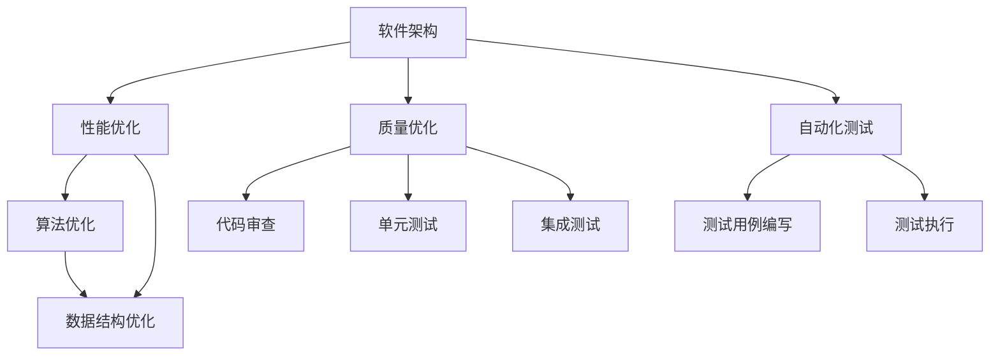

                 

# AI辅助的软件架构评估与优化

> 关键词：软件架构评估, AI优化, 机器学习, 软件工程, 软件性能优化, 代码质量优化, 自动化测试

## 1. 背景介绍

在软件开发的今天，软件架构的评估与优化至关重要。随着技术的飞速发展，软件系统日益复杂，这对软件架构的要求也越来越高。AI技术作为一项强大的工具，可以帮助我们在软件架构评估和优化方面取得更大的进步。本文将介绍AI在软件架构评估与优化中的应用，以及如何使用AI技术来提升软件系统的性能和质量。

### 1.1 问题由来

软件架构评估是一个复杂的过程，需要对软件系统的性能、可维护性、可扩展性等多个方面进行评估。传统的评估方法往往依赖于经验和专业知识，缺乏科学性和系统性。随着软件系统的不断发展，这种评估方法已经无法满足需求。

### 1.2 问题核心关键点

软件架构评估与优化的核心关键点包括：

- **性能优化**：提高软件系统的响应速度和处理能力。
- **质量优化**：提升软件系统的可靠性、可维护性和可扩展性。
- **自动化测试**：通过自动化测试来保证软件质量。

AI技术在这些关键点上的应用能够显著提升软件架构评估与优化的效率和效果。

### 1.3 问题研究意义

AI辅助的软件架构评估与优化不仅可以提高软件系统的性能和质量，还能帮助开发者节省时间和成本。通过自动化测试，可以减少人工测试的时间和成本，从而提高软件的质量。同时，AI能够帮助开发者发现软件系统中潜在的问题，避免在后期投入大量时间和资源来修复。

## 2. 核心概念与联系

### 2.1 核心概念概述

软件架构评估与优化的核心概念包括：

- **软件架构**：软件系统的高层次表示，描述了系统的主要组件、它们之间的关系以及组件与环境之间的接口。
- **性能优化**：通过优化算法和数据结构，提高软件系统的性能。
- **质量优化**：通过代码审查、单元测试、集成测试等手段，提升软件系统的质量。
- **自动化测试**：使用软件测试工具和框架，自动执行测试用例，减少人工测试的时间和成本。

### 2.2 核心概念之间的联系

软件架构评估与优化的核心概念之间的联系如图：

### 2.3 核心概念的应用

AI技术在软件架构评估与优化中的应用包括：

- 使用机器学习算法分析软件架构的性能瓶颈，并提出优化建议。
- 利用自然语言处理技术分析代码质量，提供建议。
- 利用自动化测试工具自动化测试过程，提高测试效率。

这些技术的应用可以显著提高软件系统的性能和质量。

## 3. 核心算法原理 & 具体操作步骤

### 3.1 算法原理概述

AI在软件架构评估与优化中的算法原理包括：

- **机器学习**：通过学习大量数据，机器学习算法能够发现软件架构中的性能瓶颈。
- **自然语言处理**：通过分析代码中的自然语言，自然语言处理技术能够评估代码的质量。
- **自动化测试**：通过自动化测试工具，自动化测试能够执行大量测试用例，检测软件系统中的错误。

### 3.2 算法步骤详解

AI在软件架构评估与优化中的具体操作步骤包括：

- **性能优化**：收集软件系统的性能数据，使用机器学习算法分析数据，提出优化建议。
- **质量优化**：分析代码中的自然语言，使用自然语言处理技术评估代码质量，提出改进建议。
- **自动化测试**：编写测试用例，使用自动化测试工具执行测试用例，检测软件系统中的错误。

这些步骤的具体实施需要结合软件系统的具体情况，选择合适的AI技术和工具。

### 3.3 算法优缺点

AI在软件架构评估与优化中的算法优缺点包括：

- **性能优化**：使用机器学习算法可以提高软件系统的性能，但可能需要大量的数据来训练模型。
- **质量优化**：使用自然语言处理技术可以评估代码质量，但可能会忽略代码中的一些细节。
- **自动化测试**：自动化测试可以提高测试效率，但可能会错过一些测试用例。

### 3.4 算法应用领域

AI在软件架构评估与优化中的应用领域包括：

- **软件性能优化**：使用机器学习算法分析软件系统的性能瓶颈，提出优化建议。
- **软件质量优化**：使用自然语言处理技术分析代码质量，提供建议。
- **自动化测试**：使用自动化测试工具自动化测试过程，提高测试效率。

这些应用领域的技术发展将会显著提升软件系统的性能和质量。

## 4. 数学模型和公式 & 详细讲解 & 举例说明

### 4.1 数学模型构建

软件架构评估与优化的数学模型构建包括：

- **性能模型**：通过数学模型描述软件系统的性能特征，分析性能瓶颈。
- **质量模型**：通过数学模型描述代码质量特征，分析代码质量问题。
- **测试模型**：通过数学模型描述测试过程，分析测试效率。

这些模型的构建需要结合软件系统的具体情况，选择合适的数学工具和方法。

### 4.2 公式推导过程

软件架构评估与优化的数学模型的推导过程包括：

- **性能模型**：使用数学模型描述软件系统的性能特征，推导出性能瓶颈。
- **质量模型**：使用数学模型描述代码质量特征，推导出代码质量问题。
- **测试模型**：使用数学模型描述测试过程，推导出测试效率。

这些公式的推导需要结合软件系统的具体情况，选择合适的数学工具和方法。

### 4.3 案例分析与讲解

软件架构评估与优化的案例分析包括：

- **性能优化**：通过分析软件系统的性能数据，使用机器学习算法提出优化建议。
- **质量优化**：通过分析代码中的自然语言，使用自然语言处理技术评估代码质量，提出改进建议。
- **自动化测试**：通过编写测试用例，使用自动化测试工具执行测试用例，检测软件系统中的错误。

这些案例的分析需要结合软件系统的具体情况，选择合适的AI技术和工具。

## 5. 项目实践：代码实例和详细解释说明

### 5.1 开发环境搭建

软件架构评估与优化的开发环境搭建包括：

- **软件架构**：搭建软件系统的架构模型，描述系统的主要组件和它们之间的关系。
- **性能优化**：搭建性能测试环境，收集软件系统的性能数据。
- **质量优化**：搭建代码审查环境，分析代码中的自然语言。
- **自动化测试**：搭建自动化测试环境，编写测试用例。

这些环境的搭建需要结合软件系统的具体情况，选择合适的AI技术和工具。

### 5.2 源代码详细实现

软件架构评估与优化的源代码详细实现包括：

- **性能优化**：使用机器学习算法分析软件系统的性能数据，提出优化建议。
- **质量优化**：使用自然语言处理技术分析代码中的自然语言，提出改进建议。
- **自动化测试**：使用自动化测试工具执行测试用例，检测软件系统中的错误。

这些代码的实现需要结合软件系统的具体情况，选择合适的AI技术和工具。

### 5.3 代码解读与分析

软件架构评估与优化的代码解读与分析包括：

- **性能优化**：分析机器学习算法的优化建议，评估软件系统的性能瓶颈。
- **质量优化**：分析自然语言处理技术的改进建议，评估代码质量问题。
- **自动化测试**：分析自动化测试工具的测试结果，检测软件系统中的错误。

这些代码的解读与分析需要结合软件系统的具体情况，选择合适的AI技术和工具。

### 5.4 运行结果展示

软件架构评估与优化的运行结果展示包括：

- **性能优化**：展示软件系统的性能瓶颈，评估优化效果。
- **质量优化**：展示代码质量问题，评估改进效果。
- **自动化测试**：展示自动化测试结果，检测软件系统中的错误。

这些结果的展示需要结合软件系统的具体情况，选择合适的AI技术和工具。

## 6. 实际应用场景

### 6.1 性能优化

AI在软件性能优化中的实际应用场景包括：

- **云计算系统**：使用AI技术优化云计算系统的性能，提高资源利用率。
- **大数据系统**：使用AI技术优化大数据系统的性能，提高数据处理效率。
- **网络系统**：使用AI技术优化网络系统的性能，提高数据传输效率。

这些应用场景的技术发展将会显著提升软件系统的性能。

### 6.2 质量优化

AI在软件质量优化中的实际应用场景包括：

- **软件开发**：使用AI技术评估代码质量，提供建议。
- **软件维护**：使用AI技术评估软件系统的可维护性，提供建议。
- **软件测试**：使用AI技术自动化测试过程，提高测试效率。

这些应用场景的技术发展将会显著提升软件系统的质量。

### 6.3 自动化测试

AI在自动化测试中的实际应用场景包括：

- **软件测试**：使用AI技术自动化测试过程，提高测试效率。
- **软件调试**：使用AI技术自动化调试过程，减少人工调试时间。
- **软件部署**：使用AI技术自动化部署过程，提高部署效率。

这些应用场景的技术发展将会显著提升软件系统的测试效率和部署效率。

### 6.4 未来应用展望

未来，AI在软件架构评估与优化中的应用将会更加广泛和深入。AI技术将会被广泛应用于软件系统的性能优化、质量优化和自动化测试等领域，帮助开发者节省时间和成本，提高软件系统的性能和质量。

## 7. 工具和资源推荐

### 7.1 学习资源推荐

软件架构评估与优化的学习资源包括：

- **机器学习**：通过学习机器学习算法，开发者可以更好地理解AI在软件架构评估与优化中的应用。
- **自然语言处理**：通过学习自然语言处理技术，开发者可以更好地理解AI在软件质量优化中的应用。
- **自动化测试**：通过学习自动化测试工具，开发者可以更好地理解AI在软件测试中的应用。

这些资源的学习将会帮助开发者更好地理解AI在软件架构评估与优化中的应用。

### 7.2 开发工具推荐

软件架构评估与优化的开发工具包括：

- **机器学习框架**：通过使用机器学习框架，如TensorFlow或PyTorch，开发者可以更好地开发AI模型。
- **自然语言处理库**：通过使用自然语言处理库，如NLTK或spaCy，开发者可以更好地开发自然语言处理应用。
- **自动化测试工具**：通过使用自动化测试工具，如Selenium或Cypress，开发者可以更好地自动化测试过程。

这些工具的使用将会帮助开发者更好地实现软件架构评估与优化。

### 7.3 相关论文推荐

软件架构评估与优化的相关论文包括：

- **机器学习**：通过阅读机器学习领域的论文，开发者可以更好地理解AI在软件架构评估与优化中的应用。
- **自然语言处理**：通过阅读自然语言处理领域的论文，开发者可以更好地理解AI在软件质量优化中的应用。
- **自动化测试**：通过阅读自动化测试领域的论文，开发者可以更好地理解AI在软件测试中的应用。

这些论文的阅读将会帮助开发者更好地理解AI在软件架构评估与优化中的应用。

## 8. 总结：未来发展趋势与挑战

### 8.1 研究成果总结

AI在软件架构评估与优化中的研究成果总结包括：

- **性能优化**：通过AI技术，软件系统的性能瓶颈被有效地发现和优化。
- **质量优化**：通过AI技术，软件系统的代码质量问题被有效地发现和优化。
- **自动化测试**：通过AI技术，软件系统的自动化测试被有效地实施。

这些成果的总结表明，AI技术在软件架构评估与优化中已经取得了显著的进展。

### 8.2 未来发展趋势

未来，AI在软件架构评估与优化中的发展趋势包括：

- **性能优化**：AI技术将会被广泛应用于软件系统的性能优化，提高资源利用率和数据处理效率。
- **质量优化**：AI技术将会被广泛应用于软件系统的质量优化，提高代码质量和可维护性。
- **自动化测试**：AI技术将会被广泛应用于软件系统的自动化测试，提高测试效率和准确性。

这些趋势的发展将会显著提升软件系统的性能和质量。

### 8.3 面临的挑战

AI在软件架构评估与优化中的挑战包括：

- **数据质量**：AI技术需要大量的数据来训练模型，但数据的质量和可用性是关键。
- **模型泛化能力**：AI模型的泛化能力对于软件系统的性能和质量优化至关重要。
- **安全性和隐私**：AI技术在软件系统中的应用需要保证数据的安全性和隐私。

这些挑战的解决将会促进AI技术在软件架构评估与优化中的发展。

### 8.4 研究展望

AI在软件架构评估与优化中的研究展望包括：

- **性能优化**：研究如何使用AI技术更好地优化软件系统的性能。
- **质量优化**：研究如何使用AI技术更好地优化软件系统的质量。
- **自动化测试**：研究如何使用AI技术更好地自动化软件系统的测试。

这些研究的展望将会推动AI技术在软件架构评估与优化中的进一步发展。

## 9. 附录：常见问题与解答

### Q1：AI在软件架构评估与优化中如何提升性能？

A：AI可以通过分析软件系统的性能数据，使用机器学习算法提出优化建议，以提升性能。

### Q2：AI在软件质量优化中如何提升质量？

A：AI可以通过分析代码中的自然语言，使用自然语言处理技术评估代码质量，提出改进建议，以提升质量。

### Q3：AI在自动化测试中如何提高测试效率？

A：AI可以通过自动化测试工具执行测试用例，检测软件系统中的错误，以提高测试效率。

这些问题的解答总结了AI在软件架构评估与优化中的应用。

---

作者：禅与计算机程序设计艺术 / Zen and the Art of Computer Programming

