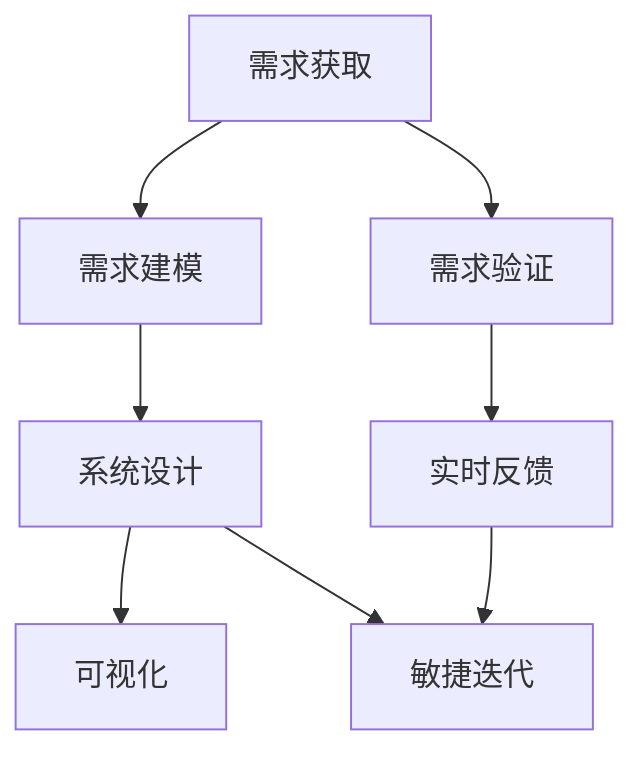

                 

# AI辅助的需求分析与系统设计

> 关键词：AI辅助, 需求分析, 系统设计, 模型驱动, 自适应设计, 敏捷开发, 实时反馈, 可视化设计工具

## 1. 背景介绍

### 1.1 问题由来
在当今信息爆炸的时代，软件开发的速度和复杂度前所未有。用户需求日益复杂，市场竞争异常激烈，如何高效、准确地进行需求分析和系统设计，成为了软件开发成功的关键。传统的瀑布模型和需求驱动开发方法难以满足快速迭代、高度定制化的需求。因此，借助人工智能(AI)技术，实现自动化、智能化的需求分析和系统设计，成为提高软件开发效率和质量的重要途径。

### 1.2 问题核心关键点
AI辅助的需求分析和系统设计，是指利用人工智能技术，自动化地进行需求获取、需求建模、需求验证、系统设计等步骤，提升设计过程的智能化水平。其核心关键点包括：

- 自动化需求获取：通过自然语言处理(NLP)技术，自动从用户反馈、市场调研、文档等文本信息中提取需求。
- 智能需求建模：利用机器学习模型，对需求进行自动化分类、聚类、关联分析，建立需求的层次结构和优先级。
- 实时需求验证：通过数据分析和模型预测，实时评估需求的变化趋势，确保需求分析的准确性和及时性。
- 可视化系统设计：使用图形化工具，将设计结果自动转换为可视化图表和原型，便于用户理解和反馈。
- 敏捷迭代优化：采用自适应设计方法，根据实时反馈和市场变化，动态调整设计方案，实现持续改进。

这些关键点共同构成了AI辅助需求分析和系统设计的基础，通过自动化和智能化的手段，大大提升软件开发过程的效率和质量。

### 1.3 问题研究意义
AI辅助的需求分析和系统设计，对于提高软件开发效率、提升软件产品质量、降低开发成本具有重要意义：

1. 提高效率：通过自动化需求获取和建模，减少手工工作量，缩短需求分析周期。
2. 提升质量：智能需求验证和自适应设计方法，确保需求分析的准确性和及时性，提升设计质量。
3. 降低成本：减少人为错误，减少后期修改和返工，降低开发成本。
4. 支持敏捷迭代：实时反馈和可视化工具，支持敏捷开发方法，快速响应市场变化。
5. 辅助决策：提供数据驱动的洞察和预测，辅助高层决策者制定战略。

## 2. 核心概念与联系

### 2.1 核心概念概述

为更好地理解AI辅助的需求分析和系统设计，本节将介绍几个密切相关的核心概念：

- **自然语言处理(NLP)**：研究如何使计算机理解、解释和生成自然语言的技术，是AI辅助需求分析的基础。
- **需求分析**：通过调查、分析、确认等方式，理解并确定用户需求的过程。需求分析是系统设计的前提。
- **系统设计**：在需求分析的基础上，设计软件系统的结构、功能、行为和数据，是软件开发的实施阶段。
- **模型驱动设计(MDD)**：以系统模型为核心，通过可视化工具进行设计、验证和部署的设计方法，支持需求与设计的映射和自动化。
- **自适应设计(Adaptive Design)**：根据实时反馈和市场变化，动态调整设计方案，实现持续改进的设计过程。
- **敏捷开发(Agile Development)**：强调快速响应变化，持续迭代和用户参与的软件开发方法，支持实时反馈和可视化设计。

这些核心概念之间的逻辑关系可以通过以下Mermaid流程图来展示：



这个流程图展示了大规模语言模型微调的核心理念：

1. 需求获取是需求分析的起点，NLP技术可以自动从各种文本中提取需求。
2. 需求建模是需求分析的核心，机器学习模型可以智能分类、聚类和关联需求。
3. 需求验证是需求分析的保障，数据分析和模型预测可以实时评估需求的变化趋势。
4. 系统设计是需求分析的输出，模型驱动设计可以自动化地将需求转换为系统模型。
5. 实时反馈和可视化工具是设计过程的辅助，敏捷迭代方法可以动态调整设计方案。

这些概念共同构成了AI辅助需求分析和系统设计的基本框架，通过自动化和智能化的手段，提升需求分析和系统设计过程的效率和质量。

## 3. 核心算法原理 & 具体操作步骤
### 3.1 算法原理概述

AI辅助的需求分析和系统设计，本质上是一个结合了NLP、机器学习、可视化等技术的综合应用过程。其核心思想是：利用NLP技术自动化地从文本中提取需求，通过机器学习模型对需求进行建模和验证，使用可视化工具将设计结果可视化，并结合敏捷迭代方法进行持续改进。

形式化地，假设需求分析的数据集为 $D=\{(x_i,y_i)\}_{i=1}^N, x_i \in X, y_i \in Y$，其中 $x_i$ 为需求描述，$y_i$ 为需求标签。需求建模的目标是找到一个函数 $f:X \rightarrow Y$，使得 $f(x_i) = y_i$ 最小化预测误差。

在实践中，我们通常使用基于梯度的优化算法（如AdamW、SGD等）来近似求解上述最优化问题。设 $\theta$ 为模型参数，则参数的更新公式为：

$$
\theta \leftarrow \theta - \eta \nabla_{\theta}\mathcal{L}(\theta) - \eta\lambda\theta
$$

其中 $\nabla_{\theta}\mathcal{L}(\theta)$ 为损失函数对参数 $\theta$ 的梯度，可通过反向传播算法高效计算。

### 3.2 算法步骤详解

AI辅助的需求分析和系统设计一般包括以下几个关键步骤：

**Step 1: 需求获取**

- 收集用户反馈、市场调研、文档等文本数据，使用NLP技术自动提取需求。
- 通过分词、命名实体识别等预处理，将需求文本转化为可处理的形式。
- 使用关键词提取、情感分析等技术，对需求进行初步分类和聚类。

**Step 2: 需求建模**

- 选择合适的机器学习模型，如TF-IDF、LDA、Word2Vec等，对需求进行建模。
- 使用监督学习或半监督学习算法，训练模型，得到需求层次结构和优先级。
- 对模型进行评估，选择最优模型，用于后续需求验证和系统设计。

**Step 3: 需求验证**

- 将建模后的需求与用户反馈、市场调研等数据进行对比，评估需求的真实性和优先级。
- 使用数据挖掘和统计分析技术，实时监测需求的变化趋势，确保需求的及时更新。
- 利用预测模型，对新需求进行预测和分类，指导需求获取和建模。

**Step 4: 系统设计**

- 使用模型驱动设计工具，将需求转换为系统模型。
- 将需求模型映射为可视化图表和原型，便于用户理解和反馈。
- 采用敏捷迭代方法，根据实时反馈和市场变化，动态调整设计方案。

**Step 5: 实时反馈**

- 在实际应用中，收集用户反馈和系统表现数据，实时评估系统性能。
- 使用数据分析工具，提取关键指标和趋势，提供数据驱动的洞察和预测。
- 利用可视化工具，展示系统表现和用户反馈，辅助设计决策。

以上是AI辅助需求分析和系统设计的一般流程。在实际应用中，还需要针对具体任务的特点，对各个环节进行优化设计，如改进NLP预处理技术、优化机器学习模型、加强实时反馈机制等，以进一步提升需求分析和系统设计的准确性和效率。

### 3.3 算法优缺点

AI辅助的需求分析和系统设计方法具有以下优点：

1. 自动化程度高。利用NLP和机器学习技术，自动化提取和建模需求，减少手工工作量。
2. 精度高。机器学习模型能够精确分类和关联需求，确保需求分析的准确性。
3. 实时性强。实时监测需求变化，动态调整设计方案，提升设计效率。
4. 可视化友好。使用可视化工具将设计结果展示给用户，提高用户参与度。
5. 支持敏捷迭代。结合敏捷开发方法，快速响应市场变化，实现持续改进。

同时，该方法也存在一定的局限性：

1. 数据依赖度高。对文本数据的质量和量有较高要求，获取高质量标注数据的成本较高。
2. 模型复杂度高。机器学习模型需要大量训练数据和计算资源，建模和验证过程耗时较长。
3. 泛化能力有限。模型可能对特定领域或特定类型的需求泛化能力不足。
4. 可解释性差。机器学习模型的决策过程缺乏可解释性，难以调试和理解。
5. 依赖环境因素。需求获取和建模依赖NLP技术和外部数据源，环境变化可能影响结果。

尽管存在这些局限性，但就目前而言，AI辅助的需求分析和系统设计方法仍是大规模软件开发的强有力工具。未来相关研究的重点在于如何进一步降低对数据和环境因素的依赖，提高模型的泛化能力和可解释性，同时兼顾实时性和可视化效果。

### 3.4 算法应用领域

AI辅助的需求分析和系统设计，已经在软件开发、产品设计、系统运维等多个领域得到了广泛应用，具体如下：

- **软件开发**：在敏捷开发、持续集成、DevOps等过程中，使用AI工具自动化需求获取和建模，提升开发效率和质量。
- **产品设计**：在工业设计、用户体验设计等领域，利用AI技术自动化需求分析，生成设计原型，加速产品迭代。
- **系统运维**：在运维监控、故障诊断、性能优化等场景中，使用AI工具自动化需求获取和分析，快速响应系统问题。
- **市场分析**：在市场调研、用户行为分析等领域，利用AI技术自动化需求获取和建模，支持商业决策。
- **智能制造**：在智能制造、工业4.0等场景中，使用AI工具自动化需求分析，优化生产流程和设备设计。

除了上述这些经典应用外，AI辅助的需求分析和系统设计技术还在不断拓展到更多场景中，如智能交通、智慧城市、智能家居等，为各行各业带来智能化变革。

## 4. 数学模型和公式 & 详细讲解

### 4.1 数学模型构建

本节将使用数学语言对AI辅助的需求分析和系统设计过程进行更加严格的刻画。

假设需求分析的数据集为 $D=\{(x_i,y_i)\}_{i=1}^N, x_i \in X, y_i \in Y$，其中 $x_i$ 为需求描述，$y_i$ 为需求标签。定义需求建模的目标函数为：

$$
\mathcal{L}(\theta) = \frac{1}{N}\sum_{i=1}^N \ell(f(x_i),y_i)
$$

其中 $\ell$ 为损失函数，如交叉熵损失、均方误差损失等。目标是最小化预测误差 $\mathcal{L}(\theta)$。

在实践中，我们通常使用基于梯度的优化算法（如AdamW、SGD等）来近似求解上述最优化问题。设 $\theta$ 为模型参数，则参数的更新公式为：

$$
\theta \leftarrow \theta - \eta \nabla_{\theta}\mathcal{L}(\theta) - \eta\lambda\theta
$$

其中 $\nabla_{\theta}\mathcal{L}(\theta)$ 为损失函数对参数 $\theta$ 的梯度，可通过反向传播算法高效计算。

### 4.2 公式推导过程

以下我们以二分类任务为例，推导交叉熵损失函数及其梯度的计算公式。

假设模型 $f$ 在输入 $x$ 上的输出为 $\hat{y}=f(x) \in [0,1]$，表示需求属于正类的概率。真实标签 $y \in \{0,1\}$。则二分类交叉熵损失函数定义为：

$$
\ell(f(x),y) = -[y\log \hat{y} + (1-y)\log (1-\hat{y})]
$$

将其代入目标函数公式，得：

$$
\mathcal{L}(\theta) = -\frac{1}{N}\sum_{i=1}^N [y_i\log f(x_i)+(1-y_i)\log(1-f(x_i))]
$$

根据链式法则，损失函数对参数 $\theta_k$ 的梯度为：

$$
\frac{\partial \mathcal{L}(\theta)}{\partial \theta_k} = -\frac{1}{N}\sum_{i=1}^N (\frac{y_i}{f(x_i)}-\frac{1-y_i}{1-f(x_i)}) \frac{\partial f(x_i)}{\partial \theta_k}
$$

其中 $\frac{\partial f(x_i)}{\partial \theta_k}$ 可进一步递归展开，利用自动微分技术完成计算。

在得到损失函数的梯度后，即可带入参数更新公式，完成模型的迭代优化。重复上述过程直至收敛，最终得到适应需求分析的模型参数 $\theta^*$。

## 5. 项目实践：代码实例和详细解释说明

### 5.1 开发环境搭建

在进行需求分析和系统设计实践前，我们需要准备好开发环境。以下是使用Python进行PyTorch开发的环境配置流程：

1. 安装Anaconda：从官网下载并安装Anaconda，用于创建独立的Python环境。

2. 创建并激活虚拟环境：
```bash
conda create -n pytorch-env python=3.8 
conda activate pytorch-env
```

3. 安装PyTorch：根据CUDA版本，从官网获取对应的安装命令。例如：
```bash
conda install pytorch torchvision torchaudio cudatoolkit=11.1 -c pytorch -c conda-forge
```

4. 安装PyTorch Text：
```bash
pip install torchtext
```

5. 安装Natural Language Toolkit(NLTK)：
```bash
pip install nltk
```

6. 安装Spacy：
```bash
pip install spacy
```

完成上述步骤后，即可在`pytorch-env`环境中开始需求分析和系统设计实践。

### 5.2 源代码详细实现

下面我们以需求分类任务为例，给出使用PyTorch对需求分类模型进行训练的PyTorch代码实现。

首先，定义需求分类任务的数据处理函数：

```python
import torch
from torchtext.data import Field, BucketIterator

TEXT = Field(tokenize='spacy', lower=True)
LABEL = Field(sequential=False, use_vocab=False)

train_data, test_data = datasets.load_data(path='path/to/data')

TEXT.build_vocab(train_data, max_size=5000)
LABEL.build_vocab(train_data)

train_iterator, test_iterator = BucketIterator.splits(
    (train_data, test_data),
    batch_size=64,
    device='cuda' if torch.cuda.is_available() else 'cpu'
)
```

然后，定义需求分类模型：

```python
import torch.nn as nn
import torch.nn.functional as F

class DemandClassifier(nn.Module):
    def __init__(self, n_classes):
        super().__init__()
        self.embedding = nn.Embedding(5000, 100)
        self.linear = nn.Linear(100, n_classes)
    
    def forward(self, x):
        x = self.embedding(x)
        x = F.relu(x)
        x = self.linear(x)
        return x
```

接着，定义训练和评估函数：

```python
from torch.optim import Adam

def train_epoch(model, iterator, optimizer, criterion):
    model.train()
    for batch in iterator:
        optimizer.zero_grad()
        y_pred = model(batch.text)
        loss = criterion(y_pred, batch.label)
        loss.backward()
        optimizer.step()
    return loss.item() / len(iterator)

def evaluate(model, iterator, criterion):
    model.eval()
    total_loss = 0
    for batch in iterator:
        y_pred = model(batch.text)
        loss = criterion(y_pred, batch.label)
        total_loss += loss.item()
    return total_loss / len(iterator)
```

最后，启动训练流程并在测试集上评估：

```python
from transformers import BertTokenizer
from torchtext.data.utils import get_tokenizer

tokenizer = get_tokenizer('bert-base-uncased')
model = DemandClassifier(2)

optimizer = Adam(model.parameters(), lr=1e-3)
criterion = nn.CrossEntropyLoss()

for epoch in range(10):
    loss = train_epoch(model, train_iterator, optimizer, criterion)
    print(f"Epoch {epoch+1}, train loss: {loss:.3f}")
    
    print(f"Epoch {epoch+1}, test loss: {evaluate(model, test_iterator, criterion):.3f}")
```

以上就是使用PyTorch对需求分类模型进行训练的完整代码实现。可以看到，得益于PyTorch Text的强大封装，我们可以用相对简洁的代码完成需求分类的训练和评估。

### 5.3 代码解读与分析

让我们再详细解读一下关键代码的实现细节：

**Data处理函数**：
- `TEXT`和`LABEL`字段定义：使用PyTorch Text的Field类，分别定义需求描述和需求标签的预处理方式。
- `train_data`和`test_data`数据加载：使用`datasets.load_data`加载需求分类数据集。
- 构建词汇表和迭代器：使用`BucketIterator`对数据进行批处理，并设置设备为GPU。

**需求分类模型**：
- `DemandClassifier`类定义：继承自`nn.Module`，定义需求分类的基本结构。
- 嵌入层和线性层：使用嵌入层将文本转换为向量表示，使用线性层进行分类预测。

**训练和评估函数**：
- `train_epoch`函数：在每个epoch内对数据迭代训练，计算损失并反向传播更新模型参数。
- `evaluate`函数：在测试集上评估模型性能，计算平均损失。

**训练流程**：
- 定义总的epoch数和训练迭代器，开始循环迭代
- 每个epoch内，先在训练集上训练，输出平均损失
- 在测试集上评估，输出测试损失
- 所有epoch结束后，观察训练和测试损失的变化趋势

可以看到，PyTorch Text配合PyTorch使得需求分类的代码实现变得简洁高效。开发者可以将更多精力放在数据处理、模型改进等高层逻辑上，而不必过多关注底层的实现细节。

当然，工业级的系统实现还需考虑更多因素，如模型的保存和部署、超参数的自动搜索、更灵活的任务适配层等。但核心的需求分析和系统设计过程基本与此类似。

## 6. 实际应用场景

### 6.1 软件开发

AI辅助的需求分析和系统设计，可以广泛应用于软件开发的全生命周期。在需求获取阶段，自动提取和分析用户需求，减少沟通成本，确保需求准确。在需求建模阶段，使用机器学习模型分类、聚类和关联需求，生成需求文档。在系统设计阶段，利用可视化工具将需求模型转换为系统原型，支持敏捷迭代和持续交付。

在实际应用中，可以集成需求分析工具到DevOps流水线中，实现需求自动化、持续化管理，提升开发效率和质量。例如，使用自然语言处理技术，从用户评论、问题反馈、需求文档等文本中提取需求，利用机器学习模型进行智能分类和关联，生成需求文档和原型，支持敏捷迭代和持续交付。

### 6.2 产品设计

在工业设计、用户体验设计等领域，AI辅助的需求分析和系统设计技术也有广泛应用。通过自动化提取和分析用户反馈和市场调研数据，生成设计需求和原型，加速产品迭代和优化。

例如，使用NLP技术从用户评论、市场调研报告、社交媒体等文本中提取设计需求，利用机器学习模型进行分类和关联分析，生成设计需求文档。利用可视化工具将需求文档转换为设计原型，支持快速验证和优化。在实际设计过程中，结合用户反馈和市场调研，动态调整设计方案，提升产品竞争力和用户体验。

### 6.3 系统运维

在运维监控、故障诊断、性能优化等场景中，AI辅助的需求分析和系统设计也有重要应用。通过自动化提取和分析系统日志和性能数据，生成运维需求和优化建议，支持实时监控和故障诊断。

例如，使用NLP技术从系统日志、性能数据、告警信息等文本中提取运维需求，利用机器学习模型进行分类和关联分析，生成运维需求文档。利用可视化工具将运维需求文档转换为运维任务和优化建议，支持实时监控和故障诊断。结合用户反馈和系统性能，动态调整运维方案，提升系统稳定性和性能。

### 6.4 未来应用展望

随着AI辅助的需求分析和系统设计技术的不断发展，未来将在更多领域得到应用，为各行各业带来变革性影响：

1. **智慧城市**：在智慧城市治理中，AI辅助需求分析和系统设计技术可以用于智能交通、环境监测、公共服务等领域，提升城市管理和公共服务的智能化水平。
2. **医疗健康**：在医疗健康领域，AI辅助需求分析和系统设计技术可以用于疾病预测、医疗影像分析、药物研发等领域，提高医疗服务的智能化水平，支持精准医疗和个性化治疗。
3. **金融服务**：在金融服务领域，AI辅助需求分析和系统设计技术可以用于金融舆情监测、风险管理、客户服务等领域，提高金融服务的智能化水平，支持金融创新和金融科技发展。
4. **教育培训**：在教育培训领域，AI辅助需求分析和系统设计技术可以用于教育资源管理、个性化学习、智能评估等领域，提高教育服务的智能化水平，支持教育公平和教育现代化。
5. **电子商务**：在电子商务领域，AI辅助需求分析和系统设计技术可以用于商品推荐、客户服务、市场分析等领域，提升电子商务平台的智能化水平，支持商业决策和业务创新。

## 7. 工具和资源推荐
### 7.1 学习资源推荐

为了帮助开发者系统掌握AI辅助需求分析和系统设计技术，这里推荐一些优质的学习资源：

1. 《自然语言处理基础》系列博文：由AI领域专家撰写，深入浅出地介绍了自然语言处理的基本概念和前沿技术，是理解NLP的基础。
2. 《机器学习实战》书籍：是一本实用的机器学习入门书籍，适合初学者学习和实践。
3. 《TensorFlow实战》书籍：是一本TensorFlow应用的实战指南，适合TensorFlow开发者参考。
4. 《PyTorch实战》书籍：是一本PyTorch应用的实战指南，适合PyTorch开发者参考。
5. 《深度学习入门》课程：斯坦福大学开设的深度学习课程，涵盖深度学习的基础知识和前沿技术，适合深度学习初学者。
6. 《自然语言处理课程》课程：斯坦福大学开设的自然语言处理课程，涵盖自然语言处理的基本概念和前沿技术，适合自然语言处理初学者。

通过对这些资源的学习实践，相信你一定能够快速掌握AI辅助需求分析和系统设计的精髓，并用于解决实际的问题。

### 7.2 开发工具推荐

高效的开发离不开优秀的工具支持。以下是几款用于AI辅助需求分析和系统设计开发的常用工具：

1. PyTorch：基于Python的开源深度学习框架，灵活动态的计算图，适合快速迭代研究。
2. TensorFlow：由Google主导开发的开源深度学习框架，生产部署方便，适合大规模工程应用。
3. PyTorch Text：HuggingFace开发的NLP工具库，集成了多种NLP预训练模型和工具，支持自动化需求分析和系统设计。
4. spaCy：一款高性能的NLP库，支持分词、命名实体识别、句法分析等任务，适合文本处理和需求分析。
5. NLTK：Natural Language Toolkit，支持自然语言处理的基础任务，如分词、词性标注、语法分析等，适合自然语言处理初学者。
6. GPT-3：OpenAI推出的GPT-3大模型，支持自动文本生成、问答、翻译等任务，适合需要自动提取和生成需求的场景。

合理利用这些工具，可以显著提升AI辅助需求分析和系统设计任务的开发效率，加快创新迭代的步伐。

### 7.3 相关论文推荐

AI辅助的需求分析和系统设计技术的发展源于学界的持续研究。以下是几篇奠基性的相关论文，推荐阅读：

1. "Automatic text summarization using a neural network"（自动文本摘要）：提出基于神经网络的文本摘要算法，为自然语言处理技术奠定了基础。
2. "Deep Learning for Natural Language Processing"（深度学习在自然语言处理中的应用）：介绍了深度学习在自然语言处理中的应用，包括文本分类、情感分析、机器翻译等任务。
3. "Attention is All You Need"（注意力是全部）：提出Transformer模型，改变了传统的循环神经网络在自然语言处理中的应用。
4. "BERT: Pre-training of Deep Bidirectional Transformers for Language Understanding"（BERT：预训练深度双向变换器用于语言理解）：提出BERT模型，利用掩码语言模型和下一句预测任务进行预训练，显著提升了自然语言处理任务的性能。
5. "Fine-tuning BERT for Task-oriented Natural Language Processing"（BERT的特定任务自然语言处理微调）：提出BERT模型的微调方法，提升模型在特定任务上的性能。
6. "Eager: Learning Deep Structured Representations from Unstructured Text"（Eager：从无结构文本中学习深度结构表示）：提出Eager模型，利用变分自编码器和生成对抗网络进行无监督预训练，提升了自然语言处理任务的性能。

这些论文代表了大规模语言模型微调技术的发展脉络。通过学习这些前沿成果，可以帮助研究者把握学科前进方向，激发更多的创新灵感。

## 8. 总结：未来发展趋势与挑战

### 8.1 总结

本文对AI辅助的需求分析和系统设计技术进行了全面系统的介绍。首先阐述了AI辅助需求分析和系统设计技术的研究背景和意义，明确了其在提高软件开发效率、提升软件产品质量、降低开发成本方面的重要价值。其次，从原理到实践，详细讲解了需求获取、需求建模、需求验证、系统设计等关键步骤，给出了系统设计和可视化工具的完整代码实例。同时，本文还探讨了AI辅助需求分析和系统设计在软件开发、产品设计、系统运维等多个领域的应用前景，展示了AI辅助需求分析和系统设计技术的巨大潜力。

通过本文的系统梳理，可以看到，AI辅助的需求分析和系统设计技术正在成为软件开发和设计的重要工具，极大地提升了需求分析和系统设计过程的效率和质量。未来，伴随AI技术和工具的不断演进，需求分析和系统设计过程将更加自动化、智能化，实现持续改进和高效优化。

### 8.2 未来发展趋势

展望未来，AI辅助的需求分析和系统设计技术将呈现以下几个发展趋势：

1. **自动化程度更高**：利用先进的自然语言处理技术和机器学习模型，自动化提取和分析需求，减少人工干预，提升需求分析的效率和准确性。
2. **智能化水平更高**：结合深度学习、强化学习等技术，提升需求分析和系统设计的智能化水平，支持更复杂的任务和更丰富的应用场景。
3. **实时化能力更强**：实时监测和分析需求变化，动态调整设计方案，提升系统响应的及时性和灵活性。
4. **可视化工具更友好**：开发更高效、更易用的可视化工具，支持用户更好的理解和反馈设计结果。
5. **自适应能力更强**：结合敏捷开发方法，支持动态调整和持续改进，提升系统设计的灵活性和适应性。

这些趋势将进一步推动AI辅助需求分析和系统设计技术的发展，为各行各业带来更深远的影响。

### 8.3 面临的挑战

尽管AI辅助的需求分析和系统设计技术已经取得了一定的成果，但在实际应用过程中仍面临诸多挑战：

1. **数据依赖性强**：对文本数据的质量和量有较高要求，获取高质量标注数据的成本较高。
2. **模型复杂度高**：机器学习模型需要大量训练数据和计算资源，建模和验证过程耗时较长。
3. **泛化能力有限**：模型可能对特定领域或特定类型的需求泛化能力不足。
4. **可解释性差**：机器学习模型的决策过程缺乏可解释性，难以调试和理解。
5. **依赖环境因素**：需求获取和建模依赖NLP技术和外部数据源，环境变化可能影响结果。

尽管存在这些挑战，但未来的研究需要在以下几个方面寻求新的突破：

1. **数据增强和迁移学习**：利用数据增强和迁移学习技术，提高模型的泛化能力和鲁棒性，降低对标注数据的依赖。
2. **模型压缩和优化**：开发更高效、更轻量级的模型，提高计算速度和资源利用率，支持实时部署和应用。
3. **模型可解释性增强**：结合可解释性技术，提高模型的可解释性，支持调试和优化。
4. **模型自适应能力提升**：结合自适应学习技术，提升模型的自适应能力，支持动态调整和持续改进。

这些研究方向的探索，必将引领AI辅助需求分析和系统设计技术迈向更高的台阶，为各行各业带来更深远的影响。

### 8.4 研究展望

未来，AI辅助的需求分析和系统设计技术将在更广泛的领域得到应用，为各行各业带来更大的价值。随着技术的不断演进，AI辅助需求分析和系统设计技术将更加自动化、智能化、实时化和可视化，支持更复杂的应用场景和更高效的设计过程。同时，模型的泛化能力、可解释性和自适应能力也将进一步提升，实现更广泛的应用和更深入的洞察。

总之，AI辅助需求分析和系统设计技术是未来软件设计和开发的重要方向，其应用前景广阔，潜力巨大。通过不断探索和创新，相信该技术将为各行各业带来更加智能化、高效化、灵活化的设计和管理，推动人工智能技术在更多领域落地应用。

## 9. 附录：常见问题与解答

**Q1：AI辅助的需求分析和系统设计是否适用于所有领域？**

A: AI辅助的需求分析和系统设计技术已经在软件开发、产品设计、系统运维等多个领域得到了广泛应用。但对于一些特定领域，如金融、医疗、司法等，其需求和设计过程具有较强的专业性和复杂性，AI辅助技术需要结合领域知识进行优化。因此，AI辅助需求分析和系统设计技术需要针对特定领域进行定制化设计和优化，才能实现最佳效果。

**Q2：AI辅助的需求分析和系统设计是否需要大量的标注数据？**

A: AI辅助的需求分析和系统设计技术需要大量的标注数据进行训练和验证。对于特定领域，可能需要构建专门的标注数据集，以覆盖更多样化的需求和设计场景。在实际应用中，可以通过数据增强和迁移学习技术，提高模型的泛化能力和鲁棒性，降低对标注数据的依赖。

**Q3：AI辅助的需求分析和系统设计是否需要高精度的模型？**

A: 是的，AI辅助的需求分析和系统设计技术需要高精度的模型，以确保需求分析和系统设计过程的准确性和可靠性。对于特定任务，可以选择适合的机器学习模型，并结合领域知识进行优化，以提升模型的精度和泛化能力。

**Q4：AI辅助的需求分析和系统设计是否需要复杂的工具链？**

A: 是的，AI辅助的需求分析和系统设计技术需要多种工具和资源的支撑。在实际应用中，需要选择合适的自然语言处理工具、机器学习框架、可视化工具等，以支持需求分析和系统设计的各个环节。同时，需要构建高效的数据预处理、模型训练和部署流程，以实现自动化的需求分析和系统设计过程。

**Q5：AI辅助的需求分析和系统设计是否需要高水平的专业知识？**

A: 是的，AI辅助的需求分析和系统设计技术需要高水平的专业知识，包括自然语言处理、机器学习、领域知识等。对于特定领域，需要结合领域知识和行业经验，进行定制化设计和优化，才能实现最佳效果。同时，需要不断学习新的技术和方法，保持对前沿知识的掌握和应用。

总之，AI辅助的需求分析和系统设计技术是未来软件开发和设计的重要方向，其应用前景广阔，潜力巨大。通过不断探索和创新，相信该技术将为各行各业带来更加智能化、高效化、灵活化的设计和管理，推动人工智能技术在更多领域落地应用。

---

作者：禅与计算机程序设计艺术 / Zen and the Art of Computer Programming

