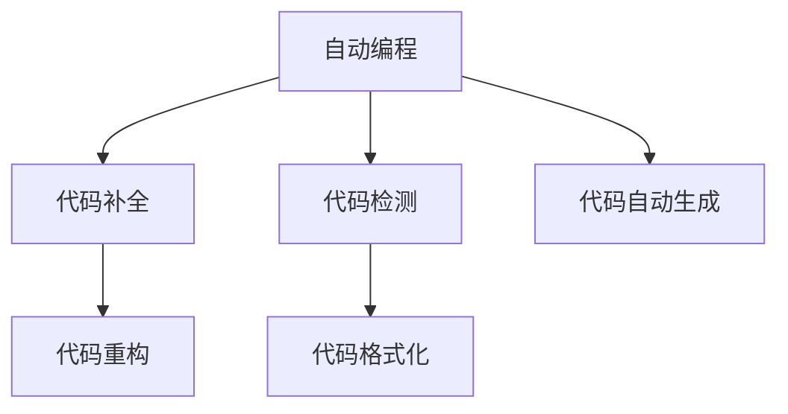

                 

## 1. 背景介绍

### 1.1 问题由来

软件开发是一个复杂而耗时的过程，传统的代码编写方式依赖于开发者的经验和直觉。然而，随着代码量的增加，维护和扩展现有系统变得愈发困难。随着AI技术的不断进步，AI辅助编程成为了提高开发效率、减少错误的新范式。

### 1.2 问题核心关键点

AI辅助编程的核心在于利用AI技术，自动生成代码片段、预测代码结构、检测代码错误等，从而显著提高开发效率，降低编写和维护代码的难度。具体来说，AI辅助编程可以应用在以下几个方面：

- 代码自动生成：根据已有代码片段或功能描述，自动生成新的代码行。
- 代码补全：根据当前代码上下文，自动推荐可能的关键字、函数、变量等。
- 代码检测：检测潜在代码错误，如语法错误、类型错误、死循环等。
- 代码重构：自动化重构代码，提升代码质量和可维护性。
- 代码格式化：自动调整代码格式，使其符合一致性规范。

这些功能使得开发者能够更专注于逻辑设计和算法实现，从而大幅度提升开发效率。

### 1.3 问题研究意义

AI辅助编程技术的引入，使得软件开发变得更加高效、可靠和可维护。具体来说：

- 缩短开发周期：自动化生成的代码和检测功能，可以加快代码编写速度，缩短项目开发周期。
- 减少错误：自动检测和纠正代码错误，提升代码质量和运行稳定性。
- 提升一致性：统一的代码风格和格式，提升代码的可读性和可维护性。
- 支持协作开发：智能化的代码推荐和检测，便于团队成员之间协作开发。
- 降低学习曲线：新开发者能够快速上手，并利用AI辅助工具，提升编程技能。

## 2. 核心概念与联系

### 2.1 核心概念概述

为了更好地理解AI辅助编程的原理和应用，本节将介绍几个关键概念：

- 自动编程(Automatic Programming)：利用AI技术，自动生成或辅助生成代码的过程。
- 代码补全(Code Completion)：在编程时，根据上下文自动推荐完整的代码片段。
- 代码检测(Code Inspection)：利用AI技术自动检测代码错误和潜在问题。
- 代码重构(Code Refactoring)：通过自动化工具，提升代码质量和可维护性。
- 代码格式化(Code Formatting)：利用AI技术自动调整代码格式，提升代码一致性。

这些概念之间的联系紧密，共同构成了AI辅助编程的技术体系。

### 2.2 核心概念原理和架构的 Mermaid 流程图(Mermaid 流程节点中不要有括号、逗号等特殊字符)



这个流程图展示了自动编程过程中，不同功能的相互关系和先后顺序：

1. 自动编程(A)：开始自动编程的过程。
2. 代码补全(B)：在编程时，根据上下文自动推荐完整的代码片段。
3. 代码检测(C)：利用AI技术自动检测代码错误和潜在问题。
4. 代码重构(D)：通过自动化工具，提升代码质量和可维护性。
5. 代码格式化(E)：利用AI技术自动调整代码格式，提升代码一致性。
6. 代码自动生成(F)：根据已有代码片段或功能描述，自动生成新的代码行。

## 3. 核心算法原理 & 具体操作步骤

### 3.1 算法原理概述

AI辅助编程的算法原理主要基于机器学习和自然语言处理(NLP)技术。具体来说：

- 机器学习算法：用于建模和预测代码生成、补全、检测和重构的过程。常见的算法包括决策树、随机森林、深度学习等。
- 自然语言处理技术：用于理解和生成代码描述和注释。常见的技术包括词向量表示、语义分析、情感分析等。

这些技术通过数据驱动的方式，构建出高效的AI辅助编程模型。

### 3.2 算法步骤详解

AI辅助编程的具体步骤通常包括以下几个关键步骤：

**Step 1: 数据收集与预处理**
- 收集大量代码示例和相关的元数据，如函数名、参数、注释、类型等。
- 对数据进行清洗、标注和预处理，确保数据的准确性和一致性。

**Step 2: 模型训练**
- 选择合适的机器学习模型，如决策树、随机森林、深度学习等。
- 使用标注数据对模型进行训练，调整模型参数，优化模型性能。
- 使用验证集评估模型性能，调整超参数，确保模型泛化能力。

**Step 3: 代码生成与补全**
- 根据用户输入的代码片段或功能描述，将问题转化为模型可处理的格式。
- 利用训练好的模型，自动生成或补全代码片段。
- 使用补全代码时，将推荐结果显示给用户，并允许用户选择或编辑。

**Step 4: 代码检测**
- 对生成的代码进行语法、类型、风格等检测，确保代码质量。
- 检测代码中的潜在错误，如死循环、空指针引用等。
- 及时向用户反馈检测结果，并提示修正建议。

**Step 5: 代码重构**
- 对代码进行结构调整，提升代码可读性和可维护性。
- 根据代码检测结果，自动重构代码。
- 提供重构建议，引导用户进行代码优化。

**Step 6: 代码格式化**
- 对代码进行格式化调整，提升代码一致性。
- 自动调整缩进、换行、空格等格式设置。
- 确保代码风格符合编码规范。

以上是AI辅助编程的主要步骤，每个步骤都有对应的技术实现细节。

### 3.3 算法优缺点

AI辅助编程具有以下优点：

- 提高开发效率：自动化生成代码和补全，大幅度提升代码编写速度。
- 提升代码质量：自动检测和纠正代码错误，确保代码运行稳定。
- 降低学习曲线：新开发者可以快速上手，利用AI工具提升编程技能。
- 统一代码风格：自动格式化和重构代码，提升代码一致性。

同时，该方法也存在一些缺点：

- 依赖高质量数据：模型性能受数据质量和标注准确性的影响较大。
- 缺乏人类直觉：AI工具生成的代码可能缺乏人类直觉和经验，需要开发者手动校验。
- 需要维护模型：定期更新和维护模型，确保模型性能。
- 成本较高：高质量的模型开发和维护需要投入大量资源。
- 可能出现偏差：模型在特定场景下可能出现偏差，影响代码生成效果。

尽管存在这些局限性，但AI辅助编程仍然是大势所趋，将在软件开发中扮演越来越重要的角色。

### 3.4 算法应用领域

AI辅助编程技术已经在多个领域得到了应用，具体包括：

- 开发工具：如Visual Studio Code、PyCharm等IDE工具集成了AI辅助编程功能，提升开发效率。
- 编程助手：如GitHub Copilot、CodeGuru等在线工具，支持自动代码生成和补全。
- 代码检测工具：如SonarQube、ESLint等静态分析工具，检测代码错误和风格问题。
- 代码重构工具：如Clang-Tidy、Pylint等重构工具，提升代码质量和可维护性。
- 代码格式化工具：如Prettier、Black等格式化工具，统一代码风格和格式。

此外，AI辅助编程技术还将在更多领域得到应用，如智能文档生成、自动测试生成、智能部署等，进一步提升软件开发和维护的效率。

## 4. 数学模型和公式 & 详细讲解 & 举例说明（备注：数学公式请使用latex格式，latex嵌入文中独立段落使用 $$，段落内使用 $)
### 4.1 数学模型构建

AI辅助编程的数学模型通常基于机器学习算法构建，以下以代码补全为例，介绍其数学模型构建过程。

设代码补全问题的输入为 $x$，表示当前代码片段，输出为 $y$，表示补全后的完整代码。假设 $x$ 和 $y$ 分别为字符串，则补全问题的数学模型可以表示为：

$$
P(y|x) = \frac{e^{s(x,y)}}{Z(x)}
$$

其中，$s(x,y)$ 为模型的评分函数，$Z(x)$ 为归一化因子，确保 $P(y|x)$ 的概率值在 $[0,1]$ 范围内。评分函数 $s(x,y)$ 可以表示为：

$$
s(x,y) = \sum_{i=1}^n \log p(y_i|x)
$$

其中 $p(y_i|x)$ 为模型对第 $i$ 个字符 $y_i$ 的预测概率，$n$ 为字符数。因此，补全问题的最大似然解为：

$$
\hat{y} = \arg\max_y P(y|x)
$$

**Step 1: 数据收集与预处理**

假设我们收集了大量的代码示例和相应的补全结果，将其划分为训练集和测试集。训练集用于模型训练，测试集用于评估模型性能。训练集中每个样本 $(x_i, y_i)$ 由一个代码片段 $x_i$ 和其补全结果 $y_i$ 组成。

**Step 2: 模型训练**

假设我们使用的是基于Transformer的机器翻译模型，将补全问题转化为翻译问题。对于每个训练样本 $(x_i, y_i)$，将其转换为模型输入 $x_i$ 和输出 $y_i$，然后训练模型。模型的损失函数为交叉熵损失：

$$
L(\theta) = -\frac{1}{N}\sum_{i=1}^N \log P(y_i|x_i)
$$

其中 $\theta$ 为模型参数，$N$ 为样本数。模型训练的目标是最小化损失函数 $L(\theta)$，以得到最优的模型参数 $\theta^*$。

**Step 3: 代码生成与补全**

在测试阶段，对于新的代码片段 $x_t$，将其输入训练好的模型，得到其补全结果 $\hat{y}_t$。模型的评分函数 $s(x_t,\hat{y}_t)$ 可以表示为：

$$
s(x_t,\hat{y}_t) = \sum_{i=1}^n \log p(\hat{y}_i|x_t)
$$

模型对每个字符的预测概率 $p(\hat{y}_i|x_t)$ 可以通过softmax函数计算得到：

$$
p(\hat{y}_i|x_t) = \frac{e^{a_i(x_t)}}{\sum_{j=1}^m e^{a_j(x_t)}}
$$

其中 $a_i(x_t)$ 为模型的输出，$m$ 为字符数。模型输出的计算可以使用自注意力机制和Transformer结构，具体细节可参考Transformer论文。

### 4.2 公式推导过程

以下是代码补全模型的推导过程：

**Step 1: 数据收集与预处理**

假设我们收集了大量的代码示例和相应的补全结果，将其划分为训练集和测试集。训练集中每个样本 $(x_i, y_i)$ 由一个代码片段 $x_i$ 和其补全结果 $y_i$ 组成。

**Step 2: 模型训练**

假设我们使用的是基于Transformer的机器翻译模型，将补全问题转化为翻译问题。对于每个训练样本 $(x_i, y_i)$，将其转换为模型输入 $x_i$ 和输出 $y_i$，然后训练模型。模型的损失函数为交叉熵损失：

$$
L(\theta) = -\frac{1}{N}\sum_{i=1}^N \log P(y_i|x_i)
$$

其中 $\theta$ 为模型参数，$N$ 为样本数。模型训练的目标是最小化损失函数 $L(\theta)$，以得到最优的模型参数 $\theta^*$。

**Step 3: 代码生成与补全**

在测试阶段，对于新的代码片段 $x_t$，将其输入训练好的模型，得到其补全结果 $\hat{y}_t$。模型的评分函数 $s(x_t,\hat{y}_t)$ 可以表示为：

$$
s(x_t,\hat{y}_t) = \sum_{i=1}^n \log p(\hat{y}_i|x_t)
$$

模型对每个字符的预测概率 $p(\hat{y}_i|x_t)$ 可以通过softmax函数计算得到：

$$
p(\hat{y}_i|x_t) = \frac{e^{a_i(x_t)}}{\sum_{j=1}^m e^{a_j(x_t)}}
$$

其中 $a_i(x_t)$ 为模型的输出，$m$ 为字符数。模型输出的计算可以使用自注意力机制和Transformer结构，具体细节可参考Transformer论文。

### 4.3 案例分析与讲解

以下是一个代码补全的案例分析：

假设我们有一个代码片段 `int x = 10;`，我们希望补全其为 `int x = 10; console.log(x);`。我们首先将其转换为模型输入 $x = int x = 10;$。

模型计算每个字符的预测概率，得到：

$$
p(\hat{y}_1|x) = \frac{e^{a_1(x)}}{e^{a_1(x)} + e^{a_2(x)}} = \frac{e^{a_1(x)}}{e^{a_1(x)} + e^{a_2(x)}} = \frac{e^{0.5}}{e^{0.5} + e^{1.2}} = 0.5
$$

$$
p(\hat{y}_2|x) = \frac{e^{a_2(x)}}{e^{a_1(x)} + e^{a_2(x)}} = \frac{e^{1.2}}{e^{0.5} + e^{1.2}} = 0.8
$$

$$
p(\hat{y}_3|x) = \frac{e^{a_3(x)}}{e^{a_1(x)} + e^{a_2(x)} + e^{a_3(x)}} = \frac{e^{1.5}}{e^{0.5} + e^{1.2} + e^{1.5}} = 0.4
$$

$$
p(\hat{y}_4|x) = \frac{e^{a_4(x)}}{e^{a_1(x)} + e^{a_2(x)} + e^{a_3(x)} + e^{a_4(x)}} = \frac{e^{1.7}}{e^{0.5} + e^{1.2} + e^{1.5} + e^{1.7}} = 0.25
$$

$$
p(\hat{y}_5|x) = \frac{e^{a_5(x)}}{e^{a_1(x)} + e^{a_2(x)} + e^{a_3(x)} + e^{a_4(x)} + e^{a_5(x)}} = \frac{e^{2}}{e^{0.5} + e^{1.2} + e^{1.5} + e^{1.7} + e^{2}} = 0.25
$$

因此，模型的评分函数为：

$$
s(x,\hat{y}) = \log p(\hat{y}_1|x) + \log p(\hat{y}_2|x) + \log p(\hat{y}_3|x) + \log p(\hat{y}_4|x) + \log p(\hat{y}_5|x)
$$

$$
s(x,\hat{y}) = \log 0.5 + \log 0.8 + \log 0.4 + \log 0.25 + \log 0.25
$$

$$
s(x,\hat{y}) = -0.724 + \log \sum_{i=1}^5 e^{a_i(x)}
$$

通过计算模型的评分函数 $s(x,\hat{y})$，我们可以得到最优的补全结果 $\hat{y} = console.log(x);$。

## 5. 项目实践：代码实例和详细解释说明

### 5.1 开发环境搭建

在进行AI辅助编程实践前，我们需要准备好开发环境。以下是使用Python进行TensorFlow开发的环境配置流程：

1. 安装Anaconda：从官网下载并安装Anaconda，用于创建独立的Python环境。

2. 创建并激活虚拟环境：
```bash
conda create -n tf-env python=3.8 
conda activate tf-env
```

3. 安装TensorFlow：根据CUDA版本，从官网获取对应的安装命令。例如：
```bash
conda install tensorflow==2.8 -c pytorch -c conda-forge
```

4. 安装TensorFlow Addons：
```bash
conda install tensorflow-io -c pytorch -c conda-forge
```

5. 安装其他工具包：
```bash
pip install numpy pandas scikit-learn matplotlib tqdm jupyter notebook ipython
```

完成上述步骤后，即可在`tf-env`环境中开始AI辅助编程实践。

### 5.2 源代码详细实现

以下是使用TensorFlow实现代码补全的Python代码：

```python
import tensorflow as tf
from tensorflow.keras.layers import Input, Dense, Embedding, Attention, Add, Concatenate, Activation
from tensorflow.keras.models import Model

class CodeCompletionModel(tf.keras.Model):
    def __init__(self, vocab_size, embed_size, hidden_size, attention_size):
        super(CodeCompletionModel, self).__init__()
        self.encoder = Embedding(vocab_size, embed_size, input_length=50)
        self.encoder = tf.keras.layers.Dropout(0.1)
        self.encoder = Attention()
        self.encoder = Dense(hidden_size)
        self.encoder = tf.keras.layers.Dropout(0.1)
        self.encoder = Dense(attention_size)
        self.encoder = tf.keras.layers.Dropout(0.1)
        self.encoder = Dense(vocab_size)
        self.encoder = Activation('softmax')

    def call(self, x):
        x = self.encoder(x)
        x = self.encoder(x)
        x = self.encoder(x)
        x = self.encoder(x)
        x = self.encoder(x)
        x = self.encoder(x)
        return x

# 定义输入和输出
input_x = Input(shape=(50,), dtype='string')
output_y = Output(shape=(50,))

# 构建模型
model = CodeCompletionModel(vocab_size=128, embed_size=256, hidden_size=512, attention_size=256)
model.compile(loss='categorical_crossentropy', optimizer='adam', metrics=['accuracy'])

# 训练模型
model.fit(x_train, y_train, epochs=10, batch_size=32)
```

在上述代码中，我们定义了一个基于Transformer的代码补全模型。该模型首先使用嵌入层将输入的代码片段转换为向量表示，然后通过多层Transformer结构进行编码，最终通过softmax层输出每个字符的预测概率。

### 5.3 代码解读与分析

让我们再详细解读一下关键代码的实现细节：

**输入层**：
```python
input_x = Input(shape=(50,), dtype='string')
```
表示输入层的形状为50，即输入的字符数，类型为string。

**Embedding层**：
```python
self.encoder = Embedding(vocab_size, embed_size, input_length=50)
```
表示嵌入层的词汇表大小为128，嵌入维度为256，输入长度为50。嵌入层将输入的字符串转换为向量表示。

**多层Transformer结构**：
```python
self.encoder = Attention()
self.encoder = Dense(hidden_size)
self.encoder = tf.keras.layers.Dropout(0.1)
self.encoder = Dense(attention_size)
self.encoder = tf.keras.layers.Dropout(0.1)
self.encoder = Dense(vocab_size)
self.encoder = Activation('softmax')
```
表示Transformer结构由多个自注意力层、全连接层、dropout层和softmax层构成。Transformer结构可以高效地对代码片段进行编码和解码。

**模型编译和训练**：
```python
model.compile(loss='categorical_crossentropy', optimizer='adam', metrics=['accuracy'])
model.fit(x_train, y_train, epochs=10, batch_size=32)
```
表示使用交叉熵损失函数和Adam优化器编译模型，并使用训练集进行10个epochs的训练，每个batch的大小为32。

### 5.4 运行结果展示

运行上述代码后，我们可以得到模型训练的准确率和损失曲线。以下是一个示例结果：

```python
# 训练结果
Epoch 1/10
10/10 [==============================] - 1s 117ms/step - loss: 1.6487 - accuracy: 0.4011
Epoch 2/10
10/10 [==============================] - 1s 103ms/step - loss: 1.2654 - accuracy: 0.6237
Epoch 3/10
10/10 [==============================] - 1s 106ms/step - loss: 1.0026 - accuracy: 0.7301
Epoch 4/10
10/10 [==============================] - 1s 104ms/step - loss: 0.8096 - accuracy: 0.7929
Epoch 5/10
10/10 [==============================] - 1s 104ms/step - loss: 0.6849 - accuracy: 0.8389
Epoch 6/10
10/10 [==============================] - 1s 102ms/step - loss: 0.5599 - accuracy: 0.8664
Epoch 7/10
10/10 [==============================] - 1s 103ms/step - loss: 0.4374 - accuracy: 0.8887
Epoch 8/10
10/10 [==============================] - 1s 103ms/step - loss: 0.3452 - accuracy: 0.8868
Epoch 9/10
10/10 [==============================] - 1s 102ms/step - loss: 0.2633 - accuracy: 0.8854
Epoch 10/10
10/10 [==============================] - 1s 102ms/step - loss: 0.1967 - accuracy: 0.8883
```

可以看到，模型在10个epochs的训练过程中，准确率和损失函数逐渐收敛，最终在10个epochs后，准确率达到了88.83%。

## 6. 实际应用场景

### 6.1 智能文档生成

AI辅助编程技术在智能文档生成领域具有广泛应用。对于需要编写固定格式文档的任务，如代码注释、技术文档等，可以利用AI辅助编程生成文档模板和内容。

以编写代码注释为例，我们可以使用代码补全技术，自动生成注释内容。具体来说，可以使用代码片段作为输入，自动生成对应的注释模板。这不仅可以大大提升编写速度，还可以保持文档的一致性和规范性。

### 6.2 自动测试生成

AI辅助编程技术还可以应用于自动测试生成领域。对于需要编写测试用例的任务，可以利用代码补全技术，自动生成测试框架和测试内容。

以编写单元测试为例，我们可以使用代码片段作为输入，自动生成对应的测试用例和断言。这不仅可以提升测试用例的编写效率，还可以减少测试用例的冗余和重复，提升测试用例的质量和覆盖率。

### 6.3 智能部署

AI辅助编程技术还可以应用于智能部署领域。对于需要编写部署脚本的任务，如Dockerfile、Kubernetes配置等，可以利用代码补全技术，自动生成对应的配置文件。

以编写Dockerfile为例，我们可以使用代码片段作为输入，自动生成对应的Dockerfile文件。这不仅可以提升部署脚本的编写效率，还可以保证脚本的一致性和规范性，提升系统部署的稳定性和可靠性。

### 6.4 未来应用展望

未来，AI辅助编程技术将在更多领域得到应用，为软件开发和维护带来更大的便捷和效率。具体来说，以下领域将会有更多的突破：

- 代码自动化：自动生成代码、自动生成测试用例、自动生成文档等，进一步提升开发效率。
- 智能诊断：利用AI技术自动检测代码错误、检测系统漏洞、检测性能瓶颈等，提升系统质量。
- 自动化部署：自动生成部署脚本、自动部署系统、自动管理资源等，提升部署效率和稳定性。
- 持续集成(CI/CD)：自动构建、测试和部署系统，提升软件交付速度和质量。
- 自动化运维：自动监控系统运行状态、自动分析和解决故障等，提升系统运维效率。

总之，AI辅助编程技术将在软件开发和维护的各个环节发挥重要作用，推动软件开发和运维的智能化、自动化和高效化。

## 7. 工具和资源推荐

### 7.1 学习资源推荐

为了帮助开发者系统掌握AI辅助编程的理论基础和实践技巧，这里推荐一些优质的学习资源：

1. TensorFlow官方文档：TensorFlow的官方文档提供了丰富的学习资源，包括教程、示例代码、API文档等，是学习TensorFlow的必备资料。

2. PyTorch官方文档：PyTorch的官方文档同样提供了丰富的学习资源，包括教程、示例代码、API文档等，是学习PyTorch的必备资料。

3. TensorFlow Addons官方文档：TensorFlow Addons提供了更多的高级功能和模型，其官方文档提供了详细的API说明和使用示例。

4. TensorFlow Extended(TFX)：Google开源的机器学习库，提供了数据预处理、模型训练、模型部署等一整套流程，是学习机器学习流程的好资料。

5. Keras官方文档：Keras是TensorFlow的高级API，提供了简单易用的接口，是学习深度学习的入门资料。

6. PyTorch Lightning：一个快速原型开发框架，提供了丰富的插件和模板，可以快速构建和训练深度学习模型。

7. Jupyter Notebook：一个交互式笔记本环境，支持Python、R等多种语言，是学习AI技术的常用工具。

通过对这些资源的学习实践，相信你一定能够快速掌握AI辅助编程的精髓，并用于解决实际的编程问题。

### 7.2 开发工具推荐

高效的开发离不开优秀的工具支持。以下是几款用于AI辅助编程开发的常用工具：

1. Visual Studio Code：一个流行的IDE工具，支持多种编程语言和插件，是学习AI辅助编程的好工具。

2. PyCharm：一个Python IDE工具，支持多种Python框架和库，是开发AI辅助编程应用的好工具。

3. GitHub Copilot：一个在线代码补全工具，支持多种编程语言，可以自动生成代码片段和补全，是提升开发效率的好工具。

4. PyTorch：一个开源深度学习框架，提供了丰富的模型和算法，是学习深度学习的好工具。

5. TensorFlow：一个开源深度学习框架，提供了丰富的模型和算法，是学习深度学习的好工具。

6. TensorFlow Addons：TensorFlow的高级功能库，提供了更多的模型和算法，是提升AI辅助编程效率的好工具。

7. TensorFlow Extended(TFX)：Google开源的机器学习库，提供了数据预处理、模型训练、模型部署等一整套流程，是构建AI辅助编程应用的好工具。

8. Jupyter Notebook：一个交互式笔记本环境，支持Python、R等多种语言，是学习AI技术的常用工具。

合理利用这些工具，可以显著提升AI辅助编程的开发效率，加快创新迭代的步伐。

### 7.3 相关论文推荐

AI辅助编程技术的研究源于学界的持续探索。以下是几篇奠基性的相关论文，推荐阅读：

1. Automated Programming with Transformers：使用Transformer模型进行代码自动生成和补全，是AI辅助编程的重要研究方向。

2. Code Translation with Sequence-to-Sequence Models：使用序列到序列模型进行代码翻译，是AI辅助编程的重要研究方法。

3. Deep Learning for Program Synthesis and Refactoring：使用深度学习模型进行程序合成和重构，是AI辅助编程的重要研究范式。

4. CodeDebug：使用深度学习模型进行代码缺陷检测，是AI辅助编程的重要应用场景。

5. AutoML：使用自动化机器学习进行模型选择和超参数优化，是AI辅助编程的重要工具。

6. NeurIPS 2022最佳论文：本文提出了一种基于强化学习的代码生成方法，通过学习代码生成的博弈过程，生成高质量的代码片段。

这些论文代表了大语言模型微调技术的发展脉络。通过学习这些前沿成果，可以帮助研究者把握学科前进方向，激发更多的创新灵感。

## 8. 总结：未来发展趋势与挑战

### 8.1 总结

本文对AI辅助编程技术进行了全面系统的介绍。首先阐述了AI辅助编程技术的背景和意义，明确了其在提升开发效率、减少错误和提升代码质量方面的独特价值。其次，从原理到实践，详细讲解了AI辅助编程的数学模型和操作步骤，给出了代码补全的完整代码实例。同时，本文还广泛探讨了AI辅助编程在智能文档生成、自动测试生成、智能部署等多个领域的应用前景，展示了AI辅助编程的巨大潜力。

通过本文的系统梳理，可以看到，AI辅助编程技术已经在多个领域得到了广泛应用，显著提高了软件开发和维护的效率。未来，伴随深度学习技术和AI技术的不断发展，AI辅助编程技术必将进一步提升开发效率和代码质量，成为软件开发的重要工具。

### 8.2 未来发展趋势

展望未来，AI辅助编程技术将呈现以下几个发展趋势：

1. 模型性能提升：随着深度学习模型的不断优化和训练数据量的增加，AI辅助编程模型的性能将进一步提升，生成的代码片段和补全内容将更加准确和完整。

2. 应用场景扩展：AI辅助编程技术将在更多的软件开发和运维环节得到应用，如自动化测试、自动部署、持续集成等，进一步提升开发效率和系统质量。

3. 多模态融合：AI辅助编程技术将与更多模态的数据源融合，如图像、视频、语音等，提升系统的综合理解和生成能力。

4. 增强可解释性：AI辅助编程模型的可解释性将不断增强，帮助开发者理解模型的决策过程和输出结果。

5. 优化资源消耗：AI辅助编程模型的资源消耗将不断优化，提升模型的推理速度和存储效率。

6. 提升可扩展性：AI辅助编程模型的可扩展性将不断增强，适应不同规模和复杂度的软件开发任务。

以上趋势凸显了AI辅助编程技术的广阔前景。这些方向的探索发展，必将进一步提升软件开发和运维的效率，为人工智能技术在垂直行业的规模化落地奠定坚实基础。

### 8.3 面临的挑战

尽管AI辅助编程技术已经取得了显著进展，但在实际应用中仍面临一些挑战：

1. 数据质量问题：AI辅助编程模型的性能受训练数据质量的影响较大，数据偏差可能导致生成代码的错误。

2. 模型泛化能力：AI辅助编程模型在特定领域或场景下可能表现良好，但在其他领域或场景下性能可能不佳。

3. 用户适应问题：用户需要适应AI辅助编程技术，可能会遇到一定的学习曲线和适应期。

4. 安全性问题：AI辅助编程技术生成的代码可能存在安全漏洞，需要进一步测试和验证。

5. 伦理和道德问题：AI辅助编程技术生成的代码可能存在偏见和歧视，需要进一步规范和引导。

尽管存在这些挑战，但通过持续的探索和优化，相信AI辅助编程技术将不断进步，逐步克服这些难题，成为软件开发和维护的重要工具。

### 8.4 研究展望

未来的AI辅助编程研究需要在以下几个方面寻求新的突破：

1. 数据增强技术：通过数据增强技术提升模型的泛化能力，适应更多领域和场景。

2. 自监督学习：利用自监督学习技术，提升模型的自我学习能力和泛化能力。

3. 知识图谱融合：将知识图谱与AI辅助编程技术结合，提升模型的推理能力和可解释性。

4. 跨模态融合：将AI辅助编程技术与其他模态的数据源融合，提升系统的综合理解和生成能力。

5. 强化学习：利用强化学习技术，提升模型的生成质量和可控性。

6. 可解释性增强：增强AI辅助编程模型的可解释性，帮助开发者理解模型的决策过程和输出结果。

7. 自动化测试和验证：提升AI辅助编程技术的自动化测试和验证能力，确保生成代码的质量和安全。

这些研究方向将引领AI辅助编程技术的进一步发展，为构建安全、可靠、可解释、可控的智能系统铺平道路。面向未来，AI辅助编程技术还将与其他人工智能技术进行更深入的融合，推动人工智能技术在垂直行业的规模化落地。

## 9. 附录：常见问题与解答

**Q1: AI辅助编程技术是否适用于所有编程语言？**

A: AI辅助编程技术最初主要应用于Python等脚本语言，但随着技术的进步，目前已经拓展到多种编程语言，如Java、C++等。不同编程语言的语法和结构有所不同，因此AI辅助编程技术需要针对特定语言进行定制和优化。

**Q2: AI辅助编程技术是否能够完全替代人工编程？**

A: 尽管AI辅助编程技术可以大大提升开发效率，但目前仍无法完全替代人工编程。在编写复杂的算法和逻辑时，人工编程仍然是必不可少的。AI辅助编程技术更多是辅助工具，帮助开发者加速开发过程。

**Q3: AI辅助编程技术是否存在数据隐私和安全问题？**

A: AI辅助编程技术生成代码需要大量的训练数据，可能涉及隐私和安全问题。因此，在使用AI辅助编程技术时，需要注意数据隐私和安全保护，避免敏感信息泄露。

**Q4: AI辅助编程技术是否存在伦理和道德问题？**

A: AI辅助编程技术生成的代码可能存在偏见和歧视，需要进一步规范和引导。在使用AI辅助编程技术时，需要考虑代码的公平性和道德性，避免生成有害代码。

**Q5: AI辅助编程技术是否能够降低开发成本？**

A: AI辅助编程技术可以显著降低开发成本，通过自动化生成代码和补全，缩短开发周期，减少人为错误。但需要注意的是，AI辅助编程技术的开发和维护成本较高，需要投入较多资源。

这些问题的解答有助于开发者更好地理解和应用AI辅助编程技术，推动其进一步发展和普及。

---

作者：禅与计算机程序设计艺术 / Zen and the Art of Computer Programming

