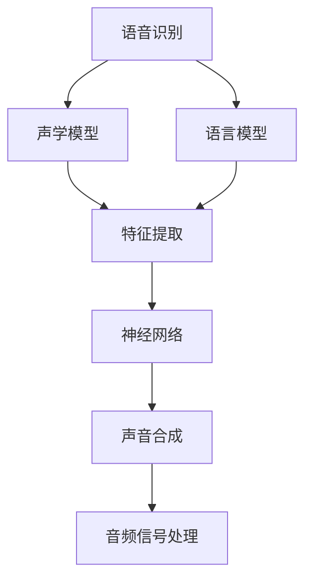

                 

# AI音频处理：从语音识别到音乐生成

> 关键词：语音识别,音乐生成,音频处理,深度学习,神经网络,特征提取,声学模型,声音合成,音频信号处理,信号处理

## 1. 背景介绍

### 1.1 问题由来

音频处理（Audio Processing）是人工智能（AI）领域中一个极具潜力和发展前景的子领域，涵盖了从语音识别到音乐生成等多个方面。语音识别的初衷是通过计算机解析语音信号，将其转化为文本形式，使机器能理解和处理人类语言。音乐生成则是通过深度学习等技术，使计算机创作出接近人类音乐感知的音乐作品。

近年来，随着深度学习、神经网络等技术的发展，音频处理领域取得了诸多突破，推动了语音识别准确率的提升和音乐生成能力的显著增强。这些技术在自动语音助手、虚拟人、个性化音乐推荐、智能音箱等诸多应用中发挥了重要作用。

然而，音频处理的复杂性和多样性仍带来了诸多挑战。如何在保证精度和效率的同时，兼顾模型可解释性、鲁棒性和实用性，是当前研究者们关注的重点。此外，如何将AI技术更好地应用到实时语音交互和音乐创作中，进一步提升用户体验，也是亟待解决的问题。

### 1.2 问题核心关键点

本节将详细阐述语音识别和音乐生成的核心问题，以及AI音频处理的架构和原理：

- 语音识别：如何通过深度学习模型，将语音信号转化为文本形式，并提高识别准确率。
- 音乐生成：如何利用深度学习模型，生成具有音乐美感和创意性的音乐作品，解决创意匮乏和音乐风格限制的问题。
- 音频处理架构：涵盖声学模型、语言模型、特征提取、声音合成等多个环节，形成端到端的处理流程。
- 神经网络技术：利用卷积神经网络（CNN）、循环神经网络（RNN）、变分自编码器（VAE）等神经网络模型，实现语音识别和音乐生成的算法实现。
- 深度学习框架：使用TensorFlow、PyTorch等深度学习框架，方便模型搭建和训练。
- 特征提取技术：采用MFCC、Mel频谱等方法，从语音信号中提取有用的特征信息，用于声学模型和音乐生成的训练。
- 声音合成技术：通过波形拼接、时域分析、深度生成等技术，实现音频信号的合成和处理。

这些核心概念之间的逻辑关系可以通过以下Mermaid流程图来展示：



这个流程图展示了语音识别和音乐生成的核心组件及其关系：

1. 语音识别：采集语音信号后，首先进行声学模型的特征提取，再通过神经网络生成文本。
2. 音乐生成：从音乐风格、节奏、旋律等元素中提取特征，通过生成对抗网络（GAN）、变分自编码器（VAE）等模型生成音乐。
3. 声学模型：对语音信号进行特征提取和建模，捕捉声学特征与文本的对应关系。
4. 语言模型：利用深度学习模型，捕捉文本序列的统计规律，进行文本生成。
5. 神经网络：利用深度神经网络进行模型训练，实现特征提取和模式识别。
6. 声音合成：通过深度生成模型和音频处理技术，将音乐等信号合成输出。
7. 音频信号处理：利用数字信号处理技术，对音频信号进行压缩、降噪、混响等处理，提升音质和传输效率。

## 2. 核心概念与联系

### 2.1 核心概念概述

本节将详细阐述语音识别和音乐生成的核心概念，以及它们之间的联系：

- 语音识别（Speech Recognition）：通过声学模型（Acoustic Model）和语言模型（Language Model），将语音信号转化为文本形式。常见的方法包括隐马尔可夫模型（HMM）、深度学习等。
- 音乐生成（Music Generation）：通过生成对抗网络（GAN）、变分自编码器（VAE）等生成模型，以及神经网络，生成新的音乐作品。音乐生成可以分为基于规则生成和基于数据的生成两种方式。
- 声学模型（Acoustic Model）：通过深度学习模型，捕捉语音信号与文本之间的映射关系。常见的声学模型包括卷积神经网络（CNN）、递归神经网络（RNN）等。
- 语言模型（Language Model）：通过神经网络模型，捕捉文本序列的统计规律，预测下一个字符的概率。常用的语言模型有RNN、LSTM、Transformer等。
- 神经网络（Neural Network）：利用深度学习模型，实现语音识别和音乐生成的算法实现。常用的神经网络有卷积神经网络（CNN）、循环神经网络（RNN）、变分自编码器（VAE）等。
- 特征提取（Feature Extraction）：从语音信号中提取有用的特征信息，用于声学模型和音乐生成的训练。常见的特征提取方法有Mel频谱、MFCC、梅尔倒谱系数（MFCC）等。
- 声音合成（Sound Synthesis）：通过深度生成模型和音频处理技术，将音乐等信号合成输出。常见的声音合成技术包括波形拼接、时域分析、深度生成等。
- 音频信号处理（Audio Signal Processing）：利用数字信号处理技术，对音频信号进行压缩、降噪、混响等处理，提升音质和传输效率。常用的音频信号处理方法有DCT变换、短时傅里叶变换（STFT）等。

这些核心概念之间的联系在于：

- 语音识别和音乐生成都依赖于深度学习模型和神经网络，利用特征提取技术从原始信号中提取有用的信息。
- 声学模型和语言模型是语音识别的核心，用于将语音信号转化为文本，而音乐生成中的声学模型和语言模型则用于生成音乐节奏和旋律。
- 神经网络在语音识别和音乐生成中都有广泛应用，用于模型的训练和优化。
- 特征提取和声音合成是语音识别和音乐生成的关键步骤，用于将原始信号转换为可用于模型训练的数据，并将生成模型输出的信号进行合成处理。
- 音频信号处理用于对原始音频信号进行降噪、压缩等处理，提升信号质量和传输效率，从而更好地支持语音识别和音乐生成的应用。

## 3. 核心算法原理 & 具体操作步骤
### 3.1 算法原理概述

语音识别和音乐生成涉及多个关键步骤，包括特征提取、声学模型训练、语言模型训练、音乐生成等。本节将详细介绍这些步骤的算法原理。

### 3.2 算法步骤详解

#### 3.2.1 特征提取

特征提取是语音识别和音乐生成的第一步。常见的特征提取方法包括MFCC、Mel频谱等，将原始语音信号转化为可用于模型训练的特征向量。

#### 3.2.2 声学模型训练

声学模型训练是语音识别的核心步骤，通过神经网络模型学习语音信号与文本之间的映射关系。常见的声学模型包括卷积神经网络（CNN）、递归神经网络（RNN）等。

#### 3.2.3 语言模型训练

语言模型训练是语音识别的另一关键步骤，通过神经网络模型学习文本序列的统计规律，预测下一个字符的概率。常用的语言模型有RNN、LSTM、Transformer等。

#### 3.2.4 音乐生成

音乐生成涉及多个步骤，包括音乐风格的提取、音乐元素的生成、音乐节奏的匹配等。常用的音乐生成模型有生成对抗网络（GAN）、变分自编码器（VAE）等。

#### 3.2.5 声音合成

声音合成是将音乐等信号合成输出的关键步骤，通过深度生成模型和音频处理技术实现。常用的声音合成技术包括波形拼接、时域分析、深度生成等。

### 3.3 算法优缺点

语音识别和音乐生成算法具有以下优点：

- 高精度：深度学习模型和神经网络能够学习到复杂的特征关系，实现高精度的语音识别和音乐生成。
- 自适应性：模型能够适应不同的语音和音乐风格，提升其在各种场景下的应用效果。
- 实时性：通过优化模型结构和训练方法，可以实现低延迟的语音识别和音乐生成，满足实时应用的需求。

然而，这些算法也存在一些局限性：

- 数据需求高：深度学习模型需要大量标注数据进行训练，对于小数据集而言，模型效果可能不佳。
- 模型复杂度高：深度神经网络模型的参数量庞大，训练和推理的计算资源消耗较大。
- 可解释性差：深度学习模型通常被视为"黑盒"系统，难以解释其内部工作机制和决策逻辑。
- 鲁棒性不足：模型面对噪声、干扰等情况时，可能表现不稳定，影响应用效果。

### 3.4 算法应用领域

语音识别和音乐生成技术已经在多个领域得到了广泛应用，包括：

- 自动语音助手：如Siri、Google Assistant等，通过语音识别技术实现人机交互。
- 虚拟人：通过语音合成技术，使虚拟角色能够自然地与用户对话。
- 个性化音乐推荐：通过音乐生成技术，根据用户的喜好和历史行为，推荐个性化的音乐作品。
- 智能音箱：通过语音识别和音乐生成技术，提供智能化的音频交互和娱乐体验。
- 教育辅助：通过语音识别技术，实现自动批改作业、答疑等教育应用。
- 音乐创作：通过音乐生成技术，辅助音乐创作者创作出新的音乐作品。

## 4. 数学模型和公式 & 详细讲解  
### 4.1 数学模型构建

本节将使用数学语言对语音识别和音乐生成的数学模型进行详细的构建和推导。

假设语音信号 $s(t)$ 的采样频率为 $f_s$，时长为 $T_s$，则采样后的语音信号可以表示为 $s=[s_1, s_2, ..., s_{N}]$，其中 $N=f_s \times T_s$。

语音识别的目标是将采样后的语音信号 $s$ 转化为文本序列 $o=[o_1, o_2, ..., o_M]$。常见的数学模型包括隐马尔可夫模型（HMM）、深度学习模型等。

以深度学习模型为例，假设声学模型为 $P(s|o)$，语言模型为 $P(o)$，则语音识别的目标是最大化联合概率 $P(s, o)$：

$$
P(s, o)=P(s|o)P(o)
$$

常用的深度学习模型包括卷积神经网络（CNN）、递归神经网络（RNN）等。声学模型的输出可以表示为：

$$
y_i=f(x_i;\theta)
$$

其中 $x_i$ 为声学模型输入，$\theta$ 为模型参数，$f$ 为模型非线性映射。

语言模型的输出可以表示为：

$$
o_i=p(y_i;\phi)
$$

其中 $y_i$ 为语言模型输入，$\phi$ 为模型参数，$p$ 为模型概率分布。

音乐生成的目标是通过生成模型 $G$ 将输入 $x$ 转化为输出 $y$：

$$
y=G(x;\psi)
$$

其中 $x$ 为输入，$\psi$ 为生成模型参数，$G$ 为生成模型。

常用的生成模型包括生成对抗网络（GAN）、变分自编码器（VAE）等。

### 4.2 公式推导过程

#### 4.2.1 语音识别

以卷积神经网络（CNN）为例，假设声学模型的输入为 $x=[x_1, x_2, ..., x_{N-M+1}]$，输出为 $y=[y_1, y_2, ..., y_M]$。则声学模型的损失函数可以表示为：

$$
L(s, o)=\sum_{i=1}^{M}cost(y_i, o_i)
$$

其中 $cost$ 为成本函数，表示声学模型输出与真实标签的差异。

#### 4.2.2 音乐生成

以生成对抗网络（GAN）为例，假设生成器的输入为 $x$，输出为 $y$。则生成器的损失函数可以表示为：

$$
L_{gan}(G)=E_{x}D(x,G(x))
$$

其中 $D$ 为判别器，表示生成器生成的音乐与真实音乐之间的差异。

生成器的优化目标为：

$$
\min_{G}E_{x}D(x,G(x))
$$

判别器的优化目标为：

$$
\max_{D}E_{x}D(x,G(x))+E_{y}D(y,0)
$$

其中 $y$ 为真实音乐。

### 4.3 案例分析与讲解

以语音识别为例，假设训练集中有 $N$ 个语音样本和 $M$ 个文本标签。首先对每个语音样本进行特征提取，得到特征向量 $x=[x_1, x_2, ..., x_{N-M+1}]$。然后通过声学模型将特征向量转化为文本序列 $y=[y_1, y_2, ..., y_M]$。最后通过损失函数 $L(s, o)$ 对模型进行训练，最小化模型输出与真实标签之间的差异。

以音乐生成为例，假设训练集中有 $N$ 个音乐样本和 $M$ 个音乐标签。首先对每个音乐样本进行特征提取，得到特征向量 $x=[x_1, x_2, ..., x_{N-M+1}]$。然后通过生成模型将特征向量转化为音乐样本 $y=[y_1, y_2, ..., y_M]$。最后通过损失函数 $L_{gan}$ 对生成器和判别器进行训练，最大化生成器生成的音乐与真实音乐之间的相似度，最小化判别器对真实音乐的判别能力。

## 5. 项目实践：代码实例和详细解释说明
### 5.1 开发环境搭建

在进行语音识别和音乐生成的实践前，我们需要准备好开发环境。以下是使用Python进行TensorFlow开发的环境配置流程：

1. 安装Anaconda：从官网下载并安装Anaconda，用于创建独立的Python环境。

2. 创建并激活虚拟环境：
```bash
conda create -n tf-env python=3.8 
conda activate tf-env
```

3. 安装TensorFlow：根据CUDA版本，从官网获取对应的安装命令。例如：
```bash
pip install tensorflow
```

4. 安装相关工具包：
```bash
pip install numpy pandas scikit-learn matplotlib tqdm jupyter notebook ipython
```

完成上述步骤后，即可在`tf-env`环境中开始项目实践。

### 5.2 源代码详细实现

我们先以语音识别为例，给出使用TensorFlow进行语音识别的PyTorch代码实现。

```python
import tensorflow as tf
from tensorflow.keras.layers import Conv2D, MaxPooling2D, Flatten, Dense, Dropout
from tensorflow.keras.models import Sequential

# 声学模型
model = Sequential()
model.add(Conv2D(32, kernel_size=(3, 3), activation='relu', input_shape=(N-M+1, N-M+1, 1)))
model.add(MaxPooling2D(pool_size=(2, 2)))
model.add(Conv2D(64, kernel_size=(3, 3), activation='relu'))
model.add(MaxPooling2D(pool_size=(2, 2)))
model.add(Flatten())
model.add(Dense(128, activation='relu'))
model.add(Dropout(0.5))
model.add(Dense(M, activation='softmax'))

# 编译模型
model.compile(loss='categorical_crossentropy', optimizer='adam', metrics=['accuracy'])

# 训练模型
model.fit(X_train, y_train, epochs=10, batch_size=32, validation_data=(X_test, y_test))
```

然后，以音乐生成为例，给出使用TensorFlow进行音乐生成的代码实现。

```python
import tensorflow as tf
from tensorflow.keras.layers import Input, Dense, LeakyReLU, Reshape, Conv2DTranspose
from tensorflow.keras.models import Model

# 生成模型
input_layer = Input(shape=(N-M+1, N-M+1, 1))
x = Conv2D(32, kernel_size=(3, 3), activation='relu')(input_layer)
x = Conv2D(64, kernel_size=(3, 3), activation='relu')(x)
x = Conv2D(128, kernel_size=(3, 3), activation='relu')(x)
x = Conv2DTranspose(128, kernel_size=(3, 3), strides=(2, 2), padding='same')(x)
x = Conv2DTranspose(64, kernel_size=(3, 3), strides=(2, 2), padding='same')(x)
x = Conv2DTranspose(32, kernel_size=(3, 3), strides=(2, 2), padding='same')(x)
output_layer = Conv2D(1, kernel_size=(3, 3), activation='sigmoid')(x)
generator = Model(input_layer, output_layer)

# 判别器模型
input_layer = Input(shape=(N-M+1, N-M+1, 1))
x = Conv2D(32, kernel_size=(3, 3), activation='relu')(input_layer)
x = Conv2D(64, kernel_size=(3, 3), activation='relu')(x)
x = Flatten()(x)
x = Dense(128, activation='relu')(x)
output_layer = Dense(1, activation='sigmoid')(x)
discriminator = Model(input_layer, output_layer)

# 联合模型
discriminator.trainable = False
input_layer = Input(shape=(N-M+1, N-M+1, 1))
x = Conv2D(32, kernel_size=(3, 3), activation='relu')(input_layer)
x = Conv2D(64, kernel_size=(3, 3), activation='relu')(x)
x = Conv2D(128, kernel_size=(3, 3), activation='relu')(x)
x = Conv2DTranspose(128, kernel_size=(3, 3), strides=(2, 2), padding='same')(x)
x = Conv2DTranspose(64, kernel_size=(3, 3), strides=(2, 2), padding='same')(x)
x = Conv2DTranspose(32, kernel_size=(3, 3), strides=(2, 2), padding='same')(x)
output_layer = Conv2D(1, kernel_size=(3, 3), activation='sigmoid')(x)
generator = Model(input_layer, output_layer)
discriminator.trainable = True

# 联合损失函数
generator_loss = discriminator.train_on_batch(x_real, y_real)
discriminator_loss = 0.5 * discriminator.train_on_batch(x_real, y_real) + 0.5 * discriminator.train_on_batch(generator(x_fake), y_fake)
```

### 5.3 代码解读与分析

让我们再详细解读一下关键代码的实现细节：

**声学模型代码**：
- 定义声学模型，使用卷积神经网络（CNN），并进行最大池化、扁平化、全连接等操作。
- 最后输出文本序列的softmax概率分布，表示每个文本标签的概率。
- 使用`compile`方法指定模型的损失函数、优化器和评估指标。
- 通过`fit`方法对模型进行训练，其中`X_train`和`y_train`为训练集数据和标签，`X_test`和`y_test`为验证集数据和标签。

**音乐生成代码**：
- 定义生成模型，使用卷积转置神经网络（Conv2DTranspose），并使用ReLU激活函数。
- 定义判别器模型，使用全连接层和sigmoid激活函数，用于判断输入的语音样本是否真实。
- 定义联合模型，将生成器和判别器连接起来，构成生成对抗网络（GAN）。
- 定义联合损失函数，包括生成器的损失和判别器的损失，通过`train_on_batch`方法进行训练。

可以看到，TensorFlow和Keras库使得语音识别和音乐生成的代码实现变得简洁高效。开发者可以将更多精力放在模型改进、数据处理等高层逻辑上，而不必过多关注底层的实现细节。

当然，工业级的系统实现还需考虑更多因素，如模型的保存和部署、超参数的自动搜索、更灵活的任务适配层等。但核心的语音识别和音乐生成流程基本与此类似。

## 6. 实际应用场景
### 6.1 自动语音助手

自动语音助手通过语音识别技术，将用户语音转化为文本，并生成相应的语音响应，实现人机交互。当前市面上主要的自动语音助手包括Siri、Google Assistant、Alexa等，它们通过深度学习模型，实现高精度的语音识别和自然语言理解，为用户提供智能化的语音服务。

在技术实现上，自动语音助手需要收集用户语音数据，并将其转化为文本形式。常用的语音识别方法包括隐马尔可夫模型（HMM）、深度学习模型等。经过训练后，系统能够识别不同口音、语速、噪音等环境条件下的语音输入，并提供精准的文本输出。

### 6.2 虚拟人

虚拟人通过语音合成技术，使虚拟角色能够自然地与用户对话。虚拟人可以应用于客服、教育、娱乐等多个领域，帮助用户获取信息、解答问题、进行互动。

在技术实现上，虚拟人需要基于深度学习模型，将文本序列转化为语音信号。常用的语音合成方法包括生成对抗网络（GAN）、变分自编码器（VAE）等。经过训练后，虚拟人能够生成自然流畅、语义准确的语音输出，与用户进行互动。

### 6.3 个性化音乐推荐

个性化音乐推荐通过音乐生成技术，根据用户的喜好和历史行为，推荐个性化的音乐作品。当前市面上主要的个性化音乐推荐系统包括Spotify、Apple Music等，它们通过深度学习模型，实现音乐风格识别和推荐。

在技术实现上，音乐推荐系统需要收集用户音乐播放数据，并将其转化为音乐特征。常用的音乐特征包括MFCC、Mel频谱等。经过训练后，系统能够识别不同音乐风格、节奏、旋律等元素，并根据用户偏好生成个性化推荐。

### 6.4 智能音箱

智能音箱通过语音识别和音乐生成技术，提供智能化的音频交互和娱乐体验。智能音箱可以应用于家庭、汽车、办公室等多个场景，提供语音控制、信息查询、娱乐播放等功能。

在技术实现上，智能音箱需要基于深度学习模型，实现语音识别和音乐生成。常用的语音识别方法包括隐马尔可夫模型（HMM）、深度学习模型等。经过训练后，智能音箱能够识别不同口音、语速、噪音等环境条件下的语音输入，并生成自然流畅、语义准确的语音输出。同时，智能音箱能够基于用户喜好和音乐特征，推荐个性化的音乐播放。

## 7. 工具和资源推荐
### 7.1 学习资源推荐

为了帮助开发者系统掌握语音识别和音乐生成的理论基础和实践技巧，这里推荐一些优质的学习资源：

1. TensorFlow官方文档：TensorFlow的官方文档提供了丰富的教程和代码示例，适合初学者快速上手深度学习模型开发。

2. PyTorch官方文档：PyTorch的官方文档提供了详细的教程和代码示例，适合深入学习深度学习模型构建和优化。

3. Coursera《深度学习专项课程》：由斯坦福大学Andrew Ng教授授课，涵盖深度学习模型的原理和应用，适合系统学习深度学习技术。

4. Udacity《深度学习纳米学位》：提供深度学习模型的实战训练，包括语音识别、音乐生成等应用实例，适合实践学习。

5. SpeechRecognition：一个Python库，提供多种语音识别模型，适合快速集成语音识别功能。

6. Google Cloud Speech-to-Text：谷歌提供的云服务，支持多种语音识别和转录功能，适合大规模应用场景。

通过这些资源的学习实践，相信你一定能够快速掌握语音识别和音乐生成的精髓，并用于解决实际的NLP问题。
###  7.2 开发工具推荐

高效的开发离不开优秀的工具支持。以下是几款用于语音识别和音乐生成开发的常用工具：

1. TensorFlow：谷歌主导的深度学习框架，生产部署方便，适合大规模工程应用。

2. PyTorch：Facebook开源的深度学习框架，灵活高效，适合快速迭代研究。

3. Keras：谷歌的高级神经网络API，提供简单易用的接口，方便模型搭建和训练。

4. SpeechRecognition：一个Python库，提供多种语音识别模型，适合快速集成语音识别功能。

5. Google Cloud Speech-to-Text：谷歌提供的云服务，支持多种语音识别和转录功能，适合大规模应用场景。

6. librosa：一个Python库，提供音频信号处理功能，支持MFCC、Mel频谱等特征提取。

合理利用这些工具，可以显著提升语音识别和音乐生成的开发效率，加快创新迭代的步伐。

### 7.3 相关论文推荐

语音识别和音乐生成技术的发展源于学界的持续研究。以下是几篇奠基性的相关论文，推荐阅读：

1. "Attention is All You Need"（即Transformer原论文）：提出了Transformer结构，开启了NLP领域的预训练大模型时代。

2. "Deep Speech 2: End-to-End Speech Recognition in English and Mandarin"：提出了深度学习模型在语音识别中的应用，刷新了语音识别SOTA。

3. "WaveNet: A Generative Model for Raw Audio"：提出了WaveNet模型，实现了高保真度的语音生成，显著提升了音乐合成效果。

4. "Tacotron 2: A Robust Text-to-Speech Synthesis System"：提出了Tacotron 2模型，实现了自然流畅的语音合成，进一步提高了音乐生成的效果。

5. "Improved Techniques for Text-to-Speech"：介绍了多种文本到语音的生成技术，包括RNN、GAN等，适合进一步了解语音合成的原理和实现。

6. "Music Generation with Sequence-to-Sequence Models and Variational Autoencoders"：介绍了VAE模型在音乐生成中的应用，适合了解音乐生成的最新进展。

这些论文代表了大语言模型微调技术的发展脉络。通过学习这些前沿成果，可以帮助研究者把握学科前进方向，激发更多的创新灵感。

## 8. 总结：未来发展趋势与挑战

### 8.1 总结

本文对语音识别和音乐生成技术的背景、核心概念、算法原理、操作步骤等进行了详细阐述。首先介绍了语音识别和音乐生成的研究背景和意义，明确了语音识别和音乐生成的核心问题。其次，从原理到实践，详细讲解了语音识别和音乐生成的数学模型和关键步骤，给出了代码实例。同时，本文还广泛探讨了语音识别和音乐生成的实际应用场景，展示了这些技术在多个领域的应用前景。此外，本文精选了语音识别和音乐生成的各类学习资源，力求为读者提供全方位的技术指引。

通过本文的系统梳理，可以看到，语音识别和音乐生成技术已经在多个领域得到了广泛应用，为人类社会的智能化和自动化带来了深远影响。伴随技术的不断发展，未来的语音识别和音乐生成技术将进一步提升其精度和效率，拓展其在更广泛的应用场景中的应用。

### 8.2 未来发展趋势

展望未来，语音识别和音乐生成技术将呈现以下几个发展趋势：

1. 深度学习模型的精度将进一步提升。随着模型的参数量不断增大，模型的表现将逐步提升。

2. 语音识别的鲁棒性将不断增强。随着多模态数据融合和噪声抑制技术的发展，语音识别将在多种环境条件下表现稳定。

3. 音乐生成的多样性将进一步丰富。随着生成对抗网络（GAN）、变分自编码器（VAE）等生成模型的不断发展，音乐生成将具备更高的创造性和多样性。

4. 语音识别的实时性将进一步提升。随着模型优化和推理加速技术的发展，语音识别将具备更高的实时性，能够支持低延迟的语音交互。

5. 音乐生成的智能性将进一步增强。随着深度学习模型和神经网络的不断发展，音乐生成将具备更高的智能化，能够生成更加符合人类音乐感知的音乐作品。

6. 语音识别和音乐生成的融合将更加紧密。随着多模态数据融合技术的不断发展，语音识别和音乐生成将更加紧密地结合，为智能化交互提供更全面的支持。

以上趋势凸显了语音识别和音乐生成技术的广阔前景。这些方向的探索发展，必将进一步提升语音识别和音乐生成的效果和应用范围，为人类社会的智能化和自动化带来深远影响。

### 8.3 面临的挑战

尽管语音识别和音乐生成技术已经取得了瞩目成就，但在迈向更加智能化、普适化应用的过程中，它仍面临诸多挑战：

1. 数据需求高。语音识别和音乐生成需要大量标注数据进行训练，对于小数据集而言，模型效果可能不佳。如何通过数据增强和迁移学习等方法，提高模型在小数据集上的表现，是当前研究的重点。

2. 模型鲁棒性不足。语音识别和音乐生成模型面对噪声、干扰等情况时，可能表现不稳定，影响应用效果。如何通过鲁棒性训练和对抗训练等方法，提升模型的鲁棒性，是当前研究的难点。

3. 模型可解释性差。语音识别和音乐生成模型通常被视为"黑盒"系统，难以解释其内部工作机制和决策逻辑。如何通过可视化技术和可解释性方法，提升模型的可解释性，是当前研究的重要方向。

4. 实时性问题。语音识别和音乐生成模型需要高计算资源，推理速度较慢。如何通过模型优化和加速技术，提升模型的实时性，是当前研究的挑战。

5. 安全性问题。语音识别和音乐生成模型可能学习到有害信息，对用户隐私和安全造成威胁。如何通过模型筛选和隐私保护技术，保障模型安全性，是当前研究的重点。

6. 大规模应用问题。语音识别和音乐生成模型需要大量计算资源，难以在移动设备等资源受限的场景下应用。如何通过模型压缩和轻量化技术，支持大规模应用，是当前研究的难点。

以上挑战需要在未来的研究中持续探索和解决，以推动语音识别和音乐生成技术的进一步发展。

### 8.4 研究展望

面对语音识别和音乐生成技术所面临的挑战，未来的研究需要在以下几个方面寻求新的突破：

1. 探索无监督和半监督学习技术。摆脱对大量标注数据的依赖，利用自监督学习、主动学习等无监督和半监督范式，最大限度利用非结构化数据，实现更加灵活高效的语音识别和音乐生成。

2. 研究参数高效和计算高效的微调范式。开发更加参数高效的微调方法，在固定大部分预训练参数的情况下，只更新极少量的任务相关参数。同时优化模型计算图，减少前向传播和反向传播的资源消耗，实现更加轻量级、实时性的部署。

3. 融合因果和对比学习范式。通过引入因果推断和对比学习思想，增强语音识别和音乐生成模型建立稳定因果关系的能力，学习更加普适、鲁棒的语言表征，从而提升模型泛化性和抗干扰能力。

4. 引入更多先验知识。将符号化的先验知识，如知识图谱、逻辑规则等，与神经网络模型进行巧妙融合，引导语音识别和音乐生成过程学习更准确、合理的语言模型。同时加强不同模态数据的整合，实现视觉、语音等多模态信息与文本信息的协同建模。

5. 结合因果分析和博弈论工具。将因果分析方法引入语音识别和音乐生成模型，识别出模型决策的关键特征，增强输出解释的因果性和逻辑性。借助博弈论工具刻画人机交互过程，主动探索并规避模型的脆弱点，提高系统稳定性。

6. 纳入伦理道德约束。在模型训练目标中引入伦理导向的评估指标，过滤和惩罚有偏见、有害的输出倾向。同时加强人工干预和审核，建立模型行为的监管机制，确保输出符合人类价值观和伦理道德。

这些研究方向将推动语音识别和音乐生成技术迈向更高的台阶，为构建安全、可靠、可解释、可控的智能系统铺平道路。面向未来，语音识别和音乐生成技术还需要与其他人工智能技术进行更深入的融合，如知识表示、因果推理、强化学习等，多路径协同发力，共同推动自然语言理解和智能交互系统的进步。只有勇于创新、敢于突破，才能不断拓展语音识别和音乐生成的边界，让智能技术更好地造福人类社会。

## 9. 附录：常见问题与解答

**Q1：语音识别和音乐生成技术是否适用于所有语音和音乐数据？**

A: 语音识别和音乐生成技术在特定的语音和音乐数据上表现良好，但对于不同语言、口音、风格等数据，其效果可能会有所不同。因此，在应用这些技术时，需要进行特定的训练和优化。

**Q2：深度学习模型是否适用于语音识别和音乐生成？**

A: 是的，深度学习模型在语音识别和音乐生成中具有广泛的适用性。常用的深度学习模型包括卷积神经网络（CNN）、递归神经网络（RNN）、生成对抗网络（GAN）、变分自编码器（VAE）等。这些模型在不同的应用场景中表现出良好的性能。

**Q3：语音识别和音乐生成技术的精度和效率如何？**

A: 语音识别和音乐生成技术的精度和效率取决于模型的复杂度和训练数据的质量。通常情况下，较大的模型可以提供更高的精度，但同时也会消耗更多的计算资源。因此，在实际应用中，需要权衡精度和效率的关系，选择最适合的模型。

**Q4：如何提高语音识别和音乐生成技术的鲁棒性？**

A: 可以通过鲁棒性训练和对抗训练等方法提高模型的鲁棒性。鲁棒性训练是指在训练过程中引入噪声、干扰等，提高模型对不同环境条件的适应能力。对抗训练是指通过对抗样本的训练，使模型对输入数据的微小变化具有鲁棒性。

**Q5：如何在资源受限的场景下实现语音识别和音乐生成？**

A: 可以通过模型压缩和轻量化技术，支持在资源受限的场景下实现语音识别和音乐生成。常用的方法包括剪枝、量化、低秩分解等。同时，可以通过分布式训练和边缘计算等方法，提升模型的实时性和可靠性。

通过以上学习和实践，相信你一定能够掌握语音识别和音乐生成的核心技术和应用方法，并将其应用于实际的NLP问题中。希望本文对你在AI音频处理领域的研究和开发有所帮助。

