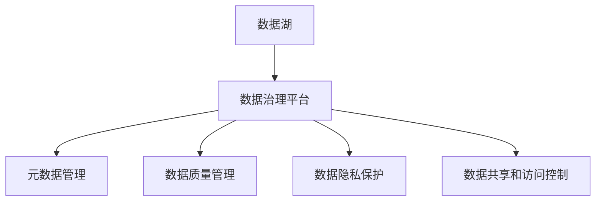

                 

# AI驱动的企业数据治理方案

> 关键词：人工智能,数据治理,企业信息化,数据湖,元数据管理,数据质量,隐私保护,数据治理平台

## 1. 背景介绍

在当今数字化转型的时代，数据成为了企业的重要资产。然而，数据的多样性和复杂性，使得数据管理和治理面临巨大的挑战。传统的业务数据仓库和数据治理系统往往难以应对海量数据的存储、处理和分析需求。与此同时，数据治理的不足也成为企业创新发展的瓶颈。AI技术的引入，为解决这些问题提供了全新的思路和方法。

### 1.1 数据治理的重要性

数据治理（Data Governance）指的是对数据的收集、存储、处理、分析和使用的管理和规范。有效的数据治理能够确保数据的准确性、完整性、一致性和可用性，为企业的决策和运营提供可靠的数据支撑。数据治理的核心目标包括：

- **数据质量**：保证数据的准确性、完整性和一致性，减少数据错误和偏差。
- **数据安全**：保护数据的隐私和安全，防止数据泄露和滥用。
- **数据合规**：确保数据使用符合相关法律法规和业务规则。
- **数据共享**：促进数据在企业内部的有效共享和流通，提升数据利用效率。

数据治理的良好实施，能够帮助企业更好地利用数据资源，驱动业务创新，提升竞争优势。

### 1.2 数据治理面临的挑战

当前数据治理面临的主要挑战包括：

- **数据量庞大**：随着业务的发展，数据量呈指数级增长，数据治理难度加大。
- **数据来源多样**：数据来自不同的业务系统、不同的数据格式，数据治理复杂。
- **数据质量差**：数据缺失、不一致、不准确等问题普遍存在，数据治理工作量大。
- **数据孤岛**：数据分散在不同的业务系统和部门，缺乏统一管理和共享机制。
- **数据安全风险**：数据泄露、滥用等安全问题频发，数据治理需加强安全防护。
- **数据治理工具缺乏**：现有数据治理工具功能单一，难以满足复杂的数据治理需求。

## 2. 核心概念与联系

### 2.1 核心概念概述

为更好地理解AI驱动的企业数据治理方案，本节将介绍几个关键概念：

- **数据湖（Data Lake）**：一个集成了各种数据源的大规模数据存储平台，能够存储结构化和非结构化数据，支持各种数据处理和分析需求。
- **数据治理（Data Governance）**：通过对数据的收集、存储、处理、分析和使用的管理和规范，确保数据的准确性、完整性、一致性和可用性。
- **元数据管理（Metadata Management）**：记录和管理数据相关元信息（如数据来源、结构、质量等），为数据治理提供基础支持。
- **数据质量管理（Data Quality Management）**：通过数据清洗、去重、校验等手段，提升数据质量，确保数据准确可靠。
- **数据隐私保护（Data Privacy Protection）**：通过加密、匿名化、访问控制等措施，保护数据的隐私安全，防止数据滥用。
- **数据治理平台（Data Governance Platform）**：集成数据湖、元数据管理、数据质量管理、数据隐私保护等功能的综合平台，支持数据治理的自动化和智能化。

这些概念之间存在紧密的联系，共同构成了企业数据治理的完整框架：



### 2.2 核心概念原理和架构

#### 2.2.1 数据湖原理

数据湖是一个以文件格式存储的，支持各种数据类型和格式的分布式存储系统。其原理和架构如下：

1. **分布式存储**：采用分布式文件系统（如HDFS、S3等），将数据分散存储在多个节点上，提升数据处理能力和扩展性。
2. **多数据格式支持**：支持结构化数据（如SQL数据库）、非结构化数据（如文本、图片、视频等）、半结构化数据（如JSON、XML），满足不同数据类型的需求。
3. **高性能计算**：通过分布式计算框架（如Spark、Hive等），实现高效的数据处理和分析。
4. **大数据存储**：能够存储海量数据，支持数据的高效读写和访问。

#### 2.2.2 数据治理平台架构

数据治理平台通过整合数据湖、元数据管理、数据质量管理、数据隐私保护等功能模块，实现数据的集中管理和治理。其架构如下：

1. **数据接入层**：连接各种数据源（如数据库、文件、API等），实现数据的采集和集成。
2. **数据存储层**：采用数据湖存储数据，支持大规模数据存储和处理。
3. **元数据管理层**：记录和管理数据相关元信息，支持数据分类、命名、关系管理等。
4. **数据质量管理层**：通过数据清洗、去重、校验等手段，提升数据质量。
5. **数据隐私保护层**：采用加密、匿名化、访问控制等措施，保护数据的隐私安全。
6. **数据服务层**：提供数据分析、数据可视化、数据共享等数据服务，支持数据的使用和共享。
7. **用户管理层**：通过用户权限和访问控制，确保数据的安全性和合规性。

## 3. 核心算法原理 & 具体操作步骤

### 3.1 算法原理概述

AI驱动的企业数据治理方案，本质上是将AI技术应用于数据治理的不同环节，通过自动化、智能化手段提升数据治理的效率和效果。其核心算法包括：

- **数据分类和命名规范**：利用自然语言处理（NLP）技术，自动识别和分类数据，并生成统一的命名规范。
- **数据质量检测和修复**：利用机器学习（ML）技术，自动识别数据中的异常和错误，并自动修复。
- **数据隐私保护**：利用加密和匿名化技术，保护数据的隐私安全，防止数据泄露和滥用。
- **数据治理决策支持**：利用预测模型和规则引擎，辅助数据治理决策，提升治理效率和效果。

### 3.2 算法步骤详解

#### 3.2.1 数据接入和清洗

1. **数据接入**：通过API接口、ETL工具等方式，将数据源接入到数据治理平台。
2. **数据清洗**：对数据进行初步清洗，去除重复、错误、缺失等数据。
3. **数据转换**：将数据转换为标准格式，便于后续处理和分析。

#### 3.2.2 数据分类和命名规范

1. **数据分类**：利用NLP技术，自动识别数据类型（如结构化、非结构化）和数据内容（如文本、图片）。
2. **数据命名规范**：生成统一的命名规范，避免数据命名混乱和歧义。

#### 3.2.3 数据质量检测和修复

1. **数据质量检测**：利用ML技术，自动检测数据中的异常和错误。
2. **数据质量修复**：自动修复数据中的异常和错误，确保数据质量。

#### 3.2.4 数据隐私保护

1. **数据加密**：对敏感数据进行加密处理，防止数据泄露。
2. **数据匿名化**：对数据进行匿名化处理，保护个人隐私。
3. **访问控制**：通过权限控制，限制数据的访问和使用。

#### 3.2.5 数据治理决策支持

1. **预测模型**：利用预测模型，自动分析数据趋势和模式，辅助决策。
2. **规则引擎**：通过规则引擎，自动化执行数据治理策略和规则。

### 3.3 算法优缺点

#### 3.3.1 优点

- **自动化**：自动化处理数据分类、命名规范、数据清洗、隐私保护等任务，提升效率。
- **智能化**：利用ML和NLP技术，提升数据质量检测和修复的准确性和效果。
- **可扩展性**：支持大规模数据处理和分析，能够处理海量数据。
- **灵活性**：支持多种数据源和数据格式，灵活适应不同数据需求。

#### 3.3.2 缺点

- **依赖数据质量**：AI技术的效果依赖于数据的质量和完整性，数据质量差时效果不佳。
- **模型偏差**：模型训练依赖于历史数据，模型可能存在偏差，影响预测结果。
- **隐私保护限制**：隐私保护措施可能影响数据的使用和共享，需要在隐私保护和数据利用之间找到平衡。
- **复杂度较高**：算法实现复杂，需要整合多种技术和工具，对技术要求较高。

### 3.4 算法应用领域

#### 3.4.1 数据分类和命名规范

适用于数据源多样、数据命名混乱的场景，如企业内部数据、外部数据等。通过自动识别和分类数据，生成统一的命名规范，提升数据治理效率和效果。

#### 3.4.2 数据质量检测和修复

适用于数据质量差、数据缺失、数据错误较多的场景，如银行金融数据、电商交易数据等。通过自动检测和修复数据质量问题，提升数据准确性和完整性。

#### 3.4.3 数据隐私保护

适用于对数据隐私和安全要求较高的场景，如医疗健康数据、政府数据等。通过加密、匿名化、访问控制等措施，保护数据的隐私安全。

#### 3.4.4 数据治理决策支持

适用于数据治理决策复杂、规则繁多的场景，如金融风控、客户关系管理等。通过预测模型和规则引擎，辅助数据治理决策，提升治理效率和效果。

## 4. 数学模型和公式 & 详细讲解 & 举例说明

### 4.1 数学模型构建

#### 4.1.1 数据分类和命名规范

数据分类和命名规范通过NLP技术实现，核心模型包括词向量模型、主题模型等。其数学模型如下：

1. **词向量模型**：将文本数据转换为向量表示，支持文本分类和命名规范生成。
2. **主题模型**：自动发现文本数据中的主题和类别，支持数据分类和命名规范生成。

#### 4.1.2 数据质量检测和修复

数据质量检测和修复通过ML技术实现，核心模型包括回归模型、分类模型等。其数学模型如下：

1. **回归模型**：用于检测和修复数据中的连续性错误，如数值型数据的异常值检测和修复。
2. **分类模型**：用于检测和修复数据中的离散型错误，如分类数据的异常值检测和修复。

#### 4.1.3 数据隐私保护

数据隐私保护通过加密和匿名化技术实现，核心模型包括对称加密、非对称加密、数据匿名化等。其数学模型如下：

1. **对称加密**：通过密钥加密和解密数据，保护数据隐私。
2. **非对称加密**：通过公钥加密和私钥解密数据，保护数据隐私。
3. **数据匿名化**：通过数据变换和扰动，保护数据隐私。

#### 4.1.4 数据治理决策支持

数据治理决策支持通过预测模型和规则引擎实现，核心模型包括决策树模型、随机森林模型、规则引擎等。其数学模型如下：

1. **决策树模型**：用于数据治理决策的预测和分类，支持自动分析和处理数据治理任务。
2. **随机森林模型**：用于数据治理决策的分类和预测，支持自动分析和处理数据治理任务。
3. **规则引擎**：通过规则定义和执行，支持数据治理决策的自动化和智能化。

### 4.2 公式推导过程

#### 4.2.1 词向量模型

词向量模型通过Word2Vec、GloVe等算法实现，将文本数据转换为向量表示，其数学模型如下：

$$
\vec{v} = \sum_{i=1}^{n} w_i \vec{v}_i
$$

其中，$w_i$为词权重，$\vec{v}_i$为词向量。

#### 4.2.2 回归模型

回归模型通过线性回归、多项式回归等算法实现，用于检测和修复数据中的连续性错误，其数学模型如下：

$$
y = \beta_0 + \sum_{i=1}^{p} \beta_i x_i + \epsilon
$$

其中，$y$为预测值，$x_i$为自变量，$\beta_i$为回归系数，$\epsilon$为随机误差。

#### 4.2.3 分类模型

分类模型通过逻辑回归、决策树、随机森林等算法实现，用于检测和修复数据中的离散型错误，其数学模型如下：

$$
P(y|x) = \frac{e^{\beta_0 + \sum_{i=1}^{p} \beta_i x_i}}{1 + e^{\beta_0 + \sum_{i=1}^{p} \beta_i x_i}}
$$

其中，$P(y|x)$为预测概率，$x_i$为自变量，$\beta_i$为回归系数。

#### 4.2.4 对称加密

对称加密通过DES、AES等算法实现，其数学模型如下：

$$
C = E_K(P)
$$

其中，$C$为密文，$P$为明文，$E_K$为加密算法，$K$为加密密钥。

#### 4.2.5 非对称加密

非对称加密通过RSA、ECC等算法实现，其数学模型如下：

$$
C = E_{K_p}(P) \oplus E_{K_s}(P)
$$

其中，$C$为密文，$P$为明文，$E_{K_p}$为公钥加密算法，$E_{K_s}$为私钥加密算法，$K_p$为公钥，$K_s$为私钥。

#### 4.2.6 数据匿名化

数据匿名化通过数据扰动、数据替换等算法实现，其数学模型如下：

$$
D' = f(D)
$$

其中，$D'$为匿名化数据，$D$为原始数据，$f$为匿名化函数。

#### 4.2.7 决策树模型

决策树模型通过CART、C4.5等算法实现，其数学模型如下：

$$
y = \sum_{i=1}^{n} \alpha_i \cdot \text{Node}_i
$$

其中，$y$为预测值，$\alpha_i$为节点权重，$\text{Node}_i$为决策树节点。

#### 4.2.8 随机森林模型

随机森林模型通过Bagging和Boosting等算法实现，其数学模型如下：

$$
y = \frac{1}{M} \sum_{m=1}^{M} \sum_{i=1}^{n} \alpha_{m,i} \cdot \text{Node}_{m,i}
$$

其中，$y$为预测值，$M$为随机森林中决策树的个数，$\alpha_{m,i}$为节点权重，$\text{Node}_{m,i}$为决策树节点。

#### 4.2.9 规则引擎

规则引擎通过if-then-else语句实现，其数学模型如下：

$$
y = \begin{cases}
x_1, & x_1 \geq \text{Threshold}_1 \\
x_2, & x_2 \geq \text{Threshold}_2 \\
\vdots \\
x_n, & x_n \geq \text{Threshold}_n
\end{cases}
$$

其中，$y$为输出结果，$x_i$为输入变量，$\text{Threshold}_i$为规则阈值。

### 4.3 案例分析与讲解

#### 4.3.1 数据分类和命名规范

以电商交易数据为例，通过NLP技术实现数据分类和命名规范：

1. **数据分类**：自动将订单数据、用户数据、商品数据等分类，生成统一的数据格式。
2. **命名规范**：自动生成统一的字段命名规范，避免数据命名混乱和歧义。

#### 4.3.2 数据质量检测和修复

以银行金融数据为例，通过ML技术实现数据质量检测和修复：

1. **数据质量检测**：自动检测账户余额、交易金额等数据中的异常和错误。
2. **数据质量修复**：自动修复数据中的异常和错误，确保数据准确性和完整性。

#### 4.3.3 数据隐私保护

以医疗健康数据为例，通过加密和匿名化技术实现数据隐私保护：

1. **数据加密**：对患者姓名、身份证号等敏感数据进行加密处理，防止数据泄露。
2. **数据匿名化**：对患者医疗记录进行匿名化处理，保护患者隐私。

#### 4.3.4 数据治理决策支持

以客户关系管理为例，通过预测模型和规则引擎实现数据治理决策支持：

1. **预测模型**：自动分析客户行为数据，预测客户流失风险，辅助决策。
2. **规则引擎**：通过规则定义和执行，自动执行客户关系管理策略，提升客户满意度。

## 5. 项目实践：代码实例和详细解释说明

### 5.1 开发环境搭建

在进行项目实践前，我们需要准备好开发环境。以下是使用Python进行PyTorch开发的环境配置流程：

1. 安装Anaconda：从官网下载并安装Anaconda，用于创建独立的Python环境。

2. 创建并激活虚拟环境：
```bash
conda create -n pytorch-env python=3.8 
conda activate pytorch-env
```

3. 安装PyTorch：根据CUDA版本，从官网获取对应的安装命令。例如：
```bash
conda install pytorch torchvision torchaudio cudatoolkit=11.1 -c pytorch -c conda-forge
```

4. 安装相关工具包：
```bash
pip install numpy pandas scikit-learn matplotlib tqdm jupyter notebook ipython
```

完成上述步骤后，即可在`pytorch-env`环境中开始项目实践。

### 5.2 源代码详细实现

下面以数据分类和命名规范为例，给出使用PyTorch和Transformers库进行数据分类的代码实现。

首先，定义数据集和模型：

```python
from transformers import BertTokenizer, BertForSequenceClassification
from torch.utils.data import Dataset, DataLoader
import torch

# 数据集
class MyDataset(Dataset):
    def __init__(self, texts, labels):
        self.texts = texts
        self.labels = labels
        self.tokenizer = BertTokenizer.from_pretrained('bert-base-uncased')
        
    def __len__(self):
        return len(self.texts)
    
    def __getitem__(self, item):
        text = self.texts[item]
        label = self.labels[item]
        encoding = self.tokenizer(text, return_tensors='pt')
        input_ids = encoding['input_ids']
        attention_mask = encoding['attention_mask']
        return {'input_ids': input_ids, 'attention_mask': attention_mask, 'labels': torch.tensor(label)}

# 模型
model = BertForSequenceClassification.from_pretrained('bert-base-uncased', num_labels=2)

# 优化器和超参数
optimizer = torch.optim.AdamW(model.parameters(), lr=2e-5)
```

然后，定义训练和评估函数：

```python
device = torch.device('cuda') if torch.cuda.is_available() else torch.device('cpu')
model.to(device)

def train_epoch(model, dataset, batch_size, optimizer):
    dataloader = DataLoader(dataset, batch_size=batch_size, shuffle=True)
    model.train()
    epoch_loss = 0
    for batch in dataloader:
        input_ids = batch['input_ids'].to(device)
        attention_mask = batch['attention_mask'].to(device)
        labels = batch['labels'].to(device)
        model.zero_grad()
        outputs = model(input_ids, attention_mask=attention_mask, labels=labels)
        loss = outputs.loss
        epoch_loss += loss.item()
        loss.backward()
        optimizer.step()
    return epoch_loss / len(dataloader)

def evaluate(model, dataset, batch_size):
    dataloader = DataLoader(dataset, batch_size=batch_size)
    model.eval()
    preds, labels = [], []
    with torch.no_grad():
        for batch in dataloader:
            input_ids = batch['input_ids'].to(device)
            attention_mask = batch['attention_mask'].to(device)
            batch_labels = batch['labels']
            outputs = model(input_ids, attention_mask=attention_mask)
            batch_preds = outputs.logits.argmax(dim=2).to('cpu').tolist()
            batch_labels = batch_labels.to('cpu').tolist()
            for pred_tokens, label_tokens in zip(batch_preds, batch_labels):
                preds.append(pred_tokens[:len(label_tokens)])
                labels.append(label_tokens)
                
    print(classification_report(labels, preds))
```

最后，启动训练流程并在测试集上评估：

```python
epochs = 5
batch_size = 16

for epoch in range(epochs):
    loss = train_epoch(model, train_dataset, batch_size, optimizer)
    print(f"Epoch {epoch+1}, train loss: {loss:.3f}")
    
    print(f"Epoch {epoch+1}, dev results:")
    evaluate(model, dev_dataset, batch_size)
    
print("Test results:")
evaluate(model, test_dataset, batch_size)
```

以上就是使用PyTorch和Transformers库对数据进行分类的完整代码实现。可以看到，得益于Transformer库的强大封装，我们可以用相对简洁的代码完成数据分类的任务。

### 5.3 代码解读与分析

让我们再详细解读一下关键代码的实现细节：

**MyDataset类**：
- `__init__`方法：初始化文本、标签、分词器等关键组件。
- `__len__`方法：返回数据集的样本数量。
- `__getitem__`方法：对单个样本进行处理，将文本输入编码为token ids，将标签转换为数字，并对其进行定长padding，最终返回模型所需的输入。

**BertForSequenceClassification模型**：
- `from_pretrained`方法：从预训练模型中加载模型参数，进行微调。

**优化器和超参数**：
- `AdamW`优化器：基于Adam优化算法，引入权重衰减机制，加速收敛。
- `learning_rate`超参数：控制模型的学习率，通常设置为较小的值，防止过拟合。

**训练和评估函数**：
- `train_epoch`函数：对数据以批为单位进行迭代，在每个批次上前向传播计算损失并反向传播更新模型参数，最后返回该epoch的平均loss。
- `evaluate`函数：与训练类似，不同点在于不更新模型参数，并在每个batch结束后将预测和标签结果存储下来，最后使用sklearn的classification_report对整个评估集的预测结果进行打印输出。

**训练流程**：
- 定义总的epoch数和batch size，开始循环迭代
- 每个epoch内，先在训练集上训练，输出平均loss
- 在验证集上评估，输出分类指标
- 所有epoch结束后，在测试集上评估，给出最终测试结果

可以看到，PyTorch配合Transformers库使得数据分类的代码实现变得简洁高效。开发者可以将更多精力放在数据处理、模型改进等高层逻辑上，而不必过多关注底层的实现细节。

当然，工业级的系统实现还需考虑更多因素，如模型的保存和部署、超参数的自动搜索、更灵活的任务适配层等。但核心的数据分类过程基本与此类似。

## 6. 实际应用场景

### 6.1 数据湖构建

在企业内部，数据湖的构建是一个重要的数据治理任务。数据湖通过集中存储和管理企业内部和外部的数据资源，支持各种数据处理和分析需求。其具体应用场景包括：

- **企业内部数据管理**：将企业内部生成的结构化和非结构化数据集成到一个数据湖中，方便数据共享和分析。
- **外部数据集成**：将来自不同供应商和合作伙伴的数据集成到数据湖中，支持企业对外部数据的利用和分析。
- **大数据处理**：通过分布式计算框架（如Hadoop、Spark等），支持海量数据的处理和分析。
- **数据治理**：通过数据湖的数据治理功能，确保数据的准确性、完整性、一致性和可用性。

### 6.2 数据分类和命名规范

数据分类和命名规范在企业内部数据治理中具有重要意义。通过自动识别和分类数据，生成统一的命名规范，可以有效提升数据治理效率和效果。其具体应用场景包括：

- **数据集成**：将来自不同数据源的数据集成到一个统一的数据湖中，通过分类和命名规范确保数据的准确性和一致性。
- **数据共享**：通过统一的命名规范，方便数据在企业内部共享和流通，提升数据利用效率。
- **数据治理**：通过统一的分类和命名规范，提升数据治理的自动化和智能化水平。

### 6.3 数据质量检测和修复

数据质量检测和修复是企业数据治理的核心任务之一。通过自动检测和修复数据中的异常和错误，可以有效提升数据质量，确保数据的准确性和完整性。其具体应用场景包括：

- **数据清洗**：对数据进行初步清洗，去除重复、错误、缺失等数据，提升数据质量。
- **数据校验**：通过自动校验数据，确保数据符合业务规则和规范。
- **数据修复**：自动修复数据中的异常和错误，确保数据准确性和完整性。

### 6.4 数据隐私保护

数据隐私保护是企业数据治理中必须重点考虑的方面。通过加密和匿名化技术，可以有效保护数据的隐私安全，防止数据泄露和滥用。其具体应用场景包括：

- **敏感数据加密**：对敏感数据进行加密处理，防止数据泄露。
- **数据匿名化**：对数据进行匿名化处理，保护个人隐私。
- **访问控制**：通过权限控制，限制数据的访问和使用，确保数据安全。

### 6.5 数据治理决策支持

数据治理决策支持是企业数据治理的重要手段之一。通过预测模型和规则引擎，可以有效提升数据治理的自动化和智能化水平，支持企业快速决策。其具体应用场景包括：

- **数据预测**：通过预测模型，自动分析数据趋势和模式，辅助决策。
- **规则执行**：通过规则引擎，自动化执行数据治理策略和规则，提升治理效率和效果。
- **决策分析**：通过数据分析，支持企业战略规划和业务优化。

## 7. 工具和资源推荐

### 7.1 学习资源推荐

为了帮助开发者系统掌握企业数据治理的理论基础和实践技巧，这里推荐一些优质的学习资源：

1. **《数据湖构建与数据治理》系列博文**：由数据湖技术专家撰写，深入浅出地介绍了数据湖的原理、构建和治理方法。

2. **《数据治理最佳实践》书籍**：介绍数据治理的最佳实践和案例，涵盖数据分类、数据质量、数据隐私等方面。

3. **《数据治理模型与算法》课程**：由知名大学开设的课程，系统讲解数据治理的模型和算法，适合初学者和专业人士学习。

4. **《数据治理实战指南》论文**：介绍数据治理的实践经验和挑战，涵盖数据湖、元数据管理、数据质量管理等方面。

5. **Cloudera数据治理认证课程**：由Cloudera提供的认证课程，涵盖数据治理的全面知识和技能，适合企业内部培训。

通过对这些资源的学习实践，相信你一定能够系统掌握企业数据治理的理论和实践，从而为企业的数字化转型提供有力支持。

### 7.2 开发工具推荐

高效的开发离不开优秀的工具支持。以下是几款用于企业数据治理开发的常用工具：

1. **Hadoop**：开源的分布式计算框架，支持大规模数据处理和存储。

2. **Spark**：开源的分布式计算框架，支持快速的大数据处理和分析。

3. **Hive**：开源的数据仓库工具，支持数据的高效存储和查询。

4. **Impala**：开源的实时数据查询工具，支持快速的数据分析。

5. **Apache Atlas**：开源的数据治理平台，支持元数据管理和数据治理。

6. **ELK Stack**：开源的数据日志和监控工具，支持数据的实时监控和分析。

合理利用这些工具，可以显著提升企业数据治理的开发效率，加快创新迭代的步伐。

### 7.3 相关论文推荐

企业数据治理领域的研究日益深入，以下是几篇奠基性的相关论文，推荐阅读：

1. **《数据湖：数据治理的新方向》**：探讨了数据湖的原理和构建方法，提出了数据湖在企业数据治理中的应用。

2. **《数据分类和命名规范管理》**：介绍了数据分类和命名规范的实现方法，提出了基于NLP技术的自动分类和命名规范生成。

3. **《数据质量检测和修复方法》**：介绍了数据质量检测和修复的实现方法，提出了基于ML技术的自动检测和修复算法。

4. **《数据隐私保护方法》**：介绍了数据隐私保护的实现方法，提出了基于加密和匿名化技术的数据隐私保护方案。

5. **《数据治理决策支持模型》**：介绍了数据治理决策支持的实现方法，提出了基于预测模型和规则引擎的决策支持算法。

这些论文代表了大数据治理领域的研究进展，通过学习这些前沿成果，可以帮助研究者把握学科前进方向，激发更多的创新灵感。

## 8. 总结：未来发展趋势与挑战

### 8.1 总结

本文对AI驱动的企业数据治理方案进行了全面系统的介绍。首先阐述了企业数据治理的重要性，明确了数据治理的核心目标和面临的挑战。其次，从原理到实践，详细讲解了AI技术在数据治理中的应用，包括数据湖构建、数据分类和命名规范、数据质量检测和修复、数据隐私保护和数据治理决策支持等环节。通过系统梳理，我们可以看到，AI技术在企业数据治理中具有广阔的应用前景，能够显著提升数据治理的效率和效果。

### 8.2 未来发展趋势

展望未来，企业数据治理领域将呈现以下几个发展趋势：

1. **数据湖规模增大**：随着业务的发展，数据湖的数据量将持续增长，需要更强大的计算和存储能力。

2. **数据治理自动化**：更多的数据治理任务将通过自动化和智能化手段实现，提升治理效率。

3. **数据治理智能化**：通过AI技术，提升数据治理的自动化和智能化水平，实现更高效的数据治理。

4. **数据治理全流程优化**：从数据采集、存储、处理、分析到共享和治理，实现全流程优化和自动化。

5. **数据隐私保护加强**：随着数据泄露和滥用事件的频发，数据隐私保护将更加严格，AI技术将发挥重要作用。

6. **数据治理模型和算法优化**：未来的数据治理模型和算法将更加复杂和精确，提升数据治理的决策支持能力。

以上趋势凸显了企业数据治理领域的广阔前景，AI技术在数据治理中的应用将进一步提升数据治理的效率和效果，为企业的数字化转型提供有力支持。

### 8.3 面临的挑战

尽管企业数据治理领域取得了显著进展，但在迈向更加智能化、普适化应用的过程中，仍面临诸多挑战：

1. **数据量增长**：随着业务的发展，数据量呈指数级增长，数据治理难度加大。

2. **数据质量问题**：数据质量差、数据缺失、数据错误等问题普遍存在，数据治理工作量大。

3. **数据孤岛问题**：数据分散在不同的业务系统和部门，缺乏统一管理和共享机制。

4. **隐私保护问题**：数据泄露、滥用等隐私问题频发，数据治理需加强隐私保护。

5. **技术复杂度**：数据治理涉及多种技术和工具，技术实现复杂，对技术要求较高。

6. **成本问题**：数据湖和数据治理平台的建设需要大量投入，企业需合理评估成本效益。

以上挑战需要企业在实践中不断探索和优化，才能真正实现数据治理的智能化和自动化。

### 8.4 研究展望

面向未来，企业数据治理领域的研究将在以下几个方向取得新的突破：

1. **数据治理自动化**：通过AI技术，实现更多数据治理任务的自动化和智能化。

2. **数据治理模型优化**：进一步优化数据治理模型和算法，提升数据治理的自动化和智能化水平。

3. **数据治理技术集成**：将数据治理技术与大数据、云计算、人工智能等技术进行深度集成，提升数据治理的效率和效果。

4. **数据治理标准制定**：制定数据治理的标准和规范，推动数据治理的行业标准化和规范化。

5. **数据治理安全保障**：加强数据治理的安全保障，确保数据的安全性和合规性。

这些研究方向的探索，必将引领企业数据治理技术迈向更高的台阶，为企业的数字化转型提供更加有力的支持。

## 9. 附录：常见问题与解答

**Q1：如何构建企业数据湖？**

A: 构建企业数据湖需要以下步骤：
1. 数据采集：通过API接口、ETL工具等方式，将数据源接入到数据湖中。
2. 数据存储：采用分布式文件系统（如HDFS、S3等），将数据分散存储在多个节点上。
3. 数据处理：通过分布式计算框架（如Spark、Hive等），实现高效的数据处理和分析。
4. 数据治理：通过元数据管理、数据质量管理等手段，确保数据治理的自动化和智能化。

**Q2：数据湖和数据仓库有什么区别？**

A: 数据湖和数据仓库都是企业数据存储和管理的重要工具，但它们之间存在以下区别：
1. 数据模型：数据湖支持多种数据类型和格式，而数据仓库主要支持结构化数据。
2. 数据处理：数据湖支持复杂的数据处理和分析，而数据仓库主要支持OLAP（Online Analytical Processing）查询。
3. 数据治理：数据湖支持更灵活的数据治理方式，而数据仓库的治理方式相对固定。

**Q3：数据隐私保护有哪些方法？**

A: 数据隐私保护方法包括：
1. 数据加密：对敏感数据进行加密处理，防止数据泄露。
2. 数据匿名化：对数据进行匿名化处理，保护个人隐私。
3. 访问控制：通过权限控制，限制数据的访问和使用。
4. 差分隐私：通过添加噪声，保护数据隐私，同时保留数据的有用信息。

**Q4：什么是数据治理决策支持？**

A: 数据治理决策支持是指通过预测模型和规则引擎，辅助数据治理决策，提升数据治理的自动化和智能化水平。其核心包括：
1. 数据预测：通过预测模型，自动分析数据趋势和模式，辅助决策。
2. 规则执行：通过规则引擎，自动化执行数据治理策略和规则，提升治理效率和效果。

**Q5：数据治理的关键是什么？**

A: 数据治理的关键在于数据的准确性、完整性、一致性和可用性。其核心目标包括：
1. 数据质量：通过数据清洗、去重、校验等手段，提升数据质量，确保数据准确可靠。
2. 数据安全：保护数据的隐私和安全，防止数据泄露和滥用。
3. 数据合规：确保数据使用符合相关法律法规和业务规则。
4. 数据共享：促进数据在企业内部的有效共享和流通，提升数据利用效率。

**Q6：如何选择合适的数据治理工具？**

A: 选择数据治理工具应考虑以下几个方面：
1. 功能需求：根据企业数据治理的需求，选择支持相关功能的工具。
2. 技术支持：选择技术成熟、支持广泛的工具，避免技术实现的复杂性。
3. 成本效益：考虑工具的成本和效益，合理评估投资回报。
4. 用户友好：选择易于使用、界面友好的工具，方便用户操作和管理。

总之，数据治理是企业数字化转型的重要保障，AI技术在数据治理中的应用将进一步提升数据治理的效率和效果，为企业的发展提供有力支持。

---

作者：禅与计算机程序设计艺术 / Zen and the Art of Computer Programming

