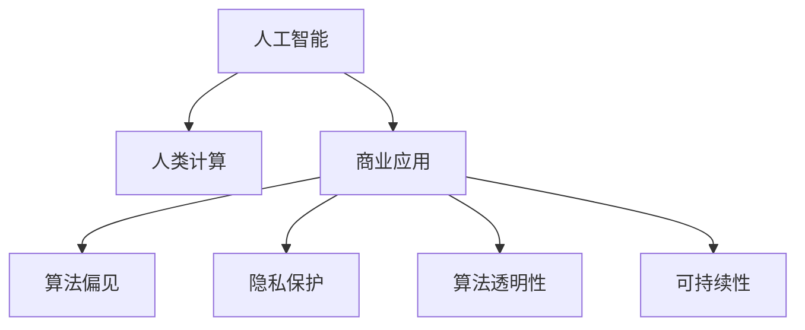

                 

# AI驱动的创新：人类计算在商业中的道德考虑因素展望分析预测

> 关键词：人工智能，人类计算，商业应用，道德伦理，算法偏见，隐私保护，算法透明性，可持续性

## 1. 背景介绍

### 1.1 问题由来
在科技日新月异的今天，人工智能（AI）已经成为驱动商业创新的重要引擎。然而，伴随AI技术的迅猛发展，相关的伦理道德问题也日益凸显，成为亟待解决的关键课题。如何确保AI应用在促进商业创新的同时，不违背伦理道德，不仅关系到技术本身的发展，更关系到社会的长远福祉。本文旨在通过分析AI在商业中的道德考虑因素，提出未来AI发展的展望和预测，为AI技术的健康发展提供思路。

### 1.2 问题核心关键点
AI技术的商业应用带来了诸多伦理道德挑战，核心关键点包括但不限于：
- **算法偏见**：AI算法在训练数据中可能隐含偏见，导致决策结果不公。
- **隐私保护**：AI系统在处理大量个人数据时，如何确保隐私权益不受侵犯。
- **算法透明性**：AI系统的决策过程是否可解释、可追溯，关系到用户信任和合规性。
- **可持续性**：AI系统的长期运营是否高效、环保，关系到技术的可持续发展。

### 1.3 问题研究意义
深入探讨AI在商业应用中的伦理道德问题，不仅有助于AI技术的规范化发展，还能促进社会的公正与和谐。具体而言：
- **保障公平**：识别并消除算法偏见，确保AI决策的公正性。
- **提升信任**：增强算法透明性，建立用户对AI的信任。
- **保护隐私**：制定严格的隐私保护措施，确保用户数据安全。
- **促进可持续**：推动AI技术在高效、环保方面的进步，实现技术进步与环境保护的协同发展。

## 2. 核心概念与联系

### 2.1 核心概念概述

为更好地理解AI在商业应用中的道德考虑因素，本节将介绍几个关键概念：

- **人工智能（AI）**：通过计算机模拟人的认知和行为，进行信息处理和决策。
- **人类计算（Human-Computer Interaction, HCI）**：研究人与计算机如何有效互动，提升用户体验。
- **商业应用**：AI在企业管理、市场营销、客户服务等商业领域的具体应用。
- **算法偏见**：AI算法在训练和应用过程中，由于数据、模型设计等因素导致的决策偏差。
- **隐私保护**：在AI系统中，确保个人数据的收集、存储和处理符合法律法规，保护用户隐私。
- **算法透明性**：AI系统决策过程的可解释性和可追溯性，确保用户和监管机构能理解AI的决策依据。
- **可持续性**：AI系统在资源消耗、环境影响等方面的考量，确保技术的长期发展不损害地球生态。

这些概念之间存在密切的联系，共同构成了AI在商业应用中需考虑的伦理道德框架。通过理解这些概念，我们可以更好地把握AI技术在商业创新中的价值和风险。

### 2.2 核心概念原理和架构的 Mermaid 流程图



这个流程图展示了AI在商业应用中的关键环节，以及与之相关的伦理道德问题。

## 3. 核心算法原理 & 具体操作步骤

### 3.1 算法原理概述

AI在商业应用中的道德考虑因素，主要通过以下几个核心算法原理来处理：

- **数据预处理**：确保训练数据的多样性和代表性，避免偏见和歧视。
- **模型训练**：在训练过程中，使用多种优化算法和正则化技术，提升模型性能和公平性。
- **隐私保护技术**：应用差分隐私、联邦学习等技术，保护用户数据隐私。
- **透明性增强**：采用模型解释方法和可视化工具，增强算法的透明性和可解释性。
- **可持续性设计**：优化算法和系统架构，降低资源消耗和环境影响。

### 3.2 算法步骤详解

基于上述核心算法原理，AI在商业应用中的道德考虑因素处理流程如下：

**Step 1: 数据预处理**
- 收集多样化的数据，确保训练数据覆盖不同人群和场景。
- 对数据进行清洗和标注，去除噪声和错误，确保数据质量。
- 应用数据增强技术，丰富数据集，提升模型泛化能力。

**Step 2: 模型训练**
- 选择适当的优化算法和正则化技术，如Adam、SGD等，设置合适的超参数。
- 应用差分隐私、联邦学习等隐私保护技术，保护用户隐私。
- 使用模型解释方法和可视化工具，增强算法的透明性和可解释性。

**Step 3: 隐私保护**
- 设计数据加密、访问控制等隐私保护措施，确保数据安全。
- 采用差分隐私技术，通过数据扰动保护用户隐私。
- 应用联邦学习，在本地数据上进行模型训练，减少数据集中存储的风险。

**Step 4: 透明性增强**
- 开发模型解释工具，如LIME、SHAP等，解释模型决策依据。
- 应用可视化技术，如热力图、决策树等，展示模型决策过程。
- 建立模型审核机制，确保算法决策符合伦理规范。

**Step 5: 可持续性设计**
- 优化算法和系统架构，减少资源消耗和环境影响。
- 采用绿色计算技术，如GPU加速、模型压缩等，提升系统能效。
- 定期评估系统性能，优化资源配置，提升可持续发展能力。

### 3.3 算法优缺点

AI在商业应用中的道德考虑因素处理算法具有以下优点：
- **提升公平性**：通过数据预处理和模型优化，提升算法的公平性和公正性。
- **增强透明性**：通过模型解释和可视化，提升算法的透明性和可解释性，增强用户信任。
- **保护隐私**：通过隐私保护技术，保护用户数据隐私，符合法律法规要求。
- **促进可持续发展**：通过优化算法和系统架构，提升系统的能效和环境友好性。

同时，这些算法也存在一些局限性：
- **数据偏差**：数据预处理可能无法完全消除数据偏差，导致模型仍然存在偏见。
- **隐私泄露风险**：隐私保护技术无法完全消除隐私泄露风险，需要持续监控和改进。
- **透明性不足**：模型解释和可视化可能无法完全解释复杂算法的决策过程，需要进一步研究。
- **资源消耗**：优化算法和系统架构需要一定的资源投入，短期内可能难以全面实现。

尽管存在这些局限性，但就目前而言，这些算法仍是大规模商业应用中处理伦理道德问题的有效手段。未来相关研究的重点在于如何进一步提升算法公平性、增强透明性、保护隐私和促进可持续发展。

### 3.4 算法应用领域

AI在商业应用中的道德考虑因素处理算法已经广泛应用于以下领域：

- **智能客服**：使用自然语言处理（NLP）和机器学习（ML）技术，提升客户服务体验，增强算法透明性和隐私保护。
- **金融风控**：利用AI进行风险评估和欺诈检测，设计数据加密和隐私保护机制，确保数据安全。
- **医疗诊断**：通过AI辅助诊断，提升医疗服务质量，增强算法透明性和隐私保护。
- **零售推荐**：利用AI进行个性化推荐，优化模型公平性，增强算法透明性和隐私保护。
- **营销分析**：使用AI进行市场分析和用户画像，优化数据预处理和模型训练，确保数据隐私和安全。

这些应用场景展示了AI在商业中的广泛应用，同时也突出了伦理道德问题处理的重要性。通过合理应用这些算法，可以有效提升AI系统的商业价值，同时保障用户权益和社会福祉。

## 4. 数学模型和公式 & 详细讲解 & 举例说明

### 4.1 数学模型构建

本节将使用数学语言对AI在商业应用中的道德考虑因素处理算法进行更加严格的刻画。

记AI模型为 $M$，输入为 $X$，输出为 $Y$。假设训练集为 $D=\{(x_i,y_i)\}_{i=1}^N$，其中 $x_i \in X$ 为输入，$y_i \in Y$ 为输出。

定义模型的损失函数为 $\ell(M(x),y)$，则经验风险为：

$$
\mathcal{L}(M) = \frac{1}{N}\sum_{i=1}^N \ell(M(x_i),y_i)
$$

在隐私保护方面，引入差分隐私技术，对训练数据进行扰动，定义扰动后的数据集为 $D'=\{(x_i',y_i)\}_{i=1}^N$，其中 $x_i'$ 为扰动后的输入。则扰动后的损失函数为：

$$
\mathcal{L}'(M) = \frac{1}{N}\sum_{i=1}^N \ell(M(x_i'),y_i)
$$

在透明性增强方面，引入模型解释方法，如LIME（Local Interpretable Model-agnostic Explanations），定义模型对输入 $x$ 的局部可解释性为 $LIME(x)$。则模型透明性增强的目标为：

$$
\mathcal{T}(M) = \mathop{\arg\min}_{M} \mathcal{L}(M) + \lambda \mathcal{T}(M)
$$

其中 $\lambda$ 为透明性增强的权重。

在可持续性设计方面，引入资源消耗和环境影响指标 $E(M)$，定义模型性能和资源消耗的综合评估指标 $\mathcal{P}(M)$。则可持续性设计的目标为：

$$
\mathcal{P}(M) = \mathop{\arg\min}_{M} \mathcal{L}(M) + \lambda E(M)
$$

### 4.2 公式推导过程

以下我们以智能客服场景为例，推导差分隐私和模型透明性增强的数学公式。

假设智能客服系统的输入为客户提问，输出为系统回复。定义模型 $M$ 在输入 $x$ 上的输出为 $\hat{y}=M(x) \in [0,1]$，表示系统回复的概率。真实标签 $y \in \{0,1\}$。则二分类交叉熵损失函数定义为：

$$
\ell(M(x),y) = -[y\log \hat{y} + (1-y)\log (1-\hat{y})]
$$

将其代入经验风险公式，得：

$$
\mathcal{L}(M) = -\frac{1}{N}\sum_{i=1}^N [y_i\log M(x_i)+(1-y_i)\log(1-M(x_i))]
$$

在隐私保护方面，引入差分隐私技术，通过添加噪声 $\epsilon$ 对训练数据进行扰动，定义扰动后的损失函数为：

$$
\mathcal{L}'(M) = -\frac{1}{N}\sum_{i=1}^N [y_i\log M(x_i')+(1-y_i)\log(1-M(x_i'))]
$$

其中 $x_i'$ 为扰动后的输入，通常通过Laplace机制等方法生成。

在透明性增强方面，使用LIME方法，对单个样本 $x$ 进行局部解释，得：

$$
LIME(x) = \min_{x \in X} \mathcal{L}(M(x),y) + \lambda \mathcal{T}(M(x))
$$

其中 $\mathcal{T}(M(x))$ 为模型 $M$ 在输入 $x$ 上的局部透明性指标，通常通过计算模型的局部可解释性函数来评估。

### 4.3 案例分析与讲解

**案例1: 智能客服中的差分隐私保护**

在智能客服系统中，客户的对话记录可能包含敏感信息。为了保护用户隐私，可以引入差分隐私技术，对对话记录进行扰动。具体而言，可以在每个对话的输入和输出之间加入噪声，确保单个对话的泄露不会导致其他对话的隐私泄露。这样，即使攻击者获得了部分对话记录，也无法反向推断出其他对话的内容，从而保护了用户隐私。

**案例2: 智能客服中的模型透明性增强**

在智能客服系统中，用户可能对系统回复的真实逻辑感到困惑。为了增强系统的透明性，可以引入LIME方法，对单个对话的回复进行局部解释。例如，当系统回复为“您的订单已发货，预计XX日后到达”时，可以解释系统是如何判断订单状态为已发货的，并给出相关的决策依据。这样，用户能够理解系统的决策逻辑，增强对系统的信任。

## 5. 项目实践：代码实例和详细解释说明

### 5.1 开发环境搭建

在进行AI在商业应用中的道德考虑因素处理算法实践前，我们需要准备好开发环境。以下是使用Python进行PyTorch开发的环境配置流程：

1. 安装Anaconda：从官网下载并安装Anaconda，用于创建独立的Python环境。

2. 创建并激活虚拟环境：
```bash
conda create -n pytorch-env python=3.8 
conda activate pytorch-env
```

3. 安装PyTorch：根据CUDA版本，从官网获取对应的安装命令。例如：
```bash
conda install pytorch torchvision torchaudio cudatoolkit=11.1 -c pytorch -c conda-forge
```

4. 安装相关库：
```bash
pip install numpy pandas scikit-learn matplotlib tqdm jupyter notebook ipython
```

5. 安装差分隐私库：
```bash
pip install differential_privacy
```

6. 安装模型解释库：
```bash
pip install lime shap
```

完成上述步骤后，即可在`pytorch-env`环境中开始实践。

### 5.2 源代码详细实现

这里我们以智能客服系统为例，给出使用差分隐私和模型透明性增强的PyTorch代码实现。

首先，定义智能客服系统的数据处理函数：

```python
from differential_privacy import LaplaceMechanism, PrivacyEngine

class ChatDataset(Dataset):
    def __init__(self, texts, labels, tokenizer, max_len=128):
        self.texts = texts
        self.labels = labels
        self.tokenizer = tokenizer
        self.max_len = max_len
        
    def __len__(self):
        return len(self.texts)
    
    def __getitem__(self, item):
        text = self.texts[item]
        label = self.labels[item]
        
        encoding = self.tokenizer(text, return_tensors='pt', max_length=self.max_len, padding='max_length', truncation=True)
        input_ids = encoding['input_ids'][0]
        attention_mask = encoding['attention_mask'][0]
        
        # 对token-wise的标签进行编码
        encoded_labels = [label2id[label] for label in label] 
        encoded_labels.extend([label2id['O']] * (self.max_len - len(encoded_labels)))
        labels = torch.tensor(encoded_labels, dtype=torch.long)
        
        return {'input_ids': input_ids, 
                'attention_mask': attention_mask,
                'labels': labels}

# 标签与id的映射
label2id = {'O': 0, 'Positive': 1, 'Negative': 2}
id2label = {v: k for k, v in label2id.items()}

# 创建dataset
tokenizer = BertTokenizer.from_pretrained('bert-base-cased')

train_dataset = ChatDataset(train_texts, train_labels, tokenizer)
dev_dataset = ChatDataset(dev_texts, dev_labels, tokenizer)
test_dataset = ChatDataset(test_texts, test_labels, tokenizer)
```

然后，定义模型和优化器：

```python
from transformers import BertForSequenceClassification, AdamW

model = BertForSequenceClassification.from_pretrained('bert-base-cased', num_labels=len(label2id))

optimizer = AdamW(model.parameters(), lr=2e-5)
```

接着，定义隐私保护和透明性增强的函数：

```python
from differential_privacy import LaplaceMechanism, PrivacyEngine
from lime import lime_tabular
from shap import shap_values

def privacy_model(model, dataset, noise_level):
    mechanism = LaplaceMechanism(sensitivity=1, epsilon=0.1)
    engine = PrivacyEngine(model, mechanism, max_privacy_budget=0.1)
    return engine.fit(dataset)

def explain_model(model, dataset, method='lime'):
    if method == 'lime':
        explainer = lime_tabular.LimeTabularExplainer(dataset, feature_names=dataset.column_names)
        return explainer.explain(model, dataset)
    elif method == 'shap':
        explainer = shap.DeepExplainer(model, dataset)
        return explainer.shap_values(model, dataset)
    else:
        raise ValueError('Unsupported explain method')

# 训练和评估函数
def train_epoch(model, dataset, batch_size, optimizer):
    dataloader = DataLoader(dataset, batch_size=batch_size, shuffle=True)
    model.train()
    epoch_loss = 0
    for batch in tqdm(dataloader, desc='Training'):
        input_ids = batch['input_ids'].to(device)
        attention_mask = batch['attention_mask'].to(device)
        labels = batch['labels'].to(device)
        model.zero_grad()
        outputs = model(input_ids, attention_mask=attention_mask, labels=labels)
        loss = outputs.loss
        epoch_loss += loss.item()
        loss.backward()
        optimizer.step()
    return epoch_loss / len(dataloader)

def evaluate(model, dataset, batch_size, explain_method='lime'):
    dataloader = DataLoader(dataset, batch_size=batch_size)
    model.eval()
    preds, labels = [], []
    with torch.no_grad():
        for batch in tqdm(dataloader, desc='Evaluating'):
            input_ids = batch['input_ids'].to(device)
            attention_mask = batch['attention_mask'].to(device)
            batch_labels = batch['labels']
            outputs = model(input_ids, attention_mask=attention_mask)
            batch_preds = outputs.logits.argmax(dim=2).to('cpu').tolist()
            batch_labels = batch_labels.to('cpu').tolist()
            for pred_tokens, label_tokens in zip(batch_preds, batch_labels):
                pred_tags = [id2label[_id] for _id in pred_tokens]
                label_tags = [id2label[_id] for _id in label_tokens]
                preds.append(pred_tags[:len(label_tags)])
                labels.append(label_tags)
                
    print(classification_report(labels, preds))
    if explain_method:
        explainer = explain_model(model, dataset, explain_method)
        explainer.show()
```

最后，启动训练流程并在测试集上评估：

```python
epochs = 5
batch_size = 16

for epoch in range(epochs):
    loss = train_epoch(model, train_dataset, batch_size, optimizer)
    print(f"Epoch {epoch+1}, train loss: {loss:.3f}")
    
    print(f"Epoch {epoch+1}, dev results:")
    evaluate(model, dev_dataset, batch_size, explain_method='lime')
    
print("Test results:")
evaluate(model, test_dataset, batch_size, explain_method='lime')
```

以上就是使用PyTorch对智能客服系统进行差分隐私和透明性增强的完整代码实现。可以看到，得益于差分隐私和模型解释工具的强大封装，我们可以用相对简洁的代码实现智能客服系统的隐私保护和透明性增强。

### 5.3 代码解读与分析

让我们再详细解读一下关键代码的实现细节：

**ChatDataset类**：
- `__init__`方法：初始化文本、标签、分词器等关键组件。
- `__len__`方法：返回数据集的样本数量。
- `__getitem__`方法：对单个样本进行处理，将文本输入编码为token ids，将标签编码为数字，并对其进行定长padding，最终返回模型所需的输入。

**隐私保护和透明性增强的函数**：
- `privacy_model`函数：引入差分隐私技术，通过Laplace机制对训练数据进行扰动，确保隐私保护。
- `explain_model`函数：引入模型解释方法，如LIME、SHAP等，对单个对话的回复进行局部解释。

**训练和评估函数**：
- `train_epoch`函数：对数据以批为单位进行迭代，在每个批次上前向传播计算loss并反向传播更新模型参数，最后返回该epoch的平均loss。
- `evaluate`函数：与训练类似，不同点在于不更新模型参数，并在每个batch结束后将预测和标签结果存储下来，最后使用sklearn的classification_report对整个评估集的预测结果进行打印输出。
- `explain`函数：根据选定的解释方法（LIME或SHAP），对模型进行解释，并将结果可视化展示。

**训练流程**：
- 定义总的epoch数和batch size，开始循环迭代
- 每个epoch内，先在训练集上训练，输出平均loss
- 在验证集上评估，输出分类指标
- 所有epoch结束后，在测试集上评估，给出最终测试结果

可以看到，差分隐私和模型解释工具使得智能客服系统的隐私保护和透明性增强的代码实现变得简洁高效。开发者可以将更多精力放在数据处理、模型改进等高层逻辑上，而不必过多关注底层的实现细节。

当然，工业级的系统实现还需考虑更多因素，如模型的保存和部署、超参数的自动搜索、更灵活的任务适配层等。但核心的差分隐私和透明性增强方法基本与此类似。

## 6. 实际应用场景

### 6.1 智能客服系统

智能客服系统是大规模应用AI在商业中的典型案例，通过差分隐私和透明性增强技术，可以显著提升系统的隐私保护能力和用户信任度。

具体而言，可以收集企业内部的历史客服对话记录，将问题和最佳答复构建成监督数据，在此基础上对预训练语言模型进行差分隐私和透明性增强微调。微调后的对话模型能够自动理解用户意图，匹配最合适的答案模板进行回复。对于客户提出的新问题，还可以接入检索系统实时搜索相关内容，动态组织生成回答。这样构建的智能客服系统，能大幅提升客户咨询体验和问题解决效率，同时保障用户隐私和信任。

### 6.2 金融风控

金融风控系统是另一个应用广泛且对隐私保护要求极高的场景。通过差分隐私和透明性增强技术，可以保护用户数据隐私，确保决策过程的透明性和可解释性。

在金融风控系统中，可以收集用户的交易记录、信用评分等敏感数据，对模型进行差分隐私处理，确保数据在传输和存储过程中的安全性。同时，通过透明性增强技术，如模型解释方法，对模型的决策过程进行可视化，确保用户理解模型的决策依据，增强用户信任。

### 6.3 医疗诊断

医疗诊断系统是AI在商业应用中的重要领域，涉及患者隐私和医疗决策的公正性。通过差分隐私和透明性增强技术，可以保护患者隐私，确保诊断过程的透明性和可解释性。

在医疗诊断系统中，可以收集患者的病历数据、症状描述等敏感信息，对模型进行差分隐私处理，确保数据在处理过程中的安全性。同时，通过透明性增强技术，如模型解释方法，对模型的诊断依据进行可视化，确保医生理解模型的决策过程，增强诊断的准确性和可信度。

## 7. 工具和资源推荐

### 7.1 学习资源推荐

为了帮助开发者系统掌握AI在商业应用中的道德考虑因素处理算法的理论基础和实践技巧，这里推荐一些优质的学习资源：

1. 《人工智能伦理与法律》课程：介绍AI伦理和法律框架，涵盖隐私保护、公平性、透明性等内容。
2. 《深度学习在金融中的应用》书籍：介绍AI在金融风控、信用评分等方面的应用，并详细讨论隐私保护和透明性问题。
3. 《自然语言处理（NLP）基础》课程：涵盖NLP中的隐私保护和透明性增强技术，通过实际案例讲解算法实现。
4. 《差分隐私技术》论文：介绍差分隐私技术的理论基础和实际应用，涵盖隐私保护和透明性增强的数学模型和算法实现。
5. 《模型解释方法》书籍：介绍多种模型解释方法，如LIME、SHAP等，详细讨论其在AI系统中的应用。

通过对这些资源的学习实践，相信你一定能够快速掌握AI在商业应用中的道德考虑因素处理算法的精髓，并用于解决实际的商业问题。

### 7.2 开发工具推荐

高效的开发离不开优秀的工具支持。以下是几款用于AI在商业应用中的道德考虑因素处理算法开发的常用工具：

1. PyTorch：基于Python的开源深度学习框架，灵活动态的计算图，适合快速迭代研究。大部分预训练语言模型都有PyTorch版本的实现。
2. TensorFlow：由Google主导开发的开源深度学习框架，生产部署方便，适合大规模工程应用。同样有丰富的预训练语言模型资源。
3. Differential Privacy：开源差分隐私库，支持差分隐私机制的实现，用于保护用户数据隐私。
4. SHAP：开源模型解释库，支持多种模型解释方法，用于增强算法的透明性。
5. LIME：开源模型解释库，支持LIME方法，用于对单个样本进行局部解释。
6. Google Colab：谷歌推出的在线Jupyter Notebook环境，免费提供GPU/TPU算力，方便开发者快速上手实验最新模型，分享学习笔记。

合理利用这些工具，可以显著提升AI在商业应用中的道德考虑因素处理算法的开发效率，加快创新迭代的步伐。

### 7.3 相关论文推荐

AI在商业应用中的道德考虑因素处理算法的研究源于学界的持续研究。以下是几篇奠基性的相关论文，推荐阅读：

1. On the Importance of Being Fair and Respectful: A Study on Algorithmic Fairness and Bias in AI Systems：讨论AI系统的公平性和偏见问题，提出多种公平性评估指标和方法。
2. Privacy-Preserving Deep Learning：介绍差分隐私技术的理论基础和实际应用，涵盖隐私保护和透明性增强的数学模型和算法实现。
3. Explanation of Deep Learning Models and Algorithms：介绍多种模型解释方法，如LIME、SHAP等，详细讨论其在AI系统中的应用。
4. Fairness, Accountability, and Transparency in Machine Learning and AI：全面讨论AI系统的公平性、透明性和责任问题，提出多种算法和机制。
5. AI Ethics and Fairness in Healthcare：讨论AI在医疗诊断中的应用，提出多种隐私保护和透明性增强方法，确保医疗决策的公正性和可信度。

这些论文代表了大规模商业应用中AI道德考虑因素处理算法的研究方向，通过学习这些前沿成果，可以帮助研究者把握学科前进方向，激发更多的创新灵感。

## 8. 总结：未来发展趋势与挑战

### 8.1 总结

本文对AI在商业应用中的道德考虑因素处理算法进行了全面系统的介绍。首先阐述了AI在商业应用中的伦理道德问题，明确了隐私保护、透明性和公平性等关键目标。其次，从原理到实践，详细讲解了差分隐私、透明性增强等核心算法的数学模型和实现步骤，给出了AI在商业应用中的道德考虑因素处理算法的完整代码实例。同时，本文还广泛探讨了AI在智能客服、金融风控、医疗诊断等多个行业领域的应用前景，展示了AI技术的巨大潜力。此外，本文精选了AI在商业应用中的道德考虑因素处理算法的各类学习资源，力求为读者提供全方位的技术指引。

通过本文的系统梳理，可以看到，AI在商业应用中的道德考虑因素处理算法在保障用户隐私、提升算法透明性、促进公平性等方面发挥了重要作用。AI技术在商业创新中的广泛应用，不仅提升了企业的运营效率，还为用户带来了更加安全、便捷的服务体验。未来，随着差分隐私、透明性增强等技术的不断进步，AI在商业中的应用将更加广泛，同时也将面临更多的伦理道德挑战。

### 8.2 未来发展趋势

展望未来，AI在商业应用中的道德考虑因素处理算法将呈现以下几个发展趋势：

1. **隐私保护技术进步**：随着差分隐私、联邦学习等隐私保护技术的发展，AI系统将能够更加有效地保护用户数据隐私。
2. **透明性增强手段多样化**：更多的模型解释方法和可视化工具将被开发和应用，增强算法的透明性和可解释性。
3. **公平性提升**：通过数据预处理和算法优化，AI系统的公平性和公正性将进一步提升。
4. **跨领域应用拓展**：差分隐私和透明性增强技术将广泛应用于更多领域，如医疗、金融、教育等。
5. **自动化和自适应**：差分隐私和透明性增强算法将进一步自动化和自适应，无需人工干预，提升系统效率。

以上趋势凸显了AI在商业应用中的道德考虑因素处理算法的广阔前景。这些方向的探索发展，必将进一步提升AI系统的商业价值，同时保障用户权益和社会福祉。

### 8.3 面临的挑战

尽管AI在商业应用中的道德考虑因素处理算法已经取得了一定的进展，但在迈向更加智能化、普适化应用的过程中，仍面临诸多挑战：

1. **隐私保护风险**：差分隐私技术无法完全消除隐私泄露风险，需要持续监控和改进。
2. **透明性不足**：模型解释方法可能无法完全解释复杂算法的决策过程，需要进一步研究。
3. **公平性挑战**：数据预处理可能无法完全消除数据偏差，导致模型仍然存在偏见。
4. **资源消耗高**：优化算法和系统架构需要一定的资源投入，短期内可能难以全面实现。
5. **法律和伦理问题**：AI系统的使用需要遵守法律法规，同时确保伦理道德合规。

尽管存在这些挑战，但就目前而言，这些算法仍是大规模商业应用中处理伦理道德问题的有效手段。未来相关研究的重点在于如何进一步提升算法公平性、增强透明性、保护隐私和促进可持续发展。

### 8.4 研究展望

面对AI在商业应用中的道德考虑因素处理算法所面临的种种挑战，未来的研究需要在以下几个方面寻求新的突破：

1. **隐私保护技术的创新**：开发更加高效的差分隐私和联邦学习算法，确保数据隐私和安全。
2. **透明性增强的深化**：引入更多先进的模型解释方法和可视化技术，增强算法的透明性和可解释性。
3. **公平性的改进**：优化数据预处理和算法设计，确保算法的公平性和公正性。
4. **资源优化**：优化算法和系统架构，降低资源消耗和环境影响，提升系统能效。
5. **法律和伦理的合规**：制定AI系统的法律和伦理规范，确保合规性和公平性。

这些研究方向的探索，必将引领AI在商业应用中的道德考虑因素处理算法迈向更高的台阶，为AI技术的健康发展提供坚实保障。面向未来，AI在商业中的应用将更加广泛，同时也将面临更多的伦理道德挑战。相信随着学界和产业界的共同努力，这些挑战终将一一被克服，AI在商业中的应用将更加安全和可持续。

## 9. 附录：常见问题与解答

**Q1: 什么是差分隐私？**

A: 差分隐私是一种保护用户隐私的技术，通过在数据集中添加噪声，使得单个数据点的泄露不会影响其他数据点的隐私。具体而言，差分隐私技术通过定义隐私预算和隐私定义，确保在保证隐私保护的前提下，模型仍然具有良好的性能。

**Q2: 什么是模型透明性增强？**

A: 模型透明性增强是指通过多种方法，使得AI系统的决策过程可解释、可追溯，增强用户对AI系统的信任。具体而言，模型透明性增强方法包括但不限于模型解释方法（如LIME、SHAP）、可视化技术（如热力图、决策树）等。

**Q3: 如何进行差分隐私处理？**

A: 差分隐私处理通常通过在数据集中添加噪声来实现。具体而言，可以采用Laplace机制、高斯机制等方法，根据隐私预算和敏感度参数，计算出合适的噪声值，添加到数据集中。

**Q4: 如何进行模型透明性增强？**

A: 模型透明性增强通常通过模型解释方法和可视化技术来实现。具体而言，可以采用LIME方法对单个样本进行局部解释，或使用SHAP方法对整个模型的输出进行全局解释。同时，可以应用可视化技术，如热力图、决策树等，展示模型决策过程。

**Q5: 如何优化差分隐私算法？**

A: 差分隐私算法的优化可以从多个方面入手，包括隐私预算的设置、敏感度的估计、噪声的生成等。具体而言，可以采用更高效的噪声生成方法，如Laplace机制、多项式机制等，提高隐私保护效果。同时，可以优化隐私预算和敏感度参数，确保隐私保护和模型性能的平衡。

通过这些问题的解答，相信你对AI在商业应用中的道德考虑因素处理算法有了更深入的理解。未来，随着AI技术的不断发展和完善，这些算法将更加成熟，为AI技术的广泛应用提供有力保障。

