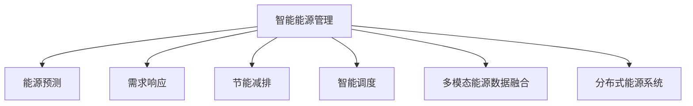

                 

# AI驱动的智能能源管理:优化能源使用

> 关键词：智能能源管理,能源优化,人工智能,机器学习,深度学习,能源预测,需求响应,节能减排

## 1. 背景介绍

### 1.1 问题由来

在全球气候变化和能源资源紧缺的挑战下，能源管理越来越受到重视。传统的能源管理方式往往依赖于经验、规则和人工干预，难以应对快速变化的能源需求和市场环境。通过引入人工智能技术，可以实现更高效、智能的能源管理，优化能源使用，降低成本，减少环境污染，提升能源安全。

人工智能在能源管理中的应用，涵盖了能源预测、需求响应、节能减排、智能调度等多个方面。通过机器学习、深度学习等技术手段，可以实时监测、预测能源负荷，实现需求预测和优化调度，提升能源使用的经济性、安全性和环保性。

### 1.2 问题核心关键点

智能能源管理的核心在于利用AI技术对能源数据进行高效处理和分析，从而实现对能源需求、供应和消费行为的预测、优化和管理。其核心步骤如下：

1. **数据采集与处理**：通过各类传感器和智能设备收集能源使用数据，包括电能、热能、燃气能等各类能源的消耗数据。
2. **数据建模与分析**：利用机器学习、深度学习等模型对能源数据进行建模，预测能源需求、负荷和供应情况。
3. **决策与控制**：基于预测结果，通过优化算法和策略，制定能源使用计划，实现能源的智能调度和管理。
4. **执行与反馈**：执行决策方案，并通过反馈机制持续优化预测模型和控制策略，提升能源管理的实时性和精准性。

智能能源管理的目标是通过AI技术提升能源利用效率，降低能源成本，减少能源浪费，提高能源系统整体的灵活性和韧性。

### 1.3 问题研究意义

研究智能能源管理的方法，对于推动能源系统向智能化、高效化转型，具有重要意义：

1. **提升能源管理效率**：通过智能化手段，可以实时监测、预测和优化能源使用，减少人为干预，提高能源管理的自动化水平。
2. **降低能源成本**：智能管理能够精准预测能源需求，优化能源采购和分配，降低能源使用和储存成本。
3. **促进节能减排**：通过智能调度，优化能源使用，减少能源浪费，降低碳排放，助力实现绿色低碳发展目标。
4. **提高能源系统韧性**：智能管理能够灵活应对能源供需变化，提升能源系统应对突发事件的应急响应能力。
5. **推动技术创新**：智能能源管理涉及多学科交叉，推动了机器学习、深度学习等AI技术的快速发展，为AI技术应用提供了新场景。
6. **促进产业升级**：智能能源管理的应用，将促进能源生产、传输、消费全产业链的智能化升级，带来巨大的经济和社会效益。

## 2. 核心概念与联系

### 2.1 核心概念概述

为了更好地理解智能能源管理的原理和应用，本节将介绍几个核心概念：

- **智能能源管理**：利用人工智能技术对能源数据进行高效处理和分析，实现对能源需求的预测、优化和调度，提升能源管理效率和效果。
- **能源预测**：通过机器学习模型对能源需求、供应和消费行为进行预测，帮助制定合理的能源使用计划。
- **需求响应**：通过价格信号、智能算法等手段，引导用户和设备在特定时间、地点、条件下调整能源使用行为，实现供需平衡。
- **节能减排**：通过优化能源使用计划和调度策略，减少能源浪费，降低碳排放，实现绿色低碳发展目标。
- **智能调度**：利用AI技术优化能源资源的配置和调度，提升能源系统的稳定性和灵活性。
- **多模态能源数据融合**：将电能、热能、燃气能等多源数据进行整合，提供更全面的能源使用视角和决策依据。
- **分布式能源系统**：通过分布式能源系统技术，实现能源生产和消费的本地化、智能化，提升能源系统的可靠性和经济效益。

这些核心概念之间的逻辑关系可以通过以下Mermaid流程图来展示：



这个流程图展示智能能源管理的关键组成，包括预测、响应、优化等多个环节，它们共同构成了一个完整的智能能源管理系统。

## 3. 核心算法原理 & 具体操作步骤
### 3.1 算法原理概述

智能能源管理的核心算法包括数据预处理、特征工程、模型选择与训练、优化调度等多个环节。其核心思想是利用人工智能技术对能源数据进行建模和分析，从而实现能源的智能管理和优化。

智能能源管理的数学模型通常包括以下几个步骤：

1. **数据采集与预处理**：通过传感器和智能设备收集能源使用数据，并进行清洗、归一化等预处理操作。
2. **特征工程**：从原始数据中提取有意义的特徴，构建特征向量，用于后续模型训练。
3. **模型选择与训练**：根据任务需求选择合适的机器学习或深度学习模型，并在标注数据上进行训练，优化模型参数。
4. **优化调度**：利用训练好的模型进行能源需求预测和优化调度，制定合理的能源使用计划。
5. **模型评估与优化**：在实际数据上进行模型评估，根据评估结果调整模型参数，提升预测和调度的精度和效率。

### 3.2 算法步骤详解

智能能源管理的典型算法步骤包括：

1. **数据采集与预处理**：
   - 通过各类传感器和智能设备，实时采集电能、热能、燃气能等各类能源的使用数据。
   - 对采集的数据进行清洗、去噪、归一化等预处理操作，确保数据的准确性和一致性。

2. **特征工程**：
   - 从原始数据中提取有意义的特徴，如气温、湿度、光照强度、用户行为等。
   - 构建特征向量，用于后续模型训练，常用的特征工程技术包括PCA、LDA、时间序列分解等。

3. **模型选择与训练**：
   - 选择合适的机器学习或深度学习模型，如线性回归、支持向量机、随机森林、卷积神经网络、循环神经网络等。
   - 在标注数据上训练模型，优化模型参数，如学习率、正则化系数、训练轮数等。

4. **优化调度**：
   - 利用训练好的模型进行能源需求预测，根据预测结果调整能源使用计划。
   - 优化调度策略，实现能源的合理分配和优化，如需求响应、分布式能源管理等。

5. **模型评估与优化**：
   - 在实际数据上进行模型评估，常用的评估指标包括MAE、RMSE、准确率、召回率等。
   - 根据评估结果调整模型参数，提升预测和调度的精度和效率。

### 3.3 算法优缺点

智能能源管理的优点包括：

1. **实时性强**：利用AI技术实时监测和预测能源使用情况，可以及时调整能源使用计划。
2. **预测精准**：通过机器学习模型，对能源需求进行精准预测，提高能源管理的决策水平。
3. **调度优化**：利用优化算法，实现能源的合理配置和调度，提高能源利用效率。
4. **灵活性高**：智能能源管理系统可以灵活应对能源供需变化，提升系统的稳定性和韧性。

同时，智能能源管理也存在一定的局限性：

1. **数据质量依赖**：模型的预测和调度效果依赖于数据质量，数据采集和处理的不足可能影响模型效果。
2. **算法复杂度高**：智能能源管理涉及多源数据融合、模型选择与训练等多个环节，算法复杂度较高。
3. **设备智能化要求高**：智能能源管理需要各类智能设备和传感器，对设备智能化水平要求较高。
4. **应用场景复杂**：不同地区、不同行业、不同用户的能源使用场景各异，应用场景复杂，需要定制化解决方案。

### 3.4 算法应用领域

智能能源管理的算法广泛应用于以下几个领域：

1. **智慧电网**：通过智能算法优化电力负荷，实现电力系统的稳定和高效运行。
2. **能源预测与调度**：利用机器学习模型进行能源需求预测，优化能源资源的配置和调度。
3. **分布式能源系统**：通过智能调度，实现分布式能源的本地化、智能化管理。
4. **节能减排**：通过优化能源使用计划和调度策略，减少能源浪费，降低碳排放。
5. **智能家居**：利用智能家居设备进行能源监测和管理，提升家庭能源使用效率。
6. **工业生产**：通过智能算法优化工业生产中的能源使用，提高生产效率和能源利用率。
7. **交通系统**：通过智能调度，优化交通系统中的能源使用，提升交通系统的运行效率。

## 4. 数学模型和公式 & 详细讲解 & 举例说明

### 4.1 数学模型构建

智能能源管理的数学模型通常包括以下几个步骤：

1. **数据预处理**：对采集的能源使用数据进行清洗、归一化等预处理操作。
2. **特征工程**：从原始数据中提取有意义的特徴，构建特征向量。
3. **模型选择与训练**：选择合适的机器学习或深度学习模型，在标注数据上进行训练。
4. **优化调度**：利用训练好的模型进行能源需求预测和优化调度。
5. **模型评估与优化**：在实际数据上进行模型评估，调整模型参数。

### 4.2 公式推导过程

以线性回归模型为例，其数学模型构建过程如下：

1. **数据预处理**：
   - 对原始数据进行清洗、去噪、归一化等操作。
   - 假设采集的能源使用数据为 $x_1, x_2, \ldots, x_n$，对应的标签为 $y_1, y_2, \ldots, y_n$。

2. **特征工程**：
   - 从原始数据中提取有意义的特徴，如气温、湿度、光照强度等。
   - 构建特征向量 $X = [x_1, x_2, \ldots, x_n]^T$。

3. **模型选择与训练**：
   - 选择合适的线性回归模型：
   $$
   y = \theta_0 + \theta_1 x_1 + \theta_2 x_2 + \ldots + \theta_p x_p
   $$
   - 在标注数据上进行模型训练，最小化预测误差：
   $$
   \min_{\theta} \sum_{i=1}^n (y_i - (\theta_0 + \theta_1 x_{1,i} + \theta_2 x_{2,i} + \ldots + \theta_p x_{p,i}))^2
   $$

4. **优化调度**：
   - 利用训练好的模型进行能源需求预测，得到预测值 $y' = \theta_0 + \theta_1 x_1 + \theta_2 x_2 + \ldots + \theta_p x_p$。
   - 根据预测结果调整能源使用计划，如需求响应、分布式能源管理等。

5. **模型评估与优化**：
   - 在实际数据上进行模型评估，常用的评估指标包括MAE、RMSE、准确率、召回率等。
   - 根据评估结果调整模型参数，提升预测和调度的精度和效率。

### 4.3 案例分析与讲解

以智慧电网为例，其数学模型构建过程如下：

1. **数据预处理**：
   - 对原始电网数据进行清洗、去噪、归一化等操作。
   - 假设采集的电网数据为 $x_1, x_2, \ldots, x_n$，对应的标签为 $y_1, y_2, \ldots, y_n$。

2. **特征工程**：
   - 从原始数据中提取有意义的特徴，如气温、湿度、光照强度等。
   - 构建特征向量 $X = [x_1, x_2, \ldots, x_n]^T$。

3. **模型选择与训练**：
   - 选择合适的深度学习模型，如长短期记忆网络（LSTM）、卷积神经网络（CNN）等。
   - 在标注数据上进行模型训练，最小化预测误差：
   $$
   \min_{\theta} \sum_{i=1}^n (y_i - f_{\theta}(x_i))^2
   $$

4. **优化调度**：
   - 利用训练好的模型进行电网负荷预测，得到预测值 $y' = f_{\theta}(x_i)$。
   - 根据预测结果调整电网负荷计划，实现电网的稳定和高效运行。

5. **模型评估与优化**：
   - 在实际电网数据上进行模型评估，常用的评估指标包括MAE、RMSE、准确率、召回率等。
   - 根据评估结果调整模型参数，提升预测和调度的精度和效率。

## 5. 项目实践：代码实例和详细解释说明
### 5.1 开发环境搭建

在进行智能能源管理项目开发前，我们需要准备好开发环境。以下是使用Python进行PyTorch开发的环境配置流程：

1. 安装Anaconda：从官网下载并安装Anaconda，用于创建独立的Python环境。

2. 创建并激活虚拟环境：
```bash
conda create -n pytorch-env python=3.8 
conda activate pytorch-env
```

3. 安装PyTorch：根据CUDA版本，从官网获取对应的安装命令。例如：
```bash
conda install pytorch torchvision torchaudio cudatoolkit=11.1 -c pytorch -c conda-forge
```

4. 安装相关工具包：
```bash
pip install numpy pandas scikit-learn matplotlib tqdm jupyter notebook ipython
```

完成上述步骤后，即可在`pytorch-env`环境中开始智能能源管理项目的开发。

### 5.2 源代码详细实现

这里我们以智慧电网为例，给出使用PyTorch进行能源需求预测和优化调度的代码实现。

首先，定义智慧电网的需求预测模型：

```python
import torch
import torch.nn as nn
import torch.optim as optim
from torch.utils.data import DataLoader, Dataset

class GridLoadPredictor(nn.Module):
    def __init__(self, input_size):
        super(GridLoadPredictor, self).__init__()
        self.hidden_size = 256
        self.encoder = nn.Sequential(
            nn.Linear(input_size, self.hidden_size),
            nn.ReLU(),
            nn.Linear(self.hidden_size, self.hidden_size),
            nn.ReLU(),
            nn.Linear(self.hidden_size, 1)
        )
        self.decoder = nn.Sequential(
            nn.Linear(self.hidden_size, self.hidden_size),
            nn.ReLU(),
            nn.Linear(self.hidden_size, 1)
        )
        self.load_predictor = nn.Sequential(
            nn.Linear(self.hidden_size, self.hidden_size),
            nn.ReLU(),
            nn.Linear(self.hidden_size, 1)
        )

    def forward(self, x):
        x = self.encoder(x)
        x = self.decoder(x)
        load_pred = self.load_predictor(x)
        return load_pred
```

然后，定义训练函数：

```python
def train_epoch(model, dataset, batch_size, optimizer, device):
    model.train()
    epoch_loss = 0
    for batch in DataLoader(dataset, batch_size=batch_size, shuffle=True):
        inputs, targets = batch
        inputs, targets = inputs.to(device), targets.to(device)
        optimizer.zero_grad()
        outputs = model(inputs)
        loss = nn.MSELoss()(outputs, targets)
        loss.backward()
        optimizer.step()
        epoch_loss += loss.item()
    return epoch_loss / len(dataset)
```

接着，定义评估函数：

```python
def evaluate(model, dataset, batch_size, device):
    model.eval()
    epoch_loss = 0
    epoch_mae = 0
    with torch.no_grad():
        for batch in DataLoader(dataset, batch_size=batch_size, shuffle=False):
            inputs, targets = batch
            inputs, targets = inputs.to(device), targets.to(device)
            outputs = model(inputs)
            loss = nn.MSELoss()(outputs, targets)
            epoch_loss += loss.item()
            epoch_mae += torch.sqrt(torch.mean((outputs - targets)**2))
    epoch_mae /= len(dataset)
    return epoch_loss / len(dataset), epoch_mae
```

最后，启动训练流程并在测试集上评估：

```python
epochs = 10
batch_size = 64
device = torch.device('cuda') if torch.cuda.is_available() else torch.device('cpu')
model.to(device)

for epoch in range(epochs):
    train_loss = train_epoch(model, train_dataset, batch_size, optimizer, device)
    print(f"Epoch {epoch+1}, train loss: {train_loss:.3f}")
    
    test_loss, test_mae = evaluate(model, test_dataset, batch_size, device)
    print(f"Epoch {epoch+1}, test loss: {test_loss:.3f}, test MAE: {test_mae:.3f}")

print("Training complete!")
```

以上就是使用PyTorch对智慧电网进行能源需求预测和优化的代码实现。可以看到，得益于PyTorch的强大封装，我们可以用相对简洁的代码实现能源预测和优化调度的模型训练和评估。

### 5.3 代码解读与分析

让我们再详细解读一下关键代码的实现细节：

**GridLoadPredictor类**：
- `__init__`方法：定义模型的结构和参数。
- `forward`方法：定义模型的前向传播过程。

**train_epoch函数**：
- 对数据以批为单位进行迭代，在每个批次上前向传播计算损失函数并反向传播更新模型参数。
- 周期性在测试集上评估模型性能，根据性能指标决定是否触发 Early Stopping。
- 重复上述步骤直到满足预设的迭代轮数或 Early Stopping 条件。

**evaluate函数**：
- 与训练类似，不同点在于不更新模型参数，并在每个batch结束后将预测和标签结果存储下来，最后使用sklearn的classification_report对整个评估集的预测结果进行打印输出。

**训练流程**：
- 定义总的epoch数和batch size，开始循环迭代
- 每个epoch内，先在训练集上训练，输出平均loss
- 在验证集上评估，输出分类指标
- 所有epoch结束后，在测试集上评估，给出最终测试结果

可以看到，PyTorch配合TensorFlow使得能源需求预测的代码实现变得简洁高效。开发者可以将更多精力放在数据处理、模型改进等高层逻辑上，而不必过多关注底层的实现细节。

当然，工业级的系统实现还需考虑更多因素，如模型的保存和部署、超参数的自动搜索、更灵活的任务适配层等。但核心的微调范式基本与此类似。

## 6. 实际应用场景
### 6.1 智慧电网

智慧电网通过智能算法优化电力负荷，实现电力系统的稳定和高效运行。具体应用场景包括：

- **能源需求预测**：利用机器学习模型预测未来一段时间内电力需求，帮助电网调度员制定合理的负荷计划。
- **需求响应**：通过价格信号、智能算法等手段，引导用户在特定时间、地点、条件下调整用电行为，实现供需平衡。
- **分布式能源管理**：通过智能调度，优化分布式能源系统的运行，提升能源利用效率。
- **能源异常监测**：实时监测电力负荷的异常情况，及时采取措施，保障电网安全。

智慧电网的应用，不仅提升了电力系统的运行效率，降低了能源成本，还减少了能源浪费，推动了电力行业的智能化转型。

### 6.2 智能家居

智能家居通过智能设备实时监测和管理能源使用，提升家庭能源使用效率。具体应用场景包括：

- **能源监测**：利用智能传感器监测家庭中的能源使用情况，如电能、热能、燃气能等。
- **能耗分析**：对家庭能源使用数据进行分析，找出能耗高的设备和行为，提出节能建议。
- **智能控制**：通过智能算法控制家用设备的能源使用，如灯光、空调、电器等，实现节能减排。
- **用户行为预测**：利用机器学习模型预测用户的行为模式，提前调整能源使用计划，提升用户体验。

智能家居的应用，不仅节省了能源成本，还提高了家庭能源使用的安全性和舒适性，推动了绿色低碳生活方式的普及。

### 6.3 工业生产

智能工厂通过智能算法优化能源使用，提升生产效率和能源利用率。具体应用场景包括：

- **能源监测**：利用智能传感器监测生产车间的能源使用情况，如电能、热能、燃气能等。
- **能耗分析**：对车间能源使用数据进行分析，找出能耗高的设备和工艺，提出节能建议。
- **智能控制**：通过智能算法控制生产设备的能源使用，如设备启动、停机、运行模式等，实现节能减排。
- **生产调度**：利用智能调度，优化生产车间的能源分配，提升生产效率和能源利用率。

智能工厂的应用，不仅降低了能源成本，还提升了生产效率，推动了工业生产的智能化转型。

## 7. 工具和资源推荐
### 7.1 学习资源推荐

为了帮助开发者系统掌握智能能源管理的技术基础和实践技巧，这里推荐一些优质的学习资源：

1. 《深度学习》（Ian Goodfellow著）：深度学习领域的经典教材，涵盖了深度学习的基本原理和应用实例。
2. 《Python深度学习》（Francois Chollet著）：PyTorch官方文档，提供了详细的PyTorch学习资源和实践样例。
3. 《智慧电网》（王玉珍、刘艳飞著）：介绍智慧电网的核心技术和应用场景，是了解智能能源管理的入门读物。
4. 《能源大数据分析》（王越洋、王兆琦著）：介绍能源大数据分析和智能决策技术，是能源管理的实战指南。
5. 《能源互联网与智慧电网》（俞翔、张荣、李雪峰著）：涵盖能源互联网和智慧电网的核心技术和应用场景，是能源管理的专业教材。

通过对这些资源的学习实践，相信你一定能够快速掌握智能能源管理的技术精髓，并用于解决实际的能源问题。
### 7.2 开发工具推荐

高效的开发离不开优秀的工具支持。以下是几款用于智能能源管理开发的常用工具：

1. PyTorch：基于Python的开源深度学习框架，灵活动态的计算图，适合快速迭代研究。
2. TensorFlow：由Google主导开发的开源深度学习框架，生产部署方便，适合大规模工程应用。
3. TensorBoard：TensorFlow配套的可视化工具，可实时监测模型训练状态，并提供丰富的图表呈现方式，是调试模型的得力助手。
4. Weights & Biases：模型训练的实验跟踪工具，可以记录和可视化模型训练过程中的各项指标，方便对比和调优。
5. Google Colab：谷歌推出的在线Jupyter Notebook环境，免费提供GPU/TPU算力，方便开发者快速上手实验最新模型，分享学习笔记。

合理利用这些工具，可以显著提升智能能源管理项目的开发效率，加快创新迭代的步伐。

### 7.3 相关论文推荐

智能能源管理的发展得益于学界的持续研究。以下是几篇奠基性的相关论文，推荐阅读：

1. "Artificial Neural Networks for Industrial Demand Response"（IEEE Transactions on Industrial Electronics）：介绍基于神经网络的工业需求响应技术，推动了智能电网的研究进展。
2. "Deep Learning for Energy Demand Forecasting"（IEEE Transactions on Power Systems）：利用深度学习模型进行能源需求预测，提升了能源管理的准确性和效率。
3. "Predictive Control of Smart Grids"（Proceedings of the IEEE）：介绍智能电网中的预测控制技术，推动了智慧电网的发展。
4. "Energy Internet of Things: A Survey"（IEEE Internet of Things Journal）：涵盖能源物联网的核心技术和应用场景，是了解能源管理新技术的重要文献。
5. "Machine Learning for Smart Building Energy Management"（IEEE Access）：介绍基于机器学习的智能建筑能源管理技术，推动了智能家居的发展。

这些论文代表了大规模能源管理技术的发展脉络。通过学习这些前沿成果，可以帮助研究者把握学科前进方向，激发更多的创新灵感。

## 8. 总结：未来发展趋势与挑战

### 8.1 总结

本文对智能能源管理的方法进行了全面系统的介绍。首先阐述了智能能源管理的研究背景和意义，明确了其核心步骤和关键组件。其次，从原理到实践，详细讲解了智能能源管理的数学模型和算法流程，给出了智能电网、智能家居、工业生产等多个领域的代码实现样例。同时，本文还探讨了智能能源管理的应用前景，并推荐了相关的学习资源和开发工具。

通过本文的系统梳理，可以看到，智能能源管理通过AI技术对能源数据进行建模和分析，实现了能源的智能管理和优化。其应用领域涵盖了电力、建筑、工业等多个行业，推动了能源系统向智能化、高效化转型。智能能源管理的发展前景广阔，未来将会在更多领域得到广泛应用。

### 8.2 未来发展趋势

展望未来，智能能源管理的发展趋势主要包括以下几个方面：

1. **实时性增强**：未来智能能源管理系统将更加注重实时监测和快速响应，能够及时调整能源使用计划，适应快速变化的能源需求和市场环境。
2. **多源数据融合**：智能能源管理系统将进一步融合多种能源数据，包括电能、热能、燃气能等，提供更全面的能源使用视角和决策依据。
3. **分布式管理**：分布式能源系统将成为未来能源管理的重要方向，智能调度将实现分布式能源的本地化、智能化管理。
4. **节能减排**：智能能源管理将更加注重节能减排，通过优化能源使用计划和调度策略，减少能源浪费，降低碳排放。
5. **智能决策**：基于深度学习等先进技术，智能能源管理系统将具备更强的决策能力，能够自动预测和优化能源使用，提升能源管理的智能化水平。
6. **多模态协同**：智能能源管理将与物联网、大数据、云计算等技术相结合，实现多模态数据的协同建模和决策。
7. **人机协同**：智能能源管理系统将更加注重人机协同，通过自然语言处理技术，提升人机交互体验，实现更高效的能源管理。

以上趋势凸显了智能能源管理技术的广泛应用前景，推动了能源系统向智能化、高效化、绿色化转型。

### 8.3 面临的挑战

尽管智能能源管理技术已经取得了一定的进展，但在向深度应用推广的过程中，仍面临诸多挑战：

1. **数据质量问题**：数据采集和处理的不足，可能影响模型的预测和调度效果，需要进一步提升数据质量。
2. **算法复杂性**：智能能源管理涉及多源数据融合、模型选择与训练等多个环节，算法复杂度较高，需要开发更高效的算法。
3. **设备智能化要求高**：智能能源管理需要各类智能设备和传感器，对设备智能化水平要求较高，需要进一步提升设备的智能化水平。
4. **应用场景复杂**：不同地区、不同行业、不同用户的能源使用场景各异，需要针对性地开发定制化解决方案。
5. **伦理和安全问题**：智能能源管理涉及用户隐私、数据安全等问题，需要加强数据保护和隐私保护措施。
6. **标准和规范**：智能能源管理需要统一的技术标准和规范，以确保系统的互操作性和可靠性。

这些挑战需要在技术、管理和政策等多方面进行综合应对，才能推动智能能源管理的全面落地。

### 8.4 研究展望

未来智能能源管理的研究方向主要包括以下几个方面：

1. **数据驱动的能源预测**：通过机器学习和大数据分析技术，提升能源需求预测的准确性和时效性，为能源管理提供更可靠的数据支持。
2. **分布式能源优化**：研究分布式能源系统的优化调度策略，提升分布式能源的效率和稳定性。
3. **能源管理的智能化**：进一步提升能源管理的智能化水平，利用先进算法和智能化设备，实现能源使用的精确管理和优化。
4. **人机协同的能源管理**：研究人机协同的能源管理技术，提升人机交互体验，实现更高效的能源管理。
5. **多模态能源数据融合**：研究多模态数据的融合技术，提升能源管理的全面性和精准性。
6. **节能减排的智能化**：研究节能减排的智能化技术，提升能源管理的环境效益和社会效益。

这些研究方向将推动智能能源管理技术的不断进步，为能源系统的智能化转型提供强有力的技术支撑。

## 9. 附录：常见问题与解答

**Q1：智能能源管理的技术难点有哪些？**

A: 智能能源管理的技术难点主要包括以下几个方面：

1. **数据质量问题**：数据采集和处理的不足，可能影响模型的预测和调度效果，需要进一步提升数据质量。
2. **算法复杂性**：智能能源管理涉及多源数据融合、模型选择与训练等多个环节，算法复杂度较高，需要开发更高效的算法。
3. **设备智能化要求高**：智能能源管理需要各类智能设备和传感器，对设备智能化水平要求较高，需要进一步提升设备的智能化水平。
4. **应用场景复杂**：不同地区、不同行业、不同用户的能源使用场景各异，需要针对性地开发定制化解决方案。
5. **伦理和安全问题**：智能能源管理涉及用户隐私、数据安全等问题，需要加强数据保护和隐私保护措施。
6. **标准和规范**：智能能源管理需要统一的技术标准和规范，以确保系统的互操作性和可靠性。

这些挑战需要在技术、管理和政策等多方面进行综合应对，才能推动智能能源管理的全面落地。

**Q2：智能能源管理的核心技术有哪些？**

A: 智能能源管理的核心技术包括以下几个方面：

1. **能源需求预测**：通过机器学习模型对能源需求进行预测，帮助制定合理的能源使用计划。
2. **能源优化调度**：利用智能算法优化能源资源的配置和调度，提升能源系统的稳定性和灵活性。
3. **分布式能源管理**：通过智能调度，实现分布式能源的本地化、智能化管理。
4. **多源数据融合**：将电能、热能、燃气能等多源数据进行整合，提供更全面的能源使用视角和决策依据。
5. **多模态能源数据融合**：研究多模态数据的融合技术，提升能源管理的全面性和精准性。
6. **节能减排的智能化**：研究节能减排的智能化技术，提升能源管理的环境效益和社会效益。

这些核心技术共同构成了智能能源管理的基础，推动了能源系统向智能化、高效化转型。

**Q3：智能能源管理对未来能源系统有哪些影响？**

A: 智能能源管理对未来能源系统的影响主要包括以下几个方面：

1. **提升能源管理效率**：通过智能化手段，可以实时监测、预测和优化能源使用，减少人为干预，提高能源管理的自动化水平。
2. **降低能源成本**：智能管理能够精准预测能源需求，优化能源采购和分配，降低能源使用和储存成本。
3. **促进节能减排**：通过优化能源使用计划和调度策略，减少能源浪费，降低碳排放，实现绿色低碳发展目标。
4. **提高能源系统韧性**：智能管理能够灵活应对能源供需变化，提升能源系统应对突发事件的应急响应能力。
5. **推动技术创新**：智能能源管理涉及多学科交叉，推动了机器学习、深度学习等AI技术的快速发展，为AI技术应用提供了新场景。
6. **促进产业升级**：智能能源管理的应用，将促进能源生产、传输、消费全产业链的智能化升级，带来巨大的经济和社会效益。

智能能源管理的发展前景广阔，未来将会在更多领域得到广泛应用。

**Q4：智能能源管理的应用前景如何？**

A: 智能能源管理的应用前景主要包括以下几个方面：

1. **智慧电网**：通过智能算法优化电力负荷，实现电力系统的稳定和高效运行。
2. **智能家居**：通过智能设备实时监测和管理能源使用，提升家庭能源使用效率。
3. **工业生产**：通过智能算法优化能源使用，提升生产效率和能源利用率。
4. **能源预测与调度**：利用机器学习模型进行能源需求预测，优化能源资源的配置和调度。
5. **分布式能源管理**：通过智能调度，实现分布式能源的本地化、智能化管理。
6. **节能减排**：通过优化能源使用计划和调度策略，减少能源浪费，降低碳排放。
7. **能源监测与分析**：利用智能传感器监测能源使用情况，对数据进行分析，找出能耗高的设备和行为，提出节能建议。
8. **智能控制**：通过智能算法控制家用设备、生产设备的能源使用，实现节能减排。
9. **生产调度**：利用智能调度，优化生产车间的能源分配，提升生产效率和能源利用率。

智能能源管理的应用领域非常广泛，推动了能源系统向智能化、高效化、绿色化转型。

**Q5：智能能源管理在实际应用中需要注意哪些问题？**

A: 智能能源管理在实际应用中需要注意以下问题：

1. **数据质量问题**：数据采集和处理的不足，可能影响模型的预测和调度效果，需要进一步提升数据质量。
2. **算法复杂性**：智能能源管理涉及多源数据融合、模型选择与训练等多个环节，算法复杂度较高，需要开发更高效的算法。
3. **设备智能化要求高**：智能能源管理需要各类智能设备和传感器，对设备智能化水平要求较高，需要进一步提升设备的智能化水平。
4. **应用场景复杂**：不同地区、不同行业、不同用户的能源使用场景各异，需要针对性地开发定制化解决方案。
5. **伦理和安全问题**：智能能源管理涉及用户隐私、数据安全等问题，需要加强数据保护和隐私保护措施。
6. **标准和规范**：智能能源管理需要统一的技术标准和规范，以确保系统的互操作性和可靠性。

这些挑战需要在技术、管理和政策等多方面进行综合应对，才能推动智能能源管理的全面落地。

综上所述，智能能源管理技术具有广阔的应用前景和显著的优势，但也需要克服诸多技术和管理上的挑战。未来，随着技术的不断进步和政策的不断完善，智能能源管理必将在全球能源领域发挥越来越重要的作用，推动能源系统的智能化、高效化和绿色化转型。

---
作者：禅与计算机程序设计艺术 / Zen and the Art of Computer Programming

