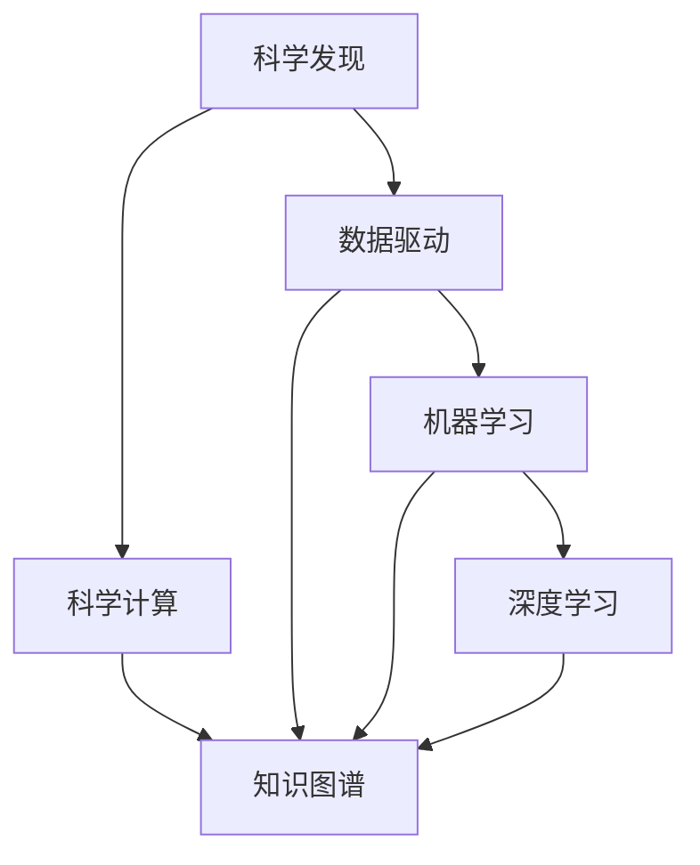

                 

# AI驱动的科学发现:加速创新的新范式

> 关键词：AI驱动，科学发现，加速创新，新范式，机器学习，深度学习，数据驱动，创新周期，科学研究，应用案例

## 1. 背景介绍

### 1.1 问题由来

人工智能（AI）在过去十年间经历了前所未有的发展，成为驱动现代科技创新的关键力量。在众多AI技术中，AI驱动的科学发现（AI-driven scientific discovery）正迅速崛起，成为加速科学研究与创新的新范式。

AI驱动的科学发现通过利用大数据、高性能计算和先进的机器学习算法，实现对海量数据的高效分析与处理，从而加速科学研究的进程，提升科学研究的精度和可靠性。这一范式不仅在基础科学研究中展现了巨大潜力，还在应用科学和技术开发中发挥了重要作用。

### 1.2 问题核心关键点

AI驱动的科学发现涉及多方面的关键技术：

- **大数据处理**：如何高效存储、处理和分析大规模数据集，挖掘潜在信息。
- **机器学习与深度学习**：如何利用先进算法，自动学习数据中的规律和模式。
- **自动化与智能化**：如何通过智能算法实现自动化分析和发现过程，降低人工干预。
- **跨领域融合**：如何将AI技术与其他学科知识相融合，拓展应用场景。

这些技术共同构成了AI驱动科学发现的框架，使得AI成为科研创新的重要工具。

## 2. 核心概念与联系

### 2.1 核心概念概述

为了更好地理解AI驱动科学发现的原理和应用，本节将介绍几个关键概念及其相互关系：

- **科学发现**：指通过观察、实验和理论推导，揭示自然界和人类社会运行规律的过程。
- **数据驱动**：指利用数据作为决策和分析的依据，减少主观判断和经验。
- **机器学习与深度学习**：通过算法和模型，自动从数据中学习和提取规律。
- **科学计算**：使用计算机进行科学计算，提升科研效率和精度。
- **知识图谱**：用图结构表示知识网络，实现知识抽取和关联。

这些概念的联系可以用以下Mermaid流程图来表示：



该图展示了数据驱动、机器学习和深度学习在科学发现过程中的作用。科学计算和知识图谱则提供了必要的技术支持。

## 3. 核心算法原理 & 具体操作步骤
### 3.1 算法原理概述

AI驱动的科学发现主要依赖于数据驱动的机器学习和深度学习算法，通过自动化分析数据，发现科学规律。其核心算法包括：

- **监督学习**：使用标注数据训练模型，进行分类、回归等任务。
- **无监督学习**：从未标注数据中学习模式和结构。
- **强化学习**：通过奖励机制优化模型决策，解决优化问题。
- **自然语言处理（NLP）**：利用机器学习技术理解和生成自然语言。

### 3.2 算法步骤详解

AI驱动的科学发现通常包括以下步骤：

**Step 1: 数据收集与预处理**

1. **数据收集**：收集与研究问题相关的数据，包括实验数据、观测数据、文献数据等。
2. **数据清洗**：处理缺失值、异常值、噪音数据，保证数据质量。
3. **数据标注**：对部分数据进行标注，以便训练监督学习模型。

**Step 2: 特征工程**

1. **特征提取**：从原始数据中提取有用的特征，如文本中的关键词、图像中的边缘等。
2. **特征选择**：根据模型需要选择重要的特征，减少冗余。
3. **特征变换**：对特征进行归一化、标准化、降维等处理。

**Step 3: 模型训练与优化**

1. **模型选择**：根据任务选择合适的机器学习或深度学习模型。
2. **模型训练**：使用标注数据训练模型，调整模型参数，提高准确性。
3. **模型评估**：使用测试集评估模型性能，调整超参数。
4. **模型优化**：通过调整算法、更新模型架构等方式，进一步提升模型性能。

**Step 4: 结果验证与分析**

1. **结果验证**：在测试集上验证模型效果，确保模型泛化能力。
2. **结果分析**：分析模型输出的结果，提取关键信息。
3. **结果解释**：使用可解释性技术，解释模型的推理过程。

### 3.3 算法优缺点

AI驱动的科学发现具有以下优点：

1. **效率提升**：通过自动化分析，大大提高了科研效率，缩短了创新周期。
2. **精度提高**：机器学习算法能够处理复杂数据，提高发现过程的精度。
3. **跨领域应用**：可以应用于多学科领域，促进知识共享和创新。

同时，也存在一些缺点：

1. **数据依赖性**：对数据质量和标注依赖性强，数据偏差可能影响结果。
2. **模型复杂性**：复杂的深度学习模型可能需要大量计算资源和时间。
3. **可解释性不足**：某些模型（如深度神经网络）难以解释其决策过程。
4. **依赖先验知识**：需要一定的先验知识和领域经验，才能设计有效的模型和特征。

## 4. 数学模型和公式 & 详细讲解 & 举例说明

### 4.1 数学模型构建

假设研究问题是关于某物质X的性质，数据集包含多个样本(xi, yi)，其中xi是输入特征，yi是对应的输出标签。

**监督学习模型**：使用标注数据训练模型，假设模型为f(x;θ)，其中θ为模型参数。通过最小化损失函数L来优化θ：

$$
\theta = \arg\min_\theta \frac{1}{N}\sum_{i=1}^N L(f(x_i; \theta), y_i)
$$

其中L为损失函数，如均方误差、交叉熵等。

**无监督学习模型**：不需要标注数据，假设模型为f(x)，通过最大化概率密度函数P(x)来优化：

$$
\theta = \arg\max_\theta \prod_{i=1}^N P(x_i; \theta)
$$

**强化学习模型**：通过奖励机制优化模型行为，假设模型为f(s, a)，其中s为状态，a为动作，通过最大化累积奖励R来优化：

$$
\theta = \arg\max_\theta \sum_{t=1}^T r_t
$$

其中r_t为状态s在动作a下的即时奖励。

### 4.2 公式推导过程

以监督学习模型为例，假设使用线性回归模型：

$$
f(x; \theta) = \theta^T x + b
$$

其中θ为权重向量，x为特征向量，b为偏置项。损失函数为均方误差：

$$
L(f(x_i; \theta), y_i) = \frac{1}{2}(f(x_i; \theta) - y_i)^2
$$

最小化损失函数，得到梯度：

$$
\nabla_\theta L = \frac{\partial}{\partial\theta} \frac{1}{2}\sum_{i=1}^N (f(x_i; \theta) - y_i)^2
$$

通过反向传播算法，计算梯度并更新参数θ。

### 4.3 案例分析与讲解

以基因组学研究为例，通过AI驱动的科学发现，可以自动识别基因序列中的关键特征，发现基因与疾病之间的关联。

1. **数据收集**：收集大规模基因组数据和疾病标签数据。
2. **特征工程**：提取基因序列中的特征，如基因长度、序列变化等。
3. **模型训练**：使用随机森林或神经网络模型训练，发现基因与疾病之间的关系。
4. **结果验证**：在独立测试集上验证模型效果，提取关键基因特征。
5. **结果解释**：使用可解释性技术，解释基因对疾病的影响机制。

## 5. 项目实践：代码实例和详细解释说明

### 5.1 开发环境搭建

要进行AI驱动的科学发现项目，需要搭建合适的开发环境。以下是Python环境下使用Scikit-learn和TensorFlow搭建环境的示例：

1. **安装Python**：使用Anaconda或Miniconda安装Python。
2. **安装Scikit-learn和TensorFlow**：使用pip安装：
```
pip install scikit-learn tensorflow
```

3. **创建虚拟环境**：
```
conda create --name myenv python=3.8
conda activate myenv
```

### 5.2 源代码详细实现

以下是一个基于TensorFlow实现的无监督聚类分析示例：

```python
import tensorflow as tf
import numpy as np

# 生成随机数据
X = np.random.randn(100, 10)

# 定义模型
model = tf.keras.Sequential([
    tf.keras.layers.Dense(10, activation='relu'),
    tf.keras.layers.Dense(5, activation='softmax')
])

# 定义损失函数和优化器
loss_fn = tf.keras.losses.CategoricalCrossentropy()
optimizer = tf.keras.optimizers.Adam()

# 训练模型
model.compile(optimizer=optimizer, loss=loss_fn, metrics=['accuracy'])
model.fit(X, y, epochs=100)

# 预测并验证结果
y_pred = model.predict(X)
print('Accuracy:', tf.keras.metrics.Accuracy()(y_true, y_pred).numpy())
```

### 5.3 代码解读与分析

1. **数据生成**：使用Numpy生成随机数据X。
2. **模型定义**：使用TensorFlow定义一个简单的神经网络模型，包含两个全连接层。
3. **损失函数和优化器**：定义交叉熵损失函数和Adam优化器。
4. **模型训练**：编译模型并训练。
5. **预测并验证**：使用训练好的模型进行预测，计算准确率。

## 6. 实际应用场景

### 6.1 医学研究

在医学研究中，AI驱动的科学发现可以用于基因组学、药物发现和疾病预测。通过分析基因序列和病历数据，AI可以发现新的药物靶点、预测疾病风险，显著加速药物研发和疾病防治。

**基因组学研究**：使用深度学习模型分析基因序列数据，发现与疾病相关的基因突变。
**药物发现**：通过机器学习模型预测化合物与靶点的结合能力，加速药物筛选。
**疾病预测**：使用NLP技术处理病历数据，提取临床特征，预测疾病风险。

### 6.2 气候科学

气候变化是一个复杂的系统性问题，AI驱动的科学发现可以用于气候数据分析、气候模型改进和政策制定。

**数据分析**：使用机器学习模型分析气象数据，发现气候变化的趋势和规律。
**模型改进**：使用强化学习技术优化气候模型，提高预测精度。
**政策制定**：通过NLP技术处理公共数据，提取政策建议。

### 6.3 金融分析

金融市场是一个高度动态的环境，AI驱动的科学发现可以用于金融数据分析、风险评估和投资策略优化。

**数据分析**：使用深度学习模型分析交易数据，发现市场趋势和异常。
**风险评估**：使用机器学习模型评估信用风险和市场风险。
**投资策略**：通过强化学习模型优化投资组合，提升回报率。

### 6.4 未来应用展望

随着AI技术的不断发展，AI驱动的科学发现将在更多领域发挥重要作用。未来可能的应用包括：

1. **环境科学**：使用AI分析环境数据，发现污染源和治理方案。
2. **社会研究**：使用NLP技术分析社交媒体数据，发现社会趋势和行为模式。
3. **交通管理**：使用机器学习模型分析交通数据，优化交通流量和安全性。

## 7. 工具和资源推荐

### 7.1 学习资源推荐

1. **《深度学习》（Ian Goodfellow）**：全面介绍深度学习原理和算法，是AI驱动科学发现的重要参考。
2. **Coursera和edX**：提供多种AI和机器学习课程，帮助学习者掌握相关技术。
3. **Kaggle**：提供大量开源数据集和竞赛，是学习者实践和展示成果的好地方。

### 7.2 开发工具推荐

1. **TensorFlow和PyTorch**：主流的深度学习框架，支持多种AI算法和模型。
2. **Jupyter Notebook**：提供交互式编程环境，便于代码编写和调试。
3. **Scikit-learn**：提供多种机器学习算法和工具，方便数据处理和模型训练。

### 7.3 相关论文推荐

1. **《TensorFlow: A System for Large-Scale Machine Learning》**：介绍TensorFlow系统架构和应用。
2. **《深度学习：一种新的研究范式》（Deng et al.）**：讨论深度学习在科学研究中的应用。
3. **《AlphaGo Zero: Mastering the Game of Go without Human Knowledge》**：介绍AlphaGo Zero的深度强化学习应用。

## 8. 总结：未来发展趋势与挑战

### 8.1 研究成果总结

AI驱动的科学发现已经成为科学研究的重要工具，广泛应用于基因组学、药物发现、气候科学等多个领域。其核心技术包括大数据处理、机器学习和深度学习等。

### 8.2 未来发展趋势

未来AI驱动的科学发现将呈现以下几个趋势：

1. **跨领域融合**：更多学科的跨领域应用，促进知识共享和创新。
2. **自动化和智能化**：更加智能的自动化分析，提高科研效率。
3. **深度学习**：深度学习算法在科学研究中的应用将更加广泛。
4. **可解释性**：研究如何提高模型的可解释性，增强信任度。
5. **边缘计算**：在边缘计算环境中进行科学发现，提高数据处理效率。

### 8.3 面临的挑战

尽管AI驱动的科学发现具有巨大的潜力，但也面临诸多挑战：

1. **数据质量和标注**：高质量数据的获取和标注是科研的基础。
2. **模型复杂性**：复杂的深度学习模型需要大量计算资源和时间。
3. **可解释性**：AI模型的可解释性不足，影响其应用。
4. **伦理和隐私**：AI研究涉及伦理和隐私问题，需要谨慎处理。

### 8.4 研究展望

未来研究需要在以下几个方面进行突破：

1. **数据预处理**：提高数据处理效率和质量，减少人工干预。
2. **模型简化**：研究和开发更简单、高效的模型，提高科研效率。
3. **可解释性**：开发更多可解释性技术，增强模型的信任度。
4. **跨领域应用**：拓展AI技术在更多领域的应用，推动科学研究。

## 9. 附录：常见问题与解答

**Q1：AI驱动的科学发现是否适用于所有科学研究领域？**

A: AI驱动的科学发现可以应用于大部分科学研究领域，尤其是在数据量大、规律复杂的领域。但对于需要高度理论推导和实验验证的领域，AI可能无法完全替代人类的工作。

**Q2：AI驱动的科学发现是否存在伦理和隐私问题？**

A: 是的，AI驱动的科学发现可能涉及伦理和隐私问题，如数据隐私、结果误用等。研究者需要在设计和应用AI模型时，充分考虑这些问题，并制定相应的解决方案。

**Q3：AI驱动的科学发现是否能够替代人类科研工作？**

A: AI驱动的科学发现能够辅助科研工作，加速发现过程，但无法完全替代人类。人类在科研中的理论推导和实验验证仍然是不可替代的。

---

作者：禅与计算机程序设计艺术 / Zen and the Art of Computer Programming

