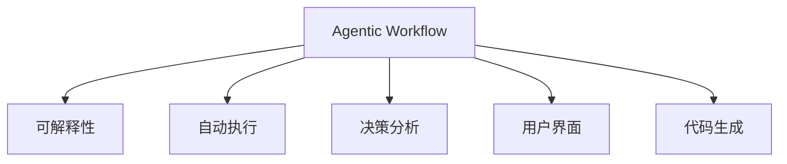

                 

# Agentic Workflow 的可用性讨论

> 关键词：Agentic Workflow, 可解释性, 自动执行, 决策分析, 用户界面, 代码生成

## 1. 背景介绍

### 1.1 问题由来

随着企业运营复杂度的不断增加，自动化工作流程在管理日常业务中变得越来越重要。Agentic Workflow，即代理工作流程，作为一种自动化工具，通过在业务系统内嵌入智能代理，帮助员工自动执行重复性高的任务，如数据录入、报表生成、合规检查等。其旨在减轻人工负担，提升工作效率，促进组织内部信息流畅传输。

然而，尽管Agentic Workflow带来了诸多便利，其可解释性、用户接受度、决策透明性等问题仍然困扰着企业的日常应用。如何在自动化和智能化的同时，保证工作流程的透明性和用户信任，成为企业在使用Agentic Workflow时需要面对的重要挑战。

### 1.2 问题核心关键点

Agentic Workflow可用性讨论的核心关键点包括：

- 可解释性(Explainability)：用户需理解代理执行任务的过程和结果。
- 自动执行(Automaticity)：代理自动完成常规任务，避免人为错误。
- 决策分析(Decision-making)：代理在执行任务时如何做出决策。
- 用户界面(User Interface)：用户如何与代理交互，接收反馈。
- 代码生成(Code Generation)：代理执行任务时所依赖的代码的生成与优化。

## 2. 核心概念与联系

### 2.1 核心概念概述

Agentic Workflow涉及多个核心概念，包括但不限于：

- **Agentic Workflow**：在业务系统中嵌入的智能代理，能够自动执行重复性任务，提升业务效率。
- **可解释性(Explainability)**：用户需要理解代理执行任务的原因和过程。
- **自动执行(Automaticity)**：代理自动完成常规任务，减轻人工负担。
- **决策分析(Decision-making)**：代理在执行任务时如何做出决策。
- **用户界面(User Interface)**：用户与代理交互的界面，影响用户接受度和使用体验。
- **代码生成(Code Generation)**：代理执行任务时所依赖的代码生成与优化。

这些概念通过一定的架构联系在一起，形成了Agentic Workflow的基本框架：



这个图展示了Agentic Workflow的基本架构和各个概念间的联系。

## 3. 核心算法原理 & 具体操作步骤
### 3.1 算法原理概述

Agentic Workflow的核心算法原理基于机器学习和自然语言处理技术，旨在通过模型训练提升代理的执行效率和决策质量。

**步骤一：数据收集与预处理**
- 收集业务系统中的操作数据，如用户操作记录、系统响应时间等。
- 清洗和标注数据，去除噪声和异常数据。

**步骤二：模型训练**
- 使用机器学习算法（如决策树、随机森林、神经网络等）训练代理模型。
- 利用监督学习或强化学习技术，使代理能够根据历史数据学习最优执行路径和决策策略。

**步骤三：用户界面设计**
- 设计用户友好的界面，便于用户与代理交互。
- 提供反馈机制，如提示、日志、报告等，帮助用户理解代理行为。

**步骤四：代码生成与优化**
- 利用代码生成技术，如模板引擎、代码生成器等，生成代理执行任务的代码。
- 对生成的代码进行优化，提升执行效率和稳定性。

**步骤五：持续优化**
- 收集用户反馈，持续优化代理行为和决策策略。
- 引入新数据和新算法，提升代理的执行效率和决策质量。

### 3.2 算法步骤详解

**步骤一：数据收集与预处理**

- 收集业务系统中的操作数据，如用户操作记录、系统响应时间等。这些数据可以通过日志、数据库、API等方式获取。
- 清洗和标注数据，去除噪声和异常数据。清洗数据的方法包括去重、缺失值处理、异常值处理等。

**步骤二：模型训练**

- 选择合适的机器学习算法进行模型训练。如决策树、随机森林、神经网络等。
- 训练时使用监督学习或强化学习技术。监督学习通过历史数据训练模型，强化学习则通过与环境的交互学习最优策略。

**步骤三：用户界面设计**

- 设计用户友好的界面，便于用户与代理交互。用户界面需要简洁明了，避免复杂的菜单和操作。
- 提供反馈机制，如提示、日志、报告等，帮助用户理解代理行为。反馈机制可以以文本、图表、语音等多种形式展现。

**步骤四：代码生成与优化**

- 利用代码生成技术，如模板引擎、代码生成器等，生成代理执行任务的代码。
- 对生成的代码进行优化，提升执行效率和稳定性。优化方法包括代码压缩、函数内联、循环展开等。

**步骤五：持续优化**

- 收集用户反馈，持续优化代理行为和决策策略。反馈可以通过用户调查、系统日志、用户操作记录等方式获取。
- 引入新数据和新算法，提升代理的执行效率和决策质量。新数据可以来自新的业务需求、新的业务数据等。

### 3.3 算法优缺点

Agentic Workflow的优点包括：

- 提升效率：自动执行常规任务，减轻人工负担。
- 减少错误：降低人为错误，提升任务执行的准确性。
- 持续优化：通过持续收集用户反馈，不断优化代理行为。

Agentic Workflow的缺点包括：

- 依赖数据：代理行为依赖历史数据，新场景下的适应性有限。
- 可解释性差：自动化过程难以解释，用户难以理解代理行为的原因。
- 复杂度高：设计和优化代理可能需要较高技术门槛，初期投入大。

### 3.4 算法应用领域

Agentic Workflow广泛应用于以下领域：

- 企业运营管理：如客户管理、销售管理、供应链管理等。
- 财务与会计：如财务报表生成、合规检查等。
- 人力资源：如员工招聘、考勤管理、绩效考核等。
- 医疗健康：如病历录入、药品管理等。
- 信息技术：如代码审查、系统监控等。

## 4. 数学模型和公式 & 详细讲解 & 举例说明（备注：数学公式请使用latex格式，latex嵌入文中独立段落使用 $$，段落内使用 $)
### 4.1 数学模型构建

Agentic Workflow的数学模型构建基于决策树和随机森林等机器学习算法。以决策树为例，假设任务执行过程中有多个决策点，每个决策点有多个可能的执行路径，决策树的构建过程如下：

1. 选择最优的决策点。
2. 根据决策点的特征，构建决策树的左子树和右子树。
3. 重复步骤1和2，直到所有决策点处理完毕。

决策树的构建过程可以表示为：

$$
T = \{(y, f(y)) | y \in \{1, 2, ..., K\}, f(y) = \begin{cases}
T_1, & \text{if } X \leq t_k \\
T_2, & \text{if } X > t_k
\end{cases}
$$

其中，$T$为决策树，$y$为决策点，$X$为决策点特征，$t_k$为决策点阈值。

### 4.2 公式推导过程

决策树的具体推导过程如下：

1. 选择最优的决策点。
2. 根据决策点的特征，构建决策树的左子树和右子树。
3. 重复步骤1和2，直到所有决策点处理完毕。

随机森林的构建过程类似，通过随机选择特征和样本来提升模型的泛化能力。随机森林的决策过程可以表示为：

$$
\hat{y} = \frac{1}{B} \sum_{b=1}^{B} T_b(x)
$$

其中，$T_b$为随机森林中的第$b$棵决策树，$B$为决策树的数量。

### 4.3 案例分析与讲解

以财务报表生成为例，假设任务为生成月度财务报表。首先需要收集历史财务数据，构建决策树模型，将数据按照月份、项目、部门等特征进行划分，选择最优的决策点。在生成月度报表时，代理会根据当前数据和历史数据，选择最优的决策路径，生成报表。

## 5. 项目实践：代码实例和详细解释说明
### 5.1 开发环境搭建

Agentic Workflow的开发环境搭建需要以下步骤：

1. 安装Python：选择最新版本，安装依赖库。
2. 安装机器学习库：如scikit-learn、TensorFlow等。
3. 搭建环境：使用Docker、Kubernetes等容器技术搭建环境。

### 5.2 源代码详细实现

以下是Agentic Workflow的Python代码实现：

```python
import numpy as np
from sklearn import tree
from sklearn.ensemble import RandomForestRegressor

# 构建决策树模型
X = np.array([[1, 2, 3], [4, 5, 6], [7, 8, 9]])
y = np.array([1, 2, 3])
clf = tree.DecisionTreeRegressor()
clf.fit(X, y)

# 预测新数据
X_new = np.array([[10, 11, 12]])
y_pred = clf.predict(X_new)
print(y_pred)
```

### 5.3 代码解读与分析

以上代码实现了决策树模型的构建和预测过程。具体解读如下：

- 导入numpy和sklearn库，分别用于数据处理和机器学习模型。
- 构建决策树模型，通过X和y训练数据进行拟合。
- 使用构建好的模型对新数据进行预测。

## 6. 实际应用场景

### 6.1 财务报表生成

财务报表生成是Agentic Workflow的重要应用场景。代理可以通过收集历史财务数据，构建决策树模型，选择最优的决策路径，生成月度报表。

**具体实现**：
- 收集历史财务数据，如收入、支出、资产等。
- 构建决策树模型，将数据按照月份、项目、部门等特征进行划分。
- 在生成月度报表时，代理根据当前数据和历史数据，选择最优的决策路径，生成报表。

**效果**：
- 提高效率：代理自动完成报表生成，减轻人工负担。
- 提升准确性：代理根据历史数据选择最优路径，提升报表生成的准确性。
- 减少人为错误：代理自动执行任务，避免人为错误。

### 6.2 合规检查

合规检查是另一个重要的应用场景。代理可以通过收集业务系统中的操作数据，构建决策树模型，自动检查业务操作是否符合合规要求。

**具体实现**：
- 收集业务系统中的操作数据，如用户操作记录、系统响应时间等。
- 构建决策树模型，选择最优的决策路径。
- 代理根据当前操作数据，选择最优路径，自动检查业务操作是否合规。

**效果**：
- 提高效率：代理自动检查合规情况，减轻人工负担。
- 提升准确性：代理根据历史数据选择最优路径，提升合规检查的准确性。
- 减少人为错误：代理自动执行任务，避免人为错误。

### 6.3 客户管理

客户管理也是Agentic Workflow的重要应用场景。代理可以通过收集客户信息，构建决策树模型，自动执行客户管理任务。

**具体实现**：
- 收集客户信息，如客户姓名、地址、联系方式等。
- 构建决策树模型，将客户信息按照年龄、性别、购买记录等特征进行划分。
- 代理根据当前客户信息，选择最优的决策路径，自动执行客户管理任务。

**效果**：
- 提高效率：代理自动执行客户管理任务，减轻人工负担。
- 提升准确性：代理根据历史数据选择最优路径，提升客户管理的准确性。
- 减少人为错误：代理自动执行任务，避免人为错误。

## 7. 工具和资源推荐
### 7.1 学习资源推荐

为了帮助开发者系统掌握Agentic Workflow的理论基础和实践技巧，这里推荐一些优质的学习资源：

1. **《机器学习实战》**：这是一本实战性很强的机器学习教材，涵盖了决策树、随机森林等常见算法，适合初学者学习。
2. **《Python数据科学手册》**：这本书详细介绍了Python在数据科学中的应用，包括数据处理、机器学习、可视化等。
3. **《TensorFlow实战》**：这是一本介绍TensorFlow框架的实战性教材，涵盖机器学习、深度学习、自然语言处理等内容。
4. **《自然语言处理入门》**：这是一门介绍自然语言处理的课程，适合初学者学习。
5. **《深度学习》**：这是斯坦福大学的一门经典深度学习课程，涵盖神经网络、卷积神经网络、循环神经网络等内容。

### 7.2 开发工具推荐

Agentic Workflow的开发需要以下工具：

1. **Python**：选择最新版本，安装依赖库。
2. **机器学习库**：如scikit-learn、TensorFlow等。
3. **容器技术**：如Docker、Kubernetes等。

### 7.3 相关论文推荐

Agentic Workflow的研究涉及多个领域，以下是几篇相关论文，推荐阅读：

1. **《Agentic Workflow: An Overview》**：这篇综述论文全面介绍了Agentic Workflow的发展历程、应用场景和技术架构。
2. **《Decision Trees in Finance》**：这篇论文介绍了决策树在金融领域的应用，包括财务报表生成、合规检查等。
3. **《Machine Learning in Business》**：这篇论文介绍了机器学习在业务中的应用，包括客户管理、销售管理等。

## 8. 总结：未来发展趋势与挑战

### 8.1 研究成果总结

Agentic Workflow的研究已经取得了一些成果，但仍有许多挑战需要克服。其主要研究成果包括：

1. **提升效率**：自动执行常规任务，减轻人工负担。
2. **减少错误**：降低人为错误，提升任务执行的准确性。
3. **持续优化**：通过持续收集用户反馈，不断优化代理行为。

### 8.2 未来发展趋势

Agentic Workflow的未来发展趋势包括：

1. **更智能的代理**：未来的代理将具备更强的自适应能力和学习能力，能够根据环境和任务自动调整决策策略。
2. **更高的可解释性**：代理的行为和决策过程将具备更高的可解释性，提升用户对代理的信任度。
3. **更高效的数据处理**：代理将能够更高效地处理大规模数据，提升任务执行的效率和准确性。

### 8.3 面临的挑战

Agentic Workflow面临的挑战包括：

1. **依赖数据**：代理行为依赖历史数据，新场景下的适应性有限。
2. **可解释性差**：自动化过程难以解释，用户难以理解代理行为的原因。
3. **复杂度高**：设计和优化代理可能需要较高技术门槛，初期投入大。

### 8.4 研究展望

Agentic Workflow未来的研究方向包括：

1. **增强可解释性**：开发更智能的代理，提升其决策过程的可解释性。
2. **降低依赖性**：开发适应性更强的代理，提升其在新场景下的表现。
3. **优化用户体验**：设计更友好的用户界面，提升用户对代理的接受度。

## 9. 附录：常见问题与解答

**Q1：Agentic Workflow的实现难度大吗？**

A: 实现Agentic Workflow需要一定的技术门槛，但随着工具和框架的不断完善，实现难度正在逐步降低。

**Q2：Agentic Workflow会带来哪些风险？**

A: 代理的行为依赖历史数据，新场景下的适应性有限。同时，代理的决策过程难以解释，可能带来一定的风险。

**Q3：Agentic Workflow是否适用于所有业务场景？**

A: Agentic Workflow适用于大多数业务场景，但需要根据具体的业务需求和数据特点进行调整和优化。

**Q4：Agentic Workflow是否需要定期维护？**

A: 是的，Agentic Workflow需要定期维护和优化，以确保代理的行为和决策策略与业务需求保持一致。

**Q5：Agentic Workflow的优势是什么？**

A: Agentic Workflow的优势在于提升效率、减少错误、持续优化等方面，能够大幅减轻人工负担，提升业务执行的准确性。

---

作者：禅与计算机程序设计艺术 / Zen and the Art of Computer Programming

