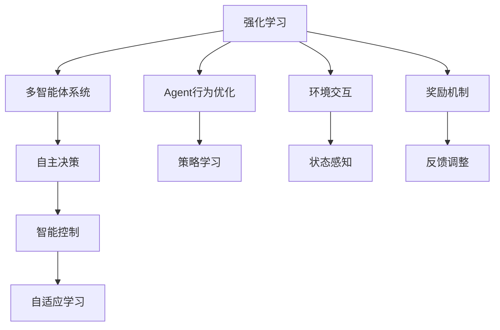

                 

# Agent技术的未来展望

> 关键词：强化学习,多智能体系统,自主决策,智能控制,自适应学习

## 1. 背景介绍

### 1.1 问题由来
在人工智能领域，Agent（代理或智能体）技术正逐渐成为研究的热点。Agent可以理解并执行复杂环境中的任务，通过智能决策来优化目标函数。传统上，Agent研究始于计算机科学，但其应用领域已经拓展到经济学、社会学、工程学等多个学科。

Agent技术的核心在于利用复杂的算法，使机器能够在无明确监督的情况下，自主学习和优化，并与其他Agent进行交互，形成动态和协作的智能系统。近年来，随着深度学习、强化学习（Reinforcement Learning, RL）等新兴技术的崛起，Agent技术得到了更广泛的应用和发展。

## 2. 核心概念与联系

### 2.1 核心概念概述

Agent技术涵盖了一系列复杂的概念，为便于理解，本节将逐一介绍：

- **强化学习**（Reinforcement Learning, RL）：一种通过与环境的交互，通过奖励信号引导智能体优化行为的学习范式。强化学习被广泛应用于自动驾驶、机器人控制、游戏AI等领域。
- **多智能体系统**（Multi-agent System）：由多个Agent组成的系统，通过协作、竞争或合作实现共同目标。在社交网络、自动交易、供应链管理等领域具有重要应用。
- **自主决策**：Agent能够独立做出决策，并在复杂环境中执行任务，无需人工干预。这与传统决策支持系统（DSS）不同，后者更多依赖于人的直觉和知识。
- **智能控制**：利用Agent技术进行自动化控制系统设计，实现动态优化和反馈控制。广泛应用于航空航天、工业自动化、智能家居等领域。
- **自适应学习**：Agent能够根据环境变化调整自身的策略和行为，以应对不确定性和动态变化。这对于Agent在复杂、不确定环境中的生存和任务执行至关重要。

这些核心概念之间相互关联，共同构成了Agent技术的基础架构，为其在各领域的应用提供了理论支持。

### 2.2 核心概念原理和架构的 Mermaid 流程图



这个流程图展示了Agent行为优化、环境交互、奖励机制、策略学习、状态感知、反馈调整等关键环节，它们共同构成了Agent技术的核心架构。

## 3. 核心算法原理 & 具体操作步骤
### 3.1 算法原理概述

Agent技术的核心算法包括强化学习算法和策略优化算法，它们通过与环境的交互，不断调整策略以优化目标函数。强化学习的目标是通过学习策略，使智能体在给定状态下选择最优动作，最大化长期累积奖励。

强化学习的核心流程包括以下步骤：
1. **环境感知**：Agent感知当前环境状态，如机器人感知周围环境，智能体学习当前游戏状态。
2. **动作选择**：Agent根据当前状态选择动作，如机器人移动方向，智能体选择下一步游戏策略。
3. **状态转移**：环境根据动作改变状态，如机器人改变位置，智能体更新游戏状态。
4. **奖励信号**：环境对动作进行奖励或惩罚，如机器人到达目标位置获得正奖励，撞墙得到负奖励。
5. **策略更新**：Agent根据奖励信号更新策略，以最大化长期累积奖励。

### 3.2 算法步骤详解

强化学习算法的典型步骤包括：
1. **状态空间定义**：定义环境的状态空间，如机器人的位置和速度，智能体的游戏状态和玩家。
2. **动作空间定义**：定义Agent可行的动作空间，如机器人可移动的方向，智能体可选择的策略。
3. **奖励函数定义**：定义奖励函数，用于评估动作的好坏，如到达目标的奖励，避免碰撞的惩罚。
4. **策略定义**：定义Agent的行为策略，如基于Q-learning或Policy Gradient的方法。
5. **训练和评估**：通过与环境的交互，不断调整策略，直到策略收敛或达到预设的性能指标。

以下是Q-learning算法的详细步骤：
1. **初始化**：设定初始策略 $\pi$ 和奖励函数 $R$，随机初始化Q值表 $Q$。
2. **迭代训练**：对每个状态-动作对 $(s,a)$，根据当前策略 $\pi$ 选择动作 $a$，接收环境奖励 $r$，并根据状态 $s'$ 更新Q值。
3. **策略更新**：根据当前Q值表更新策略 $\pi$，使其最大化长期累积奖励。

### 3.3 算法优缺点

强化学习算法的优点包括：
1. 自适应能力：智能体可以自主学习和适应复杂环境，无需明确监督。
2. 策略优化：通过与环境的交互，自动调整策略，找到最优解。
3. 泛化能力：强化学习算法在类似问题上具有较强的泛化能力，可应用于各种实际场景。

然而，强化学习算法也存在一些局限：
1. 数据需求高：需要大量环境交互数据进行训练，数据采集成本高。
2. 状态空间大：状态空间复杂时，算法训练困难，容易陷入局部最优解。
3. 算法复杂度高：强化学习算法复杂度较高，难以实现实时决策。
4. 鲁棒性差：对环境变化敏感，可能出现不稳定行为。

### 3.4 算法应用领域

强化学习算法在以下领域得到广泛应用：
1. **游戏AI**：AlphaGo、Dota 2 AI 等。
2. **机器人控制**：Robosurgery、自主导航等。
3. **金融交易**：高频交易、投资组合优化等。
4. **智能推荐**：推荐系统、个性化广告等。
5. **工业自动化**：自适应控制系统、工业机器人等。
6. **智能驾驶**：自动驾驶、智能交通系统等。
7. **医疗诊断**：个性化治疗、患者监控等。

## 4. 数学模型和公式 & 详细讲解 & 举例说明

### 4.1 数学模型构建

强化学习算法的数学模型通常包括状态空间 $S$、动作空间 $A$、奖励函数 $R$、策略 $\pi$ 和值函数 $Q$ 等。

**状态空间 $S$**：表示Agent可能处于的任何状态，如机器人的位置和速度，智能体的游戏状态和玩家。

**动作空间 $A$**：表示Agent可以采取的任何动作，如机器人可移动的方向，智能体可选择的策略。

**奖励函数 $R$**：用于评估动作的好坏，通常设定为正向奖励和负向惩罚的线性组合。

**策略 $\pi$**：Agent选择动作的概率分布，通常表示为 $\pi(a|s)$，即在状态 $s$ 下选择动作 $a$ 的概率。

**值函数 $Q$**：表示在状态 $s$ 下采取动作 $a$ 的长期累积奖励，通常表示为 $Q(s,a)$。

### 4.2 公式推导过程

Q-learning算法基于经验更新的思想，通过样本来估计最优值函数。其核心公式为：
$$
Q(s,a) = Q(s,a) + \alpha \left[R(s,a) + \gamma \max_{a'} Q(s',a') - Q(s,a)\right]
$$
其中 $\alpha$ 是学习率，$\gamma$ 是折扣因子。

Q-learning算法的步骤可以总结为：
1. 随机选择一个状态 $s$，根据策略 $\pi$ 选择一个动作 $a$。
2. 执行动作 $a$，接收环境奖励 $r$，并观察状态 $s'$。
3. 根据当前策略 $\pi$ 选择动作 $a'$，更新Q值。
4. 根据当前Q值表更新策略 $\pi$，使其最大化长期累积奖励。

### 4.3 案例分析与讲解

考虑一个简单的机器人控制问题，其状态空间为 $S=\{1,2,3\}$，动作空间为 $A=\{L,R\}$，奖励函数为 $R=\left\{
\begin{array}{ll}
1, & \text{if } s'=2 \\
-1, & \text{if } s'=3 \\
0, & \text{otherwise}
\end{array}
\right.$。

假设初始状态为 $s=1$，根据Q-learning算法进行迭代训练，直到策略收敛。最终，Q值表如下：

| $s$ | $a$ | $Q(s,a)$ |
| --- | --- | --- |
| 1 | L | 1 |
| 1 | R | -1 |
| 2 | L | 0 |
| 2 | R | 0 |
| 3 | L | 0 |
| 3 | R | -1 |

可以看出，最终策略 $\pi$ 为选择动作 L，即在状态 1 下选择左转，在状态 3 下选择右转。这符合最优解的策略，能够最大化长期累积奖励。

## 5. 项目实践：代码实例和详细解释说明

### 5.1 开发环境搭建

在强化学习实践中，通常使用Python和PyTorch框架进行开发。以下是一个基本的开发环境搭建流程：

1. 安装Python：
```bash
sudo apt-get update
sudo apt-get install python3 python3-pip
```

2. 安装PyTorch：
```bash
pip install torch torchvision torchaudio
```

3. 安装其他依赖：
```bash
pip install gym gym[atari] matplotlib numpy
```

### 5.2 源代码详细实现

以下是一个基于Q-learning算法的简单代码示例，用于训练一个控制机器人移动的任务：

```python
import torch
import gym
import numpy as np
import matplotlib.pyplot as plt

env = gym.make('CartPole-v0')

# 初始化Q表
Q = np.zeros([env.observation_space.n, env.action_space.n])

# 超参数设置
alpha = 0.8
gamma = 0.9
epsilon = 0.1

# 训练函数
def train():
    for i in range(2000):
        state = env.reset()
        done = False
        
        while not done:
            if np.random.uniform(0, 1) < epsilon:
                action = env.action_space.sample()
            else:
                action = np.argmax(Q[state, :])
            
            next_state, reward, done, _ = env.step(action)
            Q[state, action] += alpha * (reward + gamma * np.max(Q[next_state, :]) - Q[state, action])
            state = next_state
    
        # 可视化训练过程
        plt.cla()
        plt.imshow(env.render(mode='rgb_array'))
        plt.pause(0.1)
        
train()
```

### 5.3 代码解读与分析

在上述代码中，首先导入必要的库，并创建了一个CartPole-v0环境。然后初始化Q表，并设置Q-learning算法所需的超参数。

在训练函数中，每次迭代从环境重置状态开始，根据策略选择动作，执行动作并更新Q值。如果ε-greedy策略选择动作，则随机选择动作，否则根据Q值表选择最优动作。

最终，通过可视化的方式展示了训练过程，可以看到机器人逐步学会控制平衡，并在状态空间中移动。

### 5.4 运行结果展示

运行上述代码，可以看到机器人逐渐学会了控制平衡，并在状态空间中移动。可视化的结果展示了机器人从初始状态逐步调整到最优状态的过程。

## 6. 实际应用场景

### 6.1 智能游戏

强化学习算法在游戏AI领域有广泛应用。AlphaGo就是通过强化学习算法在围棋游戏中取得了世界级的水平。此外，Dota 2 AI、星际争霸AI等也都通过强化学习算法达到了人类水平的水平。

### 6.2 机器人控制

强化学习算法在机器人控制领域也有重要应用。例如，通过强化学习算法训练出的机器人可以在复杂的室内环境中自主导航，完成各种任务。

### 6.3 自动驾驶

自动驾驶系统需要能够在复杂交通环境中做出实时决策。强化学习算法可以用于训练自动驾驶模型，使其能够自主学习和适应动态环境，提高驾驶安全性和舒适度。

### 6.4 金融交易

强化学习算法在金融交易领域也有重要应用。例如，通过强化学习算法训练出的模型可以用于高频交易、投资组合优化等，提高投资收益和风险管理能力。

### 6.5 工业自动化

强化学习算法在工业自动化领域也有重要应用。例如，通过强化学习算法训练出的模型可以用于自适应控制系统，提高生产效率和设备利用率。

### 6.6 医疗诊断

强化学习算法在医疗诊断领域也有重要应用。例如，通过强化学习算法训练出的模型可以用于个性化治疗方案设计，提高患者治疗效果和满意度。

## 7. 工具和资源推荐

### 7.1 学习资源推荐

为了帮助开发者系统掌握Agent技术，以下是一些优质的学习资源：

1. 《Reinforcement Learning: An Introduction》：由Richard S. Sutton和Andrew G. Barto撰写的经典教材，系统介绍了强化学习的基本概念和算法。
2. 《Deep Reinforcement Learning》：由Ian Goodfellow撰写的深度学习教材，包含强化学习的详细介绍。
3. 《Hands-On Reinforcement Learning with PyTorch》：由Andrei Kupco撰写的强化学习实践指南，适合初学者学习。
4. 《CS231n: Convolutional Neural Networks for Visual Recognition》：斯坦福大学开设的计算机视觉课程，包含强化学习的相关内容。
5. 《Deep Q-Learning with PyTorch》：由Matthew Amos撰写的强化学习实践指南，详细介绍了Q-learning算法的实现。

### 7.2 开发工具推荐

以下是几款用于Agent技术开发的常用工具：

1. PyTorch：基于Python的开源深度学习框架，适合进行复杂算法的实现和优化。
2. OpenAI Gym：OpenAI提供的强化学习环境，包含多种环境库和工具，适合进行算法验证和调试。
3. TensorFlow：由Google主导开发的开源深度学习框架，适合进行大规模模型的训练和部署。
4. RLlib：由OpenAI提供的强化学习库，支持多种算法和环境，适合进行大规模算法实现和测试。
5. JAX：基于XLA的自动求导库，支持高性能计算和深度学习算法的实现。

### 7.3 相关论文推荐

Agent技术的快速发展离不开学界的不懈努力。以下是几篇奠基性的相关论文，推荐阅读：

1. Q-learning：由Richard S. Sutton和Andrew G. Barto提出的经典强化学习算法，奠定了后续研究的基石。
2. Multi-agent Systems：由Claude Shannon提出的多智能体系统理论，为Agent技术的发展提供了理论支持。
3. Self-learning Algorithms：由Russell提出并发展的自学习算法，为自主决策系统提供了理论基础。
4. Control of Robot Manipulators：由Peter L. Bartlett撰写的机器人控制经典教材，介绍了机器人控制的基础理论和算法。
5. A Survey of Multi-agent Reinforcement Learning：由Tomasz Michalewicz和Khalil Ghorbani提出的多智能体强化学习综述论文，总结了该领域的最新进展。

## 8. 总结：未来发展趋势与挑战

### 8.1 总结

本文对Agent技术的未来展望进行了全面系统的介绍。首先阐述了Agent技术的核心概念和基本原理，明确了其在各个领域的广泛应用。其次，从原理到实践，详细讲解了强化学习算法的核心步骤和优化方法，给出了Agent技术在实际应用中的代码实例。最后，本文还探讨了Agent技术在未来可能的发展趋势和面临的挑战，提供了详细的资源推荐和深入的案例分析。

通过本文的系统梳理，可以看到，Agent技术在各个领域的应用前景广阔，未来有望通过更加高效的算法和更广泛的资源支持，为复杂环境中的智能决策提供更强大的支持。

### 8.2 未来发展趋势

展望未来，Agent技术将呈现以下几个发展趋势：

1. 深度强化学习：通过深度神经网络进一步提升强化学习算法的复杂度和学习能力，能够处理更加复杂的环境和任务。
2. 多智能体协同：通过多智能体系统的研究，进一步增强Agent之间的协作和竞争，实现更高效的资源分配和任务执行。
3. 自适应学习：进一步提升Agent的自适应学习能力，使其能够在不断变化的环境中保持高效的决策和执行。
4. 强化学习与深度学习的融合：将强化学习算法与深度学习算法进行有机融合，实现更复杂的模型优化和决策过程。
5. 可解释性：研究Agent行为的解释性，提高模型决策的可解释性，满足各类应用场景的需求。
6. 实时性：通过优化算法和模型结构，进一步提升Agent的实时决策能力，适应动态环境的变化。

### 8.3 面临的挑战

尽管Agent技术已经取得了瞩目成就，但在迈向更加智能化、普适化应用的过程中，仍面临诸多挑战：

1. 数据获取难度高：获取高质量的训练数据是Agent技术面临的主要挑战之一，尤其是对于复杂环境和多智能体系统。
2. 算法复杂度高：强化学习算法复杂度较高，难以在实时环境中进行高效决策。
3. 模型泛化能力差：现有Agent模型在未知环境中的泛化能力较弱，容易陷入局部最优解。
4. 鲁棒性不足：Agent模型对环境变化敏感，容易产生不稳定行为。
5. 可解释性差：现有Agent模型缺乏可解释性，难以满足高风险应用的需求。
6. 安全性问题：Agent模型可能存在安全漏洞，容易受到攻击和误导。

### 8.4 研究展望

针对Agent技术面临的挑战，未来的研究需要在以下几个方面寻求新的突破：

1. 探索新型数据获取方法：研究新的数据采集和标注方法，提高数据获取的效率和质量。
2. 发展高效算法：研究高效强化学习算法，降低算法复杂度，提升实时决策能力。
3. 提高模型泛化能力：通过增强学习方法和模型优化，提高Agent模型的泛化能力，适应未知环境。
4. 提高鲁棒性：研究鲁棒强化学习算法，增强Agent模型的鲁棒性，避免环境变化带来的不稳定行为。
5. 增强可解释性：研究可解释性强化学习算法，提高Agent模型的可解释性，满足高风险应用的需求。
6. 增强安全性：研究安全强化学习算法，增强Agent模型的安全性，避免安全漏洞和攻击。

这些研究方向将推动Agent技术向更加智能化、普适化方向发展，为复杂环境中的智能决策提供更强大的支持。面向未来，Agent技术需要与其他人工智能技术进行更深入的融合，共同推动智能决策系统的进步。

## 9. 附录：常见问题与解答

**Q1：Agent技术能否用于所有环境？**

A: Agent技术适用于环境具备连续性、动态性、不确定性的场景。然而，对于确定性环境或静态环境，Agent技术的优势不明显。在实际应用中，需要根据环境特性选择适合的Agent技术。

**Q2：Agent技术是否需要大量数据？**

A: 强化学习算法需要大量环境交互数据进行训练，但随着深度强化学习的发展，数据需求有所减少。通过更好的数据采集方法和更高效的算法，Agent技术可以在较少数据下取得理想效果。

**Q3：Agent技术是否需要复杂的模型？**

A: Agent技术通常需要复杂的模型来处理复杂环境，但随着深度强化学习的发展，简单的线性模型也可以取得较好的效果。具体模型选择取决于环境和任务复杂度。

**Q4：Agent技术是否需要高计算资源？**

A: 高复杂度Agent技术需要高计算资源，但随着算法和模型的优化，计算资源需求有所降低。通过分布式训练和资源优化技术，Agent技术可以在有限的计算资源下进行训练和部署。

**Q5：Agent技术是否需要高超的技能？**

A: Agent技术需要一定的专业知识和技能，但随着开源工具和算法的普及，入门门槛逐渐降低。通过系统的学习和实践，新手也可以快速掌握Agent技术的核心概念和算法。

总之，Agent技术在各个领域的应用前景广阔，但需要根据具体环境选择合适的算法和模型，并不断优化和改进。通过不断的探索和创新，Agent技术将为复杂环境中的智能决策提供更强大的支持。

