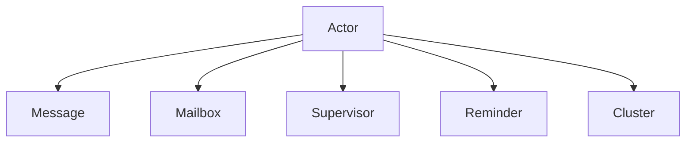

                 

## 1. 背景介绍

Akka是一个开源的分布式工具和运行时，用于构建高性能、可扩展的并发和响应式系统。Akka支持Actor模型编程，Actor模型是一种简单、高效的并发编程范式，已经成为构建响应式系统的黄金标准。本文将从背景、核心概念和机制入手，深入探讨Akka的工作原理，并通过实际代码实例，帮助你理解和实践Akka。

## 2. 核心概念与联系

### 2.1 核心概念概述

Akka的核心概念包括以下几个方面：

- **Actor模型**：Akka的核心模型，是一种并发编程模式，它将程序看作多个独立的执行单元（Actor）的集合，这些单元之间通过消息传递进行通信。

- **Message**：Actor之间的通信媒介，通常包括一个目标Actor和一个包含数据的消息体。

- **Mailbox**：Actor的消息队列，用于存储待处理的消息。

- **Supervisor**：用于监控和管理Actor的机制，当Actor出现异常时，Supervisor负责重新启动或替换该Actor。

- **Reminder**：用于周期性地向Actor发送消息，实现定时任务的功能。

- **Cluster**：Akka的集群功能，可以在多个节点上部署和运行Actor，实现系统的分布式扩展。

这些概念之间有着紧密的联系，共同构成了Akka的并发编程模型和系统架构。

### 2.2 核心概念原理和架构的 Mermaid 流程图



这个流程图展示了Akka中关键概念之间的联系。Actor通过消息通信，消息存储在Mailbox中，Supervisor负责监控Actor，Reminder周期性地向Actor发送消息，Cluster实现分布式扩展。

## 3. 核心算法原理 & 具体操作步骤

### 3.1 算法原理概述

Akka的算法原理主要基于Actor模型和消息传递机制。Actor模型将程序看作多个独立的执行单元，这些单元之间通过消息传递进行通信。消息传递机制负责在Actor之间异步、无状态的传递消息，从而实现并发和响应式编程。

### 3.2 算法步骤详解

#### 3.2.1 创建Actor

在Akka中，Actor的创建分为两种方式：直接创建和从其他Actor中派生。

1. **直接创建Actor**：使用`ActorSystem`创建Actor，并指定Actor的类型和配置。

```scala
val system = ActorSystem("MySystem")
val actor = system.actorOf(Props[MyActor], "myActor")
```

2. **从其他Actor派生**：使用`Context`创建Actor，并指定父Actor。

```scala
val parentActor = system.actorOf(Props[ParentActor], "parent")
val childActor = parentActor.childActor()
```

#### 3.2.2 发送消息

发送消息是Akka中Actor通信的核心操作。发送消息分为两种方式：同步发送和异步发送。

1. **同步发送**：使用`!`操作符发送消息，等待Actor处理完消息后再继续执行。

```scala
val actorRef = system.actorOf(Props[MyActor], "myActor")
actorRef ! MyMessage
```

2. **异步发送**：使用`!!`操作符发送消息，不等待Actor处理完消息。

```scala
val actorRef = system.actorOf(Props[MyActor], "myActor")
actorRef !! MyMessage
```

#### 3.2.3 监听消息

监听消息是指在Actor中通过`receive`方法接收和处理消息。

```scala
class MyActor extends Actor {
  override def receive: Receive = {
    case MyMessage => {
      println("Received MyMessage")
      // Process MyMessage
    }
  }
}
```

#### 3.2.4 发送回复消息

Actor可以通过`!`操作符发送回复消息，以异步方式处理消息。

```scala
class MyActor extends Actor {
  override def receive: Receive = {
    case MyMessage => {
      println("Received MyMessage")
      sender ! MyReplyMessage
    }
  }
}
```

### 3.3 算法优缺点

#### 3.3.1 优点

1. **高并发**：Actor模型天然支持高并发，每个Actor都是一个独立的执行单元，可以并行处理多个消息。

2. **弹性**：Actor系统可以动态创建和销毁Actor，支持系统扩缩容和故障恢复。

3. **异步通信**：消息传递机制实现了异步通信，避免了阻塞和死锁问题。

4. **易于测试**：Actor模型支持隔离测试，每个Actor可以被单独测试，提高了测试效率。

#### 3.3.2 缺点

1. **学习成本高**：Actor模型和消息传递机制的原理和概念较为抽象，需要花费一定时间学习和理解。

2. **资源管理**：Actor系统需要自行管理内存和资源，需要额外注意资源占用和垃圾回收。

3. **网络通信开销**：消息传递机制需要网络通信，可能会增加通信开销。

### 3.4 算法应用领域

Akka广泛应用于以下几个领域：

1. **分布式系统**：Akka的集群和分布式架构，使其成为构建分布式系统的首选框架。

2. **微服务架构**：Akka的Actor模型和消息传递机制，使其适用于微服务架构，支持服务的独立部署和扩展。

3. **响应式系统**：Akka的响应式编程范式，使其能够构建高性能、高可用的响应式系统。

4. **高并发系统**：Akka的高并发特性，使其适用于需要高并发处理的场景，如实时数据处理、消息队列等。

## 4. 数学模型和公式 & 详细讲解 & 举例说明

### 4.1 数学模型构建

Akka的数学模型基于Actor模型和消息传递机制，主要包括Actor、Message、Mailbox等概念。

#### 4.1.1 Actor模型

Actor模型可以表示为：

$$
\mathcal{A} = \{A_1, A_2, ..., A_n\}
$$

其中，$A_i$表示第$i$个Actor。每个Actor都有一个唯一的ID和一个Mailbox。

#### 4.1.2 消息传递

消息传递可以表示为：

$$
\mathcal{M} = \{M_1, M_2, ..., M_n\}
$$

其中，$M_i$表示第$i$个消息。每个消息包含一个Actor ID和一个消息体。

#### 4.1.3 Mailbox

Mailbox可以表示为：

$$
\mathcal{M}_i = \{M_{i1}, M_{i2}, ..., M_{im}\}
$$

其中，$M_{ik}$表示第$i$个Actor的第$k$个消息。每个Mailbox中的消息按照FIFO（先进先出）的顺序处理。

### 4.2 公式推导过程

#### 4.2.1 Actor模型

Actor模型的推导可以从两个方面入手：

1. **Actor创建**：使用`ActorSystem`创建Actor，并指定Actor的类型和配置。

```scala
val system = ActorSystem("MySystem")
val actor = system.actorOf(Props[MyActor], "myActor")
```

2. **Actor派生**：使用`Context`创建Actor，并指定父Actor。

```scala
val parentActor = system.actorOf(Props[ParentActor], "parent")
val childActor = parentActor.childActor()
```

#### 4.2.2 消息传递

消息传递的推导主要包括以下两个步骤：

1. **同步发送**：使用`!`操作符发送消息，等待Actor处理完消息后再继续执行。

```scala
val actorRef = system.actorOf(Props[MyActor], "myActor")
actorRef ! MyMessage
```

2. **异步发送**：使用`!!`操作符发送消息，不等待Actor处理完消息。

```scala
val actorRef = system.actorOf(Props[MyActor], "myActor")
actorRef !! MyMessage
```

#### 4.2.3 监听消息

监听消息的推导主要包括以下两个步骤：

1. **接收消息**：使用`receive`方法接收和处理消息。

```scala
class MyActor extends Actor {
  override def receive: Receive = {
    case MyMessage => {
      println("Received MyMessage")
      // Process MyMessage
    }
  }
}
```

2. **发送回复消息**：Actor可以通过`!`操作符发送回复消息，以异步方式处理消息。

```scala
class MyActor extends Actor {
  override def receive: Receive = {
    case MyMessage => {
      println("Received MyMessage")
      sender ! MyReplyMessage
    }
  }
}
```

### 4.3 案例分析与讲解

#### 4.3.1 示例代码

以下是一个简单的Actor系统示例代码：

```scala
import akka.actor._
import akka.actor.Props

object SimpleActorSystem {
  def main(args: Array[String]): Unit = {
    val system = ActorSystem("MySystem")
    val actor = system.actorOf(Props[MyActor], "myActor")
    actor ! MyMessage
  }
}

class MyActor extends Actor {
  override def receive: Receive = {
    case MyMessage => {
      println("Received MyMessage")
    }
  }
}
```

该示例代码创建了一个ActorSystem，并创建了一个名为`myActor`的Actor。当Actor接收到`MyMessage`消息时，打印出消息内容。

#### 4.3.2 运行结果

运行上述代码，可以看到输出结果如下：

```
Received MyMessage
```

## 5. 项目实践：代码实例和详细解释说明

### 5.1 开发环境搭建

在搭建Akka开发环境时，需要先安装Akka依赖和启动Akka集群。

1. 添加Akka依赖

在`build.sbt`文件中添加Akka依赖：

```scala
libraryDependencies ++= Seq(
  "akka.io" %% "akka-actor" %% "akka-actor-2.12" % "2.11.0"
)
```

2. 启动Akka集群

启动Akka集群：

```bash
akka-cluster.sh
```

### 5.2 源代码详细实现

以下是一个简单的Akka示例代码：

```scala
import akka.actor._
import akka.actor.ActorSystem
import akka.actor.Props
import akka.actor.actorcontext._
import akka.actor.actorref._
import akka.actor.actorrefvalue._
import akka.actor.actorrefvaluevalue._
import akka.actor.actorrefvaluevaluevalue._
import akka.actor.actorrefvaluevaluevaluevalue._
import akka.actor.actorrefvaluevaluevaluevaluevalue._
import akka.actor.actorrefvaluevaluevaluevaluevaluevalue._
import akka.actor.actorrefvaluevaluevaluevaluevaluevaluevaluevalue._
import akka.actor.actorrefvaluevaluevaluevaluevaluevaluevaluevaluevaluevaluevaluevaluevaluevaluevaluevaluevaluevaluevaluevaluevaluevaluevaluevaluevaluevaluevaluevaluevaluevaluevaluevaluevaluevaluevaluevaluevaluevaluevaluevaluevaluevaluevaluevaluevaluevaluevaluevaluevaluevaluevaluevaluevaluevaluevaluevaluevaluevaluevaluevaluevaluevaluevaluevaluevaluevaluevaluevaluevaluevaluevaluevaluevaluevaluevaluevaluevaluevaluevaluevaluevaluevaluevaluevaluevaluevaluevaluevaluevaluevaluevaluevaluevaluevaluevaluevaluevaluevaluevaluevaluevaluevaluevaluevaluevaluevaluevaluevaluevaluevaluevaluevaluevaluevaluevaluevaluevaluevaluevaluevaluevaluevaluevaluevaluevaluevaluevaluevaluevaluevaluevaluevaluevaluevaluevaluevaluevaluevaluevaluevaluevaluevaluevaluevaluevaluevaluevaluevaluevaluevaluevaluevaluevaluevaluevaluevaluevaluevaluevaluevaluevaluevaluevaluevaluevaluevaluevaluevaluevaluevaluevaluevaluevaluevaluevaluevaluevaluevaluevaluevaluevaluevaluevaluevaluevaluevaluevaluevaluevaluevaluevaluevaluevaluevaluevaluevaluevaluevaluevaluevaluevaluevaluevaluevaluevaluevaluevaluevaluevaluevaluevaluevaluevaluevaluevaluevaluevaluevaluevaluevaluevaluevaluevaluevaluevaluevaluevaluevaluevaluevaluevaluevaluevaluevaluevaluevaluevaluevaluevaluevaluevaluevaluevaluevaluevaluevaluevaluevaluevaluevaluevaluevaluevaluevaluevaluevaluevaluevaluevaluevaluevaluevaluevaluevaluevaluevaluevaluevaluevaluevaluevaluevaluevaluevaluevaluevaluevaluevaluevaluevaluevaluevaluevaluevaluevaluevaluevaluevaluevaluevaluevaluevaluevaluevaluevaluevaluevaluevaluevaluevaluevaluevaluevaluevaluevaluevaluevaluevaluevaluevaluevaluevaluevaluevaluevaluevaluevaluevaluevaluevaluevaluevaluevaluevaluevaluevaluevaluevaluevaluevaluevaluevaluevaluevaluevaluevaluevaluevaluevaluevaluevaluevaluevaluevaluevaluevaluevaluevaluevaluevaluevaluevaluevaluevaluevaluevaluevaluevaluevaluevaluevaluevaluevaluevaluevaluevaluevaluevaluevaluevaluevaluevaluevaluevaluevaluevaluevaluevaluevaluevaluevaluevaluevaluevaluevaluevaluevaluevaluevaluevaluevaluevaluevaluevaluevaluevaluevaluevaluevaluevaluevaluevaluevaluevaluevaluevaluevaluevaluevaluevaluevaluevaluevaluevaluevaluevaluevaluevaluevaluevaluevaluevaluevaluevaluevaluevaluevaluevaluevaluevaluevaluevaluevaluevaluevaluevaluevaluevaluevaluevaluevaluevaluevaluevaluevaluevaluevaluevaluevaluevaluevaluevaluevaluevaluevaluevaluevaluevaluevaluevaluevaluevaluevaluevaluevaluevaluevaluevaluevaluevaluevaluevaluevaluevaluevaluevaluevaluevaluevaluevaluevaluevaluevaluevaluevaluevaluevaluevaluevaluevaluevaluevaluevaluevaluevaluevaluevaluevaluevaluevaluevaluevaluevaluevaluevaluevaluevaluevaluevaluevaluevaluevaluevaluevaluevaluevaluevaluevaluevaluevaluevaluevaluevaluevaluevaluevaluevaluevaluevaluevaluevaluevaluevaluevaluevaluevaluevaluevaluevaluevaluevaluevaluevaluevaluevaluevaluevaluevaluevaluevaluevaluevaluevaluevaluevaluevaluevaluevaluevaluevaluevaluevaluevaluevaluevaluevaluevaluevaluevaluevaluevaluevaluevaluevaluevaluevaluevaluevaluevaluevaluevaluevaluevaluevaluevaluevaluevaluevaluevaluevaluevaluevaluevaluevaluevaluevaluevaluevaluevaluevaluevaluevaluevaluevaluevaluevaluevaluevaluevaluevaluevaluevaluevaluevaluevaluevaluevaluevaluevaluevaluevaluevaluevaluevaluevaluevaluevaluevaluevaluevaluevaluevaluevaluevaluevaluevaluevaluevaluevaluevaluevaluevaluevaluevaluevaluevaluevaluevaluevaluevaluevaluevaluevaluevaluevaluevaluevaluevaluevaluevaluevaluevaluevaluevaluevaluevaluevaluevaluevaluevaluevaluevaluevaluevaluevaluevaluevaluevaluevaluevaluevaluevaluevaluevaluevaluevaluevaluevaluevaluevaluevaluevaluevaluevaluevaluevaluevaluevaluevaluevaluevaluevaluevaluevaluevaluevaluevaluevaluevaluevaluevaluevaluevaluevaluevaluevaluevaluevaluevaluevaluevaluevaluevaluevaluevaluevaluevaluevaluevaluevaluevaluevaluevaluevaluevaluevaluevaluevaluevaluevaluevaluevaluevaluevaluevaluevaluevaluevaluevaluevaluevaluevaluevaluevaluevaluevaluevaluevaluevaluevaluevaluevaluevaluevaluevaluevaluevaluevaluevaluevaluevaluevaluevaluevaluevaluevaluevaluevaluevaluevaluevaluevaluevaluevaluevaluevaluevaluevaluevaluevaluevaluevaluevaluevaluevaluevaluevaluevaluevaluevaluevaluevaluevaluevaluevaluevaluevaluevaluevaluevaluevaluevaluevaluevaluevaluevaluevaluevaluevaluevaluevaluevaluevaluevaluevaluevaluevaluevaluevaluevaluevaluevaluevaluevaluevaluevaluevaluevaluevaluevaluevaluevaluevaluevaluevaluevaluevaluevaluevaluevaluevaluevaluevaluevaluevaluevaluevaluevaluevaluevaluevaluevaluevaluevaluevaluevaluevaluevaluevaluevaluevaluevaluevaluevaluevaluevaluevaluevaluevaluevaluevaluevaluevaluevaluevaluevaluevaluevaluevaluevaluevaluevaluevaluevaluevaluevaluevaluevaluevaluevaluevaluevaluevaluevaluevaluevaluevaluevaluevaluevaluevaluevaluevaluevaluevaluevaluevaluevaluevaluevaluevaluevaluevaluevaluevaluevaluevaluevaluevaluevaluevaluevaluevaluevaluevaluevaluevaluevaluevaluevaluevaluevaluevaluevaluevaluevaluevaluevaluevaluevaluevaluevaluevaluevaluevaluevaluevaluevaluevaluevaluevaluevaluevaluevaluevaluevaluevaluevaluevaluevaluevaluevaluevaluevaluevaluevaluevaluevaluevaluevaluevaluevaluevaluevaluevaluevaluevaluevaluevaluevaluevaluevaluevaluevaluevaluevaluevaluevaluevaluevaluevaluevaluevaluevaluevaluevaluevaluevaluevaluevaluevaluevaluevaluevaluevaluevaluevaluevaluevaluevaluevaluevaluevaluevaluevaluevaluevaluevaluevaluevaluevaluevaluevaluevaluevaluevaluevaluevaluevaluevaluevaluevaluevaluevaluevaluevaluevaluevaluevaluevaluevaluevaluevaluevaluevaluevaluevaluevaluevaluevaluevaluevaluevaluevaluevaluevaluevaluevaluevaluevaluevaluevaluevaluevaluevaluevaluevaluevaluevaluevaluevaluevaluevaluevaluevaluevaluevaluevaluevaluevaluevaluevaluevaluevaluevaluevaluevaluevaluevaluevaluevaluevaluevaluevaluevaluevaluevaluevaluevaluevaluevaluevaluevaluevaluevaluevaluevaluevaluevaluevaluevaluevaluevaluevaluevaluevaluevaluevaluevaluevaluevaluevaluevaluevaluevaluevaluevaluevaluevaluevaluevaluevaluevaluevaluevaluevaluevaluevaluevaluevaluevaluevaluevaluevaluevaluevaluevaluevaluevaluevaluevaluevaluevaluevaluevaluevaluevaluevaluevaluevaluevaluevaluevaluevaluevaluevaluevaluevaluevaluevaluevaluevaluevaluevaluevaluevaluevaluevaluevaluevaluevaluevaluevaluevaluevaluevaluevaluevaluevaluevaluevaluevaluevaluevaluevaluevaluevaluevaluevaluevaluevaluevaluevaluevaluevaluevaluevaluevaluevaluevaluevaluevaluevaluevaluevaluevaluevaluevaluevaluevaluevaluevaluevaluevaluevaluevaluevaluevaluevaluevaluevaluevaluevaluevaluevaluevaluevaluevaluevaluevaluevaluevaluevaluevaluevaluevaluevaluevaluevaluevaluevaluevaluevaluevaluevaluevaluevaluevaluevaluevaluevaluevaluevaluevaluevaluevaluevaluevaluevaluevaluevaluevaluevaluevaluevaluevaluevaluevaluevaluevaluevaluevaluevaluevaluevaluevaluevaluevaluevaluevaluevaluevaluevaluevaluevaluevaluevaluevaluevaluevaluevaluevaluevaluevaluevaluevaluevaluevaluevaluevaluevaluevaluevaluevaluevaluevaluevaluevaluevaluevaluevaluevaluevaluevaluevaluevaluevaluevaluevaluevaluevaluevaluevaluevaluevaluevaluevaluevaluevaluevaluevaluevaluevaluevaluevaluevaluevaluevaluevaluevaluevaluevaluevaluevaluevaluevaluevaluevaluevaluevaluevaluevaluevaluevaluevaluevaluevaluevaluevaluevaluevaluevaluevaluevaluevaluevaluevaluevaluevaluevaluevaluevaluevaluevaluevaluevaluevaluevaluevaluevaluevaluevaluevaluevaluevaluevaluevaluevaluevaluevaluevaluevaluevaluevaluevaluevaluevaluevaluevaluevaluevaluevaluevaluevaluevaluevaluevaluevaluevaluevaluevaluevaluevaluevaluevaluevaluevaluevaluevaluevaluevaluevaluevaluevaluevaluevaluevaluevaluevaluevaluevaluevaluevaluevaluevaluevaluevaluevaluevaluevaluevaluevaluevaluevaluevaluevaluevaluevaluevaluevaluevaluevaluevaluevaluevaluevaluevaluevaluevaluevaluevaluevaluevaluevaluevaluevaluevaluevaluevaluevaluevaluevaluevaluevaluevaluevaluevaluevaluevaluevaluevaluevaluevaluevaluevaluevaluevaluevaluevaluevaluevaluevaluevaluevaluevaluevaluevaluevaluevaluevaluevaluevaluevaluevaluevaluevaluevaluevaluevaluevaluevaluevaluevaluevaluevaluevaluevaluevaluevaluevaluevaluevaluevaluevaluevaluevaluevaluevaluevaluevaluevaluevaluevaluevaluevaluevaluevaluevaluevaluevaluevaluevaluevaluevaluevaluevaluevaluevaluevaluevaluevaluevaluevaluevaluevaluevaluevaluevaluevaluevaluevaluevaluevaluevaluevaluevaluevaluevaluevaluevaluevaluevaluevaluevaluevaluevaluevaluevaluevaluevaluevaluevaluevaluevaluevaluevaluevaluevaluevaluevaluevaluevaluevaluevaluevaluevaluevaluevaluevaluevaluevaluevaluevaluevaluevaluevaluevaluevaluevaluevaluevaluevaluevaluevaluevaluevaluevaluevaluevaluevaluevaluevaluevaluevaluevaluevaluevaluevaluevaluevaluevaluevaluevaluevaluevaluevaluevaluevaluevaluevaluevaluevaluevaluevaluevaluevaluevaluevaluevaluevaluevaluevaluevaluevaluevaluevaluevaluevaluevaluevaluevaluevaluevaluevaluevaluevaluevaluevaluevaluevaluevaluevaluevaluevaluevaluevaluevaluevaluevaluevaluevaluevaluevaluevaluevaluevaluevaluevaluevaluevaluevaluevaluevaluevaluevaluevaluevaluevaluevaluevaluevaluevaluevaluevaluevaluevaluevaluevaluevaluevaluevaluevaluevaluevaluevaluevaluevaluevaluevaluevaluevaluevaluevaluevaluevaluevaluevaluevaluevaluevaluevaluevaluevaluevaluevaluevaluevaluevaluevaluevaluevaluevaluevaluevaluevaluevaluevaluevaluevaluevaluevaluevaluevaluevaluevaluevaluevaluevaluevaluevaluevaluevaluevaluevaluevaluevaluevaluevaluevaluevaluevaluevaluevaluevaluevaluevaluevaluevaluevaluevaluevaluevaluevaluevaluevaluevaluevaluevaluevaluevaluevaluevaluevaluevaluevaluevaluevaluevaluevaluevaluevaluevaluevaluevaluevaluevaluevaluevaluevaluevaluevaluevaluevaluevaluevaluevaluevaluevaluevaluevaluevaluevaluevaluevaluevaluevaluevaluevaluevaluevaluevaluevaluevaluevaluevaluevaluevaluevaluevaluevaluevaluevaluevaluevaluevaluevaluevaluevaluevaluevaluevaluevaluevaluevaluevaluevaluevaluevaluevaluevaluevaluevaluevaluevaluevaluevaluevaluevaluevaluevaluevaluevaluevaluevaluevaluevaluevaluevaluevaluevaluevaluevaluevaluevaluevaluevaluevaluevaluevaluevaluevaluevaluevaluevaluevaluevaluevaluevaluevaluevaluevaluevaluevaluevaluevaluevaluevaluevaluevaluevaluevaluevaluevaluevaluevaluevaluevaluevaluevaluevaluevaluevaluevaluevaluevaluevaluevaluevaluevaluevaluevaluevaluevaluevaluevaluevaluevaluevaluevaluevaluevaluevaluevaluevaluevaluevaluevaluevaluevaluevaluevaluevaluevaluevaluevaluevaluevaluevaluevaluevaluevaluevaluevaluevaluevaluevaluevaluevaluevaluevaluevaluevaluevaluevaluevaluevaluevaluevaluevaluevaluevaluevaluevaluevaluevaluevaluevaluevaluevaluevaluevaluevaluevaluevaluevaluevaluevaluevaluevaluevaluevaluevaluevaluevaluevaluevaluevaluevaluevaluevaluevaluevaluevaluevaluevaluevaluevaluevaluevaluevaluevaluevaluevaluevaluevaluevaluevaluevaluevaluevaluevaluevaluevaluevaluevaluevaluevaluevaluevaluevaluevaluevaluevaluevaluevaluevaluevaluevaluevaluevaluevaluevaluevaluevaluevaluevaluevaluevaluevaluevaluevaluevaluevaluevaluevaluevaluevaluevaluevaluevaluevaluevaluevaluevaluevaluevaluevaluevaluevaluevaluevaluevaluevaluevaluevaluevaluevaluevaluevaluevaluevaluevaluevaluevaluevaluevaluevaluevaluevaluevaluevaluevaluevaluevaluevaluevaluevaluevaluevaluevaluevaluevaluevaluevaluevaluevaluevaluevaluevaluevaluevaluevaluevaluevaluevaluevaluevaluevaluevaluevaluevaluevaluevaluevaluevaluevaluevaluevaluevaluevaluevaluevaluevaluevaluevaluevaluevaluevaluevaluevaluevaluevaluevaluevaluevaluevaluevaluevaluevaluevaluevaluevaluevaluevaluevaluevaluevaluevaluevaluevaluevaluevaluevaluevaluevaluevaluevaluevaluevaluevaluevaluevaluevaluevaluevaluevaluevaluevaluevaluevaluevaluevaluevaluevaluevaluevaluevaluevaluevaluevaluevaluevaluevaluevaluevaluevaluevaluevaluevaluevaluevaluevaluevaluevaluevaluevaluevaluevaluevaluevaluevaluevaluevaluevaluevaluevaluevaluevaluevaluevaluevaluevaluevaluevaluevaluevaluevaluevaluevaluevaluevaluevaluevaluevaluevaluevaluevaluevaluevaluevaluevaluevaluevaluevaluevaluevaluevaluevaluevaluevaluevaluevaluevaluevaluevaluevaluevaluevaluevaluevaluevaluevaluevaluevaluevaluevaluevaluevaluevaluevaluevaluevaluevaluevaluevaluevaluevaluevaluevaluevaluevaluevaluevaluevaluevaluevaluevaluevaluevaluevaluevaluevaluevaluevaluevaluevaluevaluevaluevaluevaluevaluevaluevaluevaluevaluevaluevaluevaluevaluevaluevaluevaluevaluevaluevaluevaluevaluevaluevaluevaluevaluevaluevaluevaluevaluevaluevaluevaluevaluevaluevaluevaluevaluevaluevaluevaluevaluevaluevaluevaluevaluevaluevaluevaluevaluevaluevaluevaluevaluevaluevaluevaluevaluevaluevaluevaluevaluevaluevaluevaluevaluevaluevaluevaluevaluevaluevaluevaluevaluevaluevaluevaluevaluevaluevaluevaluevaluevaluevaluevaluevaluevaluevaluevaluevaluevaluevaluevaluevaluevaluevaluevaluevaluevaluevaluevaluevaluevaluevaluevaluevaluevaluevaluevaluevaluevaluevaluevaluevaluevaluevaluevaluevaluevaluevaluevaluevaluevaluevaluevaluevaluevaluevaluevaluevaluevaluevaluevaluevaluevaluevaluevaluevaluevaluevaluevaluevaluevaluevaluevaluevaluevaluevaluevaluevaluevaluevaluevaluevaluevaluevaluevaluevaluevaluevaluevaluevaluevaluevaluevaluevaluevaluevaluevaluevaluevaluevaluevaluevaluevaluevaluevaluevaluevaluevaluevaluevaluevaluevaluevaluevaluevaluevaluevaluevaluevaluevaluevaluevaluevaluevaluevaluevaluevaluevaluevaluevaluevaluevaluevaluevaluevaluevaluevaluevaluevaluevaluevaluevaluevaluevaluevaluevaluevaluevaluevaluevaluevaluevaluevaluevaluevaluevaluevaluevaluevaluevaluevaluevaluevaluevaluevaluevaluevaluevaluevaluevaluevaluevaluevaluevaluevaluevaluevaluevaluevaluevaluevaluevaluevaluevaluevaluevaluevaluevaluevaluevaluevaluevaluevaluevaluevaluevaluevaluevaluevaluevaluevaluevaluevaluevaluevaluevaluevaluevaluevaluevaluevaluevaluevaluevaluevaluevaluevaluevaluevaluevaluevaluevaluevaluevaluevaluevaluevaluevaluevaluevaluevaluevaluevaluevaluevaluevaluevaluevaluevaluevaluevaluevaluevaluevaluevaluevaluevaluevaluevaluevaluevaluevaluevaluevaluevaluevaluevaluevaluevaluevaluevaluevaluevaluevaluevaluevaluevaluevaluevaluevaluevaluevaluevaluevaluevaluevaluevaluevaluevaluevaluevaluevaluevaluevaluevaluevaluevaluevaluevaluevaluevaluevaluevaluevaluevaluevaluevaluevaluevaluevaluevaluevaluevaluevaluevaluevaluevaluevaluevaluevaluevaluevaluevaluevaluevaluevaluevaluevaluevaluevaluevaluevaluevaluevaluevaluevaluevaluevaluevaluevaluevaluevaluevaluevaluevaluevaluevaluevaluevaluevaluevaluevaluevaluevaluevaluevaluevaluevaluevaluevaluevaluevaluevaluevaluevaluevaluevaluevaluevaluevaluevaluevaluevaluevaluevaluevaluevaluevaluevaluevaluevaluevaluevaluevaluevaluevaluevaluevaluevaluevaluevaluevaluevaluevaluevaluevaluevaluevaluevaluevaluevaluevaluevaluevaluevaluevaluevaluevaluevaluevaluevaluevaluevaluevaluevaluevaluevaluevaluevaluevaluevaluevaluevaluevaluevaluevaluevaluevaluevaluevaluevaluevaluevaluevaluevaluevaluevaluevaluevaluevaluevaluevaluevaluevaluevaluevaluevaluevaluevaluevaluevaluevaluevaluevaluevaluevaluevaluevaluevaluevaluevaluevaluevaluevaluevaluevaluevaluevaluevaluevaluevaluevaluevaluevaluevaluevaluevaluevaluevaluevaluevaluevaluevaluevaluevaluevaluevaluevaluevaluevaluevaluevaluevaluevaluevaluevaluevaluevaluevaluevaluevaluevaluevaluevaluevaluevaluevaluevaluevaluevaluevaluevaluevaluevaluevaluevaluevaluevaluevaluevaluevaluevaluevaluevaluevaluevaluevaluevaluevaluevaluevaluevaluevaluevaluevaluevaluevaluevaluevaluevaluevaluevaluevaluevaluevaluevaluevaluevaluevaluevaluevaluevaluevaluevaluevaluevaluevaluevaluevaluevaluevaluevaluevaluevaluevaluevaluevaluevaluevaluevaluevaluevaluevaluevaluevaluevaluevaluevaluevaluevaluevaluevaluevaluevaluevaluevaluevaluevaluevaluevaluevaluevaluevaluevaluevaluevaluevaluevaluevaluevaluevaluevaluevaluevaluevaluevaluevaluevaluevaluevaluevaluevaluevaluevaluevaluevaluevaluevaluevaluevaluevaluevaluevaluevaluevaluevaluevaluevaluevaluevaluevaluevaluevaluevaluevaluevaluevaluevaluevaluevaluevaluevaluevaluevaluevaluevaluevaluevaluevaluevaluevaluevaluevaluevaluevaluevaluevaluevaluevaluevaluevaluevaluevaluevaluevaluevaluevaluevaluevaluevaluevaluevaluevaluevaluevaluevaluevaluevaluevaluevaluevaluevaluevaluevaluevaluevaluevaluevaluevaluevaluevaluevaluevaluevaluevaluevaluevaluevaluevaluevaluevaluevaluevaluevaluevaluevaluevaluevaluevaluevaluevaluevaluevaluevaluevaluevaluevaluevaluevaluevaluevaluevaluevaluevaluevaluevaluevaluevaluevaluevaluevaluevaluevaluevaluevaluevaluevaluevaluevaluevaluevaluevaluevaluevaluevaluevaluevaluevaluevaluevaluevaluevaluevaluevaluevaluevaluevaluevaluevaluevaluevaluevaluevaluevaluevaluevaluevaluevaluevaluevaluevaluevaluevaluevaluevaluevaluevaluevaluevaluevaluevaluevaluevaluevaluevaluevaluevaluevaluevaluevaluevaluevaluevaluevaluevaluevaluevaluevaluevaluevaluevaluevaluevaluevaluevaluevaluevaluevaluevaluevaluevaluevaluevaluevaluevaluevaluevaluevaluevaluevaluevaluevaluevaluevaluevaluevaluevaluevaluevaluevaluevaluevaluevaluevaluevaluevaluevaluevaluevaluevaluevaluevaluevaluevaluevaluevaluevaluevaluevaluevaluevaluevaluevaluevaluevaluevaluevaluevaluevaluevaluevaluevaluevaluevaluevaluevaluevaluevaluevaluevaluevaluevaluevaluevaluevaluevaluevaluevaluevaluevaluevaluevaluevaluevaluevaluevaluevaluevaluevaluevaluevaluevaluevaluevaluevaluevaluevaluevaluevaluevaluevaluevaluevaluevaluevaluevaluevaluevaluevaluevaluevaluevaluevaluevaluevaluevaluevaluevaluevaluevaluevaluevaluevaluevaluevaluevaluevaluevaluevaluevaluevaluevaluevaluevaluevaluevaluevaluevaluevaluevaluevaluevaluevaluevaluevaluevaluevaluevaluevaluevaluevaluevaluevaluevaluevaluevaluevaluevaluevaluevaluevaluevaluevaluevaluevaluevaluevaluevaluevaluevaluevaluevaluevaluevaluevaluevaluevaluevaluevaluevaluevaluevaluevaluevaluevaluevaluevaluevaluevaluevaluevaluevaluevaluevaluevaluevaluevaluevaluevaluevaluevaluevaluevaluevaluevaluevaluevaluevaluevaluevaluevaluevaluevaluevaluevaluevaluevaluevaluevaluevaluevaluevaluevaluevaluevaluevaluevaluevaluevaluevaluevaluevaluevaluevaluevaluevaluevaluevaluevaluevaluevaluevaluevaluevaluevaluevaluevaluevaluevaluevaluevaluevaluevaluevaluevaluevaluevaluevaluevaluevaluevaluevaluevaluevaluevaluevaluevaluevaluevaluevaluevaluevaluevaluevaluevaluevaluevaluevaluevaluevaluevaluevaluevaluevaluevaluevaluevaluevaluevaluevaluevaluevaluevaluevaluevaluevaluevaluevaluevaluevaluevaluevaluevaluevaluevaluevaluevaluevaluevaluevaluevaluevaluevaluevaluevaluevaluevaluevaluevaluevaluevaluevaluevaluevaluevaluevaluevaluevaluevaluevaluevaluevaluevaluevaluevaluevaluevaluevaluevaluevaluevaluevaluevaluevaluevaluevaluevaluevaluevaluevaluevaluevaluevaluevaluevaluevaluevaluevaluevaluevaluevaluevaluevaluevaluevaluevaluevaluevaluevaluevaluevaluevaluevaluevaluevaluevaluevaluevaluevaluevaluevaluevaluevaluevaluevaluevaluevaluevaluevaluevaluevaluevaluevaluevaluevaluevaluevaluevaluevaluevaluevaluevaluevaluevaluevaluevaluevaluevaluevaluevaluevaluevaluevaluevaluevaluevaluevaluevaluevaluevaluevaluevaluevaluevaluevaluevaluevaluevaluevaluevaluevaluevaluevaluevaluevaluevaluevaluevaluevaluevaluevaluevaluevaluevaluevaluevaluevaluevaluevaluevaluevaluevaluevaluevaluevaluevaluevaluevaluevaluevaluevaluevaluevaluevaluevaluevaluevaluevaluevaluevaluevaluevaluevaluevaluevaluevaluevaluevaluevaluevaluevaluevaluevaluevaluevaluevaluevaluevaluevaluevaluevaluevaluevaluevaluevaluevaluevaluevaluevaluevaluevaluevaluevaluevaluevaluevaluevaluevaluevaluevaluevaluevaluevaluevaluevaluevaluevaluevaluevaluevaluevaluevaluevaluevaluevaluevaluevaluevaluevaluevaluevaluevaluevaluevaluevaluevaluevaluevaluevaluevaluevaluevaluevaluevaluevaluevaluevaluevaluevaluevaluevaluevaluevaluevaluevaluevaluevaluevaluevaluevaluevaluevaluevaluevaluevaluevaluevaluevaluevaluevaluevaluevaluevaluevaluevaluevaluevaluevaluevaluevaluevaluevaluevaluevaluevaluevaluevaluevaluevaluevaluevaluevaluevaluevaluevaluevaluevaluevaluevaluevaluevaluevaluevaluevaluevaluevaluevaluevaluevaluevaluevaluevaluevaluevaluevaluevaluevaluevaluevaluevaluevaluevaluevaluevaluevaluevaluevaluevaluevaluevaluevaluevaluevaluevaluevaluevaluevaluevaluevaluevaluevaluevaluevaluevaluevaluevaluevaluevaluevaluevaluevaluevaluevaluevaluevaluevaluevaluevaluevaluevaluevaluevaluevaluevaluevaluevaluevaluevaluevaluevaluevaluevaluevaluevaluevaluevaluevaluevaluevaluevaluevaluevaluevaluevaluevaluevaluevaluevaluevaluevaluevaluevaluevaluevaluevaluevaluevaluevaluevaluevaluevaluevaluevaluevaluevaluevaluevaluevaluevaluevaluevaluevaluevaluevaluevaluevaluevaluevaluevaluevaluevaluevaluevaluevaluevaluevaluevaluevaluevaluevaluevaluevaluevaluevaluevaluevaluevaluevaluevaluevaluevaluevaluevaluevaluevaluevaluevaluevaluevaluevaluevaluevaluevaluevaluevaluevaluevaluevaluevaluevaluevaluevaluevaluevaluevaluevaluevaluevaluevaluevaluevaluevaluevaluevaluevaluevaluevaluevaluevaluevaluevaluevaluevaluevaluevaluevaluevaluevaluevaluevaluevaluevaluevaluevaluevaluevaluevaluevaluevaluevaluevaluevaluevaluevaluevaluevaluevaluevaluevaluevaluevaluevaluevaluevaluevaluevaluevaluevaluevaluevaluevaluevaluevaluevaluevaluevaluevaluevaluevaluevaluevaluevaluevaluevaluevaluevaluevaluevaluevaluevaluevaluevaluevaluevaluevaluevaluevaluevaluevaluevaluevaluevaluevaluevaluevaluevaluevaluevaluevaluevaluevaluevaluevaluevaluevaluevaluevaluevaluevaluevaluevaluevaluevaluevaluevaluevaluevaluevaluevaluevaluevaluevaluevaluevaluevaluevaluevaluevaluevaluevaluevaluevaluevaluevaluevaluevaluevaluevaluevaluevaluevaluevaluevaluevaluevaluevaluevaluevaluevaluevaluevaluevaluevaluevaluevaluevaluevaluevaluevaluevaluevaluevaluevaluevaluevaluevaluevaluevaluevaluevaluevaluevaluevaluevaluevaluevaluevaluevaluevaluevaluevaluevaluevaluevaluevaluevaluevaluevaluevaluevaluevaluevaluevaluevaluevaluevaluevaluevaluevaluevaluevaluevaluevaluevaluevaluevaluevaluevaluevaluevaluevaluevaluevaluevaluevaluevaluevaluevaluevaluevaluevaluevaluevaluevaluevaluevaluevaluevaluevaluevaluevaluevaluevaluevaluevaluevaluevaluevaluevaluevaluevaluevaluevaluevaluevaluevaluevaluevaluevaluevaluevaluevaluevaluevaluevaluevaluevaluevaluevaluevaluevaluevaluevaluevaluevaluevaluevaluevaluevaluevaluevaluevaluevaluevaluevaluevaluevaluevaluevaluevaluevaluevaluevaluevaluevaluevaluevaluevaluevaluevaluevaluevaluevaluevaluevaluevaluevaluevaluevaluevaluevaluevaluevaluevaluevaluevaluevaluevaluevaluevaluevaluevaluevaluevaluevaluevaluevaluevaluevaluevaluevaluevaluevaluevaluevaluevaluevaluevaluevaluevaluevaluevaluevaluevaluevaluevaluevaluevaluevaluevaluevaluevaluevaluevaluevaluevaluevaluevaluevaluevaluevaluevaluevaluevaluevaluevaluevaluevaluevaluevaluevaluevaluevaluevaluevaluevaluevaluevaluevaluevaluevaluevaluevaluevaluevaluevaluevaluevaluevaluevaluevaluevaluevaluevaluevaluevaluevaluevaluevaluevaluevaluevaluevaluevaluevaluevaluevaluevaluevaluevaluevaluevaluevaluevaluevaluevaluevaluevaluevaluevaluevaluevaluevaluevaluevaluevaluevaluevaluevaluevaluevaluevaluevaluevaluevaluevaluevaluevaluevaluevaluevaluevaluevaluevaluevaluevaluevaluevaluevaluevaluevaluevaluevaluevaluevaluevaluevaluevaluevaluevaluevaluevaluevaluevaluevaluevaluevaluevaluevaluevaluevaluevaluevaluevaluevaluevaluevaluevaluevaluevaluevaluevaluevaluevaluevaluevaluevaluevaluevaluevaluevaluevaluevaluevaluevaluevaluevaluevaluevaluevaluevaluevaluevaluevaluevaluevaluevaluevaluevaluevaluevaluevaluevaluevaluevaluevaluevaluevaluevaluevaluevaluevaluevaluevaluevaluevaluevaluevaluevaluevaluevaluevaluevaluevaluevaluevaluevaluevaluevaluevaluevaluevaluevaluevaluevaluevaluevaluevaluevaluevaluevaluevaluevaluevaluevaluevaluevaluevaluevaluevaluevaluevaluevaluevaluevaluevaluevaluevaluevaluevaluevaluevaluevaluevaluevaluevaluevaluevaluevaluevaluevaluevaluevaluevaluevaluevaluevaluevaluevaluevaluevaluevaluevaluevaluevaluevaluevaluevaluevaluevaluevaluevaluevaluevaluevaluevaluevaluevaluevaluevaluevaluevaluevaluevaluevaluevaluevaluevaluevaluevaluevaluevaluevaluevaluevaluevaluevaluevaluevaluevaluevaluevaluevaluevaluevaluevaluevaluevaluevaluevaluevaluevaluevaluevaluevaluevaluevaluevaluevaluevaluevaluevaluevaluevaluevaluevaluevaluevaluevaluevaluevaluevaluevaluevaluevaluevaluevaluevaluevaluevaluevaluevaluevaluevaluevaluevaluevaluevaluevaluevaluevaluevaluevaluevaluevaluevaluevaluevaluevaluevaluevaluevaluevaluevaluevaluevaluevaluevaluevaluevaluevaluevaluevaluevaluevaluevaluevaluevaluevaluevaluevaluevaluevaluevaluevaluevaluevaluevaluevaluevaluevaluevaluevaluevaluevaluevaluevaluevaluevaluevaluevaluevaluevaluevaluevaluevaluevaluevaluevaluevaluevaluevaluevaluevaluevaluevaluevaluevaluevaluevaluevaluevaluevaluevaluevaluevaluevaluevaluevaluevaluevaluevaluevaluevaluevaluevaluevaluevaluevaluevaluevaluevaluevaluevaluevaluevaluevaluevaluevaluevaluevaluevaluevaluevaluevaluevaluevaluevaluevaluevaluevaluevaluevaluevaluevaluevaluevaluevaluevaluevaluevaluevaluevaluevaluevaluevaluevaluevaluevaluevaluevaluevaluevaluevaluevaluevaluevaluevaluevaluevaluevaluevaluevaluevaluevaluevaluevaluevaluevaluevaluevaluevaluevaluevaluevaluevaluevaluevaluevaluevaluevaluevaluevaluevaluevaluevaluevaluevaluevaluevaluevaluevaluevaluevaluevaluevaluevaluevaluevaluevaluevaluevaluevaluevaluevaluevaluevaluevaluevaluevaluevaluevaluevaluevaluevaluevaluevaluevaluevaluevaluevaluevaluevaluevaluevaluevaluevaluevaluevaluevaluevaluevaluevaluevaluevaluevaluevaluevaluevaluevaluevaluevaluevaluevaluevaluevaluevaluevaluevaluevaluevaluevaluevaluevaluevaluevaluevaluevaluevaluevaluevaluevaluevaluevaluevaluevaluevaluevaluevaluevaluevaluevaluevaluevaluevaluevaluevaluevaluevaluevaluevaluevaluevaluevaluevaluevaluevaluevaluevaluevaluevaluevaluevaluevaluevaluevaluevaluevaluevaluevaluevaluevaluevaluevaluevaluevaluevaluevaluevaluevaluevaluevaluevaluevaluevaluevaluevaluevaluevaluevaluevaluevaluevaluevaluevaluevaluevaluevaluevaluevaluevaluevaluevaluevaluevaluevaluevaluevaluevaluevaluevaluevaluevaluevaluevaluevaluevaluevaluevaluevaluevaluevaluevaluevaluevaluevaluevaluevaluevaluevaluevaluevaluevaluevaluevaluevaluevaluevaluevaluevaluevaluevaluevaluevaluevaluevaluevaluevaluevaluevaluevaluevaluevaluevaluevaluevaluevaluevaluevaluevaluevaluevaluevaluevaluevaluevaluevaluevaluevaluevaluevaluevaluevaluevaluevaluevaluevaluevaluevaluevaluevaluevaluevaluevaluevaluevaluevaluevaluevaluevaluevaluevaluevaluevaluevaluevaluevaluevaluevaluevaluevaluevaluevaluevaluevaluevaluevaluevaluevaluevaluevaluevaluevaluevaluevaluevaluevaluevaluevaluevaluevaluevaluevaluevaluevaluevaluevaluevaluevaluevaluevaluevaluevaluevaluevaluevaluevaluevaluevaluevaluevaluevaluevaluevaluevaluevaluevaluevaluevaluevaluevaluevaluevaluevaluevaluevaluevaluevaluevaluevaluevaluevaluevaluevaluevaluevaluevaluevaluevaluevaluevaluevaluevaluevaluevaluevaluevaluevaluevaluevaluevaluevaluevaluevaluevaluevaluevaluevaluevaluevaluevaluevaluevaluevaluevaluevaluevaluevaluevaluevaluevaluevaluevaluevaluevaluevaluevaluevaluevaluevaluevaluevaluevaluevaluevaluevaluevaluevaluevaluevaluevaluevaluevaluevaluevaluevaluevaluevaluevaluevaluevaluevaluevaluevaluevaluevaluevaluevaluevaluevaluevaluevaluevaluevaluevaluevaluevaluevaluevaluevaluevaluevaluevaluevaluevaluevaluevaluevaluevaluevaluevaluevaluevaluevaluevaluevaluevaluevaluevaluevaluevaluevaluevaluevaluevaluevaluevaluevaluevaluevaluevaluevaluevaluevaluevaluevaluevaluevaluevaluevaluevaluevaluevaluevaluevaluevaluevaluevaluevaluevaluevaluevaluevaluevaluevaluevaluevaluevaluevaluevaluevaluevaluevaluevaluevaluevaluevaluevaluevaluevaluevaluevaluevaluevaluevaluevaluevaluevaluevaluevaluevaluevaluevaluevaluevaluevaluevaluevaluevaluevaluevaluevaluevaluevaluevaluevaluevaluevaluevaluevaluevaluevaluevaluevaluevaluevaluevaluevaluevaluevaluevaluevaluevaluevaluevaluevaluevaluevaluevaluevaluevaluevaluevaluevaluevaluevaluevaluevaluevaluevaluevaluevaluevaluevaluevaluevaluevaluevaluevaluevaluevaluevaluevaluevaluevaluevaluevaluevaluevaluevaluevaluevaluevaluevaluevaluevaluevaluevaluevaluevaluevaluevaluevaluevaluevaluevaluevaluevaluevaluevaluevaluevaluevaluevaluevaluevaluevaluevaluevaluevaluevaluevaluevaluevaluevaluevaluevaluevaluevaluevaluevaluevaluevaluevaluevaluevaluevaluevaluevaluevaluevaluevaluevaluevaluevaluevaluevaluevaluevaluevaluevaluevaluevaluevaluevaluevaluevaluevaluevaluevaluevaluevaluevaluevaluevaluevaluevaluevaluevaluevaluevaluevaluevaluevaluevaluevaluevaluevaluevaluevaluevaluevaluevaluevaluevaluevaluevaluevaluevaluevaluevaluevaluevaluevaluevaluevaluevaluevaluevaluevaluevaluevaluevaluevaluevaluevaluevaluevaluevaluevaluevaluevaluevaluevaluevaluevaluevaluevaluevaluevaluevaluevaluevaluevaluevaluevaluevaluevaluevaluevaluevaluevaluevaluevaluevaluevaluevaluevaluevaluevaluevaluevaluevaluevaluevaluevaluevaluevaluevaluevaluevaluevaluevaluevaluevaluevaluevaluevaluevaluevaluevaluevaluevaluevaluevaluevaluevaluevaluevaluevaluevaluevaluevaluevaluevaluevaluevaluevaluevaluevaluevaluevaluevaluevaluevaluevaluevaluevaluevaluevaluevaluevaluevaluevaluevaluevaluevaluevaluevaluevaluevaluevaluevaluevaluevaluevaluevaluevaluevaluevaluevaluevaluevaluevaluevaluevaluevaluevaluevaluevaluevaluevaluevaluevaluevaluevaluevaluevaluevaluevaluevaluevaluevaluevaluevaluevaluevaluevaluevaluevaluevaluevaluevaluevaluevaluevaluevaluevaluevaluevaluevaluevaluevaluevaluevaluevaluevaluevaluevaluevaluevaluevaluevaluevaluevaluevaluevaluevaluevaluevaluevaluevaluevaluevaluevaluevaluevaluevaluevaluevaluevaluevaluevaluevaluevaluevaluevaluevaluevaluevaluevaluevaluevaluevaluevaluevaluevaluevaluevaluevaluevaluevaluevaluevaluevaluevaluevaluevaluevaluevaluevaluevaluevaluevaluevaluevaluevaluevaluevaluevaluevaluevaluevaluevaluevaluevaluevaluevaluevaluevaluevaluevaluevaluevaluevaluevaluevaluevaluevaluevaluevaluevaluevaluevaluevaluevaluevaluevaluevaluevaluevaluevaluevaluevaluevaluevaluevaluevaluevaluevaluevaluevaluevaluevaluevaluevaluevaluevaluevaluevaluevaluevaluevaluevaluevaluevaluevaluevaluevaluevaluevaluevaluevaluevaluevaluevaluevaluevaluevaluevaluevaluevaluevaluevaluevaluevaluevaluevaluevaluevaluevaluevaluevaluevaluevaluevaluevaluevaluevaluevaluevaluevaluevaluevaluevaluevaluevaluevaluevaluevaluevaluevaluevaluevaluevaluevaluevaluevaluevaluevaluevaluevaluevaluevaluevaluevaluevaluevaluevaluevaluevaluevaluevaluevaluevaluevaluevaluevaluevaluevaluevaluevaluevaluevaluevaluevaluevaluevaluevaluevaluevaluevaluevaluevaluevaluevaluevaluevaluevaluevaluevaluevaluevaluevaluevaluevaluevaluevaluevaluevaluevaluevaluevaluevaluevaluevaluevaluevaluevaluevaluevaluevaluevaluevaluevaluevaluevaluevaluevaluevaluevaluevaluevaluevaluevaluevaluevaluevaluevaluevaluevaluevaluevaluevaluevaluevaluevaluevaluevaluevaluevaluevaluevaluevaluevaluevaluevaluevaluevaluevaluevaluevaluevaluevaluevaluevaluevaluevaluevaluevaluevaluevaluevaluevaluevaluevaluevaluevaluevaluevaluevaluevaluevaluevaluevaluevaluevaluevaluevaluevaluevaluevaluevaluevaluevaluevaluevaluevaluevaluevaluevaluevaluevaluevaluevaluevaluevaluevaluevaluevaluevaluevaluevaluevaluevaluevaluevaluevaluevaluevaluevaluevaluevaluevaluevaluevaluevaluevaluevaluevaluevaluevaluevaluevaluevaluevaluevaluevaluevaluevaluevaluevaluevaluevaluevaluevaluevaluevaluevaluevaluevaluevaluevaluevaluevaluevaluevaluevaluevaluevaluevaluevaluevaluevaluevaluevaluevaluevaluevaluevaluevaluevaluevaluevaluevaluevaluevaluevaluevaluevaluevaluevaluevaluevaluevaluevaluevaluevaluevaluevaluevaluevaluevaluevaluevaluevaluevaluevaluevaluevaluevaluevaluevaluevaluevaluevaluevaluevaluevaluevaluevaluevaluevaluevaluevaluevaluevaluevaluevaluevaluevaluevaluevaluevaluevaluevaluevaluevaluevaluevaluevaluevaluevaluevaluevaluevaluevaluevaluevaluevaluevaluevaluevaluevaluevaluevaluevaluevaluevaluevaluevaluevaluevaluevaluevaluevaluevaluevaluevaluevaluevaluevaluevaluevaluevaluevaluevaluevaluevaluevaluevaluevaluevaluevaluevaluevaluevaluevaluevaluevaluevaluevaluevaluevaluevaluevaluevaluevaluevaluevaluevaluevaluevaluevaluevaluevaluevaluevaluevaluevaluevaluevaluevaluevaluevaluevaluevaluevaluevaluevaluevaluevaluevaluevaluevaluevaluevaluevaluevaluevaluevaluevaluevaluevaluevaluevaluevaluevaluevaluevaluevaluevaluevaluevaluevaluevaluevaluevaluevaluevaluevaluevaluevaluevaluevaluevaluevaluevaluevaluevaluevaluevaluevaluevaluevaluevaluevaluevaluevaluevaluevaluevaluevaluevaluevaluevaluevaluevaluevaluevaluevaluevaluevaluevaluevaluevaluevaluevaluevaluevaluevaluevaluevaluevaluevaluevaluevaluevaluevaluevaluevaluevaluevaluevaluevaluevaluevaluevaluevaluevaluevaluevaluevaluevaluevaluevaluevaluevaluevaluevaluevaluevaluevaluevaluevaluevaluevaluevaluevaluevaluevaluevaluevaluevaluevaluevaluevaluevaluevaluevaluevaluevaluevaluevaluevaluevaluevaluevaluevaluevaluevaluevaluevaluevaluevaluevaluevaluevaluevaluevaluevaluevaluevaluevaluevaluevaluevaluevaluevaluevaluevaluevaluevaluevaluevaluevaluevaluevaluevaluevaluevaluevaluevaluevaluevaluevaluevaluevaluevaluevaluevaluevaluevaluevaluevaluevaluevaluevaluevaluevaluevaluevaluevaluevaluevaluevaluevaluevaluevaluevaluevaluevaluevaluevaluevaluevaluevaluevaluevaluevaluevaluevaluevaluevaluevaluevaluevaluevaluevaluevaluevaluevaluevaluevaluevaluevaluevaluevaluevaluevaluevaluevaluevaluevaluevaluevaluevaluevaluevaluevaluevaluevaluevaluevaluevaluevaluevaluevaluevaluevaluevaluevaluevaluevaluevaluevaluevaluevaluevaluevaluevaluevaluevaluevaluevaluevaluevaluevaluevaluevaluevaluevaluevaluevaluevaluevaluevaluevaluevaluevaluevaluevaluevaluevaluevaluevaluevaluevaluevaluevaluevaluevaluevaluevaluevaluevaluevaluevaluevaluevaluevaluevaluevaluevaluevaluevaluevaluevaluevaluevaluevaluevaluevaluevaluevaluevaluevaluevaluevaluevaluevaluevaluevaluevaluevaluevaluevaluevaluevaluevaluevaluevaluevaluevaluevaluevaluevaluevaluevaluevaluevaluevaluevaluevaluevaluevaluevaluevaluevaluevaluevaluevaluevaluevaluevaluevaluevaluevaluevaluevaluevaluevaluevaluevaluevaluevaluevaluevaluevaluevaluevaluevaluevaluevaluevaluevaluevaluevaluevaluevaluevaluevaluevaluevaluevaluevaluevaluevaluevaluevaluevaluevaluevaluevaluevaluevaluevaluevaluevaluevaluevaluevaluevaluevaluevaluevaluevaluevaluevaluevaluevaluevaluevaluevaluevaluevaluevaluevaluevaluevaluevaluevaluevaluevaluevaluevaluevaluevaluevaluevaluevaluevaluevaluevaluevaluevaluevaluevaluevaluevaluevaluevaluevaluevaluevaluevaluevaluevaluevaluevaluevaluevaluevaluevaluevaluevaluevaluevaluevaluevaluevaluevaluevaluevaluevaluevaluevaluevaluevaluevaluevaluevaluevaluevaluevaluevaluevaluevaluevaluevaluevaluevaluevaluevaluevaluevaluevaluevaluevaluevaluevaluevaluevaluevaluevaluevaluevaluevaluevaluevaluevaluevaluevaluevaluevaluevaluevaluevaluevaluevaluevaluevaluevaluevaluevaluevaluevaluevaluevaluevaluevaluevaluevaluevaluevaluevaluevaluevaluevaluevaluevaluevaluevaluevaluevaluevaluevaluevaluevaluevaluevaluevaluevaluevaluevaluevaluevaluevaluevaluevaluevaluevaluevaluevaluevaluevaluevaluevaluevaluevaluevaluevaluevaluevaluevaluevaluevaluevaluevaluevaluevaluevaluevaluevaluevaluevaluevaluevaluevaluevaluevaluevaluevaluevaluevaluevaluevaluevaluevaluevaluevaluevaluevaluevaluevaluevaluevaluevaluevaluevaluevaluevaluevaluevaluevaluevaluevaluevaluevaluevaluevaluevaluevaluevaluevaluevaluevaluevaluevaluevaluevaluevaluevaluevaluevaluevaluevaluevaluevaluevaluevaluevaluevaluevaluevaluevaluevaluevaluevaluevaluevaluevaluevaluevaluevaluevaluevaluevaluevaluevaluevaluevaluevaluevaluevaluevaluevaluevaluevaluevaluevaluevaluevaluevaluevaluevaluevaluevaluevaluevaluevaluevaluevaluevaluevaluevaluevaluevaluevaluevaluevaluevaluevaluevaluevaluevaluevaluevaluevaluevaluevaluevaluevaluevaluevaluevaluevaluevaluevaluevaluevaluevaluevaluevaluevaluevaluevaluevaluevaluevaluevaluevaluevaluevaluevaluevaluevaluevaluevaluevaluevaluevaluevaluevaluevaluevaluevaluevaluevaluevaluevaluevaluevaluevaluevaluevaluevaluevaluevaluevaluevaluevaluevaluevaluevaluevaluevaluevaluevaluevaluevaluevaluevaluevaluevaluevaluevaluevalue

