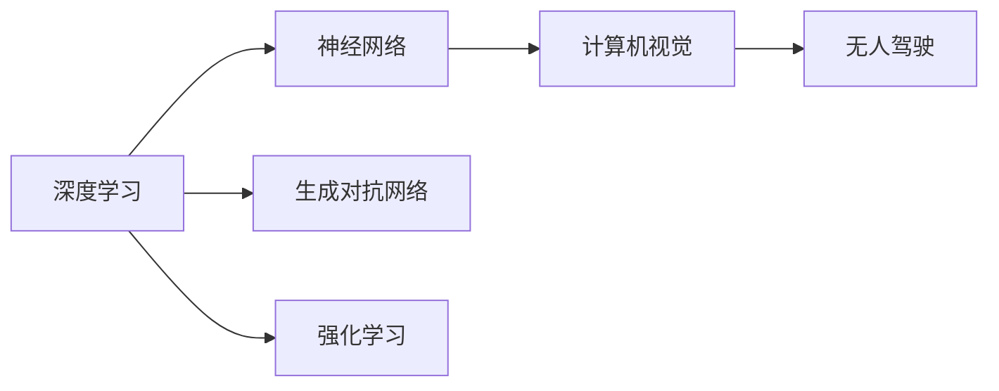

                 

## 1. 背景介绍

Andrej Karpathy，是当前人工智能领域的重要推动者之一。作为OpenAI的研究员，他不仅在深度学习领域做出了卓越贡献，还在无人驾驶、计算机视觉等诸多前沿技术中崭露头角。他的思考和见解往往前瞻性十足，引领着AI的发展方向。

本系列文章将通过对Andrej Karpathy观点的梳理，分析人工智能的未来发展前景。通过对其经典论文、讲座、博客文章等内容的深入解读，我们试图勾勒出AI技术的未来蓝图，以及它们可能对社会、经济、技术等多个领域带来的深刻影响。

## 2. 核心概念与联系

### 2.1 核心概念概述

本节将介绍Andrej Karpathy在人工智能领域的核心观点及其相关概念。

- **深度学习（Deep Learning）**：通过多层神经网络对数据进行建模，实现复杂模式的自动提取和预测。
- **神经网络（Neural Networks）**：由大量简单单元（神经元）组成，通过学习参数，完成数据处理和预测任务。
- **计算机视觉（Computer Vision）**：使用AI技术实现图像和视频数据的理解和分析。
- **无人驾驶（Autonomous Driving）**：结合感知、决策、控制等技术，实现车辆自主行驶。
- **生成对抗网络（Generative Adversarial Networks, GANs）**：由生成器和判别器组成的网络结构，用于生成逼真图像、音频等内容。
- **强化学习（Reinforcement Learning）**：通过智能体与环境的交互，学习最优决策策略。

### 2.2 核心概念原理和架构的 Mermaid 流程图



这个流程图展示了Andrej Karpathy所关注的核心概念之间的联系：

1. **深度学习**是所有AI技术的基石，包括神经网络和强化学习等。
2. **神经网络**是深度学习的基本单位，通过对数据的处理和预测，奠定了计算机视觉和无人驾驶等应用的基础。
3. **计算机视觉**通过神经网络实现图像和视频数据的理解和分析，是无人驾驶中的关键技术。
4. **无人驾驶**利用计算机视觉和强化学习技术，实现车辆的自主导航和决策。
5. **生成对抗网络**是深度学习的一个分支，用于生成逼真数据，支持图像、音频等领域的创新应用。

这些概念共同构成了Andrej Karpathy对人工智能未来发展的核心思考框架。

## 3. 核心算法原理 & 具体操作步骤

### 3.1 算法原理概述

Andrej Karpathy的AI研究往往围绕着深度学习的基本原理和实际应用展开。以下将重点介绍他在深度学习领域的关键观点。

- **多层感知机（MLP）**：多层感知机是深度学习的基本模型，通过多层的非线性变换，实现对复杂模式的提取和预测。
- **卷积神经网络（CNN）**：卷积神经网络在图像和视频处理中表现出色，通过卷积层、池化层等操作，实现特征的提取和降维。
- **递归神经网络（RNN）**：RNN通过时间序列的递归计算，适用于处理序列数据，如语音识别、自然语言处理等。
- **长短期记忆网络（LSTM）**：LSTM是RNN的一种变体，能够有效解决长期依赖问题，广泛应用于文本生成、时间序列预测等任务。
- **生成对抗网络（GANs）**：GANs由生成器和判别器组成，通过对抗训练，生成高质量的合成数据。

### 3.2 算法步骤详解

以下以生成对抗网络为例，详细讲解其算法步骤。

**Step 1: 定义生成器和判别器**

生成器 $G$ 接收随机噪声向量 $\mathbf{z}$，生成一张伪造的图像 $G(\mathbf{z})$。判别器 $D$ 接收真实图像 $x$ 和生成图像 $G(\mathbf{z})$，判别其真实性。

**Step 2: 训练过程**

1. 将真实图像 $x$ 输入判别器 $D$，获得判别结果 $D(x)$。
2. 将生成图像 $G(\mathbf{z})$ 输入判别器 $D$，获得判别结果 $D(G(\mathbf{z}))$。
3. 计算判别器损失函数 $L_D$，反向传播更新判别器参数。
4. 将生成图像 $G(\mathbf{z})$ 输入生成器 $G$，获得真实图像 $x'$。
5. 计算生成器损失函数 $L_G$，反向传播更新生成器参数。

**Step 3: 对抗训练**

将真实图像 $x$ 和生成图像 $G(\mathbf{z})$ 随机组合，交替更新生成器和判别器的参数，直至两者的性能达到最优平衡。

### 3.3 算法优缺点

生成对抗网络（GANs）具有以下优点：

- **高质量生成**：能够生成逼真的图像、视频等，应用于图像修复、图像增强等领域。
- **样本多样性**：生成大量样本，用于数据扩充和模型训练。

但GANs也存在一些缺点：

- **训练不稳定**：生成器和判别器之间的对抗训练过程容易陷入不稳定状态，导致训练失败。
- **模式崩溃**：生成图像的样式可能变得单一，失去多样性。
- **判别器泄漏**：生成器可能会“学习”到判别器的结构，导致生成效果下降。

### 3.4 算法应用领域

生成对抗网络（GANs）在多个领域得到了广泛应用：

- **图像生成**：用于生成逼真图像、艺术作品等，如DeepFakes、StyleGAN等。
- **数据增强**：生成合成数据用于模型训练，如GAN-based Image Augmentation。
- **视频生成**：用于生成高质量视频，如GAN-based Video Generation。
- **游戏AI**：用于生成游戏场景、角色等，提升游戏体验。

## 4. 数学模型和公式 & 详细讲解

### 4.1 数学模型构建

以下以生成对抗网络为例，详细讲解其数学模型构建过程。

**Step 1: 生成器模型**

生成器 $G$ 接收一个随机向量 $\mathbf{z}$，输出图像 $x$：

$$
x = G(\mathbf{z})
$$

其中，$\mathbf{z} \sim \mathcal{N}(0, 1)$。生成器 $G$ 通常包含多个卷积层、批量归一化层等操作。

**Step 2: 判别器模型**

判别器 $D$ 接收图像 $x$，输出一个真实性判别结果 $y$：

$$
y = D(x)
$$

判别器 $D$ 通常包含多个卷积层、全连接层等操作，输出为[0,1]之间的概率值，表示 $x$ 为真实图像的概率。

**Step 3: 损失函数**

生成器和判别器的损失函数分别定义如下：

- 生成器损失函数 $L_G$：

$$
L_G = \mathbb{E}_{\mathbf{z} \sim \mathcal{N}(0, 1)} [L_G(G(\mathbf{z}))]
$$

其中 $L_G$ 定义为：

$$
L_G = \mathbb{E}_{\mathbf{z} \sim \mathcal{N}(0, 1)} [\log D(G(\mathbf{z}))]
$$

- 判别器损失函数 $L_D$：

$$
L_D = \mathbb{E}_x [\log D(x)] + \mathbb{E}_z [\log (1-D(G(\mathbf{z})))]
$$

### 4.2 公式推导过程

生成器和判别器通过对抗训练交替优化，损失函数的推导过程如下：

1. 计算生成器损失 $L_G$：

$$
L_G = \mathbb{E}_{\mathbf{z} \sim \mathcal{N}(0, 1)} [-\log D(G(\mathbf{z}))]
$$

2. 计算判别器损失 $L_D$：

$$
L_D = \mathbb{E}_x [\log D(x)] + \mathbb{E}_z [-\log D(G(\mathbf{z}))]
$$

3. 通过交替优化，更新生成器和判别器的参数。

### 4.3 案例分析与讲解

以StyleGAN为例，分析生成对抗网络在图像生成中的应用。

StyleGAN将输入 $z$ 分解为内容编码 $w$ 和风格编码 $\lambda$，通过不同层级的卷积操作，生成具有不同风格的图片。通过对抗训练，生成器能够生成逼真的图像，判别器能够准确地判断图像的真实性。

## 5. 项目实践：代码实例和详细解释说明

### 5.1 开发环境搭建

Andrej Karpathy的研究主要使用TensorFlow和PyTorch等深度学习框架。以下是TensorFlow和PyTorch的搭建步骤：

- **TensorFlow**：安装TensorFlow，设置虚拟环境，安装TensorFlow和Keras，导入必要的库。
- **PyTorch**：安装PyTorch，设置虚拟环境，安装PyTorch和TorchVision，导入必要的库。

### 5.2 源代码详细实现

以下是使用TensorFlow实现生成对抗网络的代码示例：

```python
import tensorflow as tf
from tensorflow.keras import layers

# 定义生成器
def make_generator_model():
    model = tf.keras.Sequential()
    model.add(layers.Dense(7*7*256, use_bias=False, input_shape=(100,)))
    model.add(layers.BatchNormalization())
    model.add(layers.LeakyReLU())

    model.add(layers.Reshape((7, 7, 256)))
    assert model.output_shape == (None, 7, 7, 256)  # (batch, height, width, channels)

    model.add(layers.Conv2DTranspose(128, (5, 5), strides=(1, 1), padding='same', use_bias=False))
    assert model.output_shape == (None, 7, 7, 128)
    model.add(layers.BatchNormalization())
    model.add(layers.LeakyReLU())

    model.add(layers.Conv2DTranspose(64, (5, 5), strides=(2, 2), padding='same', use_bias=False))
    assert model.output_shape == (None, 14, 14, 64)
    model.add(layers.BatchNormalization())
    model.add(layers.LeakyReLU())

    model.add(layers.Conv2DTranspose(1, (5, 5), strides=(2, 2), padding='same', use_bias=False, activation='tanh'))
    assert model.output_shape == (None, 28, 28, 1)

    return model

# 定义判别器
def make_discriminator_model():
    model = tf.keras.Sequential()
    model.add(layers.Conv2D(64, (5, 5), strides=(2, 2), padding='same',
                           input_shape=[28, 28, 1]))
    model.add(layers.LeakyReLU())
    model.add(layers.Dropout(0.3))

    model.add(layers.Conv2D(128, (5, 5), strides=(2, 2), padding='same'))
    model.add(layers.LeakyReLU())
    model.add(layers.Dropout(0.3))

    model.add(layers.Flatten())
    model.add(layers.Dense(1))

    return model
```

### 5.3 代码解读与分析

这段代码使用了TensorFlow的Keras API，定义了生成器和判别器的模型结构。生成器包含多个卷积层、批量归一化层和激活函数，用于生成逼真图像。判别器包含多个卷积层、全连接层和激活函数，用于判别图像的真实性。

### 5.4 运行结果展示

以下是运行生成对抗网络的示例代码，展示生成图像的过程：

```python
import matplotlib.pyplot as plt
import numpy as np

# 随机生成噪声向量
z = np.random.normal(0, 1, (1, 100))

# 生成图像
x = make_generator_model()
x = x.predict(z)

# 展示生成图像
plt.imshow(x[0], cmap='gray')
plt.show()
```

此代码生成了一个随机噪声向量，并将其输入生成器模型，最终得到一张生成的图像。

## 6. 实际应用场景

### 6.1 图像生成

生成对抗网络在图像生成领域取得了巨大成功。通过训练，生成器能够生成高质量的逼真图像，应用于各种艺术创作、图像修复等场景。

**应用示例**：
- **DeepFakes**：使用生成对抗网络生成虚假视频，用于娱乐和研究。
- **StyleGAN**：用于生成具有特定风格的图像，如人脸、风景等。
- **GAN-based Image Augmentation**：生成合成图像用于数据扩充，提升模型泛化能力。

### 6.2 数据增强

生成对抗网络生成大量合成数据，用于数据增强和模型训练。

**应用示例**：
- **GAN-based Image Augmentation**：生成合成图像用于数据扩充，提升模型泛化能力。
- **GAN-based Audio Synthesis**：生成合成音频用于音乐创作和音频增强。

### 6.3 视频生成

生成对抗网络可以生成高质量的视频内容，应用于电影、动画等制作。

**应用示例**：
- **GAN-based Video Generation**：生成逼真视频，用于电影特效、动画制作等。

### 6.4 游戏AI

生成对抗网络可以用于生成游戏场景、角色等，提升游戏体验。

**应用示例**：
- **GAN-based Game Object Generation**：生成游戏中的物体，如敌人、建筑等。

## 7. 工具和资源推荐

### 7.1 学习资源推荐

Andrej Karpathy的研究论文、书籍和博客文章值得深入学习：

1. **《Deep Learning》**：他的经典教材，涵盖了深度学习的核心概念和算法。
2. **《Neural Networks and Deep Learning》**：他的在线课程，系统讲解了深度学习的理论和实践。
3. **《Deep Learning for Self-Driving Cars》**：详细介绍了深度学习在无人驾驶中的应用。
4. **《Artificial Intelligence for Humans》**：介绍AI技术在生活中的应用，通俗易懂。

### 7.2 开发工具推荐

以下工具是Andrej Karpathy常用的深度学习开发工具：

1. **TensorFlow**：用于实现生成对抗网络等深度学习模型。
2. **PyTorch**：用于实现神经网络、强化学习等深度学习模型。
3. **Keras**：高级API，用于快速实现深度学习模型。
4. **MXNet**：高效的深度学习框架，支持多种编程语言。

### 7.3 相关论文推荐

Andrej Karpathy的研究领域广泛，以下推荐几篇关键论文：

1. **Deep Residual Learning for Image Recognition**：提出残差网络，解决深度网络训练中的梯度消失问题。
2. **Learning to Drive**：介绍深度学习在无人驾驶中的应用。
3. **Autonomous Driving with Deep Neural Networks**：总结无人驾驶领域的技术进展。
4. **Generative Adversarial Nets**：介绍生成对抗网络的基本原理和应用。

## 8. 总结：未来发展趋势与挑战

### 8.1 研究成果总结

Andrej Karpathy在深度学习领域的研究成果丰硕，以下总结其核心贡献：

1. **深度学习**：提出残差网络、多尺度残差网络等深度学习模型，解决梯度消失问题。
2. **计算机视觉**：研究卷积神经网络、递归神经网络等技术，实现高质量图像和视频生成。
3. **无人驾驶**：开发深度学习模型，实现车辆自主驾驶和感知。
4. **生成对抗网络**：提出GANs等生成模型，生成逼真图像和视频。
5. **AI伦理**：提出AI伦理和安全问题，呼吁社会关注AI的道德和责任。

### 8.2 未来发展趋势

Andrej Karpathy对人工智能的未来发展趋势有以下几点展望：

1. **自动化**：深度学习模型的自动化程度将不断提高，无需人工干预即可完成复杂任务。
2. **智能化**：AI系统将具备更高的智能水平，能够理解人类语言和行为，实现更加自然的交互。
3. **广泛应用**：AI技术将广泛应用于各个领域，提升生产力，改善人类生活质量。
4. **伦理与道德**：随着AI技术的普及，伦理和安全问题将变得更加重要，需制定相应的规范和标准。

### 8.3 面临的挑战

Andrej Karpathy认为，AI技术的快速发展也面临诸多挑战：

1. **伦理和安全**：AI系统可能带来伦理和安全问题，如隐私侵犯、决策透明性不足等。
2. **数据依赖**：AI系统需要大量高质量数据进行训练，获取数据成本高，数据来源可能存在偏见。
3. **资源消耗**：大规模深度学习模型需要大量计算资源，训练和推理过程耗时耗电。
4. **公平性**：AI系统可能存在偏见，需采取措施确保公平性，避免歧视。

### 8.4 研究展望

Andrej Karpathy对未来AI研究有以下几点展望：

1. **深度学习**：开发更加高效和通用的深度学习算法，提升模型泛化能力。
2. **生成对抗网络**：研究更加稳定和高效的GANs模型，生成逼真高质量数据。
3. **计算机视觉**：提升计算机视觉系统的感知能力，实现更加精准的图像识别和处理。
4. **无人驾驶**：开发更加智能和安全的无人驾驶系统，实现全场景自动驾驶。
5. **AI伦理**：研究AI伦理和安全问题，制定相应的规范和标准，确保AI系统的公正性和透明性。

## 9. 附录：常见问题与解答

**Q1: 如何训练生成对抗网络？**

A: 训练生成对抗网络需要交替优化生成器和判别器的参数，一般通过交叉熵损失函数实现。在训练过程中，需要设置合适的学习率、批量大小和训练轮数。同时，为了防止过拟合，可以加入正则化技术，如Dropout、L2正则等。

**Q2: 生成对抗网络存在哪些问题？**

A: 生成对抗网络存在训练不稳定、模式崩溃、判别器泄漏等问题。为解决这些问题，可以采用改进的网络结构、优化训练策略等方法，如WGAN、WGAN-GP等。

**Q3: 生成对抗网络在图像生成中的应用有哪些？**

A: 生成对抗网络可以用于生成逼真图像、艺术作品等，应用于图像修复、图像增强等领域。

**Q4: 如何提升深度学习模型的泛化能力？**

A: 提升深度学习模型的泛化能力需要从数据、模型和训练等多个方面进行优化。例如，增加数据量、使用数据增强技术、调整网络结构、加入正则化技术等。

**Q5: 未来人工智能技术的主要方向有哪些？**

A: 未来人工智能技术的主要方向包括自动化、智能化、广泛应用、伦理与道德等。随着AI技术的普及，这些方向将继续得到重视和发展。

---

作者：禅与计算机程序设计艺术 / Zen and the Art of Computer Programming

