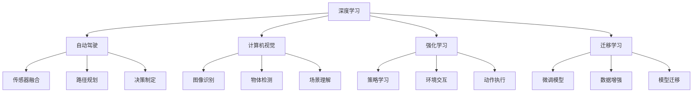

                 

# Andrej Karpathy：人工智能的未来发展前景

在人工智能领域，安德烈·卡帕西（Andrej Karpathy）是当之无愧的佼佼者。他是计算机视觉领域的前沿专家，斯坦福大学计算机科学教授，特斯拉公司自动驾驶技术主管。他的研究跨越深度学习、自动驾驶、计算机视觉等多个领域，展现了深邃的洞察力和卓越的技术能力。本文将深入探讨安德烈·卡帕西对人工智能未来的发展前景的见解，及其对人工智能技术未来发展的思考和展望。

## 1. 背景介绍

### 1.1 问题由来

在过去的几十年里，人工智能技术取得了翻天覆地的变化。从深度学习到自然语言处理，再到计算机视觉和强化学习，AI技术的应用领域不断扩大，解决问题的方式也变得更为智能和高效。然而，伴随着技术的发展，也出现了一些新的问题和挑战，如数据隐私、算法可解释性、伦理道德等。这些问题亟需学术界和工业界的共同努力，找到新的解决方案。

安德烈·卡帕西作为深度学习领域的领军人物，对AI未来的发展前景有着深刻的见解。他不仅在研究前沿技术，也在思考如何应用AI解决现实世界的问题，如自动驾驶、机器人技术等。他的研究跨越多个领域，展现了对AI未来发展的广泛视野和深入思考。

### 1.2 问题核心关键点

安德烈·卡帕西对人工智能未来发展前景的思考，主要围绕以下几个核心关键点：

- **数据驱动与算法创新**：AI的未来发展依赖于大量的高质量数据和不断创新的算法模型。
- **跨领域应用**：AI技术将在多个领域得到应用，如医疗、金融、自动驾驶等。
- **伦理与道德**：AI技术在提升效率的同时，也需关注其伦理道德问题，确保技术应用的安全性和公正性。
- **人机协作**：AI技术的发展将导致人机协作关系的变化，需平衡技术与人类的关系。
- **未来展望**：AI技术的未来将走向更广泛的应用场景，解决更多现实世界的问题。

这些核心关键点构成了安德烈·卡帕西对AI未来发展的全面思考，为我们提供了宝贵的参考。

## 2. 核心概念与联系

### 2.1 核心概念概述

安德烈·卡帕西的研究涉及多个核心概念，包括深度学习、自动驾驶、计算机视觉等。下面将对这些核心概念进行详细说明。

- **深度学习（Deep Learning）**：一种模拟人脑神经网络结构的机器学习方法，通过多层神经网络实现对复杂数据的建模和处理。

- **自动驾驶（Autonomous Driving）**：利用AI技术，让车辆实现自主导航和驾驶。自动驾驶技术涉及计算机视觉、深度学习、传感器融合等多个领域。

- **计算机视觉（Computer Vision）**：使计算机具有人眼般的视觉感知能力，能够从图像和视频中提取信息、识别物体和场景。

- **强化学习（Reinforcement Learning）**：一种通过试错学习的方法，通过与环境交互，最大化长期奖励的机器学习方法。

- **迁移学习（Transfer Learning）**：利用已有知识，在新任务上进行微调，从而提升模型在新任务上的表现。

这些核心概念通过深度学习等技术手段相联系，共同构成了人工智能技术的核心框架。

### 2.2 核心概念原理和架构的 Mermaid 流程图



这个流程图展示了深度学习等核心概念如何通过技术手段实现自动驾驶、计算机视觉、强化学习、迁移学习等应用。深度学习提供了计算能力，计算机视觉提供了视觉感知，强化学习提供了决策制定，迁移学习提供了知识迁移。这些技术手段通过不断优化和融合，推动了AI技术的快速发展。

## 3. 核心算法原理 & 具体操作步骤

### 3.1 算法原理概述

安德烈·卡帕西的研究集中在深度学习、自动驾驶等领域。本文将以深度学习为核心，详细探讨其算法原理和具体操作步骤。

深度学习算法通过多层神经网络实现对数据的复杂建模和处理。其核心在于通过反向传播算法，不断调整网络参数，最小化损失函数，从而提高模型的准确性。

深度学习模型的训练过程通常包括以下步骤：

1. **数据准备**：收集和预处理训练数据。
2. **模型定义**：定义神经网络模型结构，包括输入、隐藏层、输出等。
3. **损失函数**：定义损失函数，用于衡量模型预测与真实标签之间的差异。
4. **优化器选择**：选择优化算法，如SGD、Adam等，优化模型参数。
5. **训练过程**：通过前向传播和反向传播，不断调整模型参数，最小化损失函数。
6. **评估与测试**：使用测试集评估模型性能，确保模型泛化能力。

### 3.2 算法步骤详解

以计算机视觉领域的图像分类任务为例，深度学习算法的具体操作步骤如下：

1. **数据准备**：收集并预处理图像数据集，确保数据质量。
2. **模型定义**：定义卷积神经网络（CNN）结构，包括卷积层、池化层、全连接层等。
3. **损失函数**：选择交叉熵损失函数，用于衡量模型预测与真实标签之间的差异。
4. **优化器选择**：选择Adam优化器，优化模型参数。
5. **训练过程**：通过前向传播计算损失函数，反向传播计算参数梯度，优化模型参数。
6. **评估与测试**：使用测试集评估模型性能，确保模型泛化能力。

### 3.3 算法优缺点

深度学习的优点包括：

- **处理复杂数据**：深度学习模型能够处理高维数据，如图像、视频等。
- **自动特征提取**：通过多层神经网络，自动提取数据中的特征。
- **泛化能力强**：通过大量的训练数据，深度学习模型具有较强的泛化能力。

深度学习的缺点包括：

- **计算量大**：深度学习模型参数较多，计算量较大。
- **过拟合风险**：深度学习模型容易过拟合，特别是在数据量不足的情况下。
- **模型复杂**：深度学习模型结构复杂，难以理解和调试。

### 3.4 算法应用领域

深度学习在多个领域得到了广泛应用，如计算机视觉、自然语言处理、自动驾驶等。

- **计算机视觉**：图像分类、物体检测、图像分割等。
- **自然语言处理**：机器翻译、文本分类、语音识别等。
- **自动驾驶**：目标检测、路径规划、决策制定等。
- **医疗健康**：图像诊断、疾病预测等。
- **金融科技**：风险评估、市场预测等。

这些应用领域展示了深度学习技术在不同场景下的强大能力，推动了多个行业的数字化转型。

## 4. 数学模型和公式 & 详细讲解 & 举例说明

### 4.1 数学模型构建

深度学习模型的数学模型通常包括输入、隐藏层、输出等。以卷积神经网络（CNN）为例，其基本结构如下：

- **输入层**：输入数据，如图像、文本等。
- **卷积层**：提取图像特征，通过卷积运算实现。
- **池化层**：降低数据维度，减少计算量。
- **全连接层**：将特征映射到输出层，进行分类或回归。
- **输出层**：输出预测结果，如分类标签等。

### 4.2 公式推导过程

以图像分类任务为例，假设输入图像为 $x \in \mathbb{R}^{d_x}$，输出标签为 $y \in \{0,1\}$。

设卷积神经网络包含 $n$ 层，每层有 $h_n$ 个神经元。则模型的预测结果可以通过多层前向传播得到：

$$
z_1 = \sigma_1(W_1 x + b_1)
$$
$$
z_2 = \sigma_2(W_2 z_1 + b_2)
$$
$$
...
$$
$$
z_n = \sigma_n(W_n z_{n-1} + b_n)
$$
$$
\hat{y} = \sigma(z_n)
$$

其中 $W$ 和 $b$ 分别为权重和偏置，$\sigma$ 为激活函数，如ReLU等。

### 4.3 案例分析与讲解

以图像分类任务为例，深度学习模型通常通过反向传播算法，不断调整网络参数，最小化损失函数。以交叉熵损失函数为例，其定义如下：

$$
L(y, \hat{y}) = - \frac{1}{N} \sum_{i=1}^{N} y_i \log \hat{y_i}
$$

其中 $y$ 为真实标签，$\hat{y}$ 为模型预测结果。

以训练集为 $D=\{(x_i, y_i)\}_{i=1}^N$ 为例，训练过程可以表示为：

$$
L = \frac{1}{N} \sum_{i=1}^{N} L(y_i, \hat{y_i})
$$

通过反向传播算法，计算每个参数的梯度，更新参数：

$$
\frac{\partial L}{\partial W_i} = \frac{\partial L}{\partial z_i} \frac{\partial z_i}{\partial W_i}
$$

使用优化器如Adam，逐步更新模型参数，直到损失函数收敛。

## 5. 项目实践：代码实例和详细解释说明

### 5.1 开发环境搭建

为了进行深度学习项目开发，需要搭建相应的开发环境。以下是使用Python进行PyTorch开发的环境配置流程：

1. 安装Anaconda：从官网下载并安装Anaconda，用于创建独立的Python环境。
2. 创建并激活虚拟环境：
```bash
conda create -n pytorch-env python=3.8 
conda activate pytorch-env
```
3. 安装PyTorch：根据CUDA版本，从官网获取对应的安装命令。例如：
```bash
conda install pytorch torchvision torchaudio cudatoolkit=11.1 -c pytorch -c conda-forge
```
4. 安装各类工具包：
```bash
pip install numpy pandas scikit-learn matplotlib tqdm jupyter notebook ipython
```

完成上述步骤后，即可在`pytorch-env`环境中开始深度学习项目开发。

### 5.2 源代码详细实现

以下是使用PyTorch进行图像分类任务的代码实现。

首先，定义数据处理函数：

```python
import torch
import torch.nn as nn
import torch.optim as optim
from torchvision import datasets, transforms

transform = transforms.Compose([
    transforms.ToTensor(),
    transforms.Normalize((0.5, 0.5, 0.5), (0.5, 0.5, 0.5))
])

train_dataset = datasets.CIFAR10(root='./data', train=True, download=True, transform=transform)
test_dataset = datasets.CIFAR10(root='./data', train=False, download=True, transform=transform)

train_loader = torch.utils.data.DataLoader(train_dataset, batch_size=64, shuffle=True)
test_loader = torch.utils.data.DataLoader(test_dataset, batch_size=64, shuffle=False)
```

然后，定义模型和优化器：

```python
class Net(nn.Module):
    def __init__(self):
        super(Net, self).__init__()
        self.conv1 = nn.Conv2d(3, 6, 5)
        self.pool = nn.MaxPool2d(2, 2)
        self.conv2 = nn.Conv2d(6, 16, 5)
        self.fc1 = nn.Linear(16 * 5 * 5, 120)
        self.fc2 = nn.Linear(120, 84)
        self.fc3 = nn.Linear(84, 10)

    def forward(self, x):
        x = self.pool(torch.relu(self.conv1(x)))
        x = self.pool(torch.relu(self.conv2(x)))
        x = x.view(-1, 16 * 5 * 5)
        x = torch.relu(self.fc1(x))
        x = torch.relu(self.fc2(x))
        x = self.fc3(x)
        return x

net = Net()
criterion = nn.CrossEntropyLoss()
optimizer = optim.Adam(net.parameters(), lr=0.001)
```

接着，定义训练和评估函数：

```python
def train(net, train_loader, optimizer, criterion, n_epochs=10):
    net.train()
    for epoch in range(n_epochs):
        running_loss = 0.0
        for i, data in enumerate(train_loader, 0):
            inputs, labels = data
            optimizer.zero_grad()
            outputs = net(inputs)
            loss = criterion(outputs, labels)
            loss.backward()
            optimizer.step()

            running_loss += loss.item()
            if i % 2000 == 1999:
                print('[%d, %5d] loss: %.3f' % (epoch + 1, i + 1, running_loss / 2000))
                running_loss = 0.0

def test(net, test_loader, criterion):
    net.eval()
    correct = 0
    total = 0
    with torch.no_grad():
        for data in test_loader:
            images, labels = data
            outputs = net(images)
            _, predicted = torch.max(outputs.data, 1)
            total += labels.size(0)
            correct += (predicted == labels).sum().item()

    print('Accuracy of the network on the 10000 test images: %d %%' % (100 * correct / total))
```

最后，启动训练流程并在测试集上评估：

```python
train(net, train_loader, optimizer, criterion)
test(net, test_loader, criterion)
```

以上就是使用PyTorch进行图像分类任务的完整代码实现。可以看到，得益于PyTorch的强大封装，我们可以用相对简洁的代码完成深度学习模型的加载和训练。

### 5.3 代码解读与分析

让我们再详细解读一下关键代码的实现细节：

**Net类**：
- `__init__`方法：初始化网络结构，包括卷积层、池化层、全连接层等。
- `forward`方法：定义前向传播过程，实现数据流传递。

**数据处理**：
- `transforms.Compose`方法：组合多个数据处理步骤，如转置、归一化等。
- `torch.utils.data.DataLoader`方法：将数据集划分为批次，进行逐批加载。

**模型和优化器**：
- `nn.Conv2d`和`nn.MaxPool2d`方法：定义卷积层和池化层。
- `nn.Linear`方法：定义全连接层。
- `nn.CrossEntropyLoss`方法：定义交叉熵损失函数。
- `optim.Adam`方法：定义Adam优化器。

**训练函数**：
- `train`函数：定义训练过程，包括前向传播、反向传播和参数更新。
- `optimizer.zero_grad()`方法：清零梯度。

**测试函数**：
- `test`函数：定义测试过程，计算准确率。
- `torch.no_grad()`方法：关闭梯度计算，提高测试速度。

可以看到，PyTorch提供了丰富的API和工具，可以极大地简化深度学习模型的开发过程。开发者可以将更多精力放在模型改进、数据处理等高层逻辑上，而不必过多关注底层的实现细节。

## 6. 实际应用场景

### 6.1 智能客服系统

基于深度学习技术，智能客服系统可以实现自动回答用户咨询，提升客户体验。在实际应用中，智能客服系统通常包含以下步骤：

1. **数据收集与预处理**：收集用户咨询数据，并进行预处理，去除噪声和无关信息。
2. **模型训练**：使用深度学习模型对咨询数据进行训练，学习文本与回答之间的映射关系。
3. **模型部署**：将训练好的模型部署到服务器上，进行实时预测。
4. **效果评估**：对系统效果进行评估，优化模型参数。

### 6.2 金融舆情监测

在金融领域，深度学习技术可以用于舆情监测，及时发现负面新闻和风险信息。具体应用流程如下：

1. **数据收集**：收集金融领域的新闻、评论等文本数据。
2. **模型训练**：使用深度学习模型对文本数据进行训练，学习情感分类和主题分类任务。
3. **实时监测**：将训练好的模型应用到实时抓取的网络文本数据，进行情感分析和主题分类。
4. **风险预警**：根据监测结果，生成风险预警，辅助金融机构进行决策。

### 6.3 个性化推荐系统

在电商领域，深度学习技术可以用于个性化推荐系统，提升用户购物体验。具体应用流程如下：

1. **数据收集**：收集用户浏览、购买等行为数据。
2. **模型训练**：使用深度学习模型对用户行为数据进行训练，学习用户兴趣和商品特征。
3. **推荐生成**：将训练好的模型应用到用户实时行为数据中，生成个性化推荐。
4. **效果评估**：对推荐效果进行评估，优化模型参数。

## 7. 工具和资源推荐

### 7.1 学习资源推荐

为了帮助开发者系统掌握深度学习理论基础和实践技巧，这里推荐一些优质的学习资源：

1. **《深度学习》教材**：由Ian Goodfellow等人合著的深度学习经典教材，详细介绍了深度学习的基本概念和算法。
2. **DeepLearning.ai课程**：由Andrew Ng教授主讲，涵盖了深度学习的基础知识和应用。
3. **PyTorch官方文档**：提供了PyTorch的详细介绍和使用示例，是深度学习开发的重要参考。
4. **GitHub深度学习项目**：汇集了各类深度学习项目，包括图像识别、自然语言处理等，方便开发者学习实践。
5. **Kaggle竞赛**：提供了各类数据科学竞赛，有助于开发者提高实战能力。

### 7.2 开发工具推荐

深度学习开发依赖于各种工具和框架，以下是几款常用的工具：

1. **PyTorch**：基于Python的开源深度学习框架，灵活动态的计算图，适合快速迭代研究。
2. **TensorFlow**：由Google主导开发的开源深度学习框架，生产部署方便，适合大规模工程应用。
3. **TensorBoard**：TensorFlow配套的可视化工具，可实时监测模型训练状态，并提供丰富的图表呈现方式。
4. **Weights & Biases**：模型训练的实验跟踪工具，可以记录和可视化模型训练过程中的各项指标，方便对比和调优。
5. **Jupyter Notebook**：轻量级的交互式编程环境，适合深度学习研究和开发。

### 7.3 相关论文推荐

深度学习在多个领域得到了广泛应用，以下是几篇具有代表性的论文，推荐阅读：

1. **《ImageNet Classification with Deep Convolutional Neural Networks》**：Hinton等人提出卷积神经网络，广泛应用于图像分类任务。
2. **《Attention is All You Need》**：Vaswani等人提出Transformer模型，广泛应用于自然语言处理任务。
3. **《Deep Residual Learning for Image Recognition》**：He等人提出残差网络，极大地提高了深度学习模型的训练效率和准确率。
4. **《Semi-Supervised Learning with Deep Generative Models》**：Bengio等人提出生成对抗网络（GAN），广泛应用于图像生成和增强。
5. **《Learning Transferable Image Models from Noisy Labels》**：Chen等人提出自监督学习，利用噪声数据训练深度学习模型。

这些论文代表了大数据技术的发展脉络，推动了深度学习技术的不断进步。

## 8. 总结：未来发展趋势与挑战

### 8.1 研究成果总结

深度学习技术在多个领域取得了显著进展，推动了人工智能技术的快速发展。当前，深度学习技术广泛应用于计算机视觉、自然语言处理、自动驾驶等领域，推动了多个行业的数字化转型。

### 8.2 未来发展趋势

未来，深度学习技术将呈现以下几个发展趋势：

1. **更大规模模型**：随着算力成本的下降和数据规模的扩张，深度学习模型将不断增大，推动更大规模任务的实现。
2. **自监督学习**：利用无标注数据进行预训练，降低深度学习模型对标注数据的依赖。
3. **迁移学习**：利用已有知识，在新任务上进行微调，提升模型在新任务上的表现。
4. **多模态学习**：结合视觉、听觉、语言等多模态信息，实现更加全面、准确的信息建模。
5. **可解释性**：开发可解释性更强的深度学习模型，提高模型透明度和可靠性。
6. **跨领域应用**：深度学习技术将在更多领域得到应用，推动多个行业的数字化转型。

### 8.3 面临的挑战

尽管深度学习技术取得了巨大进展，但在迈向更加智能化、普适化应用的过程中，仍面临诸多挑战：

1. **计算资源瓶颈**：深度学习模型参数较多，对算力、内存、存储等资源要求较高。
2. **过拟合问题**：深度学习模型容易过拟合，特别是在数据量不足的情况下。
3. **数据隐私问题**：深度学习模型依赖大量数据，数据隐私保护成为重要问题。
4. **算法可解释性**：深度学习模型的决策过程缺乏可解释性，难以理解其内部工作机制。
5. **伦理道德问题**：深度学习技术的应用可能引发伦理道德问题，需加强监管和规范。

### 8.4 研究展望

未来，深度学习技术需要在多个方向进行深入研究：

1. **多模态融合**：结合视觉、听觉、语言等多种模态信息，实现更全面、准确的信息建模。
2. **可解释性**：开发可解释性更强的深度学习模型，提高模型透明度和可靠性。
3. **跨领域应用**：深度学习技术将在更多领域得到应用，推动多个行业的数字化转型。
4. **自监督学习**：利用无标注数据进行预训练，降低深度学习模型对标注数据的依赖。
5. **伦理道德**：加强深度学习技术的伦理道德研究，确保技术应用的安全性和公正性。

总之，深度学习技术将在未来取得更大进展，推动人工智能技术的广泛应用，解决更多现实世界的问题。

## 9. 附录：常见问题与解答

**Q1：深度学习技术在各个领域的应用前景如何？**

A: 深度学习技术在多个领域得到了广泛应用，如计算机视觉、自然语言处理、自动驾驶等。未来，深度学习技术将在更多领域得到应用，推动多个行业的数字化转型。

**Q2：深度学习技术在实际应用中面临哪些挑战？**

A: 深度学习技术在实际应用中面临诸多挑战，如计算资源瓶颈、过拟合问题、数据隐私问题、算法可解释性等。未来需要在多方向进行深入研究，提高深度学习技术的实用性和可靠性。

**Q3：如何提高深度学习模型的可解释性？**

A: 提高深度学习模型的可解释性可以从多个方面入手，如使用可解释性模型、开发可解释性算法、增强数据标注等。

**Q4：深度学习技术的发展趋势是什么？**

A: 未来深度学习技术的发展趋势包括更大规模模型、自监督学习、迁移学习、多模态学习、可解释性等。这些趋势将推动深度学习技术的不断进步，推动人工智能技术的广泛应用。

总之，安德烈·卡帕西的研究为我们提供了宝贵的见解，有助于我们更好地理解深度学习技术的未来发展方向和挑战。通过深入研究和学习，相信深度学习技术将在未来取得更大的进展，推动人工智能技术在更多领域得到应用，解决更多现实世界的问题。

---

作者：禅与计算机程序设计艺术 / Zen and the Art of Computer Programming

