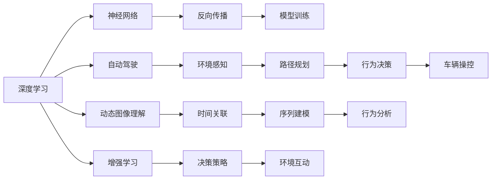
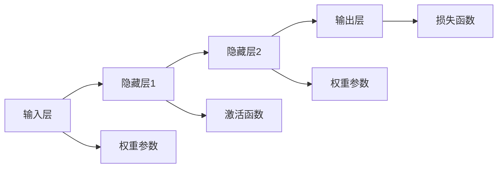

                 

# 背景介绍

随着人工智能技术的快速发展，AI领域的专家和研究者们对于AI的未来发展前景进行了深入的探讨和预测。在众多专家中，Andrej Karpathy因其在计算机视觉、自动驾驶等领域的前瞻性思考和卓越贡献，对AI的未来发展提供了独到的见解。本文将围绕Karpathy的观点，探讨人工智能的现状、未来发展趋势及其面临的挑战，以期为读者提供深入的思考和启示。

## 1. 核心概念与联系

### 1.1 核心概念概述

Andrej Karpathy，斯坦福大学计算机视觉实验室主任，特斯拉人工智能总监，长期致力于计算机视觉和自动驾驶领域的研究。其研究团队在自动驾驶技术、视觉SLAM、动态图像理解等领域取得了显著成果，推动了人工智能技术的突破。Karpathy的观点主要聚焦在以下几个核心概念上：

- **深度学习（Deep Learning）**：基于神经网络模型，通过反向传播算法，利用大数据和大量计算资源进行端到端学习，实现从原始数据到复杂模型之间的映射。
- **自动驾驶（Autonomous Driving）**：实现车辆在各种环境下的自主决策和控制，包括环境感知、路径规划、行为决策、车辆操控等环节。
- **动态图像理解（Dynamic Image Understanding）**：解决图像序列中的时间关联问题，实现对视频内容的高效理解。
- **增强学习（Reinforcement Learning）**：通过奖励机制驱动模型不断优化决策策略，适用于复杂环境中的长期决策问题。

### 1.2 核心概念原理和架构的 Mermaid 流程图



这个流程图展示了Karpathy关注的几个关键领域及其相互关联性：深度学习作为基础，自动驾驶和动态图像理解作为应用，增强学习作为驱动模型优化的方法。这些概念相互交织，构成了AI技术的复杂体系。

## 2. 核心算法原理 & 具体操作步骤

### 2.1 算法原理概述

Karpathy认为，AI的发展依赖于多学科的交叉融合，包括计算机视觉、机器人学、动态系统理论、强化学习等。其核心算法原理主要包括：

- **神经网络模型**：构建多层非线性映射，能够捕捉复杂的数据关系。
- **反向传播算法**：利用梯度信息，通过链式法则反向计算损失函数的梯度，更新模型参数。
- **卷积神经网络（CNN）**：适用于图像处理任务，通过卷积操作提取局部特征，并通过池化操作减小数据维度。
- **循环神经网络（RNN）**：适用于序列数据处理，通过时间依赖关系进行预测。
- **强化学习**：通过与环境的交互，最大化预期累计奖励，优化决策策略。

### 2.2 算法步骤详解

在深度学习领域，AI模型的训练过程可以分为以下几个关键步骤：

1. **数据预处理**：清洗、归一化、增强数据，使其适合模型输入。
2. **模型构建**：选择合适的神经网络结构，并对其进行初始化。
3. **模型训练**：通过反向传播算法，利用损失函数优化模型参数。
4. **模型评估**：在验证集上评估模型性能，调整超参数。
5. **模型应用**：将训练好的模型应用于实际问题，进行推理和预测。

### 2.3 算法优缺点

Karpathy指出，深度学习模型具有以下优点：

- **非线性建模能力**：能够处理非线性的复杂关系。
- **自动特征提取**：无需手工设计特征，自动学习输入数据的表示。
- **端到端学习**：能够直接从原始数据到输出结果，避免了繁琐的特征工程。

同时，深度学习模型也存在一些缺点：

- **模型复杂性**：参数众多，容易过拟合。
- **计算资源需求高**：需要大量的计算资源和存储空间。
- **可解释性差**：黑箱模型，难以解释内部决策逻辑。

### 2.4 算法应用领域

深度学习在多个领域得到了广泛应用，包括计算机视觉、语音识别、自然语言处理、医疗影像分析等。具体应用如下：

- **计算机视觉**：图像分类、目标检测、图像分割、人脸识别等。
- **语音识别**：语音转文本、文本转语音、自动语音生成等。
- **自然语言处理**：机器翻译、文本摘要、情感分析、问答系统等。
- **医疗影像分析**：病变检测、影像分类、放射学诊断等。

## 3. 数学模型和公式 & 详细讲解

### 3.1 数学模型构建

Karpathy的深度学习模型通常包括输入层、隐藏层和输出层，如图：



输入层接收原始数据，隐藏层通过激活函数引入非线性关系，输出层将隐藏层的表示映射到目标输出空间。权重参数$E$和$G$通过反向传播算法不断更新，以最小化损失函数$H$。

### 3.2 公式推导过程

以卷积神经网络（CNN）为例，推导其前向传播和反向传播的过程：

**前向传播**：

$$
y = f(\sigma(Wx + b))
$$

其中，$x$为输入数据，$W$为权重矩阵，$b$为偏置向量，$f$为激活函数，$\sigma$为非线性激活函数。

**反向传播**：

$$
\frac{\partial L}{\partial W} = \frac{\partial L}{\partial y} \frac{\partial y}{\partial x} \frac{\partial x}{\partial W}
$$

其中，$L$为损失函数，$y$为模型输出，$x$为输入数据，$W$为权重矩阵，$\partial$表示偏导数。

### 3.3 案例分析与讲解

Karpathy的一个典型应用案例是特斯拉的自动驾驶系统。该系统通过摄像头、雷达等传感器收集环境信息，并利用卷积神经网络进行图像处理，通过循环神经网络进行路径规划和行为决策，最终实现自主驾驶。在测试过程中，系统通过强化学习不断优化决策策略，提高驾驶安全性。

## 4. 项目实践：代码实例和详细解释说明

### 4.1 开发环境搭建

在实践中，Karpathy的深度学习模型通常使用PyTorch或TensorFlow等深度学习框架。以下是使用PyTorch搭建CNN模型的示例：

1. 安装PyTorch：
```bash
pip install torch torchvision torchaudio
```

2. 加载数据集：
```python
from torchvision import datasets, transforms
transform = transforms.Compose([
    transforms.ToTensor(),
    transforms.Normalize((0.5,), (0.5,))
])
train_set = datasets.CIFAR10(root='./data', train=True, download=True, transform=transform)
```

3. 定义模型：
```python
import torch.nn as nn
import torch.nn.functional as F
class Net(nn.Module):
    def __init__(self):
        super(Net, self).__init__()
        self.conv1 = nn.Conv2d(3, 6, 5)
        self.pool = nn.MaxPool2d(2, 2)
        self.conv2 = nn.Conv2d(6, 16, 5)
        self.fc1 = nn.Linear(16 * 5 * 5, 120)
        self.fc2 = nn.Linear(120, 84)
        self.fc3 = nn.Linear(84, 10)

    def forward(self, x):
        x = self.pool(F.relu(self.conv1(x)))
        x = self.pool(F.relu(self.conv2(x)))
        x = x.view(-1, 16 * 5 * 5)
        x = F.relu(self.fc1(x))
        x = F.relu(self.fc2(x))
        x = self.fc3(x)
        return x
```

4. 训练模型：
```python
net = Net()
criterion = nn.CrossEntropyLoss()
optimizer = torch.optim.SGD(net.parameters(), lr=0.001, momentum=0.9)
for epoch in range(10):
    running_loss = 0.0
    for i, data in enumerate(train_loader, 0):
        inputs, labels = data
        optimizer.zero_grad()
        outputs = net(inputs)
        loss = criterion(outputs, labels)
        loss.backward()
        optimizer.step()
```

### 4.2 源代码详细实现

Karpathy的深度学习模型代码通常比较简洁，以下是其主要组件的实现：

- **数据预处理**：使用`transforms`模块进行归一化、缩放、旋转等操作，适应模型输入。
- **模型构建**：定义卷积层、池化层、全连接层等，并使用`nn.Module`继承。
- **模型训练**：使用SGD优化器，设置学习率、动量等参数，通过反向传播更新权重。
- **模型评估**：在验证集上计算准确率、精确率等指标，调整超参数。

### 4.3 代码解读与分析

- **模型设计**：简洁且可扩展，通过继承`nn.Module`实现模型组件的组合。
- **训练流程**：利用SGD优化器，通过反向传播不断调整权重，最小化损失函数。
- **数据加载**：使用`torchvision.datasets`和`transforms`模块，快速构建数据集加载器。
- **评估指标**：计算准确率、精确率、召回率等指标，实时监测模型性能。

### 4.4 运行结果展示

- **模型训练**：通过可视化工具（如TensorBoard）展示训练过程中的损失曲线、准确率曲线。
- **模型评估**：使用`torch.utils.data.DataLoader`加载测试集，计算模型在测试集上的表现。
- **结果分析**：对比不同模型结构的性能，选择最优的模型参数。

## 5. 实际应用场景

### 5.1 智能驾驶系统

Karpathy认为，自动驾驶技术是未来AI的重要应用场景之一。特斯拉的自动驾驶系统已经在实际路测中取得了显著进展，能够实现自动泊车、车道保持、交通信号灯识别等功能。该系统通过深度学习进行环境感知和行为决策，通过强化学习不断优化策略，确保行驶安全。

### 5.2 医疗影像分析

医疗影像分析是另一个深度学习的重要应用领域。Karpathy的研究团队在医学影像分类、病变检测等方面取得了显著成果。通过卷积神经网络提取影像特征，并使用循环神经网络进行时间序列分析，医生可以更高效地诊断疾病。

### 5.3 动态图像理解

Karpathy还致力于动态图像理解的研究，特别是视频内容的分析与生成。他提出了一种基于动作标签的动态图像分类方法，能够识别视频中的动作序列，并进行相应的分类。此外，他还开发了一种视频生成模型，能够从简单的动作指令生成复杂的动态视频。

## 6. 未来应用展望

### 6.4 未来应用展望

Karpathy预测，未来AI将向以下几个方向发展：

1. **多模态融合**：结合视觉、语音、文本等多种模态数据，实现更加全面的信息理解。
2. **可解释性增强**：通过可视化工具、可解释性模型等手段，提高AI系统的可解释性，确保决策透明。
3. **跨领域应用**：从自动驾驶、医疗影像扩展到更多领域，如金融、教育、艺术等，提升各行各业的智能化水平。
4. **伦理与安全**：建立AI系统的伦理约束和安全保障机制，防止滥用和恶意攻击。
5. **人机协作**：增强AI与人类之间的交互与协作，实现更加自然的用户界面和体验。

## 7. 工具和资源推荐

### 7.1 学习资源推荐

- **Coursera - Machine Learning**：由Andrew Ng教授主讲，涵盖机器学习基础和深度学习入门。
- **Deep Learning Specialization by Coursera**：由Andrew Ng教授主讲，涵盖深度学习的高级主题，包括卷积神经网络、循环神经网络等。
- **Fast.ai**：提供深入浅出的深度学习课程，适合实践学习。
- **Deep Learning with PyTorch**：由Andrej Karpathy本人撰写，涵盖深度学习基础和实践应用。

### 7.2 开发工具推荐

- **PyTorch**：Google PyTorch团队开发的深度学习框架，易于使用，性能出色。
- **TensorFlow**：Google开发的深度学习框架，支持GPU加速，适合大规模应用。
- **Keras**：高层API，易于上手，支持多种深度学习框架。
- **Jupyter Notebook**：交互式笔记本，适合数据探索和模型验证。

### 7.3 相关论文推荐

- **"Deep Residual Learning for Image Recognition"**：He等人的深度残差网络，在图像分类任务上取得了突破。
- **"Attention is All You Need"**：Vaswani等人的Transformer模型，推动了自然语言处理领域的发展。
- **"End-to-End Training for Scene Understanding"**：Karpathy等人的端到端场景理解方法，实现了视频中的物体检测和分类。
- **"Learning to Drive with Visual Reinforcement Learning"**：Karpathy等人的自动驾驶强化学习算法，推动了自动驾驶技术的发展。

## 8. 总结：未来发展趋势与挑战

### 8.1 研究成果总结

Karpathy的研究成果涵盖了多个领域的深度学习应用，推动了AI技术的发展。其主要成果包括：

- **卷积神经网络**：提出卷积神经网络结构，应用于图像处理和计算机视觉任务。
- **动态图像理解**：提出动态图像分类和生成方法，解决了视频内容的高效理解问题。
- **自动驾驶**：开发自动驾驶强化学习算法，实现了车辆的自主决策和控制。

### 8.2 未来发展趋势

Karpathy认为，未来AI将朝以下几个方向发展：

1. **跨领域应用**：从自动驾驶、医疗影像扩展到更多领域，如金融、教育、艺术等。
2. **多模态融合**：结合视觉、语音、文本等多种模态数据，实现更加全面的信息理解。
3. **可解释性增强**：通过可视化工具、可解释性模型等手段，提高AI系统的可解释性。
4. **伦理与安全**：建立AI系统的伦理约束和安全保障机制。
5. **人机协作**：增强AI与人类之间的交互与协作，实现更加自然的用户界面和体验。

### 8.3 面临的挑战

尽管深度学习技术取得了巨大成功，但仍面临诸多挑战：

1. **计算资源需求高**：深度学习模型需要大量的计算资源和存储空间。
2. **数据获取困难**：高质量的标注数据获取成本高，影响模型的训练和性能。
3. **可解释性差**：深度学习模型通常是黑箱模型，难以解释内部决策逻辑。
4. **伦理与安全**：AI系统的滥用和恶意攻击风险，需要建立伦理约束和安全保障机制。
5. **跨领域应用复杂**：不同领域的数据和任务特性差异大，难以实现统一的AI系统。

### 8.4 研究展望

未来，AI研究需要关注以下几个方向：

1. **模型压缩与优化**：通过模型压缩、剪枝、量化等手段，降低计算资源需求，提高模型效率。
2. **数据生成与增强**：利用生成对抗网络（GAN）等技术，生成高质量的数据，弥补标注数据的不足。
3. **可解释性与可视化**：开发可解释性模型和可视化工具，提高AI系统的透明度。
4. **跨领域应用整合**：实现多模态数据的整合，提升AI系统在不同领域的适应性。
5. **伦理与安全约束**：建立AI系统的伦理约束和安全保障机制，确保AI技术的可持续发展。

## 9. 附录：常见问题与解答

### 9.1 常见问题

1. **深度学习模型的训练时间如何？**
   - 深度学习模型的训练时间取决于模型大小、数据量、计算资源等。一般而言，大型模型需要数小时甚至数天的训练时间。

2. **深度学习模型的可解释性如何？**
   - 深度学习模型通常是黑箱模型，难以解释内部决策逻辑。可以考虑使用可解释性模型（如LIME、SHAP）或可视化工具（如TensorBoard）来增强模型的可解释性。

3. **深度学习模型如何避免过拟合？**
   - 避免过拟合的方法包括数据增强、正则化、Dropout、早停等。适当增加训练数据，减少模型的复杂度，可以有效防止过拟合。

4. **深度学习模型的应用场景有哪些？**
   - 深度学习模型广泛应用于计算机视觉、自然语言处理、语音识别、医疗影像分析等领域。

### 9.2 解答

1. **深度学习模型的训练时间如何？**
   - 深度学习模型的训练时间取决于模型大小、数据量、计算资源等。一般而言，大型模型需要数小时甚至数天的训练时间。可以考虑使用分布式训练、混合精度训练等技术来加速模型训练。

2. **深度学习模型的可解释性如何？**
   - 深度学习模型通常是黑箱模型，难以解释内部决策逻辑。可以考虑使用可解释性模型（如LIME、SHAP）或可视化工具（如TensorBoard）来增强模型的可解释性。

3. **深度学习模型如何避免过拟合？**
   - 避免过拟合的方法包括数据增强、正则化、Dropout、早停等。适当增加训练数据，减少模型的复杂度，可以有效防止过拟合。

4. **深度学习模型的应用场景有哪些？**
   - 深度学习模型广泛应用于计算机视觉、自然语言处理、语音识别、医疗影像分析等领域。其高准确率和高泛化能力使其在各种复杂任务中具有广泛应用前景。

---

作者：禅与计算机程序设计艺术 / Zen and the Art of Computer Programming

