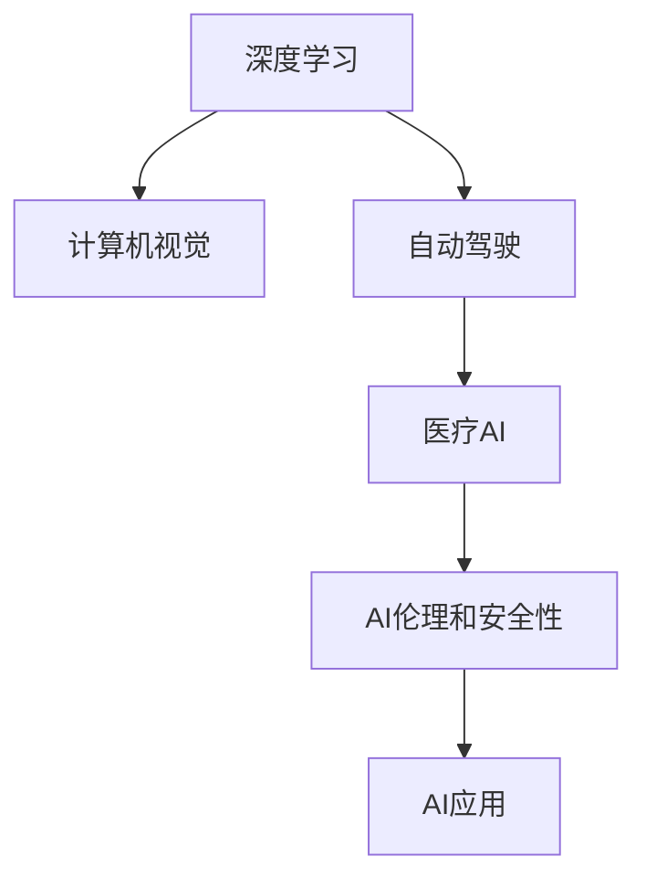

                 

## 1. 背景介绍

### 1.1 问题由来

在人工智能(AI)领域，Andrej Karpathy 是一位备受尊敬的研究者和领导者。他的工作涵盖了深度学习、计算机视觉和自动驾驶等多个前沿领域。随着AI技术的快速发展和应用的日益广泛，AI的未来发展前景成为了一个引人关注的重要话题。本文将围绕Andrej Karpathy在AI领域的见解和思考，探讨AI未来的发展趋势和面临的挑战。

### 1.2 问题核心关键点

Andrej Karpathy的观点主要集中在深度学习的未来、AI伦理和安全性、以及AI在自动驾驶和医疗等领域的应用潜力。以下是对他观点的详细介绍：

- **深度学习的未来**：Andrej Karpathy认为深度学习将继续在多个领域保持其主导地位，但同时也面临着计算资源和数据规模的巨大挑战。
- **AI伦理和安全性**：他强调在AI研究和发展过程中，需要高度重视伦理和安全问题，避免AI技术被滥用，带来社会风险。
- **自动驾驶**：Karpathy在自动驾驶领域的研究成果丰硕，他对未来自动驾驶技术的成熟和普及抱有很高期待。
- **医疗AI**：他希望AI在医疗领域能够帮助提升诊断和治疗的准确性和效率，但同时也需解决数据隐私和伦理问题。

## 2. 核心概念与联系

### 2.1 核心概念概述

Andrej Karpathy在AI领域的核心概念主要包括以下几个方面：

- **深度学习**：一种基于神经网络的机器学习方法，通过多层非线性变换来学习数据的内在结构。
- **计算机视觉**：使计算机能够理解和处理图像和视频数据的领域。
- **自动驾驶**：通过感知、决策和控制技术，使车辆能够自主行驶的智能系统。
- **医疗AI**：利用AI技术提高医疗诊断和治疗的效率和准确性。
- **AI伦理和安全性**：关注AI技术在发展过程中可能带来的伦理和安全问题，如隐私保护、偏见和歧视等。

这些核心概念之间的联系可以通过以下Mermaid流程图来展示：



这个流程图展示了AI技术在多个领域的交叉和应用，以及伦理和安全问题在这些领域中的重要性。

## 3. 核心算法原理 & 具体操作步骤

### 3.1 算法原理概述

Andrej Karpathy的研究涉及深度学习算法原理和具体操作步骤，以下是详细的概述：

- **神经网络**：神经网络是深度学习的基础，由多层神经元组成，通过反向传播算法更新权重，实现数据分类、回归等任务。
- **卷积神经网络(CNN)**：用于图像识别和分类任务，通过卷积操作提取特征。
- **循环神经网络(RNN)**：用于处理序列数据，如文本和音频，通过记忆单元捕捉序列依赖性。
- **生成对抗网络(GAN)**：一种生成模型，通过对抗训练生成高质量的图像、音频等数据。
- **强化学习**：通过与环境交互，使AI模型学会在特定任务中做出最优决策。

### 3.2 算法步骤详解

以计算机视觉中的图像分类为例，Andrej Karpathy的算法步骤如下：

1. **数据准备**：收集大量标注的图像数据，用于训练和验证模型。
2. **模型构建**：选择适合的神经网络架构，如VGG、ResNet等，构建卷积神经网络。
3. **网络训练**：通过反向传播算法更新模型参数，最小化损失函数。
4. **模型评估**：在验证集上评估模型性能，选择最优模型进行测试。
5. **应用部署**：将训练好的模型部署到实际应用中，如图像识别系统、自动驾驶系统等。

### 3.3 算法优缺点

**深度学习的优点**：
- **高效表达**：神经网络能够高效地表达复杂非线性关系。
- **自适应学习**：通过大量数据训练，神经网络能够自适应学习特征，提升模型性能。
- **广泛应用**：深度学习在多个领域都有广泛应用，如图像识别、自然语言处理、自动驾驶等。

**深度学习的缺点**：
- **计算资源需求高**：深度学习模型通常需要大量的计算资源和数据存储，训练时间较长。
- **模型可解释性差**：深度学习模型往往被视为“黑盒”，难以解释其内部工作机制。
- **过拟合风险**：深度学习模型容易发生过拟合，尤其是在数据量不足的情况下。

### 3.4 算法应用领域

Andrej Karpathy的研究成果涵盖了多个领域，以下是其主要应用领域：

- **计算机视觉**：在图像分类、目标检测、图像分割等任务上取得了显著成果。
- **自动驾驶**：在自动驾驶领域，Karpathy开发了端到端的驾驶决策系统，提升车辆在复杂环境中的行驶能力。
- **医疗AI**：在医疗影像分析、疾病诊断等方面，利用深度学习提升医疗诊断的准确性和效率。
- **游戏AI**：通过深度学习改进游戏AI的决策和交互能力，提升游戏体验。

## 4. 数学模型和公式 & 详细讲解

### 4.1 数学模型构建

以计算机视觉中的图像分类任务为例，Andrej Karpathy的数学模型构建如下：

- **输入数据**：将输入图像表示为像素矩阵 $x \in \mathbb{R}^{H \times W \times C}$，其中 $H$、$W$ 和 $C$ 分别为图像的高、宽和通道数。
- **卷积层**：使用卷积核 $K \in \mathbb{R}^{f \times f \times C}$ 对输入图像进行卷积操作，生成特征图 $y \in \mathbb{R}^{H' \times W' \times k}$，其中 $H'$、$W'$ 和 $k$ 分别为特征图的高、宽和通道数。
- **池化层**：对特征图进行池化操作，生成下采样后的特征图 $z \in \mathbb{R}^{H'' \times W'' \times k'}$，其中 $H''$、$W''$ 和 $k'$ 分别为池化后的特征图的高、宽和通道数。
- **全连接层**：将池化后的特征图展开为向量 $a \in \mathbb{R}^{H'' \times W'' \times k'}$，通过全连接层得到分类概率 $p \in \mathbb{R}^C$。

### 4.2 公式推导过程

以softmax分类器为例，Andrej Karpathy的公式推导过程如下：

- **损失函数**：假设输入图像 $x$ 对应的正确分类为 $c$，模型的输出为 $p$，则损失函数为：

$$
L(y,c) = -\log\left(\frac{e^{p_c}}{\sum_{i=1}^C e^{p_i}}\right)
$$

- **反向传播算法**：使用反向传播算法更新模型参数 $\theta$，最小化损失函数 $L$。具体步骤如下：

$$
\frac{\partial L}{\partial p_c} = \frac{p_c - y_c}{\sum_{i=1}^C e^{p_i}}
$$

$$
\frac{\partial L}{\partial \theta} = \frac{\partial L}{\partial p} \cdot \frac{\partial p}{\partial a} \cdot \frac{\partial a}{\partial \theta}
$$

其中 $\theta$ 为模型参数，$p$ 为模型输出，$a$ 为特征图，$y$ 为标签向量，$C$ 为分类数。

### 4.3 案例分析与讲解

以图像分类为例，Andrej Karpathy的案例分析与讲解如下：

1. **数据预处理**：将输入图像进行归一化、缩放等预处理操作，以便神经网络能够更好地学习。
2. **模型训练**：在大量标注数据上训练神经网络，调整参数，最小化损失函数。
3. **模型验证**：在验证集上评估模型性能，选择最优模型进行测试。
4. **模型应用**：将训练好的模型应用于实际图像分类任务中，如医学影像诊断、自动驾驶车辆识别等。

## 5. 项目实践：代码实例和详细解释说明

### 5.1 开发环境搭建

Andrej Karpathy的研究项目通常使用Python和PyTorch库进行开发。以下是开发环境的搭建步骤：

1. **安装Python**：下载并安装Python 3.x版本，建议使用Anaconda进行环境管理。
2. **安装PyTorch**：使用pip安装PyTorch，确保使用最新版本。
3. **安装其他库**：安装必要的库，如Numpy、Pandas、Matplotlib等。
4. **设置虚拟环境**：使用虚拟环境管理工具，如conda，创建和管理虚拟环境。

### 5.2 源代码详细实现

以下是一个简单的图像分类项目代码实现，以展示Andrej Karpathy的研究方法：

```python
import torch
import torch.nn as nn
import torch.optim as optim
from torchvision import datasets, transforms

# 定义卷积神经网络
class Net(nn.Module):
    def __init__(self):
        super(Net, self).__init__()
        self.conv1 = nn.Conv2d(3, 6, 5)
        self.pool = nn.MaxPool2d(2, 2)
        self.conv2 = nn.Conv2d(6, 16, 5)
        self.fc1 = nn.Linear(16 * 5 * 5, 120)
        self.fc2 = nn.Linear(120, 84)
        self.fc3 = nn.Linear(84, 10)

    def forward(self, x):
        x = self.pool(torch.relu(self.conv1(x)))
        x = self.pool(torch.relu(self.conv2(x)))
        x = x.view(-1, 16 * 5 * 5)
        x = torch.relu(self.fc1(x))
        x = torch.relu(self.fc2(x))
        x = self.fc3(x)
        return x

# 定义训练函数
def train(net, device, train_loader, optimizer, epoch):
    net.train()
    for batch_idx, (data, target) in enumerate(train_loader):
        data, target = data.to(device), target.to(device)
        optimizer.zero_grad()
        output = net(data)
        loss = F.cross_entropy(output, target)
        loss.backward()
        optimizer.step()
        if batch_idx % 100 == 0:
            print('Train Epoch: {} [{}/{} ({:.0f}%)]\tLoss: {:.6f}'.format(
                epoch, batch_idx * len(data), len(train_loader.dataset),
                100. * batch_idx / len(train_loader), loss.item()))

# 定义测试函数
def test(net, device, test_loader):
    net.eval()
    test_loss = 0
    correct = 0
    with torch.no_grad():
        for data, target in test_loader:
            data, target = data.to(device), target.to(device)
            output = net(data)
            test_loss += F.cross_entropy(output, target, reduction='sum').item()
            pred = output.argmax(dim=1, keepdim=True)
            correct += pred.eq(target.view_as(pred)).sum().item()

    test_loss /= len(test_loader.dataset)
    print('\nTest set: Average loss: {:.4f}, Accuracy: {}/{} ({:.0f}%)\n'.format(
        test_loss, correct, len(test_loader.dataset),
        100. * correct / len(test_loader.dataset)))

# 主函数
def main():
    # 定义数据集和转换
    train_dataset = datasets.CIFAR10(root='./data', train=True, download=True, transform=transforms.ToTensor())
    test_dataset = datasets.CIFAR10(root='./data', train=False, download=True, transform=transforms.ToTensor())
    
    # 定义数据加载器
    train_loader = torch.utils.data.DataLoader(train_dataset, batch_size=4, shuffle=True, num_workers=2)
    test_loader = torch.utils.data.DataLoader(test_dataset, batch_size=4, shuffle=False, num_workers=2)
    
    # 定义模型和优化器
    net = Net()
    net.to(device)
    optimizer = optim.SGD(net.parameters(), lr=0.001, momentum=0.9)
    
    # 训练和测试
    for epoch in range(10):
        train(net, device, train_loader, optimizer, epoch)
        test(net, device, test_loader)

# 运行主函数
if __name__ == "__main__":
    main()
```

### 5.3 代码解读与分析

以下是代码的详细解读与分析：

1. **数据预处理**：使用`transforms.ToTensor()`将图像转换为张量，以便网络能够处理。
2. **模型定义**：定义卷积神经网络，包括卷积层、池化层、全连接层等。
3. **训练函数**：在训练集上使用`torch.utils.data.DataLoader`进行批处理和数据加载，使用`nn.Conv2d`和`nn.MaxPool2d`进行卷积和池化操作，使用`nn.Linear`进行全连接操作，使用`nn.CrossEntropyLoss`进行分类损失计算，使用`nn.SGD`进行梯度下降优化。
4. **测试函数**：在测试集上使用`torch.utils.data.DataLoader`进行批处理和数据加载，计算分类损失和准确率。

## 6. 实际应用场景

### 6.1 智能交通系统

Andrej Karpathy在自动驾驶领域的研究成果显著，他开发的自动驾驶系统已经应用于实际交通环境中。智能交通系统能够自动感知环境、识别行人、车辆和障碍物，并做出合理的驾驶决策，减少交通事故和交通拥堵。

### 6.2 医疗影像分析

在医疗影像分析领域，Andrej Karpathy的研究成果帮助医生提高了诊断的准确性和效率。通过深度学习模型，可以快速识别出肿瘤、病变等异常区域，辅助医生进行精准诊断和治疗。

### 6.3 游戏AI

Karpathy在计算机游戏AI领域的研究成果也为游戏开发者提供了有力支持。他开发的AI能够理解和预测玩家行为，提升游戏的智能性和互动性，增强玩家的游戏体验。

### 6.4 未来应用展望

Andrej Karpathy对未来AI技术的发展前景持乐观态度，他相信AI技术将在多个领域继续取得突破，带来新的应用场景和商业价值。以下是他的几个主要预测：

1. **自动驾驶**：未来的自动驾驶技术将更加智能和安全，能够应对更复杂和动态的环境，实现自动驾驶的普及和应用。
2. **医疗AI**：AI在医疗领域的应用将更加广泛，帮助医生进行精准诊断、个性化治疗，提升医疗服务的效率和质量。
3. **智能交通系统**：智能交通系统将实现更高的自动化和智能化水平，减少交通事故和环境污染，提升城市交通管理水平。
4. **游戏AI**：AI在游戏中的应用将更加深入和广泛，提升游戏的智能性、互动性和沉浸感。
5. **工业自动化**：AI在工业自动化中的应用将更加广泛，帮助企业提高生产效率和质量，降低生产成本。

## 7. 工具和资源推荐

### 7.1 学习资源推荐

Andrej Karpathy的研究工作得到了广泛关注和认可，以下是他推荐的学习资源：

1. **《Deep Learning Specialization》课程**：由Andrew Ng在Coursera上开设的深度学习系列课程，涵盖深度学习的基础和进阶内容。
2. **《Natural Language Processing with PyTorch》书籍**：讲解使用PyTorch进行自然语言处理，包括文本分类、情感分析等任务。
3. **《Learning Deep Learning with PyTorch》书籍**：讲解使用PyTorch进行深度学习的理论和实践，包括卷积神经网络、循环神经网络等内容。
4. **Kaggle竞赛**：Kaggle提供大量数据集和竞赛任务，帮助学习者实践深度学习算法和模型。

### 7.2 开发工具推荐

Andrej Karpathy的研究项目通常使用以下开发工具：

1. **PyTorch**：开源深度学习框架，支持GPU加速，提供了丰富的神经网络模块和优化算法。
2. **TensorBoard**：可视化工具，帮助开发者监控模型训练过程，分析和调试模型。
3. **Weights & Biases**：实验跟踪工具，记录和可视化模型训练过程中的各项指标，方便对比和调优。
4. **Jupyter Notebook**：交互式编程环境，方便编写和运行深度学习代码。

### 7.3 相关论文推荐

Andrej Karpathy的研究工作涵盖了多个前沿领域，以下是他推荐的相关论文：

1. **《Learning to Drive》论文**：介绍了他开发的端到端的自动驾驶决策系统，提升车辆在复杂环境中的行驶能力。
2. **《Capturing Ground Truth with Multiple Instances》论文**：讨论了使用多个实例捕捉真值标签的方法，提升计算机视觉模型的准确性。
3. **《Visual Reasoning》论文**：探讨了如何通过深度学习模型进行视觉推理，提升模型的泛化能力。
4. **《Deep Reinforcement Learning》论文**：介绍了使用深度强化学习进行游戏AI的研究成果，提升游戏的智能性和互动性。

## 8. 总结：未来发展趋势与挑战

### 8.1 研究成果总结

Andrej Karpathy在深度学习、计算机视觉和自动驾驶等领域的研究成果丰硕，他提出的深度学习算法和模型已经广泛应用于多个实际场景中，带来了显著的性能提升和应用价值。

### 8.2 未来发展趋势

Andrej Karpathy对未来AI技术的发展趋势有以下几点展望：

1. **计算资源和数据规模的增长**：未来深度学习模型的计算资源需求将继续增长，数据规模也会不断扩大，推动模型性能的进一步提升。
2. **算法和模型的改进**：未来的深度学习算法将更加高效和稳定，模型将具有更好的泛化能力和鲁棒性。
3. **跨领域应用的扩展**：AI技术将在更多领域得到应用，带来新的商业机会和创新场景。
4. **伦理和安全性的重视**：AI技术的发展将更加注重伦理和安全问题，避免技术滥用带来的社会风险。

### 8.3 面临的挑战

Andrej Karpathy也指出了未来AI技术发展中面临的挑战：

1. **计算资源和数据隐私**：大规模深度学习模型的训练和推理需要大量计算资源，数据隐私保护也成为重要挑战。
2. **模型可解释性**：深度学习模型通常被认为是“黑盒”，难以解释其内部工作机制，需要进一步研究和改进。
3. **技术伦理和安全**：AI技术的发展需要遵循伦理和道德规范，避免技术滥用带来的社会风险。
4. **跨领域知识融合**：AI技术需要与其他领域的技术相结合，如知识表示、因果推理等，才能更好地解决问题。

### 8.4 研究展望

Andrej Karpathy对未来AI技术的研究展望如下：

1. **深度学习算法和模型的改进**：进一步提升算法的效率和稳定性，开发更好的模型结构。
2. **跨领域应用的探索**：探索AI技术在其他领域的应用，推动技术进步和社会发展。
3. **伦理和安全性的研究**：研究AI技术的伦理和安全问题，制定规范和标准，确保技术健康发展。

## 9. 附录：常见问题与解答

**Q1：深度学习在实际应用中需要注意哪些问题？**

A: 深度学习在实际应用中需要注意以下几个问题：

1. **数据质量**：深度学习模型的性能高度依赖于训练数据的质量，数据偏差和噪声会影响模型的性能。
2. **模型泛化能力**：模型需要在新的数据上具有较好的泛化能力，避免过拟合。
3. **计算资源**：深度学习模型需要大量计算资源，需要优化算法和模型结构，降低计算成本。
4. **模型可解释性**：深度学习模型通常被认为是“黑盒”，难以解释其内部工作机制，需要进一步研究和改进。

**Q2：未来AI技术的发展有哪些潜在的挑战？**

A: 未来AI技术的发展面临以下挑战：

1. **计算资源和数据隐私**：大规模深度学习模型的训练和推理需要大量计算资源，数据隐私保护也成为重要挑战。
2. **模型可解释性**：深度学习模型通常被认为是“黑盒”，难以解释其内部工作机制，需要进一步研究和改进。
3. **技术伦理和安全**：AI技术的发展需要遵循伦理和道德规范，避免技术滥用带来的社会风险。
4. **跨领域知识融合**：AI技术需要与其他领域的技术相结合，如知识表示、因果推理等，才能更好地解决问题。

**Q3：Andrej Karpathy在AI研究中有哪些重要的贡献？**

A: Andrej Karpathy在AI研究中的重要贡献包括：

1. **自动驾驶决策系统**：开发了端到端的自动驾驶决策系统，提升车辆在复杂环境中的行驶能力。
2. **计算机视觉算法**：提出多个计算机视觉算法，如多实例捕捉真值标签、视觉推理等，提升模型性能。
3. **深度学习理论**：研究深度学习算法的理论基础，提出新的算法和模型结构，提升深度学习模型的效率和泛化能力。
4. **游戏AI技术**：通过深度学习改进游戏AI的决策和交互能力，提升游戏的智能性和互动性。

**Q4：如何评价Andrej Karpathy在AI领域的研究成果？**

A: Andrej Karpathy在AI领域的研究成果得到了广泛认可和赞誉，主要表现在以下几个方面：

1. **深度学习算法和模型**：提出了多个深度学习算法和模型，提升了深度学习的性能和应用价值。
2. **计算机视觉技术**：推动了计算机视觉技术的发展，提高了计算机视觉模型的准确性和鲁棒性。
3. **自动驾驶技术**：开发的自动驾驶决策系统在实际应用中表现出色，提升了自动驾驶技术的安全性和可靠性。
4. **游戏AI技术**：通过深度学习改进游戏AI的决策和交互能力，提升了游戏智能性和互动性。

总之，Andrej Karpathy的研究成果对深度学习和AI技术的发展具有重要意义，为未来的AI研究提供了宝贵的经验和启示。

**Q5：Andrej Karpathy对未来AI技术的发展有何展望？**

A: Andrej Karpathy对未来AI技术的发展展望如下：

1. **计算资源和数据规模的增长**：未来深度学习模型的计算资源需求将继续增长，数据规模也会不断扩大，推动模型性能的进一步提升。
2. **算法和模型的改进**：未来的深度学习算法将更加高效和稳定，模型将具有更好的泛化能力和鲁棒性。
3. **跨领域应用的扩展**：AI技术将在更多领域得到应用，带来新的商业机会和创新场景。
4. **伦理和安全性的重视**：AI技术的发展将更加注重伦理和安全问题，避免技术滥用带来的社会风险。

Andrej Karpathy的研究成果和展望为AI技术的发展提供了宝贵的指导和方向，相信在未来AI技术的不断发展中，他的贡献将更加凸显。

---

作者：禅与计算机程序设计艺术 / Zen and the Art of Computer Programming

