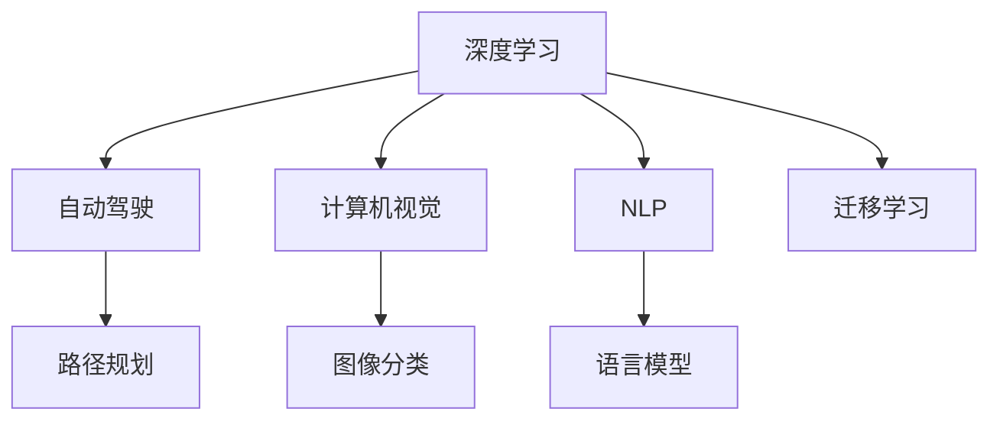

                 

## 1. 背景介绍

Andrej Karpathy，作为人工智能领域的权威专家，凭借其在深度学习、自动驾驶、计算机视觉等方面的杰出贡献，获得了众多荣誉，包括作为卷积神经网络（CNN）领域的先驱之一，以及参与开发了特斯拉自动驾驶汽车的核心算法。本文旨在探讨Karpathy对未来人工智能（AI）技术发展前景的见解，重点关注其在深度学习、自动驾驶、计算机视觉等前沿领域的创新思考。

### 1.1 问题由来

随着人工智能技术的快速发展，从图像识别、语音识别到自然语言处理、智能机器人等领域都取得了显著进展。Karpathy作为该领域的佼佼者，对AI的未来趋势和挑战有着深入的洞察。他的见解和预测对行业内外的技术发展具有重要的指导意义。

## 2. 核心概念与联系

### 2.1 核心概念概述

为了深入理解Andrej Karpathy对人工智能未来发展的看法，我们需要首先明确几个关键概念：

- **深度学习（Deep Learning）**：一种基于多层神经网络的机器学习技术，能够处理复杂的非线性数据，广泛应用于计算机视觉、自然语言处理等领域。

- **自动驾驶（Autonomous Driving）**：通过计算机视觉、传感器融合、路径规划等技术，实现车辆的自主驾驶功能。

- **计算机视觉（Computer Vision）**：研究如何让计算机"看懂"图像、视频等视觉信息，进而进行识别、分析等任务。

- **自然语言处理（Natural Language Processing, NLP）**：使计算机能够理解、处理和生成人类语言，是人工智能的重要分支。

- **迁移学习（Transfer Learning）**：利用已训练好的模型在新的数据集上继续学习，减少新任务对标注数据的需求，提高模型泛化能力。

### 2.2 核心概念原理和架构的 Mermaid 流程图



## 3. 核心算法原理 & 具体操作步骤

### 3.1 算法原理概述

Andrej Karpathy强调深度学习的非线性处理能力，并认为这一能力将推动AI在更多领域的应用。他指出，深度学习在图像识别、语音识别和自然语言处理等领域取得的突破，将继续扩展到自动驾驶、医疗诊断、智慧城市建设等多个领域。Karpathy认为，未来的人工智能将不再局限于数据驱动的模型，而是更多地结合人类经验、常识和逻辑推理，形成更加智能、普适的AI系统。

### 3.2 算法步骤详解

Karpathy详细阐述了深度学习在自动驾驶中的具体应用步骤：

1. **数据采集与标注**：自动驾驶车辆通过多种传感器（如摄像头、雷达、激光雷达等）获取实时环境数据。数据标注通过人工标记道路标线、交通信号、行人等，为模型提供训练样本。

2. **模型训练**：使用大量带有标注的训练数据，通过反向传播算法更新网络权重。模型包括卷积神经网络（CNN）、循环神经网络（RNN）、深度神经网络（DNN）等。

3. **仿真测试**：在虚拟环境中测试模型性能，模拟真实驾驶场景，如急转弯、拥堵路段、交通灯等。

4. **实际部署**：将训练好的模型部署到车辆控制系统，实现实时环境感知、决策和控制。

### 3.3 算法优缺点

Karpathy指出，深度学习在自动驾驶中的应用存在以下优点：

- **泛化能力强**：通过大量的数据训练，模型能够适应不同环境和复杂的驾驶场景。
- **实时处理**：利用高性能计算平台（如GPU、TPU），模型能够实时处理传感器数据，快速做出决策。

然而，深度学习也面临以下挑战：

- **高计算成本**：深度学习模型通常需要大规模的计算资源和大量的标注数据，初期投入较高。
- **解释性不足**：深度学习模型的黑盒性质使其难以解释内部决策过程，增加了应用中的不确定性。
- **鲁棒性问题**：模型对输入数据的微小变化敏感，可能导致决策错误。

### 3.4 算法应用领域

Karpathy认为，深度学习技术将在以下几个领域发挥重要作用：

1. **自动驾驶**：通过图像、雷达、激光雷达等传感器数据，实现车辆自主导航和避障。
2. **计算机视觉**：广泛应用于图像分类、目标检测、图像生成等领域。
3. **自然语言处理**：在机器翻译、文本生成、情感分析等方面取得突破。
4. **医疗诊断**：通过图像分析和文本处理，辅助医生进行疾病诊断和治疗方案制定。
5. **智能机器人**：通过深度学习技术，使机器人具备环境感知、决策和操作能力。

## 4. 数学模型和公式 & 详细讲解 & 举例说明

### 4.1 数学模型构建

Karpathy详细构建了自动驾驶模型中的深度学习数学模型。以图像分类为例，模型包括卷积层、池化层、全连接层等，输入为图像数据，输出为分类标签。

### 4.2 公式推导过程

以CNN中常用的softmax函数为例，公式如下：

$$
P(y|x) = \frac{e^{\mathbf{W}^T\mathbf{a}(x)}}{\sum_{y'} e^{\mathbf{W}^T\mathbf{a}(x)}}
$$

其中，$\mathbf{W}$ 为权重矩阵，$\mathbf{a}(x)$ 为激活函数。softmax函数将神经网络的输出映射到概率分布上，用于分类任务。

### 4.3 案例分析与讲解

Karpathy通过实际案例展示了深度学习在自动驾驶中的成功应用。例如，通过卷积神经网络（CNN）对道路标记进行识别，将标记信息作为决策依据，实现车辆的自主导航。

## 5. 项目实践：代码实例和详细解释说明

### 5.1 开发环境搭建

开发深度学习模型需要以下工具：

1. **Python**：作为编程语言，广泛用于深度学习框架和工具的开发。
2. **深度学习框架**：如TensorFlow、PyTorch等，提供了高效的神经网络构建和训练功能。
3. **计算机视觉库**：如OpenCV、Pillow等，用于图像处理和分析。
4. **仿真环境**：如Simulink、Gazebo等，用于测试和验证模型性能。

### 5.2 源代码详细实现

以下是一个简单的CNN模型实现代码：

```python
import torch
import torch.nn as nn
import torchvision.transforms as transforms
from torchvision.datasets import CIFAR10
from torch.utils.data import DataLoader

class CNN(nn.Module):
    def __init__(self):
        super(CNN, self).__init__()
        self.conv1 = nn.Conv2d(3, 64, kernel_size=3, stride=1, padding=1)
        self.relu = nn.ReLU()
        self.maxpool = nn.MaxPool2d(kernel_size=2, stride=2)
        self.fc1 = nn.Linear(64 * 8 * 8, 512)
        self.fc2 = nn.Linear(512, 10)

    def forward(self, x):
        x = self.conv1(x)
        x = self.relu(x)
        x = self.maxpool(x)
        x = x.view(x.size(0), -1)
        x = self.fc1(x)
        x = self.relu(x)
        x = self.fc2(x)
        return x

# 加载CIFAR10数据集
transform = transforms.Compose([
    transforms.ToTensor(),
    transforms.Normalize((0.5, 0.5, 0.5), (0.5, 0.5, 0.5))
])

trainset = CIFAR10(root='./data', train=True, download=True, transform=transform)
trainloader = DataLoader(trainset, batch_size=64, shuffle=True)

# 初始化模型
model = CNN()

# 定义损失函数和优化器
criterion = nn.CrossEntropyLoss()
optimizer = torch.optim.Adam(model.parameters(), lr=0.001)

# 训练模型
for epoch in range(10):
    running_loss = 0.0
    for i, data in enumerate(trainloader, 0):
        inputs, labels = data
        optimizer.zero_grad()
        outputs = model(inputs)
        loss = criterion(outputs, labels)
        loss.backward()
        optimizer.step()
        running_loss += loss.item()
        if i % 2000 == 1999:
            print('[%d, %5d] loss: %.3f' % (epoch + 1, i + 1, running_loss / 2000))
            running_loss = 0.0

print('Finished Training')
```

### 5.3 代码解读与分析

以上代码实现了基本的卷积神经网络（CNN）模型，用于CIFAR10图像分类任务。代码解释如下：

- `CNN`类：定义了卷积层、激活函数、池化层、全连接层等组件。
- `transform`：数据预处理步骤，包括转换为Tensor和标准化。
- `CIFAR10`数据集：加载CIFAR10图像分类数据集。
- `DataLoader`：用于批处理数据，方便模型训练。
- `nn.CrossEntropyLoss`：交叉熵损失函数，用于分类任务。
- `torch.optim.Adam`：优化器，用于更新模型参数。

## 6. 实际应用场景

### 6.1 自动驾驶

自动驾驶是深度学习技术的重要应用场景。通过摄像头、雷达、激光雷达等传感器，自动驾驶车辆能够实时感知周围环境，进行路径规划和决策。例如，特斯拉的自动驾驶系统依赖深度神经网络进行图像识别和场景理解，实现了自动泊车、自动跟车等功能。

### 6.2 医疗诊断

在医疗领域，深度学习技术被应用于图像分析和文本处理。例如，通过卷积神经网络对医学影像进行分类和标注，辅助医生进行疾病诊断和治疗方案制定。

### 6.3 智能机器人

智能机器人通过深度学习技术实现环境感知、决策和操作。例如，AlphaGo利用深度强化学习技术，实现了在围棋游戏中的卓越表现。

### 6.4 未来应用展望

Karpathy认为，未来人工智能将在以下几个领域取得突破：

1. **通用人工智能（AGI）**：实现具备广泛知识、复杂推理和自我意识的AI系统。
2. **跨领域融合**：将深度学习技术与机器人、自然语言处理、计算机视觉等融合，形成更智能、普适的AI系统。
3. **增强学习**：通过模拟和实际环境测试，优化模型性能，提升AI系统的自主决策能力。

## 7. 工具和资源推荐

### 7.1 学习资源推荐

1. **《Deep Learning》书籍**：Ian Goodfellow等人合著，详细介绍了深度学习的基本概念和算法。
2. **《Hands-On Machine Learning with Scikit-Learn and TensorFlow》书籍**：Aurélien Géron所著，介绍了机器学习和深度学习的实用技巧。
3. **《Autonomous Driving with Neural Networks》课程**：由加州大学圣地亚哥分校提供的在线课程，介绍了自动驾驶中的深度学习技术。

### 7.2 开发工具推荐

1. **TensorFlow**：由Google开发的深度学习框架，提供了丰富的API和工具支持。
2. **PyTorch**：由Facebook开发的深度学习框架，以其动态计算图和易用性受到广泛欢迎。
3. **Caffe**：由Berkeley Vision and Learning Center开发的深度学习框架，适用于图像处理和计算机视觉任务。

### 7.3 相关论文推荐

1. **《ImageNet Classification with Deep Convolutional Neural Networks》论文**：Alex Krizhevsky等人，提出了基于深度卷积神经网络的图像分类方法。
2. **《AlphaGo Zero》论文**：David Silver等人，介绍了使用深度强化学习技术实现围棋游戏的自我学习。
3. **《Semi-Supervised Learning with Deep Generative Models》论文**：Kunihiko Fukumizu等人，提出了利用深度生成模型进行半监督学习的思想。

## 8. 总结：未来发展趋势与挑战

### 8.1 研究成果总结

Andrej Karpathy通过对深度学习技术的深入研究和应用实践，推动了自动驾驶、计算机视觉、自然语言处理等领域的发展。他的研究成果不仅提升了AI技术的性能，也为未来AI技术的应用和落地提供了重要参考。

### 8.2 未来发展趋势

Karpathy认为，未来人工智能技术将在以下几个方向取得突破：

1. **深度学习技术的多样化**：除了CNN、RNN等传统模型，新的深度学习模型和算法将不断涌现，推动AI技术的进步。
2. **跨领域融合**：AI技术将在更多领域得到应用，形成跨学科、跨行业的深度融合。
3. **增强学习与深度学习结合**：通过增强学习优化深度学习模型的性能，提升AI系统的自主决策能力。
4. **智能体的自主性与复杂性**：未来AI系统将具备更强的自主性和复杂性，能够执行更复杂的任务和决策。

### 8.3 面临的挑战

尽管AI技术取得显著进展，但仍面临以下挑战：

1. **数据质量和数量**：高质量、大规模的数据是深度学习模型训练的基础，数据获取和标注成本较高。
2. **计算资源**：深度学习模型训练和推理需要高性能计算平台，初期投入较大。
3. **模型解释性**：深度学习模型的黑盒性质使其难以解释内部决策过程，增加了应用中的不确定性。
4. **伦理与安全性**：AI技术在应用过程中可能面临伦理和安全性问题，如隐私保护、误导性输出等。

### 8.4 研究展望

未来，深度学习技术需要在以下几个方面进行深入研究：

1. **数据高效利用**：探索无监督和半监督学习技术，减少对标注数据的依赖。
2. **模型结构优化**：开发参数高效和计算高效的深度学习模型，提高推理效率和资源利用率。
3. **跨领域融合**：将深度学习技术与更多领域的技术进行融合，拓展AI应用场景。
4. **伦理与安全性**：建立AI系统的伦理审查和安全保障机制，确保其安全性和公平性。

## 9. 附录：常见问题与解答

**Q1：深度学习在自动驾驶中的应用前景如何？**

A: 深度学习技术在自动驾驶中的应用前景广阔。通过图像识别、目标检测等技术，自动驾驶车辆能够实现环境感知和路径规划，提高驾驶安全性。

**Q2：如何提高深度学习模型的解释性？**

A: 通过引入因果分析和逻辑推理，增加模型的解释性。例如，在决策过程中，引入可解释的特征选择机制，使模型的输出更具逻辑性和可解释性。

**Q3：未来AI技术面临的主要挑战是什么？**

A: 数据获取和标注成本高、计算资源需求大、模型解释性不足、伦理与安全性问题是未来AI技术面临的主要挑战。

**Q4：AI技术如何与更多领域进行融合？**

A: AI技术可以通过跨学科合作和应用，与更多领域进行深度融合。例如，将AI技术与医疗诊断、智能机器人等结合，提升相关领域的技术水平和应用效果。

---

作者：禅与计算机程序设计艺术 / Zen and the Art of Computer Programming

