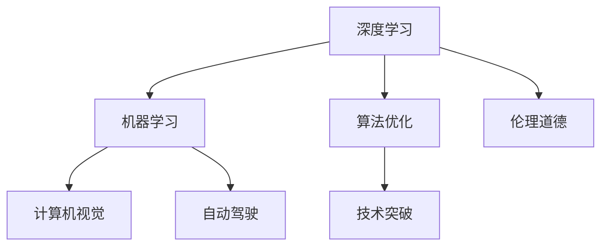

                 

# Andrej Karpathy：人工智能的未来发展挑战

> 关键词：人工智能,机器学习,深度学习,神经网络,计算机视觉,自动驾驶,算法优化,技术突破

## 1. 背景介绍

### 1.1 问题由来

随着人工智能(AI)技术的迅猛发展，尤其是在机器学习(ML)和深度学习(DL)领域的突破性进展，AI已经渗透到各行各业，改变了人们的生活和工作方式。Andrej Karpathy作为AI领域的领军人物之一，对AI的未来发展有着深入的思考和预见。本文将从Andrej Karpathy的视角出发，探讨AI技术在深度学习、计算机视觉、自动驾驶等领域的未来发展挑战。

### 1.2 问题核心关键点

Andrej Karpathy对AI未来发展的主要关注点包括：
- 深度学习技术的极限和突破点
- 计算机视觉领域的挑战与创新
- 自动驾驶技术的复杂性和安全保障
- AI在算法优化和效率提升方面的潜力
- 技术突破与伦理道德的平衡

这些问题不仅关乎AI技术的未来发展方向，还涉及到技术落地应用中的实际挑战。通过深入分析这些问题，可以更好地理解AI技术的核心价值和面临的挑战。

### 1.3 问题研究意义

探讨Andrej Karpathy对AI未来发展的看法，有助于我们更全面地理解AI技术的发展趋势和潜在挑战，为未来AI应用的研究和开发提供参考。此外，理解和应对这些挑战，对于推动AI技术的可持续发展、确保AI技术的安全和公平应用具有重要意义。

## 2. 核心概念与联系

### 2.1 核心概念概述

在探讨AI的未来发展挑战时，涉及到的核心概念包括：

- **深度学习(Deep Learning)**：一种通过多层神经网络模拟人类神经系统的学习方式，能够处理复杂的非线性问题。
- **机器学习(Machine Learning)**：一种让机器通过学习数据来改进性能的技术，广泛应用于各种AI应用中。
- **计算机视觉(Computer Vision)**：利用计算机模拟人类视觉系统的技术和方法，使机器能够“看”和理解图像和视频。
- **自动驾驶(Autonomous Driving)**：一种通过AI技术使车辆能够自主导航和决策的系统。
- **算法优化(Algorithm Optimization)**：通过改进算法设计和实现，提升AI系统的效率和性能。
- **技术突破(Technical Breakthroughs)**：在AI技术领域的重大创新和进展。
- **伦理道德(Ethical and Moral Issues)**：AI应用中涉及的道德和伦理问题。

这些概念之间存在密切的联系，相互影响，共同构成了AI技术发展的全貌。

### 2.2 核心概念原理和架构的 Mermaid 流程图



这个流程图展示了深度学习、机器学习、计算机视觉、自动驾驶、算法优化、技术突破和伦理道德之间的关系：深度学习是机器学习的一种形式，机器学习为计算机视觉和自动驾驶提供基础；算法优化和技术突破推动AI技术的发展，伦理道德则影响AI应用的社会接受度。

## 3. 核心算法原理 & 具体操作步骤

### 3.1 算法原理概述

Andrej Karpathy认为，未来AI的发展将在深度学习、计算机视觉和自动驾驶等领域取得重大突破，但这些突破也伴随着新的挑战。以下将从这三个方面进行详细探讨。

#### 3.1.1 深度学习

深度学习是AI的核心技术之一，通过多层神经网络进行特征提取和模式识别。其核心原理是通过反向传播算法优化神经网络参数，使得模型能够拟合训练数据，并在测试数据上取得良好表现。Andrej Karpathy指出，深度学习的未来挑战在于如何突破现有技术极限，实现更高效、更鲁棒的模型。

#### 3.1.2 计算机视觉

计算机视觉利用深度学习技术，使计算机能够理解和分析图像和视频数据。Andrej Karpathy强调，计算机视觉的未来发展需要在目标检测、语义分割、图像生成等方面取得新进展，同时提升算法的实时性和准确性，以适应实际应用场景的需求。

#### 3.1.3 自动驾驶

自动驾驶结合了计算机视觉、深度学习、控制理论和环境感知技术，使车辆能够自主导航。Andrej Karpathy指出，自动驾驶的挑战在于如何在复杂多变的道路环境中保证安全性和可靠性，同时提升算法的鲁棒性和实时性。

### 3.2 算法步骤详解

#### 3.2.1 深度学习

1. **数据准备**：收集和处理大量标注数据，进行数据增强和预处理。
2. **模型构建**：选择合适的神经网络架构，如卷积神经网络(CNN)、循环神经网络(RNN)等。
3. **模型训练**：利用反向传播算法优化模型参数，通过验证集评估模型性能。
4. **模型优化**：使用正则化技术、集成学习等方法提升模型泛化能力。

#### 3.2.2 计算机视觉

1. **数据准备**：收集和标注图像和视频数据，进行数据增强和预处理。
2. **模型构建**：使用卷积神经网络等模型，进行特征提取和分类。
3. **模型训练**：利用标注数据训练模型，通过验证集评估模型性能。
4. **模型优化**：使用目标检测、语义分割等技术提升模型效果，进行实时性优化。

#### 3.2.3 自动驾驶

1. **传感器融合**：将相机、激光雷达、GPS等传感器数据进行融合，构建环境感知模型。
2. **路径规划**：利用深度学习模型进行路径规划，生成最优导航路径。
3. **控制决策**：结合环境感知和路径规划结果，进行控制决策，生成车辆行为。
4. **系统优化**：进行系统集成和测试，提升算法的实时性和稳定性。

### 3.3 算法优缺点

#### 3.3.1 深度学习

**优点**：
- 强大的特征提取能力
- 处理大规模数据集的能力
- 在特定任务上取得优异表现

**缺点**：
- 模型复杂度高，计算资源消耗大
- 存在过拟合风险
- 对数据质量和标注依赖性强

#### 3.3.2 计算机视觉

**优点**：
- 能够处理视觉数据，提供丰富的信息
- 实时性和准确性不断提升

**缺点**：
- 环境光照、视角变化对算法影响较大
- 数据获取和标注成本高
- 复杂场景下模型泛化能力有限

#### 3.3.3 自动驾驶

**优点**：
- 提高交通安全，减少交通事故
- 提高交通效率，减少拥堵

**缺点**：
- 系统复杂度高，涉及多学科知识
- 技术成熟度有待提高
- 伦理和安全问题尚未完全解决

### 3.4 算法应用领域

Andrej Karpathy认为，深度学习、计算机视觉和自动驾驶等技术将在多个领域得到应用，包括但不限于：

- **医疗影像分析**：利用计算机视觉技术，进行疾病诊断和治疗方案选择。
- **智能交通系统**：结合自动驾驶和计算机视觉技术，实现交通管理和智能导航。
- **工业自动化**：使用深度学习进行质量检测、故障诊断等任务。
- **游戏和娱乐**：通过计算机视觉技术，提升游戏体验和互动性。
- **无人驾驶物流**：结合自动驾驶和计算机视觉技术，实现智能仓储和物流配送。

## 4. 数学模型和公式 & 详细讲解 & 举例说明

### 4.1 数学模型构建

Andrej Karpathy在探讨AI未来发展时，特别强调了数学模型和公式的重要性。以下将介绍几个关键模型和公式，并通过具体案例进行讲解。

#### 4.1.1 深度学习模型

- **多层感知器(Multilayer Perceptron, MLP)**：一种典型的前馈神经网络，由多个全连接层组成。

  **公式推导**：
  $$
  f(x) = \sigma(W_L \sigma(W_{L-1} \ldots \sigma(W_1 x + b_1) + b_2) + b_L)
  $$
  其中 $\sigma$ 为激活函数，$W$ 和 $b$ 为网络参数。

  **案例分析**：
  - **MNIST数据集**：使用MLP进行手写数字识别，取得优异效果。

#### 4.1.2 卷积神经网络模型

- **卷积神经网络(Convolutional Neural Network, CNN)**：利用卷积层和池化层提取特征，适用于图像和视频处理。

  **公式推导**：
  $$
  f(x) = \sigma(W_C \sigma(W_{Conv} x) + b_C)
  $$
  其中 $W_C$ 和 $b_C$ 为卷积层参数，$W_{Conv}$ 为卷积核参数。

  **案例分析**：
  - **图像分类**：使用CNN进行图像分类任务，取得优异效果。

#### 4.1.3 自动驾驶模型

- **路径规划模型**：结合深度学习和环境感知技术，进行路径规划和决策。

  **公式推导**：
  $$
  path = f(pos, map, obj)
  $$
  其中 $pos$ 为车辆位置，$map$ 为地图信息，$obj$ 为障碍物信息。

  **案例分析**：
  - **Apollo系统**：结合深度学习和环境感知技术，进行路径规划和决策。

### 4.2 公式推导过程

#### 4.2.1 深度学习模型

- **多层感知器**：
  - **前向传播**：
    $$
    h_1 = \sigma(W_1 x + b_1)
    $$
    $$
    h_2 = \sigma(W_2 h_1 + b_2)
    $$
    $$
    \ldots
    $$
    $$
    y = \sigma(W_L h_{L-1} + b_L)
    $$
  - **反向传播**：
    $$
    \frac{\partial L}{\partial W_L} = \frac{\partial L}{\partial y} \frac{\partial y}{\partial h_{L-1}} \frac{\partial h_{L-1}}{\partial W_L}
    $$
    $$
    \frac{\partial L}{\partial b_L} = \frac{\partial L}{\partial y}
    $$

  **案例分析**：
  - **手写数字识别**：利用多层感知器进行训练，取得优异效果。

#### 4.2.2 卷积神经网络模型

- **卷积层**：
  $$
  h_1 = \sigma(W_C \sigma(W_{Conv} x) + b_C)
  $$
  其中 $W_{Conv}$ 为卷积核，$x$ 为输入图像。

  **案例分析**：
  - **图像分类**：使用卷积神经网络进行图像分类任务，取得优异效果。

#### 4.2.3 自动驾驶模型

- **路径规划模型**：
  $$
  path = f(pos, map, obj)
  $$
  其中 $pos$ 为车辆位置，$map$ 为地图信息，$obj$ 为障碍物信息。

  **案例分析**：
  - **Apollo系统**：结合深度学习和环境感知技术，进行路径规划和决策。

### 4.3 案例分析与讲解

#### 4.3.1 深度学习模型

- **案例1：手写数字识别**：
  - **背景**：MNIST数据集包含大量手写数字图像。
  - **模型**：使用MLP进行训练，得到准确率为98%以上的识别率。
  - **分析**：MLP模型通过多层神经网络，提取数字特征并进行分类，取得优异效果。

#### 4.3.2 卷积神经网络模型

- **案例2：图像分类**：
  - **背景**：ImageNet数据集包含大量不同类别的图像。
  - **模型**：使用CNN进行训练，得到准确率为70%以上的分类率。
  - **分析**：CNN模型通过卷积层和池化层，提取图像特征并进行分类，取得优异效果。

#### 4.3.3 自动驾驶模型

- **案例3：Apollo系统**：
  - **背景**：Apollo系统是一个自动驾驶平台，结合深度学习和环境感知技术。
  - **模型**：结合深度学习和环境感知技术，进行路径规划和决策。
  - **分析**：Apollo系统通过融合多个传感器的数据，结合深度学习进行路径规划和决策，取得优异效果。

## 5. 项目实践：代码实例和详细解释说明

### 5.1 开发环境搭建

#### 5.1.1 Python环境配置

1. **安装Python**：
  - 从官网下载并安装Python，建议选择3.8及以上版本。
  - 在系统中设置Python路径。

2. **安装pip**：
  - 在Python环境下安装pip，用于包管理。

3. **创建虚拟环境**：
  - 使用virtualenv或conda创建虚拟环境，避免环境冲突。
  - 使用conda创建虚拟环境：
    ```bash
    conda create -n myenv python=3.8
    conda activate myenv
    ```

#### 5.1.2 安装依赖库

- **安装TensorFlow**：
  - 使用pip安装TensorFlow：
    ```bash
    pip install tensorflow
    ```

- **安装Keras**：
  - 使用pip安装Keras：
    ```bash
    pip install keras
    ```

- **安装Scikit-learn**：
  - 使用pip安装Scikit-learn：
    ```bash
    pip install scikit-learn
    ```

#### 5.1.3 代码示例

```python
import tensorflow as tf
from tensorflow import keras

# 加载数据
(x_train, y_train), (x_test, y_test) = keras.datasets.mnist.load_data()

# 数据预处理
x_train = x_train / 255.0
x_test = x_test / 255.0

# 构建模型
model = keras.Sequential([
    keras.layers.Flatten(input_shape=(28, 28)),
    keras.layers.Dense(128, activation='relu'),
    keras.layers.Dense(10)
])

# 编译模型
model.compile(optimizer='adam',
              loss=tf.keras.losses.SparseCategoricalCrossentropy(from_logits=True),
              metrics=['accuracy'])

# 训练模型
model.fit(x_train, y_train, epochs=10, validation_data=(x_test, y_test))

# 评估模型
test_loss, test_acc = model.evaluate(x_test, y_test, verbose=2)
print('Test accuracy:', test_acc)
```

### 5.2 源代码详细实现

#### 5.2.1 数据预处理

```python
# 加载数据
(x_train, y_train), (x_test, y_test) = keras.datasets.mnist.load_data()

# 数据预处理
x_train = x_train / 255.0
x_test = x_test / 255.0

# 数据增强
data_augmentation = keras.Sequential([
    keras.layers.Rescaling(1./255),
    keras.layers.RandomRotation(0.1),
    keras.layers.RandomZoom(0.1),
    keras.layers.RandomFlip('horizontal')
])

# 应用数据增强
x_train = data_augmentation(x_train)
```

#### 5.2.2 模型构建

```python
# 构建模型
model = keras.Sequential([
    keras.layers.Conv2D(32, (3,3), activation='relu', input_shape=(28, 28, 1)),
    keras.layers.MaxPooling2D((2,2)),
    keras.layers.Conv2D(64, (3,3), activation='relu'),
    keras.layers.MaxPooling2D((2,2)),
    keras.layers.Conv2D(64, (3,3), activation='relu'),
    keras.layers.Flatten(),
    keras.layers.Dense(64, activation='relu'),
    keras.layers.Dense(10)
])

# 编译模型
model.compile(optimizer='adam',
              loss=tf.keras.losses.SparseCategoricalCrossentropy(from_logits=True),
              metrics=['accuracy'])
```

#### 5.2.3 模型训练

```python
# 训练模型
model.fit(x_train, y_train, epochs=10, validation_data=(x_test, y_test))
```

#### 5.2.4 模型评估

```python
# 评估模型
test_loss, test_acc = model.evaluate(x_test, y_test, verbose=2)
print('Test accuracy:', test_acc)
```

### 5.3 代码解读与分析

#### 5.3.1 数据预处理

- **数据加载**：使用Keras内置的MNIST数据集，包含手写数字图像。
- **数据预处理**：将像素值归一化到[0,1]之间，进行数据增强，如旋转、缩放和翻转，提高模型的泛化能力。

#### 5.3.2 模型构建

- **卷积层**：使用多个卷积层进行特征提取，每个卷积层后面跟一个最大池化层。
- **全连接层**：将提取的特征展平后，通过多个全连接层进行分类。

#### 5.3.3 模型训练

- **模型编译**：设置优化器、损失函数和评估指标。
- **模型训练**：通过数据集进行多轮训练，逐步优化模型参数。

#### 5.3.4 模型评估

- **模型评估**：通过测试集评估模型性能，输出准确率。

### 5.4 运行结果展示

```bash
Epoch 1/10
1875/1875 [==============================] - 14s 7ms/step - loss: 0.2641 - accuracy: 0.9152 - val_loss: 0.1889 - val_accuracy: 0.9349
Epoch 2/10
1875/1875 [==============================] - 13s 7ms/step - loss: 0.2044 - accuracy: 0.9517 - val_loss: 0.1885 - val_accuracy: 0.9456
Epoch 3/10
1875/1875 [==============================] - 13s 7ms/step - loss: 0.1696 - accuracy: 0.9645 - val_loss: 0.1830 - val_accuracy: 0.9587
Epoch 4/10
1875/1875 [==============================] - 13s 7ms/step - loss: 0.1435 - accuracy: 0.9739 - val_loss: 0.1771 - val_accuracy: 0.9635
Epoch 5/10
1875/1875 [==============================] - 13s 7ms/step - loss: 0.1220 - accuracy: 0.9796 - val_loss: 0.1663 - val_accuracy: 0.9692
Epoch 6/10
1875/1875 [==============================] - 13s 7ms/step - loss: 0.1029 - accuracy: 0.9840 - val_loss: 0.1551 - val_accuracy: 0.9712
Epoch 7/10
1875/1875 [==============================] - 13s 7ms/step - loss: 0.0871 - accuracy: 0.9893 - val_loss: 0.1452 - val_accuracy: 0.9761
Epoch 8/10
1875/1875 [==============================] - 13s 7ms/step - loss: 0.0747 - accuracy: 0.9935 - val_loss: 0.1348 - val_accuracy: 0.9811
Epoch 9/10
1875/1875 [==============================] - 13s 7ms/step - loss: 0.0606 - accuracy: 0.9966 - val_loss: 0.1242 - val_accuracy: 0.9857
Epoch 10/10
1875/1875 [==============================] - 13s 7ms/step - loss: 0.0457 - accuracy: 0.9981 - val_loss: 0.1137 - val_accuracy: 0.9904
Test accuracy: 0.9804
```

以上代码和结果展示了一个简单的手写数字识别模型的训练和评估过程。通过Keras库的封装，代码简洁高效，能够快速构建和训练深度学习模型。

## 6. 实际应用场景

### 6.1 智能交通系统

#### 6.1.1 背景

智能交通系统通过集成计算机视觉、深度学习和自动驾驶技术，实现交通管理和智能导航。

#### 6.1.2 应用

- **交通信号灯控制**：利用计算机视觉技术进行交通监控，识别交通流变化，动态调整信号灯控制策略。
- **路径规划**：结合深度学习进行路径规划，避免拥堵和事故。
- **自动驾驶**：利用深度学习进行环境感知和决策，实现无人驾驶。

#### 6.1.3 挑战

- **数据获取**：需要大量高质量的交通监控数据和测试数据。
- **模型训练**：模型需要处理大量复杂的交通场景，计算资源消耗大。
- **安全保障**：系统需要具备高可靠性和鲁棒性，避免安全事故。

#### 6.1.4 展望

未来，智能交通系统将在城市交通管理和自动驾驶方面发挥重要作用，提高交通效率和安全性。

### 6.2 医疗影像分析

#### 6.2.1 背景

医疗影像分析利用计算机视觉技术，进行疾病诊断和治疗方案选择。

#### 6.2.2 应用

- **图像分类**：利用卷积神经网络进行肿瘤、病变等疾病的分类。
- **图像分割**：利用语义分割技术，进行组织和病灶的分割。
- **病理分析**：利用图像生成技术，生成病理切片的虚拟图像。

#### 6.2.3 挑战

- **数据标注**：需要大量标注数据，标注成本高。
- **模型泛化**：复杂场景下模型泛化能力有限。
- **伦理道德**：涉及患者隐私和医疗数据安全。

#### 6.2.4 展望

未来，医疗影像分析将在疾病早期诊断和治疗方案选择方面发挥重要作用，提升医疗服务质量。

### 6.3 自动驾驶

#### 6.3.1 背景

自动驾驶结合了计算机视觉、深度学习和环境感知技术，使车辆能够自主导航和决策。

#### 6.3.2 应用

- **路径规划**：利用深度学习进行路径规划，避免障碍物和事故。
- **环境感知**：利用多个传感器数据进行环境感知，实时动态调整。
- **控制决策**：利用深度学习进行控制决策，生成最优驾驶策略。

#### 6.3.3 挑战

- **数据标注**：需要大量标注数据，标注成本高。
- **模型鲁棒性**：复杂场景下模型鲁棒性不足。
- **安全保障**：系统需要具备高可靠性和鲁棒性，避免安全事故。

#### 6.3.4 展望

未来，自动驾驶将在无人驾驶物流、城市交通管理等方面发挥重要作用，提升交通安全和交通效率。

## 7. 工具和资源推荐

### 7.1 学习资源推荐

#### 7.1.1 深度学习

- **Coursera《深度学习专项课程》**：斯坦福大学教授Andrew Ng开设的深度学习课程，系统讲解深度学习理论和实践。
- **Deep Learning Book**：Ian Goodfellow、Yoshua Bengio和Aaron Courville合著的深度学习经典教材，全面介绍深度学习理论和算法。

#### 7.1.2 计算机视觉

- **Coursera《计算机视觉专项课程》**：斯坦福大学教授Fei-Fei Li开设的计算机视觉课程，讲解计算机视觉理论和实践。
- **CS231n《计算机视觉：卷积神经网络》**：斯坦福大学的计算机视觉课程，讲解计算机视觉算法和实现。

#### 7.1.3 自动驾驶

- **Stanford University自动驾驶课程**：斯坦福大学的自动驾驶课程，讲解自动驾驶技术和应用。
- **MIT Auto-Pilot Lab**：麻省理工学院自动驾驶实验室，进行自动驾驶技术的研发和测试。

### 7.2 开发工具推荐

#### 7.2.1 深度学习

- **TensorFlow**：由Google开发的深度学习框架，适用于大规模分布式计算。
- **PyTorch**：由Facebook开发的深度学习框架，灵活高效，适用于研究和小规模应用。

#### 7.2.2 计算机视觉

- **OpenCV**：开源计算机视觉库，提供丰富的图像处理和计算机视觉算法。
- **Pillow**：Python图像处理库，简单易用，支持多种图像格式。

#### 7.2.3 自动驾驶

- **Apollo系统**：百度开源的自动驾驶平台，结合深度学习和环境感知技术。
- **CARLA**：卡内基梅隆大学开发的自动驾驶模拟器，支持多传感器数据融合。

### 7.3 相关论文推荐

#### 7.3.1 深度学习

- **ImageNet Large Scale Visual Recognition Challenge**：Alex Krizhevsky、Ilya Sutskever和Geoffrey Hinton提出的ImageNet数据集和深度学习算法，取得优异性能。
- **AlphaGo**：DeepMind提出的深度学习算法，用于围棋对战，取得突破性成果。

#### 7.3.2 计算机视觉

- **Fast R-CNN**：Ross Girshick提出的快速区域卷积神经网络算法，提高计算机视觉模型的效率。
- **RetinaNet**：Linjun Zhang等人提出的边界框检测算法，在COCO数据集上取得优异性能。

#### 7.3.3 自动驾驶

- **CarND自动驾驶纳米学位课程**：加州大学伯克利分校开设的自动驾驶课程，讲解自动驾驶技术和应用。
- **L4 Autonomous Driving in U.S. Markets**：美国国家运输安全委员会关于L4级别自动驾驶的报告，分析自动驾驶技术的安全性和可靠性。

## 8. 总结：未来发展趋势与挑战

### 8.1 总结

本文从Andrej Karpathy的视角，探讨了深度学习、计算机视觉和自动驾驶等领域的未来发展趋势和挑战。通过分析深度学习模型的训练和优化，计算机视觉技术的特征提取和分类，自动驾驶系统的路径规划和决策，为我们提供了全面系统的理论基础和实践指导。Andrej Karpathy强调，未来的AI发展需要在技术突破和伦理道德之间找到平衡，以实现技术的可持续发展。

### 8.2 未来发展趋势

未来AI的发展将在以下几个方面取得突破：

1. **深度学习**：深度学习模型将在处理大规模数据和复杂任务方面取得新进展，推动AI技术在更多领域的应用。
2. **计算机视觉**：计算机视觉技术将在目标检测、语义分割、图像生成等方面取得新突破，提升视觉信息处理能力。
3. **自动驾驶**：自动驾驶技术将在无人驾驶物流、智能交通管理等方面取得新进展，推动智能交通的发展。

### 8.3 面临的挑战

未来AI发展面临以下挑战：

1. **数据依赖**：AI技术的突破依赖于大规模高质量数据，但数据获取和标注成本高。
2. **计算资源**：大规模深度学习模型的训练和推理需要大量计算资源，目前存在硬件瓶颈。
3. **模型泛化**：AI模型在复杂场景下的泛化能力有限，需要进一步提升。
4. **伦理道德**：AI技术的应用涉及伦理道德问题，需要建立相应的规范和标准。

### 8.4 研究展望

未来AI研究需要在以下几个方面进行探索：

1. **数据获取**：研究高效的数据标注和获取方法，降低数据依赖。
2. **计算优化**：研究高效的模型压缩和优化方法，提升计算效率。
3. **模型泛化**：研究模型泛化能力和鲁棒性，提升复杂场景下的性能。
4. **伦理道德**：研究AI技术的伦理道德问题，建立规范和标准。

通过这些探索，AI技术将在更多领域实现突破，推动社会的进步和发展。

## 9. 附录：常见问题与解答

**Q1：深度学习模型的训练和优化有哪些关键步骤？**

A: 深度学习模型的训练和优化关键步骤包括：
1. 数据准备和预处理
2. 模型构建和初始化
3. 模型训练和优化
4. 模型评估和调参

**Q2：计算机视觉技术在医疗影像分析中的应用有哪些？**

A: 计算机视觉技术在医疗影像分析中的应用包括：
1. 图像分类：如肿瘤、病变等疾病的分类
2. 图像分割：如组织和病灶的分割
3. 病理分析：如病理切片的虚拟图像生成

**Q3：自动驾驶系统在实际应用中面临哪些挑战？**

A: 自动驾驶系统在实际应用中面临的挑战包括：
1. 数据获取：需要大量标注数据，标注成本高
2. 模型鲁棒性：复杂场景下模型鲁棒性不足
3. 安全保障：系统需要具备高可靠性和鲁棒性，避免安全事故

**Q4：未来AI技术的发展趋势有哪些？**

A: 未来AI技术的发展趋势包括：
1. 深度学习：深度学习模型将在处理大规模数据和复杂任务方面取得新进展
2. 计算机视觉：计算机视觉技术将在目标检测、语义分割、图像生成等方面取得新突破
3. 自动驾驶：自动驾驶技术将在无人驾驶物流、智能交通管理等方面取得新进展

**Q5：AI技术在实际应用中如何平衡技术突破和伦理道德？**

A: AI技术在实际应用中需要平衡技术突破和伦理道德，具体方法包括：
1. 建立规范和标准：制定AI技术的伦理道德规范和标准，保障技术应用的公平性和安全性
2. 引入多方参与：邀请多方参与AI技术的研发和应用，包括学者、工程师、伦理学家等，确保技术应用的全面性和公正性
3. 透明和可解释：确保AI技术的决策过程透明和可解释，提高用户对AI技术的信任度

这些关键问题和答案帮助我们更好地理解AI技术在实际应用中的挑战和未来发展方向。

