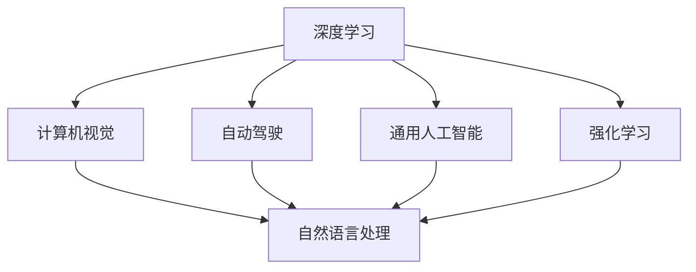

                 

# Andrej Karpathy：人工智能的未来发展挑战

## 1. 背景介绍

Andrej Karpathy，深度学习领域中最为卓越的专家之一，以其在计算机视觉和自动驾驶领域的贡献而闻名。他在人工智能的未来发展挑战上提出了许多独到的见解，这些见解对于业界和学术界都有着深远的影响。本文将围绕他的主要观点进行探讨，对人工智能技术的发展现状、未来趋势及面临的挑战进行深入分析。

## 2. 核心概念与联系

### 2.1 核心概念概述

Andrej Karpathy提出了几个核心概念，它们构成了对人工智能未来发展的理解基础：

- **深度学习**：通过多层神经网络对数据进行学习和推断，深度学习是人工智能中最核心的技术之一。
- **计算机视觉**：使计算机能够"看"并理解图像和视频，是人工智能应用的重要领域。
- **自动驾驶**：将计算机视觉与决策控制相结合，实现自主驾驶，是人工智能在现实世界中的重要应用之一。
- **通用人工智能**：具有与人类相同或相近的智力，能够自主学习并适应复杂环境。
- **强化学习**：通过试错来优化行为，以获得最优结果，是人工智能中的重要学习范式。

这些概念之间的联系可以用以下的Mermaid流程图来展示：



## 3. 核心算法原理 & 具体操作步骤

### 3.1 算法原理概述

深度学习算法通过大量的数据训练神经网络，使其能够进行复杂的模式识别和推断。其中，卷积神经网络(CNN)和循环神经网络(RNN)是计算机视觉和自然语言处理领域的主要算法。

Andrej Karpathy特别强调了**深度学习的可解释性**问题。深度学习模型通常被视为"黑盒"，其内部工作机制难以理解，这限制了它在许多应用领域的使用。为了解决这一问题，Karpathy提出了**模型压缩和解释性增强**的概念，目标是使模型更加透明和可理解。

### 3.2 算法步骤详解

Andrej Karpathy的具体算法步骤主要集中在以下几个方面：

1. **数据收集与预处理**：
   - 收集大量高质量的数据集，并进行清洗、标注和预处理。
   - 使用数据增强技术，如旋转、缩放、平移等，丰富训练数据。

2. **模型构建**：
   - 设计适合特定任务的神经网络结构，如CNN、RNN、Transformer等。
   - 选择合适的损失函数，如交叉熵损失、均方误差损失等。

3. **训练与优化**：
   - 使用梯度下降等优化算法更新模型参数，最小化损失函数。
   - 应用正则化技术，如L2正则、Dropout等，防止过拟合。
   - 采用学习率调度策略，如Warmup、Cyclical Learning Rates等，提高收敛速度。

4. **模型评估与测试**：
   - 在验证集上评估模型性能，使用如准确率、召回率、F1-score等指标。
   - 在测试集上最终评估模型效果，确保模型泛化能力强。

5. **部署与应用**：
   - 将训练好的模型集成到实际应用系统中。
   - 对模型进行优化和裁剪，提升推理速度和资源利用率。

### 3.3 算法优缺点

深度学习算法的优点包括：
- **泛化能力强**：能够在大量数据上学习并泛化到新的数据上。
- **适应性强**：适用于各种复杂任务，如图像识别、自然语言处理等。
- **可扩展性好**：通过增加数据和计算资源，可以不断提升模型性能。

缺点包括：
- **计算资源消耗大**：训练和推理时需大量计算资源，难以在小型设备上运行。
- **可解释性差**：模型内部机制难以理解，对模型的调试和优化带来困难。
- **过拟合风险高**：尤其是在数据集较小的情况下，容易过拟合。

### 3.4 算法应用领域

深度学习算法在计算机视觉、自然语言处理、自动驾驶等诸多领域中得到了广泛应用。以下是几个主要应用领域的简单介绍：

1. **计算机视觉**：用于图像分类、目标检测、人脸识别、图像分割等任务。
2. **自然语言处理**：用于文本分类、情感分析、机器翻译、问答系统等任务。
3. **自动驾驶**：结合计算机视觉和强化学习，实现自主驾驶、导航、障碍物识别等任务。
4. **推荐系统**：用于个性化推荐、广告推荐等任务，基于用户行为数据和物品属性数据进行预测。

## 4. 数学模型和公式 & 详细讲解 & 举例说明

### 4.1 数学模型构建

深度学习模型的核心是神经网络，其数学模型可以简单表示为：

$$
y = \sigma(Wx + b)
$$

其中，$y$ 表示模型输出，$x$ 为输入特征，$W$ 为权重矩阵，$b$ 为偏置项，$\sigma$ 为激活函数。

### 4.2 公式推导过程

以图像分类为例，使用CNN进行图像分类的一般过程如下：

1. **卷积层**：通过卷积操作提取图像的局部特征。
2. **池化层**：通过池化操作降低特征维度，防止过拟合。
3. **全连接层**：将特征向量映射到类别空间，输出预测结果。
4. **softmax层**：将预测结果转化为概率分布，进行分类。

### 4.3 案例分析与讲解

假设有一个图像分类任务，使用CNN模型进行训练。其数学模型可以表示为：

$$
y = \sigma(W^2 \sigma(W^1 x + b^1) + b^2)
$$

其中，$x$ 表示输入图像，$W^1$ 和 $b^1$ 为卷积层参数，$W^2$ 和 $b^2$ 为全连接层参数，$\sigma$ 为激活函数。

在训练过程中，通过反向传播算法计算梯度，并更新模型参数。具体步骤如下：

1. **前向传播**：将输入图像 $x$ 通过卷积层和全连接层，得到预测结果 $y$。
2. **计算损失**：将预测结果与真实标签进行比较，计算损失函数（如交叉熵损失）。
3. **反向传播**：通过链式法则计算损失函数对各参数的梯度，并更新参数。
4. **重复训练**：循环迭代上述步骤，直至模型收敛。

## 5. 项目实践：代码实例和详细解释说明

### 5.1 开发环境搭建

要实现上述深度学习模型的训练和推理，需要以下环境：

1. **Python**：深度学习库通常用Python实现。
2. **TensorFlow**或**PyTorch**：主流深度学习框架，支持GPU加速。
3. **CUDA**：NVIDIA提供的GPU计算平台，加速深度学习计算。
4. **GPU**：至少一张NVIDIA GPU，以支持深度学习计算。

### 5.2 源代码详细实现

以下是一个简单的CNN模型代码实现：

```python
import tensorflow as tf
from tensorflow.keras import layers

# 定义模型
model = tf.keras.Sequential()
model.add(layers.Conv2D(32, (3, 3), activation='relu', input_shape=(28, 28, 1)))
model.add(layers.MaxPooling2D((2, 2)))
model.add(layers.Flatten())
model.add(layers.Dense(10, activation='softmax'))

# 编译模型
model.compile(optimizer='adam', loss='sparse_categorical_crossentropy', metrics=['accuracy'])

# 训练模型
model.fit(train_images, train_labels, epochs=10, validation_data=(test_images, test_labels))

# 测试模型
test_loss, test_acc = model.evaluate(test_images, test_labels)
print('Test accuracy:', test_acc)
```

### 5.3 代码解读与分析

这段代码实现了一个简单的CNN模型，用于手写数字分类。模型包括卷积层、池化层和全连接层。在训练过程中，使用Adam优化器和交叉熵损失函数进行训练。在测试时，使用测试集进行评估，输出测试集上的准确率。

## 6. 实际应用场景

### 6.1 计算机视觉

计算机视觉在医疗、安防、智能家居等领域有着广泛应用。Andrej Karpathy特别提到了**医疗影像分析**和**自动驾驶**两个方向。

- **医疗影像分析**：通过深度学习模型，可以对医学影像进行疾病检测、分割、量化等分析，帮助医生进行诊断和治疗。
- **自动驾驶**：结合计算机视觉和强化学习，实现自主驾驶、导航、障碍物识别等任务。

### 6.2 自然语言处理

自然语言处理是人工智能中最为活跃的领域之一，Andrej Karpathy提到了**情感分析**和**机器翻译**两个应用方向。

- **情感分析**：通过深度学习模型，可以对文本进行情感分类，分析用户对产品、服务等的情感态度。
- **机器翻译**：结合神经机器翻译模型，实现多语言翻译，支持跨语言交流。

### 6.3 自动驾驶

自动驾驶是人工智能的重要应用之一，Andrej Karpathy特别提到了**路径规划**和**障碍物检测**两个方向。

- **路径规划**：通过深度学习模型，可以对复杂交通环境进行建模，生成最优路径规划方案。
- **障碍物检测**：通过计算机视觉技术，识别道路上的障碍物，进行智能避障。

## 7. 工具和资源推荐

### 7.1 学习资源推荐

Andrej Karpathy推荐的几个学习资源包括：

1. **Deep Learning Specialization**：由Andrew Ng教授开设的Coursera课程，涵盖深度学习的基础和应用。
2. **Hands-On Machine Learning with Scikit-Learn and TensorFlow**：由Aurélien Géron撰写的书籍，介绍了Scikit-Learn和TensorFlow的使用方法。
3. **Learning Path for AI/ML Engineers**：由Jake VanderPlas撰写的博客，提供了一个详细的学习路径，从入门到进阶。
4. **CS231n: Convolutional Neural Networks for Visual Recognition**：斯坦福大学计算机视觉课程，提供了计算机视觉领域的深度学习基础和应用。
5. **Fast.ai**：提供了一系列课程和实践项目，帮助开发者掌握深度学习应用。

### 7.2 开发工具推荐

Andrej Karpathy推荐的几个开发工具包括：

1. **PyTorch**：支持动态图，易于调试和优化，适合科研和实验。
2. **TensorFlow**：支持静态图，适合大规模生产部署。
3. **Keras**：提供了高层次的API，易于上手。
4. **Jupyter Notebook**：交互式开发环境，支持代码运行和结果展示。
5. **GitHub**：代码托管和版本控制平台，方便协作开发。

### 7.3 相关论文推荐

Andrej Karpathy推荐了几篇具有代表性的论文，包括：

1. **ImageNet Classification with Deep Convolutional Neural Networks**：Alex Krizhevsky等人提出的卷积神经网络，在ImageNet数据集上取得了突破性成果。
2. **Playing Atari with Deep Reinforcement Learning**：DeepMind团队使用深度强化学习实现游戏AI，在多个Atari游戏上取得了SOTA成绩。
3. **Show and Tell: A Neural Image Caption Generator**：Andrej Karpathy等人提出的基于CNN的图像描述生成模型，能够在给定图像的基础上生成详细的描述。
4. **Learning to Drive in Simulated Human Environments**：Andrej Karpathy等人提出的自动驾驶技术，通过在模拟环境中训练，实现自主驾驶。

## 8. 总结：未来发展趋势与挑战

### 8.1 研究成果总结

Andrej Karpathy在深度学习领域的研究成果主要集中在以下几个方面：

1. **计算机视觉**：通过深度学习模型实现了复杂的图像分类和目标检测任务。
2. **自动驾驶**：结合计算机视觉和强化学习，实现了自主驾驶和导航。
3. **强化学习**：在自动驾驶、游戏AI等领域展示了深度强化学习的潜力。
4. **模型压缩与解释性**：提出了模型压缩和解释性增强的方法，提高了深度学习模型的可理解性和可解释性。

### 8.2 未来发展趋势

Andrej Karpathy认为，未来深度学习技术将向以下几个方向发展：

1. **更强的可解释性**：深度学习模型的可解释性问题将得到进一步解决，使模型更加透明和可理解。
2. **更高效的计算资源**：深度学习计算资源将更加普及，训练和推理效率将得到提升。
3. **更广泛的领域应用**：深度学习技术将应用于更多的领域，如医疗、金融、教育等。
4. **更强的通用能力**：深度学习模型将具备更强的通用能力，能够处理更多复杂任务。

### 8.3 面临的挑战

Andrej Karpathy认为，未来深度学习技术面临的主要挑战包括：

1. **数据质量与数量**：深度学习模型对数据质量要求高，数据获取和处理成本大。
2. **模型可解释性**：深度学习模型通常是"黑盒"，难以解释其内部机制。
3. **计算资源消耗**：深度学习计算资源消耗大，难以在小型设备上运行。
4. **过拟合风险**：深度学习模型容易过拟合，尤其是在数据集较小的情况下。

### 8.4 研究展望

Andrej Karpathy认为，未来深度学习技术的研究方向包括：

1. **模型压缩与优化**：提高模型的计算效率和推理速度。
2. **多模态学习**：将深度学习技术应用于多个模态数据，如图像、语音、文本等。
3. **跨领域迁移学习**：将深度学习技术应用于不同领域，提升模型泛化能力。
4. **弱监督学习**：在数据稀缺的情况下，使用弱监督学习提高模型性能。

## 9. 附录：常见问题与解答

### Q1: 深度学习算法的优缺点有哪些？

**A**: 深度学习算法的优点包括：

- **泛化能力强**：能够在大量数据上学习并泛化到新的数据上。
- **适应性强**：适用于各种复杂任务，如图像识别、自然语言处理等。
- **可扩展性好**：通过增加数据和计算资源，可以不断提升模型性能。

缺点包括：

- **计算资源消耗大**：训练和推理时需大量计算资源，难以在小型设备上运行。
- **可解释性差**：模型内部机制难以理解，对模型的调试和优化带来困难。
- **过拟合风险高**：尤其是在数据集较小的情况下，容易过拟合。

### Q2: 什么是深度学习的可解释性问题？

**A**: 深度学习的可解释性问题指的是，深度学习模型通常是"黑盒"，其内部工作机制难以理解，这限制了它在许多应用领域的使用。为了解决这一问题，提出了模型压缩和解释性增强的方法，目标是使模型更加透明和可理解。

### Q3: 如何优化深度学习模型的计算资源消耗？

**A**: 优化深度学习模型的计算资源消耗可以从以下几个方面入手：

1. **模型压缩**：通过剪枝、量化等方法减少模型参数量，提升推理速度。
2. **分布式训练**：使用多台机器进行分布式训练，加速模型训练过程。
3. **模型并行**：将模型分解为多个子模型，并行计算，提升计算效率。

### Q4: 深度学习算法在自动驾驶中的应用有哪些？

**A**: 深度学习算法在自动驾驶中的应用主要包括：

1. **路径规划**：通过深度学习模型，可以对复杂交通环境进行建模，生成最优路径规划方案。
2. **障碍物检测**：通过计算机视觉技术，识别道路上的障碍物，进行智能避障。
3. **行人识别**：使用卷积神经网络进行行人检测和跟踪，提高驾驶安全性。

### Q5: 深度学习算法在医疗影像分析中的应用有哪些？

**A**: 深度学习算法在医疗影像分析中的应用主要包括：

1. **疾病检测**：通过深度学习模型，对医学影像进行疾病检测，帮助医生进行诊断和治疗。
2. **图像分割**：通过深度学习模型，对医学影像进行分割，帮助医生进行精细化治疗。
3. **量化分析**：通过深度学习模型，对医学影像进行量化分析，提供精准的诊断和治疗建议。

---

作者：禅与计算机程序设计艺术 / Zen and the Art of Computer Programming

