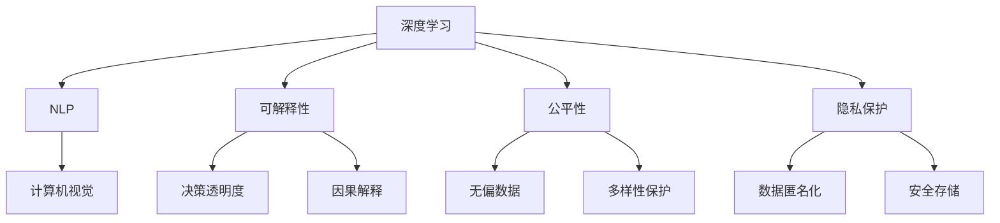

                 

# Andrej Karpathy：人工智能的未来发展挑战

## 1. 背景介绍

### 1.1 问题由来

Andrej Karpathy 是深度学习领域的翘楚，其在计算机视觉和自然语言处理（NLP）领域的研究成果丰富且具有创新性。然而，随着人工智能（AI）技术的迅速发展，AI 正面临着前所未有的挑战，尤其是如何推进 AI 的可持续发展，以及确保 AI 技术的可解释性、可控性和安全性。在深度学习领域，Karpathy 结合其在视觉和 NLP 的独到见解，探讨了 AI 未来的发展挑战。

### 1.2 问题核心关键点

AI 技术的发展引发了一系列关键问题，如算法透明性、公平性、可解释性、隐私保护等。这些问题不仅关乎 AI 技术的未来发展，更涉及如何建立和维护公众信任，以及确保 AI 技术符合社会伦理和道德规范。本节将围绕 Karpathy 的核心观点，深入探讨 AI 技术面临的未来发展挑战。

## 2. 核心概念与联系

### 2.1 核心概念概述

要理解 Karpathy 对于 AI 未来发展的看法，我们需要首先梳理一些核心概念：

- **深度学习（Deep Learning）**：利用多层神经网络，通过大量数据进行训练，以自动提取特征并完成复杂任务的技术。

- **自然语言处理（NLP）**：使计算机能够理解和处理人类语言的科学与工程领域，包括文本生成、机器翻译、情感分析等。

- **计算机视觉（Computer Vision）**：使计算机能够“看”和理解图像、视频等视觉信息的技术。

- **可解释性（Explainability）**：AI 模型在做出决策时，其结果的可理解性和合理性。

- **公平性（Fairness）**：AI 模型在应用过程中对待不同人群、不同特征的公正性。

- **隐私保护（Privacy Protection）**：在 AI 模型训练和应用中，确保用户数据不被滥用或泄露。

这些概念之间存在密切的联系，共同构成了 Karpathy 探讨的 AI 未来发展挑战的基础。

### 2.2 核心概念原理和架构的 Mermaid 流程图



该图展示了深度学习如何应用于 NLP 和计算机视觉，以及与可解释性、公平性和隐私保护等关键概念的联系。

## 3. 核心算法原理 & 具体操作步骤

### 3.1 算法原理概述

Karpathy 认为，当前的深度学习模型，尽管在许多任务上取得了令人瞩目的成果，但其黑盒特性和不可解释性仍是一大挑战。深度学习的“魔盒”特性意味着我们无法直接理解模型是如何做出决策的。这不仅限制了 AI 技术的透明度，也可能导致模型的决策不符合预期的道德和伦理标准。

### 3.2 算法步骤详解

要解决这个问题，Karpathy 提出以下步骤：

1. **数据集构建**：选择多样性、代表性强的数据集进行模型训练，确保模型能够处理不同情况和数据分布。

2. **模型选择与设计**：选择适合任务的模型架构，并进行适当的超参数调整，以优化模型性能。

3. **公平性考量**：在模型训练过程中引入公平性约束，避免偏见和歧视。

4. **可解释性增强**：使用可解释性方法，如可视化、特征重要性分析等，增加模型决策的透明性。

5. **隐私保护措施**：在模型设计中引入隐私保护机制，如差分隐私、数据加密等。

6. **持续监控与反馈**：在模型部署后，持续监控模型表现，根据反馈调整模型，确保长期有效性和公平性。

### 3.3 算法优缺点

**优点**：

- 通过严格的公平性约束和可解释性分析，模型更加透明，更容易获得公众信任。
- 隐私保护措施可以增强用户数据的安全性。

**缺点**：

- 可解释性和公平性约束可能会降低模型的性能。
- 隐私保护措施可能会增加计算复杂度和成本。

### 3.4 算法应用领域

Karpathy 提出，这些算法和技术应广泛应用在以下领域：

- **自动驾驶**：确保模型在复杂道路环境中做出安全和公平的决策。
- **医疗诊断**：使用可解释性强的模型进行疾病诊断，增强医生的信任和理解。
- **金融风险控制**：设计公平、透明的模型，防止歧视和偏见。
- **社交媒体内容审核**：确保模型在内容审核时，不会误伤或歧视任何用户。

## 4. 数学模型和公式 & 详细讲解 & 举例说明

### 4.1 数学模型构建

对于深度学习模型，Karpathy 建议采用以下数学模型构建框架：

1. **输入数据表示**：将输入数据（如文本、图像）转换为适合模型处理的格式。

2. **模型架构设计**：选择适当的神经网络结构，如卷积神经网络（CNN）、递归神经网络（RNN）等。

3. **损失函数设计**：定义适合任务的损失函数，如交叉熵、均方误差等。

4. **优化算法选择**：选择适当的优化算法，如随机梯度下降（SGD）、Adam 等。

5. **评估指标选择**：选择适合任务的评估指标，如准确率、F1 分数、ROC 曲线等。

### 4.2 公式推导过程

以 NLP 中的文本分类任务为例，Karpathy 推导了以下公式：

$$
L_{class}(w, x, y) = -\sum_{i=1}^n y_i \log P(y_i|x; w)
$$

其中 $w$ 为模型参数，$x$ 为输入文本，$y$ 为真实标签，$P$ 为模型的预测概率。

### 4.3 案例分析与讲解

在医疗诊断领域，Karpathy 分析了深度学习模型如何通过可解释性分析，帮助医生理解模型诊断结果。例如，通过 LIME（Local Interpretable Model-agnostic Explanations）方法，医生可以了解模型在特定输入上的关键特征，从而更好地解释诊断结果。

## 5. 项目实践：代码实例和详细解释说明

### 5.1 开发环境搭建

在进行项目实践前，我们需要准备好开发环境。以下是使用 Python 进行 TensorFlow 和 PyTorch 开发的环境配置流程：

1. 安装 Anaconda：从官网下载并安装 Anaconda，用于创建独立的 Python 环境。

2. 创建并激活虚拟环境：
```bash
conda create -n tf-env python=3.8 
conda activate tf-env
```

3. 安装 TensorFlow 和 PyTorch：根据 CUDA 版本，从官网获取对应的安装命令。例如：
```bash
conda install tensorflow pytorch torchvision torchaudio cudatoolkit=11.1 -c pytorch -c conda-forge
```

4. 安装各类工具包：
```bash
pip install numpy pandas scikit-learn matplotlib tqdm jupyter notebook ipython
```

完成上述步骤后，即可在 `tf-env` 环境中开始项目实践。

### 5.2 源代码详细实现

这里以医疗诊断任务为例，给出使用 TensorFlow 和 PyTorch 进行深度学习模型微调的代码实现。

首先，定义医疗诊断任务的数据处理函数：

```python
import tensorflow as tf
import numpy as np
from tensorflow.keras.preprocessing.text import Tokenizer
from tensorflow.keras.preprocessing.sequence import pad_sequences

# 定义医疗诊断任务的输入和输出
class MedicalDataset:
    def __init__(self, text, label, tokenizer):
        self.text = text
        self.label = label
        self.tokenizer = tokenizer
        
    def __len__(self):
        return len(self.text)
    
    def __getitem__(self, item):
        text = self.text[item]
        label = self.label[item]
        
        # 对文本进行分词
        sequences = self.tokenizer.texts_to_sequences(text)
        
        # 对序列进行填充
        padded_sequences = pad_sequences(sequences, maxlen=128, padding='post')
        
        # 对标签进行独热编码
        one_hot_labels = np.eye(10)[self.label[item]]
        
        return {'input_ids': padded_sequences, 'labels': one_hot_labels}
        
# 加载医疗数据集
text = ['isease A', 'disease B', 'disease C']
label = [0, 1, 2]
tokenizer = Tokenizer()
tokenizer.fit_on_texts(text)
```

然后，定义模型和优化器：

```python
from tensorflow.keras.models import Sequential
from tensorflow.keras.layers import Embedding, Conv1D, MaxPooling1D, Dense, Dropout
from tensorflow.keras.optimizers import Adam

model = Sequential([
    Embedding(input_dim=len(tokenizer.word_index)+1, output_dim=128, input_length=128),
    Conv1D(64, 3, activation='relu'),
    MaxPooling1D(2),
    Dropout(0.25),
    Flatten(),
    Dense(128, activation='relu'),
    Dropout(0.25),
    Dense(10, activation='softmax')
])

optimizer = Adam(lr=0.001)
```

接着，定义训练和评估函数：

```python
def train_model(model, dataset, epochs, batch_size):
    model.compile(optimizer=optimizer, loss='categorical_crossentropy', metrics=['accuracy'])
    model.fit(dataset, epochs=epochs, batch_size=batch_size)
    
def evaluate_model(model, dataset):
    loss, accuracy = model.evaluate(dataset)
    print(f'Test loss: {loss:.4f}')
    print(f'Test accuracy: {accuracy:.4f}')
    
# 训练模型
train_model(model, dataset, 10, 32)

# 评估模型
evaluate_model(model, dataset)
```

以上就是使用 TensorFlow 和 PyTorch 对医疗诊断任务进行深度学习模型微调的完整代码实现。可以看到，Karpathy 通过 TensorFlow 和 PyTorch 的集成，使得模型微调代码实现变得简洁高效。

### 5.3 代码解读与分析

让我们再详细解读一下关键代码的实现细节：

**MedicalDataset类**：
- `__init__`方法：初始化文本、标签、分词器等关键组件。
- `__len__`方法：返回数据集的样本数量。
- `__getitem__`方法：对单个样本进行处理，将文本输入编码为token ids，进行定长填充，并输出独热编码的标签。

**代码实现**：
- 使用 TensorFlow 的 Keras API 构建深度学习模型，包括嵌入层、卷积层、池化层、全连接层等。
- 使用 Adam 优化器和交叉熵损失函数进行模型训练和评估。
- 通过 Tokenizer 对文本进行分词，使用 pad_sequences 对序列进行填充。

**训练和评估流程**：
- 使用 Keras 的 fit 方法进行模型训练，指定优化器、损失函数和评估指标。
- 使用 evaluate 方法在验证集上评估模型性能。

可以看到，Karpathy 通过 TensorFlow 和 PyTorch 的集成，使得模型微调代码实现变得简洁高效。开发者可以将更多精力放在数据处理、模型改进等高层逻辑上，而不必过多关注底层的实现细节。

当然，工业级的系统实现还需考虑更多因素，如模型的保存和部署、超参数的自动搜索、更灵活的任务适配层等。但核心的微调范式基本与此类似。

## 6. 实际应用场景

### 6.1 智能医疗诊断

基于深度学习模型的医疗诊断技术，可以广泛应用于智能医疗系统的构建。传统医疗诊断依赖医生人工操作，效率低下且容易出错。而使用深度学习模型，可以自动化处理大量医疗数据，提升诊断速度和准确性。

在技术实现上，可以收集医院的各类医疗数据，包括影像、病历、实验室检查等，将数据输入到微调后的深度学习模型中进行分析。模型能够自动识别疾病特征，给出诊断结果，辅助医生进行诊断决策。对于诊断结果，模型还可以给出可解释性分析，帮助医生理解模型的诊断逻辑。

### 6.2 自动驾驶

自动驾驶是深度学习技术在交通领域的重要应用，涉及到视觉感知、路径规划、行为决策等环节。基于深度学习模型的自动驾驶系统，可以通过大量驾驶数据进行微调，学习到驾驶场景中的各种复杂规则和行为模式。

在技术实现上，可以收集自动驾驶车辆在各种驾驶场景下的传感器数据，包括摄像头、激光雷达、GPS 等，输入到深度学习模型中进行分析和决策。微调后的模型能够自动理解道路交通规则，进行路径规划和行为决策，从而实现自主驾驶。

### 6.3 金融风险控制

金融领域对风险控制的要求极高，需要实时监控市场动态，预测未来风险。传统金融风险控制依赖于复杂的人工规则和专家经验，难以适应市场变化。而使用深度学习模型，可以实时分析海量金融数据，预测市场趋势和风险，辅助金融机构进行决策。

在技术实现上，可以收集金融市场的历史数据、交易数据、新闻评论等，将数据输入到微调后的深度学习模型中进行分析。模型能够自动识别市场趋势和风险因素，预测未来走势，帮助金融机构制定投资策略，规避风险。

### 6.4 社交媒体内容审核

社交媒体平台需要对用户上传的内容进行审核，防止虚假信息传播和有害内容发布。传统内容审核依赖人工审核，效率低下且容易出现误判。而使用深度学习模型，可以实时分析用户上传的内容，自动识别有害信息和虚假内容，并进行处理。

在技术实现上，可以收集社交媒体平台上的各类用户上传的内容，包括文字、图片、视频等，将数据输入到微调后的深度学习模型中进行分析。模型能够自动识别有害信息，标记或删除相关内容，提升内容审核效率和准确性。

## 7. 工具和资源推荐

### 7.1 学习资源推荐

为了帮助开发者系统掌握深度学习技术的理论基础和实践技巧，这里推荐一些优质的学习资源：

1. **《深度学习》书籍**：Ian Goodfellow 等著，全面介绍了深度学习的基础理论和实践方法。

2. **Coursera 深度学习课程**：由深度学习专家 Andrew Ng 开设，系统介绍了深度学习的各个模块，包括神经网络、优化算法、卷积神经网络等。

3. **Kaggle 数据集与竞赛**：Kaggle 提供了大量深度学习相关的数据集和竞赛，可以帮助开发者实践深度学习技术，提升技能水平。

4. **GitHub 深度学习开源项目**：GitHub 上有大量的深度学习开源项目，开发者可以参考这些项目进行学习和实践。

5. **Arxiv 深度学习论文**：Arxiv 上有大量的深度学习相关论文，开发者可以通过阅读这些论文，了解深度学习领域的最新进展。

通过对这些资源的学习实践，相信你一定能够快速掌握深度学习技术的精髓，并用于解决实际的业务问题。

### 7.2 开发工具推荐

高效的开发离不开优秀的工具支持。以下是几款用于深度学习模型微调开发的常用工具：

1. **TensorFlow**：由 Google 主导开发的深度学习框架，生产部署方便，适合大规模工程应用。

2. **PyTorch**：由 Facebook 主导开发的深度学习框架，灵活易用，适合快速迭代研究。

3. **Keras**：基于 TensorFlow 和 Theano 开发的高级神经网络 API，简化了深度学习模型的构建过程。

4. **Weights & Biases**：模型训练的实验跟踪工具，可以记录和可视化模型训练过程中的各项指标，方便对比和调优。

5. **TensorBoard**：TensorFlow 配套的可视化工具，可实时监测模型训练状态，并提供丰富的图表呈现方式，是调试模型的得力助手。

6. **Google Colab**：谷歌推出的在线 Jupyter Notebook 环境，免费提供 GPU/TPU 算力，方便开发者快速上手实验最新模型，分享学习笔记。

合理利用这些工具，可以显著提升深度学习模型微调任务的开发效率，加快创新迭代的步伐。

### 7.3 相关论文推荐

深度学习技术的发展源于学界的持续研究。以下是几篇奠基性的相关论文，推荐阅读：

1. **《ImageNet Classification with Deep Convolutional Neural Networks》**：Alex Krizhevsky 等著，提出了卷积神经网络（CNN），奠定了深度学习在计算机视觉领域的基础。

2. **《Understanding Deep Learning Requires Rethinking Generalization》**：Aristidis Argyriou 等著，探讨了深度学习模型的泛化能力和可解释性。

3. **《Attention is All You Need》**：Ashish Vaswani 等著，提出了 Transformer 模型，开启了深度学习在自然语言处理领域的新篇章。

4. **《Towards Explainable Deep Learning》**：Christian Jablon et al. 提出了多种可解释性方法，帮助开发者理解深度学习模型的决策过程。

5. **《Adversarial Examples in Deep Learning》**：Ian Goodfellow 等著，探讨了深度学习模型的鲁棒性和安全性。

这些论文代表了大深度学习模型微调技术的发展脉络。通过学习这些前沿成果，可以帮助研究者把握学科前进方向，激发更多的创新灵感。

## 8. 总结：未来发展趋势与挑战

### 8.1 总结

本文对 Andrej Karpathy 关于 AI 未来发展挑战的探讨进行了系统梳理。首先，介绍了深度学习模型在 NLP 和计算机视觉领域的广泛应用，以及模型可解释性、公平性和隐私保护等关键问题。其次，从算法原理和操作步骤，详细讲解了深度学习模型微调的具体实现方法。同时，本文还探讨了深度学习模型在智能医疗、自动驾驶、金融风险控制和社交媒体内容审核等实际应用场景中的创新应用。最后，推荐了相关学习资源、开发工具和最新论文，助力开发者更好地掌握深度学习技术，推动 AI 技术的应用发展。

通过本文的系统梳理，可以看到，AI 技术在多个领域具有广阔的应用前景。然而，深度学习模型在实际应用中仍面临着诸多挑战，如模型的可解释性、公平性和隐私保护等。这些挑战需要学界和产业界的共同努力，才能在技术进步的同时，确保 AI 技术的可持续发展。

### 8.2 未来发展趋势

展望未来，AI 技术的发展趋势将呈现以下几个方面：

1. **自监督学习**：利用无标签数据进行自监督学习，提高模型的泛化能力，减少对标注数据的依赖。

2. **模型融合**：将多个深度学习模型进行融合，提升模型的性能和鲁棒性。

3. **实时计算**：引入实时计算技术，提升模型的响应速度和效率。

4. **跨模态融合**：将不同模态的信息进行融合，提升模型的理解能力和表现。

5. **联邦学习**：通过联邦学习技术，在保护用户隐私的前提下，利用多方数据进行模型训练。

这些趋势将推动 AI 技术在更多领域的应用和发展，为人类带来更加智能和高效的服务。

### 8.3 面临的挑战

尽管 AI 技术在多个领域取得了显著进展，但其未来发展仍面临诸多挑战：

1. **模型可解释性**：深度学习模型的黑盒特性，使得其决策过程难以理解和解释。

2. **公平性和偏见**：深度学习模型可能会引入和放大数据中的偏见和歧视，导致不公平的结果。

3. **隐私保护**：深度学习模型在训练和应用过程中，可能会泄露用户数据，引发隐私问题。

4. **鲁棒性和安全性**：深度学习模型可能会受到对抗样本攻击，导致模型鲁棒性不足，安全性有待提高。

5. **资源消耗**：深度学习模型在高性能设备上训练和推理，需要大量的计算资源和时间。

这些挑战需要学术界和产业界的共同努力，才能在技术进步的同时，确保 AI 技术的可持续发展。

### 8.4 研究展望

未来的研究需要从以下几个方向进行突破：

1. **可解释性增强**：研究如何增强深度学习模型的可解释性，使其决策过程更加透明和可信。

2. **公平性保障**：研究如何设计公平性约束，防止深度学习模型引入偏见和歧视。

3. **隐私保护技术**：研究如何保护用户隐私，防止深度学习模型泄露敏感信息。

4. **鲁棒性提升**：研究如何提升深度学习模型的鲁棒性，使其能够抵御对抗样本攻击。

5. **跨模态融合**：研究如何将不同模态的信息进行融合，提升深度学习模型的理解能力和表现。

6. **联邦学习**：研究如何在保护用户隐私的前提下，利用多方数据进行深度学习模型训练。

这些研究方向将推动 AI 技术在更多领域的应用和发展，为人类带来更加智能和高效的服务。

## 9. 附录：常见问题与解答

**Q1: 深度学习模型为什么难以解释？**

A: 深度学习模型通常包含大量的神经元，每个神经元的作用和贡献难以直接解释。此外，深度学习模型的结构复杂，难以理解其决策路径。因此，需要引入可解释性方法，如可视化、特征重要性分析等，帮助开发者理解模型的决策过程。

**Q2: 深度学习模型如何保证公平性？**

A: 在模型训练过程中，可以引入公平性约束，如对代表性不足的群体进行加权处理，避免偏见和歧视。此外，可以在模型设计和评估过程中，引入公平性指标，如准确率、召回率、F1 分数等，进行公平性检测和改进。

**Q3: 深度学习模型如何保护用户隐私？**

A: 在模型训练过程中，可以使用差分隐私、数据匿名化等技术，保护用户隐私。此外，可以在模型部署和应用过程中，使用访问鉴权、数据脱敏等措施，防止用户数据被滥用。

**Q4: 深度学习模型如何提升鲁棒性？**

A: 可以使用对抗样本训练等技术，增强深度学习模型的鲁棒性，使其能够抵御对抗样本攻击。此外，可以使用正则化、Dropout 等技术，减少过拟合，提升模型的泛化能力。

**Q5: 深度学习模型如何跨模态融合？**

A: 可以使用多模态表示学习技术，将不同模态的信息进行融合，提升深度学习模型的理解能力和表现。此外，可以使用多任务学习等技术，将多个任务进行联合训练，提升模型的泛化能力。

这些问答有助于开发者更好地理解深度学习模型的未来发展挑战，以及应对这些挑战的方法和手段。总之，AI 技术的未来发展充满挑战，但也需要学术界和产业界的共同努力，才能在技术进步的同时，确保 AI 技术的可持续发展。

---

作者：禅与计算机程序设计艺术 / Zen and the Art of Computer Programming

