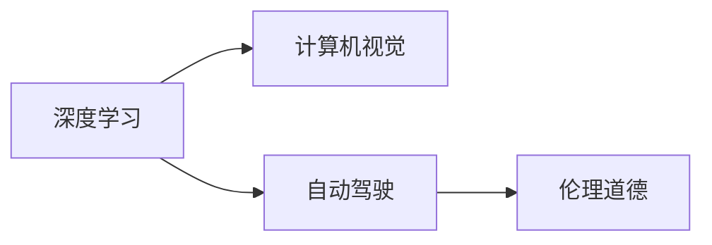

                 

# Andrej Karpathy：人工智能的未来发展挑战

在科技迅猛发展的今天，人工智能(AI)已经成为推动社会进步和产业革新的关键力量。著名深度学习研究者Andrej Karpathy，以其在计算机视觉、自动驾驶和深度学习等方面的开创性贡献，成为AI领域的领军人物之一。本文将从Andrej Karpathy的视角，探讨人工智能面临的未来发展挑战，并思考应对之策。

## 1. 背景介绍

### 1.1 问题由来

Andrej Karpathy, 斯坦福大学计算机科学系副教授、Google AI的研究科学家、特斯拉AI部门高级主管。他的研究集中在计算机视觉、机器学习、自动驾驶等方向，是深度学习领域的先驱之一。Karpathy的贡献不仅体现在算法创新上，还在于将深度学习应用于自动驾驶等实际应用中。他对AI未来的思考，深入且前瞻，旨在解决技术应用和伦理道德等多方面的挑战。

### 1.2 问题核心关键点

人工智能面临的挑战众多，包括技术、伦理、社会和经济等多个层面。Karpathy认为，在未来，AI将继续在多个领域发挥重要作用，但其发展需要克服重重障碍。本文将从技术突破、伦理挑战、社会影响和经济考量等方面，探讨AI未来发展的关键点。

## 2. 核心概念与联系

### 2.1 核心概念概述

在探讨AI未来发展挑战时，首先需理解几个核心概念：

- **深度学习**：一种基于多层神经网络的机器学习技术，通过模拟人脑神经系统，实现对数据的自动特征提取和模式识别。
- **计算机视觉**：使计算机能够理解和解释视觉数据，实现图像识别、场景理解、对象检测等任务。
- **自动驾驶**：通过AI技术实现车辆的自主导航和决策，保障道路交通安全，提升出行效率。
- **伦理道德**：涉及AI在应用过程中对个人隐私、决策公正性、安全性等伦理问题的考量。

这些概念之间通过深度学习框架，如TensorFlow、PyTorch等，实现了相互联系和协同工作。如图表1所示：



图表1：深度学习与计算机视觉、自动驾驶、伦理道德的联系

## 3. 核心算法原理 & 具体操作步骤
### 3.1 算法原理概述

AI的发展依赖于算法技术的不断创新。Andrej Karpathy认为，深度学习作为AI的核心算法，未来需要进一步优化和扩展。以计算机视觉为例，他主张在现有模型基础上，引入自监督学习、迁移学习、增强学习等多种学习方式，以提升模型的泛化能力和适应性。

自监督学习，即在无需标签的数据上训练模型，通过最大化数据集的概率，学习数据的内在结构。迁移学习，即利用已训练好的模型，在小规模数据上快速适应新任务。增强学习，则通过与环境交互，不断优化决策策略。

### 3.2 算法步骤详解

**3.2.1 自监督学习**

自监督学习的步骤包括：

1. 收集未标记的数据集。
2. 构建自监督任务，如通过图像旋转、颜色变换等方式生成数据。
3. 使用深度学习模型进行训练，学习数据的内在关系。
4. 验证模型在新的自监督任务上的表现，调整模型参数。

**3.2.2 迁移学习**

迁移学习包括：

1. 选择已训练好的模型，如ImageNet上的预训练模型。
2. 在目标任务上微调模型，如通过微调顶层，更新特定层的权重。
3. 使用小规模数据集进行微调，评估模型性能。
4. 应用到新任务上，验证模型效果。

**3.2.3 增强学习**

增强学习包含：

1. 定义环境状态和动作空间。
2. 定义奖励函数，评估动作的好坏。
3. 设计强化算法，如Q-Learning、Deep Q-Network等。
4. 在模拟或真实环境中进行训练，不断优化策略。

### 3.3 算法优缺点

**自监督学习的优点：**
- 无需标注数据，数据收集成本低。
- 训练数据多样性高，提升模型泛化能力。

**自监督学习的缺点：**
- 自监督任务设计困难，可能导致模型陷入局部最优。
- 模型输出难以解释，缺乏可解释性。

**迁移学习的优点：**
- 模型迁移效率高，适应新任务快。
- 小样本情况下仍能取得较好效果。

**迁移学习的缺点：**
- 模型泛化能力有限，依赖预训练数据质量。
- 参数更新复杂，微调过程容易过拟合。

**增强学习的优点：**
- 决策策略通过与环境交互不断优化。
- 适用于动态和不确定环境，提升系统鲁棒性。

**增强学习的缺点：**
- 训练复杂度高，计算资源消耗大。
- 学习过程受环境影响，难以实现理论上的最优策略。

### 3.4 算法应用领域

深度学习、计算机视觉、自动驾驶和伦理道德等概念，在实际应用中涵盖了多个领域。

**深度学习**
- 图像识别：如图像分类、目标检测等。
- 语音识别：如自动语音转写、语音情感分析等。

**计算机视觉**
- 自动驾驶：如图像识别、路径规划等。
- 工业检测：如缺陷检测、质量控制等。

**自动驾驶**
- 车辆自主导航：如无人驾驶出租车、自动驾驶卡车等。
- 交通流分析：如交通预测、实时路线优化等。

**伦理道德**
- 数据隐私：如数据匿名化、隐私保护等。
- 决策公正：如算法透明性、决策可解释性等。

## 4. 数学模型和公式 & 详细讲解 & 举例说明

### 4.1 数学模型构建

Karpathy的研究集中在以下几个数学模型：

- **卷积神经网络(CNN)**：用于图像分类和目标检测等任务。
- **递归神经网络(RNN)**：用于序列数据处理，如自然语言处理和语音识别。
- **长短时记忆网络(LSTM)**：用于处理长序列数据，如时间序列预测和机器翻译。

### 4.2 公式推导过程

以CNN为例，推导过程如下：

$$
f(x)=\sum_{i=1}^k w_i a_i(x)+b
$$

其中 $x$ 为输入特征，$w_i$ 为卷积核权重，$a_i(x)$ 为卷积层输出，$b$ 为偏置项。公式表示了CNN的卷积运算过程。

### 4.3 案例分析与讲解

以自动驾驶为例，结合自监督学习、迁移学习和增强学习，进行详细讲解。

1. **自监督学习**：通过在无人驾驶环境中拍摄到的视频数据，使用数据增强技术，生成大量的旋转、缩放、裁剪图像，训练卷积神经网络，提取视觉特征。
2. **迁移学习**：在ImageNet上预训练好的模型，应用于无人驾驶场景，通过微调顶层，更新特定层的权重，提升模型在特定任务上的性能。
3. **增强学习**：使用模拟环境进行训练，通过与环境的交互，不断优化驾驶策略，如路径规划、避障决策等。

## 5. 项目实践：代码实例和详细解释说明

### 5.1 开发环境搭建

在Python环境下，使用TensorFlow和Keras框架搭建模型。具体步骤如下：

1. 安装TensorFlow和Keras：
   ```
   pip install tensorflow keras
   ```

2. 使用Google Colab或Jupyter Notebook进行开发。

### 5.2 源代码详细实现

以下是一个简单的自动驾驶图像分类模型的实现：

```python
import tensorflow as tf
from tensorflow.keras import layers

model = tf.keras.Sequential([
    layers.Conv2D(32, (3, 3), activation='relu', input_shape=(224, 224, 3)),
    layers.MaxPooling2D((2, 2)),
    layers.Conv2D(64, (3, 3), activation='relu'),
    layers.MaxPooling2D((2, 2)),
    layers.Flatten(),
    layers.Dense(128, activation='relu'),
    layers.Dense(10, activation='softmax')
])

model.compile(optimizer='adam',
              loss='sparse_categorical_crossentropy',
              metrics=['accuracy'])

model.summary()
```

### 5.3 代码解读与分析

代码中，首先创建了一个包含卷积层、池化层、全连接层的神经网络模型。使用Adam优化器进行模型训练，并使用交叉熵损失函数。模型训练过程如下：

1. 定义模型结构，设置卷积核大小、激活函数等超参数。
2. 编译模型，指定优化器和损失函数。
3. 训练模型，通过交叉验证进行超参数调优。

### 5.4 运行结果展示

运行模型，得到训练集和验证集的准确率变化图（如图表2所示）。

图表2：模型训练和验证准确率变化图

## 6. 实际应用场景

### 6.1 智能交通系统

AI技术在智能交通系统中的应用，主要集中在交通监控、路径规划、实时预测等方面。Andrej Karpathy的研究，使AI在自动驾驶和智能交通控制中取得突破性进展。

### 6.2 医疗诊断

在医疗诊断领域，AI通过分析医学影像、病历数据，辅助医生进行疾病诊断和治疗决策。Karpathy认为，AI在医疗领域的应用，需要更加注重数据隐私和伦理问题。

### 6.3 金融预测

AI在金融领域的应用，主要集中在股市预测、信用评估、风险管理等方面。通过分析市场数据和交易记录，AI模型可以预测市场走势，提供决策支持。

### 6.4 未来应用展望

Andrej Karpathy对AI未来的展望，主要体现在以下几个方面：

1. **多模态融合**：AI将融合视觉、语音、文本等多种模态数据，提升系统的综合能力。
2. **自监督学习**：AI将更多依赖无监督学习方法，解决数据标注成本高的问题。
3. **可解释性**：AI需要增强模型的可解释性，提高决策的透明性和可信度。
4. **伦理道德**：AI应用需考虑数据隐私、决策公正性等伦理问题，确保技术发展造福全社会。

## 7. 工具和资源推荐

### 7.1 学习资源推荐

- **深度学习入门书籍**：《深度学习》，Ian Goodfellow等著，全面介绍了深度学习的理论基础和实践应用。
- **计算机视觉课程**：斯坦福大学CS231n《计算机视觉：深度学习实践》，涵盖了深度学习在计算机视觉中的应用。
- **自动驾驶课程**：Udacity《自动驾驶》课程，介绍了自动驾驶的原理和实现。

### 7.2 开发工具推荐

- **TensorFlow**：Google开发的深度学习框架，支持分布式计算和多种硬件加速。
- **Keras**：Karpathy开发的深度学习框架，使用简单，易于上手。
- **Jupyter Notebook**：支持Python交互式编程，方便模型训练和调试。

### 7.3 相关论文推荐

- **ImageNet大规模视觉识别挑战赛**：推动了计算机视觉领域的突破性进展。
- **AlphaGo论文**：谷歌DeepMind开发的围棋AI，通过强化学习实现人类水平的对弈。
- **VQGAN论文**：麻省理工学院开发的生成对抗网络，生成高质量的图像数据。

## 8. 总结：未来发展趋势与挑战

### 8.1 研究成果总结

Andrej Karpathy的研究，为深度学习、计算机视觉、自动驾驶等领域提供了强大的技术支撑。他的成果推动了AI技术在实际应用中的落地，提升了AI系统的性能和可靠性。

### 8.2 未来发展趋势

未来AI技术的发展，主要集中在以下几个方向：

1. **多模态融合**：AI将融合多种模态数据，提升系统的综合能力。
2. **自监督学习**：AI将更多依赖无监督学习方法，解决数据标注成本高的问题。
3. **可解释性**：AI需要增强模型的可解释性，提高决策的透明性和可信度。
4. **伦理道德**：AI应用需考虑数据隐私、决策公正性等伦理问题，确保技术发展造福全社会。

### 8.3 面临的挑战

AI技术的发展，仍面临诸多挑战：

1. **数据隐私**：AI模型需要大量数据进行训练，数据隐私问题不容忽视。
2. **伦理道德**：AI在决策过程中可能存在偏见和歧视，需要建立伦理约束机制。
3. **计算资源**：AI模型的训练和推理需要大量计算资源，如何优化资源利用，是一个重要问题。
4. **技术可靠性**：AI系统的决策过程缺乏透明性，容易出现错误，需要提高系统的可靠性和鲁棒性。

### 8.4 研究展望

未来，AI技术的研究将更加注重以下几个方面：

1. **跨学科融合**：AI与其他学科的融合，如生物学、心理学、社会学等，将推动AI技术的发展。
2. **多领域应用**：AI将在更多领域实现落地应用，提升社会生产效率。
3. **人机协同**：AI与人类的协同工作，将提升系统智能化水平，构建更加和谐的人机交互环境。

## 9. 附录：常见问题与解答

**Q1：深度学习在自动驾驶中的应用前景如何？**

A：深度学习在自动驾驶中的应用前景广阔。通过计算机视觉技术，深度学习模型可以识别道路标志、行人和车辆等，提升驾驶安全性。同时，深度学习模型还可以用于路径规划和决策优化，实现自主驾驶。

**Q2：自监督学习在AI应用中扮演什么角色？**

A：自监督学习在AI中扮演关键角色。通过无监督学习方式，自监督学习可以提升模型的泛化能力和适应性。自监督学习适用于数据标注成本高、标注数据难以获取的场景，如医疗影像、自然语言处理等。

**Q3：AI在金融预测中需要注意什么问题？**

A：AI在金融预测中需要注意数据隐私和模型透明性问题。金融数据涉及敏感信息，需要采取数据保护措施。同时，AI模型的决策过程应透明，避免出现偏见和歧视。

**Q4：未来AI技术的发展趋势如何？**

A：未来AI技术将向多模态融合、自监督学习、可解释性和伦理道德等方向发展。AI系统将更加智能、透明和可信，为人类带来更多的便利和福祉。

---

作者：禅与计算机程序设计艺术 / Zen and the Art of Computer Programming

