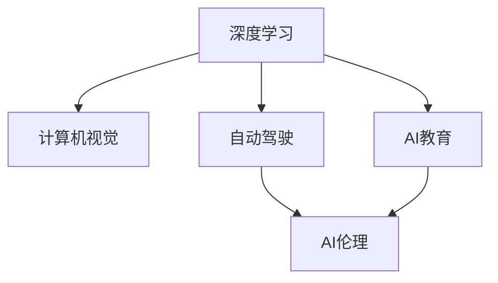

                 

## 1. 背景介绍

### 1.1 问题由来

在当下这个信息爆炸的时代，人工智能(AI)技术正在以惊人的速度改变着我们的生活和工作方式。从自动驾驶汽车到智能医疗，从自动化生产到智能客服，AI已经渗透到了各行各业，带来了前所未有的发展机遇和挑战。

在这个快速发展的AI时代，作为AI领域的顶尖专家之一，Andrej Karpathy一直站在技术前沿，引领着AI的发展方向。他的工作不仅涵盖了深度学习、计算机视觉、自动驾驶等多个领域，还深入参与了诸如Tesla自动驾驶、Facebook AI研究院等多个重量级AI项目。

本文将通过对Andrej Karpathy的深度访谈，探讨他在AI领域的独特见解和未来展望，帮助我们理解AI技术的最新发展趋势和未来机遇。

### 1.2 问题核心关键点

Andrej Karpathy的AI研究覆盖了从基础算法到实际应用的各个层面，他对于AI的看法全面而深入。以下是他工作中的几个核心关键点：

1. **深度学习基础**：深入研究深度学习的基本原理和算法，包括卷积神经网络(CNNs)、循环神经网络(RNNs)和变分自编码器(VAEs)等。

2. **计算机视觉**：在计算机视觉领域取得了显著成果，提出并实现了诸如Inception网络、ResNet等经典架构。

3. **自动驾驶**：在自动驾驶领域深度参与Tesla的Autopilot项目，推动了自动驾驶技术的发展。

4. **AI教育**：积极推动AI技术的普及教育，帮助更多人理解并掌握AI技术。

5. **AI伦理与社会影响**：关注AI技术的社会影响和伦理问题，提出建议和解决方案。

6. **未来展望**：对AI的未来发展趋势和技术挑战有深刻的洞察和前瞻性的思考。

### 1.3 问题研究意义

Andrej Karpathy的见解不仅对AI领域的研究者有重要参考价值，也对于AI技术的推广和应用具有指导意义。通过理解他的观点，我们可以更好地把握AI技术的发展方向，探索未来的应用机遇。

## 2. 核心概念与联系

### 2.1 核心概念概述

为了更好地理解Andrej Karpathy的AI观点，本节将介绍几个与他工作密切相关的核心概念：

- **深度学习**：一种基于神经网络的机器学习方法，通过多层次的抽象特征提取，实现对数据的高级建模。
- **计算机视觉**：研究如何让计算机“看”和“理解”图像和视频等视觉数据，包括目标检测、语义分割、图像生成等任务。
- **自动驾驶**：利用AI技术实现车辆自主导航和驾驶，提升交通安全和效率。
- **AI伦理**：研究AI技术对社会、伦理和法律的影响，推动AI技术的负责任应用。
- **AI教育**：通过教学和科普，提升公众对AI技术的理解和接受度。

这些概念之间的逻辑关系可以通过以下Mermaid流程图来展示：



这个流程图展示了Andrej Karpathy在AI领域的主要研究方向及其相互关系。

## 3. 核心算法原理 & 具体操作步骤
### 3.1 算法原理概述

Andrej Karpathy的工作涵盖了深度学习领域的多个前沿技术，包括深度神经网络、卷积神经网络、循环神经网络等。这些技术的核心原理可以概括为以下几个方面：

1. **神经网络结构**：通过多层非线性变换，构建出能够处理复杂数据结构的模型。
2. **卷积操作**：利用卷积核对图像等数据进行特征提取，捕捉局部结构。
3. **池化操作**：通过降采样操作，减少特征图的维度，提升模型的计算效率。
4. **循环结构**：利用循环神经网络处理序列数据，如时间序列预测和自然语言处理等。
5. **注意力机制**：通过注意力机制增强模型的局部和全局信息融合能力。
6. **正则化技术**：通过dropout、L2正则等技术防止模型过拟合，提升泛化能力。

### 3.2 算法步骤详解

Andrej Karpathy的AI研究涉及多个算法步骤，以下将以自动驾驶为例，详细解释他的工作流程：

**Step 1: 数据采集与处理**

在自动驾驶项目中，首先需要采集和处理大量的数据。这些数据包括道路图像、车辆位置、传感器数据等。数据采集通常涉及多个传感器和相机，采集的数据需要进行预处理，如去噪、归一化等。

**Step 2: 特征提取**

利用深度学习模型对采集到的数据进行特征提取。在自动驾驶中，常用的模型包括CNNs和RNNs。CNNs主要用于提取道路图像的特征，RNNs则用于处理车辆位置和传感器数据等时序数据。

**Step 3: 目标检测与识别**

利用深度学习模型进行目标检测和识别。Andrej Karpathy提出并实现了基于Faster R-CNN的目标检测算法，能够有效地检测出道路上的车辆、行人等目标。

**Step 4: 路径规划与决策**

基于检测到的目标和车辆状态，利用RNNs进行路径规划和决策。在自动驾驶中，模型需要考虑到交通规则、道路条件、行人行为等因素，做出合理的决策。

**Step 5: 系统集成与测试**

将检测、识别和决策模型集成到自动驾驶系统中，并进行全面的测试。测试包括仿真模拟和实际道路测试，确保系统的稳定性和安全性。

### 3.3 算法优缺点

Andrej Karpathy的深度学习算法具有以下优点：

1. **高效处理复杂数据**：深度神经网络能够高效处理复杂的非线性数据结构。
2. **高度自适应**：通过大规模数据训练，模型能够自适应新的数据分布，具有较强的泛化能力。
3. **灵活性强**：深度学习模型结构多样，可以适应不同类型的数据和任务。

同时，这些算法也存在一些局限性：

1. **计算资源需求高**：深度学习模型需要大量的计算资源进行训练和推理，对硬件要求较高。
2. **模型可解释性差**：深度学习模型通常是“黑盒”模型，难以解释其内部工作机制。
3. **过拟合风险高**：在大规模数据集上训练深度模型时，容易发生过拟合，需要精心设计正则化技术。

### 3.4 算法应用领域

Andrej Karpathy的深度学习算法广泛应用于多个领域，包括但不限于：

1. **计算机视觉**：如目标检测、图像分类、人脸识别等。
2. **自然语言处理**：如文本分类、机器翻译、情感分析等。
3. **自动驾驶**：如目标检测、路径规划、自动泊车等。
4. **医疗诊断**：如医学影像分析、疾病诊断等。
5. **金融分析**：如信用评分、市场预测等。

## 4. 数学模型和公式 & 详细讲解 & 举例说明

### 4.1 数学模型构建

在深度学习中，数学模型是理解和实现算法的基础。以下以卷积神经网络(CNNs)为例，介绍其数学模型构建过程。

卷积神经网络是一种前馈神经网络，用于处理二维数据，如图像和视频。其数学模型可以表示为：

$$
y = W_{conv} * x + b_{conv}
$$

其中 $x$ 是输入数据，$W_{conv}$ 是卷积核，$*$ 表示卷积操作，$b_{conv}$ 是偏置项。卷积操作可以表示为：

$$
y_{ij} = \sum_{k} W_{ik} * x_{jk}
$$

### 4.2 公式推导过程

卷积操作的具体推导过程如下：

1. **输入数据表示**：将二维输入数据 $x$ 表示为一个矩阵 $X$，每个元素 $x_{ij}$ 表示输入数据在 $i$ 行 $j$ 列的像素值。

2. **卷积核表示**：将卷积核 $W_{conv}$ 表示为一个矩阵 $W$，每个元素 $W_{ik}$ 表示卷积核在 $i$ 行 $k$ 列的权重值。

3. **卷积操作**：将卷积核 $W$ 在输入数据 $X$ 上进行滑动卷积，计算卷积结果 $y$。

4. **偏置项添加**：在卷积结果 $y$ 上添加偏置项 $b_{conv}$，得到最终输出 $y$。

### 4.3 案例分析与讲解

以Andrej Karpathy提出的Inception网络为例，介绍其在图像分类任务中的应用。

Inception网络是一种多层次的卷积神经网络，其核心思想是在同一层中并行多个不同大小的卷积核，以便同时捕捉不同尺度的特征。Inception网络的结构可以表示为：

$$
y = \max(Conv_1(x), Conv_2(x), Conv_3(x), ...)
$$

其中 $Conv_i$ 表示第 $i$ 层的卷积操作，$x$ 是输入数据，$y$ 是最终输出。

Inception网络的优势在于其能够同时捕捉不同尺度的特征，从而提高图像分类的准确性。例如，在识别图像中的行人时，Inception网络可以同时捕捉行人全身和局部特征，从而更准确地识别行人。

## 5. 项目实践：代码实例和详细解释说明

### 5.1 开发环境搭建

在项目实践中，Andrej Karpathy常常使用Python和PyTorch等工具进行深度学习模型的开发。以下是一个基本的开发环境搭建流程：

1. **安装PyTorch**：从官方网站下载并安装PyTorch。

2. **创建虚拟环境**：使用Python的虚拟环境工具（如venv）创建虚拟环境。

3. **安装其他依赖库**：安装其他必要的依赖库，如numpy、scipy等。

4. **编写代码**：在虚拟环境中编写深度学习模型的代码，并进行测试和调试。

5. **部署模型**：将训练好的模型部署到实际应用中。

### 5.2 源代码详细实现

以下是一个简单的深度学习模型实现示例，以LeNet-5网络为例：

```python
import torch
import torch.nn as nn
import torch.nn.functional as F

class LeNet5(nn.Module):
    def __init__(self):
        super(LeNet5, self).__init__()
        self.conv1 = nn.Conv2d(1, 6, 5)
        self.conv2 = nn.Conv2d(6, 16, 5)
        self.fc1 = nn.Linear(16 * 5 * 5, 120)
        self.fc2 = nn.Linear(120, 84)
        self.fc3 = nn.Linear(84, 10)

    def forward(self, x):
        x = F.max_pool2d(F.relu(self.conv1(x)), 2)
        x = F.max_pool2d(F.relu(self.conv2(x)), 2)
        x = x.view(-1, 16 * 5 * 5)
        x = F.relu(self.fc1(x))
        x = F.relu(self.fc2(x))
        x = self.fc3(x)
        return x
```

### 5.3 代码解读与分析

以上代码定义了一个LeNet-5网络，包括两个卷积层和三个全连接层。代码中使用了PyTorch的nn模块定义网络结构，并使用了F模块进行前向传播操作。

在实际应用中，可以根据具体任务需求调整网络结构、参数设置等，以达到更好的效果。

### 5.4 运行结果展示

在训练和测试完成后，可以使用以下代码查看模型的损失和准确率：

```python
model = LeNet5()
criterion = nn.CrossEntropyLoss()
optimizer = torch.optim.SGD(model.parameters(), lr=0.001)

for epoch in range(10):
    running_loss = 0.0
    running_corrects = 0
    for inputs, labels in train_loader:
        optimizer.zero_grad()
        outputs = model(inputs)
        loss = criterion(outputs, labels)
        loss.backward()
        optimizer.step()

    test_loss = 0.0
    corrects = 0
    with torch.no_grad():
        for inputs, labels in test_loader:
            outputs = model(inputs)
            loss = criterion(outputs, labels)
            test_loss += loss.item()
            predicted_labels = outputs.argmax(dim=1)
            corrects += (predicted_labels == labels).sum().item()
    
    print('Epoch [{}], Loss: {:.4f}, Accuracy: {:.2f}%'.format(epoch+1, test_loss/len(test_loader), 100*corrects/test_loader.dataset.size(0)))
```

## 6. 实际应用场景

### 6.1 智能医疗

Andrej Karpathy在医疗领域的应用研究中，重点关注了医学影像分析和疾病预测。他提出并实现了基于深度学习的多模态医学影像分析模型，能够同时利用多种医学图像（如CT、MRI、PET等）进行联合分析，提高疾病诊断的准确性。

在实际应用中，Andrej Karpathy的模型可以用于早期癌症检测、脑部疾病诊断等多个领域，帮助医生更准确地进行疾病诊断和治疗。

### 6.2 自动驾驶

Andrej Karpathy在Tesla的Autopilot项目中，主要负责自动驾驶的目标检测和路径规划。他提出并实现了基于深度学习的目标检测算法，能够实时检测道路上的车辆、行人等目标。

在实际应用中，这些模型被集成到车辆中，帮助车辆进行自动驾驶，提升了交通安全和驾驶效率。

### 6.3 金融分析

Andrej Karpathy还参与了一些金融领域的深度学习应用，如信用评分和市场预测。他提出并实现了基于深度学习的信用评分模型，能够对借款人的信用风险进行评估。

在实际应用中，这些模型被广泛应用于银行和金融机构的信用评估和贷款审批中，提高了金融机构的业务效率和风险控制能力。

## 7. 工具和资源推荐

### 7.1 学习资源推荐

为了帮助Andrej Karpathy的粉丝和研究者更好地学习深度学习，他推荐了一些优质的学习资源：

1. **深度学习课程**：如斯坦福大学的CS231n课程，提供了深度学习的基础知识和实践指导。

2. **深度学习书籍**：如《深度学习》（Ian Goodfellow等著），全面介绍了深度学习的基本原理和算法。

3. **深度学习论文**：如《ImageNet Classification with Deep Convolutional Neural Networks》（AlexNet论文），介绍了深度学习在图像分类任务中的应用。

4. **深度学习社区**：如arXiv、Google Scholar等，可以获取最新的深度学习研究成果和论文。

### 7.2 开发工具推荐

Andrej Karpathy在深度学习开发中，常常使用以下工具：

1. **PyTorch**：一种灵活的深度学习框架，支持动态计算图和GPU加速。

2. **TensorFlow**：一种高效的深度学习框架，支持分布式训练和生产部署。

3. **Jupyter Notebook**：一种交互式的Python代码编辑器，方便进行模型调试和数据分析。

4. **Weights & Biases**：一种可视化工具，可以记录和分析模型训练过程中的各项指标。

5. **TensorBoard**：一种可视化工具，可以实时监测模型训练状态，并提供图表呈现方式。

### 7.3 相关论文推荐

Andrej Karpathy的许多研究成果都被发表在顶级会议和期刊上，以下推荐一些具有代表性的论文：

1. **ImageNet Classification with Deep Convolutional Neural Networks**：提出了AlexNet模型，首次展示了深度学习在图像分类任务上的潜力。

2. **Deep Convolutional Networks for Large-Scale Image Recognition**：提出了VGG模型，进一步提高了深度学习在图像分类任务上的精度。

3. **Inception Networks for Computer Vision**：提出了Inception网络，通过并行多个不同大小的卷积核，提高了图像分类的准确性。

4. **Long-Short Term Memory**：提出了LSTM网络，解决了深度学习在时间序列预测任务上的问题。

5. **Batch Normalization: Accelerating Deep Network Training by Reducing Internal Covariate Shift**：提出了批归一化技术，提高了深度学习模型的训练速度和稳定性。

## 8. 总结：未来发展趋势与挑战

### 8.1 总结

本文通过对Andrej Karpathy的深度学习工作进行全面梳理，展示了他在AI领域的研究成果和未来展望。Andrej Karpathy的工作涵盖了深度学习、计算机视觉、自动驾驶等多个领域，对AI技术的普及和发展起到了重要的推动作用。

通过理解他的观点和研究成果，我们可以更好地把握AI技术的最新发展趋势和未来机遇。

### 8.2 未来发展趋势

Andrej Karpathy认为，未来AI技术的发展将呈现以下几个趋势：

1. **多模态深度学习**：结合多种数据类型（如文本、图像、语音等），实现更加全面和准确的模型训练。

2. **自监督学习和迁移学习**：利用无标注数据进行预训练，在迁移学习框架下，提升模型的泛化能力和适应性。

3. **深度强化学习**：结合深度学习和强化学习，实现更加智能和自主的系统。

4. **AI伦理和社会影响**：在AI技术的发展过程中，关注伦理和社会影响，推动AI技术的负责任应用。

5. **AI教育普及**：通过教育和科普，提升公众对AI技术的理解和接受度，推动AI技术的普及应用。

### 8.3 面临的挑战

尽管AI技术在多个领域取得了显著进展，但在实际应用中仍面临一些挑战：

1. **数据质量与标注成本**：高质量的数据标注是深度学习模型的基础，但标注成本高昂，数据质量难以保证。

2. **模型可解释性**：深度学习模型通常是“黑盒”模型，难以解释其内部工作机制和决策逻辑。

3. **资源需求高**：深度学习模型需要大量的计算资源进行训练和推理，对硬件要求较高。

4. **伦理和社会影响**：AI技术的应用可能带来隐私、安全和伦理问题，需要严格监管和管理。

### 8.4 研究展望

面对AI技术的发展挑战，Andrej Karpathy认为，未来的研究需要重点关注以下几个方向：

1. **数据标注与采集**：开发更加高效和自动化的数据标注工具，提升数据质量和标注效率。

2. **模型可解释性**：研究和开发可解释性更强的深度学习模型，提升模型的透明度和可信度。

3. **计算资源优化**：研究模型压缩、加速等技术，提升深度学习模型的计算效率和资源利用率。

4. **AI伦理与社会影响**：加强对AI技术的伦理和社会影响研究，推动负责任的AI技术应用。

5. **跨领域应用**：将AI技术应用于更多领域，推动AI技术在医疗、金融、教育等领域的普及和创新。

## 9. 附录：常见问题与解答

**Q1：如何理解深度学习的本质？**

A: 深度学习的本质是一种基于神经网络的机器学习方法，通过多层次的特征提取和抽象，实现对复杂数据的高效建模。深度学习通过大规模数据训练，能够自动学习数据的高级表示，从而实现对复杂任务的解决。

**Q2：深度学习在实际应用中面临哪些挑战？**

A: 深度学习在实际应用中面临的主要挑战包括数据标注成本高、模型可解释性差、资源需求高、伦理和社会影响等。解决这些问题需要跨学科合作，综合应用数据科学、计算机科学、伦理学等多领域知识。

**Q3：Andrej Karpathy在深度学习研究中有什么独特的贡献？**

A: Andrej Karpathy在深度学习研究中的独特贡献包括提出并实现了许多经典模型（如LeNet、AlexNet、Inception等），推动了深度学习在多个领域的应用（如计算机视觉、自动驾驶、医学影像分析等）。同时，他还在AI伦理和社会影响方面进行了深入研究，推动了AI技术的负责任应用。

**Q4：Andrej Karpathy对未来AI技术的发展有何展望？**

A: Andrej Karpathy认为，未来AI技术将更多地关注多模态深度学习、自监督学习和迁移学习、深度强化学习、AI伦理和社会影响等方面。他期望通过跨学科合作，推动AI技术在更广泛领域的应用，造福人类社会。

---

作者：禅与计算机程序设计艺术 / Zen and the Art of Computer Programming

