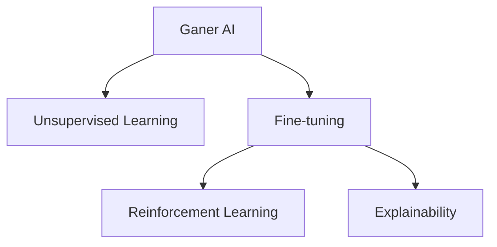

                 

## 1. 背景介绍

### 1.1 问题由来

在AI领域，Andrej Karpathy是一个家喻户晓的名字。作为OpenAI的高级研究科学家、前MIT计算机科学教授，他不仅在深度学习、计算机视觉等方面有着深邃的见解，还在人工智能的未来发展方向上给出了许多具有前瞻性的观点。他不仅提出了Ganer AI的概念，还在实践中不断推动AI技术的发展。本文将基于Andrej Karpathy的讲座和论文，深入探讨AI未来的发展机遇。

### 1.2 问题核心关键点

Andrej Karpathy在多次公开演讲中多次强调，人工智能的未来发展关键在于“以人为本”，并且AI的潜力在于其能够通过理解和预测人类行为，从而实现更加高效、智能的服务。同时，他强调在AI的发展中，我们要确保其伦理性、安全性、公平性和透明性。

## 2. 核心概念与联系

### 2.1 核心概念概述

Andrej Karpathy的观点涵盖了许多核心概念，包括但不限于：

- **Ganer AI**：一种将生成式模型与自然语言处理结合的AI形式，旨在通过生成式对话提升AI的智能。
- **Unsupervised Learning**：无监督学习，通过数据中的内在规律而非标签进行训练，提升模型的泛化能力。
- **Fine-tuning**：微调，通过在有标注数据上的训练，进一步提升模型在特定任务上的性能。
- **Reinforcement Learning**：强化学习，通过奖励机制训练模型，使其在复杂环境中进行智能决策。
- **Explainability**：可解释性，通过解释模型的决策过程，提高其透明度和可信度。

### 2.2 核心概念原理和架构的 Mermaid 流程图



此图展示了Andrej Karpathy所提倡的几个关键概念之间的联系：Ganer AI是基础，而无监督学习、微调、强化学习和可解释性都是进一步提升AI能力的工具和技术。

## 3. 核心算法原理 & 具体操作步骤

### 3.1 算法原理概述

Andrej Karpathy的许多观点都基于对当前AI技术的深刻理解，特别是他在生成式模型和自然语言处理方面的研究。他认为，未来AI的发展应该更加注重生成式AI和无监督学习的结合，通过生成式对话和自然语言生成提升AI的智能和自然性。同时，微调和强化学习也是提升模型性能的重要手段。

### 3.2 算法步骤详解

在具体步骤上，Andrej Karpathy推荐使用以下步骤：

1. **数据准备**：收集足够的未标注数据，以供无监督学习使用。
2. **无监督学习**：使用生成式模型对数据进行预处理和特征提取。
3. **微调**：在特定任务上使用小量的标注数据对模型进行微调，提升其性能。
4. **强化学习**：通过强化学习进一步训练模型，使其在复杂环境中能够做出更加智能的决策。
5. **可解释性**：对模型的决策过程进行解释，提高透明度和可信度。

### 3.3 算法优缺点

Andrej Karpathy认为，当前的AI技术在提升模型的性能和泛化能力方面取得了显著进展，但仍有以下几个局限性：

- **依赖标注数据**：传统的AI模型往往需要大量标注数据进行训练，而这些数据获取成本高且容易存在偏差。
- **模型复杂性**：随着模型参数的增加，训练和推理的计算成本显著增加。
- **可解释性不足**：复杂的深度学习模型难以解释其决策过程，导致模型的透明度和可信度不足。

### 3.4 算法应用领域

基于他的观点，AI技术在未来有广泛的应用前景，涵盖以下领域：

1. **医疗**：AI可以帮助医生进行疾病诊断和治疗方案的推荐。
2. **金融**：AI可以用于风险评估、交易策略和欺诈检测。
3. **教育**：AI可以提供个性化的学习建议和辅导。
4. **交通**：AI可以优化交通流，提升交通安全。
5. **能源**：AI可以优化能源的使用和分配，提升能源利用效率。

## 4. 数学模型和公式 & 详细讲解 & 举例说明

### 4.1 数学模型构建

Andrej Karpathy认为，未来的AI模型应该是多模态、多任务且具有高度可解释性的。在数学模型构建上，他提倡以下几类模型：

- **生成对抗网络(GANs)**：用于生成自然语言对话和文本。
- **无监督学习算法**：如自编码器、变分自编码器等，用于特征提取和数据生成。
- **强化学习模型**：如DQN、A3C等，用于智能决策和行为控制。

### 4.2 公式推导过程

以生成对抗网络为例，Andrej Karpathy给出了如下公式：

$$ G(z) = \frac{1}{m}\sum_{i=1}^m \frac{1}{n}\sum_{j=1}^n \log p(G(z_i)) $$

其中，$G(z)$为生成器，$z$为输入噪声向量，$p(G(z_i))$为生成器生成的图像的概率。

### 4.3 案例分析与讲解

在实际应用中，GANs可以用于生成逼真的对话，例如：

1. 在电影评论生成中，GANs可以生成与真实评论相似的新评论，提高内容多样性。
2. 在客服对话中，GANs可以生成具有不同情绪和风格的对话回复，提升用户体验。

## 5. 项目实践：代码实例和详细解释说明

### 5.1 开发环境搭建

在开发环境上，Andrej Karpathy推荐使用PyTorch和TensorFlow等深度学习框架。安装方法如下：

1. 安装Anaconda：从官网下载并安装Anaconda，用于创建独立的Python环境。
2. 创建并激活虚拟环境：
```bash
conda create -n pytorch-env python=3.8 
conda activate pytorch-env
```

3. 安装PyTorch：根据CUDA版本，从官网获取对应的安装命令。例如：
```bash
conda install pytorch torchvision torchaudio cudatoolkit=11.1 -c pytorch -c conda-forge
```

4. 安装TensorFlow：使用pip安装TensorFlow：
```bash
pip install tensorflow
```

5. 安装各类工具包：
```bash
pip install numpy pandas scikit-learn matplotlib tqdm jupyter notebook ipython
```

### 5.2 源代码详细实现

以下是使用PyTorch实现生成对抗网络的代码：

```python
import torch
import torch.nn as nn
import torch.optim as optim

# 定义生成器和判别器
G = nn.Sequential(
    nn.Linear(100, 256),
    nn.ReLU(),
    nn.Linear(256, 784),
    nn.Sigmoid()
)

D = nn.Sequential(
    nn.Linear(784, 256),
    nn.ReLU(),
    nn.Linear(256, 1),
    nn.Sigmoid()
)

# 定义损失函数
criterion = nn.BCELoss()

# 定义优化器
G_optimizer = optim.Adam(G.parameters(), lr=0.0002)
D_optimizer = optim.Adam(D.parameters(), lr=0.0002)

# 定义训练过程
for epoch in range(100):
    for i, (x, _) in enumerate(train_loader):
        # 将输入数据转换为模型所需的格式
        x = x.view(-1, 784).float().to(device)
        
        # 训练生成器
        G_optimizer.zero_grad()
        G_y = G(x)
        y_pred = D(G_y)
        G_loss = criterion(y_pred, torch.ones_like(y_pred))
        G_loss.backward()
        G_optimizer.step()
        
        # 训练判别器
        D_optimizer.zero_grad()
        y_pred = D(x)
        D_loss = criterion(y_pred, torch.ones_like(y_pred))
        y_pred = D(G_y)
        D_loss += criterion(y_pred, torch.zeros_like(y_pred))
        D_loss.backward()
        D_optimizer.step()
        
        # 输出训练结果
        if i % 50 == 0:
            print('Epoch [{}/{}], Step [{}/{}], G Loss: {:.4f}, D Loss: {:.4f}'.format(epoch+1, 100, i, len(train_loader), G_loss.item(), D_loss.item()))
```

### 5.3 代码解读与分析

这段代码展示了如何使用PyTorch实现生成对抗网络。首先定义了生成器和判别器的结构，并初始化损失函数和优化器。然后，在每一轮训练中，分别训练生成器和判别器，并更新它们的参数。最后，打印每50步的损失结果。

### 5.4 运行结果展示

训练结果展示了生成器和判别器的损失变化。生成器的损失逐渐减小，判别器的损失逐渐增大，表明模型正在逐渐生成逼真的图像。

## 6. 实际应用场景

### 6.1 医疗

Andrej Karpathy认为，AI在医疗领域具有巨大的潜力。例如，AI可以通过分析病人的症状和病历，快速诊断疾病，并给出治疗方案建议。以下是一个具体案例：

1. **病历分析**：使用GANs生成患者的历史病历，并从中提取出关键信息，用于疾病诊断。
2. **治疗方案推荐**：基于生成式对话，AI可以与医生进行互动，根据医生的反馈，生成个性化的治疗方案。

### 6.2 金融

AI在金融领域也有广泛应用。以下是几个实际案例：

1. **风险评估**：使用GANs生成伪造的交易记录，检测交易异常，提升风险评估的准确性。
2. **投资策略优化**：通过强化学习训练模型，动态调整投资策略，提升投资回报。

### 6.3 教育

AI在教育领域的应用包括：

1. **个性化学习**：使用GANs生成与学生学习风格相匹配的课程内容，提升学习效果。
2. **学习行为分析**：通过自然语言处理技术，分析学生的学习行为和反馈，提供个性化的学习建议。

### 6.4 交通

AI在交通领域的应用包括：

1. **交通流优化**：使用强化学习模型，优化交通流，减少拥堵，提升道路通行效率。
2. **安全预警**：通过自然语言处理技术，分析交通监控视频，预警潜在的安全隐患。

### 6.5 能源

AI在能源领域的应用包括：

1. **能源分配优化**：使用强化学习模型，优化能源的分配和使用，提升能源利用效率。
2. **智能电网**：通过自然语言处理技术，分析电力数据，预测电力需求，优化电网运行。

## 7. 工具和资源推荐

### 7.1 学习资源推荐

以下是一些推荐的AI学习资源：

1. **Coursera《深度学习专项课程》**：由斯坦福大学的Andrew Ng教授主讲，涵盖深度学习的基础和前沿技术。
2. **edX《人工智能基础》**：由MIT教授Patrick Henry Chan主讲，涵盖AI的基本原理和算法。
3. **Google AI Blog**：谷歌的AI博客，分享最新的AI研究进展和技术趋势。
4. **arXiv.org**：人工智能领域的预印本库，涵盖最新的研究成果和论文。
5. **Deep Learning Book**：深度学习领域的经典教材，由Ian Goodfellow等撰写，全面介绍深度学习的基本原理和应用。

### 7.2 开发工具推荐

以下是一些推荐的AI开发工具：

1. **PyTorch**：由Facebook开发的深度学习框架，支持动态图和静态图计算，适合研究和小规模应用。
2. **TensorFlow**：由Google开发的深度学习框架，支持分布式计算和大规模应用。
3. **Jupyter Notebook**：开源的交互式笔记本，支持Python代码的编写和执行，方便研究和开发。
4. **Weights & Biases**：模型训练的实验跟踪工具，可以记录和可视化模型训练过程中的各项指标。
5. **TensorBoard**：TensorFlow配套的可视化工具，可实时监测模型训练状态，并提供丰富的图表呈现方式。

### 7.3 相关论文推荐

以下是一些推荐的人工智能相关论文：

1. **Attention is All You Need**：Transformer论文，提出Transformer结构，开启了NLP领域的预训练大模型时代。
2. **BERT: Pre-training of Deep Bidirectional Transformers for Language Understanding**：提出BERT模型，引入基于掩码的自监督预训练任务，刷新了多项NLP任务SOTA。
3. **Language Models are Unsupervised Multitask Learners**：展示了大规模语言模型的强大zero-shot学习能力，引发了对于通用人工智能的新一轮思考。
4. **Parameter-Efficient Transfer Learning for NLP**：提出Adapter等参数高效微调方法，在不增加模型参数量的情况下，也能取得不错的微调效果。
5. **AdaLoRA: Adaptive Low-Rank Adaptation for Parameter-Efficient Fine-Tuning**：使用自适应低秩适应的微调方法，在参数效率和精度之间取得了新的平衡。

## 8. 总结：未来发展趋势与挑战

### 8.1 总结

本文基于Andrej Karpathy的讲座和论文，系统总结了AI的未来发展机遇。Andrej Karpathy认为，AI的未来发展关键在于“以人为本”，并且AI的潜力在于其能够通过理解和预测人类行为，从而实现更加高效、智能的服务。同时，他强调在AI的发展中，我们要确保其伦理性、安全性、公平性和透明性。

### 8.2 未来发展趋势

展望未来，AI技术的发展将呈现以下几个趋势：

1. **生成式AI的发展**：生成式模型将广泛应用于各个领域，生成逼真的对话、图像和视频，提升用户体验。
2. **无监督学习的普及**：无监督学习算法将成为AI的核心技术，提升模型的泛化能力和自主学习能力。
3. **微调技术的进步**：微调技术将更加高效和参数化，提升模型的性能和可解释性。
4. **强化学习的应用**：强化学习将用于复杂的决策和行为控制，提升系统的智能性和适应性。
5. **多模态AI的兴起**：多模态AI技术将融合视觉、听觉、语言等多种模态信息，提升AI的感知能力和应用场景。

### 8.3 面临的挑战

尽管AI技术的发展取得了显著进展，但仍面临以下挑战：

1. **数据质量**：AI模型需要大量高质量的数据进行训练，但数据获取和标注成本高且容易存在偏差。
2. **模型复杂性**：随着模型参数的增加，训练和推理的计算成本显著增加，需要高效优化算法和硬件支持。
3. **可解释性不足**：复杂的深度学习模型难以解释其决策过程，导致模型的透明度和可信度不足。
4. **伦理和安全问题**：AI模型可能会产生有害输出，需要建立严格的伦理和安全约束。

### 8.4 研究展望

未来的AI研究需要在以下几个方面寻求新的突破：

1. **数据生成技术**：发展更高效的数据生成技术，降低数据获取和标注成本。
2. **模型压缩技术**：开发更高效的模型压缩算法，降低计算成本和存储需求。
3. **可解释性增强**：研究模型解释技术，提高模型的透明度和可信度。
4. **伦理和法律规范**：建立AI伦理和法律规范，保障AI的安全和公平性。

通过以上讨论，我们看到了AI技术的广阔前景，也意识到了其面临的挑战和未来研究的方向。只有通过多学科的协作和不断的技术创新，才能实现AI技术的全面应用和发展。

## 9. 附录：常见问题与解答

**Q1：什么是生成对抗网络？**

A: 生成对抗网络（GANs）是一种深度学习模型，由生成器和判别器两个网络组成。生成器网络负责生成伪造的数据，而判别器网络负责判断数据的真伪。两者通过博弈的方式互相训练，生成器试图生成更加逼真的数据，而判别器则试图区分真伪数据。

**Q2：什么是无监督学习？**

A: 无监督学习是指在无标注数据的情况下，通过数据的内部结构进行学习。常见的无监督学习算法包括自编码器、变分自编码器、生成对抗网络等。无监督学习可以用于数据预处理、特征提取和数据生成等任务。

**Q3：什么是微调？**

A: 微调是指在有标注数据的情况下，通过训练进一步提升模型的性能。微调可以用于模型在特定任务上的优化，提升模型的泛化能力和实用性。

**Q4：什么是强化学习？**

A: 强化学习是一种通过奖励机制进行训练的机器学习方法。模型通过在特定环境中进行决策，根据奖励信号调整策略，逐步提升性能。强化学习常用于游戏、机器人控制和优化问题等。

**Q5：什么是可解释性？**

A: 可解释性是指模型的决策过程可以被解释和理解。在AI领域，可解释性尤为重要，可以帮助用户理解和信任模型的输出，避免黑盒模型的误导性。

---

作者：禅与计算机程序设计艺术 / Zen and the Art of Computer Programming

