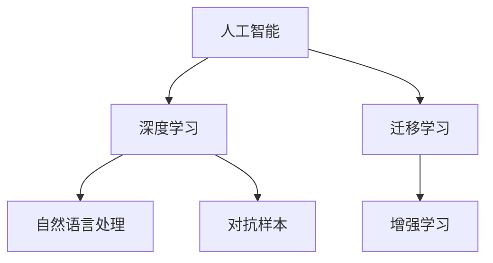

                 

# Andrej Karpathy：人工智能的未来发展目标

## 1. 背景介绍

### 1.1 问题由来

Andrej Karpathy，作为OpenAI研究团队的领军人物，其卓越的学识和洞察力使得他成为人工智能领域的权威。在2019年的《人工智能的未来发展目标》的演讲中，Karpathy提出了他对AI未来发展的展望和策略，为我们描绘了未来AI发展的蓝图。演讲中，Karpathy不仅深入探讨了当前AI领域面临的挑战，还提出了具有前瞻性的发展方向，为AI的未来发展提供了宝贵的见解。

### 1.2 问题核心关键点

Karpathy的演讲主要围绕以下核心问题展开：

- 当前AI领域面临的主要挑战是什么？
- AI技术的突破口在哪些方向？
- 如何构建更加安全和可信的AI系统？
- AI的未来发展路径和目标是什么？

通过深入分析这些问题，Karpathy为我们展示了未来AI的广阔前景和潜在风险。

## 2. 核心概念与联系

### 2.1 核心概念概述

为更好地理解Andrej Karpathy提出的未来AI发展目标，本节将介绍几个密切相关的核心概念：

- 人工智能（AI）：使计算机能够执行人类智力任务的技术，涵盖感知、认知、推理等多个方面。
- 深度学习（Deep Learning）：一种通过多层神经网络实现端到端学习的机器学习方法。
- 迁移学习（Transfer Learning）：将一个领域学到的知识应用到另一个相关领域的机器学习方法。
- 增强学习（Reinforcement Learning）：通过与环境交互，使智能体学习最优决策的机器学习方法。
- 自然语言处理（NLP）：使计算机能够理解和生成人类自然语言的技术。
- 对抗样本（Adversarial Examples）：有意设计的扰动样本，用于攻击机器学习模型的鲁棒性。

这些核心概念之间的逻辑关系可以通过以下Mermaid流程图来展示：



这个流程图展示了一些关键AI技术的联系：

1. 深度学习是实现人工智能的核心技术。
2. 迁移学习通过利用已有知识，加速新任务的学习过程。
3. 自然语言处理是AI应用的重要领域，涉及理解和生成自然语言。
4. 增强学习通过智能体与环境的交互，训练最优策略。
5. 对抗样本揭示了AI模型的脆弱性，对模型鲁棒性提出了更高的要求。

## 3. 核心算法原理 & 具体操作步骤

### 3.1 算法原理概述

在探讨AI未来发展目标之前，首先需要理解当前AI技术的核心算法原理。Karpathy在演讲中提到了以下几个关键算法：

- 深度神经网络（DNN）：由多层神经元组成的网络，能够自动学习特征表示。
- 卷积神经网络（CNN）：专门处理图像和视频数据的神经网络。
- 循环神经网络（RNN）：适用于序列数据处理的神经网络。
- 强化学习（RL）：通过与环境交互，智能体通过试错学习最优策略。

这些算法构成了当前AI技术的基础，使得AI能够在视觉识别、自然语言处理、游戏策略等方面取得显著进展。然而，这些算法也面临着数据稀缺、计算资源消耗大、模型解释性不足等问题。

### 3.2 算法步骤详解

为了应对上述挑战，Karpathy提出了以下几条关键的AI发展路径：

**Step 1: 数据增强和数据利用**

数据是深度学习的生命线，但获取高质量标注数据往往成本高昂。Karpathy提出了以下方法来扩充数据：

- **数据增强（Data Augmentation）**：通过对现有数据进行旋转、缩放、裁剪等操作，生成新的训练样本，增加数据多样性。
- **自监督学习（Self-supervised Learning）**：通过设计预训练任务，在无标签数据上自动学习特征表示。

**Step 2: 高效模型和算法优化**

高效的模型和算法能够显著提升AI系统的性能和效率。Karpathy提出了以下优化方法：

- **模型压缩（Model Compression）**：通过剪枝、量化、蒸馏等方法，减小模型参数量，提升推理速度。
- **分布式训练（Distributed Training）**：通过多机协同训练，加速模型收敛速度。
- **动态计算图（Dynamic Computation Graphs）**：实现灵活的计算图操作，提高模型训练效率。

**Step 3: 模型解释性和鲁棒性**

为了构建可信的AI系统，Karpathy强调了以下几个方面：

- **模型解释性（Model Interpretability）**：通过可视化、可解释性算法（如LIME、SHAP），使得AI模型更加透明、可解释。
- **模型鲁棒性（Model Robustness）**：通过对抗训练、鲁棒正则化等方法，提升模型对扰动的抵抗能力。

### 3.3 算法优缺点

当前的AI算法具有以下优点：

- **强大的泛化能力**：在多个领域中，深度学习模型都能取得显著效果。
- **端到端学习**：能够自动学习特征表示，避免手动特征工程。
- **适应性强**：通过迁移学习，模型能够在多个相关任务上表现出色。

同时，这些算法也存在一些缺点：

- **数据依赖性强**：需要大量标注数据，获取成本高。
- **计算资源消耗大**：训练和推理需要强大的硬件支持。
- **模型解释性不足**：难以理解模型内部工作机制。

## 4. 数学模型和公式 & 详细讲解 & 举例说明

### 4.1 数学模型构建

深度学习模型的核心是神经网络，其数学模型可以表示为：

$$
h_{\theta}(x) = W^Th(x)
$$

其中，$h(x)$ 为输入数据的特征表示，$W$ 为权重矩阵，$\theta$ 为模型参数。模型的损失函数通常采用交叉熵损失：

$$
\mathcal{L}(\theta) = -\frac{1}{N}\sum_{i=1}^N \log p(y_i|x_i)
$$

其中，$p(y_i|x_i)$ 为模型对样本 $(x_i, y_i)$ 的预测概率。

### 4.2 公式推导过程

以下以二分类任务为例，推导最小二乘法的数学推导过程：

$$
\min_{\theta} \mathcal{L}(\theta) = \frac{1}{N}\sum_{i=1}^N (y_i - h_{\theta}(x_i))^2
$$

求导得到：

$$
\nabla_{\theta}\mathcal{L}(\theta) = \frac{2}{N}\sum_{i=1}^N (y_i - h_{\theta}(x_i)) h_{\theta}(x_i)\nabla_{\theta} h_{\theta}(x_i)
$$

通过反向传播算法，求解参数梯度，更新模型参数。

### 4.3 案例分析与讲解

以图像分类任务为例，CNN模型通过卷积层和池化层提取特征，再通过全连接层进行分类。具体实现时，可以使用以下伪代码：

```python
class CNNModel(nn.Module):
    def __init__(self):
        super(CNNModel, self).__init__()
        self.conv1 = nn.Conv2d(3, 32, 3)
        self.pool = nn.MaxPool2d(2, 2)
        self.fc1 = nn.Linear(32 * 8 * 8, 64)
        self.fc2 = nn.Linear(64, 10)

    def forward(self, x):
        x = self.conv1(x)
        x = F.relu(x)
        x = self.pool(x)
        x = self.fc1(x)
        x = F.relu(x)
        x = self.fc2(x)
        return F.log_softmax(x, dim=1)
```

## 5. 项目实践：代码实例和详细解释说明

### 5.1 开发环境搭建

为了快速迭代AI模型，Karpathy推荐使用TensorFlow和PyTorch。具体环境搭建步骤如下：

1. 安装TensorFlow和PyTorch：

```bash
pip install tensorflow
pip install torch
```

2. 安装相关依赖库：

```bash
pip install matplotlib numpy pandas
```

3. 设置虚拟环境：

```bash
conda create -n my_env python=3.7
conda activate my_env
```

### 5.2 源代码详细实现

以图像分类为例，以下是一个简单的CNN模型实现：

```python
import tensorflow as tf
from tensorflow import keras

class CNNModel(tf.keras.Model):
    def __init__(self):
        super(CNNModel, self).__init__()
        self.conv1 = tf.keras.layers.Conv2D(32, 3, activation='relu')
        self.pool = tf.keras.layers.MaxPooling2D(2, 2)
        self.fc1 = tf.keras.layers.Dense(64, activation='relu')
        self.fc2 = tf.keras.layers.Dense(10)

    def call(self, x):
        x = self.conv1(x)
        x = self.pool(x)
        x = self.fc1(x)
        x = self.fc2(x)
        return x
```

### 5.3 代码解读与分析

上述代码实现了最简单的CNN模型，包括卷积层、池化层和全连接层。其中，卷积层用于提取图像特征，池化层用于降低特征维度和提升特征鲁棒性，全连接层用于分类。模型通过反向传播算法，不断优化参数，减小损失函数。

### 5.4 运行结果展示

训练完模型后，可以计算模型在测试集上的准确率：

```python
model = CNNModel()
model.compile(optimizer='adam', loss='sparse_categorical_crossentropy', metrics=['accuracy'])

model.fit(train_images, train_labels, epochs=10, validation_data=(test_images, test_labels))

test_loss, test_acc = model.evaluate(test_images, test_labels)
print(f'Test accuracy: {test_acc}')
```

## 6. 实际应用场景

### 6.1 自动驾驶

自动驾驶是当前AI技术最具潜力的应用之一。Karpathy在演讲中强调了以下几点：

- **感知系统**：利用卷积神经网络（CNN）和循环神经网络（RNN），实现对环境的高效感知和理解。
- **决策系统**：通过强化学习（RL），训练智能体学习最优驾驶策略。
- **数据增强**：通过生成对抗网络（GAN），生成更多的训练数据，提升模型泛化能力。

### 6.2 自然语言处理（NLP）

NLP是AI技术的另一个重要领域。Karpathy提出以下思路：

- **预训练模型**：利用大规模无标签数据，预训练语言模型，如BERT、GPT等。
- **微调**：在特定任务上，通过微调预训练模型，提升模型在该任务上的性能。
- **零样本学习**：通过精心设计的输入模板（Prompt），引导模型在少样本或零样本情况下，完成特定任务。

### 6.3 医疗诊断

在医疗领域，AI技术能够显著提升诊断的准确性和效率。Karpathy提出以下方法：

- **多模态学习**：结合图像、文本、基因等多模态数据，提升模型的诊断能力。
- **自监督学习**：通过无标签数据，自动学习疾病的特征表示。
- **实时监测**：利用深度学习模型，实时监测患者的健康状态，提供个性化医疗建议。

## 7. 工具和资源推荐

### 7.1 学习资源推荐

为了帮助开发者掌握AI技术的核心原理和实践技巧，Karpathy推荐了以下学习资源：

- **斯坦福大学《深度学习》课程**：由Andrew Ng教授主讲，涵盖深度学习的基本概念和经典模型。
- **CS231n《卷积神经网络》课程**：由斯坦福大学开设，介绍卷积神经网络在图像识别中的应用。
- **Deep Learning with PyTorch**：Karpathy撰写的书籍，详细介绍了PyTorch的用法和深度学习模型的实现。
- **TensorFlow官方文档**：TensorFlow的官方文档，包含丰富的模型和算法实现。

### 7.2 开发工具推荐

Karpathy推荐了以下工具，帮助开发者高效开发AI模型：

- **Jupyter Notebook**：支持Python和TensorFlow/PyTorch，用于快速迭代模型和算法。
- **TensorBoard**：TensorFlow的可视化工具，用于监测模型训练状态和性能。
- **HuggingFace Transformers库**：提供了大量预训练模型和微调工具，方便快速构建AI应用。
- **PyTorch Lightning**：封装了PyTorch的模型训练过程，简化开发复杂度。

### 7.3 相关论文推荐

为了深入理解AI技术的最新进展，Karpathy推荐了以下论文：

- **ImageNet Classification with Deep Convolutional Neural Networks**：AlexNet论文，奠定了卷积神经网络在图像识别中的地位。
- **Deep Residual Learning for Image Recognition**：ResNet论文，提出了残差连接技术，解决了深度网络训练中的梯度消失问题。
- **Attention is All You Need**：Transformer论文，提出了自注意力机制，大大提升了NLP任务的性能。
- **BERT: Pre-training of Deep Bidirectional Transformers for Language Understanding**：BERT论文，提出预训练-微调范式，提升了语言模型的效果。

## 8. 总结：未来发展趋势与挑战

### 8.1 总结

Karpathy在演讲中系统地梳理了当前AI技术的核心原理和未来发展方向。通过深入分析AI面临的挑战和突破口，Karpathy为我们描绘了未来AI的广阔前景。以下几点值得重点关注：

- **数据增强**：通过数据增强和自监督学习，解决数据稀缺问题。
- **高效模型和算法**：通过模型压缩、分布式训练等方法，提升模型效率。
- **模型解释性和鲁棒性**：通过可解释性算法和对抗训练，提升模型可信度。
- **多模态学习和自监督学习**：结合多种数据模态，提升模型性能。

### 8.2 未来发展趋势

Karpathy认为，未来AI的发展趋势主要集中在以下几个方向：

- **自主学习和自监督学习**：减少对标注数据的依赖，通过无监督学习自动学习特征表示。
- **多模态学习**：结合图像、视频、文本等多种数据模态，提升模型的感知能力。
- **实时监测和自适应学习**：利用实时数据，动态调整模型参数，提升模型的适应性。
- **模型压缩和加速**：通过模型压缩和加速算法，提升模型的推理效率。

### 8.3 面临的挑战

尽管AI技术取得了显著进展，但未来仍面临以下挑战：

- **数据稀缺**：获取高质量标注数据仍然需要大量人力物力。
- **模型复杂性**：大模型参数量大，推理速度慢，计算资源消耗大。
- **模型解释性**：复杂模型难以解释其内部工作机制。
- **伦理和安全**：AI模型可能产生偏见和有害输出，需要严格监管。

### 8.4 研究展望

未来AI的研究需要围绕以下几个方向展开：

- **数据生成和增强**：通过生成对抗网络（GAN）和自监督学习，生成更多的训练数据。
- **模型压缩和加速**：研究更高效的模型结构和训练算法，提高模型推理效率。
- **模型解释性**：开发可解释性算法，提升模型的透明性。
- **伦理和安全**：设计模型训练目标和评估指标，确保模型输出符合伦理和安全要求。

## 9. 附录：常见问题与解答

**Q1：什么是深度学习？**

A: 深度学习是一种通过多层神经网络实现端到端学习的机器学习方法，能够自动学习特征表示。

**Q2：如何构建高效的模型？**

A: 可以通过模型压缩、分布式训练等方法，减小模型参数量，提升模型效率。

**Q3：AI模型如何解释？**

A: 可以通过可视化、可解释性算法（如LIME、SHAP），使得AI模型更加透明、可解释。

**Q4：如何提升模型的鲁棒性？**

A: 通过对抗训练、鲁棒正则化等方法，提升模型对扰动的抵抗能力。

**Q5：AI的未来发展目标是什么？**

A: 未来AI的发展目标主要集中在自主学习和自监督学习、多模态学习、实时监测和自适应学习、模型压缩和加速等方面。

---

作者：禅与计算机程序设计艺术 / Zen and the Art of Computer Programming

