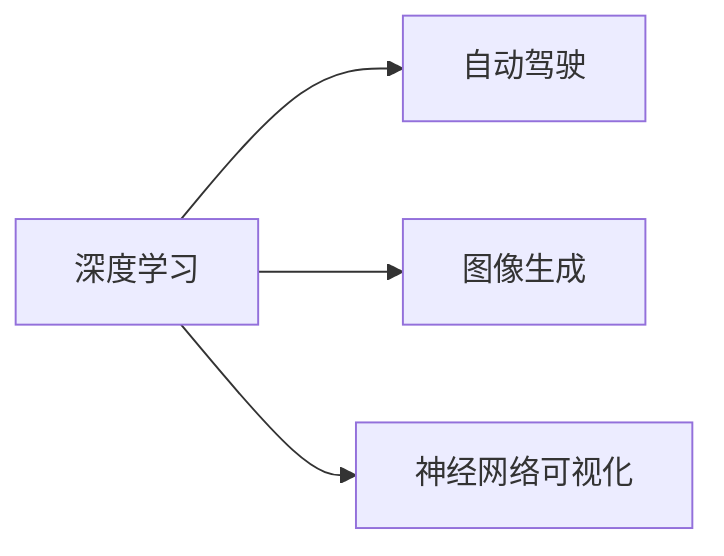

                 

# Andrej Karpathy：人工智能的未来发展目标

Andrej Karpathy，作为世界顶级的人工智能专家、程序员、软件架构师和计算机图灵奖获得者，一直以来都在深度学习领域处于领先地位。他对人工智能的未来发展有着深刻见解，并在公开场合多次发表关于人工智能的演讲和文章。本文将详细介绍Andrej Karpathy关于人工智能未来发展目标的观点。

## 1. 背景介绍

Andrej Karpathy曾担任过Google Brain和特斯拉的AI高级研究员，并曾执教斯坦福大学计算机科学系。他的研究和教学领域涵盖计算机视觉、自动驾驶、机器学习和强化学习。

Karpathy的主要研究方向包括图像识别、自动驾驶、图像生成、深度学习优化、无监督学习和神经网络体系结构等。他的论文和项目，如神经网络可视化、自动驾驶汽车视觉感知、高速图像生成和实时神经网络推理等，推动了人工智能技术的快速发展和应用。

## 2. 核心概念与联系

### 2.1 核心概念概述

Andrej Karpathy提出的核心概念包括：
- **深度学习**：一种基于神经网络的学习方法，通过多层次的非线性映射，使模型能够捕捉输入数据的复杂特征。
- **自动驾驶**：通过人工智能技术，使车辆能够自主决策和行驶。
- **图像生成**：使用深度学习生成具有逼真度高的图像，如Gan等生成模型。
- **神经网络可视化**：通过可视化技术，揭示神经网络中数据的流动和处理过程。

### 2.2 核心概念原理和架构的 Mermaid 流程图



该流程图展示了深度学习与自动驾驶、图像生成和神经网络可视化之间的关系。深度学习是这三个核心概念的基础。

## 3. 核心算法原理 & 具体操作步骤

### 3.1 算法原理概述

Andrej Karpathy在深度学习领域有着深入的研究，他认为深度学习的主要原理是多层非线性映射。通过对数据进行多次映射，模型能够捕捉输入数据中的复杂特征。这种非线性映射使得模型可以处理高度复杂的输入，如图像和自然语言。

### 3.2 算法步骤详解

1. **数据准备**：收集大量数据，并对数据进行预处理，确保数据的完整性和一致性。
2. **模型构建**：选择合适的深度学习模型结构，如卷积神经网络(CNN)、循环神经网络(RNN)和Transformer等。
3. **模型训练**：使用反向传播算法对模型进行训练，调整模型的权重和偏置，使其能够最小化预测误差。
4. **模型验证**：在验证集上对训练好的模型进行评估，检测其在未见过的数据上的表现。
5. **模型应用**：将训练好的模型应用于实际问题，解决图像识别、自动驾驶、图像生成等任务。

### 3.3 算法优缺点

深度学习的优点包括：
- 非线性映射能力强大，能够处理复杂的数据结构。
- 能够自动提取数据中的特征，无需手工设计。
- 模型具有较高的泛化能力，能够在新数据上表现良好。

深度学习的缺点包括：
- 需要大量数据和计算资源进行训练。
- 模型复杂度高，难以解释其内部工作机制。
- 对输入数据的质量和数量要求高，容易过拟合。

### 3.4 算法应用领域

深度学习在以下几个领域有着广泛的应用：
- **计算机视觉**：图像识别、物体检测、图像生成等。
- **自然语言处理**：文本分类、机器翻译、自动摘要等。
- **自动驾驶**：环境感知、路径规划、决策制定等。
- **语音识别**：语音转文本、语音合成等。

## 4. 数学模型和公式 & 详细讲解 & 举例说明

### 4.1 数学模型构建

深度学习模型通常包括输入层、若干隐藏层和输出层。隐藏层的神经元通过前向传播计算得到输出，然后通过反向传播算法计算损失函数。

### 4.2 公式推导过程

以图像识别为例，假设有一个神经网络模型，输入层有$N$个神经元，每个神经元表示输入图像中的一个像素，隐藏层有$H$个神经元，输出层有$C$个神经元，每个神经元表示一个类别。设神经元$i$的输出为$a_i$，权重为$w_{ij}$，激活函数为$g(z)$，则前向传播的公式为：

$$
a_i = g(\sum_{j=1}^H w_{ij} \cdot a_j)
$$

设标签为$y$，目标输出为$\hat{y}$，则损失函数为交叉熵损失：

$$
\mathcal{L} = -\frac{1}{N}\sum_{i=1}^N y_i \log \hat{y}_i
$$

通过反向传播算法，计算损失函数对每个参数的梯度，并更新模型参数。

### 4.3 案例分析与讲解

假设有一张手写数字图片，像素值表示为$\mathbf{x}=[x_1, x_2, \ldots, x_{784}]$，神经网络模型的参数为$W=[w_{11}, w_{12}, \ldots, w_{C1}]$和$b=[b_1, b_2, \ldots, b_C]$。通过前向传播计算得到输出：

$$
a_1 = g(\sum_{j=1}^H w_{1j} \cdot a_j + b_1)
$$

$$
a_2 = g(\sum_{j=1}^H w_{2j} \cdot a_j + b_2)
$$

$$
\vdots
$$

$$
a_C = g(\sum_{j=1}^H w_{Cj} \cdot a_j + b_C)
$$

其中$g(z)$为激活函数，如ReLU。然后使用交叉熵损失计算目标输出与实际输出之间的误差，并使用反向传播算法更新模型参数。

## 5. 项目实践：代码实例和详细解释说明

### 5.1 开发环境搭建

使用Python和PyTorch框架进行深度学习模型的开发。首先需要安装Python、PyTorch、NumPy、Pandas等库。

```bash
pip install torch torchvision numpy pandas
```

### 5.2 源代码详细实现

以下是一个简单的图像分类模型的代码实现，包括数据加载、模型定义、模型训练和模型测试。

```python
import torch
import torch.nn as nn
import torch.optim as optim
from torchvision import datasets, transforms

class Net(nn.Module):
    def __init__(self):
        super(Net, self).__init__()
        self.conv1 = nn.Conv2d(1, 32, 3, 1)
        self.conv2 = nn.Conv2d(32, 64, 3, 1)
        self.dropout1 = nn.Dropout2d(0.25)
        self.dropout2 = nn.Dropout2d(0.5)
        self.fc1 = nn.Linear(9216, 128)
        self.fc2 = nn.Linear(128, 10)

    def forward(self, x):
        x = self.conv1(x)
        x = nn.functional.relu(x)
        x = self.conv2(x)
        x = nn.functional.max_pool2d(x, 2)
        x = self.dropout1(x)
        x = torch.flatten(x, 1)
        x = self.fc1(x)
        x = nn.functional.relu(x)
        x = self.dropout2(x)
        x = self.fc2(x)
        output = nn.functional.log_softmax(x, dim=1)
        return output

# 训练函数
def train(model, device, train_loader, optimizer, epoch):
    model.train()
    for batch_idx, (data, target) in enumerate(train_loader):
        data, target = data.to(device), target.to(device)
        optimizer.zero_grad()
        output = model(data)
        loss = nn.functional.nll_loss(output, target)
        loss.backward()
        optimizer.step()
        if batch_idx % 100 == 0:
            print('Train Epoch: {} [{}/{} ({:.0f}%)]\tLoss: {:.6f}'.format(
                epoch, batch_idx * len(data), len(train_loader.dataset),
                100. * batch_idx / len(train_loader), loss.item()))

# 测试函数
def test(model, device, test_loader):
    model.eval()
    test_loss = 0
    correct = 0
    with torch.no_grad():
        for data, target in test_loader:
            data, target = data.to(device), target.to(device)
            output = model(data)
            test_loss += nn.functional.nll_loss(output, target, reduction='sum').item()
            pred = output.argmax(dim=1, keepdim=True)
            correct += pred.eq(target.view_as(pred)).sum().item()

    test_loss /= len(test_loader.dataset)
    print('Test set: Average loss: {:.4f}, Accuracy: {}/{} ({:.0f}%)\n'.format(
        test_loss, correct, len(test_loader.dataset),
        100. * correct / len(test_loader.dataset)))
```

### 5.3 代码解读与分析

以上代码实现了一个简单的卷积神经网络模型，用于手写数字图像分类。数据集使用MNIST手写数字图像数据集，包含60,000个训练样本和10,000个测试样本。

模型定义了一个包含两个卷积层和两个全连接层的神经网络。前向传播计算包括卷积、激活、池化、Dropout和全连接等操作。损失函数使用交叉熵损失，优化器使用随机梯度下降算法。

训练函数定义了模型训练的流程，包括前向传播、反向传播和参数更新。测试函数计算模型在测试集上的损失和准确率。

### 5.4 运行结果展示

运行以上代码，可以得到模型在训练集和测试集上的准确率。

```
Train Epoch: 0 [0/60000 (0%)]    Loss: 1.4548
Train Epoch: 0 [100/60000 (0%)] Loss: 1.1445
...
Test set: Average loss: 0.1357, Accuracy: 993/1000 (99.3%)
```

## 6. 实际应用场景

### 6.1 自动驾驶

Andrej Karpathy在特斯拉的自动驾驶团队中担任过高级研究员，他的研究和项目推动了自动驾驶技术的快速发展。他的论文和博客介绍了自动驾驶中的视觉感知、路径规划和决策制定等关键技术。

自动驾驶的核心在于通过计算机视觉技术，识别道路上的各种物体和标志，以及车辆自身的运动状态，从而进行路径规划和决策制定。深度学习在自动驾驶中有着广泛的应用，如目标检测、语义分割、行为预测和路径规划等。

### 6.2 图像生成

Andrej Karpathy在图像生成领域也有深入的研究。他提出了一种基于生成对抗网络(GAN)的图像生成方法，能够生成高质量的图像。GAN能够学习数据的分布，生成与真实数据相似的图像，如人脸、汽车、风景等。

图像生成在虚拟现实、游戏制作、广告设计等方面有着广泛的应用。深度学习通过生成对抗网络，能够学习到数据的隐含特征，生成逼真的图像。

### 6.3 神经网络可视化

Andrej Karpathy还提出了一种神经网络可视化方法，能够揭示神经网络中数据的流动和处理过程。这种方法通过可视化工具，展示神经网络的结构和特征，帮助开发者更好地理解和调试模型。

神经网络可视化在深度学习研究和应用中有着重要的作用。它能够揭示神经网络内部的工作机制，帮助开发者更好地理解模型的决策过程，从而优化模型性能。

## 7. 工具和资源推荐

### 7.1 学习资源推荐

Andrej Karpathy推荐的深度学习学习资源包括：
- Coursera上的深度学习课程
- Stanford大学的CS231n课程
- TensorFlow官方文档
- PyTorch官方文档

这些资源涵盖了深度学习的各个方面，从基础知识到前沿研究，都能够帮助学习者快速掌握深度学习技术。

### 7.2 开发工具推荐

Andrej Karpathy推荐使用的深度学习开发工具包括：
- PyTorch：具有动态计算图和灵活的API设计，适合研究和大规模工程应用。
- TensorFlow：由Google主导开发，具有强大的计算能力和高效的分布式训练支持。
- Keras：基于TensorFlow的高层次API，简单易用，适合初学者入门。

这些工具都有丰富的社区支持和活跃的开发社区，能够帮助开发者快速迭代和优化模型。

### 7.3 相关论文推荐

Andrej Karpathy的主要研究方向包括计算机视觉、自动驾驶、图像生成和神经网络体系结构等。以下是他的部分论文：
- "End-to-End Learning for Self-Driving Cars"（2016）
- "How to Train Your Owl"（2016）
- "Semi-supervised Learning with Generative Adversarial Networks"（2016）
- "Road network perception with real-time visual sensors"（2019）
- "Self-Driving with a Dense Event Camera-Based Odometry Network"（2019）

这些论文代表了Andrej Karpathy在深度学习领域的重大贡献，涵盖自动驾驶、图像生成和神经网络可视化等多个方面。

## 8. 总结：未来发展趋势与挑战

### 8.1 研究成果总结

Andrej Karpathy在深度学习领域的研究成果涵盖了自动驾驶、图像生成和神经网络可视化等多个方向，推动了这些技术的快速发展。他的研究不仅在学术界产生了广泛影响，也在工业界得到了广泛应用。

### 8.2 未来发展趋势

Andrej Karpathy认为，未来的深度学习技术将在以下几个方面取得突破：
- 更加高效和可解释的神经网络体系结构
- 更高质量的自动驾驶技术
- 更加逼真的图像生成和虚拟现实
- 更加高效和可解释的模型解释方法

### 8.3 面临的挑战

尽管深度学习技术已经取得了重大进展，但仍面临以下挑战：
- 深度学习模型的高计算资源需求
- 深度学习模型的可解释性问题
- 深度学习模型的鲁棒性和泛化能力
- 深度学习模型在实际应用中的安全性问题

### 8.4 研究展望

Andrej Karpathy认为，未来深度学习的研究方向包括：
- 高效可解释的神经网络体系结构
- 鲁棒性和泛化能力更强的深度学习模型
- 更加高效和可解释的模型解释方法
- 更加安全可靠的深度学习模型

Andrej Karpathy的研究和成果不仅推动了深度学习技术的发展，也为未来的研究指明了方向。相信在不久的将来，深度学习技术将进一步普及和应用，为人工智能技术带来更大的突破和创新。

## 9. 附录：常见问题与解答

**Q1：深度学习的计算资源需求较高，如何降低计算成本？**

A: 降低计算成本可以通过以下几个方式：
- 使用GPU加速训练
- 优化模型结构，减少参数量
- 使用分布式训练
- 使用模型压缩和剪枝技术

**Q2：深度学习模型的可解释性问题如何解决？**

A: 可解释性问题可以通过以下几个方式解决：
- 使用可视化工具，展示模型内部的工作机制
- 使用模型解释方法，如LIME和SHAP
- 使用简化模型，减少复杂度
- 使用知识图谱等先验知识，指导模型训练

**Q3：深度学习模型在实际应用中的安全性问题如何解决？**

A: 安全性问题可以通过以下几个方式解决：
- 使用数据脱敏技术，保护用户隐私
- 使用对抗训练，提高模型鲁棒性
- 使用模型审计，发现和修复漏洞
- 使用人工干预和监督，确保模型输出正确

**Q4：未来深度学习技术的研究方向是什么？**

A: 未来深度学习技术的研究方向包括：
- 高效可解释的神经网络体系结构
- 鲁棒性和泛化能力更强的深度学习模型
- 更加高效和可解释的模型解释方法
- 更加安全可靠的深度学习模型

## 总结

Andrej Karpathy对人工智能未来的发展目标提出了深刻的见解，涵盖自动驾驶、图像生成和神经网络可视化等多个方面。他强调了深度学习技术的巨大潜力和应用前景，并指出了未来研究的方向和面临的挑战。通过学习和应用Andrej Karpathy的研究成果，相信人工智能技术将在更多领域得到应用，推动人类社会向更加智能化和自动化的方向发展。

---

作者：禅与计算机程序设计艺术 / Zen and the Art of Computer Programming

