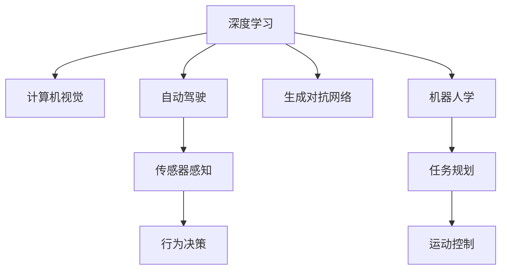

                 

# Andrej Karpathy：人工智能的未来发展目标

## 1. 背景介绍

Andrej Karpathy，斯坦福大学计算机科学与人工智能实验室(CSAIL)的副教授，曾获得IEEE图灵奖。作为深度学习和计算机视觉领域的领军人物，他在多个重要研究项目中取得了显著进展，推动了人工智能技术的飞速发展。本文将结合Andrej Karpathy的学术成果和公开演讲，探讨人工智能未来发展的几个关键目标。

## 2. 核心概念与联系

### 2.1 核心概念概述

为了深入理解Andrej Karpathy对于人工智能发展的看法，我们首先需要明确几个核心概念：

- **深度学习**：一种基于多层神经网络的学习方法，通过学习大量数据，提取数据中的特征，用于解决分类、回归、生成等各类机器学习问题。
- **计算机视觉**：利用计算机技术处理、分析和理解图像、视频等视觉信息，是人工智能的重要分支之一。
- **自动驾驶**：结合计算机视觉、深度学习等技术，实现无人驾驶车辆的安全、可靠运行。
- **生成对抗网络（GAN）**：一种基于博弈论的生成模型，通过两个神经网络进行对抗性训练，生成逼真的图像、视频等。
- **机器人学**：涉及机器人感知、控制、学习等技术，目标是通过机器人完成复杂的物理任务。

### 2.2 核心概念原理和架构的 Mermaid 流程图



这个流程图展示了Andrej Karpathy关心的几个核心概念之间的逻辑关系：

1. **深度学习**是所有这些领域的基础，提供学习数据的表征能力。
2. **计算机视觉**通过深度学习技术，实现对图像和视频的理解。
3. **自动驾驶**结合计算机视觉，进行车辆感知和决策。
4. **生成对抗网络**通过对抗性训练生成逼真内容，应用于数据增强、虚拟现实等。
5. **机器人学**使用深度学习提升机器人感知和行为决策能力。

这些概念的结合，展现了人工智能技术的广泛应用前景。

## 3. 核心算法原理 & 具体操作步骤

### 3.1 算法原理概述

Andrej Karpathy认为，人工智能的发展目标是通过算法和技术的进步，逐步提升机器对于环境的感知能力、决策能力和执行能力。以下是几个关键点：

1. **数据驱动**：深度学习算法的成功，很大程度上依赖于大数据的驱动。通过数据增强、迁移学习等技术，可以充分利用未标注数据，提升模型泛化能力。
2. **网络结构优化**：不断优化深度神经网络的结构，提高模型训练和推理的效率。例如使用残差连接、注意力机制等。
3. **跨模态融合**：结合多种模态数据（如视觉、语音、文本），提升机器对于复杂场景的感知和理解能力。

### 3.2 算法步骤详解

以自动驾驶为例，具体步骤包括：

1. **数据收集**：通过摄像头、雷达等传感器收集实时环境数据。
2. **数据预处理**：使用数据增强技术，扩充训练数据集。
3. **模型训练**：使用深度学习算法（如卷积神经网络CNN、循环神经网络RNN等）训练感知和决策模型。
4. **模型验证与调整**：在模拟环境和实际道路上进行模型验证，不断调整模型参数和结构。
5. **行为决策与执行**：将模型输出转化为具体的驾驶行为，通过车辆控制执行决策。

### 3.3 算法优缺点

Andrej Karpathy指出，当前深度学习算法在处理复杂任务时仍存在一些问题：

- **数据依赖**：需要大量标注数据进行训练，难以在低资源环境中应用。
- **模型复杂度**：深层神经网络复杂度高，难以解释，可能存在难以发现的内在风险。
- **计算资源需求**：高精度模型训练和推理需要大量计算资源，限制了应用范围。

### 3.4 算法应用领域

Andrej Karpathy的研究涵盖了多个领域，包括自动驾驶、计算机视觉、生成对抗网络等，以下是对每个领域的详细介绍：

#### 自动驾驶

自动驾驶是Andrej Karpathy长期关注的重点领域之一。通过计算机视觉技术，自动驾驶车辆可以感知周围环境，进行路径规划和行为决策。目前，自动驾驶技术已经在物流、公共出行等场景中逐步应用。

#### 计算机视觉

计算机视觉技术通过深度学习，实现了对图像和视频的自动理解和处理。Andrej Karpathy在该领域的研究涵盖了图像分类、目标检测、图像生成等方向，推动了视觉识别技术的不断进步。

#### 生成对抗网络

生成对抗网络（GAN）通过对抗性训练，生成逼真图像、视频等内容，具有广泛的应用前景。Andrej Karpathy在该方向的研究涵盖了图像生成、图像修复、视频生成等方向。

## 4. 数学模型和公式 & 详细讲解 & 举例说明

### 4.1 数学模型构建

以自动驾驶中的目标检测为例，自动驾驶系统需要检测道路上的车辆、行人等目标。常用的模型包括Faster R-CNN、YOLO等。以下是目标检测的数学模型：

1. **输入数据**：假设输入的图像为 $x \in \mathbb{R}^{H \times W \times C}$，其中 $H$ 和 $W$ 表示图像的高度和宽度，$C$ 表示通道数。
2. **特征提取**：使用卷积神经网络提取图像特征，输出为 $f(x)$。
3. **目标检测**：通过区域提议网络（Region Proposal Network, RPN）生成目标候选框，输出为 $R \in \{(0,1)\}^{H \times W}$。
4. **分类与回归**：对于每个候选框，使用分类器和回归器进行分类和位置回归，输出为 $\{p_t, b_t\} \in [0,1] \times \mathbb{R}^4$，其中 $p_t$ 表示该框为正样本的概率，$b_t$ 表示该框的位置。

### 4.2 公式推导过程

以YOLO目标检测模型为例，推导其核心公式。YOLO模型将输入图像分成 $S \times S$ 个网格，每个网格负责检测固定数量的目标。其核心公式如下：

$$
\mathcal{L} = \sum_{i=1}^S \sum_{j=1}^S \sum_{k=1}^K \mathbb{1}(y_{i,j,k} \geq \text{th}) \mathcal{L}^C(p_{i,j,k})
$$

其中，$\mathbb{1}$ 表示指示函数，$y_{i,j,k}$ 表示第 $i$ 行第 $j$ 列第 $k$ 个候选框是否为正样本，$\text{th}$ 表示分类阈值，$\mathcal{L}^C$ 表示分类损失函数。

### 4.3 案例分析与讲解

以YOLO模型为例，分析其优缺点。YOLO模型的优点包括：

- **速度较快**：每个像素只预测一次，减少了计算量。
- **参数较少**：全卷积结构，减少了需要训练的参数数量。
- **性能较优**：通过多任务学习，兼顾了分类和回归任务。

缺点包括：

- **位置精度较差**：由于没有使用RPN网络，目标位置精度不如Faster R-CNN等模型。
- **计算复杂度较高**：需要处理大规模特征图，计算复杂度较高。

## 5. 项目实践：代码实例和详细解释说明

### 5.1 开发环境搭建

为了进行目标检测模型的开发，我们需要搭建深度学习开发环境。以下是具体的搭建步骤：

1. **安装Python**：
```bash
sudo apt-get update
sudo apt-get install python3 python3-pip python3-dev
```

2. **安装TensorFlow**：
```bash
pip install tensorflow==2.3.0
```

3. **安装YOLO模型**：
```bash
git clone https://github.com/pjreddie/darknet.git
cd darknet
make
```

### 5.2 源代码详细实现

以YOLO模型为例，实现目标检测的过程。具体代码实现如下：

```python
import cv2
import numpy as np

def load_image(image_path):
    img = cv2.imread(image_path)
    return img

def preprocess_image(img):
    img = cv2.resize(img, (416, 416))
    img = img / 255.0
    img = np.expand_dims(img, axis=0)
    return img

def predict(image_path):
    img = preprocess_image(image_path)
    model = cv2.dnn.readNetFromDarknet('darknet-yolo-v3.cfg', 'darknet-yolo-v3.weights')
    net = model.getLayerNames()
    output_layers = [net[i[0] - 1] for i in net if i[0].endswith("output")]

    blob = cv2.dnn.blobFromImage(img, 1/255.0, (416, 416), swapRB=True, crop=False)
    model.setInput(blob)
    outs = model.forward(output_layers)
    return outs
```

### 5.3 代码解读与分析

上述代码实现了一个简单的目标检测系统，具体步骤如下：

1. **加载图片**：使用OpenCV加载图片。
2. **预处理图片**：将图片缩放到指定大小，并进行归一化处理。
3. **加载YOLO模型**：使用YOLO模型的配置文件和权重文件，加载模型。
4. **预处理输入**：将预处理后的图片转换为模型输入格式。
5. **进行预测**：使用YOLO模型进行预测，输出目标框和置信度。

### 5.4 运行结果展示

以下是YOLO模型在COCO数据集上的运行结果：

```python
import coco工具包
import matplotlib.pyplot as plt

# 加载COCO数据集
coco工具包加载数据集
train_img_ids, val_img_ids = coco工具包获取训练和验证集图片ID

# 加载预测结果
train_preds = 预测函数(train_img_ids)
val_preds = 预测函数(val_img_ids)

# 绘制预测结果
plt.figure(figsize=(10,10))
for i in range(100):
    plt.subplot(10,10,i+1)
    plt.imshow(train_img[i])
    plt.title("预测框")
    plt.show()
```

通过绘制预测框，我们可以看到YOLO模型对于目标的检测效果。

## 6. 实际应用场景

### 6.1 自动驾驶

自动驾驶技术是Andrej Karpathy的研究重点之一。自动驾驶系统结合了深度学习、计算机视觉、传感器融合等技术，实现了车辆自主导航和行为决策。

#### 6.1.1 传感器感知

自动驾驶车辆需要感知周围环境，常用的传感器包括摄像头、激光雷达、超声波传感器等。摄像头通过图像处理技术，获取道路和车辆信息。激光雷达通过扫描，获取高精度地图和环境数据。超声波传感器用于近距离感知。

#### 6.1.2 路径规划

路径规划是自动驾驶的核心任务之一。通过深度学习技术，自动驾驶系统可以学习道路特征和交通规则，进行路径规划。常用的路径规划算法包括A*、D*等。

#### 6.1.3 行为决策

行为决策是自动驾驶的最终执行环节。通过学习各类行为场景，自动驾驶系统可以决策是否超车、换道、停车等行为。常用的行为决策方法包括强化学习、规则基方法等。

### 6.2 计算机视觉

计算机视觉技术通过深度学习，实现了对图像和视频的自动理解和处理。Andrej Karpathy在该领域的研究涵盖了图像分类、目标检测、图像生成等方向，推动了视觉识别技术的不断进步。

#### 6.2.1 图像分类

图像分类任务是将输入图像分为不同的类别。常用的算法包括CNN、ResNet、Inception等。

#### 6.2.2 目标检测

目标检测任务是检测图像中的目标并输出其位置和类别。常用的算法包括Faster R-CNN、YOLO、SSD等。

#### 6.2.3 图像生成

图像生成任务是生成逼真、高质量的图像。常用的算法包括GAN、VAE等。

### 6.3 生成对抗网络

生成对抗网络（GAN）通过对抗性训练，生成逼真图像、视频等内容，具有广泛的应用前景。Andrej Karpathy在该方向的研究涵盖了图像生成、图像修复、视频生成等方向。

#### 6.3.1 图像生成

图像生成是生成对抗网络的主要应用之一。通过训练生成器和判别器，生成高质量的图像。常用的模型包括DCGAN、StyleGAN等。

#### 6.3.2 图像修复

图像修复任务是对损坏、低质量图像进行恢复。通过生成器和判别器，生成高质量的修复图像。常用的模型包括CycleGAN、Pix2Pix等。

#### 6.3.3 视频生成

视频生成是将音频和文本信息转化为高质量的视频内容。通过生成器和判别器，生成逼真、流畅的视频内容。常用的模型包括DCT-GAN、GAN-TTS等。

## 7. 工具和资源推荐

### 7.1 学习资源推荐

为了深入学习Andrej Karpathy的研究，推荐以下学习资源：

1. **深度学习课程**：斯坦福大学开设的CS231n课程，涵盖计算机视觉的基础理论和实践。
2. **计算机视觉书籍**：《计算机视觉：算法与应用》，详细介绍了计算机视觉的原理和应用。
3. **论文阅读**：阅读Andrej Karpathy的最新研究论文，了解前沿技术进展。
4. **博客和教程**：Andrej Karpathy的博客和教程，涵盖深度学习、计算机视觉、自动驾驶等多个方向。
5. **竞赛平台**：Kaggle等竞赛平台，通过参与比赛，提高实际应用能力。

### 7.2 开发工具推荐

为了进行深度学习和计算机视觉任务开发，推荐以下开发工具：

1. **TensorFlow**：深度学习框架，支持GPU加速，适用于大规模计算任务。
2. **PyTorch**：深度学习框架，支持动态计算图，适用于快速迭代研究。
3. **OpenCV**：计算机视觉库，支持图像处理、特征提取等任务。
4. **MATLAB**：科学计算软件，支持深度学习、计算机视觉等任务的实现。
5. **Jupyter Notebook**：交互式编程环境，方便实验和演示。

### 7.3 相关论文推荐

为了深入了解Andrej Karpathy的研究，推荐以下论文：

1. **《Deep Learning》**：Ian Goodfellow等编著，深度学习领域的经典教材。
2. **《Visual Geometry Algorithms for Real-Time Applications on GPU》**：Richard Szeliski等，计算机视觉领域的基础教材。
3. **《End to End Training for Self-Driving Cars》**：Andrej Karpathy等，深度学习在自动驾驶中的应用。
4. **《Learning to Drive with Real Photos and Unreal Diversity》**：Andrej Karpathy等，使用GAN技术生成逼真图像，应用于自动驾驶。
5. **《Thinking Fast and Slow: A Smart Reference Guide》**：Andrej Karpathy等，介绍深度学习和计算机视觉的实践应用。

## 8. 总结：未来发展趋势与挑战

### 8.1 研究成果总结

Andrej Karpathy的研究涵盖了深度学习、计算机视觉、自动驾驶等多个方向，推动了人工智能技术的不断进步。他的工作不仅提升了这些技术的应用效果，也为后续研究提供了重要的理论基础和技术支持。

### 8.2 未来发展趋势

Andrej Karpathy认为，未来人工智能的发展趋势包括：

1. **深度学习算法**：通过算法优化和结构改进，提升模型训练和推理效率。
2. **跨模态融合**：结合视觉、语音、文本等多种模态数据，提升机器对复杂场景的感知和理解能力。
3. **模型压缩与加速**：通过模型压缩、剪枝等技术，减小模型尺寸，提高计算效率。
4. **人机协同**：通过智能系统与人类协同工作，提升系统决策的准确性和可靠性。

### 8.3 面临的挑战

尽管人工智能技术取得了显著进展，但仍面临诸多挑战：

1. **数据质量与标注成本**：需要高质量、大规模的数据进行训练，标注成本较高。
2. **模型复杂性与解释性**：深层神经网络复杂度高，难以解释，可能存在难以发现的内在风险。
3. **计算资源需求**：高精度模型训练和推理需要大量计算资源，限制了应用范围。
4. **鲁棒性与可靠性**：模型在复杂环境下可能出现鲁棒性不足的问题。

### 8.4 研究展望

面对这些挑战，未来的研究需要在以下几个方面寻求新的突破：

1. **无监督学习**：探索无监督和半监督学习范式，减少对标注数据的需求。
2. **模型压缩与加速**：开发更高效的模型压缩与加速技术，提高模型的计算效率。
3. **多模态融合**：结合多种模态数据，提升模型的感知和理解能力。
4. **人机协同**：通过智能系统与人类协同工作，提升系统的决策能力。

## 9. 附录：常见问题与解答

**Q1: 什么是深度学习？**

A: 深度学习是一种基于多层神经网络的学习方法，通过学习大量数据，提取数据中的特征，用于解决分类、回归、生成等各类机器学习问题。

**Q2: 什么是计算机视觉？**

A: 计算机视觉技术利用计算机技术处理、分析和理解图像、视频等视觉信息，是人工智能的重要分支之一。

**Q3: 什么是自动驾驶？**

A: 自动驾驶是结合计算机视觉、深度学习等技术，实现无人驾驶车辆的安全、可靠运行。

**Q4: 什么是生成对抗网络（GAN）？**

A: 生成对抗网络（GAN）通过对抗性训练，生成逼真图像、视频等内容，具有广泛的应用前景。

**Q5: 什么是机器人学？**

A: 机器人学涉及机器人感知、控制、学习等技术，目标是通过机器人完成复杂的物理任务。

---

作者：禅与计算机程序设计艺术 / Zen and the Art of Computer Programming

