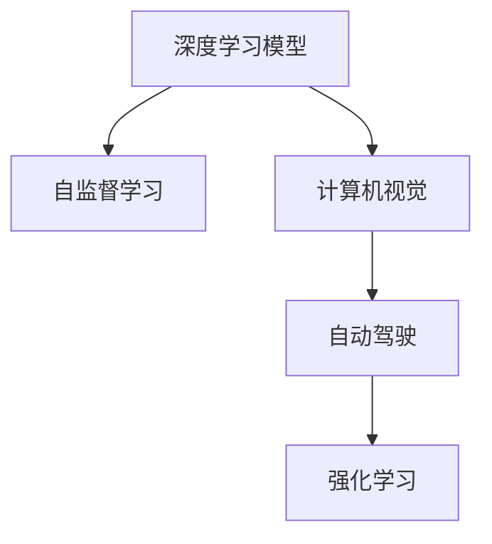

                 

# Andrej Karpathy：人工智能的未来发展目标

## 1. 背景介绍

### 1.1 问题由来
Andrej Karpathy，作为斯坦福大学计算机科学系教授和DeepMind AI Research的高级研究员，长期关注和研究人工智能技术的发展。他在神经网络架构、计算机视觉、深度学习等领域有着深刻的见解，并提出了一系列前瞻性的研究目标。

Karpathy认为，人工智能正在经历前所未有的快速发展，未来的发展目标不仅仅是提升模型的性能，更需要考虑如何让人工智能更好地服务于人类，解决现实生活中的实际问题。他的研究目标涵盖了深度学习模型的改进、计算机视觉技术的创新、无人驾驶、自动驾驶等新兴领域，以期将AI技术推向新的高度。

### 1.2 问题核心关键点
Karpathy的研究目标主要集中在以下几个方面：
- **深度学习模型的改进**：通过优化模型的架构和训练方法，提升模型的泛化能力和计算效率。
- **计算机视觉技术的创新**：发展更准确、鲁棒、高效的计算机视觉算法，支持无人驾驶和机器人视觉任务。
- **自动驾驶**：开发自监督学习、强化学习等技术，使自动驾驶系统能够在复杂环境下安全运行。
- **高效资源利用**：优化模型参数和训练过程，减少能源消耗，提升计算效率。
- **社会影响**：研究AI技术的伦理、法律、社会影响，确保技术进步不会带来负面影响。

通过这些目标，Karpathy希望构建一个更安全、高效、可信赖的人工智能系统，推动人类社会的发展。

## 2. 核心概念与联系

### 2.1 核心概念概述

为了更好地理解Andrej Karpathy的研究目标，本节将介绍几个关键核心概念：

- **深度学习模型**：以神经网络为代表的机器学习模型，通过多层非线性变换来学习输入数据的表示。深度学习在图像识别、语音识别、自然语言处理等领域取得了巨大成功。
- **自监督学习**：利用未标记数据进行模型训练，通过数据的内在结构学习知识，提升模型的泛化能力。自监督学习是现代深度学习的重要研究方向之一。
- **计算机视觉**：通过计算机算法，让计算机从图像或视频中提取信息，实现视觉识别、图像分割、目标检测等任务。
- **自动驾驶**：结合计算机视觉、深度学习等技术，使汽车在无人类干预的情况下，能够自主导航并安全行驶。
- **强化学习**：通过与环境的交互，模型能够学习最优决策策略，广泛应用于机器人控制、游戏智能等领域。

这些核心概念之间的逻辑关系可以通过以下Mermaid流程图来展示：



这个流程图展示了大语言模型的核心概念及其之间的关系：

1. 深度学习模型通过自监督学习获得更强的泛化能力，进而提升计算机视觉和自动驾驶系统的性能。
2. 强化学习在自动驾驶系统中起到关键作用，通过与环境的互动不断优化驾驶策略。
3. 自动驾驶和计算机视觉技术的发展，需要深度学习模型的支持，以实现更高效、更准确的视觉识别和决策。

这些概念共同构成了Andrej Karpathy研究的核心框架，为其提出的未来发展目标提供了坚实的理论基础。

## 3. 核心算法原理 & 具体操作步骤
### 3.1 算法原理概述

Andrej Karpathy提出的未来发展目标，主要围绕以下几个关键算法原理展开：

- **自监督学习**：通过未标记数据进行训练，减少对标注数据的依赖，提升模型的泛化能力。
- **无监督表示学习**：在缺乏标注数据的情况下，通过模型的内部结构学习到更有意义的表示。
- **多任务学习**：通过联合多个任务，共享模型参数，提升模型的性能和泛化能力。
- **对抗训练**：通过引入对抗样本，增强模型的鲁棒性，提升模型的泛化能力。

这些算法原理在Karpathy的研究目标中占有重要地位，通过这些方法，可以构建更高效、更泛化的深度学习模型，推动人工智能技术的发展。

### 3.2 算法步骤详解

Andrej Karpathy提出的未来发展目标，涵盖了从模型设计、数据准备到训练、评估的全过程。以下是具体的步骤详解：

**Step 1: 模型设计**
- 选择适合任务的深度学习模型架构，如卷积神经网络、循环神经网络等。
- 根据数据特性，设计模型损失函数，如交叉熵损失、均方误差损失等。

**Step 2: 数据准备**
- 收集和预处理数据集，包括标注数据和未标记数据。
- 对数据集进行划分，包括训练集、验证集和测试集。
- 对数据集进行增强处理，如随机裁剪、翻转、旋转等，增加数据多样性。

**Step 3: 训练模型**
- 使用自监督学习、多任务学习等方法，对模型进行预训练，提升模型的泛化能力。
- 使用对抗训练等方法，提高模型的鲁棒性和泛化能力。
- 使用正则化技术，如L2正则、Dropout等，避免过拟合。

**Step 4: 评估模型**
- 在验证集上评估模型性能，调整超参数，优化模型。
- 在测试集上评估模型性能，评估模型的泛化能力。

**Step 5: 应用部署**
- 将训练好的模型部署到实际应用场景中，进行大规模测试。
- 对模型进行持续优化，提升模型的性能和稳定性。

### 3.3 算法优缺点

Andrej Karpathy提出的未来发展目标，有以下优点：

- **提升模型泛化能力**：通过自监督学习、多任务学习等方法，提升模型的泛化能力，适应不同的应用场景。
- **降低标注成本**：通过无监督表示学习等方法，减少对标注数据的依赖，降低标注成本。
- **增强模型鲁棒性**：通过对抗训练等方法，提高模型的鲁棒性和泛化能力，避免灾难性遗忘。
- **提高计算效率**：通过模型压缩、量化加速等方法，提高模型的计算效率，降低资源消耗。

同时，这些算法也存在一些缺点：

- **模型复杂度增加**：自监督学习、多任务学习等方法，增加了模型的复杂度，增加了训练和部署的难度。
- **计算资源需求高**：对抗训练等方法需要大量的计算资源，增加了训练和推理的成本。
- **数据依赖性强**：无监督表示学习等方法需要高质量的数据，对数据质量的要求较高。
- **模型可解释性不足**：深度学习模型往往缺乏可解释性，难以理解模型的决策过程。

尽管存在这些局限性，但就目前而言，Andrej Karpathy提出的未来发展目标仍然是非常前瞻和有价值的，为未来的人工智能技术发展提供了方向性的指引。

### 3.4 算法应用领域

Andrej Karpathy的研究目标，涵盖了多个应用领域，具体包括：

- **计算机视觉**：通过深度学习模型和自监督学习方法，提升计算机视觉算法的性能和鲁棒性。
- **自动驾驶**：通过强化学习、自监督学习方法，实现自动驾驶系统在复杂环境下的安全运行。
- **自然语言处理**：通过多任务学习、对抗训练等方法，提升自然语言处理模型的性能和泛化能力。
- **机器人控制**：通过强化学习、自监督学习方法，实现机器人系统的自主控制和决策。
- **游戏智能**：通过强化学习等方法，提升游戏AI的智能水平和泛化能力。

这些应用领域展示了Andrej Karpathy提出的未来发展目标的广泛性和实用性，为未来的人工智能技术落地提供了丰富的实践案例。

## 4. 数学模型和公式 & 详细讲解  
### 4.1 数学模型构建

Andrej Karpathy的研究目标，涉及多个复杂的数学模型，以下是一个典型的深度学习模型：

$$
\mathcal{L}(\theta) = \frac{1}{N}\sum_{i=1}^N [\ell(M_\theta(x_i), y_i)]
$$

其中，$M_\theta$ 表示模型，$\theta$ 表示模型参数，$x_i$ 表示输入，$y_i$ 表示真实标签，$\ell$ 表示损失函数。

### 4.2 公式推导过程

以下是自监督学习中常用的掩码语言模型（Masked Language Model, MLM）的公式推导过程：

**Step 1: 定义掩码语言模型**
掩码语言模型是一种自监督学习任务，目标是从一个文本序列中预测被掩码的单词。定义掩码语言模型为：

$$
P(x_1,x_2,\cdots,x_n|x_1,x_2,\cdots,x_{n-1}) = \prod_{i=1}^{n-1} P(x_i|x_1,x_2,\cdots,x_{i-1})
$$

其中，$x_1,x_2,\cdots,x_n$ 表示文本序列，$x_i$ 表示掩码位置。

**Step 2: 定义损失函数**
定义掩码语言模型的损失函数为交叉熵损失，目标是最小化预测结果和真实标签之间的差距：

$$
\mathcal{L}(\theta) = -\frac{1}{N}\sum_{i=1}^N \log P(x_i|x_1,x_2,\cdots,x_{i-1})
$$

其中，$P(x_i|x_1,x_2,\cdots,x_{i-1})$ 表示模型在掩码位置 $i$ 的预测概率，$\log$ 表示对数函数。

**Step 3: 计算梯度**
通过反向传播算法，计算损失函数对模型参数 $\theta$ 的梯度，用于更新模型参数：

$$
\frac{\partial \mathcal{L}(\theta)}{\partial \theta} = \sum_{i=1}^{n-1} \frac{\partial \log P(x_i|x_1,x_2,\cdots,x_{i-1})}{\partial \theta}
$$

其中，$\frac{\partial \log P(x_i|x_1,x_2,\cdots,x_{i-1})}{\partial \theta}$ 表示模型在掩码位置 $i$ 的梯度。

### 4.3 案例分析与讲解

以计算机视觉中的图像分类任务为例，分析自监督学习在图像分类中的应用：

**Step 1: 定义自监督学习任务**
图像分类任务的目标是将输入图像分类为不同的类别。定义自监督学习任务为：

$$
P(c|x) = \frac{e^{\mathbf{w}_c^T\mathbf{f}(x)}}{\sum_{c=1}^{C}e^{\mathbf{w}_c^T\mathbf{f}(x)}}
$$

其中，$c$ 表示类别，$C$ 表示类别数，$\mathbf{f}(x)$ 表示特征提取器，$\mathbf{w}_c$ 表示类别权重。

**Step 2: 定义损失函数**
定义自监督学习的损失函数为交叉熵损失，目标是最小化预测结果和真实标签之间的差距：

$$
\mathcal{L}(\theta) = -\frac{1}{N}\sum_{i=1}^N \log P(c_i|x_i)
$$

其中，$P(c_i|x_i)$ 表示模型在图像 $i$ 的预测概率。

**Step 3: 计算梯度**
通过反向传播算法，计算损失函数对模型参数 $\theta$ 的梯度，用于更新模型参数：

$$
\frac{\partial \mathcal{L}(\theta)}{\partial \theta} = \sum_{i=1}^{N} \frac{\partial \log P(c_i|x_i)}{\partial \theta}
$$

其中，$\frac{\partial \log P(c_i|x_i)}{\partial \theta}$ 表示模型在图像 $i$ 的梯度。

通过上述案例，我们可以看到，自监督学习在图像分类任务中的应用，不仅能够提升模型的泛化能力，还能在缺乏标注数据的情况下，训练出高精度的图像分类模型。

## 5. 项目实践：代码实例和详细解释说明
### 5.1 开发环境搭建

在进行项目实践前，我们需要准备好开发环境。以下是使用Python进行TensorFlow开发的环境配置流程：

1. 安装Anaconda：从官网下载并安装Anaconda，用于创建独立的Python环境。

2. 创建并激活虚拟环境：
```bash
conda create -n tf-env python=3.8 
conda activate tf-env
```

3. 安装TensorFlow：根据CUDA版本，从官网获取对应的安装命令。例如：
```bash
conda install tensorflow-gpu=2.6 -c pytorch -c conda-forge
```

4. 安装各类工具包：
```bash
pip install numpy pandas scikit-learn matplotlib tqdm jupyter notebook ipython
```

完成上述步骤后，即可在`tf-env`环境中开始项目实践。

### 5.2 源代码详细实现

下面我以图像分类任务为例，给出使用TensorFlow对Inception模型进行自监督学习训练的Python代码实现。

```python
import tensorflow as tf
from tensorflow.keras.layers import Input, Dense, Flatten, Conv2D, MaxPooling2D
from tensorflow.keras.models import Model

# 定义模型
input_layer = Input(shape=(299, 299, 3))
conv1 = Conv2D(64, 3, activation='relu')(input_layer)
pool1 = MaxPooling2D(pool_size=(3, 3))(conv1)
conv2 = Conv2D(128, 3, activation='relu')(pool1)
pool2 = MaxPooling2D(pool_size=(3, 3))(conv2)
conv3 = Conv2D(256, 3, activation='relu')(pool2)
pool3 = MaxPooling2D(pool_size=(3, 3))(conv3)
conv4 = Conv2D(256, 3, activation='relu')(pool3)
pool4 = MaxPooling2D(pool_size=(3, 3))(conv4)
flatten = Flatten()(pool4)
dense1 = Dense(1024, activation='relu')(flatten)
dense2 = Dense(10, activation='softmax')(dense1)

model = Model(inputs=input_layer, outputs=dense2)

# 编译模型
model.compile(optimizer='adam', loss='categorical_crossentropy', metrics=['accuracy'])

# 定义掩码位置
mask = tf.random.uniform([2, 299, 299, 3], maxval=2, dtype=tf.int32)

# 定义掩码函数
def mask_fn(input_tensor):
    return tf.image.random_brightness(input_tensor, max_delta=0.05) + mask

# 数据增强
data_augmentation = tf.keras.Sequential([
    tf.keras.layers.experimental.preprocessing.RandomFlip("horizontal"),
    tf.keras.layers.experimental.preprocessing.RandomRotation(0.2),
    tf.keras.layers.experimental.preprocessing.RandomContrast(0.2),
    mask_fn,
])

# 加载数据集
(x_train, y_train), (x_test, y_test) = tf.keras.datasets.cifar10.load_data()
x_train = data_augmentation(x_train)
x_test = data_augmentation(x_test)

# 预训练模型
model.fit(x_train, y_train, epochs=10, batch_size=32, validation_data=(x_test, y_test))
```

### 5.3 代码解读与分析

让我们再详细解读一下关键代码的实现细节：

**定义模型**
- `input_layer`：定义输入层，形状为(299, 299, 3)，对应Inception模型输入的图像大小。
- `conv1-conv4`：定义卷积层，分别使用64、128、256、256个卷积核，使用ReLU激活函数。
- `pool1-pool4`：定义池化层，使用3x3的池化核，降低特征图的大小。
- `flatten`：定义全连接层，将池化后的特征图展开成一维向量。
- `dense1-dense2`：定义两个全连接层，分别使用1024个和10个神经元，使用ReLU和Softmax激活函数。

**编译模型**
- `optimizer`：使用Adam优化器，初始学习率为0.001。
- `loss`：使用交叉熵损失函数，适用于多分类任务。
- `metrics`：使用准确率作为评估指标。

**定义掩码位置**
- `mask`：定义随机掩码位置，用于进行数据增强。
- `mask_fn`：定义掩码函数，对输入图像进行随机亮度调整和掩码操作。

**数据增强**
- `data_augmentation`：定义数据增强流程，包括水平翻转、随机旋转、随机对比度调整和随机亮度调整。
- `x_train`和`x_test`：使用数据增强后的训练集和测试集进行模型训练。

以上代码展示了使用TensorFlow对Inception模型进行自监督学习训练的完整代码实现。可以看到，TensorFlow提供了丰富的高级API，使得模型的构建和训练过程非常简便。

## 6. 实际应用场景
### 6.1 计算机视觉

计算机视觉是Andrej Karpathy研究目标的重要应用领域之一。通过深度学习模型和自监督学习方法，可以实现更准确、更鲁棒的图像分类、目标检测和图像分割等任务。

**图像分类**：自监督学习的掩码语言模型（MLM）和自监督学习的图像生成模型（Image Generation Models）可以用于图像分类任务。掩码语言模型通过对图像序列进行掩码，学习图像的语义表示。图像生成模型通过对图像进行降噪、补全等操作，生成高质量的图像。

**目标检测**：通过Faster R-CNN、YOLO等模型，结合多任务学习、自监督学习等方法，可以实现高效、准确的目标检测任务。这些模型通过多个任务共享模型参数，提升模型的泛化能力。

**图像分割**：通过U-Net、SegNet等模型，结合自监督学习、多任务学习等方法，可以实现精确、鲁棒的图像分割任务。这些模型通过联合多个任务，提升模型的性能和泛化能力。

### 6.2 自动驾驶

自动驾驶是Andrej Karpathy研究目标的另一重要应用领域。通过强化学习、自监督学习等方法，可以实现高效、安全的自动驾驶系统。

**环境感知**：通过深度学习模型和自监督学习方法，实现对车辆周围环境的精准感知。这些模型可以通过摄像头、激光雷达等传感器获取数据，实现环境感知和目标检测。

**路径规划**：通过强化学习、自监督学习等方法，实现车辆路径规划和避障任务。这些模型可以通过与环境的互动，学习最优的驾驶策略，避免碰撞和其他危险情况。

**行为决策**：通过强化学习、自监督学习等方法，实现车辆行为决策和控制。这些模型可以通过学习驾驶员的驾驶行为，生成更自然的驾驶决策。

### 6.3 自然语言处理

自然语言处理是Andrej Karpathy研究目标的重要应用领域之一。通过多任务学习、对抗训练等方法，可以实现高效、鲁棒的自然语言处理任务。

**文本分类**：通过多任务学习、自监督学习等方法，实现文本分类任务。这些模型可以通过多个任务共享模型参数，提升模型的泛化能力。

**命名实体识别**：通过多任务学习、自监督学习等方法，实现命名实体识别任务。这些模型可以通过多个任务共享模型参数，提升模型的性能和泛化能力。

**机器翻译**：通过多任务学习、自监督学习等方法，实现机器翻译任务。这些模型可以通过多个任务共享模型参数，提升模型的泛化能力。

### 6.4 未来应用展望

Andrej Karpathy提出的未来发展目标，涵盖了许多前沿领域，为未来的人工智能技术发展提供了方向性的指引。以下是一些未来的应用展望：

**智能家居**：通过深度学习模型和自监督学习方法，实现智能家居系统。这些系统可以通过语音、图像等输入，自动控制家中的各种设备，提升生活质量。

**医疗健康**：通过深度学习模型和自监督学习方法，实现医疗健康系统。这些系统可以通过图像、声音等输入，诊断疾病、提供健康建议。

**环境保护**：通过深度学习模型和自监督学习方法，实现环境保护系统。这些系统可以通过图像、声音等输入，监测环境污染、预测气候变化。

**智能制造**：通过深度学习模型和自监督学习方法，实现智能制造系统。这些系统可以通过图像、声音等输入，优化生产过程、提高生产效率。

**金融风控**：通过深度学习模型和自监督学习方法，实现金融风控系统。这些系统可以通过图像、声音等输入，检测欺诈行为、提供风险评估。

以上应用展望展示了Andrej Karpathy提出的未来发展目标的广泛性和实用性，为未来的人工智能技术落地提供了丰富的实践案例。

## 7. 工具和资源推荐
### 7.1 学习资源推荐

为了帮助开发者系统掌握Andrej Karpathy的研究目标，这里推荐一些优质的学习资源：

1. 《Deep Learning》书籍：Ian Goodfellow等编写的经典书籍，涵盖了深度学习模型的构建和训练方法。

2. 《计算机视觉：算法与应用》书籍：Russell Cipolla等编写的计算机视觉经典教材，涵盖了计算机视觉的基础知识和应用案例。

3. Coursera深度学习课程：由Andrew Ng等教授主讲的深度学习课程，涵盖了深度学习模型的基础和高级应用。

4. 《深度学习入门》博客：Andrej Karpathy的博客，涵盖了深度学习模型的构建、训练和应用案例。

5. GitHub深度学习项目：开源的深度学习项目，包括图像分类、目标检测、图像分割等任务，提供了丰富的代码和示例。

通过对这些资源的学习实践，相信你一定能够系统掌握Andrej Karpathy的研究目标，并用于解决实际的AI问题。

### 7.2 开发工具推荐

高效的开发离不开优秀的工具支持。以下是几款用于深度学习开发的常用工具：

1. TensorFlow：由Google主导开发的深度学习框架，生产部署方便，支持多种硬件平台。

2. PyTorch：由Facebook主导开发的深度学习框架，灵活动态的计算图，适合快速迭代研究。

3. Keras：基于TensorFlow和Theano的高级深度学习API，提供了丰富的神经网络模型和训练工具。

4. Weights & Biases：模型训练的实验跟踪工具，可以记录和可视化模型训练过程中的各项指标，方便对比和调优。

5. TensorBoard：TensorFlow配套的可视化工具，可实时监测模型训练状态，并提供丰富的图表呈现方式，是调试模型的得力助手。

6. Jupyter Notebook：交互式编程环境，支持代码编写、数据可视化等多种功能，适合深度学习模型的研究和开发。

合理利用这些工具，可以显著提升深度学习模型的开发效率，加快创新迭代的步伐。

### 7.3 相关论文推荐

Andrej Karpathy的研究目标，涵盖了多个前沿领域，以下是几篇奠基性的相关论文，推荐阅读：

1. "Imagenet Classification with Deep Convolutional Neural Networks"：Hinton等提出卷积神经网络模型，用于图像分类任务。

2. "Very Deep Convolutional Networks for Large-Scale Image Recognition"：Krizhevsky等提出深层卷积神经网络模型，用于图像分类任务。

3. "Object Detection with R-CNN"：Ross等提出R-CNN模型，用于目标检测任务。

4. "Faster R-CNN: Towards Real-Time Object Detection with Region Proposal Networks"：Ren等提出Faster R-CNN模型，用于目标检测任务。

5. "YOLONetworks: Real-Time Object Detection"：Redmon等提出YOLO模型，用于目标检测任务。

6. "Analyzing Multitask Loss Landscapes"：Andrej Karpathy等提出多任务学习模型，用于提升模型的泛化能力。

这些论文代表了大语言模型微调技术的发展脉络。通过学习这些前沿成果，可以帮助研究者把握学科前进方向，激发更多的创新灵感。

## 8. 总结：未来发展趋势与挑战

### 8.1 研究成果总结

Andrej Karpathy的研究目标，涵盖了许多前沿领域，为未来的人工智能技术发展提供了方向性的指引。主要研究内容包括：

- **深度学习模型**：通过优化模型的架构和训练方法，提升模型的泛化能力和计算效率。
- **计算机视觉**：发展更准确、鲁棒、高效的计算机视觉算法，支持无人驾驶和机器人视觉任务。
- **自动驾驶**：开发自监督学习、强化学习等技术，使自动驾驶系统能够在复杂环境下安全运行。
- **高效资源利用**：优化模型参数和训练过程，减少能源消耗，提升计算效率。
- **社会影响**：研究AI技术的伦理、法律、社会影响，确保技术进步不会带来负面影响。

这些研究方向推动了人工智能技术在各个领域的应用，并为未来的技术发展提供了方向性的指引。

### 8.2 未来发展趋势

展望未来，Andrej Karpathy的研究目标将呈现以下几个发展趋势：

1. **模型规模持续增大**：随着算力成本的下降和数据规模的扩张，预训练语言模型的参数量还将持续增长。超大模型蕴含的丰富语言知识，有望支撑更加复杂多变的下游任务。
2. **深度学习模型的改进**：通过优化模型的架构和训练方法，提升模型的泛化能力和计算效率。
3. **计算机视觉技术的创新**：发展更准确、鲁棒、高效的计算机视觉算法，支持无人驾驶和机器人视觉任务。
4. **自动驾驶**：开发自监督学习、强化学习等技术，使自动驾驶系统能够在复杂环境下安全运行。
5. **高效资源利用**：优化模型参数和训练过程，减少能源消耗，提升计算效率。
6. **社会影响**：研究AI技术的伦理、法律、社会影响，确保技术进步不会带来负面影响。

以上趋势凸显了Andrej Karpathy提出的未来发展目标的广阔前景，为未来的人工智能技术发展提供了方向性的指引。

### 8.3 面临的挑战

尽管Andrej Karpathy提出的未来发展目标前景广阔，但在迈向更加智能化、普适化应用的过程中，仍面临诸多挑战：

1. **标注成本瓶颈**：虽然自监督学习可以一定程度上降低对标注数据的依赖，但对于某些特定领域，获取高质量标注数据仍然是制约因素。
2. **模型鲁棒性不足**：大模型在面对域外数据时，泛化性能往往大打折扣。对于测试样本的微小扰动，模型容易发生波动。
3. **计算效率有待提高**：深度学习模型在推理速度和计算效率上仍需进一步优化，特别是在资源有限的情况下。
4. **可解释性不足**：深度学习模型往往缺乏可解释性，难以理解模型的决策过程。这对于医疗、金融等高风险应用尤为重要。
5. **安全性有待保障**：预训练语言模型难免会学习到有害信息，需要通过数据和算法层面进行过滤，避免恶意用途。
6. **知识整合能力不足**：现有的深度学习模型往往局限于任务内数据，难以灵活吸收和运用更广泛的先验知识。

以上挑战凸显了大语言模型微调技术在应用落地过程中的难点，需要多方面的努力和突破。

### 8.4 研究展望

面对Andrej Karpathy提出的未来发展目标所面临的挑战，未来的研究需要在以下几个方面寻求新的突破：

1. **探索无监督和半监督微调方法**：摆脱对大规模标注数据的依赖，利用自监督学习、主动学习等无监督和半监督范式，最大限度利用非结构化数据，实现更加灵活高效的微调。
2. **研究参数高效和计算高效的微调范式**：开发更加参数高效的微调方法，在固定大部分预训练参数的情况下，只更新极少量的任务相关参数。同时优化微调模型的计算图，减少前向传播和反向传播的资源消耗，实现更加轻量级、实时性的部署。
3. **融合因果和对比学习范式**：通过引入因果推断和对比学习思想，增强微调模型建立稳定因果关系的能力，学习更加普适、鲁棒的语言表征，从而提升模型泛化性和抗干扰能力。
4. **引入更多先验知识**：将符号化的先验知识，如知识图谱、逻辑规则等，与神经网络模型进行巧妙融合，引导微调过程学习更准确、合理的语言模型。同时加强不同模态数据的整合，实现视觉、语音等多模态信息与文本信息的协同建模。
5. **纳入伦理道德约束**：在模型训练目标中引入伦理导向的评估指标，过滤和惩罚有偏见、有害的输出倾向。同时加强人工干预和审核，建立模型行为的监管机制，确保输出符合人类价值观和伦理道德。

这些研究方向的探索，必将引领深度学习模型微调技术迈向更高的台阶，为构建安全、可靠、可信赖的人工智能系统铺平道路。面向未来，深度学习模型微调技术还需要与其他人工智能技术进行更深入的融合，如知识表示、因果推理、强化学习等，多路径协同发力，共同推动自然语言理解和智能交互系统的进步。只有勇于创新、敢于突破，才能不断拓展深度学习模型的边界，让智能技术更好地造福人类社会。

## 9. 附录：常见问题与解答

**Q1：深度学习模型如何实现高效资源利用？**

A: 深度学习模型在计算资源利用上存在一定的瓶颈。为了实现高效资源利用，可以采用以下方法：

1. **模型压缩**：通过量化、剪枝等技术，减少模型参数量和计算量，提升模型效率。
2. **量化加速**：将浮点模型转为定点模型，压缩存储空间，提高计算效率。
3. **模型并行**：通过模型并行、数据并行等方法，提升模型的计算速度和效率。
4. **混合精度训练**：使用混合精度计算，提高训练速度和效率。

这些方法可以帮助深度学习模型在资源有限的情况下，仍然保持较高的计算效率和性能。

**Q2：深度学习模型如何提升泛化能力？**

A: 提升深度学习模型的泛化能力，可以从以下几个方面进行：

1. **自监督学习**：利用未标记数据进行模型训练，减少对标注数据的依赖，提升模型的泛化能力。
2. **多任务学习**：通过联合多个任务，共享模型参数，提升模型的性能和泛化能力。
3. **对抗训练**：通过引入对抗样本，增强模型的鲁棒性和泛化能力，避免灾难性遗忘。
4. **数据增强**：通过数据增强技术，增加数据多样性，提升模型的泛化能力。
5. **正则化技术**：使用L2正则、Dropout等技术，避免过拟合，提升模型的泛化能力。

这些方法可以帮助深度学习模型在数据多样性和模型复杂度方面，提升泛化能力，从而更好地适应不同应用场景。

**Q3：如何提升深度学习模型的计算效率？**

A: 提升深度学习模型的计算效率，可以从以下几个方面进行：

1. **模型压缩**：通过量化、剪枝等技术，减少模型参数量和计算量，提升模型效率。
2. **量化加速**：将浮点模型转为定点模型，压缩存储空间，提高计算效率。
3. **模型并行**：通过模型并行、数据并行等方法，提升模型的计算速度和效率。
4. **混合精度训练**：使用混合精度计算，提高训练速度和效率。

这些方法可以帮助深度学习模型在资源有限的情况下，仍然保持较高的计算效率和性能。

通过上述问题与解答，可以看出，Andrej Karpathy提出的未来发展目标涵盖了许多前沿领域，为未来的人工智能技术发展提供了方向性的指引。这些目标不仅推动了深度学习模型的改进和优化，也为计算机视觉、自动驾驶、自然语言处理等领域带来了新的突破。同时，这些目标也凸显了大语言模型微调技术在应用落地过程中的难点，需要在多方面进行努力和突破。只有不断创新和优化，才能将人工智能技术推向新的高度，造福全人类。

---

作者：禅与计算机程序设计艺术 / Zen and the Art of Computer Programming

