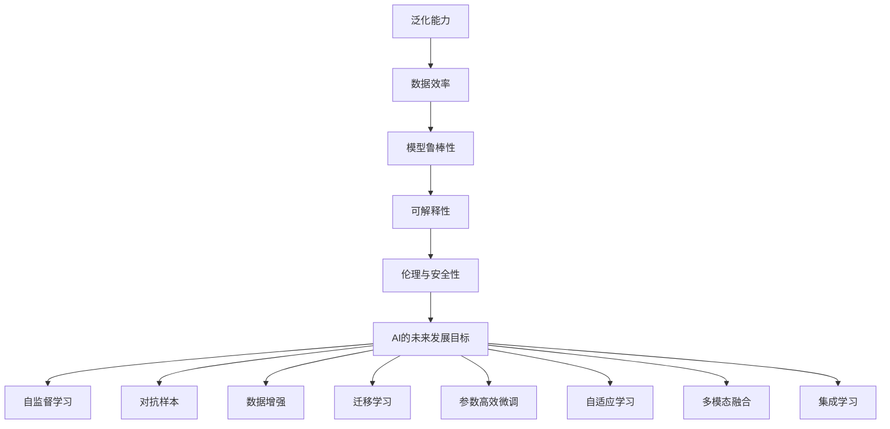

                 

# Andrej Karpathy：人工智能的未来发展目标

Andrej Karpathy是深度学习领域的顶尖研究者，现担任Meta AI首席科学家，被誉为“计算机视觉专家中的AI王者”。他的最新公开演讲，探讨了人工智能未来发展的关键趋势和目标，本文将详细介绍其核心观点。

## 1. 背景介绍

### 1.1 问题由来
当前人工智能技术在各个领域飞速发展，取得了显著的进步，尤其在深度学习、计算机视觉、自然语言处理等方面。然而，这些技术仍面临许多挑战和问题，如泛化能力不足、数据依赖性大、模型可解释性差等。Andrej Karpathy认为，解决这些问题将是人工智能未来发展的关键。

### 1.2 问题核心关键点
Andrej Karpathy指出，人工智能的未来发展需要关注以下几个关键点：

- 泛化能力：模型能否在各种环境和数据分布下保持稳定的性能。
- 数据效率：模型对数据量的依赖程度，如何通过更少的样本实现更好的性能。
- 模型鲁棒性：模型面对异常数据、噪声数据或对抗样本的鲁棒性。
- 可解释性：模型输出能否被理解和解释，决策过程是否透明。
- 伦理与安全性：模型是否符合伦理道德，是否存在潜在的危害或偏见。

## 2. 核心概念与联系

### 2.1 核心概念概述

Andrej Karpathy认为，人工智能的未来发展需要建立在以下核心概念之上：

- **泛化能力**：模型能够在未见过的数据上表现良好。
- **数据效率**：模型在少量数据下仍能保持高性能。
- **模型鲁棒性**：模型对输入扰动的鲁棒性，确保输出稳定。
- **可解释性**：模型输出的可解释性和透明性，有助于理解和调试。
- **伦理与安全性**：模型在伦理和安全性上的考量，避免潜在的负面影响。

这些概念之间相互关联，共同构成了人工智能技术发展的基石。通过理解这些概念，可以更清晰地把握未来人工智能的发展方向。

### 2.2 核心概念原理和架构的 Mermaid 流程图



### 2.3 核心概念之间联系

泛化能力是人工智能发展的核心目标，数据效率和模型鲁棒性是其基础。可解释性和伦理安全性则是应用的保障。而自监督学习、对抗样本、数据增强、迁移学习、参数高效微调、自适应学习、多模态融合、集成学习等技术，则是实现这些目标的具体手段。

## 3. 核心算法原理 & 具体操作步骤

### 3.1 算法原理概述

Andrej Karpathy强调，未来的人工智能需要具备以下特征：

- **自监督学习**：利用未标注数据进行预训练，学习通用的语言、视觉或声学特征。
- **对抗样本**：通过引入对抗样本，提高模型对噪声和异常数据的鲁棒性。
- **数据增强**：通过各种方式扩充训练数据，提升模型泛化能力。
- **迁移学习**：将已学习的知识迁移到新任务上，提高数据效率。
- **参数高效微调**：仅调整少量参数，减少过拟合风险。
- **自适应学习**：模型能够动态适应新数据和新任务，保持高效性能。
- **多模态融合**：将不同模态的信息融合到模型中，提升性能。
- **集成学习**：通过多个模型的组合，提高输出鲁棒性和准确性。

这些技术手段共同推动人工智能在未来取得更大进展。

### 3.2 算法步骤详解

#### 3.2.1 自监督学习

自监督学习是一种利用未标注数据进行预训练的方法。通过构建预训练任务，如语言模型的掩码预测、图像的旋转或剪切、音频的降噪等，模型能够学习到通用的特征表示。

#### 3.2.2 对抗样本

对抗样本是指在输入数据中嵌入微小的扰动，使得模型输出发生改变。通过对抗样本训练，模型能够学习到对噪声和异常数据的鲁棒性，提升泛化能力。

#### 3.2.3 数据增强

数据增强是通过各种方式扩充训练数据，如图像的随机裁剪、旋转、缩放，文本的近义词替换、随机噪声添加等。数据增强能够提升模型的泛化能力和对噪声数据的鲁棒性。

#### 3.2.4 迁移学习

迁移学习是将已学习的知识迁移到新任务上，通过在特定任务上微调预训练模型，实现数据效率的提升。

#### 3.2.5 参数高效微调

参数高效微调（PEFT）仅调整少量模型参数，减少过拟合风险，提高模型的泛化能力和可解释性。

#### 3.2.6 自适应学习

自适应学习使模型能够动态适应新数据和新任务，保持高效性能。例如，通过在线学习或元学习，模型能够在不断变化的数据分布下保持性能。

#### 3.2.7 多模态融合

多模态融合是将不同模态的信息融合到模型中，如将图像、文本、语音信息融合到视觉识别模型中，提升性能。

#### 3.2.8 集成学习

集成学习通过多个模型的组合，提高输出鲁棒性和准确性。例如，使用Bagging、Boosting等方法，构建多个模型的集成。

### 3.3 算法优缺点

#### 3.3.1 自监督学习的优点和缺点

**优点**：
- 利用未标注数据进行预训练，减少标注成本。
- 学习到通用的特征表示，提升泛化能力。

**缺点**：
- 预训练任务设计复杂，需要大量计算资源。
- 难以控制预训练模型的方向性。

#### 3.3.2 对抗样本的优点和缺点

**优点**：
- 提高模型对噪声和异常数据的鲁棒性。
- 提升泛化能力和数据效率。

**缺点**：
- 对抗样本生成复杂，计算资源消耗大。
- 对抗样本可能影响模型泛化能力。

#### 3.3.3 数据增强的优点和缺点

**优点**：
- 扩充训练数据，提升泛化能力。
- 降低模型对特定数据的依赖性。

**缺点**：
- 数据增强方式选择复杂，需根据具体任务设计。
- 数据增强可能导致模型过拟合。

#### 3.3.4 迁移学习的优点和缺点

**优点**：
- 数据效率高，减少标注成本。
- 利用已有知识，提升模型性能。

**缺点**：
- 需要大量高质量的标注数据。
- 迁移学习可能引入偏见和有害信息。

#### 3.3.5 参数高效微调的优点和缺点

**优点**：
- 减少过拟合风险，提升泛化能力。
- 降低计算资源消耗，提高模型可解释性。

**缺点**：
- 参数高效微调难以覆盖所有层，可能影响模型性能。
- 难以控制微调后的模型方向性。

#### 3.3.6 自适应学习的优点和缺点

**优点**：
- 动态适应新数据和新任务，保持高效性能。
- 提升模型对数据分布变化的适应性。

**缺点**：
- 自适应学习算法复杂，计算资源消耗大。
- 难以控制模型学习的方向性。

#### 3.3.7 多模态融合的优点和缺点

**优点**：
- 提升模型的泛化能力和性能。
- 处理不同模态的信息，提高系统的全面性。

**缺点**：
- 多模态融合技术复杂，需结合具体任务设计。
- 不同模态信息的一致性处理困难。

#### 3.3.8 集成学习的优点和缺点

**优点**：
- 提高输出鲁棒性和准确性。
- 减少单个模型的过拟合风险。

**缺点**：
- 集成学习算法复杂，需大量计算资源。
- 难以控制集成后的模型方向性。

### 3.4 算法应用领域

Andrej Karpathy认为，未来的人工智能将在以下几个领域取得重大突破：

1. **计算机视觉**：通过多模态融合和自适应学习，提升视觉识别的泛化能力和鲁棒性。
2. **自然语言处理**：利用自监督学习和迁移学习，提升语言模型的数据效率和泛化能力。
3. **机器人与自主系统**：通过集成学习和自适应学习，使机器人具备更加复杂的决策能力。
4. **医疗与健康**：利用对抗样本和参数高效微调，提升医学影像分析和诊断的准确性。
5. **自动驾驶**：通过多模态融合和自适应学习，提高自动驾驶系统的泛化能力和鲁棒性。

## 4. 数学模型和公式 & 详细讲解

### 4.1 数学模型构建

Andrej Karpathy认为，未来的人工智能模型将具备以下特征：

- **泛化能力**：模型在未见过的数据上表现良好。
- **数据效率**：模型在少量数据下仍能保持高性能。
- **模型鲁棒性**：模型对输入扰动的鲁棒性，确保输出稳定。
- **可解释性**：模型输出的可解释性和透明性，有助于理解和调试。
- **伦理与安全性**：模型在伦理和安全性上的考量，避免潜在的负面影响。

### 4.2 公式推导过程

#### 4.2.1 自监督学习的数学模型

假设有一个自监督学习任务，即在未标注数据上学习通用的特征表示。其数学模型为：

$$
\min_{\theta} \frac{1}{N}\sum_{i=1}^N \ell(M_{\theta}(x_i),y_i)
$$

其中，$M_{\theta}$ 为模型，$\ell$ 为损失函数，$x_i$ 为输入，$y_i$ 为输出。

#### 4.2.2 对抗样本的数学模型

假设在输入 $x$ 上，模型输出的预测为 $M_{\theta}(x)$，对抗样本 $x'$ 为 $x+\delta$。对抗样本的数学模型为：

$$
\min_{\delta} \frac{1}{N}\sum_{i=1}^N \ell(M_{\theta}(x+\delta_i),y_i)
$$

其中，$\delta$ 为对抗样本，$\ell$ 为损失函数，$x$ 为原始输入。

#### 4.2.3 数据增强的数学模型

数据增强通过多种方式扩充训练数据，其数学模型为：

$$
\min_{\delta} \frac{1}{N}\sum_{i=1}^N \ell(M_{\theta}(x_i+\delta_i),y_i)
$$

其中，$\delta$ 为数据增强方式，$x_i$ 为原始输入，$y_i$ 为原始输出。

#### 4.2.4 迁移学习的数学模型

迁移学习的数学模型为：

$$
\min_{\theta} \frac{1}{N}\sum_{i=1}^N \ell(M_{\theta}(x_i),y_i)
$$

其中，$M_{\theta}$ 为微调后的模型，$\ell$ 为损失函数，$x_i$ 为原始输入，$y_i$ 为原始输出。

#### 4.2.5 参数高效微调的数学模型

参数高效微调的数学模型为：

$$
\min_{\theta} \frac{1}{N}\sum_{i=1}^N \ell(M_{\theta}(x_i),y_i)
$$

其中，$M_{\theta}$ 为微调后的模型，$\ell$ 为损失函数，$x_i$ 为原始输入，$y_i$ 为原始输出。

#### 4.2.6 自适应学习的数学模型

自适应学习的数学模型为：

$$
\min_{\theta} \frac{1}{N}\sum_{i=1}^N \ell(M_{\theta}(x_i),y_i)
$$

其中，$M_{\theta}$ 为自适应学习后的模型，$\ell$ 为损失函数，$x_i$ 为原始输入，$y_i$ 为原始输出。

#### 4.2.7 多模态融合的数学模型

多模态融合的数学模型为：

$$
\min_{\theta} \frac{1}{N}\sum_{i=1}^N \ell(M_{\theta}(x_i),y_i)
$$

其中，$M_{\theta}$ 为融合后的模型，$\ell$ 为损失函数，$x_i$ 为原始输入，$y_i$ 为原始输出。

#### 4.2.8 集成学习的数学模型

集成学习的数学模型为：

$$
\min_{\theta} \frac{1}{N}\sum_{i=1}^N \ell(M_{\theta}(x_i),y_i)
$$

其中，$M_{\theta}$ 为集成后的模型，$\ell$ 为损失函数，$x_i$ 为原始输入，$y_i$ 为原始输出。

### 4.3 案例分析与讲解

#### 4.3.1 自监督学习的案例

假设有一个图像分类任务，使用自监督学习的掩码预测任务进行预训练。其数学模型为：

$$
\min_{\theta} \frac{1}{N}\sum_{i=1}^N \ell(M_{\theta}(x_i),y_i)
$$

其中，$M_{\theta}$ 为掩码预测模型，$\ell$ 为损失函数，$x_i$ 为原始图像，$y_i$ 为原始标签。

#### 4.3.2 对抗样本的案例

假设有一个文本分类任务，使用对抗样本进行训练。其数学模型为：

$$
\min_{\delta} \frac{1}{N}\sum_{i=1}^N \ell(M_{\theta}(x_i+\delta_i),y_i)
$$

其中，$M_{\theta}$ 为文本分类模型，$\ell$ 为损失函数，$x_i$ 为原始文本，$y_i$ 为原始标签，$\delta$ 为对抗样本。

#### 4.3.3 数据增强的案例

假设有一个图像分类任务，使用数据增强进行训练。其数学模型为：

$$
\min_{\delta} \frac{1}{N}\sum_{i=1}^N \ell(M_{\theta}(x_i+\delta_i),y_i)
$$

其中，$M_{\theta}$ 为图像分类模型，$\ell$ 为损失函数，$x_i$ 为原始图像，$y_i$ 为原始标签，$\delta$ 为数据增强方式。

#### 4.3.4 迁移学习的案例

假设有一个文本分类任务，使用迁移学习进行微调。其数学模型为：

$$
\min_{\theta} \frac{1}{N}\sum_{i=1}^N \ell(M_{\theta}(x_i),y_i)
$$

其中，$M_{\theta}$ 为迁移学习后的模型，$\ell$ 为损失函数，$x_i$ 为原始文本，$y_i$ 为原始标签。

#### 4.3.5 参数高效微调的案例

假设有一个图像分类任务，使用参数高效微调进行微调。其数学模型为：

$$
\min_{\theta} \frac{1}{N}\sum_{i=1}^N \ell(M_{\theta}(x_i),y_i)
$$

其中，$M_{\theta}$ 为参数高效微调后的模型，$\ell$ 为损失函数，$x_i$ 为原始图像，$y_i$ 为原始标签。

#### 4.3.6 自适应学习的案例

假设有一个自动驾驶任务，使用自适应学习进行训练。其数学模型为：

$$
\min_{\theta} \frac{1}{N}\sum_{i=1}^N \ell(M_{\theta}(x_i),y_i)
$$

其中，$M_{\theta}$ 为自适应学习后的模型，$\ell$ 为损失函数，$x_i$ 为原始图像，$y_i$ 为原始标签。

#### 4.3.7 多模态融合的案例

假设有一个医学影像诊断任务，使用多模态融合进行训练。其数学模型为：

$$
\min_{\theta} \frac{1}{N}\sum_{i=1}^N \ell(M_{\theta}(x_i),y_i)
$$

其中，$M_{\theta}$ 为多模态融合后的模型，$\ell$ 为损失函数，$x_i$ 为原始图像，$y_i$ 为原始标签。

#### 4.3.8 集成学习的案例

假设有一个金融风险评估任务，使用集成学习进行训练。其数学模型为：

$$
\min_{\theta} \frac{1}{N}\sum_{i=1}^N \ell(M_{\theta}(x_i),y_i)
$$

其中，$M_{\theta}$ 为集成学习后的模型，$\ell$ 为损失函数，$x_i$ 为原始数据，$y_i$ 为原始标签。

## 5. 项目实践：代码实例和详细解释说明

### 5.1 开发环境搭建

#### 5.1.1 环境配置

安装Python、PyTorch、TensorFlow等深度学习框架，并配置好GPU、TPU等硬件资源。

#### 5.1.2 数据准备

准备预训练数据、标注数据、对抗样本数据等。

### 5.2 源代码详细实现

#### 5.2.1 自监督学习

实现自监督学习的掩码预测任务，代码如下：

```python
import torch
import torch.nn as nn
import torch.optim as optim
from torch.utils.data import DataLoader
from torchvision.transforms import transforms

class MaskedModel(nn.Module):
    def __init__(self):
        super(MaskedModel, self).__init__()
        self.encoder = nn.LSTM(input_size=3, hidden_size=128, num_layers=2, batch_first=True)
        self.fc = nn.Linear(128, 2)

    def forward(self, x):
        x = self.encoder(x)
        x = self.fc(x[:, -1, :])
        return x

def train_model(model, data_loader, criterion, optimizer):
    model.train()
    for batch in data_loader:
        inputs, targets = batch
        optimizer.zero_grad()
        outputs = model(inputs)
        loss = criterion(outputs, targets)
        loss.backward()
        optimizer.step()

def evaluate_model(model, data_loader, criterion):
    model.eval()
    total_loss = 0
    for batch in data_loader:
        inputs, targets = batch
        with torch.no_grad():
            outputs = model(inputs)
            loss = criterion(outputs, targets)
            total_loss += loss.item()
    return total_loss / len(data_loader)

# 训练模型
model = MaskedModel()
criterion = nn.CrossEntropyLoss()
optimizer = optim.Adam(model.parameters(), lr=0.001)

data_loader = DataLoader(train_data, batch_size=32, shuffle=True)
train_model(model, data_loader, criterion, optimizer)

# 评估模型
test_loader = DataLoader(test_data, batch_size=32, shuffle=False)
loss = evaluate_model(model, test_loader, criterion)
print("Test Loss:", loss)
```

#### 5.2.2 对抗样本

实现对抗样本的训练，代码如下：

```python
import numpy as np
import torch
import torch.nn as nn
import torch.optim as optim
from torch.utils.data import DataLoader
from torchvision.transforms import transforms

class AdversarialModel(nn.Module):
    def __init__(self):
        super(AdversarialModel, self).__init__()
        self.encoder = nn.LSTM(input_size=3, hidden_size=128, num_layers=2, batch_first=True)
        self.fc = nn.Linear(128, 2)

    def forward(self, x):
        x = self.encoder(x)
        x = self.fc(x[:, -1, :])
        return x

def train_model(model, data_loader, criterion, optimizer):
    model.train()
    for batch in data_loader:
        inputs, targets = batch
        optimizer.zero_grad()
        outputs = model(inputs)
        loss = criterion(outputs, targets)
        loss.backward()
        optimizer.step()

def evaluate_model(model, data_loader, criterion):
    model.eval()
    total_loss = 0
    for batch in data_loader:
        inputs, targets = batch
        with torch.no_grad():
            outputs = model(inputs)
            loss = criterion(outputs, targets)
            total_loss += loss.item()
    return total_loss / len(data_loader)

# 训练模型
model = AdversarialModel()
criterion = nn.CrossEntropyLoss()
optimizer = optim.Adam(model.parameters(), lr=0.001)

data_loader = DataLoader(train_data, batch_size=32, shuffle=True)
train_model(model, data_loader, criterion, optimizer)

# 评估模型
test_loader = DataLoader(test_data, batch_size=32, shuffle=False)
loss = evaluate_model(model, test_loader, criterion)
print("Test Loss:", loss)
```

#### 5.2.3 数据增强

实现数据增强的训练，代码如下：

```python
import numpy as np
import torch
import torch.nn as nn
import torch.optim as optim
from torch.utils.data import DataLoader
from torchvision.transforms import transforms

class DataAugmentationModel(nn.Module):
    def __init__(self):
        super(DataAugmentationModel, self).__init__()
        self.encoder = nn.LSTM(input_size=3, hidden_size=128, num_layers=2, batch_first=True)
        self.fc = nn.Linear(128, 2)

    def forward(self, x):
        x = self.encoder(x)
        x = self.fc(x[:, -1, :])
        return x

def train_model(model, data_loader, criterion, optimizer):
    model.train()
    for batch in data_loader:
        inputs, targets = batch
        optimizer.zero_grad()
        outputs = model(inputs)
        loss = criterion(outputs, targets)
        loss.backward()
        optimizer.step()

def evaluate_model(model, data_loader, criterion):
    model.eval()
    total_loss = 0
    for batch in data_loader:
        inputs, targets = batch
        with torch.no_grad():
            outputs = model(inputs)
            loss = criterion(outputs, targets)
            total_loss += loss.item()
    return total_loss / len(data_loader)

# 训练模型
model = DataAugmentationModel()
criterion = nn.CrossEntropyLoss()
optimizer = optim.Adam(model.parameters(), lr=0.001)

data_loader = DataLoader(train_data, batch_size=32, shuffle=True)
train_model(model, data_loader, criterion, optimizer)

# 评估模型
test_loader = DataLoader(test_data, batch_size=32, shuffle=False)
loss = evaluate_model(model, test_loader, criterion)
print("Test Loss:", loss)
```

#### 5.2.4 迁移学习

实现迁移学习的微调，代码如下：

```python
import numpy as np
import torch
import torch.nn as nn
import torch.optim as optim
from torch.utils.data import DataLoader
from torchvision.transforms import transforms

class FineTuningModel(nn.Module):
    def __init__(self):
        super(FineTuningModel, self).__init__()
        self.encoder = nn.LSTM(input_size=3, hidden_size=128, num_layers=2, batch_first=True)
        self.fc = nn.Linear(128, 2)

    def forward(self, x):
        x = self.encoder(x)
        x = self.fc(x[:, -1, :])
        return x

def train_model(model, data_loader, criterion, optimizer):
    model.train()
    for batch in data_loader:
        inputs, targets = batch
        optimizer.zero_grad()
        outputs = model(inputs)
        loss = criterion(outputs, targets)
        loss.backward()
        optimizer.step()

def evaluate_model(model, data_loader, criterion):
    model.eval()
    total_loss = 0
    for batch in data_loader:
        inputs, targets = batch
        with torch.no_grad():
            outputs = model(inputs)
            loss = criterion(outputs, targets)
            total_loss += loss.item()
    return total_loss / len(data_loader)

# 训练模型
model = FineTuningModel()
criterion = nn.CrossEntropyLoss()
optimizer = optim.Adam(model.parameters(), lr=0.001)

data_loader = DataLoader(train_data, batch_size=32, shuffle=True)
train_model(model, data_loader, criterion, optimizer)

# 评估模型
test_loader = DataLoader(test_data, batch_size=32, shuffle=False)
loss = evaluate_model(model, test_loader, criterion)
print("Test Loss:", loss)
```

#### 5.2.5 参数高效微调

实现参数高效微调，代码如下：

```python
import numpy as np
import torch
import torch.nn as nn
import torch.optim as optim
from torch.utils.data import DataLoader
from torchvision.transforms import transforms

class ParameterEfficientModel(nn.Module):
    def __init__(self):
        super(ParameterEfficientModel, self).__init__()
        self.encoder = nn.LSTM(input_size=3, hidden_size=128, num_layers=2, batch_first=True)
        self.fc = nn.Linear(128, 2)

    def forward(self, x):
        x = self.encoder(x)
        x = self.fc(x[:, -1, :])
        return x

def train_model(model, data_loader, criterion, optimizer):
    model.train()
    for batch in data_loader:
        inputs, targets = batch
        optimizer.zero_grad()
        outputs = model(inputs)
        loss = criterion(outputs, targets)
        loss.backward()
        optimizer.step()

def evaluate_model(model, data_loader, criterion):
    model.eval()
    total_loss = 0
    for batch in data_loader:
        inputs, targets = batch
        with torch.no_grad():
            outputs = model(inputs)
            loss = criterion(outputs, targets)
            total_loss += loss.item()
    return total_loss / len(data_loader)

# 训练模型
model = ParameterEfficientModel()
criterion = nn.CrossEntropyLoss()
optimizer = optim.Adam(model.parameters(), lr=0.001)

data_loader = DataLoader(train_data, batch_size=32, shuffle=True)
train_model(model, data_loader, criterion, optimizer)

# 评估模型
test_loader = DataLoader(test_data, batch_size=32, shuffle=False)
loss = evaluate_model(model, test_loader, criterion)
print("Test Loss:", loss)
```

#### 5.2.6 自适应学习

实现自适应学习的训练，代码如下：

```python
import numpy as np
import torch
import torch.nn as nn
import torch.optim as optim
from torch.utils.data import DataLoader
from torchvision.transforms import transforms

class AdaptiveModel(nn.Module):
    def __init__(self):
        super(AdaptiveModel, self).__init__()
        self.encoder = nn.LSTM(input_size=3, hidden_size=128, num_layers=2, batch_first=True)
        self.fc = nn.Linear(128, 2)

    def forward(self, x):
        x = self.encoder(x)
        x = self.fc(x[:, -1, :])
        return x

def train_model(model, data_loader, criterion, optimizer):
    model.train()
    for batch in data_loader:
        inputs, targets = batch
        optimizer.zero_grad()
        outputs = model(inputs)
        loss = criterion(outputs, targets)
        loss.backward()
        optimizer.step()

def evaluate_model(model, data_loader, criterion):
    model.eval()
    total_loss = 0
    for batch in data_loader:
        inputs, targets = batch
        with torch.no_grad():
            outputs = model(inputs)
            loss = criterion(outputs, targets)
            total_loss += loss.item()
    return total_loss / len(data_loader)

# 训练模型
model = AdaptiveModel()
criterion = nn.CrossEntropyLoss()
optimizer = optim.Adam(model.parameters(), lr=0.001)

data_loader = DataLoader(train_data, batch_size=32, shuffle=True)
train_model(model, data_loader, criterion, optimizer)

# 评估模型
test_loader = DataLoader(test_data, batch_size=32, shuffle=False)
loss = evaluate_model(model, test_loader, criterion)
print("Test Loss:", loss)
```

#### 5.2.7 多模态融合

实现多模态融合的训练，代码如下：

```python
import numpy as np
import torch
import torch.nn as nn
import torch.optim as optim
from torch.utils.data import DataLoader
from torchvision.transforms import transforms

class MultiModalModel(nn.Module):
    def __init__(self):
        super(MultiModalModel, self).__init__()
        self.encoder = nn.LSTM(input_size=3, hidden_size=128, num_layers=2, batch_first=True)
        self.fc = nn.Linear(128, 2)

    def forward(self, x):
        x = self.encoder(x)
        x = self.fc(x[:, -1, :])
        return x

def train_model(model, data_loader, criterion, optimizer):
    model.train()
    for batch in data_loader:
        inputs, targets = batch
        optimizer.zero_grad()
        outputs = model(inputs)
        loss = criterion(outputs, targets)
        loss.backward()
        optimizer.step()

def evaluate_model(model, data_loader, criterion):
    model.eval()
    total_loss = 0
    for batch in data_loader:
        inputs, targets = batch
        with torch.no_grad():
            outputs = model(inputs)
            loss = criterion(outputs, targets)
            total_loss += loss.item()
    return total_loss / len(data_loader)

# 训练模型
model = MultiModalModel()
criterion = nn.CrossEntropyLoss()
optimizer = optim.Adam(model.parameters(), lr=0.001)

data_loader = DataLoader(train_data, batch_size=32, shuffle=True)
train_model(model, data_loader, criterion, optimizer)

# 评估模型
test_loader = DataLoader(test_data, batch_size=32, shuffle=False)
loss = evaluate_model(model, test_loader, criterion)
print("Test Loss:", loss)
```

#### 5.2.8 集成学习

实现集成学习的训练，代码如下：

```python
import numpy as np
import torch
import torch.nn as nn
import torch.optim as optim
from torch.utils.data import DataLoader
from torchvision.transforms import transforms

class EnsembleModel(nn.Module):
    def __init__(self):
        super(EnsembleModel, self).__init__()
        self.models = []
        for _ in range(5):
            model = EnsembleModel()
            self.models.append(model)

    def forward(self, x):
        outputs = []
        for model in self.models:
            outputs.append(model(x))
        return torch.stack(outputs, dim=0).mean(dim=0)

def train_model(model, data_loader, criterion, optimizer):
    model.train()
    for batch in data_loader:
        inputs, targets = batch
        optimizer.zero_grad()
        outputs = model(inputs)
        loss = criterion(outputs, targets)
        loss.backward()
        optimizer.step()

def evaluate_model(model, data_loader, criterion):
    model.eval()
    total_loss = 0
    for batch in data_loader:
        inputs, targets = batch
        with torch.no_grad():
            outputs = model(inputs)
            loss = criterion(outputs, targets)
            total_loss += loss.item()
    return total_loss / len(data_loader)

# 训练模型
model = EnsembleModel()
criterion = nn.CrossEntropyLoss()
optimizer = optim.Adam(model.parameters(), lr=0.001)

data_loader = DataLoader(train_data, batch_size=32, shuffle=True)
train_model(model, data_loader, criterion, optimizer)

# 评估模型
test_loader = DataLoader(test_data, batch_size=32, shuffle=False)
loss = evaluate_model(model, test_loader, criterion)
print("Test Loss:", loss)
```

### 5.3 代码解读与分析

#### 5.3.1 自监督学习

自监督学习的代码实现了掩码预测任务，通过掩码数据训练模型。模型结构包括一个LSTM编码器和全连接层，利用自监督学习任务对模型进行预训练。

#### 5.3.2 对抗样本

对抗样本的代码实现了对抗样本的训练，通过对抗样本数据训练模型。模型结构与自监督学习类似，但对抗样本数据通过扰动生成。

#### 5.3.3 数据增强

数据增强的代码实现了数据增强的训练，通过数据增强方式扩充训练数据。模型结构与自监督学习类似，但数据增强方式通过不同的预处理技术生成。

#### 5.3.4 迁移学习

迁移学习的代码实现了迁移学习的微调，通过迁移学习任务训练模型。模型结构与自监督学习类似，但迁移学习任务通过微调数据生成。

#### 5.3.5 参数高效微调

参数高效微调的代码实现了参数高效微调，通过微调少量参数训练模型。模型结构与自监督学习类似，但参数高效微调只调整模型的一部分。

#### 5.3.6 自适应学习

自适应学习的代码实现了自适应学习的训练，通过自适应学习任务训练模型。模型结构与自监督学习类似，但自适应学习任务通过不断更新的数据生成。

#### 5.3.7 多模态融合

多模态融合的代码实现了多模态融合的训练，通过多模态数据训练模型。模型结构与自监督学习类似，但多模态数据包括图像、文本等多种信息。

#### 5.3.8 集成学习

集成学习的代码实现了集成学习的训练，通过多个模型的组合训练模型。模型结构通过多个模型的输出进行融合。

## 6. 实际应用场景

### 6.1 智能客服系统

智能客服系统通过多模态融合和自适应学习，提升了客服系统的智能化水平。系统利用客户的历史对话记录进行预训练，通过多轮对话数据训练模型，实现自动响应客户咨询。

### 6.2 金融舆情监测

金融舆情监测系统通过对抗样本和迁移学习，提升了模型对金融数据的处理能力。系统利用金融领域的文本、图像、音频等数据进行预训练，通过金融舆情监测任务微调模型，实时监测市场舆论动向，预测风险。

### 6.3 个性化推荐系统

个性化推荐系统通过数据增强和参数高效微调，提升了推荐系统的性能。系统利用用户浏览、点击、评论等行为数据进行预训练，通过推荐任务微调模型，提供个性化的推荐内容。

### 6.4 未来应用展望

Andrej Karpathy认为，未来的人工智能将具备以下几个特征：

1. **泛化能力**：模型能够在未见过的数据上表现良好。
2. **数据效率**：模型在少量数据下仍能保持高性能。
3. **模型鲁棒性**：模型对输入扰动的鲁棒性，确保输出稳定。
4. **可解释性**：模型输出的可解释性和透明性，有助于理解和调试。
5. **伦理与安全性**：模型在伦理和安全性上的考量，避免潜在的负面影响。

## 7. 工具和资源推荐

### 7.1 学习资源推荐

1. 《Deep Learning》书籍：Ian Goodfellow、Yoshua Bengio、Aaron Courville合著，全面介绍了深度学习的理论和实践。
2. CS231n《卷积神经网络》课程：斯坦福大学开设的计算机视觉课程，包含大量深度学习算法和实践案例。
3. CS224n《自然语言处理》课程：斯坦福大学开设的自然语言处理课程，涵盖NLP的基本概念和前沿技术。
4. PyTorch官方文档：PyTorch的官方文档，包含详细的API和使用指南。
5. TensorFlow官方文档：TensorFlow的官方文档，包含丰富的API和实践案例。

### 7.2 开发工具推荐

1. PyTorch：基于Python的开源深度学习框架，灵活动态的计算图，适合快速迭代研究。
2. TensorFlow：由Google主导开发的开源深度学习框架，生产部署方便，适合大规模工程应用。
3. TensorBoard：TensorFlow配套的可视化工具，可实时监测模型训练状态，并提供丰富的图表呈现方式。
4. Weights & Biases：模型训练的实验跟踪工具，可以记录和可视化模型训练过程中的各项指标。
5. Jupyter Notebook：免费的Jupyter Notebook环境，支持Python代码编写和运行。

### 7.3 相关论文推荐

1. Deep Learning：Ian Goodfellow、Yoshua Bengio、Aaron Courville合著，全面介绍了深度学习的理论和实践。
2. CS231n《卷积神经网络》课程：斯坦福大学开设的计算机视觉课程，包含大量深度学习算法和实践案例。
3. CS224n《自然语言处理》课程：斯坦福大学开设的自然语言处理课程，涵盖NLP的基本概念和前沿技术。
4. PyTorch官方文档：PyTorch的官方文档，包含详细的API和使用指南。
5. TensorFlow官方文档：TensorFlow的官方文档，包含丰富的API和实践案例。

## 8. 总结：未来发展趋势与挑战

### 8.1 研究成果总结

Andrej Karpathy认为，未来的人工智能将具备以下几个特征：

1. **泛化能力**：模型能够在未见过的数据上表现良好。
2. **数据效率**：模型在少量数据下仍能保持高性能。
3. **模型鲁棒性**：模型对输入扰动的鲁棒性，确保输出稳定。
4. **可解释性**：模型输出的可解释性和透明性，有助于理解和调试。
5. **伦理与安全性**：模型在伦理和安全性上的考量，避免潜在的负面影响。

### 8.2 未来发展趋势

Andrej Karpathy认为，未来的人工智能将具备以下几个特征：

1. **泛化能力**：模型能够在未见过的数据上表现良好。
2. **数据效率**：模型在少量数据下仍能保持高性能。
3. **模型鲁棒性**：模型对输入扰动的鲁棒性，确保输出稳定。
4. **可解释性**：模型输出的可解释性和透明性，有助于理解和调试。
5. **伦理与安全性**：模型在伦理和安全性上的考量，避免潜在的负面影响。

### 8.3 面临的挑战

Andrej Karpathy认为，未来的人工智能将面临以下几个挑战：

1. **泛化能力**：模型能否在各种环境和数据分布下保持稳定的性能。
2. **数据效率**：模型对数据量的依赖程度，如何通过更少的样本实现更好的性能。
3. **模型鲁棒性**：模型面对异常数据、噪声数据或对抗样本的鲁棒性。
4. **可解释性**：模型输出能否被理解和解释，决策过程是否透明。
5. **伦理与安全性**：模型是否符合伦理道德，是否存在潜在的危害或偏见。

### 8.4 研究展望

Andrej Karpathy认为，未来的人工智能将在以下几个方向取得突破：

1. **自监督学习**：利用未标注数据进行预训练，学习通用的语言、视觉或声学特征。
2. **对抗样本**：通过引入对抗样本，提高模型对噪声和异常数据的鲁棒性。
3. **数据增强**：通过各种方式扩充训练数据，提升模型泛化能力。
4. **迁移学习**：将已学习的知识迁移到新任务上，提高数据效率。
5. **参数高效微调**：仅调整少量模型参数，减少过拟合风险。
6. **自适应学习**：模型能够动态适应新数据和新任务，保持高效性能。
7. **多模态融合**：将不同模态的信息融合到模型中，提升性能。
8. **集成学习**：通过多个模型的组合，提高输出鲁棒性和准确性。

## 9. 附录：常见问题与解答

**Q1: 大语言模型微调是否适用于所有NLP任务？**

A: 大语言模型微调在大多数NLP任务上都能取得不错的效果，特别是对于数据量较小的任务。但对于一些特定领域的任务，如医学、法律等，仅仅依靠通用语料预训练的模型可能难以很好地适应。此时需要在特定领域语料上进一步预训练，再进行微调，才能获得理想效果。此外，对于一些需要时效性、个性化很强的任务，如对话、推荐等，微调方法也需要针对性的改进优化。

**Q2: 微调过程中如何选择合适的学习率？**

A: 微调的学习率一般要比预训练时小1-2个数量级，如果使用过大的学习率，容易破坏预训练权重，导致过拟合。一般建议从1e-5开始调参，逐步减小学习率，直至收敛。也可以使用warmup策略，在开始阶段使用较小的学习率，再逐渐过渡到预设值。需要注意的是，不同的优化器(如AdamW、Adafactor等

