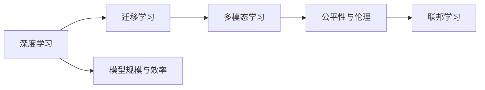

                 

# Andrej Karpathy：人工智能的未来发展策略

Andrej Karpathy，斯坦福大学计算机视觉系副教授，PyTorch创始团队成员，OpenAI的TPU基础设施负责人，自然语言处理专家，深度学习领域的领导者。Karpathy在人工智能的未来发展策略方面有着独到的见解和深刻的思考。本文将结合Karpathy的观点，探讨人工智能的未来发展方向，剖析关键技术，展望未来趋势，并为从业者提供有价值的策略建议。

## 1. 背景介绍

### 1.1 问题由来
随着深度学习技术的迅猛发展，人工智能（AI）技术在多个领域取得了显著突破，从计算机视觉、自然语言处理到机器人、自动驾驶等。这些技术不仅提升了生产力和生活质量，也带来了前所未有的创新机遇。然而，随着AI技术的不断演进，未来的发展方向和面临的挑战也愈发清晰。

### 1.2 问题核心关键点
未来AI的发展需要重点关注以下几个方面：

1. **模型规模与效率**：大模型在性能上取得了显著提升，但随之而来的问题是如何更好地优化模型规模和推理效率。
2. **多模态融合**：AI模型需要更好地融合多种数据源，提升多模态信息处理的准确性和鲁棒性。
3. **泛化与公平性**：如何构建更泛化的模型，并在公平性方面做出更多努力。
4. **伦理与社会影响**：AI技术的广泛应用对社会伦理和公平性带来了新的挑战，如何平衡技术与伦理、公平性的关系。

## 2. 核心概念与联系

### 2.1 核心概念概述

为了更好地理解AI的未来发展方向，首先需要明确几个核心概念：

- **深度学习（Deep Learning）**：一种基于神经网络的机器学习技术，能够处理复杂的非线性关系。
- **迁移学习（Transfer Learning）**：利用预训练模型在新任务上的微调，提高模型性能。
- **多模态学习（Multimodal Learning）**：融合视觉、文本、语音等多种数据源，提升AI系统的理解和应用能力。
- **公平性与伦理**：确保AI系统在训练和应用中不产生歧视，尊重用户隐私和公平性原则。
- **联邦学习（Federated Learning）**：在分布式数据环境中训练模型，保护用户隐私的同时提升模型性能。

这些核心概念共同构成了AI未来的技术发展框架，将深刻影响AI系统的设计、训练和应用。

### 2.2 核心概念原理和架构的 Mermaid 流程图



这个流程图展示了AI核心技术的发展脉络，从深度学习的基础，到迁移学习的多样化应用，再到多模态学习和联邦学习的协同效应，最后聚焦于公平性和伦理的考量。

## 3. 核心算法原理 & 具体操作步骤

### 3.1 算法原理概述

未来AI的发展将依赖于多个关键算法的协同工作，包括：

- **预训练与微调**：通过大规模无监督学习预训练模型，在特定任务上通过微调提高模型性能。
- **多模态融合**：将视觉、文本、语音等多种数据源进行融合，提升模型的泛化能力。
- **联邦学习**：在分布式数据环境中训练模型，保护用户隐私的同时提升模型性能。
- **对抗训练**：通过引入对抗样本，提升模型的鲁棒性和泛化能力。
- **自适应学习**：根据数据分布的变化，动态调整模型参数，提高模型的适应性和长期稳定性。

### 3.2 算法步骤详解

#### 3.2.1 预训练与微调
1. **数据准备**：收集大规模无标注数据，进行预处理和增强。
2. **模型选择**：选择适当的预训练模型，如BERT、GPT等。
3. **预训练**：在无监督任务上训练模型，如语言建模、目标检测等。
4. **微调**：在特定任务上，通过有监督学习对模型进行微调，如分类、生成等。
5. **评估与优化**：使用验证集评估模型性能，根据反馈进行模型优化。

#### 3.2.2 多模态融合
1. **数据获取**：收集多种数据源，如视觉图像、文本描述、语音等。
2. **特征提取**：对每种数据源进行特征提取，得到高维向量表示。
3. **融合策略**：选择适当的融合策略，如拼接、融合网络等。
4. **模型训练**：在融合后的数据上训练多模态模型，如跨模态学习、联合学习等。
5. **模型评估**：在多模态数据上评估模型性能，进行模型优化。

#### 3.2.3 联邦学习
1. **数据分布**：收集分布式数据，确保数据分散在多个参与者中。
2. **模型参数初始化**：在中心服务器上初始化模型参数。
3. **本地训练**：在每个参与者本地对模型进行训练，更新本地模型参数。
4. **参数聚合**：将本地模型参数聚合到中心服务器，更新全局模型参数。
5. **模型评估**：在中心服务器上评估模型性能，进行模型优化。

### 3.3 算法优缺点

**优点**：
- **高效性**：预训练模型能够显著提升模型性能，减少从头训练的时间和成本。
- **泛化能力**：多模态融合和多任务学习提升了模型的泛化能力，能够在不同数据源和任务上表现良好。
- **隐私保护**：联邦学习保护了用户数据隐私，避免了集中式训练带来的隐私风险。

**缺点**：
- **计算资源消耗大**：大规模预训练和模型微调需要大量的计算资源，对硬件要求较高。
- **模型可解释性差**：深度学习模型通常被视为"黑盒"，难以解释其内部工作机制。
- **公平性与伦理问题**：AI系统可能存在偏见和歧视，影响公平性和伦理。

### 3.4 算法应用领域

未来AI的应用领域将涵盖医疗、金融、教育、智能制造等多个行业，具体如下：

- **医疗**：辅助诊断、病历分析、个性化医疗等。
- **金融**：风险评估、信用评分、智能投顾等。
- **教育**：智能教育、在线学习、个性化教学等。
- **智能制造**：智能检测、故障诊断、自适应控制等。

## 4. 数学模型和公式 & 详细讲解 & 举例说明

### 4.1 数学模型构建

假设我们有一个包含 $n$ 个样本的训练集 $D = \{(x_i, y_i)\}_{i=1}^n$，其中 $x_i$ 是输入，$y_i$ 是输出。我们的目标是在此基础上训练一个模型 $f(x; \theta)$，使得在给定输入 $x$ 时，能够预测输出 $y$。

我们采用最小化损失函数 $\mathcal{L}(f)$ 来训练模型：

$$
\mathcal{L}(f) = \frac{1}{n}\sum_{i=1}^n \mathcal{L}(f(x_i), y_i)
$$

其中，$\mathcal{L}$ 是损失函数，可以是均方误差、交叉熵等。

### 4.2 公式推导过程

以均方误差（MSE）为例，假设 $y_i$ 是真实值，$f(x_i)$ 是模型预测值，MSE 定义为：

$$
\mathcal{L}_{MSE}(y_i, f(x_i)) = \frac{1}{2}(y_i - f(x_i))^2
$$

在训练过程中，通过反向传播算法，计算每个参数的梯度，进行参数更新：

$$
\theta \leftarrow \theta - \eta \nabla_{\theta} \mathcal{L}(f)
$$

其中，$\eta$ 是学习率，$\nabla_{\theta} \mathcal{L}(f)$ 是损失函数对参数 $\theta$ 的梯度。

### 4.3 案例分析与讲解

假设我们有一个文本分类任务，目标是判断给定的文本属于哪个类别。我们可以使用BERT模型进行预训练，然后对其进行微调。具体步骤如下：

1. **数据准备**：收集标注数据，将文本和类别标记分开发送。
2. **模型选择**：选择BERT作为预训练模型。
3. **微调**：在微调过程中，只更新模型的顶层，保持预训练部分不变。
4. **评估与优化**：在验证集上评估模型性能，进行参数调整。

## 5. 项目实践：代码实例和详细解释说明

### 5.1 开发环境搭建

#### 5.1.1 PyTorch安装
1. 安装Anaconda
2. 创建虚拟环境
3. 安装PyTorch

#### 5.1.2 Transformers库安装
1. 安装Transformer库
2. 安装所需依赖

### 5.2 源代码详细实现

以下是一个基于PyTorch和Transformer库的文本分类模型的代码实现：

```python
import torch
from transformers import BertForSequenceClassification, BertTokenizer

# 初始化模型和分词器
model = BertForSequenceClassification.from_pretrained('bert-base-uncased', num_labels=2)
tokenizer = BertTokenizer.from_pretrained('bert-base-uncased')

# 定义训练函数
def train(model, device, train_loader, optimizer, num_epochs):
    for epoch in range(num_epochs):
        model.train()
        for batch in train_loader:
            input_ids = batch['input_ids'].to(device)
            attention_mask = batch['attention_mask'].to(device)
            labels = batch['labels'].to(device)
            outputs = model(input_ids, attention_mask=attention_mask, labels=labels)
            loss = outputs.loss
            optimizer.zero_grad()
            loss.backward()
            optimizer.step()
    return model

# 定义评估函数
def evaluate(model, device, test_loader):
    model.eval()
    total_correct, total_pred = 0, 0
    with torch.no_grad():
        for batch in test_loader:
            input_ids = batch['input_ids'].to(device)
            attention_mask = batch['attention_mask'].to(device)
            batch_labels = batch['labels'].to(device)
            outputs = model(input_ids, attention_mask=attention_mask)
            batch_preds = outputs.argmax(dim=1).to('cpu').tolist()
            batch_labels = batch_labels.to('cpu').tolist()
            total_correct += sum(batch_pred == batch_labels)
            total_pred += len(batch_labels)
    return total_correct / total_pred

# 训练模型
model.to('cuda')
train_loader = ...
test_loader = ...
optimizer = ...
model = train(model, 'cuda', train_loader, optimizer, num_epochs=5)

# 评估模型
print(evaluate(model, 'cuda', test_loader))
```

### 5.3 代码解读与分析

这段代码实现了基于BERT模型进行文本分类的全过程。我们首先初始化BERT模型和分词器，然后在训练函数中进行模型训练，在评估函数中进行模型评估。训练过程中，我们只更新模型的顶层，保持预训练部分不变。通过这种方式，我们能够在较少的时间内快速完成模型微调，同时保留预训练模型的优势。

## 6. 实际应用场景

### 6.1 智能医疗

智能医疗系统利用AI技术辅助医生进行诊断和治疗决策。未来，AI系统将通过预训练模型进行多模态融合，融合医学影像、电子病历和基因数据，提升诊断的准确性和个性化治疗方案的制定。

### 6.2 智能金融

智能金融系统利用AI技术进行风险评估、信用评分和智能投顾。未来，AI系统将通过联邦学习保护用户隐私，同时在多个金融机构之间共享知识，提升金融决策的准确性和鲁棒性。

### 6.3 智能教育

智能教育系统利用AI技术进行个性化教学和智能辅导。未来，AI系统将通过多模态融合技术，融合学生的行为数据、学习数据和反馈数据，提升个性化教学的效果。

### 6.4 智能制造

智能制造系统利用AI技术进行智能检测和故障诊断。未来，AI系统将通过多模态融合技术，融合传感器数据、生产数据和历史数据，提升生产线的智能化水平和效率。

## 7. 工具和资源推荐

### 7.1 学习资源推荐

#### 7.1.1 Coursera
Coursera提供斯坦福大学的《深度学习》课程，涵盖深度学习的基础和应用，适合初学者和进阶者学习。

#### 7.1.2 Kaggle
Kaggle是一个数据科学竞赛平台，提供大量的NLP和AI竞赛数据集和模型，适合进行实战练习。

#### 7.1.3 Google AI Blog
Google AI Blog分享最新的AI研究和应用成果，适合了解最新的AI发展动态。

### 7.2 开发工具推荐

#### 7.2.1 PyTorch
PyTorch是一个开源的深度学习框架，支持动态计算图，适合进行深度学习模型的研究和开发。

#### 7.2.2 TensorFlow
TensorFlow是Google开发的一个深度学习框架，支持分布式训练和模型优化，适合大规模工程应用。

#### 7.2.3 HuggingFace
HuggingFace提供了大量的预训练模型和工具，适合进行NLP任务的开发和微调。

### 7.3 相关论文推荐

#### 7.3.1 "Attention is All You Need" by Ashish Vaswani et al.
该论文提出了Transformer模型，开创了自注意力机制在深度学习中的应用。

#### 7.3.2 "BERT: Pre-training of Deep Bidirectional Transformers for Language Understanding" by Jacob Devlin et al.
该论文提出了BERT模型，通过预训练和微调，提升了NLP任务的性能。

#### 7.3.3 "Google's Neural Machine Translation System: Bridging the Gap Between Human and Machine Translation" by Wojciech Zaremba et al.
该论文提出了Google的NMT系统，通过预训练和微调，实现了高效的机器翻译。

## 8. 总结：未来发展趋势与挑战

### 8.1 研究成果总结

Andrej Karpathy在人工智能的未来发展策略方面提出了许多前瞻性的观点，主要包括以下几个方面：

- **模型规模与效率**：未来AI模型将向更大规模发展，同时提高推理效率。
- **多模态融合**：AI系统将更好地融合多种数据源，提升模型的泛化能力。
- **公平性与伦理**：AI系统将在公平性和伦理方面做出更多努力。
- **联邦学习**：联邦学习将在分布式数据环境中得到更广泛的应用。

### 8.2 未来发展趋势

#### 8.2.1 模型规模与效率
未来AI模型将向更大规模发展，同时提高推理效率。这将依赖于更高效的硬件和更优化的算法。

#### 8.2.2 多模态融合
多模态融合将带来更大的突破，AI系统将更好地融合视觉、文本、语音等多种数据源，提升模型的泛化能力。

#### 8.2.3 公平性与伦理
AI系统将在公平性和伦理方面做出更多努力，避免偏见和歧视，提升模型的可信度和可解释性。

#### 8.2.4 联邦学习
联邦学习将在分布式数据环境中得到更广泛的应用，保护用户隐私的同时提升模型性能。

### 8.3 面临的挑战

#### 8.3.1 计算资源消耗
大规模预训练和模型微调需要大量的计算资源，对硬件要求较高。

#### 8.3.2 模型可解释性
深度学习模型通常被视为"黑盒"，难以解释其内部工作机制。

#### 8.3.3 公平性与伦理
AI系统可能存在偏见和歧视，影响公平性和伦理。

### 8.4 研究展望

未来的AI研究需要重点关注以下几个方向：

- **高效模型训练**：开发更高效的模型训练算法，提升训练效率。
- **模型可解释性**：提升模型的可解释性，增强用户信任。
- **多模态融合**：更好地融合多种数据源，提升模型的泛化能力。
- **公平性与伦理**：确保AI系统在训练和应用中不产生歧视，尊重用户隐私和公平性原则。

## 9. 附录：常见问题与解答

**Q1：大模型训练需要多少计算资源？**

A: 大模型训练需要大量的计算资源，包括GPU/TPU等高性能设备。具体计算需求取决于模型的规模和复杂度。

**Q2：如何提高模型的可解释性？**

A: 提高模型的可解释性可以通过可视化技术，如输入特征重要性、激活图等，帮助用户理解模型的决策过程。同时，引入因果分析和博弈论工具，可以更好地解释模型行为。

**Q3：未来AI的发展方向是什么？**

A: 未来AI的发展方向包括模型规模与效率、多模态融合、公平性与伦理、联邦学习等方面。

**Q4：联邦学习如何解决数据隐私问题？**

A: 联邦学习通过在分布式数据环境中训练模型，保护用户数据隐私，避免了集中式训练带来的隐私风险。

通过本文的讨论，我们可以看到，未来AI的发展将依赖于多个关键技术，包括预训练与微调、多模态融合、联邦学习等。在实际应用中，我们需要综合考虑这些技术的协同作用，才能更好地实现AI系统的目标。Andrej Karpathy的观点和研究成果为未来AI的发展提供了重要的指导和参考。

