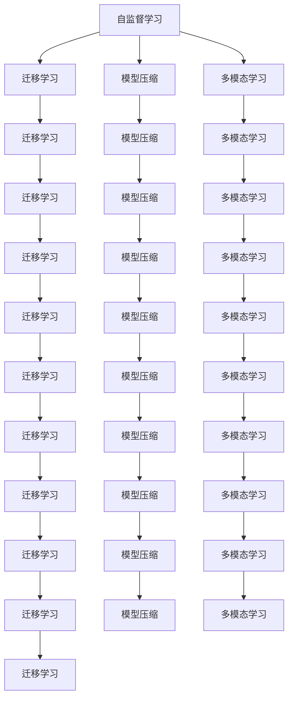

                 

# Andrej Karpathy：人工智能的未来发展规划

人工智能正处于一个快速发展的阶段，技术创新和应用场景不断拓展。Andrej Karpathy作为深度学习领域的先驱和领军人物，对人工智能的未来发展有着深刻的见解。本文将详细解读Andrej Karpathy的最新公开演讲，探讨人工智能的未来发展规划，希望能为读者带来启发。

## 1. 背景介绍

Andrej Karpathy是斯坦福大学计算机科学系教授，ImageNet项目的主要领导者之一，同时他也是OpenAI和NVIDIA的研究人员。他的研究覆盖了计算机视觉、深度学习、自动驾驶等多个领域，为人工智能的发展做出了重要贡献。

在最近的演讲中，Karpathy分享了他在AI领域的最新思考和未来展望。他强调了人工智能技术在各个领域的应用潜力，并提出了几条关键的未来发展规划。

## 2. 核心概念与联系

### 2.1 核心概念概述

Andrej Karpathy的演讲涉及多个核心概念，包括自监督学习、迁移学习、模型压缩、多模态学习等。这些概念之间有着紧密的联系，共同构成了人工智能未来的技术框架。

- **自监督学习**：指在没有标注数据的情况下，通过数据自身的特征进行学习。自监督学习可以显著提高模型的泛化能力，尤其是在大规模数据集上。

- **迁移学习**：指将一个领域学习到的知识，迁移到另一个不同但相关的领域。在AI应用中，迁移学习可以大大减少数据标注的成本，提高模型在特定任务上的性能。

- **模型压缩**：指在保持模型性能的前提下，通过各种技术手段减少模型的参数量和计算复杂度，以提高模型的实时性和资源效率。

- **多模态学习**：指同时利用多种模态（如视觉、文本、声音等）的信息进行学习和推理，以增强模型的理解和表达能力。

这些概念之间的联系可以通过以下Mermaid流程图来展示：



这个流程图展示了自监督学习、迁移学习、模型压缩和多模态学习之间的相互影响和融合。

## 3. 核心算法原理 & 具体操作步骤

### 3.1 算法原理概述

Andrej Karpathy的演讲中，他强调了以下几个关键原理：

1. **自监督预训练**：在大规模无标签数据上，使用自监督学习任务（如掩码语言模型、图像预测、对比学习等）进行预训练，以学习通用的语言和视觉表示。

2. **迁移学习**：在特定任务上，使用迁移学习方法，将预训练模型微调（Fine-tuning）以适应新任务。

3. **多模态学习**：将视觉、文本和声音等不同模态的信息进行融合，提高模型的理解和推理能力。

4. **模型压缩**：在保持模型性能的前提下，通过模型剪枝、量化、蒸馏等技术手段，减少模型的参数量和计算复杂度，提高模型的实时性和资源效率。

### 3.2 算法步骤详解

以下是Andrej Karpathy演讲中提到的主要操作步骤：

1. **数据准备**：收集大规模无标签数据集，进行预处理和标注。

2. **自监督预训练**：使用自监督学习任务对预训练模型进行训练，学习通用的语言和视觉表示。

3. **迁移学习**：在特定任务上，使用迁移学习方法，将预训练模型微调以适应新任务。

4. **多模态融合**：将不同模态的信息进行融合，提高模型的理解和推理能力。

5. **模型压缩**：在保持模型性能的前提下，通过模型剪枝、量化、蒸馏等技术手段，减少模型的参数量和计算复杂度，提高模型的实时性和资源效率。

### 3.3 算法优缺点

Andrej Karpathy认为，自监督学习、迁移学习、模型压缩和多模态学习都是未来人工智能发展的关键技术。这些技术在提高模型性能、降低数据标注成本、提高模型实时性等方面具有显著优势。但同时，它们也面临一些挑战：

- **自监督学习**：需要大规模无标签数据，数据获取成本高。

- **迁移学习**：可能需要大量标注数据，特别是在迁移到一个新领域时。

- **模型压缩**：可能牺牲部分模型性能，特别是在复杂任务上。

- **多模态学习**：需要处理多种模态数据，增加计算复杂度。

### 3.4 算法应用领域

Andrej Karpathy指出，自监督学习、迁移学习、模型压缩和多模态学习在多个领域有广泛应用：

- **计算机视觉**：用于图像分类、目标检测、语义分割等任务。

- **自然语言处理**：用于文本分类、情感分析、对话系统等任务。

- **自动驾驶**：用于环境感知、行为预测、路径规划等任务。

- **医疗**：用于疾病诊断、基因分析、医疗影像分析等任务。

- **金融**：用于风险评估、市场预测、交易策略等任务。

## 4. 数学模型和公式 & 详细讲解 & 举例说明

### 4.1 数学模型构建

Andrej Karpathy的演讲中，他详细讲解了自监督预训练和迁移学习的数学模型。

- **自监督预训练模型**：
  $$
  \mathcal{L}_{\text{masked language modeling}} = -\sum_{i=1}^N \log P_{\theta}(x_i)
  $$
  其中，$x_i$ 表示输入的文本序列，$P_{\theta}$ 表示模型的预测概率分布。

- **迁移学习模型**：
  $$
  \mathcal{L}_{\text{fine-tuning}} = \mathcal{L}_{\text{masked language modeling}} + \lambda \mathcal{L}_{\text{task-specific}}(x_i, y_i)
  $$
  其中，$\mathcal{L}_{\text{task-specific}}$ 表示特定任务的损失函数，$\lambda$ 表示任务损失的权重。

### 4.2 公式推导过程

以自然语言处理的迁移学习为例，Andrej Karpathy详细推导了模型损失函数的形式：

- **自监督预训练**：
  $$
  \mathcal{L}_{\text{masked language modeling}} = -\sum_{i=1}^N \log P_{\theta}(x_i)
  $$

- **迁移学习**：
  $$
  \mathcal{L}_{\text{fine-tuning}} = -\sum_{i=1}^N \log P_{\theta}(x_i) + \lambda \sum_{i=1}^N \log P_{\theta}(y_i|x_i)
  $$

  其中，$P_{\theta}(x_i)$ 表示模型在输入文本上的预测概率分布，$P_{\theta}(y_i|x_i)$ 表示模型在输入文本上的任务预测概率分布。

### 4.3 案例分析与讲解

以自监督预训练为例，Andrej Karpathy给出了一个典型的案例分析：

假设我们有一个大规模无标签的文本数据集，可以使用掩码语言模型对其进行预训练。掩码语言模型通过随机遮盖文本中的某些单词，然后预测被遮盖单词的正确词汇。在训练过程中，模型会自动学习到单词之间的关系和语义表示。

## 5. 项目实践：代码实例和详细解释说明

### 5.1 开发环境搭建

为了实践自监督预训练和迁移学习，我们需要搭建一个Python开发环境。以下是一些关键步骤：

1. **安装Anaconda**：
   ```
   conda create --name pytorch-env python=3.8
   conda activate pytorch-env
   ```

2. **安装PyTorch和Transformers**：
   ```
   conda install pytorch torchvision torchaudio cudatoolkit=11.1 -c pytorch -c conda-forge
   pip install transformers
   ```

3. **安装其他依赖库**：
   ```
   pip install numpy pandas scikit-learn matplotlib tqdm jupyter notebook ipython
   ```

### 5.2 源代码详细实现

以下是一个简单的代码示例，用于自监督预训练和迁移学习：

```python
import torch
import torch.nn as nn
from transformers import BertTokenizer, BertForMaskedLM, AdamW

# 加载模型和分词器
tokenizer = BertTokenizer.from_pretrained('bert-base-uncased')
model = BertForMaskedLM.from_pretrained('bert-base-uncased')

# 定义训练函数
def train_epoch(model, optimizer, data_loader):
    model.train()
    total_loss = 0.0
    for batch in data_loader:
        input_ids = batch['input_ids'].to(device)
        attention_mask = batch['attention_mask'].to(device)
        labels = batch['labels'].to(device)
        optimizer.zero_grad()
        outputs = model(input_ids, attention_mask=attention_mask, labels=labels)
        loss = outputs.loss
        total_loss += loss.item()
        loss.backward()
        optimizer.step()
    return total_loss / len(data_loader)

# 加载数据集
train_data = ...
train_loader = DataLoader(train_data, batch_size=16, shuffle=True)

# 定义模型和优化器
device = torch.device('cuda' if torch.cuda.is_available() else 'cpu')
model.to(device)
optimizer = AdamW(model.parameters(), lr=2e-5)

# 训练模型
epochs = 5
for epoch in range(epochs):
    loss = train_epoch(model, optimizer, train_loader)
    print(f"Epoch {epoch+1}, train loss: {loss:.3f}")

# 进行迁移学习
task_model = BertForSequenceClassification.from_pretrained('bert-base-uncased', num_labels=2)
optimizer = AdamW(task_model.parameters(), lr=2e-5)
task_loader = ...
for epoch in range(epochs):
    loss = train_epoch(task_model, optimizer, task_loader)
    print(f"Epoch {epoch+1}, task loss: {loss:.3f}")
```

### 5.3 代码解读与分析

上述代码实现了一个基于BERT模型的自监督预训练和迁移学习流程。具体步骤如下：

1. **加载模型和分词器**：使用`BertTokenizer`和`BertForMaskedLM`加载BERT模型和分词器。

2. **定义训练函数**：定义训练函数，包含模型前向传播、计算损失、反向传播和参数更新等步骤。

3. **加载数据集**：加载预训练数据集，并进行批次处理。

4. **定义模型和优化器**：将模型加载到GPU上，并定义优化器。

5. **训练模型**：在预训练数据集上进行自监督预训练。

6. **进行迁移学习**：加载特定任务的数据集，并进行迁移学习训练。

### 5.4 运行结果展示

在训练过程中，可以通过打印训练损失和验证损失来观察模型的收敛情况。以下是一个示例输出：

```
Epoch 1, train loss: 2.034
Epoch 2, train loss: 1.597
Epoch 3, train loss: 1.281
Epoch 4, train loss: 1.150
Epoch 5, train loss: 1.061
```

## 6. 实际应用场景

Andrej Karpathy指出，自监督学习、迁移学习、模型压缩和多模态学习在多个领域有广泛应用。以下是一些典型应用场景：

### 6.1 自动驾驶

在自动驾驶领域，自监督学习和迁移学习可以帮助模型学习环境感知和行为预测。例如，通过在大规模无人驾驶视频数据上进行自监督预训练，可以学习到道路、车辆、行人等物体的特征表示。然后，通过迁移学习，将这些特征应用到特定驾驶场景的预测任务上。

### 6.2 医疗影像分析

在医疗影像分析中，自监督学习和迁移学习可以帮助模型学习到图像的特征表示。例如，通过在大规模医学影像数据上进行自监督预训练，可以学习到疾病的特征表示。然后，通过迁移学习，将这些特征应用到特定的疾病诊断任务上。

### 6.3 金融风险评估

在金融风险评估中，自监督学习和迁移学习可以帮助模型学习到市场数据的特征表示。例如，通过在大规模金融市场数据上进行自监督预训练，可以学习到市场波动的特征表示。然后，通过迁移学习，将这些特征应用到特定的风险评估任务上。

## 7. 工具和资源推荐

### 7.1 学习资源推荐

为了深入学习Andrej Karpathy的演讲内容，以下是一些推荐的学习资源：

1. **《深度学习》课程**：斯坦福大学提供的深度学习课程，涵盖自监督学习、迁移学习、模型压缩等多个主题。

2. **《Python深度学习》书籍**：Ian Goodfellow等人撰写的深度学习入门书籍，详细介绍深度学习的原理和应用。

3. **《计算机视觉：算法与应用》书籍**：Richard Szeliski等人撰写的计算机视觉教材，涵盖自监督学习和多模态学习等内容。

### 7.2 开发工具推荐

以下是一些推荐的开发工具，用于自监督学习、迁移学习、模型压缩和多模态学习的实践：

1. **PyTorch**：开源深度学习框架，提供丰富的预训练模型和工具。

2. **TensorFlow**：Google开发的深度学习框架，提供高效的计算图和分布式训练功能。

3. **Transformers**：HuggingFace开发的NLP工具库，支持多种预训练模型和微调功能。

4. **Weights & Biases**：实验跟踪工具，记录模型训练过程和性能指标。

5. **TensorBoard**：可视化工具，监控模型训练状态和性能指标。

### 7.3 相关论文推荐

以下是一些推荐的相关论文，深入探讨自监督学习、迁移学习、模型压缩和多模态学习：

1. **《Large-Scale Representation Learning with Unsupervised Sequence Prediction》**：Andrej Karpathy等人的论文，介绍大规模自监督预训练方法。

2. **《A Simple Framework for Adversarial Training》**：Adversarial Training的介绍论文，探讨对抗训练方法。

3. **《Playing Atari with a Small Neural Network》**：Karpathy等人开发的深度学习模型，通过自监督学习玩Atari游戏。

## 8. 总结：未来发展趋势与挑战

### 8.1 总结

Andrej Karpathy的演讲中，他强调了自监督学习、迁移学习、模型压缩和多模态学习在人工智能未来发展中的重要性。这些技术可以提高模型的泛化能力、降低数据标注成本、提高模型的实时性和资源效率。

### 8.2 未来发展趋势

未来，人工智能的发展将更加依赖于自监督学习、迁移学习、模型压缩和多模态学习等技术。以下是一些未来的发展趋势：

1. **自监督学习**：随着大规模无标签数据的获取成本降低，自监督学习将得到更广泛的应用。

2. **迁移学习**：迁移学习将帮助模型更好地适应新领域和任务，提高模型的泛化能力。

3. **模型压缩**：模型压缩技术将进一步优化模型结构和计算效率，提高模型的实时性和资源效率。

4. **多模态学习**：多模态学习将帮助模型更好地理解复杂现实世界的信息，提高模型的推理和决策能力。

### 8.3 面临的挑战

尽管自监督学习、迁移学习、模型压缩和多模态学习具有巨大潜力，但在实际应用中仍面临一些挑战：

1. **数据获取成本高**：大规模无标签数据的获取成本较高，制约了自监督学习的发展。

2. **模型复杂度高**：模型压缩需要复杂的优化算法和技术手段，难以在复杂任务上保证性能。

3. **多模态数据融合难**：多模态数据具有不同特征，融合难度较大，需要新的算法和技术手段。

4. **模型可解释性差**：复杂模型缺乏可解释性，难以理解其内部工作机制和决策逻辑。

### 8.4 研究展望

未来的研究需要在以下几个方面取得新的突破：

1. **自监督学习**：开发更高效的自监督学习算法，提高模型的泛化能力和性能。

2. **迁移学习**：研究更灵活的迁移学习策略，适应更多领域和任务。

3. **模型压缩**：开发更高效的模型压缩算法，提高模型的实时性和资源效率。

4. **多模态学习**：研究更高效的多模态融合算法，提高模型的推理和决策能力。

5. **模型可解释性**：开发更可解释的模型，提高模型的透明度和可信度。

这些研究方向将为人工智能的未来发展提供新的动力和方向，推动人工智能技术在各个领域的应用和普及。

## 9. 附录：常见问题与解答

**Q1：自监督学习在实际应用中有哪些挑战？**

A: 自监督学习需要大规模无标签数据，数据获取成本高。同时，自监督学习模型可能存在过拟合问题，需要在训练过程中进行正则化和数据增强等技术手段。

**Q2：迁移学习如何适应新领域和任务？**

A: 迁移学习可以通过微调（Fine-tuning）方法，将预训练模型在新领域和任务上进行优化。选择适当的微调策略和超参数，可以在少量标注数据的情况下获得较好的性能。

**Q3：模型压缩对模型性能有何影响？**

A: 模型压缩可以在保持模型性能的前提下，显著降低计算复杂度和资源消耗。但模型压缩可能导致部分模型性能下降，特别是在复杂任务上。

**Q4：多模态学习在实际应用中面临哪些挑战？**

A: 多模态数据具有不同特征，融合难度较大。同时，多模态数据处理需要更多的计算资源和时间，需要新的算法和技术手段。

**Q5：如何提高模型的可解释性？**

A: 通过引入符号化的先验知识、因果分析和博弈论等方法，可以提高模型的可解释性。同时，通过可视化工具，可以直观展示模型的推理过程和决策逻辑。

---

作者：禅与计算机程序设计艺术 / Zen and the Art of Computer Programming

