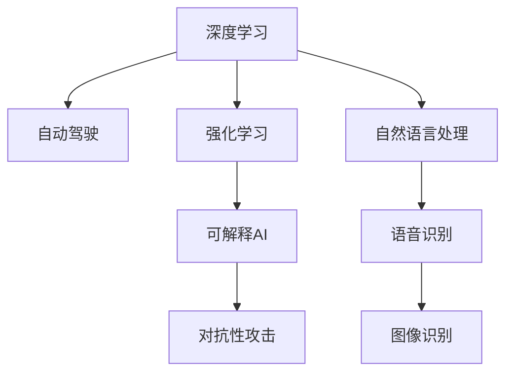

                 

# Andrej Karpathy：人工智能的未来发展规划

在当今快速发展的科技浪潮中，人工智能(AI)正以前所未有的速度和深度渗透到各个领域，从医疗到金融，从自动驾驶到个性化推荐，AI的触角已经延伸到了人类生活的方方面面。在这个充满挑战和机遇的时代，著名AI专家、Stanford大学教授Andrej Karpathy通过一系列深度访谈和公开演讲，提出了他对AI未来发展的独特见解。本文将从背景介绍、核心概念、算法原理、实践案例、未来展望等多个方面，全面阐述Andrej Karpathy对人工智能未来发展规划的观点。

## 1. 背景介绍

### 1.1 问题由来
AI技术的发展经历了多次起伏，从最初的符号主义到后来的连接主义，再到深度学习的大放异彩，AI正处于历史性的转折点。Andrej Karpathy认为，当前AI的突破主要归功于三个关键因素：大数据、大模型和强算力。具体来说，大数据提供了丰富的训练资源，大模型带来了更强大的表示能力，而强算力则使得这些模型能够高效地训练和推理。

### 1.2 问题核心关键点
Andrej Karpathy强调，AI的未来发展不仅要关注模型的性能提升，更要注重模型的可解释性、可控性和安全性。他指出，当前的AI模型往往是"黑箱"系统，难以理解其内部工作机制和决策逻辑。这对于医疗、金融等高风险领域尤其重要，需要AI系统具备更强的可解释性，以确保决策的透明性和可信度。

### 1.3 问题研究意义
通过深入了解Andrej Karpathy的观点，我们能够更清晰地把握AI发展的方向，避免陷入盲目追逐技术指标的陷阱，从而更理性地推动AI技术的进步。本文将系统梳理Andrej Karpathy的论述，为读者提供一份全面而深入的AI未来发展规划。

## 2. 核心概念与联系

### 2.1 核心概念概述

在讨论AI的未来发展规划之前，我们先需要理解一些核心概念：

- **深度学习(Deep Learning)**：一种基于多层神经网络的学习方法，能够自动提取数据的复杂特征，广泛应用于图像识别、自然语言处理、语音识别等领域。
- **自动驾驶(Autonomous Driving)**：利用AI技术实现无人驾驶汽车，通过摄像头、雷达、激光雷达等传感器获取环境信息，自主做出驾驶决策。
- **强化学习(Reinforcement Learning)**：通过试错的方式，让智能体在特定环境中学习最优策略，广泛应用于游戏AI、机器人控制等领域。
- **可解释AI(Explainable AI)**：使AI系统的决策过程和结果具备可解释性，便于用户理解和信任。
- **对抗性攻击(Adversarial Attacks)**：指攻击者通过输入特定的扰动数据，诱导AI模型产生错误决策，如误识别、误分类等。

这些概念之间的逻辑关系可以通过以下Mermaid流程图来展示：



这个流程图展示了几大AI技术及其相互联系：

1. 深度学习作为基础技术，支撑了自动驾驶、强化学习、可解释AI、自然语言处理、语音识别和图像识别等应用。
2. 自动驾驶和强化学习都利用了深度学习技术，但前者更侧重于感知和决策，后者则更侧重于策略学习。
3. 可解释AI是深度学习的重要补充，使模型输出具有可解释性。
4. 对抗性攻击是深度学习的一大挑战，需要在设计模型时考虑其鲁棒性。

这些核心概念构成了AI技术的基本框架，理解它们有助于我们把握AI的发展脉络和未来趋势。

## 3. 核心算法原理 & 具体操作步骤
### 3.1 算法原理概述

AI的核心算法原理主要包括深度学习、强化学习和可解释AI。下面将分别介绍这些算法的原理和具体操作步骤。

### 3.2 算法步骤详解

**深度学习算法步骤**：
1. **数据预处理**：对原始数据进行清洗、归一化、分词等处理，生成模型所需格式。
2. **模型构建**：设计多层神经网络结构，选择合适的激活函数、优化器和损失函数。
3. **训练过程**：使用大量标注数据对模型进行反向传播训练，优化权重。
4. **模型评估**：在测试集上评估模型性能，通过精度、召回率等指标衡量模型效果。

**强化学习算法步骤**：
1. **环境设计**：定义智能体与环境的交互方式，设置状态空间、动作空间和奖励函数。
2. **策略学习**：使用Q-learning、SARSA等算法，让智能体在环境中学习最优策略。
3. **策略评估**：通过模拟实验或实际测试，评估智能体的表现。
4. **策略改进**：根据评估结果，调整智能体的策略和参数。

**可解释AI算法步骤**：
1. **数据准备**：收集数据集，并进行标注和预处理。
2. **模型训练**：在训练集上训练可解释模型，如决策树、规则集等。
3. **可解释性分析**：使用LIME、SHAP等工具，分析模型决策的特征重要性。
4. **模型部署**：将可解释模型集成到实际应用中，提供决策解释功能。

### 3.3 算法优缺点

**深度学习的优点**：
1. 模型复杂度较高，能够捕捉数据中的复杂特征。
2. 适用于大规模数据和复杂任务，如图像识别、语音识别等。
3. 训练过程可以利用分布式计算，提高效率。

**深度学习的缺点**：
1. 模型参数较多，训练和推理耗时较长。
2. 对标注数据依赖较大，获取高质量数据成本较高。
3. 模型决策过程难以解释，缺乏可解释性。

**强化学习的优点**：
1. 能够自主学习最优策略，无需大量标注数据。
2. 适用于动态和不确定环境，如自动驾驶、机器人控制等。
3. 学习过程具有可解释性，智能体的决策过程透明。

**强化学习的缺点**：
1. 训练过程复杂，需要大量的模拟实验或实际测试。
2. 对环境模型要求较高，模型设计难度较大。
3. 容易受到环境噪声和随机因素的影响。

**可解释AI的优点**：
1. 模型决策具有可解释性，便于用户理解和信任。
2. 适用于高风险领域，如医疗、金融等。
3. 能够提供决策依据，增强模型的透明度。

**可解释AI的缺点**：
1. 模型复杂度较高，训练和推理耗时较长。
2. 对标注数据依赖较大，获取高质量数据成本较高。
3. 模型的解释能力有限，难以覆盖所有场景。

### 3.4 算法应用领域

深度学习、强化学习和可解释AI在不同的应用领域中得到了广泛应用：

**深度学习应用领域**：
1. **计算机视觉**：如图像识别、物体检测、人脸识别等。
2. **自然语言处理**：如机器翻译、情感分析、文本生成等。
3. **语音识别**：如语音合成、语音识别、自动摘要等。
4. **推荐系统**：如商品推荐、新闻推荐、视频推荐等。

**强化学习应用领域**：
1. **游戏AI**：如围棋、星际争霸、DOTA2等。
2. **机器人控制**：如无人驾驶、工业机器人、服务机器人等。
3. **智能推荐**：如智能客服、个性化推荐、智能广告等。
4. **自动化交易**：如高频交易、股票分析、风险控制等。

**可解释AI应用领域**：
1. **医疗诊断**：如影像诊断、病理分析、基因分析等。
2. **金融风险**：如信用评估、风险管理、欺诈检测等。
3. **法律咨询**：如合同审核、专利检索、证据分析等。
4. **智能客服**：如问答系统、情感分析、用户行为分析等。

这些应用领域展示了AI技术的广泛应用，未来还将拓展到更多场景，推动各行各业的数字化转型。

## 4. 数学模型和公式 & 详细讲解 & 举例说明

### 4.1 数学模型构建

在讨论AI算法原理时，我们通常会涉及一些基本的数学模型。以下是深度学习和强化学习中常用的数学模型：

**深度学习数学模型**：
1. **前向传播**：
   $$
   y=f(x;w)=\sigma(Wx+b)
   $$
   其中 $f$ 为激活函数，$W$ 和 $b$ 为权重和偏置。

2. **损失函数**：
   $$
   \mathcal{L}(y,\hat{y})=\frac{1}{2}(y-\hat{y})^2
   $$
   其中 $y$ 为真实标签，$\hat{y}$ 为模型预测值。

3. **优化算法**：
   $$
   w_{t+1}=w_t-\eta\nabla\mathcal{L}(y,f(x;w))
   $$
   其中 $\eta$ 为学习率，$\nabla$ 为梯度符号。

**强化学习数学模型**：
1. **状态空间**：
   $$
   S=\{s_1,s_2,\cdots,s_n\}
   $$
   其中 $s_i$ 表示状态。

2. **动作空间**：
   $$
   A=\{a_1,a_2,\cdots,a_m\}
   $$
   其中 $a_i$ 表示动作。

3. **奖励函数**：
   $$
   R(s_t,a_t)=\sum_{t'}r_{t'}^t
   $$
   其中 $r_{t'}^t$ 表示状态转移后的奖励。

### 4.2 公式推导过程

**深度学习公式推导**：
1. **前向传播推导**：
   $$
   y=f(x;w)=\sigma(Wx+b)
   $$
   其中 $f$ 为激活函数，$W$ 和 $b$ 为权重和偏置。

2. **损失函数推导**：
   $$
   \mathcal{L}(y,\hat{y})=\frac{1}{2}(y-\hat{y})^2
   $$
   其中 $y$ 为真实标签，$\hat{y}$ 为模型预测值。

3. **优化算法推导**：
   $$
   w_{t+1}=w_t-\eta\nabla\mathcal{L}(y,f(x;w))
   $$
   其中 $\eta$ 为学习率，$\nabla$ 为梯度符号。

**强化学习公式推导**：
1. **状态空间推导**：
   $$
   S=\{s_1,s_2,\cdots,s_n\}
   $$
   其中 $s_i$ 表示状态。

2. **动作空间推导**：
   $$
   A=\{a_1,a_2,\cdots,a_m\}
   $$
   其中 $a_i$ 表示动作。

3. **奖励函数推导**：
   $$
   R(s_t,a_t)=\sum_{t'}r_{t'}^t
   $$
   其中 $r_{t'}^t$ 表示状态转移后的奖励。

### 4.3 案例分析与讲解

**案例一：图像识别**

图像识别是深度学习中非常典型的一个应用。以手写数字识别为例，可以使用卷积神经网络(CNN)来训练模型。

1. **数据准备**：收集大量手写数字图片，并进行标注。
2. **模型构建**：设计卷积神经网络，包含卷积层、池化层、全连接层等。
3. **训练过程**：使用反向传播算法，训练模型参数。
4. **模型评估**：在测试集上评估模型精度。

**案例二：智能推荐系统**

智能推荐系统利用深度学习技术，通过用户的历史行为数据，预测其未来的兴趣偏好。以电商推荐为例，可以使用协同过滤算法来训练模型。

1. **数据准备**：收集用户的行为数据，如浏览记录、购买记录等。
2. **模型构建**：设计协同过滤算法，如矩阵分解、基于梯度的推荐模型等。
3. **训练过程**：使用用户-物品矩阵，训练推荐模型。
4. **模型评估**：在测试集上评估模型的推荐效果，如召回率、准确率等。

## 5. 项目实践：代码实例和详细解释说明

### 5.1 开发环境搭建

在实际项目中，我们需要搭建一个高效的开发环境，以便快速迭代实验。以下是使用Python和PyTorch搭建环境的步骤：

1. **安装Python**：
   ```
   sudo apt-get update
   sudo apt-get install python3
   ```

2. **安装PyTorch**：
   ```
   pip install torch torchvision torchaudio
   ```

3. **安装TensorBoard**：
   ```
   pip install tensorboard
   ```

4. **安装NVIDIA CUDA**：
   ```
   sudo apt-get install nvidia-cuda-cublas
   ```

5. **安装NVIDIA cuDNN**：
   ```
   wget https://developer.download.nvidia.com/compute/cudnn/8.9.1.79/cudnn-8.9.1.79_linux-x64_shared.zip
   tar -xvf cudnn-8.9.1.79_linux-x64_shared.zip -C /usr/local
   ```

6. **安装NVIDIA cuDNN**：
   ```
   sudo ldconfig
   ```

### 5.2 源代码详细实现

以下是一个简单的图像识别项目，使用卷积神经网络对MNIST数据集进行训练和测试。

```python
import torch
import torch.nn as nn
import torch.optim as optim
import torchvision
import torchvision.transforms as transforms
import torchvision.datasets as datasets
from torch.utils.data import DataLoader

class ConvNet(nn.Module):
    def __init__(self):
        super(ConvNet, self).__init__()
        self.conv1 = nn.Conv2d(1, 32, 3, 1)
        self.conv2 = nn.Conv2d(32, 64, 3, 1)
        self.dropout1 = nn.Dropout2d(0.25)
        self.dropout2 = nn.Dropout2d(0.5)
        self.fc1 = nn.Linear(9216, 128)
        self.fc2 = nn.Linear(128, 10)

    def forward(self, x):
        x = self.conv1(x)
        x = nn.functional.relu(x)
        x = self.conv2(x)
        x = nn.functional.relu(x)
        x = nn.functional.max_pool2d(x, 2)
        x = self.dropout1(x)
        x = torch.flatten(x, 1)
        x = self.fc1(x)
        x = nn.functional.relu(x)
        x = self.dropout2(x)
        x = self.fc2(x)
        output = nn.functional.log_softmax(x, dim=1)
        return output

model = ConvNet()

criterion = nn.CrossEntropyLoss()
optimizer = optim.Adam(model.parameters(), lr=0.001)

train_loader = DataLoader(datasets.MNIST(root='data', train=True, transform=transforms.ToTensor(), download=True), batch_size=64, shuffle=True)
test_loader = DataLoader(datasets.MNIST(root='data', train=False, transform=transforms.ToTensor()), batch_size=64, shuffle=True)

for epoch in range(10):
    running_loss = 0.0
    for i, data in enumerate(train_loader, 0):
        inputs, labels = data
        optimizer.zero_grad()
        outputs = model(inputs)
        loss = criterion(outputs, labels)
        loss.backward()
        optimizer.step()
        running_loss += loss.item()
    print('Epoch %d loss: %.3f' % (epoch + 1, running_loss / len(train_loader)))

correct = 0
total = 0
with torch.no_grad():
    for data in test_loader:
        images, labels = data
        outputs = model(images)
        _, predicted = torch.max(outputs.data, 1)
        total += labels.size(0)
        correct += (predicted == labels).sum().item()

print('Accuracy of the network on the 10000 test images: %d %%' % (100 * correct / total))
```

### 5.3 代码解读与分析

**数据准备**：
- `torchvision.datasets.MNIST` 函数用于下载MNIST数据集。
- `transforms.ToTensor()` 函数将原始图像转换为张量。

**模型构建**：
- `nn.Conv2d` 定义卷积层。
- `nn.ReLU` 定义激活函数。
- `nn.MaxPool2d` 定义最大池化层。
- `nn.Dropout2d` 定义dropout层。
- `nn.Linear` 定义全连接层。

**训练过程**：
- `torch.no_grad()` 关闭梯度计算。
- `nn.functional.log_softmax` 计算softmax输出。
- `torch.optim.Adam` 定义优化器。

**模型评估**：
- `nn.functional.max_pool2d` 计算最大池化。
- `torch.max` 计算预测值和真实值之间的最大匹配度。

## 6. 实际应用场景

### 6.1 智能驾驶

Andrej Karpathy指出，自动驾驶是AI技术在未来最具颠覆性的应用之一。自动驾驶技术利用深度学习和强化学习，通过摄像头、雷达、激光雷达等传感器获取环境信息，自主做出驾驶决策。

1. **数据准备**：收集大量道路场景数据，包括车辆、行人、交通信号等。
2. **模型构建**：设计基于深度学习的感知模型，如卷积神经网络、循环神经网络等。
3. **训练过程**：使用监督学习算法，训练感知模型。
4. **模型评估**：在测试集上评估模型的准确性和鲁棒性。

### 6.2 医疗诊断

在医疗领域，AI技术也发挥了重要作用。利用深度学习和可解释AI技术，可以对医学影像、病历记录等进行分析，辅助医生诊断和治疗。

1. **数据准备**：收集大量医学影像、病历记录等数据，并进行标注。
2. **模型构建**：设计基于深度学习的分类模型，如卷积神经网络、循环神经网络等。
3. **训练过程**：使用监督学习算法，训练分类模型。
4. **模型评估**：在测试集上评估模型的诊断准确性和可解释性。

### 6.3 个性化推荐

个性化推荐系统利用深度学习和强化学习，根据用户的历史行为数据，预测其未来的兴趣偏好，从而推荐合适的商品、新闻、视频等。

1. **数据准备**：收集用户的行为数据，如浏览记录、购买记录等。
2. **模型构建**：设计基于深度学习的推荐模型，如协同过滤模型、基于梯度的推荐模型等。
3. **训练过程**：使用用户-物品矩阵，训练推荐模型。
4. **模型评估**：在测试集上评估模型的推荐效果，如召回率、准确率等。

## 7. 工具和资源推荐

### 7.1 学习资源推荐

为了深入了解AI技术的发展和应用，以下是几本推荐的书籍：

1. **《深度学习》（Ian Goodfellow）**：全面介绍了深度学习的原理和应用。
2. **《强化学习》（Richard S. Sutton & Andrew G. Barto）**：介绍了强化学习的基本原理和算法。
3. **《可解释AI》（Johan Bohnenblust）**：介绍了可解释AI技术的原理和应用。

### 7.2 开发工具推荐

以下是一些常用的AI开发工具：

1. **PyTorch**：深度学习开发的首选框架，支持动态计算图。
2. **TensorFlow**：深度学习开发的主要框架之一，支持分布式计算。
3. **Keras**：深度学习开发的高级API，易于上手。
4. **Jupyter Notebook**：支持交互式编程，方便实验和调试。
5. **TensorBoard**：可视化工具，支持模型训练和评估。

### 7.3 相关论文推荐

以下是几篇关键的AI技术论文，值得深入阅读：

1. **《ImageNet Classification with Deep Convolutional Neural Networks》（AlexNet）**：开创了深度学习在图像识别领域的突破。
2. **《Playing Atari with Deep Reinforcement Learning》**：首次展示了深度学习在强化学习中的应用。
3. **《A Tutorial on Deep Learning for NLP》**：介绍了深度学习在自然语言处理中的应用。
4. **《Explainable Artificial Intelligence: Understanding Black Box Models and Overcoming Uncertainty》**：介绍了可解释AI技术的原理和应用。

## 8. 总结：未来发展趋势与挑战

### 8.1 研究成果总结

Andrej Karpathy认为，AI技术在未来将继续快速发展，逐步渗透到各个领域。他指出，深度学习、强化学习和可解释AI是未来AI技术发展的三大方向。

### 8.2 未来发展趋势

1. **深度学习的发展**：深度学习技术将继续优化和进化，利用更大规模的语料和更强的算力，提升模型的表达能力和泛化能力。
2. **强化学习的突破**：强化学习技术将进一步应用于自动驾驶、机器人控制等领域，推动智能系统的自主决策能力。
3. **可解释AI的普及**：可解释AI技术将逐步普及，使AI系统具备更高的透明度和可信度，减少人类对AI系统的信任危机。

### 8.3 面临的挑战

尽管AI技术发展迅速，但仍面临诸多挑战：

1. **数据隐私和安全**：AI模型需要大量数据进行训练，数据隐私和安全问题亟需解决。
2. **模型鲁棒性和泛化能力**：当前AI模型对噪声和异常数据缺乏鲁棒性，需要进一步提高模型的泛化能力。
3. **伦理和公平性**：AI系统可能存在偏见和歧视，需要制定相应的伦理准则和公平性评估指标。
4. **计算资源和成本**：大规模AI模型需要大量的计算资源，如何降低成本是未来发展的重要方向。

### 8.4 研究展望

未来，AI技术的发展将更加注重多领域协同，跨学科合作，推动AI技术的全面应用。以下是一些潜在的研究方向：

1. **跨领域知识融合**：将不同领域的知识进行整合，提升AI模型的综合能力。
2. **多模态信息融合**：利用视觉、语音、文本等多种信息，提升AI系统的感知和理解能力。
3. **联邦学习**：在分布式环境中，利用本地数据进行模型训练，避免数据集中带来的风险。
4. **自适应学习**：使AI系统具备更强的自适应能力，不断从新数据中学习，提升系统的鲁棒性和灵活性。

## 9. 附录：常见问题与解答

**Q1：深度学习和强化学习有什么区别？**

A: 深度学习是通过多层神经网络进行特征提取和模式识别，主要应用于感知和分类任务。强化学习则是通过智能体与环境的交互，学习最优策略，主要应用于决策和控制任务。

**Q2：AI技术在医疗领域有哪些应用？**

A: AI技术在医疗领域的应用非常广泛，包括医学影像分析、病历记录处理、药物研发、患者风险评估等。利用深度学习、可解释AI等技术，可以提高医疗诊断的准确性和效率，辅助医生进行决策。

**Q3：如何确保AI模型的安全性？**

A: 确保AI模型的安全性需要从数据隐私、模型鲁棒性和伦理公平等多个方面进行考虑。保护用户隐私，避免数据泄露；提高模型的泛化能力，避免过拟合；制定伦理准则，避免模型偏见和歧视。

---

作者：禅与计算机程序设计艺术 / Zen and the Art of Computer Programming

