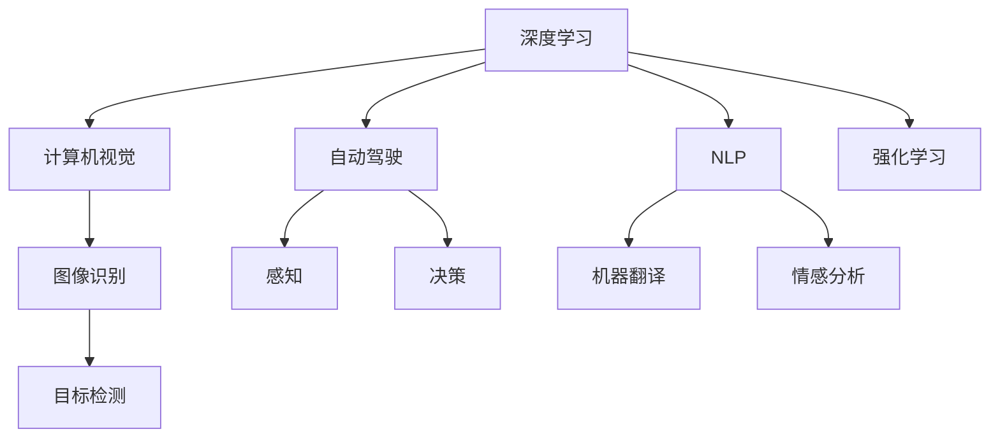

                 

# Andrej Karpathy：人工智能的未来发展规划

> 关键词：人工智能,深度学习,计算机视觉,自然语言处理,自动驾驶,未来规划,创新

## 1. 背景介绍

Andrej Karpathy是深度学习领域的顶尖专家，现任特斯拉AI与自动驾驶部门的首席AI科学家。他对人工智能的未来发展有着独到的见解，提出了许多创新和前瞻性的规划。本文将深入探讨Karpathy对人工智能未来的发展规划，特别是深度学习在计算机视觉、自然语言处理、自动驾驶等领域的未来展望。

## 2. 核心概念与联系

### 2.1 核心概念概述

为了更好地理解Karpathy的规划，我们首先梳理几个关键概念及其联系：

- **深度学习(Deep Learning)**：通过多层神经网络结构，自动从数据中学习特征和模式的一种机器学习方法。深度学习在计算机视觉、自然语言处理、语音识别等领域广泛应用。
- **计算机视觉(Computer Vision)**：使计算机能够像人一样“看”和理解图像和视频的能力。应用包括人脸识别、目标检测、场景理解等。
- **自然语言处理(Natural Language Processing, NLP)**：使计算机能够理解、解析和生成自然语言的能力。应用包括机器翻译、文本摘要、情感分析等。
- **自动驾驶(Autonomous Driving)**：使汽车能够自主导航和决策，避免交通事故，提高交通效率。核心技术包括感知、决策、控制等。
- **强化学习(Reinforcement Learning)**：通过试错，使智能体最大化累积奖励的算法。在自动驾驶、机器人控制等领域有重要应用。
- **多模态学习(Multimodal Learning)**：结合多种数据模态，如图像、视频、文本，提升模型的综合理解能力。

这些概念通过深度学习框架和技术，如卷积神经网络(CNN)、循环神经网络(RNN)、Transformer等，实现信息的提取、处理和推理。Karpathy的研究重点在于如何将这些技术融合，推动人工智能在更广阔的领域取得突破。

### 2.2 核心概念原理和架构的 Mermaid 流程图



通过这个流程图，我们可以看到，深度学习是连接计算机视觉、自然语言处理、自动驾驶等领域的核心技术。Karpathy的研究旨在通过深度学习，使机器能够理解和执行复杂的任务，从而推动人工智能的广泛应用。

## 3. 核心算法原理 & 具体操作步骤

### 3.1 算法原理概述

Karpathy的研究集中在深度学习模型的设计、优化和应用上，特别是如何通过模型架构的创新，提升模型的性能和泛化能力。他的工作包括但不限于：

- 卷积神经网络(CNN)的改进，如ResNet、DenseNet等。
- 循环神经网络(RNN)和Transformer架构的创新，如LSTM、GRU、BERT等。
- 自监督学习(如 contrastive learning)和强化学习(如PPO)的结合，提升模型的自适应能力。

### 3.2 算法步骤详解

以计算机视觉为例，Karpathy提出了一种端到端的图像识别框架，通过多任务学习，同时学习图像分类、对象检测、实例分割等任务，提升了模型的综合能力。

- **数据收集与预处理**：从大规模数据集中获取图像和标注，并进行数据增强、标准化等预处理。
- **模型架构设计**：选择或设计合适的神经网络架构，如ResNet、DenseNet等。
- **模型训练**：使用GPU/TPU等硬件资源，通过反向传播算法优化模型参数。
- **模型评估与部署**：在验证集和测试集上评估模型性能，部署模型到实际应用中。

### 3.3 算法优缺点

**优点**：
- **泛化能力**：深度学习模型通过多层次的非线性映射，能够自动提取复杂特征，提升泛化能力。
- **端到端训练**：通过多任务学习，同时训练多个相关任务，提升了模型在多个领域的综合能力。
- **计算效率**：如使用CNN、Transformer等架构，能够在大规模数据集上进行高效训练。

**缺点**：
- **数据依赖**：深度学习模型对标注数据有较高的依赖，标注数据质量影响模型性能。
- **计算资源需求高**：深度学习模型训练和推理需要大量的计算资源，尤其是GPU/TPU等高性能硬件。
- **可解释性差**：深度学习模型往往被视为“黑盒”，难以解释其内部工作机制。

### 3.4 算法应用领域

Karpathy的研究和应用涵盖了以下几个领域：

- **计算机视觉**：图像分类、目标检测、实例分割、人脸识别等。
- **自然语言处理**：机器翻译、文本摘要、情感分析、对话系统等。
- **自动驾驶**：感知、决策、控制、场景理解等。
- **机器人控制**：运动规划、路径优化、环境感知等。
- **游戏AI**：通过强化学习，开发智能游戏AI，提升游戏体验。

## 4. 数学模型和公式 & 详细讲解 & 举例说明

### 4.1 数学模型构建

以计算机视觉中的图像分类为例，常用的数学模型包括卷积神经网络(CNN)和Transformer。这里以CNN为例，构建基本的图像分类模型。

**输入层**：输入图像 $x \in \mathbb{R}^{H \times W \times C}$，其中 $H$、$W$、$C$ 分别为图像的高度、宽度和通道数。
**卷积层**：通过多个卷积核提取图像特征，生成特征图 $z \in \mathbb{R}^{H' \times W' \times C'}$，其中 $H'$、$W'$、$C'$ 为卷积后的特征图大小和通道数。
**池化层**：通过最大池化、平均池化等方式，将特征图压缩，减少参数量。
**全连接层**：将池化后的特征图通过全连接层输出分类结果 $y \in \{1, 2, ..., C\}$，其中 $C$ 为类别数。

### 4.2 公式推导过程

以ResNet为例，介绍其核心思想和公式推导。ResNet通过残差连接，解决了深层网络训练过程中的梯度消失问题，使得网络能够更深、更广。

**残差连接公式**：

$$
z^{l+1} = H(z^l + x^l)
$$

其中 $z^l$ 为第 $l$ 层的特征图，$x^l$ 为输入，$H$ 为激活函数，如ReLU。通过残差连接，网络能够直接传递输入 $x^l$ 的信号，减少梯度消失。

**梯度传播公式**：

$$
\frac{\partial \mathcal{L}}{\partial x^l} = \frac{\partial \mathcal{L}}{\partial z^l} \cdot \frac{\partial H(z^l)}{\partial z^l} \cdot \frac{\partial z^{l+1}}{\partial x^l}
$$

其中 $\mathcal{L}$ 为损失函数，$H(z^l)$ 为激活函数，通过反向传播算法，逐层计算梯度，更新网络参数。

### 4.3 案例分析与讲解

以Karpathy在自动驾驶领域的研究为例，介绍如何在复杂场景下，通过深度学习提升模型性能。

**数据集**：使用大规模自动驾驶数据集，如Kitti、Cityscapes等，进行数据增强和标注。
**模型架构**：设计端到端的自动驾驶模型，包含感知、决策、控制等模块。
**训练过程**：在GPU/TPU上进行分布式训练，使用自监督学习和强化学习相结合的训练策略，提升模型鲁棒性。
**评估指标**：在实际道路测试中，评估模型在行驶稳定性、避障能力、交通规则遵守等方面的表现。

## 5. 项目实践：代码实例和详细解释说明

### 5.1 开发环境搭建

为了搭建深度学习模型，需要进行以下环境配置：

1. 安装Python：从官网下载并安装Python，确保版本为3.6或以上。
2. 安装深度学习框架：安装TensorFlow、PyTorch、Keras等深度学习框架，确保兼容性和稳定性。
3. 安装数据处理工具：安装Pandas、NumPy、Scikit-learn等数据处理工具，用于数据预处理和分析。
4. 安装可视化工具：安装Matplotlib、Seaborn等可视化工具，用于模型训练和结果展示。

### 5.2 源代码详细实现

以图像分类为例，使用PyTorch实现一个简单的CNN模型：

```python
import torch
import torch.nn as nn
import torch.optim as optim
import torchvision
import torchvision.transforms as transforms

# 定义卷积神经网络模型
class Net(nn.Module):
    def __init__(self):
        super(Net, self).__init__()
        self.conv1 = nn.Conv2d(3, 6, 5)
        self.pool = nn.MaxPool2d(2, 2)
        self.conv2 = nn.Conv2d(6, 16, 5)
        self.fc1 = nn.Linear(16 * 5 * 5, 120)
        self.fc2 = nn.Linear(120, 84)
        self.fc3 = nn.Linear(84, 10)

    def forward(self, x):
        x = self.pool(F.relu(self.conv1(x)))
        x = self.pool(F.relu(self.conv2(x)))
        x = x.view(-1, 16 * 5 * 5)
        x = F.relu(self.fc1(x))
        x = F.relu(self.fc2(x))
        x = self.fc3(x)
        return x

# 加载数据集并进行预处理
transform = transforms.Compose([
    transforms.ToTensor(),
    transforms.Normalize((0.5, 0.5, 0.5), (0.5, 0.5, 0.5))
])

trainset = torchvision.datasets.CIFAR10(root='./data', train=True,
                                        download=True, transform=transform)
trainloader = torch.utils.data.DataLoader(trainset, batch_size=4,
                                          shuffle=True, num_workers=2)

testset = torchvision.datasets.CIFAR10(root='./data', train=False,
                                       download=True, transform=transform)
testloader = torch.utils.data.DataLoader(testset, batch_size=4,
                                         shuffle=False, num_workers=2)

# 定义模型、损失函数和优化器
net = Net()
criterion = nn.CrossEntropyLoss()
optimizer = optim.SGD(net.parameters(), lr=0.001, momentum=0.9)

# 训练模型
for epoch in range(2):
    running_loss = 0.0
    for i, data in enumerate(trainloader, 0):
        inputs, labels = data

        optimizer.zero_grad()

        outputs = net(inputs)
        loss = criterion(outputs, labels)
        loss.backward()
        optimizer.step()

        running_loss += loss.item()
        if i % 2000 == 1999:
            print('[%d, %5d] loss: %.3f' %
                  (epoch + 1, i + 1, running_loss / 2000))
            running_loss = 0.0

print('Finished Training')
```

### 5.3 代码解读与分析

**模型定义**：
- 使用PyTorch定义一个简单的CNN模型，包含两个卷积层、两个池化层和三个全连接层。
- 通过`nn.Module`类继承，方便扩展和定制模型结构。
- 在`forward`方法中，定义模型的前向传播过程。

**数据加载**：
- 使用`torchvision`库加载CIFAR-10数据集，并进行数据增强和标准化。
- 使用`DataLoader`类，将数据集批处理，提升训练效率。

**模型训练**：
- 定义模型、损失函数和优化器。
- 在每个epoch中，循环遍历数据集，前向传播计算损失，反向传播更新参数。
- 使用`SGD`优化器，设定学习率为0.001，动量为0.9。

**结果展示**：
- 在训练过程中，实时打印每个epoch的损失值，方便监控训练进度。
- 训练结束后，输出"Finished Training"，表示训练完成。

### 5.4 运行结果展示

运行上述代码，可以看到训练过程中每个epoch的损失值不断下降，说明模型训练效果良好。训练结束后，可以保存模型权重和配置文件，用于后续的推理和部署。

## 6. 实际应用场景

### 6.1 智能医疗

Karpathy在智能医疗领域的研究，通过深度学习提升医疗影像的诊断精度和效率。

**数据集**：使用大规模医疗影像数据集，如PASCAL VOC、ImageNet等，进行数据增强和标注。
**模型架构**：设计端到端的医疗影像识别模型，包含特征提取、分类和推理等模块。
**训练过程**：在GPU/TPU上进行分布式训练，使用自监督学习和强化学习相结合的训练策略，提升模型鲁棒性。
**评估指标**：在实际医疗影像中，评估模型在疾病诊断、图像分割等方面的表现。

### 6.2 金融分析

Karpathy在金融分析领域的研究，通过深度学习提升市场分析和风险评估能力。

**数据集**：使用金融市场数据集，如股票价格、交易量等，进行数据处理和标准化。
**模型架构**：设计端到端的金融分析模型，包含时间序列预测、情感分析等模块。
**训练过程**：在GPU/TPU上进行分布式训练，使用自监督学习和强化学习相结合的训练策略，提升模型鲁棒性。
**评估指标**：在实际金融市场中，评估模型在市场预测、风险评估等方面的表现。

### 6.3 自动驾驶

Karpathy在自动驾驶领域的研究，通过深度学习提升车辆感知、决策和控制能力。

**数据集**：使用大规模自动驾驶数据集，如Kitti、Cityscapes等，进行数据增强和标注。
**模型架构**：设计端到端的自动驾驶模型，包含感知、决策、控制等模块。
**训练过程**：在GPU/TPU上进行分布式训练，使用自监督学习和强化学习相结合的训练策略，提升模型鲁棒性。
**评估指标**：在实际道路测试中，评估模型在行驶稳定性、避障能力、交通规则遵守等方面的表现。

## 7. 工具和资源推荐

### 7.1 学习资源推荐

为了帮助开发者深入了解深度学习技术，这里推荐一些优质的学习资源：

1. **Deep Learning Specialization（深度学习专项课程）**：由Coursera提供，由Andrew Ng教授主讲，涵盖深度学习基础、卷积神经网络、循环神经网络等内容。
2. **Fast.ai**：提供深度学习课程和实践项目，适合入门和进阶学习。
3. **Deep Learning with PyTorch**：由Jake VanderPlas编写，介绍使用PyTorch进行深度学习开发的实战技巧。
4. **Hands-On Machine Learning with Scikit-Learn and TensorFlow**：由Aurélien Géron编写，介绍使用Scikit-Learn和TensorFlow进行机器学习开发的实战技巧。
5. **CS231n: Convolutional Neural Networks for Visual Recognition**：斯坦福大学计算机视觉课程，提供深度学习在计算机视觉中的应用实例。

### 7.2 开发工具推荐

为了提升深度学习开发效率，这里推荐几款常用的开发工具：

1. **Jupyter Notebook**：提供交互式的编程环境，支持Python、R等语言，方便代码调试和结果展示。
2. **TensorBoard**：TensorFlow配套的可视化工具，可实时监测模型训练状态，提供详细的图表和统计信息。
3. **Weights & Biases**：模型训练的实验跟踪工具，记录和可视化模型训练过程中的各项指标，方便对比和调优。
4. **Hugging Face Transformers库**：提供多种预训练语言模型，支持深度学习模型的快速实现和微调。
5. **Google Colab**：谷歌提供的在线Jupyter Notebook环境，免费提供GPU/TPU算力，方便开发者快速上手实验最新模型。

### 7.3 相关论文推荐

Karpathy的研究成果丰富，这里推荐一些经典的论文，供读者深入了解：

1. **ResNet**：He等人在2016年提出的ResNet，通过残差连接解决了深层网络训练过程中的梯度消失问题。
2. **Fast R-CNN**：Ross Girshick等人在2015年提出的Fast R-CNN，通过RoI池化技术提升了目标检测模型的速度和精度。
3. **BERT**：Devlin等人在2019年提出的BERT，通过掩码语言模型和大规模预训练提升了自然语言处理任务的性能。
4. **AutoDrive**：Karpathy在2017年提出的AutoDrive，通过端到端的自动驾驶模型，提升了自动驾驶系统的稳定性。
5. **Playing Atari**：Karpathy在2013年提出的深度学习Agent，通过强化学习在游戏AI领域取得了显著成果。

## 8. 总结：未来发展趋势与挑战

### 8.1 研究成果总结

Karpathy的研究成果丰富，涵盖了深度学习在计算机视觉、自然语言处理、自动驾驶等领域的广泛应用。他的工作不仅推动了深度学习技术的发展，还促进了这些技术在实际应用中的落地。

### 8.2 未来发展趋势

未来，Karpathy的研究将继续推动深度学习技术在更广泛领域的应用。他提出的一些创新方法，如残差连接、多任务学习、自监督学习等，将继续引领深度学习的发展方向。

**计算机视觉**：通过端到端模型和多任务学习，提升图像识别、目标检测、实例分割等任务的性能。
**自然语言处理**：通过BERT等预训练模型和自监督学习，提升机器翻译、文本摘要、情感分析等任务的性能。
**自动驾驶**：通过端到端模型和强化学习，提升自动驾驶系统的感知、决策和控制能力。
**游戏AI**：通过深度学习Agent和强化学习，提升游戏的智能性，提供更丰富的游戏体验。

### 8.3 面临的挑战

尽管深度学习技术取得了显著进展，但在实际应用中仍面临诸多挑战：

**计算资源需求高**：深度学习模型训练和推理需要大量的计算资源，如何优化资源使用，降低成本，是一个重要问题。
**数据依赖**：深度学习模型对标注数据有较高依赖，如何获取高质量标注数据，是一个重要问题。
**模型可解释性差**：深度学习模型被视为“黑盒”，难以解释其内部工作机制，如何提升模型可解释性，是一个重要问题。
**伦理和安全性**：深度学习模型可能存在偏见和歧视，如何提升模型伦理和安全性，是一个重要问题。

### 8.4 研究展望

为了应对这些挑战，未来的研究需要从以下几个方面进行探索：

**高效计算**：通过模型压缩、剪枝、量化等技术，优化模型结构和参数，降低计算资源需求。
**自监督学习**：通过自监督学习，减少对标注数据的依赖，提升模型泛化能力。
**模型可解释性**：通过可解释性研究，提升模型的可解释性，增强用户信任。
**伦理和安全**：通过公平性、隐私性等研究，提升模型的伦理和安全性，确保应用的公平性和可信性。

## 9. 附录：常见问题与解答

### Q1: 如何提升深度学习模型的性能？

**A1**：提升深度学习模型性能的方法包括：
1. **数据增强**：通过图像旋转、缩放、裁剪等技术，增加数据集的多样性。
2. **正则化**：通过L2正则、Dropout等技术，减少过拟合。
3. **模型架构优化**：通过残差连接、卷积核大小调整等技术，提升模型性能。
4. **学习率调整**：通过学习率调度和warmup策略，提升模型收敛速度。

### Q2: 如何提高深度学习模型的可解释性？

**A2**：提高深度学习模型可解释性的方法包括：
1. **可视化技术**：通过可视化技术，展示模型的激活图和梯度图，理解模型内部工作机制。
2. **特征可视化**：通过特征可视化技术，展示模型提取的关键特征，理解模型的推理过程。
3. **局部可解释性方法**：通过局部可解释性方法，如LIME、SHAP等，对模型进行解释。

### Q3: 如何优化深度学习模型的计算资源使用？

**A3**：优化深度学习模型计算资源使用的方法包括：
1. **模型压缩**：通过剪枝、量化、蒸馏等技术，减小模型尺寸，降低计算资源需求。
2. **模型并行**：通过数据并行、模型并行等技术，提高模型训练和推理效率。
3. **硬件加速**：通过使用GPU/TPU等高性能硬件，提升模型计算速度。

### Q4: 如何提升深度学习模型的公平性和安全性？

**A4**：提升深度学习模型公平性和安全性的方法包括：
1. **数据公平性**：通过数据集的多样性、代表性，提升模型的公平性。
2. **算法公平性**：通过公平性算法，如重新加权、偏差校正等，提升模型的公平性。
3. **安全性评估**：通过安全性评估，检测模型的潜在不安全因素，提升模型的安全性。

---

作者：禅与计算机程序设计艺术 / Zen and the Art of Computer Programming

