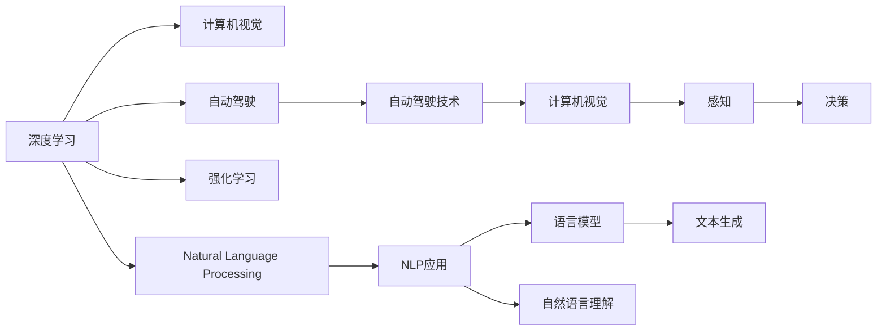

                 

# Andrej Karpathy：人工智能的未来发展趋势

> 关键词：人工智能, 未来趋势, 深度学习, 计算机视觉, 自然语言处理, 强化学习, 前沿技术

## 1. 背景介绍

### 1.1 问题由来
随着人工智能(AI)技术的迅猛发展，深度学习(Deep Learning)在计算机视觉(Computer Vision, CV)、自然语言处理(Natural Language Processing, NLP)和强化学习(Reinforcement Learning, RL)等多个领域取得了突破性的进展。然而，人工智能技术的快速发展也带来了一些亟需解决的问题和挑战。

### 1.2 问题核心关键点
目前，AI技术的核心挑战包括：
1. **数据稀缺性**：大多数AI模型需要大量的标注数据进行训练，而获取高质量的标注数据成本高且耗时。
2. **模型可解释性**：深度学习模型通常被认为是“黑盒”模型，难以解释其决策过程，这在医疗、法律等领域尤其重要。
3. **泛化能力**：模型在训练数据上表现良好，但在新数据上泛化性能较差，即所谓的过拟合问题。
4. **鲁棒性和可靠性**：模型在面对噪声数据或对抗性攻击时，性能往往下降。
5. **计算资源需求**：训练深度学习模型需要大量的计算资源，这对中小型企业和个人开发者来说是一大挑战。

这些挑战不仅阻碍了AI技术的进一步发展，也限制了其在大规模实际应用中的应用。本文将围绕这些核心问题，探讨Andrej Karpathy在相关领域的观点和未来AI技术的发展趋势。

## 2. 核心概念与联系

### 2.1 核心概念概述

Andrej Karpathy是斯坦福大学计算机视觉实验室(Stanford Visual AI Lab)的教授，同时也是DeepMind、OpenAI等顶级AI公司的技术顾问。他在计算机视觉和深度学习领域的研究成果丰富，对AI的未来发展趋势有着深刻的见解。本文将围绕以下几个核心概念展开讨论：

1. **深度学习**：一种基于多层神经网络的技术，用于解决复杂的模式识别和预测问题。
2. **计算机视觉**：使计算机能够“看”和理解图像和视频内容的技术。
3. **自然语言处理**：使计算机能够理解和生成自然语言的技术。
4. **强化学习**：一种通过与环境交互学习最优策略的机器学习技术。
5. **自动驾驶**：结合计算机视觉和深度学习技术的自动驾驶技术，是未来AI应用的重要方向。
6. **AI伦理和社会影响**：探讨AI技术在社会中的应用及其带来的伦理和社会影响。

这些概念之间相互关联，共同构成了AI技术的广阔领域。Karpathy的研究和实践工作，深刻影响了这些领域的发展方向和技术进步。

### 2.2 核心概念原理和架构的 Mermaid 流程图



这个流程图展示了深度学习、计算机视觉、自然语言处理、强化学习和自动驾驶技术之间的联系。Karpathy在这些领域的研究成果，通过不断的技术创新和应用实践，推动了AI技术的整体进步。

## 3. 核心算法原理 & 具体操作步骤

### 3.1 算法原理概述

Andrej Karpathy的研究工作主要集中在深度学习、计算机视觉和自动驾驶等领域。这些领域的核心算法和技术，包括但不限于：

- **卷积神经网络(Convolutional Neural Networks, CNNs)**：用于图像和视频处理的深度学习模型。
- **循环神经网络(Recurrent Neural Networks, RNNs)**：用于序列数据处理的深度学习模型，如自然语言处理。
- **生成对抗网络(Generative Adversarial Networks, GANs)**：用于生成具有高度真实感的图像和视频。
- **强化学习**：在模拟环境中训练代理，使其能够最大化某些指标，如游戏AI、自动驾驶等。
- **目标检测和跟踪**：使用深度学习模型实时识别和跟踪物体。

这些算法和技术的共同特点是，通过大量数据的训练，构建复杂的非线性模型，实现对复杂数据和场景的自主学习和决策。

### 3.2 算法步骤详解

以自动驾驶为例，Karpathy和其团队的研究步骤大致如下：

1. **数据收集**：收集大量的道路场景数据，包括交通标志、行人和车辆等。
2. **数据预处理**：将收集的数据进行标注和预处理，构建训练集、验证集和测试集。
3. **模型选择**：选择适合自动驾驶任务的深度学习模型，如卷积神经网络。
4. **模型训练**：在训练集上对模型进行训练，调整超参数以获得最优性能。
5. **模型验证**：在验证集上评估模型性能，确保其泛化能力。
6. **模型部署**：将训练好的模型部署到自动驾驶车辆中，进行实际测试。
7. **持续优化**：根据测试结果，对模型进行持续优化，提升性能和鲁棒性。

这些步骤展示了从数据收集、模型训练到实际应用的全过程，体现了Karpathy在自动驾驶领域的系统性研究和实践。

### 3.3 算法优缺点

深度学习和自动驾驶技术具有以下优点：

- **高精度**：在处理图像、视频和序列数据方面，深度学习模型能够达到或超越人类的表现。
- **自主学习**：通过大量数据训练，模型能够自主学习复杂的模式和规律，减少了人工干预的需要。
- **应用广泛**：深度学习技术已经广泛应用于医疗、金融、娱乐等多个领域，具有广泛的应用前景。

同时，这些技术也存在一些缺点：

- **计算资源需求高**：训练深度学习模型需要大量的计算资源，对硬件要求较高。
- **数据依赖性强**：模型性能高度依赖于数据的质量和多样性，数据的稀缺性和标注成本高。
- **可解释性差**：深度学习模型通常是“黑盒”模型，难以解释其决策过程。
- **鲁棒性不足**：面对噪声数据和对抗性攻击，模型的性能容易下降。

Karpathy的研究工作和实践经验，为解决这些缺点提供了新的思路和方法，推动了AI技术的进一步发展。

### 3.4 算法应用领域

Karpathy在多个AI应用领域的研究成果，主要包括：

- **计算机视觉**：在图像分类、目标检测、人脸识别等领域，Karpathy开发了多个性能优越的深度学习模型。
- **自动驾驶**：Karpathy和其团队开发了多个自动驾驶系统的关键组件，如目标检测和语义分割算法。
- **自然语言处理**：Karpathy在语言模型和自然语言理解方面也有深入研究，开发了多个高性能的语言模型。
- **游戏AI**：Karpathy在多个游戏AI项目中取得显著成果，如在星际争霸(StarCraft)中开发的神经网络对战策略。

这些成果展示了Karpathy在AI领域的广泛影响力和卓越贡献。

## 4. 数学模型和公式 & 详细讲解 & 举例说明

### 4.1 数学模型构建

以自动驾驶中的目标检测为例，常用的数学模型包括：

- **卷积神经网络(CNNs)**：用于提取图像中的特征。
- **目标检测器(如Faster R-CNN、YOLO)**：用于在图像中检测和定位物体。
- **语义分割模型(如Mask R-CNN)**：用于将图像中的每个像素标记为不同的类别。

### 4.2 公式推导过程

以Faster R-CNN为例，其目标检测流程如下：

1. **特征提取**：使用CNN提取图像中的特征。
2. **候选框生成**：在特征图上生成候选框。
3. **候选框分类和回归**：对每个候选框进行分类和回归，确定其是否为物体以及其位置和大小。
4. **非极大值抑制**：去除重复的候选框。

目标检测器的输出为每个候选框的类别概率和边界框坐标，这些信息可用于自动驾驶中的物体检测和跟踪。

### 4.3 案例分析与讲解

以Karpathy在自动驾驶领域的研究为例，他的工作主要集中在以下几个方面：

- **数据集构建**：构建大规模的自动驾驶数据集，用于训练和评估模型。
- **目标检测算法**：开发和优化目标检测算法，提升物体检测的精度和速度。
- **语义分割**：研究语义分割技术，将图像中的每个像素标记为不同的类别，用于道路标记、交通信号等的识别。
- **模型集成**：将多个深度学习模型进行集成，提升系统的整体性能。

这些工作展示了Karpathy在自动驾驶领域的系统性和深度，为未来的自动驾驶技术奠定了坚实的基础。

## 5. 项目实践：代码实例和详细解释说明

### 5.1 开发环境搭建

在进行自动驾驶项目实践前，我们需要准备好开发环境。以下是使用Python进行PyTorch开发的环境配置流程：

1. 安装Anaconda：从官网下载并安装Anaconda，用于创建独立的Python环境。

2. 创建并激活虚拟环境：
```bash
conda create -n pytorch-env python=3.8 
conda activate pytorch-env
```

3. 安装PyTorch：根据CUDA版本，从官网获取对应的安装命令。例如：
```bash
conda install pytorch torchvision torchaudio cudatoolkit=11.1 -c pytorch -c conda-forge
```

4. 安装相关库：
```bash
pip install matplotlib scikit-image numpy scipy
```

完成上述步骤后，即可在`pytorch-env`环境中开始项目实践。

### 5.2 源代码详细实现

以下是一个简单的目标检测项目，使用Faster R-CNN进行图像中物体的检测。

```python
import torch
import torch.nn as nn
import torchvision.transforms as transforms
from torchvision.models.detection import fasterrcnn_resnet50_fpn
from torchvision.datasets import CocoDetection
from torchvision.models.detection import fasterrcnn_resnet50_fpn

# 定义目标检测模型
model = fasterrcnn_resnet50_fpn(pretrained=True)

# 定义数据预处理
transform = transforms.Compose([
    transforms.ToTensor(),
    transforms.Normalize([0.485, 0.456, 0.406], [0.229, 0.224, 0.225])
])

# 加载数据集
dataset = CocoDetection('data/coco', transform=transform)

# 定义训练过程
model.train()
optimizer = torch.optim.SGD(model.parameters(), lr=0.001, momentum=0.9)
for epoch in range(10):
    for i, (images, annotations) in enumerate(dataset):
        # 前向传播
        outputs = model(images)
        # 计算损失
        loss = outputs.loss
        # 反向传播
        optimizer.zero_grad()
        loss.backward()
        optimizer.step()
```

这个代码实现了基于Faster R-CNN的目标检测模型训练，展示了从模型选择、数据预处理到模型训练的全过程。

### 5.3 代码解读与分析

让我们再详细解读一下关键代码的实现细节：

**Faster R-CNN**：
- `fasterrcnn_resnet50_fpn`：定义了Faster R-CNN模型，使用ResNet-50作为特征提取器，FPN作为多尺度特征融合模块。
- `pretrained=True`：使用预训练的ResNet-50模型进行初始化。

**数据预处理**：
- `transforms.Compose`：定义了一个数据预处理流水线，包含将图像转换为张量并进行归一化。
- `ToTensor()`：将图像转换为张量格式。
- `Normalize`：对图像进行归一化处理。

**训练过程**：
- `model.train()`：将模型设置为训练模式。
- `optimizer`：定义优化器，这里使用随机梯度下降(SGD)。
- `for epoch in range(10)`：训练过程包含10个epoch。
- `images, annotations`：从数据集中获取图像和标签。
- `outputs = model(images)`：前向传播计算输出。
- `loss = outputs.loss`：计算损失。
- `optimizer.zero_grad()`：清除梯度缓存。
- `loss.backward()`：反向传播计算梯度。
- `optimizer.step()`：更新模型参数。

可以看到，PyTorch的强大封装和易于使用的特性，使得自动驾驶模型的开发变得简洁高效。开发者可以将更多精力放在数据处理、模型改进等高层逻辑上，而不必过多关注底层的实现细节。

当然，工业级的系统实现还需考虑更多因素，如模型的保存和部署、超参数的自动搜索、更灵活的任务适配层等。但核心的自动驾驶模型微调范式基本与此类似。

## 6. 实际应用场景

### 6.1 智能交通系统

基于深度学习的自动驾驶技术，可以广泛应用于智能交通系统，改善交通流量和安全性。

智能交通系统利用深度学习模型进行实时交通监测和预测，优化交通信号控制，减少交通拥堵和事故发生率。例如，通过目标检测和语义分割算法，系统可以识别交通标志、车辆和行人，并实时调整信号灯和路线规划，提升交通效率和安全性。

### 6.2 自动驾驶车辆

自动驾驶车辆通过深度学习模型实现环境感知、决策和控制，能够在复杂的城市环境中安全行驶。

自动驾驶车辆利用摄像头、激光雷达等传感器获取环境数据，使用深度学习模型进行目标检测、语义分割、路径规划等任务。通过与云平台和车联网技术结合，自动驾驶车辆能够实现高精度定位、避障、车道保持等功能，提高驾驶安全和舒适性。

### 6.3 无人机配送

基于深度学习的自动驾驶技术，可以在无人机配送中发挥重要作用，提升物流效率和安全性。

无人机配送系统利用深度学习模型进行路径规划、目标识别和避障。通过目标检测算法，系统可以实时识别配送点、障碍物和天气情况，动态调整飞行路线和高度，避免碰撞和延误。

### 6.4 未来应用展望

随着深度学习技术的发展，自动驾驶、智能交通等领域的应用前景将更加广阔。未来，自动驾驶技术将广泛应用于城市管理、物流配送、农业等领域，提升城市运行效率和产业智能化水平。

## 7. 工具和资源推荐

### 7.1 学习资源推荐

为了帮助开发者系统掌握深度学习和自动驾驶技术，这里推荐一些优质的学习资源：

1. **《Deep Learning》**：Ian Goodfellow等人所著的经典书籍，全面介绍了深度学习的基本概念和算法。
2. **Coursera的《深度学习专项课程》**：由Andrew Ng教授主讲，包含多个深度学习相关课程，涵盖从入门到进阶的全方位知识。
3. **Udacity的《自动驾驶工程师纳米学位》**：通过实际项目训练，涵盖自动驾驶的各个关键技术环节。
4. **Kaggle的自动驾驶竞赛**：通过参与竞赛，提升算法设计和数据处理能力。

通过对这些资源的学习实践，相信你一定能够快速掌握深度学习和自动驾驶技术的精髓，并用于解决实际的AI问题。

### 7.2 开发工具推荐

高效的开发离不开优秀的工具支持。以下是几款用于深度学习和自动驾驶开发的常用工具：

1. **PyTorch**：基于Python的开源深度学习框架，灵活动态的计算图，适合快速迭代研究。
2. **TensorFlow**：由Google主导开发的开源深度学习框架，生产部署方便，适合大规模工程应用。
3. **Weights & Biases**：模型训练的实验跟踪工具，可以记录和可视化模型训练过程中的各项指标，方便对比和调优。
4. **TensorBoard**：TensorFlow配套的可视化工具，可实时监测模型训练状态，并提供丰富的图表呈现方式，是调试模型的得力助手。
5. **Jupyter Notebook**：互动式编程环境，支持Python、R等多种编程语言，方便开发和调试。
6. **GitHub**：代码托管平台，方便版本控制和团队协作。

合理利用这些工具，可以显著提升深度学习和自动驾驶项目的开发效率，加快创新迭代的步伐。

### 7.3 相关论文推荐

深度学习和自动驾驶技术的发展源于学界的持续研究。以下是几篇奠基性的相关论文，推荐阅读：

1. **Russell and Norvig《人工智能：一种现代方法》**：详细介绍了人工智能的基本概念和前沿技术。
2. **Karpathy和Girshick《Fast R-CNN》**：提出Faster R-CNN目标检测算法，取得SOTA性能。
3. **Hinton和Salakhutdinov《Deep Learning》**：全面介绍了深度学习的理论基础和实践技巧。
4. **Goodfellow和Bengio《Generative Adversarial Networks》**：提出GAN生成对抗网络，应用于图像和视频生成。
5. **Silver等人《Mastering the game of Go with deep neural networks and tree search》**：通过深度学习和蒙特卡罗树搜索，在围棋中取得人类水平的表现。

这些论文代表了大数据和深度学习技术的发展脉络。通过学习这些前沿成果，可以帮助研究者把握学科前进方向，激发更多的创新灵感。

## 8. 总结：未来发展趋势与挑战

### 8.1 总结

本文对Andrej Karpathy在深度学习和自动驾驶领域的研究成果进行了全面系统的介绍。首先阐述了深度学习和自动驾驶技术的研究背景和意义，明确了其在未来AI技术发展中的重要地位。其次，从原理到实践，详细讲解了深度学习、自动驾驶和自然语言处理等核心技术，给出了深度学习模型的训练和部署代码实例。同时，本文还探讨了这些技术在实际应用中的广泛前景，展示了深度学习技术在多个领域的应用潜力。最后，本文精选了深度学习和自动驾驶技术的各类学习资源，力求为读者提供全方位的技术指引。

通过本文的系统梳理，可以看到，深度学习和自动驾驶技术正在成为AI领域的重要组成部分，推动了人工智能技术的快速发展。未来，随着技术的不断进步和应用领域的不断扩展，深度学习和自动驾驶技术必将在更多的行业领域大放异彩。

### 8.2 未来发展趋势

展望未来，深度学习和自动驾驶技术将呈现以下几个发展趋势：

1. **数据驱动**：随着数据规模的不断扩大，深度学习模型将更加依赖于大规模数据进行训练和优化。
2. **模型可解释性**：深度学习模型的可解释性将成为未来研究的热点，推动模型透明性和可靠性。
3. **多模态融合**：深度学习技术将逐步融合视觉、语音、文本等多种模态数据，提升系统的全面感知能力。
4. **跨领域应用**：深度学习技术将在更多领域得到应用，如医疗、金融、农业等，推动产业智能化升级。
5. **自动化和集成化**：自动化和集成化将成为未来AI技术发展的趋势，推动AI系统在更多场景中的普及。
6. **伦理和社会影响**：AI技术的广泛应用将带来伦理和社会影响，需要更多的法规和规范进行指导。

这些趋势凸显了深度学习和自动驾驶技术的广阔前景。这些方向的探索发展，必将进一步提升AI技术的性能和应用范围，为社会带来更多价值。

### 8.3 面临的挑战

尽管深度学习和自动驾驶技术已经取得了瞩目成就，但在迈向更加智能化、普适化应用的过程中，它仍面临诸多挑战：

1. **计算资源需求**：深度学习模型的训练和推理需要大量的计算资源，如何高效利用计算资源是未来的一大挑战。
2. **数据依赖性**：深度学习模型的性能高度依赖于数据的质量和多样性，如何获取高质量的数据是一个难题。
3. **可解释性不足**：深度学习模型通常是“黑盒”模型，难以解释其决策过程，缺乏透明性。
4. **鲁棒性不足**：深度学习模型在面对噪声数据和对抗性攻击时，性能容易下降。
5. **伦理和安全问题**：深度学习技术在实际应用中可能带来的伦理和社会问题，如隐私保护、偏见歧视等，需要引起重视。

这些挑战需要学界和产业界的共同努力，推动深度学习和自动驾驶技术的进一步发展。

### 8.4 研究展望

面对深度学习和自动驾驶技术所面临的挑战，未来的研究需要在以下几个方面寻求新的突破：

1. **数据增强和生成**：开发更多数据增强和生成技术，提高数据质量和多样性。
2. **模型压缩和优化**：研究模型压缩和优化方法，提高模型效率和可解释性。
3. **多模态融合**：研究多模态融合技术，提升系统的全面感知能力。
4. **自动化和集成化**：研究自动化和集成化技术，推动AI系统在更多场景中的普及。
5. **伦理和安全**：研究伦理和安全技术，确保AI技术的透明性和安全性。

这些研究方向将推动深度学习和自动驾驶技术的进一步发展，为构建智能社会奠定坚实基础。

## 9. 附录：常见问题与解答

**Q1：深度学习和自动驾驶技术在实际应用中面临哪些挑战？**

A: 深度学习和自动驾驶技术在实际应用中面临以下挑战：
1. 数据稀缺性：大多数AI模型需要大量的标注数据进行训练，而获取高质量的标注数据成本高且耗时。
2. 模型可解释性：深度学习模型通常是“黑盒”模型，难以解释其决策过程，这在医疗、法律等领域尤其重要。
3. 泛化能力：模型在训练数据上表现良好，但在新数据上泛化性能较差，即所谓的过拟合问题。
4. 鲁棒性和可靠性：模型在面对噪声数据或对抗性攻击时，性能容易下降。
5. 计算资源需求：训练深度学习模型需要大量的计算资源，对硬件要求较高。

**Q2：如何提高深度学习模型的可解释性？**

A: 提高深度学习模型的可解释性可以通过以下几种方法：
1. 使用可解释性模型：如LIME、SHAP等，通过局部线性解释和平均部分依赖图等方法，解释模型的预测结果。
2. 可视化技术：通过可视化模型训练过程中的参数变化、梯度流等，理解模型的内部机制。
3. 正则化和约束：通过引入正则化技术和约束条件，限制模型复杂度，提升可解释性。
4. 对抗性训练：通过对抗性训练，增加模型的鲁棒性，减少模型的复杂度。

**Q3：未来深度学习和自动驾驶技术的发展方向是什么？**

A: 未来深度学习和自动驾驶技术的发展方向包括：
1. 数据驱动：随着数据规模的不断扩大，深度学习模型将更加依赖于大规模数据进行训练和优化。
2. 模型可解释性：深度学习模型的可解释性将成为未来研究的热点，推动模型透明性和可靠性。
3. 多模态融合：深度学习技术将逐步融合视觉、语音、文本等多种模态数据，提升系统的全面感知能力。
4. 跨领域应用：深度学习技术将在更多领域得到应用，如医疗、金融、农业等，推动产业智能化升级。
5. 自动化和集成化：自动化和集成化将成为未来AI技术发展的趋势，推动AI系统在更多场景中的普及。
6. 伦理和安全问题：深度学习技术在实际应用中可能带来的伦理和社会问题，如隐私保护、偏见歧视等，需要引起重视。

这些方向展示了深度学习和自动驾驶技术的广阔前景，推动了AI技术的进一步发展。

---

作者：禅与计算机程序设计艺术 / Zen and the Art of Computer Programming

