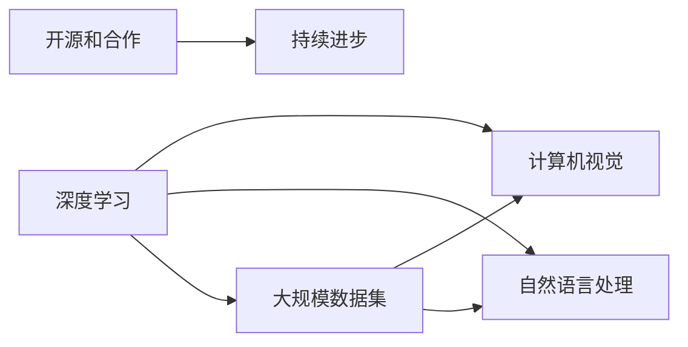

                 

# Andrej Karpathy：继续推动你的项目，也许它们会发展成一个真正的大雪球

## 1. 背景介绍

### 1.1 问题由来

Andrej Karpathy，作为机器学习领域的领军人物，他的许多工作为人工智能的发展开辟了新的道路。从深度学习模型的设计到计算机视觉的突破，他的研究不仅推动了技术的进步，也深刻影响了业界的发展方向。然而，他的工作往往带有强烈的探索性和实验性，其项目通常具有跨学科的广泛性和创新性。本文旨在深入探讨Karpathy的项目特点及其背后的创新思维，以及这些项目可能带来的长远影响。

### 1.2 问题核心关键点

Karpathy的项目通常包含以下几个核心关键点：
1. **跨学科融合**：他善于将多个学科的知识融合到自己的研究中，形成独特的创新体系。
2. **大尺度实验**：他的项目往往涉及大规模数据集和计算资源的利用，通过实验验证和优化算法。
3. **开源和合作**：Karpathy热衷于通过开源和合作方式推动技术的普及和应用。
4. **长期影响力**：他的工作不仅为当时的学术研究带来突破，也为未来的技术发展奠定了基础。

这些关键点不仅展示了Karpathy的创新思维和研究风格，也体现了他在推动技术发展方面的影响力。通过深入理解这些特点，我们能够更好地把握Karpathy项目的核心价值。

## 2. 核心概念与联系

### 2.1 核心概念概述

为了更好地理解Karpathy的工作，我们需要首先介绍几个关键概念及其相互关系：

1. **深度学习**：一种通过多层神经网络进行训练和预测的技术，旨在模仿人类大脑的工作方式，实现对复杂数据的高效处理。
2. **计算机视觉**：研究如何让计算机能够"看"和理解视觉信息，包括图像识别、物体检测、场景理解等。
3. **自然语言处理**：让计算机能够理解、处理和生成人类语言，包括机器翻译、语音识别、文本生成等。
4. **大规模数据集**：指在深度学习训练中使用的海量数据集，如ImageNet、COCO等。
5. **开源和合作**：通过开放源代码和合作研究的方式，推动技术的快速发展和广泛应用。

这些概念共同构成了Karpathy研究的核心领域，并在其项目中得以体现和创新。

### 2.2 核心概念原理和架构的 Mermaid 流程图



这个流程图展示了Karpathy研究的核心概念及其相互关系：
- 深度学习是计算机视觉和自然语言处理的基础。
- 大规模数据集是深度学习训练的关键。
- 开源和合作推动了深度学习的持续进步。

## 3. 核心算法原理 & 具体操作步骤

### 3.1 算法原理概述

Karpathy的研究通常集中在如何利用深度学习模型进行图像识别、物体检测和自然语言处理等任务。他的工作涉及的算法原理主要包括：

1. **卷积神经网络(CNNs)**：用于图像处理和物体检测，通过卷积和池化操作提取特征。
2. **循环神经网络(RNNs)**：用于处理序列数据，如文本和语音，通过时间维度上的信息传递和记忆实现。
3. **Transformer模型**：在自然语言处理中，Transformer模型通过自注意力机制实现了对长文本序列的快速处理和理解。

这些算法原理构成了Karpathy研究的基础，也是他能够不断创新和突破的重要工具。

### 3.2 算法步骤详解

Karpathy的项目通常包含以下步骤：
1. **数据收集和预处理**：收集大规模标注数据集，进行清洗和预处理，确保数据的质量和多样性。
2. **模型设计和训练**：设计合适的深度学习模型架构，使用大规模数据集进行训练，优化模型参数。
3. **实验验证和优化**：在验证集上评估模型性能，进行超参数调优，提高模型准确性和泛化能力。
4. **开源和合作**：将研究成果发布为开源代码，与学术界和工业界进行合作，推动技术普及和应用。

### 3.3 算法优缺点

Karpathy的研究方法具有以下优点：
1. **创新性**：他善于结合不同学科的知识，提出新颖的算法和模型。
2. **高效性**：通过大规模数据集和计算资源的利用，实现了快速迭代和优化。
3. **广泛性**：他的工作涉及多个领域，展示了深度学习技术的广泛应用潜力。

同时，也存在一些局限性：
1. **资源需求高**：大规模数据集和计算资源的需求使得项目实施成本较高。
2. **实验复杂**：实验设计和调优过程复杂，需要丰富的领域知识和经验。
3. **可解释性不足**：深度学习模型往往缺乏可解释性，难以解释其内部工作机制。

尽管存在这些局限性，Karpathy的项目依然在推动深度学习技术的发展，展示了其在理论研究和实际应用中的强大实力。

### 3.4 算法应用领域

Karpathy的项目广泛应用在以下几个领域：

- **自动驾驶**：通过计算机视觉和深度学习技术，实现车辆自主导航和决策。
- **医学影像分析**：利用深度学习模型对医学影像进行自动分析和诊断。
- **自然语言理解**：通过自然语言处理技术，实现文本分类、情感分析和对话系统等应用。
- **教育技术**：利用深度学习模型优化在线教育内容推荐和个性化学习路径。

这些应用领域展示了深度学习技术在实际生活中的广泛影响和巨大潜力。

## 4. 数学模型和公式 & 详细讲解 & 举例说明

### 4.1 数学模型构建

在Karpathy的研究中，数学模型构建是其核心之一。以下以卷积神经网络(CNNs)为例，展示其构建过程：

假设输入图像大小为 $H \times W \times C$，输出类别数为 $K$，卷积神经网络的结构如图：


其中，卷积层通过滑动卷积核提取特征，池化层通过降采样减少参数量和计算量，全连接层将特征向量映射到输出类别空间。

### 4.2 公式推导过程

以卷积神经网络中的卷积操作为例，假设输入特征图大小为 $H \times W$，卷积核大小为 $F \times F$，步长为 $S$，卷积核权重为 $\mathbf{W}$，则卷积操作可以表示为：

$$
\mathbf{X}_{i,j} = \sum_{m,n}\mathbf{W}_{m,n} \cdot \mathbf{X}_{i-m,j-n}
$$

其中，$X_{i,j}$ 表示输出特征图在位置 $(i,j)$ 的卷积结果，$W_{m,n}$ 表示卷积核在位置 $(m,n)$ 的权重。

### 4.3 案例分析与讲解

假设有一个手写数字识别任务，使用CNN模型进行训练。首先，将手写数字图像作为输入，通过多个卷积层提取特征，再通过池化层减少参数量和计算量，最后通过全连接层将特征向量映射到10个数字类别。在训练过程中，使用交叉熵损失函数进行优化，通过反向传播算法更新模型参数。

## 5. 项目实践：代码实例和详细解释说明

### 5.1 开发环境搭建

Karpathy的项目通常使用TensorFlow或PyTorch进行实现，以下是使用TensorFlow搭建项目环境的示例：

1. 安装Anaconda：从官网下载并安装Anaconda，用于创建独立的Python环境。

2. 创建并激活虚拟环境：
```bash
conda create -n tf-env python=3.8 
conda activate tf-env
```

3. 安装TensorFlow：根据CUDA版本，从官网获取对应的安装命令。例如：
```bash
conda install tensorflow -c tf -c conda-forge
```

4. 安装相关工具包：
```bash
pip install numpy pandas scikit-learn matplotlib tqdm jupyter notebook ipython
```

完成上述步骤后，即可在`tf-env`环境中开始项目实践。

### 5.2 源代码详细实现

以下以TensorFlow实现手写数字识别为例，展示代码实现过程：

```python
import tensorflow as tf
from tensorflow import keras
import numpy as np
import matplotlib.pyplot as plt

# 加载手写数字数据集
mnist = keras.datasets.mnist
(train_images, train_labels), (test_images, test_labels) = mnist.load_data()

# 数据预处理
train_images = train_images / 255.0
test_images = test_images / 255.0

# 定义模型
model = keras.Sequential([
    keras.layers.Flatten(input_shape=(28, 28)),
    keras.layers.Dense(128, activation='relu'),
    keras.layers.Dense(10)
])

# 编译模型
model.compile(optimizer='adam',
              loss=tf.keras.losses.SparseCategoricalCrossentropy(from_logits=True),
              metrics=['accuracy'])

# 训练模型
model.fit(train_images, train_labels, epochs=10, validation_data=(test_images, test_labels))

# 评估模型
test_loss, test_acc = model.evaluate(test_images,  test_labels, verbose=2)
print('\nTest accuracy:', test_acc)
```

### 5.3 代码解读与分析

以上代码展示了使用TensorFlow进行手写数字识别任务的全过程，从数据加载、预处理到模型定义、编译、训练和评估。可以看到，TensorFlow提供了便捷的API，使得模型开发和训练过程变得非常简单。

## 6. 实际应用场景

### 6.1 自动驾驶

Karpathy在自动驾驶领域的研究，主要集中在计算机视觉和深度学习技术的应用上。他开发了多个自动驾驶相关项目，包括使用计算机视觉技术进行道路场景识别和行人检测，以及利用深度学习模型进行路径规划和决策制定。这些工作为自动驾驶技术的进一步发展奠定了坚实基础。

### 6.2 医学影像分析

在医学影像分析领域，Karpathy研究了如何利用深度学习模型对医学影像进行自动分析和诊断。他的项目展示了深度学习技术在医学图像处理和疾病诊断中的巨大潜力，为医疗影像的智能化处理提供了新的思路。

### 6.3 自然语言理解

在自然语言理解领域，Karpathy研究了如何使用深度学习模型进行文本分类、情感分析和对话系统等任务。他的项目展示了深度学习在自然语言处理中的应用潜力，为自然语言理解和生成技术的发展提供了重要参考。

### 6.4 未来应用展望

未来，Karpathy的研究将继续推动深度学习技术的突破和发展，为计算机视觉、自然语言处理和自动驾驶等多个领域带来新的突破。

- **计算机视觉**：未来的计算机视觉技术将更加智能和自动化，能够更好地理解和处理复杂场景。
- **自然语言处理**：未来的自然语言处理技术将更加个性化和人性化，能够更好地理解和生成自然语言。
- **自动驾驶**：未来的自动驾驶技术将更加安全和可靠，能够更好地适应复杂多变的道路环境。

## 7. 工具和资源推荐

### 7.1 学习资源推荐

为了帮助开发者系统掌握深度学习技术的理论基础和实践技巧，这里推荐一些优质的学习资源：

1. 《深度学习》系列书籍：由Ian Goodfellow、Yoshua Bengio和Aaron Courville合著，系统介绍了深度学习的理论基础和实践应用。
2. Coursera《深度学习专项课程》：斯坦福大学开设的深度学习课程，涵盖深度学习的基础理论和实际应用，适合初学者和进阶者。
3. TensorFlow官方文档：TensorFlow的官方文档，提供了丰富的API文档和代码示例，是学习TensorFlow的重要资源。
4. PyTorch官方文档：PyTorch的官方文档，提供了详细的API文档和代码示例，是学习PyTorch的重要资源。
5. GitHub上的开源项目：GitHub上有大量的开源深度学习项目，可以从中学习和借鉴。

通过对这些资源的学习实践，相信你一定能够系统掌握深度学习技术的精髓，并用于解决实际的工程问题。

### 7.2 开发工具推荐

高效的工具是成功项目的基础，以下是几款常用的深度学习开发工具：

1. TensorFlow：由Google开发的开源深度学习框架，生产部署方便，适合大规模工程应用。
2. PyTorch：Facebook开发的开源深度学习框架，灵活易用，适合快速迭代研究。
3. Keras：高层次的深度学习API，易于上手，适合快速开发原型和实验。
4. Jupyter Notebook：交互式编程环境，支持Python和TensorFlow等深度学习框架，适合进行实验和报告编写。

合理利用这些工具，可以显著提升深度学习项目的开发效率，加速技术创新和应用落地。

### 7.3 相关论文推荐

深度学习技术的发展离不开学界的持续研究。以下是几篇奠基性的相关论文，推荐阅读：

1. AlexNet：提出了深度卷积神经网络架构，开创了深度学习在图像识别领域的应用。
2. Inception：提出了Inception模块，提高了深度卷积神经网络的计算效率和表达能力。
3. ResNet：提出了残差网络结构，解决了深度神经网络中的梯度消失问题，推动了深度学习的发展。
4. Transformer：提出了自注意力机制，实现了对长序列文本的快速处理和理解，推动了自然语言处理技术的发展。
5. Attention is All You Need：提出了Transformer架构，在自然语言处理任务中取得了突破性成果。

这些论文代表了大尺度实验的典型案例，展示了深度学习技术的创新潜力和应用前景。

## 8. 总结：未来发展趋势与挑战

### 8.1 研究成果总结

本文对Karpathy的研究方法进行了全面系统的介绍，主要内容包括：
1. **跨学科融合**：通过将计算机视觉和自然语言处理等学科的知识融合到深度学习研究中，实现了技术的多领域应用。
2. **大尺度实验**：通过大规模数据集和计算资源的利用，实现了快速迭代和优化，推动了深度学习技术的突破。
3. **开源和合作**：通过开放源代码和合作研究的方式，推动了深度学习技术的普及和应用。

### 8.2 未来发展趋势

展望未来，深度学习技术将继续在多个领域带来新的突破和应用：

1. **自动化**：未来的计算机视觉和自然语言处理技术将更加智能化和自动化，能够更好地理解和处理复杂数据。
2. **实时性**：未来的深度学习应用将更加注重实时性，能够快速响应和处理实时数据流。
3. **多模态融合**：未来的深度学习模型将更好地整合多模态数据，实现视觉、语音、文本等多种信息的协同处理。
4. **泛化性**：未来的深度学习模型将具备更强的泛化能力，能够适应不同领域和不同任务的要求。
5. **可解释性**：未来的深度学习模型将具备更好的可解释性，能够更好地理解和解释其内部工作机制和决策逻辑。

### 8.3 面临的挑战

尽管深度学习技术已经取得了瞩目成就，但在迈向更加智能化、普适化应用的过程中，仍面临诸多挑战：

1. **数据稀缺**：在深度学习训练中，高质量、大规模的数据是必不可少的，但获取和标注这些数据成本高昂。
2. **计算资源限制**：深度学习模型的训练和推理需要大量的计算资源，高性能设备的高昂成本和维护成本也是一大挑战。
3. **模型复杂性**：深度学习模型的复杂性使得其难以解释和调试，缺乏可解释性。
4. **安全和伦理**：深度学习模型在应用过程中可能出现偏见和有害输出，伦理和安全问题不容忽视。
5. **数据隐私**：深度学习模型的训练和使用过程中可能涉及用户隐私数据，如何保护数据隐私是一个重要课题。

### 8.4 研究展望

面对这些挑战，未来的研究需要在以下几个方面寻求新的突破：

1. **数据增强**：通过数据增强技术，在有限的标注数据下提高模型性能。
2. **模型压缩**：通过模型压缩技术，降低模型复杂性，提高计算效率和实时性。
3. **可解释性增强**：通过可解释性增强技术，提高模型的可解释性和可解释性。
4. **伦理安全**：通过伦理安全和隐私保护技术，确保深度学习模型的安全和可靠性。
5. **多模态融合**：通过多模态融合技术，实现视觉、语音、文本等多种信息的协同处理。

这些研究方向展示了未来深度学习技术的发展方向，通过多路径协同发力，必将进一步推动人工智能技术的发展和应用。

## 9. 附录：常见问题与解答

**Q1：如何评估深度学习模型的性能？**

A: 深度学习模型的性能通常通过以下指标进行评估：
1. **准确率(Accuracy)**：模型在测试集上的正确率，适用于分类任务。
2. **精确率(Precision)**：模型预测为正类样本中实际为正类的比例，适用于需要控制假正例率的场景。
3. **召回率(Recall)**：实际为正类样本中被模型预测为正类的比例，适用于需要控制假负例率的场景。
4. **F1分数(F1 Score)**：精确率和召回率的调和平均数，综合了模型在正负样本上的表现。

**Q2：如何优化深度学习模型的训练过程？**

A: 深度学习模型的训练过程可以通过以下方法进行优化：
1. **超参数调优**：通过网格搜索、随机搜索等方式优化模型超参数，如学习率、批大小、迭代次数等。
2. **数据增强**：通过数据增强技术扩充训练集，提高模型的泛化能力。
3. **正则化**：通过L1、L2正则化等方法，防止过拟合，提高模型的泛化能力。
4. **模型压缩**：通过剪枝、量化、蒸馏等方法，降低模型复杂度，提高计算效率。

**Q3：深度学习模型在实际应用中需要注意哪些问题？**

A: 深度学习模型在实际应用中需要注意以下问题：
1. **数据隐私**：保护用户隐私数据，防止数据泄露。
2. **模型解释性**：提高模型的可解释性，确保输出符合人类价值观和伦理道德。
3. **鲁棒性**：提高模型的鲁棒性，防止对抗攻击和模型泛化能力不足。
4. **性能优化**：优化模型性能，提升计算效率和实时性。

**Q4：如何评估深度学习模型在实际应用中的效果？**

A: 深度学习模型在实际应用中的效果可以通过以下方法进行评估：
1. **在线A/B测试**：通过在线A/B测试比较新旧模型的表现，确保新模型优于旧模型。
2. **用户体验调研**：通过用户调研了解模型在实际应用中的表现和用户满意度。
3. **业务指标**：通过业务指标评估模型的实际应用效果，如转化率、满意度等。

---

作者：禅与计算机程序设计艺术 / Zen and the Art of Computer Programming

